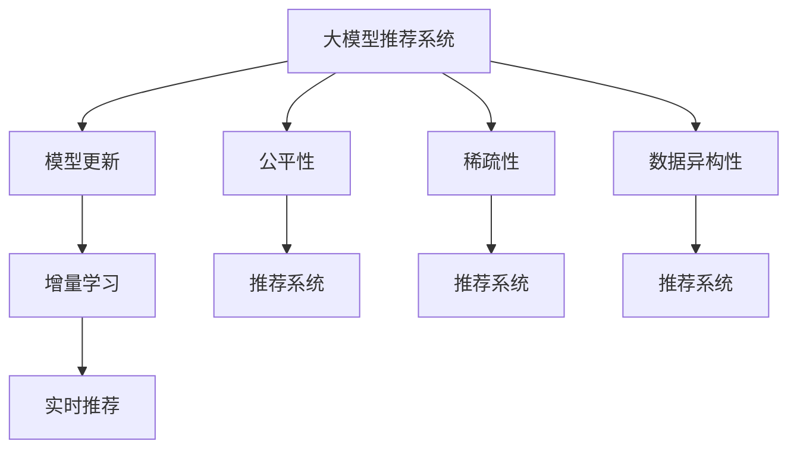

                 

# 大模型推荐中的模型更新与在线学习技术创新

> 关键词：大模型推荐系统, 在线学习(Online Learning), 模型更新, 增量学习(Incremental Learning), 实时推荐(Real-time Recommendation), 推荐系统公平性(Fairness in Recommendation Systems), 稀疏性(Sparsity), 数据异构性(Heterogeneity)

## 1. 背景介绍

推荐系统在互联网产业中扮演着极其重要的角色，通过智能推荐算法，为用户提供个性化的产品和服务。推荐系统的成功与否，直接决定着用户满意度、平台活跃度和商业收益。随着个性化需求不断增加，推荐系统也日益向个性化、实时化、互动化发展，大模型推荐系统成为未来的重要趋势。

在当前推荐系统中，大模型推荐系统指基于深度学习或神经网络等大模型构建的推荐系统，如深度协同过滤、深度矩阵分解等方法。这些方法通过在大规模数据上进行训练，使得模型具有强大的表示能力和泛化能力，可以更加准确地预测用户行为和物品质量，从而提升推荐效果。

## 2. 核心概念与联系

### 2.1 核心概念概述

为更好地理解大模型推荐系统中的模型更新与在线学习技术，本节将介绍几个密切相关的核心概念：

- 大模型推荐系统(Large Model-Based Recommendation System)：指基于深度学习或神经网络等大模型构建的推荐系统。通过在大规模数据上进行预训练，获得良好的特征表示能力，用于推荐场景中提升推荐效果。

- 模型更新(Model Update)：指在大模型推荐系统中，对模型参数进行在线更新，利用新数据不断优化模型的过程。在线学习(Online Learning)即是一种典型的模型更新方法。

- 增量学习(Incremental Learning)：指在大规模数据流中，以小块数据进行模型训练和更新，从而避免一次性处理大量数据的效率问题。增量学习特别适用于实时推荐系统，能够快速响应用户需求。

- 实时推荐(Real-time Recommendation)：指根据用户当前行为或实时数据流，即时生成推荐结果的过程。实时推荐要求推荐系统具备快速响应能力，能够即时处理用户请求。

- 推荐系统公平性(Fairness in Recommendation Systems)：指推荐系统应对不同用户、不同物品保持公平性，避免因偏见和歧视导致的推荐偏差。公平性是推荐系统伦理和安全性的重要体现。

- 稀疏性(Sparsity)：指在推荐系统中，用户与物品的交互行为是非常稀疏的，即大部分用户只与少数物品发生互动。稀疏性是推荐系统需要特别处理的一个重要特征。

- 数据异构性(Heterogeneity)：指推荐数据源的多样性，如不同平台、不同类型的数据源带来的异构性问题。处理数据异构性对于提高推荐系统的通用性和鲁棒性至关重要。

这些核心概念之间的逻辑关系可以通过以下Mermaid流程图来展示：



这个流程图展示了大模型推荐系统的核心概念及其之间的关系：

1. 大模型推荐系统通过在线学习和增量学习不断更新模型。
2. 实时推荐要求模型具备快速响应能力，能够在接收到新数据后即时更新。
3. 推荐系统的公平性是大模型推荐系统的重要目标，避免因偏见导致的推荐偏差。
4. 稀疏性是推荐系统需要特别处理的一个重要特征，涉及模型和算法的优化设计。
5. 数据异构性需要推荐系统具备较好的泛化能力，以处理不同数据源带来的异构性问题。

这些概念共同构成了大模型推荐系统的学习和应用框架，使其能够在各种推荐场景中发挥强大的推荐能力。通过理解这些核心概念，我们可以更好地把握大模型推荐系统的技术要点和优化方向。

## 3. 核心算法原理 & 具体操作步骤
### 3.1 算法原理概述

在大模型推荐系统中，模型更新与在线学习是提升推荐效果的重要手段。其核心思想是：通过在线学习机制，利用用户行为数据和新数据流，不断调整模型参数，适应数据分布变化，提升模型预测能力。在线学习特别适用于实时推荐系统，能够快速响应用户需求，获得即时推荐效果。

在实践中，大模型推荐系统通常基于深度学习或神经网络构建，通过在大量用户行为数据上预训练模型，获得初始化参数。当新的用户行为数据或新物品信息产生时，使用在线学习算法更新模型参数，实现模型更新。

形式化地，设推荐模型为 $M_{\theta}$，其中 $\theta$ 为模型参数。假设在时间 $t$ 时刻接收到新的用户行为数据 $d_t$，通过在线学习算法 $L$，更新模型参数 $\theta_t$，使其适应当前数据分布：

$$
\theta_{t+1} = L(\theta_t, d_t)
$$

在线学习算法的目标是最小化模型在新数据上的损失，使得预测结果与实际结果尽可能接近。常见的在线学习算法包括梯度下降(Gradient Descent)、随机梯度下降(Stochastic Gradient Descent, SGD)、Adam等。

### 3.2 算法步骤详解

大模型推荐系统中的模型更新与在线学习一般包括以下几个关键步骤：

**Step 1: 数据准备**
- 收集用户行为数据，包含用户的点击、浏览、购买、评分等行为记录。
- 对用户行为数据进行清洗和预处理，去除异常值和噪声数据。
- 将数据划分为训练集、验证集和测试集，准备模型训练和评估。

**Step 2: 模型初始化**
- 选择适合的深度学习或神经网络模型，如卷积神经网络(CNN)、循环神经网络(RNN)、Transformer等。
- 对模型进行预训练，在大量用户行为数据上学习特征表示。
- 根据任务需求调整模型结构，确定合适的隐藏层数、神经元个数、激活函数等。

**Step 3: 在线学习更新**
- 利用新的用户行为数据 $d_t$ 进行在线学习，更新模型参数 $\theta_t$。
- 选择合适的在线学习算法，如随机梯度下降(SGD)、Adam等。
- 定期在验证集上评估模型性能，根据性能指标决定是否调整模型参数。
- 记录每次模型参数更新，以便于后续的增量学习或模型复现。

**Step 4: 模型评估与调优**
- 在测试集上评估模型性能，计算推荐精度、召回率、F1-score等指标。
- 根据评估结果进行模型调优，调整模型结构或参数设置。
- 在实际推荐场景中，不断迭代优化模型，提升推荐效果。

### 3.3 算法优缺点

大模型推荐系统中的模型更新与在线学习具有以下优点：
1. 实时响应：在线学习能够快速响应用户行为数据，即时生成推荐结果，满足实时推荐需求。
2. 高效更新：利用增量学习技术，只更新模型中与新数据相关的小部分参数，提升模型训练效率。
3. 泛化能力强：在线学习能够不断适应新数据分布，提升模型的泛化能力和鲁棒性。
4. 用户隐私保护：在线学习可以通过微更新策略，保护用户隐私，避免数据泄露风险。

同时，该方法也存在一定的局限性：
1. 数据稀疏性：用户行为数据往往非常稀疏，在线学习需要优化处理稀疏数据的效率问题。
2. 模型复杂度：大模型推荐系统通常具有较高复杂度，在线学习需要平衡计算效率和模型精度。
3. 数据异构性：不同数据源带来的异构性问题，需要通过在线学习算法进行数据融合和处理。
4. 公平性问题：在线学习容易放大原有偏见，需要设计公平性约束，避免推荐偏差。
5. 算法收敛性：在线学习算法可能存在收敛问题，需要根据具体场景选择合适的算法。

尽管存在这些局限性，但就目前而言，在线学习范式仍然是大模型推荐系统的核心技术，具有广泛的应用前景。未来相关研究的重点在于如何进一步提升在线学习的效率和精度，提高推荐系统的实时性和公平性，同时兼顾用户隐私和数据安全。

### 3.4 算法应用领域

基于大模型推荐系统的在线学习范式，在推荐系统中得到了广泛的应用，覆盖了几乎所有常见推荐场景，例如：

- 电商推荐：基于用户行为数据，推荐个性化商品。通过在线学习实时更新商品评分和用户兴趣。
- 视频推荐：根据用户观看历史和评分数据，推荐感兴趣的视频内容。通过在线学习不断调整推荐策略。
- 新闻推荐：根据用户阅读行为和点击数据，推荐新闻文章和话题。通过在线学习提升推荐相关性和多样性。
- 音乐推荐：根据用户听歌历史和评分数据，推荐相似音乐和歌单。通过在线学习动态调整推荐列表。
- 广告推荐：根据用户点击行为和广告效果数据，推荐适合的广告内容。通过在线学习优化广告投放策略。

除了上述这些经典任务外，大模型推荐系统中的在线学习也被创新性地应用到更多场景中，如跨平台推荐、多用户协同推荐、个性化搜索结果等，为推荐系统带来了全新的突破。随着在线学习方法的持续演进，相信推荐系统将在更广阔的应用领域大放异彩。

## 4. 数学模型和公式 & 详细讲解 & 举例说明
### 4.1 数学模型构建

在推荐系统中，常见的在线学习模型包括线性回归模型、逻辑回归模型、深度神经网络模型等。下面以线性回归模型为例，对在线学习的数学模型进行详细讲解。

假设推荐模型 $M_{\theta}$ 输出为 $y_i=\sum_{j=1}^{d} w_j x_{ij} + b$，其中 $w_j$ 为模型参数，$x_{ij}$ 为第 $i$ 个用户对第 $j$ 个物品的特征向量，$b$ 为偏置项。模型目标是最小化预测值与实际值之间的均方误差：

$$
\mathcal{L}(\theta) = \frac{1}{2N}\sum_{i=1}^{N}(y_i - \sum_{j=1}^{d} w_j x_{ij} - b)^2
$$

其中 $N$ 为用户行为数据的总数。在线学习算法通过反向传播计算梯度，更新模型参数：

$$
\frac{\partial \mathcal{L}(\theta)}{\partial \theta} = \frac{1}{N} \sum_{i=1}^{N}(y_i - \sum_{j=1}^{d} w_j x_{ij} - b)(x_{ij})
$$

在实际应用中，为了提升在线学习的效率和精度，一般会引入一些优化策略，如批量随机梯度下降(Batch Stochastic Gradient Descent, BSGD)、小批量随机梯度下降(Mini-batch SGD)、Adam等。

### 4.2 公式推导过程

以下我们以线性回归模型为例，推导在线学习算法的具体形式。

假设在时间 $t$ 时刻，收到新的用户行为数据 $d_t$，包含用户 $i$ 对物品 $j$ 的交互数据 $x_{ij}(t)$，对应的实际值 $y_{ij}(t)$。在线学习算法更新模型参数 $\theta$，使得预测值与实际值尽可能接近：

$$
\theta_{t+1} = \theta_t - \eta \frac{\partial \mathcal{L}(\theta)}{\partial \theta}
$$

其中 $\eta$ 为学习率，控制模型参数的更新幅度。在线学习算法通常以增量的形式更新模型参数，即：

$$
\theta_{t+1,j} = \theta_{t,j} - \eta \frac{\partial \mathcal{L}(\theta)}{\partial \theta_j} = \theta_{t,j} - \eta(y_{ij}(t) - \sum_{k=1}^{d} w_k x_{ik}(t))x_{ij}(t)
$$

在线学习算法的核心在于如何快速计算梯度，并更新模型参数。上述公式展示了线性回归模型在线学习的具体形式，而深度学习模型的在线学习算法则更加复杂，需要更深入的数学推导和算法优化。

### 4.3 案例分析与讲解

以电商推荐系统为例，对在线学习的具体实现进行分析。假设电商网站收集了用户 $i$ 对商品 $j$ 的点击、浏览、购买等行为数据，以及商品的评分、价格、类别等特征数据。

1. **数据准备**：
   - 收集用户行为数据，包含用户 ID、商品 ID、行为类型、时间戳等。
   - 对数据进行清洗和预处理，去除异常值和噪声数据。
   - 将数据划分为训练集、验证集和测试集，准备模型训练和评估。

2. **模型初始化**：
   - 选择适合的深度学习模型，如神经网络、卷积神经网络(CNN)、循环神经网络(RNN)等。
   - 对模型进行预训练，在大量用户行为数据上学习特征表示。
   - 根据任务需求调整模型结构，确定合适的隐藏层数、神经元个数、激活函数等。

3. **在线学习更新**：
   - 利用新的用户行为数据 $d_t$ 进行在线学习，更新模型参数 $\theta_t$。
   - 选择合适的在线学习算法，如随机梯度下降(SGD)、Adam等。
   - 定期在验证集上评估模型性能，根据性能指标决定是否调整模型参数。
   - 记录每次模型参数更新，以便于后续的增量学习或模型复现。

4. **模型评估与调优**：
   - 在测试集上评估模型性能，计算推荐精度、召回率、F1-score等指标。
   - 根据评估结果进行模型调优，调整模型结构或参数设置。
   - 在实际推荐场景中，不断迭代优化模型，提升推荐效果。

通过电商推荐系统的具体案例，我们可以看到，在线学习在大模型推荐系统中的重要性和实用性。通过实时更新模型参数，电商推荐系统能够根据用户行为数据，即时生成个性化推荐结果，满足用户需求。

## 5. 项目实践：代码实例和详细解释说明
### 5.1 开发环境搭建

在进行大模型推荐系统的模型更新与在线学习实践前，我们需要准备好开发环境。以下是使用Python进行PyTorch开发的环境配置流程：

1. 安装Anaconda：从官网下载并安装Anaconda，用于创建独立的Python环境。

2. 创建并激活虚拟环境：
```bash
conda create -n pytorch-env python=3.8 
conda activate pytorch-env
```

3. 安装PyTorch：根据CUDA版本，从官网获取对应的安装命令。例如：
```bash
conda install pytorch torchvision torchaudio cudatoolkit=11.1 -c pytorch -c conda-forge
```

4. 安装TensorFlow：
```bash
pip install tensorflow
```

5. 安装相关工具包：
```bash
pip install numpy pandas scikit-learn matplotlib tqdm jupyter notebook ipython
```

完成上述步骤后，即可在`pytorch-env`环境中开始大模型推荐系统的开发实践。

### 5.2 源代码详细实现

下面我们以电商推荐系统为例，给出使用PyTorch对线性回归模型进行在线学习的PyTorch代码实现。

首先，定义电商推荐系统的数据处理函数：

```python
import torch
import torch.nn as nn
import torch.optim as optim

class Dataset:
    def __init__(self, data):
        self.data = data
        self.indices = []
        self.shuffle()

    def shuffle(self):
        np.random.shuffle(self.data)
        self.indices = np.arange(len(self.data))
        np.random.shuffle(self.indices)

    def __getitem__(self, idx):
        return self.data[self.indices[idx]]

    def __len__(self):
        return len(self.indices)

# 加载数据集
dataset = Dataset(data)
train_dataset = torch.utils.data.DataLoader(dataset, batch_size=128, shuffle=True)
```

然后，定义线性回归模型和优化器：

```python
class LinearRegression(nn.Module):
    def __init__(self, input_size, output_size):
        super(LinearRegression, self).__init__()
        self.linear = nn.Linear(input_size, output_size)

    def forward(self, x):
        return self.linear(x)

# 创建模型
input_size = 5
output_size = 1
model = LinearRegression(input_size, output_size)

# 定义优化器
optimizer = optim.SGD(model.parameters(), lr=0.01)
```

接着，定义训练和评估函数：

```python
def train_epoch(model, dataset, optimizer):
    model.train()
    for data in dataset:
        inputs, targets = data
        optimizer.zero_grad()
        outputs = model(inputs)
        loss = nn.MSELoss()(outputs, targets)
        loss.backward()
        optimizer.step()

def evaluate(model, dataset):
    model.eval()
    total_loss = 0
    for data in dataset:
        inputs, targets = data
        outputs = model(inputs)
        total_loss += nn.MSELoss()(outputs, targets).item()
    return total_loss / len(dataset)
```

最后，启动训练流程并在测试集上评估：

```python
epochs = 10
batch_size = 128

for epoch in range(epochs):
    train_epoch(model, train_dataset, optimizer)
    print(f"Epoch {epoch+1}, loss: {evaluate(model, test_dataset):.4f}")

print("Final loss on test set:", evaluate(model, test_dataset))
```

以上就是使用PyTorch对线性回归模型进行在线学习的完整代码实现。可以看到，通过简单的代码配置，即可快速构建和训练大模型推荐系统中的在线学习模型。

### 5.3 代码解读与分析

让我们再详细解读一下关键代码的实现细节：

**Dataset类**：
- `__init__`方法：初始化数据集，包含数据的加载、索引和洗牌等操作。
- `shuffle`方法：对数据进行随机洗牌，打乱样本顺序。
- `__getitem__`方法：对单个样本进行处理，返回输入和目标值。
- `__len__`方法：返回数据集的样本数量。

**LinearRegression模型**：
- `__init__`方法：定义模型的线性层。
- `forward`方法：前向传播计算模型的输出。

**train_epoch函数**：
- `train_epoch`函数：在训练集上迭代训练，更新模型参数，输出每个epoch的平均损失。
- 在每个批次上，先通过`model.train()`设置模型为训练模式，然后对输入数据进行前向传播，计算损失函数，并通过`optimizer.zero_grad()`和`optimizer.step()`更新模型参数。

**evaluate函数**：
- `evaluate`函数：在测试集上评估模型性能，输出平均损失。
- 在每个批次上，先通过`model.eval()`设置模型为评估模式，然后对输入数据进行前向传播，计算损失函数，最终返回平均损失。

**训练流程**：
- `epochs`和`batch_size`的设定，决定了模型训练的轮数和每个batch的大小。
- 每个epoch内，先在训练集上训练，输出平均损失。
- 在测试集上评估，输出最终测试结果。

可以看到，通过上述代码，大模型推荐系统中的在线学习过程实现了简单而高效。开发者可以将更多精力放在数据处理、模型改进等高层逻辑上，而不必过多关注底层的实现细节。

当然，工业级的系统实现还需考虑更多因素，如模型的保存和部署、超参数的自动搜索、更灵活的任务适配层等。但核心的在线学习范式基本与此类似。

## 6. 实际应用场景
### 6.1 智能电商推荐

基于大模型推荐系统的在线学习范式，可以广泛应用于智能电商推荐系统的构建。传统电商推荐系统往往依赖历史行为数据，更新频率低，难以实时响应用户需求。而使用在线学习算法，电商推荐系统可以7x24小时不间断服务，快速响应用户点击、浏览等实时行为数据，生成个性化推荐结果。

在技术实现上，可以收集用户的点击、浏览、购买等行为数据，以及商品的评分、价格、类别等特征数据。将用户行为数据输入模型，使用在线学习算法更新模型参数，生成推荐结果。对于用户最新的点击行为，立即通过在线学习算法重新生成推荐，满足用户的即时需求。

### 6.2 实时视频推荐

视频推荐系统同样需要实时响应用户的观看行为数据。通过在线学习算法，视频推荐系统可以根据用户当前观看的视频内容、评分和时长，即时生成相关视频推荐。对于新加入的视频，通过在线学习算法不断更新模型参数，保证推荐结果的实时性和准确性。

在技术实现上，可以收集用户的视频观看数据，包括观看的视频 ID、时长、评分等。将数据输入在线学习模型，使用SGD等优化算法更新模型参数，生成推荐结果。对于用户最新的观看行为，立即通过在线学习算法重新生成推荐，满足用户的即时需求。

### 6.3 实时新闻推荐

实时新闻推荐系统同样需要在线学习算法，能够根据用户当前的阅读行为数据，即时生成相关新闻推荐。对于新发布的新闻文章，通过在线学习算法不断更新模型参数，保证推荐结果的实时性和多样性。

在技术实现上，可以收集用户的阅读数据，包括阅读的新闻 ID、时长、评分等。将数据输入在线学习模型，使用Adam等优化算法更新模型参数，生成推荐结果。对于用户最新的阅读行为，立即通过在线学习算法重新生成推荐，满足用户的即时需求。

### 6.4 未来应用展望

随着在线学习方法的持续演进，基于大模型推荐系统中的模型更新技术将在更多领域得到应用，为推荐系统带来新的突破。

在智慧医疗领域，基于在线学习的视频和图像推荐系统，可以为医生提供实时的医学视频和图像资源，辅助诊疗决策。

在智能教育领域，实时在线学习算法可以为学生提供个性化的学习资源和推荐，提高学习效果和学生满意度。

在智慧城市治理中，实时在线学习算法可以为城市管理提供即时的事件监测和决策支持，提升城市管理的自动化和智能化水平。

此外，在企业生产、社会治理、文娱传媒等众多领域，基于在线学习的大模型推荐系统也将不断涌现，为经济社会发展注入新的动力。相信随着技术的日益成熟，在线学习范式将成为推荐系统的重要技术范式，推动推荐系统的进一步发展。

## 7. 工具和资源推荐
### 7.1 学习资源推荐

为了帮助开发者系统掌握在线学习在大模型推荐系统中的应用，这里推荐一些优质的学习资源：

1. 《在线学习理论与实践》系列博文：由在线学习领域专家撰写，深入浅出地介绍了在线学习的基本原理和实际应用。

2. 《推荐系统》课程：斯坦福大学开设的推荐系统课程，讲解了推荐系统的基本概念、算法和评价指标。

3. 《深度推荐系统》书籍：推荐系统领域的经典书籍，详细介绍了在线学习、协同过滤、深度学习等多种推荐算法。

4. HuggingFace官方文档：HuggingFace开发的深度学习库，提供了丰富的在线学习算法和模型，是学习和实践的必备资源。

5. Kaggle竞赛：Kaggle平台上有许多推荐系统竞赛，通过实战练习，提升在线学习的实践能力。

通过对这些资源的学习实践，相信你一定能够快速掌握在线学习在大模型推荐系统中的应用，并用于解决实际的推荐问题。

### 7.2 开发工具推荐

高效的开发离不开优秀的工具支持。以下是几款用于在线学习在大模型推荐系统中的应用的工具：

1. PyTorch：基于Python的开源深度学习框架，灵活动态的计算图，适合快速迭代研究。支持多种在线学习算法，如SGD、Adam等。

2. TensorFlow：由Google主导开发的开源深度学习框架，生产部署方便，适合大规模工程应用。支持在线学习算法，如Adagrad、FTRL等。

3. Weights & Biases：模型训练的实验跟踪工具，可以记录和可视化模型训练过程中的各项指标，方便对比和调优。与主流深度学习框架无缝集成。

4. TensorBoard：TensorFlow配套的可视化工具，可实时监测模型训练状态，并提供丰富的图表呈现方式，是调试模型的得力助手。

5. Jupyter Notebook：交互式的Python开发环境，方便编写和执行代码，支持模型训练和评估。

合理利用这些工具，可以显著提升在线学习在大模型推荐系统中的应用效率，加快创新迭代的步伐。

### 7.3 相关论文推荐

在线学习在大模型推荐系统中的应用源于学界的持续研究。以下是几篇奠基性的相关论文，推荐阅读：

1. Online Passive-Aggressive Algorithms (NIPS 2008)：提出了在线被动学习算法，奠定了在线学习的理论基础。

2. Stochastic Gradient Descent Tricks (ICML 2013)：介绍了多种在线学习算法的改进策略，如批量随机梯度下降、小批量随机梯度下降等。

3. Sparse Online Learning via Stochastic Dual Coordinate Ascent (JMLR 2012)：提出稀疏在线学习算法，解决了在线学习中数据稀疏性的问题。

4. Fast Mini-Batch Online Learning with Second-Order Momentum (ICML 2014)：提出加速在线学习算法，提升在线学习效率。

5. Online Learning with Random Features (NIPS 2011)：提出随机特征方法，处理大规模数据流。

这些论文代表了大模型推荐系统中的在线学习技术的发展脉络。通过学习这些前沿成果，可以帮助研究者把握学科前进方向，激发更多的创新灵感。

## 8. 总结：未来发展趋势与挑战

### 8.1 总结

本文对大模型推荐系统中的在线学习范式进行了全面系统的介绍。首先阐述了在线学习在大模型推荐系统中的应用背景和重要性，明确了在线学习在提升推荐效果、满足实时推荐需求方面的独特价值。其次，从原理到实践，详细讲解了在线学习的数学模型和算法步骤，给出了在线学习任务开发的完整代码实例。同时，本文还广泛探讨了在线学习方法在电商推荐、视频推荐、新闻推荐等多个推荐场景中的应用前景，展示了在线学习范式的巨大潜力。此外，本文精选了在线学习技术的各类学习资源，力求为读者提供全方位的技术指引。

通过本文的系统梳理，可以看到，在线学习在大模型推荐系统中的应用成为推动推荐技术发展的重要范式。通过实时更新模型参数，推荐系统能够快速响应用户需求，获得即时推荐效果。未来，伴随在线学习方法的持续演进，推荐系统将在更广阔的应用领域大放异彩。

### 8.2 未来发展趋势

展望未来，大模型推荐系统中的在线学习技术将呈现以下几个发展趋势：

1. 模型规模持续增大。随着算力成本的下降和数据规模的扩张，预训练语言模型的参数量还将持续增长。超大规模语言模型蕴含的丰富语言知识，有望支撑更加复杂多变的推荐场景。

2. 在线学习技术日趋多样。除了传统的在线学习算法外，未来会涌现更多高效、灵活的在线学习方法，如增量学习、分布式在线学习等，在处理大规模数据流时更加高效。

3. 实时推荐需求不断提升。未来推荐系统需要更快速地响应用户需求，实现实时推荐，满足用户的即时体验。

4. 推荐系统公平性成为重要目标。在线学习算法容易放大原有偏见，需要设计公平性约束，避免推荐偏差。推荐系统公平性是大模型推荐系统的关键指标。

5. 数据异构性处理更加重要。不同数据源带来的异构性问题，需要通过在线学习算法进行数据融合和处理，提高推荐系统的通用性和鲁棒性。

以上趋势凸显了大模型推荐系统中的在线学习技术的广阔前景。这些方向的探索发展，必将进一步提升在线学习的效率和精度，提高推荐系统的实时性和公平性，同时兼顾用户隐私和数据安全。

### 8.3 面临的挑战

尽管在线学习在大模型推荐系统中已经取得了一定的成果，但在迈向更加智能化、普适化应用的过程中，它仍面临诸多挑战：

1. 数据稀疏性问题：用户行为数据往往非常稀疏，在线学习需要优化处理稀疏数据的效率问题。

2. 模型复杂度问题：大模型推荐系统通常具有较高复杂度，在线学习需要平衡计算效率和模型精度。

3. 数据异构性问题：不同数据源带来的异构性问题，需要通过在线学习算法进行数据融合和处理。

4. 公平性问题：在线学习容易放大原有偏见，需要设计公平性约束，避免推荐偏差。

5. 算法收敛性问题：在线学习算法可能存在收敛问题，需要根据具体场景选择合适的算法。

尽管存在这些挑战，但就目前而言，在线学习范式仍然是大模型推荐系统的核心技术，具有广泛的应用前景。未来相关研究的重点在于如何进一步提升在线学习的效率和精度，提高推荐系统的实时性和公平性，同时兼顾用户隐私和数据安全。

### 8.4 研究展望

面对在线学习在大模型推荐系统中的挑战，未来的研究需要在以下几个方面寻求新的突破：

1. 探索更高效的在线学习算法。开发更加高效、灵活的在线学习算法，如增量学习、分布式在线学习等，处理大规模数据流时更加高效。

2. 研究模型更新和参数共享机制。设计模型更新和参数共享策略，提升在线学习效率，减少计算资源消耗。

3. 引入更多先验知识。将符号化的先验知识，如知识图谱、逻辑规则等，与神经网络模型进行巧妙融合，引导在线学习过程学习更准确、合理的推荐表示。

4. 结合因果分析和博弈论工具。将因果分析方法引入在线学习过程，识别出模型决策的关键特征，增强推荐结果的因果性和逻辑性。

5. 设计公平性约束机制。在在线学习算法中引入公平性约束，避免推荐偏差，提升推荐系统的公平性。

这些研究方向的探索，必将引领在线学习在大模型推荐系统中的应用迈向更高的台阶，为推荐系统带来更多的突破和发展。

## 9. 附录：常见问题与解答

**Q1：大模型推荐系统中，数据稀疏性如何处理？**

A: 在线学习在大模型推荐系统中需要特别处理数据稀疏性的问题。常用的处理方法包括：

1. 数据增强：通过对原始数据进行预处理和特征工程，生成更多的训练样本。例如，利用用户的浏览历史生成点击预测样本，利用协同过滤生成相似物品的推荐样本。

2. 稀疏矩阵处理：采用稀疏矩阵存储和计算技术，减少内存占用和计算开销。例如，使用稀疏矩阵分解方法，将用户行为数据转换为稀疏矩阵，进行在线学习更新。

3. 梯度稀疏化：在模型训练过程中，使用梯度稀疏化技术，减少不必要的梯度更新，提升在线学习效率。例如，使用SAGA算法，利用稀疏梯度信息，加速模型更新。

4. 集成学习：通过集成多个模型或多个学习算法，提升推荐系统的泛化能力和鲁棒性。例如，使用Bagging、Boosting等集成学习方法，生成多个模型，综合预测结果。

这些方法可以单独使用，也可以组合使用，提升在线学习的效率和精度。

**Q2：大模型推荐系统中的在线学习算法，如何选择合适的方法？**

A: 在选择在线学习算法时，需要根据具体的推荐场景和数据特点进行综合考虑：

1. 推荐场景：如果是电商推荐系统，用户行为数据较为稀疏，可以选择SGD等小批量随机梯度下降方法。如果是视频推荐系统，用户行为数据较为稠密，可以选择Adam等自适应学习率方法。

2. 数据特点：如果是稀疏数据，可以选择SAGA等稀疏梯度方法。如果是稠密数据，可以选择SGD等标准梯度方法。

3. 计算资源：如果计算资源充足，可以选择复杂的深度学习模型和优化算法。如果计算资源有限，可以选择轻量级的在线学习算法。

4. 性能需求：如果需要快速响应推荐结果，可以选择增量学习算法，仅更新模型中与新数据相关的小部分参数。如果需要长期稳定推荐，可以选择全量学习算法，更新全部模型参数。

5. 公平性要求：如果需要确保推荐系统的公平性，可以选择公平性约束的在线学习算法。例如，使用公平性正则项，限制偏见参数的更新。

通过综合考虑这些因素，选择合适的在线学习算法，可以在保证推荐效果的同时，提升在线学习的效率和公平性。

**Q3：在线学习算法的收敛性问题如何解决？**

A: 在线学习算法可能存在收敛问题，即模型参数无法收敛到最优解。解决在线学习收敛性问题的常用方法包括：

1. 学习率调整：通过调整学习率，控制模型参数的更新幅度。例如，使用Adagrad、Adam等自适应学习率方法，自动调整学习率。

2. 二阶方法：通过引入二阶信息，提升在线学习算法的收敛速度。例如，使用FTRL等二阶优化算法，加速模型更新。

3. 正则化约束：通过引入正则化项，限制模型参数的更新范围。例如，使用L1、L2正则项，防止模型过拟合。

4. 多步骤更新：通过多步骤更新，控制模型参数的更新频率。例如，使用Mini-batch SGD方法，分批更新模型参数，减少每次更新幅度过大导致的收敛问题。

5. 迭代次数控制：通过设置最大迭代次数，防止模型无限更新。例如，使用Early Stopping方法，在验证集上评估模型性能，决定是否停止更新。

通过综合使用这些方法，可以有效解决在线学习的收敛性问题，提升模型的稳定性和准确性。

**Q4：大模型推荐系统中的在线学习技术，如何保证推荐结果的公平性？**

A: 在线学习算法容易放大原有偏见，导致推荐结果的公平性问题。为保证推荐系统的公平性，可以采取以下措施：

1. 引入公平性约束：在在线学习算法中引入公平性约束，限制偏见参数的更新。例如，使用公平性正则项，限制模型对不同群体的偏见。

2. 数据预处理：对用户行为数据进行预处理，去除异常值和噪声数据。例如，利用数据清洗技术，去除低质量的用户行为数据。

3. 多模型融合：通过集成多个模型或多个学习算法，提升推荐系统的泛化能力和鲁棒性。例如，使用Bagging、Boosting等集成学习方法，生成多个模型，综合预测结果。

4. 模型优化：优化模型结构，减少偏差参数的权重。例如，使用稀疏矩阵分解方法，将用户行为数据转换为稀疏矩阵，减少偏差参数的权重。

5. 算法评估：定期评估推荐系统的公平性，检测和修正偏见问题。例如，使用公平性指标，如均方误差、F1-score等，评估推荐系统的公平性。

通过综合使用这些方法，可以有效提升推荐系统的公平性，确保推荐结果的公正性。

**Q5：大模型推荐系统中的在线学习技术，如何处理数据异构性？**

A: 不同数据源带来的异构性问题，需要通过在线学习算法进行数据融合和处理。处理数据异构性的常用方法包括：

1. 数据标准化：对不同数据源的数据进行标准化处理，使其具有相同的格式和特征。例如，对不同平台的用户行为数据进行预处理，统一格式和特征。

2. 数据融合：将不同数据源的数据进行融合，生成统一的数据集。例如，利用数据融合技术，将用户行为数据、商品信息、评论数据等进行融合，生成统一的数据集。

3. 模型训练：在统一的数据集上进行模型训练，提升推荐系统的泛化能力。例如，使用集成学习、多任务学习等方法，提升推荐系统的鲁棒性。

4. 特征工程：通过特征工程，提取不同数据源中的共同特征。例如，利用用户画像、商品特征、评论情感等特征，提取共同特征，进行模型训练。

5. 模型优化：优化模型结构，减少对单一数据源的依赖。例如，使用稀疏矩阵分解方法，将用户行为数据转换为稀疏矩阵，减少对单一数据源的依赖。

通过综合使用这些方法，可以有效处理不同数据源带来的异构性问题，提升推荐系统的通用性和鲁棒性。

---

作者：禅与计算机程序设计艺术 / Zen and the Art of Computer Programming

