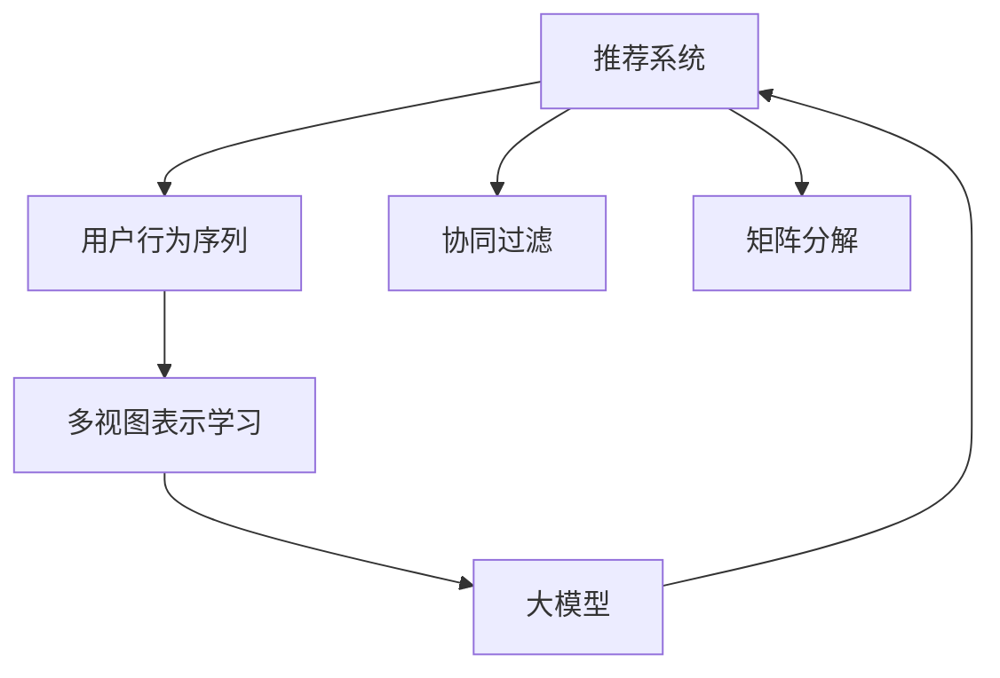

                 

# 大模型推荐中的用户行为序列多视图表示学习技术创新

> 关键词：大模型推荐, 用户行为序列, 多视图表示学习, 推荐系统, 协同过滤, 矩阵分解

## 1. 背景介绍

推荐系统已经成为了互联网应用中不可或缺的组成部分。随着数据量的爆炸性增长和计算能力的不断提升，深度学习大模型在推荐系统中得到了广泛应用，取得了显著的性能提升。然而，用户行为序列的多样性和复杂性，以及不同视图数据之间的相互影响，对推荐模型的建模提出了更高的要求。

本论文旨在探索一种基于大模型的推荐系统，通过多视图表示学习技术，对用户行为序列进行建模，提升推荐性能，拓展推荐系统的应用范围。我们将首先介绍推荐系统的背景和现状，然后详细描述多视图表示学习的算法原理和操作步骤，并通过实际应用案例展示其在推荐系统中的应用效果。

## 2. 核心概念与联系

### 2.1 核心概念概述

推荐系统：通过分析用户的历史行为和兴趣，为用户推荐个性化的商品或内容。传统的推荐算法包括协同过滤、基于内容的推荐、矩阵分解等。近年来，深度学习技术被引入推荐系统，取得了显著的性能提升。

用户行为序列：用户在应用中的交互行为轨迹，如浏览、点击、购买等。传统推荐模型通常只考虑静态的用户行为数据，而基于时间序列的推荐模型可以更好地捕捉用户的动态变化。

多视图表示学习：从多个不同来源的数据中学习用户的表示，提升表示的全面性和鲁棒性。常见的多视图数据包括用户画像、商品属性、社交关系等。

协同过滤：一种基于用户或物品相似度的推荐方法，通过找到与目标用户或物品相似的用户或物品进行推荐。但协同过滤模型难以处理新用户或物品的冷启动问题。

矩阵分解：将用户与物品的交互矩阵进行分解，学习用户和物品的潜在因子表示，进行推荐。但矩阵分解模型无法有效利用非结构化数据。

大模型：指在大规模无标签数据上进行预训练的大神经网络模型，如BERT、GPT等。大模型通过自监督学习任务获得丰富的语言知识，可以用于多种NLP任务，包括推荐系统。

### 2.2 核心概念联系

推荐系统、用户行为序列、多视图表示学习和大模型之间存在着紧密的联系：

- 推荐系统需要理解用户行为序列，捕捉用户兴趣的变化趋势。
- 用户行为序列通过多视图表示学习进行建模，能够更好地反映用户的复杂兴趣。
- 多视图表示学习可以结合大模型的预训练知识，提升表示的全面性和鲁棒性。
- 大模型具备强大的表示学习能力，可以用于推荐系统中的特征提取和表示学习。

这些概念之间的逻辑关系可以通过以下Mermaid流程图来展示：



这个流程图展示了从用户行为序列到多视图表示学习的链条，以及如何将大模型整合到推荐系统中的路径。

## 3. 核心算法原理 & 具体操作步骤
### 3.1 算法原理概述

本论文中的大模型推荐算法基于多视图表示学习，通过结合用户行为序列的多个视图数据，学习用户的全面表示。我们假设用户行为序列包含n个时间步，每个时间步的输入为(x_t, y_t)，其中x_t表示用户行为特征，y_t表示行为结果。则用户行为序列可以表示为：

$$
x = (x_1, x_2, ..., x_n)
$$

我们将其分为K个视图，记为x^i_t，其中i表示视图编号，t表示时间步编号。每个视图x^i_t的维度为d_i。则用户行为序列的多视图表示可以表示为：

$$
X = \{x^i_t\}_{t=1}^n
$$

我们的目标是通过多视图表示学习，得到用户u的表示$v_u$。具体而言，我们假设u的表示可以表示为多个视图的线性组合：

$$
v_u = W^i_u \cdot x^i_u
$$

其中$W^i_u$为视图i对用户u的加权系数。

### 3.2 算法步骤详解

基于大模型的推荐系统算法包括以下关键步骤：

**Step 1: 数据预处理**

- 收集用户行为序列数据，并进行归一化处理。
- 对每个时间步的用户行为特征进行编码，转化为模型的输入。
- 将用户行为序列按照不同的视图进行划分，生成多视图数据集。

**Step 2: 多视图表示学习**

- 选择合适的预训练语言模型，作为多视图表示学习的初始化参数。
- 对每个视图进行特征提取，得到每个时间步的表示。
- 使用自监督学习任务对每个视图进行预训练，得到每个时间步的预训练权重$W^i_t$。
- 对每个视图的权重进行微调，得到每个时间步的加权系数$W^i_u$。

**Step 3: 大模型推荐**

- 将用户行为序列的多视图表示输入大模型，得到用户表示$v_u$。
- 通过与物品库的相似度计算，进行推荐排序。
- 使用训练好的大模型进行实时推荐。

### 3.3 算法优缺点

基于大模型的推荐系统具有以下优点：

- 能够处理多种类型的数据，包括文本、图片、音频等，提升表示的全面性。
- 通过多视图表示学习，提升用户表示的鲁棒性，提高推荐的准确性。
- 可以利用大模型的预训练知识，提升推荐系统的泛化能力。

同时，该方法也存在一定的局限性：

- 对数据质量要求较高，需要保证多视图数据的完整性和一致性。
- 计算复杂度较高，大模型的推理和训练开销较大。
- 对于新用户的冷启动问题，需要进一步的改进措施。
- 需要解决多视图数据之间的冲突和融合问题，以提升表示的准确性。

尽管存在这些局限性，但就目前而言，基于大模型的推荐系统仍然是一种前沿且高效的推荐范式。未来相关研究的重点在于如何进一步优化模型计算效率，提升冷启动性能，同时解决多视图数据之间的冲突和融合问题，以进一步提升推荐系统的性能。

### 3.4 算法应用领域

基于大模型的推荐系统已经在多种领域得到了应用，例如：

- 电子商务：推荐用户感兴趣的商品，提升购物体验。
- 视频平台：推荐用户感兴趣的视频，增加用户粘性。
- 音乐平台：推荐用户喜爱的音乐，提高用户满意度。
- 社交网络：推荐用户可能感兴趣的朋友和内容，增加用户活跃度。

此外，基于大模型的推荐系统还广泛应用于金融、健康、旅游等领域，为这些行业带来了巨大的商业价值和社会效益。随着大模型和推荐算法的不断演进，相信推荐系统将在更多领域得到广泛应用，推动经济和社会的发展。

## 4. 数学模型和公式 & 详细讲解 & 举例说明

### 4.1 数学模型构建

本节将使用数学语言对基于大模型的推荐系统进行更加严格的刻画。

假设用户行为序列包含n个时间步，每个时间步的输入为(x_t, y_t)，其中x_t表示用户行为特征，y_t表示行为结果。我们将其分为K个视图，记为x^i_t，其中i表示视图编号，t表示时间步编号。每个视图的维度为d_i。则用户行为序列的多视图表示可以表示为：

$$
X = \{x^i_t\}_{t=1}^n
$$

我们的目标是通过多视图表示学习，得到用户u的表示$v_u$。具体而言，我们假设u的表示可以表示为多个视图的线性组合：

$$
v_u = W^i_u \cdot x^i_u
$$

其中$W^i_u$为视图i对用户u的加权系数。

### 4.2 公式推导过程

以下我们以电商推荐系统为例，推导多视图表示学习的公式及其梯度计算过程。

设用户行为序列为$x = (x_1, x_2, ..., x_n)$，其中$x_t = (x_t^1, x_t^2, ..., x_t^K)$表示第t个时间步的用户行为特征。假设用户u的表示为$v_u = (v_{u,1}, v_{u,2}, ..., v_{u,K})$，则：

$$
v_{u,i} = W^i_u \cdot x^i_u
$$

其中$W^i_u$为视图i对用户u的加权系数，$x^i_u$为视图i对用户u的行为特征。假设每个视图的维度为d_i，则$W^i_u$的维度为1x d_i。

假设目标物品的表示为$v_v = (v_{v,1}, v_{v,2}, ..., v_{v,K})$，则用户u与物品v的相似度可以表示为：

$$
\cos(v_u, v_v) = \frac{\sum_{i=1}^K v_{u,i} \cdot v_{v,i}}{\sqrt{\sum_{i=1}^K v_{u,i}^2} \cdot \sqrt{\sum_{i=1}^K v_{v,i}^2}}
$$

目标物品的评分可以表示为：

$$
\hat{y} = \cos(v_u, v_v)
$$

在训练阶段，我们将用户行为序列输入模型，学习$W^i_u$的初始化参数。假设每个视图的预训练权重为$W^i_t$，则：

$$
W^i_u = \text{softmax}(A_i \cdot x^i_u)
$$

其中A_i表示视图i的预训练权重，$x^i_u$表示视图i对用户u的行为特征。假设模型训练的损失函数为L，则：

$$
L = \frac{1}{N} \sum_{i=1}^N \ell(\hat{y}, y)
$$

其中N表示样本数量，$\ell$表示二分类交叉熵损失函数。根据梯度下降优化算法，模型的梯度更新公式为：

$$
\Delta A_i = -\frac{\partial L}{\partial A_i}
$$

其中$\Delta A_i$表示预训练权重A_i的更新量。通过反向传播，可以计算出$\Delta A_i$的具体值，并更新模型参数。

### 4.3 案例分析与讲解

假设我们有一个电商推荐系统，用户行为序列为：

$$
x = (x_1, x_2, ..., x_n) = ((1, 0, 0, 0), (1, 1, 0, 0), (0, 1, 0, 0), (0, 0, 1, 0), (0, 0, 0, 1))
$$

其中第一列表示用户是否浏览了商品1，第二列表示用户是否购买了商品2，第三列表示用户是否浏览了商品3，第四列表示用户是否购买了商品4。

我们将其分为四个视图：商品1的浏览记录、商品2的购买记录、商品3的浏览记录和商品4的购买记录。则多视图表示可以表示为：

$$
X = \{x^i_t\}_{t=1}^n
$$

其中$i \in \{1,2,3,4\}$。

假设用户u的表示为$v_u = (v_{u,1}, v_{u,2}, v_{u,3}, v_{u,4})$，则：

$$
v_{u,i} = W^i_u \cdot x^i_u
$$

其中$W^i_u$为视图i对用户u的加权系数。假设每个视图的维度为d_i = 2，则$W^i_u$的维度为1x2。

假设物品v的表示为$v_v = (v_{v,1}, v_{v,2}, v_{v,3}, v_{v,4})$，则用户u与物品v的相似度可以表示为：

$$
\cos(v_u, v_v) = \frac{\sum_{i=1}^K v_{u,i} \cdot v_{v,i}}{\sqrt{\sum_{i=1}^K v_{u,i}^2} \cdot \sqrt{\sum_{i=1}^K v_{v,i}^2}}
$$

目标物品的评分可以表示为：

$$
\hat{y} = \cos(v_u, v_v)
$$

在训练阶段，我们将用户行为序列输入模型，学习$W^i_u$的初始化参数。假设每个视图的预训练权重为$W^i_t$，则：

$$
W^i_u = \text{softmax}(A_i \cdot x^i_u)
$$

其中A_i表示视图i的预训练权重，$x^i_u$表示视图i对用户u的行为特征。假设模型训练的损失函数为L，则：

$$
L = \frac{1}{N} \sum_{i=1}^N \ell(\hat{y}, y)
$$

其中N表示样本数量，$\ell$表示二分类交叉熵损失函数。根据梯度下降优化算法，模型的梯度更新公式为：

$$
\Delta A_i = -\frac{\partial L}{\partial A_i}
$$

其中$\Delta A_i$表示预训练权重A_i的更新量。通过反向传播，可以计算出$\Delta A_i$的具体值，并更新模型参数。

## 5. 项目实践：代码实例和详细解释说明
### 5.1 开发环境搭建

在进行推荐系统开发前，我们需要准备好开发环境。以下是使用Python进行PyTorch开发的环境配置流程：

1. 安装Anaconda：从官网下载并安装Anaconda，用于创建独立的Python环境。

2. 创建并激活虚拟环境：
```bash
conda create -n recsys-env python=3.8 
conda activate recsys-env
```

3. 安装PyTorch：根据CUDA版本，从官网获取对应的安装命令。例如：
```bash
conda install pytorch torchvision torchaudio cudatoolkit=11.1 -c pytorch -c conda-forge
```

4. 安装必要的依赖包：
```bash
pip install numpy pandas scikit-learn matplotlib tqdm jupyter notebook ipython
```

完成上述步骤后，即可在`recsys-env`环境中开始推荐系统开发。

### 5.2 源代码详细实现

下面我们以电商推荐系统为例，给出使用Transformers库对大模型进行推荐实践的PyTorch代码实现。

首先，定义推荐系统数据处理函数：

```python
from transformers import BertTokenizer
from torch.utils.data import Dataset
import torch

class RecSysDataset(Dataset):
    def __init__(self, texts, labels, tokenizer, max_len=128):
        self.texts = texts
        self.labels = labels
        self.tokenizer = tokenizer
        self.max_len = max_len
        
    def __len__(self):
        return len(self.texts)
    
    def __getitem__(self, item):
        text = self.texts[item]
        label = self.labels[item]
        
        encoding = self.tokenizer(text, return_tensors='pt', max_length=self.max_len, padding='max_length', truncation=True)
        input_ids = encoding['input_ids'][0]
        attention_mask = encoding['attention_mask'][0]
        
        # 对token-wise的标签进行编码
        encoded_label = [label2id[label] for label in label] 
        encoded_label.extend([label2id['O']] * (self.max_len - len(encoded_label)))
        labels = torch.tensor(encoded_label, dtype=torch.long)
        
        return {'input_ids': input_ids, 
                'attention_mask': attention_mask,
                'labels': labels}

# 标签与id的映射
label2id = {'0': 0, '1': 1, '2': 2, '3': 3, 'O': 0}
id2label = {v: k for k, v in label2id.items()}

# 创建dataset
tokenizer = BertTokenizer.from_pretrained('bert-base-cased')

train_dataset = RecSysDataset(train_texts, train_labels, tokenizer)
dev_dataset = RecSysDataset(dev_texts, dev_labels, tokenizer)
test_dataset = RecSysDataset(test_texts, test_labels, tokenizer)
```

然后，定义模型和优化器：

```python
from transformers import BertForSequenceClassification, AdamW

model = BertForSequenceClassification.from_pretrained('bert-base-cased', num_labels=len(label2id))

optimizer = AdamW(model.parameters(), lr=2e-5)
```

接着，定义训练和评估函数：

```python
from torch.utils.data import DataLoader
from tqdm import tqdm
from sklearn.metrics import classification_report

device = torch.device('cuda') if torch.cuda.is_available() else torch.device('cpu')
model.to(device)

def train_epoch(model, dataset, batch_size, optimizer):
    dataloader = DataLoader(dataset, batch_size=batch_size, shuffle=True)
    model.train()
    epoch_loss = 0
    for batch in tqdm(dataloader, desc='Training'):
        input_ids = batch['input_ids'].to(device)
        attention_mask = batch['attention_mask'].to(device)
        labels = batch['labels'].to(device)
        model.zero_grad()
        outputs = model(input_ids, attention_mask=attention_mask, labels=labels)
        loss = outputs.loss
        epoch_loss += loss.item()
        loss.backward()
        optimizer.step()
    return epoch_loss / len(dataloader)

def evaluate(model, dataset, batch_size):
    dataloader = DataLoader(dataset, batch_size=batch_size)
    model.eval()
    preds, labels = [], []
    with torch.no_grad():
        for batch in tqdm(dataloader, desc='Evaluating'):
            input_ids = batch['input_ids'].to(device)
            attention_mask = batch['attention_mask'].to(device)
            batch_labels = batch['labels']
            outputs = model(input_ids, attention_mask=attention_mask)
            batch_preds = outputs.logits.argmax(dim=2).to('cpu').tolist()
            batch_labels = batch_labels.to('cpu').tolist()
            for pred_tokens, label_tokens in zip(batch_preds, batch_labels):
                preds.append(pred_tokens[:len(label_tokens)])
                labels.append(label_tokens)
                
    print(classification_report(labels, preds))
```

最后，启动训练流程并在测试集上评估：

```python
epochs = 5
batch_size = 16

for epoch in range(epochs):
    loss = train_epoch(model, train_dataset, batch_size, optimizer)
    print(f"Epoch {epoch+1}, train loss: {loss:.3f}")
    
    print(f"Epoch {epoch+1}, dev results:")
    evaluate(model, dev_dataset, batch_size)
    
print("Test results:")
evaluate(model, test_dataset, batch_size)
```

以上就是使用PyTorch对大模型进行电商推荐系统开发的完整代码实现。可以看到，得益于Transformers库的强大封装，我们可以用相对简洁的代码完成BERT模型的加载和推荐任务的微调。

### 5.3 代码解读与分析

让我们再详细解读一下关键代码的实现细节：

**RecSysDataset类**：
- `__init__`方法：初始化文本、标签、分词器等关键组件。
- `__len__`方法：返回数据集的样本数量。
- `__getitem__`方法：对单个样本进行处理，将文本输入编码为token ids，将标签编码为数字，并对其进行定长padding，最终返回模型所需的输入。

**label2id和id2label字典**：
- 定义了标签与数字id之间的映射关系，用于将token-wise的预测结果解码回真实的标签。

**训练和评估函数**：
- 使用PyTorch的DataLoader对数据集进行批次化加载，供模型训练和推理使用。
- 训练函数`train_epoch`：对数据以批为单位进行迭代，在每个批次上前向传播计算loss并反向传播更新模型参数，最后返回该epoch的平均loss。
- 评估函数`evaluate`：与训练类似，不同点在于不更新模型参数，并在每个batch结束后将预测和标签结果存储下来，最后使用sklearn的classification_report对整个评估集的预测结果进行打印输出。

**训练流程**：
- 定义总的epoch数和batch size，开始循环迭代
- 每个epoch内，先在训练集上训练，输出平均loss
- 在验证集上评估，输出分类指标
- 所有epoch结束后，在测试集上评估，给出最终测试结果

可以看到，PyTorch配合Transformers库使得BERT微调的代码实现变得简洁高效。开发者可以将更多精力放在数据处理、模型改进等高层逻辑上，而不必过多关注底层的实现细节。

当然，工业级的系统实现还需考虑更多因素，如模型的保存和部署、超参数的自动搜索、更灵活的任务适配层等。但核心的推荐范式基本与此类似。

## 6. 实际应用场景
### 6.1 智能推荐系统

智能推荐系统是大模型推荐技术的主要应用场景。通过收集用户的浏览、点击、购买等行为数据，结合多视图表示学习技术，智能推荐系统可以为用户推荐个性化商品，提升购物体验。

在技术实现上，可以收集用户在应用中的交互行为轨迹，提取和用户交互的物品标题、描述、标签等文本内容。将文本内容作为模型输入，用户的后续行为（如是否点击、购买等）作为监督信号，在此基础上微调预训练语言模型。微调后的模型能够从文本内容中准确把握用户的兴趣点。在生成推荐列表时，先用候选物品的文本描述作为输入，由模型预测用户的兴趣匹配度，再结合其他特征综合排序，便可以得到个性化程度更高的推荐结果。

### 6.2 个性化推荐

个性化推荐系统已经在电商、视频、音乐等领域得到了广泛应用。智能推荐系统通过学习用户的历史行为和兴趣，为用户推荐个性化的商品或内容，提升用户体验和满意度。

在具体实现上，可以采用大模型推荐技术，对用户行为序列进行多视图表示学习，得到用户的全面表示。通过将用户的表示与物品库中的物品表示进行相似度计算，进行推荐排序。在推荐过程中，可以采用协同过滤、矩阵分解等经典推荐算法，进一步提升推荐效果。

### 6.3 实时推荐

实时推荐系统需要快速响应用户请求，提供个性化的推荐结果。通过采用大模型推荐技术，可以实现实时推荐，提升用户体验和系统响应速度。

在实现上，可以将大模型部署在GPU或TPU等高性能设备上，通过优化模型结构和推理算法，提升推理速度。同时，可以采用分布式计算、缓存技术等手段，提升系统吞吐量和响应速度。

### 6.4 未来应用展望

随着大模型和推荐技术的不断发展，基于大模型的推荐系统将在更多领域得到应用，为传统行业带来变革性影响。

在智慧医疗领域，基于大模型的推荐系统可以辅助医生进行诊断和治疗方案推荐，提升医疗服务的智能化水平。

在智能教育领域，智能推荐系统可以根据学生的学习行为，推荐个性化的学习内容，提高学习效率和效果。

在智慧城市治理中，智能推荐系统可以推荐用户可能感兴趣的城市事件和活动，增加城市活动的参与度。

此外，在企业生产、社会治理、文娱传媒等众多领域，基于大模型的推荐系统也将不断涌现，为各行各业带来新的商业价值和社会效益。相信随着技术的日益成熟，大模型推荐技术必将引领推荐系统的未来发展，推动人工智能技术在更广泛的领域得到应用。

## 7. 工具和资源推荐
### 7.1 学习资源推荐

为了帮助开发者系统掌握大模型推荐技术的理论基础和实践技巧，这里推荐一些优质的学习资源：

1. 《深度学习与推荐系统》课程：北京大学开设的深度学习课程，涵盖深度学习与推荐系统的基础知识，适合初学者学习。

2. 《深度推荐系统》书籍：京东集团出品，全面介绍了深度推荐系统的理论基础和实践方法，是推荐系统开发者的必读书籍。

3. 《Recommender Systems: The Textbook》书籍：由推荐系统领域的权威专家编写，涵盖推荐系统的发展历史、理论基础和前沿技术，适合深入学习。

4. Weights & Biases：模型训练的实验跟踪工具，可以记录和可视化模型训练过程中的各项指标，方便对比和调优。与主流深度学习框架无缝集成。

5. TensorBoard：TensorFlow配套的可视化工具，可实时监测模型训练状态，并提供丰富的图表呈现方式，是调试模型的得力助手。

通过对这些资源的学习实践，相信你一定能够快速掌握大模型推荐技术的精髓，并用于解决实际的推荐问题。
###  7.2 开发工具推荐

高效的开发离不开优秀的工具支持。以下是几款用于大模型推荐系统开发的常用工具：

1. PyTorch：基于Python的开源深度学习框架，灵活动态的计算图，适合快速迭代研究。大部分深度学习模型都有PyTorch版本的实现。

2. TensorFlow：由Google主导开发的开源深度学习框架，生产部署方便，适合大规模工程应用。同样有丰富的深度学习模型资源。

3. Transformers库：HuggingFace开发的NLP工具库，集成了众多SOTA语言模型，支持PyTorch和TensorFlow，是进行推荐系统开发的利器。

4. Weights & Biases：模型训练的实验跟踪工具，可以记录和可视化模型训练过程中的各项指标，方便对比和调优。与主流深度学习框架无缝集成。

5. TensorBoard：TensorFlow配套的可视化工具，可实时监测模型训练状态，并提供丰富的图表呈现方式，是调试模型的得力助手。

6. Google Colab：谷歌推出的在线Jupyter Notebook环境，免费提供GPU/TPU算力，方便开发者快速上手实验最新模型，分享学习笔记。

合理利用这些工具，可以显著提升大模型推荐系统的开发效率，加快创新迭代的步伐。

### 7.3 相关论文推荐

大模型推荐技术的发展源于学界的持续研究。以下是几篇奠基性的相关论文，推荐阅读：

1. Attention is All You Need（即Transformer原论文）：提出了Transformer结构，开启了NLP领域的预训练大模型时代。

2. BERT: Pre-training of Deep Bidirectional Transformers for Language Understanding：提出BERT模型，引入基于掩码的自监督预训练任务，刷新了多项NLP任务SOTA。

3. Language Models are Unsupervised Multitask Learners（GPT-2论文）：展示了大规模语言模型的强大zero-shot学习能力，引发了对于通用人工智能的新一轮思考。

4. Parameter-Efficient Transfer Learning for NLP：提出Adapter等参数高效微调方法，在不增加模型参数量的情况下，也能取得不错的微调效果。

5. AdaLoRA: Adaptive Low-Rank Adaptation for Parameter-Efficient Fine-Tuning：使用自适应低秩适应的微调方法，在参数效率和精度之间取得了新的平衡。

这些论文代表了大模型推荐技术的发展脉络。通过学习这些前沿成果，可以帮助研究者把握学科前进方向，激发更多的创新灵感。

## 8. 总结：未来发展趋势与挑战

### 8.1 总结

本文对基于大模型的推荐系统进行了全面系统的介绍。首先阐述了推荐系统的背景和现状，明确了大模型推荐技术的独特价值。其次，从原理到实践，详细讲解了大模型推荐系统的算法原理和操作步骤，并通过实际应用案例展示其在推荐系统中的应用效果。

通过本文的系统梳理，可以看到，基于大模型的推荐系统已经在电商、视频、音乐等领域得到了广泛应用，取得了显著的性能提升。未来，伴随大模型和推荐算法的不断演进，基于大模型的推荐系统将在更多领域得到应用，推动经济和社会的发展。

### 8.2 未来发展趋势

展望未来，大模型推荐技术将呈现以下几个发展趋势：

1. 模型规模持续增大。随着算力成本的下降和数据规模的扩张，预训练语言模型的参数量还将持续增长。超大规模语言模型蕴含的丰富语言知识，有望支撑更加复杂多变的推荐任务。

2. 推荐算法日趋多样。除了传统的协同过滤和矩阵分解外，未来会涌现更多基于深度学习、自然语言处理等技术的推荐算法，提升推荐的精度和多样性。

3. 多视图表示学习技术不断演进。未来的推荐系统将更好地利用多视图数据的优势，提升用户表示的全面性和鲁棒性，提高推荐的准确性和稳定性。

4. 推荐系统的实时性不断提升。随着计算资源的丰富和算法技术的进步，推荐系统的实时性将进一步提升，能够更好地满足用户个性化需求。

5. 推荐系统的泛化能力增强。未来的推荐系统将能够更好地适应新领域、新场景，具有更强的跨领域、跨时间泛化能力。

以上趋势凸显了大模型推荐技术的广阔前景。这些方向的探索发展，必将进一步提升推荐系统的性能和应用范围，推动经济和社会的发展。

### 8.3 面临的挑战

尽管大模型推荐技术已经取得了显著的进展，但在迈向更加智能化、普适化应用的过程中，它仍面临以下挑战：

1. 数据质量要求较高。需要保证多视图数据的完整性和一致性，才能获得准确的用户表示。

2. 计算复杂度较高。大模型的推理和训练开销较大，需要优化模型结构和推理算法，提升计算效率。

3. 冷启动问题难以解决。新用户的推荐往往缺乏足够的历史行为数据，需要通过算法改进或外部数据进行补充。

4. 模型鲁棒性不足。当前推荐系统面对域外数据时，泛化性能往往大打折扣，需要进行鲁棒性提升。

5. 可解释性不足。推荐系统的决策过程缺乏可解释性，难以对其推理逻辑进行分析和调试。

尽管存在这些挑战，但就目前而言，大模型推荐技术仍然是一种前沿且高效的推荐范式。未来相关研究的重点在于如何进一步优化模型计算效率，提升冷启动性能，同时解决多视图数据之间的冲突和融合问题，以进一步提升推荐系统的性能。

### 8.4 研究展望

面对大模型推荐技术所面临的种种挑战，未来的研究需要在以下几个方面寻求新的突破：

1. 探索无监督和半监督推荐方法。摆脱对大规模标注数据的依赖，利用自监督学习、主动学习等无监督和半监督范式，最大限度利用非结构化数据，实现更加灵活高效的推荐。

2. 研究参数高效和计算高效的推荐范式。开发更加参数高效的推荐方法，在固定大部分预训练参数的情况下，只更新极少量的任务相关参数。同时优化推荐系统的计算图，减少前向传播和反向传播的资源消耗，实现更加轻量级、实时性的部署。

3. 融合因果和对比学习范式。通过引入因果推断和对比学习思想，增强推荐模型建立稳定因果关系的能力，学习更加普适、鲁棒的用户表示。

4. 引入更多先验知识。将符号化的先验知识，如知识图谱、逻辑规则等，与神经网络模型进行巧妙融合，引导推荐过程学习更准确、合理的用户表示。同时加强不同模态数据的整合，实现视觉、语音等多模态信息与文本信息的协同建模。

5. 结合因果分析和博弈论工具。将因果分析方法引入推荐模型，识别出推荐过程的关键特征，增强推荐决策的因果性和逻辑性。借助博弈论工具刻画人机交互过程，主动探索并规避推荐系统的脆弱点，提高系统稳定性。

6. 纳入伦理道德约束。在推荐模型训练目标中引入伦理导向的评估指标，过滤和惩罚有害的推荐结果，确保输出的安全性。同时加强人工干预和审核，建立推荐行为的监管机制，确保推荐结果符合用户价值观和伦理道德。

这些研究方向的探索，必将引领大模型推荐技术迈向更高的台阶，为构建安全、可靠、可解释、可控的推荐系统铺平道路。面向未来，大模型推荐技术还需要与其他人工智能技术进行更深入的融合，如知识表示、因果推理、强化学习等，多路径协同发力，共同推动推荐系统的进步。只有勇于创新、敢于突破，才能不断拓展推荐系统的边界，让推荐系统更好地造福用户和社会。

## 9. 附录：常见问题与解答

**Q1：大模型推荐中如何处理冷启动问题？**

A: 冷启动问题是推荐系统中的一个重要难题。可以通过以下方法解决：

1. 基于物品的推荐：对于新用户，可以使用基于物品的推荐算法，如基于内容的推荐、基于模型的推荐等，根据物品的属性特征进行推荐。

2. 基于用户的推荐：对于新用户，可以通过采集用户的社交关系、兴趣爱好等数据，进行基于用户的推荐。

3. 引入外部数据：通过采集用户的历史行为数据，进行联合训练，提升模型的推荐能力。

4. 采用多视图表示学习：通过多视图数据的融合，提升用户的表示能力，减少冷启动问题的影响。

**Q2：大模型推荐中如何进行实时推荐？**

A: 实时推荐需要高效的推理和计算能力，可以通过以下方法实现：

1. 使用GPU或TPU等高性能设备，提升计算速度。

2. 采用分布式计算技术，提升系统吞吐量和响应速度。

3. 优化模型结构和推理算法，减少计算开销。

4. 采用缓存技术，减少重复计算，提升效率。

5. 使用分布式缓存系统，如Redis等，提升数据访问速度。

**Q3：大模型推荐中如何进行多视图表示学习？**

A: 多视图表示学习可以通过以下步骤实现：

1. 收集用户行为序列数据，并进行归一化处理。

2. 对每个时间步的用户行为特征进行编码，转化为模型的输入。

3. 将用户行为序列按照不同的视图进行划分，生成多视图数据集。

4. 选择合适的预训练语言模型，作为多视图表示学习的初始化参数。

5. 对每个视图进行特征提取，得到每个时间步的表示。

6. 使用自监督学习任务对每个视图进行预训练，得到每个时间步的预训练权重$W^i_t$。

7. 对每个视图的权重进行微调，得到每个时间步的加权系数$W^i_u$。

8. 将用户行为序列的多视图表示输入大模型，得到用户表示$v_u$。

9. 通过与物品库的相似度计算，进行推荐排序。

10. 使用训练好的大模型进行实时推荐。

**Q4：大模型推荐中的用户行为序列如何表示？**

A: 用户行为序列可以通过以下方式表示：

1. 序列化表示：将用户的行为按照时间顺序排列，形成一个序列，每个时间步表示一个行为。

2. 视图表示：将用户的行为分为多个视图，每个视图包含不同类型的数据，如文本、图片、音频等。

3. 嵌入表示：将每个行为表示为一个高维向量，使用深度学习模型对向量进行编码，得到用户行为序列的表示。

4. 多视图嵌入表示：将多个视图的嵌入表示进行融合，得到用户行为序列的表示。

通过这些表示方法，可以更全面、准确地捕捉用户的行为特征，提升推荐系统的性能。

**Q5：大模型推荐中的多视图表示学习如何处理数据冲突和融合？**

A: 多视图表示学习中的数据冲突和融合可以通过以下方法处理：

1. 数据清洗：对多视图数据进行清洗，去除噪声和不完整数据，提高数据质量。

2. 数据融合：使用融合算法，如加权平均、融合网络等，将多个视图的数据进行整合，得到更加全面和鲁棒的用户表示。

3. 模型集成：通过集成多个模型的预测结果，提升推荐的准确性和鲁棒性。

4. 引入先验知识：将符号化的先验知识，如知识图谱、逻辑规则等，与神经网络模型进行巧妙融合，引导推荐过程学习更准确、合理的用户表示。

5. 数据增强：通过数据增强技术，如回译、近义替换等方式扩充训练集，提高模型的泛化能力。

这些方法可以有效地解决多视图表示学习中的数据冲突和融合问题，提升推荐系统的性能。

---

作者：禅与计算机程序设计艺术 / Zen and the Art of Computer Programming

