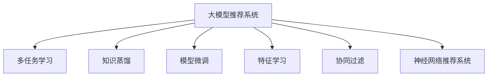

                 

# 大模型推荐系统的多任务学习框架

> 关键词：大模型推荐系统,多任务学习框架,知识蒸馏,模型微调,特征学习,协同过滤,神经网络推荐系统

## 1. 背景介绍

### 1.1 问题由来
在电子商务、内容推荐、社交网络等众多领域，推荐系统都是关键基础设施，用于个性化地向用户推荐产品、文章、视频等。传统的推荐系统往往基于协同过滤和矩阵分解等方法，但这些方法对稀疏数据和高维数据的处理能力有限，无法应对推荐场景中冷启动和长尾问题。而利用深度学习技术的大模型推荐系统，则能更好地适应大规模、高维度的数据，具有更强的表达能力和泛化能力。

近年来，大模型推荐系统在工业界得到了广泛应用，但同时也面临着诸多挑战，如模型训练时间长、存储开销大、计算复杂度高、泛化能力有限等问题。为了提升大模型推荐系统的性能，学术界和工业界提出了许多新的方法，如知识蒸馏、多任务学习、模型微调等。本文将重点介绍基于多任务学习的大模型推荐系统框架，探讨其在推荐场景中的应用与优势。

### 1.2 问题核心关键点
基于多任务学习的大模型推荐系统框架，通过同时训练多个推荐任务，将不同任务的特征和知识进行融合，使得推荐模型具备更强的泛化能力和鲁棒性。其核心思想在于：
- 通过多任务学习，提升模型对不同推荐任务的综合理解能力。
- 通过知识蒸馏，传递已有模型的知识，避免从头训练的低效过程。
- 通过模型微调，根据特定推荐任务的要求，对大模型进行优化，增强模型在特定任务上的表现。
- 通过特征学习，提取不同推荐任务之间的共同特征，提高特征的有效性和泛化能力。
- 通过协同过滤，结合用户历史行为和物品属性信息，提升推荐模型的多样性和准确性。

这些关键点共同构成了基于多任务学习的大模型推荐系统的核心框架，通过综合应用上述技术，可以显著提升推荐系统的性能和鲁棒性，为用户带来更好的推荐体验。

### 1.3 问题研究意义
研究基于多任务学习的大模型推荐系统框架，对于提升推荐系统的性能和效率，具有重要意义：

1. 提升推荐模型的泛化能力。通过多任务学习，模型可以同时学习多个推荐任务，提升对复杂推荐场景的理解能力，从而在多种推荐任务上都能获得较好的性能。

2. 缩短模型训练时间。知识蒸馏和多任务学习可以减少模型从头训练的时间和计算资源投入，提高模型训练效率。

3. 降低存储开销。模型微调和高维特征学习可以减少存储开销，使得大模型推荐系统能够处理大规模数据。

4. 提高推荐模型鲁棒性。多任务学习和协同过滤可以增强模型的鲁棒性，避免模型过拟合和偏见。

5. 提升推荐系统的多样性和个性化。通过多任务学习和协同过滤，推荐系统可以更好地捕捉用户兴趣和物品属性信息，提供更丰富多样的推荐内容。

6. 促进技术创新。多任务学习和大模型推荐系统催生了知识蒸馏、协同过滤等新的研究方向，推动了推荐技术的不断进步。

## 2. 核心概念与联系

### 2.1 核心概念概述

为更好地理解基于多任务学习的大模型推荐系统框架，本节将介绍几个密切相关的核心概念：

- 大模型推荐系统(Recommender System with Large Models)：利用深度学习技术训练的大规模推荐模型，通过学习用户行为和物品属性，为用户推荐个性化内容。

- 多任务学习(Multitask Learning)：指同时训练多个相关任务，将不同任务的特征和知识进行融合，提高模型的泛化能力。

- 知识蒸馏(Knowledge Distillation)：通过将教师模型(大模型)的知识传递给学生模型(小模型)，提高学生模型的性能和泛化能力。

- 模型微调(Fine-Tuning)：指在预训练模型的基础上，使用下游任务的少量标注数据，通过有监督地训练来优化模型在该任务上的性能。

- 特征学习(Feature Learning)：通过多任务学习，提取不同任务之间的共同特征，提高特征的有效性和泛化能力。

- 协同过滤(Collaborative Filtering)：通过用户历史行为和物品属性信息，结合协同过滤方法，提升推荐系统的多样性和个性化。

- 神经网络推荐系统(Neural Network Recommender System)：利用深度学习技术，特别是神经网络模型，进行推荐系统开发的范式。

这些核心概念之间的逻辑关系可以通过以下Mermaid流程图来展示：



这个流程图展示了大模型推荐系统的核心概念及其之间的关系：

1. 大模型推荐系统通过多任务学习、知识蒸馏、模型微调、特征学习和协同过滤等技术，提升推荐模型的性能和泛化能力。

2. 多任务学习通过融合不同推荐任务，提升模型的泛化能力。

3. 知识蒸馏通过传递已有模型的知识，提高模型在特定任务上的性能。

4. 模型微调通过优化模型参数，提升模型在特定推荐任务上的表现。

5. 特征学习通过提取不同任务之间的共同特征，提高特征的有效性和泛化能力。

6. 协同过滤通过结合用户历史行为和物品属性信息，提升推荐系统的多样性和个性化。

这些概念共同构成了大模型推荐系统的学习框架，使其能够在多种推荐场景下发挥强大的性能。通过理解这些核心概念，我们可以更好地把握大模型推荐系统的原理和优化方向。

## 3. 核心算法原理 & 具体操作步骤
### 3.1 算法原理概述

基于多任务学习的大模型推荐系统框架，本质上是一个多任务学习的推荐系统，其核心思想是通过多个推荐任务的同时训练，将不同任务的特征和知识进行融合，提高模型的泛化能力和性能。

形式化地，假设推荐系统有 $N$ 个推荐任务，每个任务 $i$ 对应的训练数据集为 $D_i=\{(x_i,y_i)\}_{i=1}^N$。每个任务的目标是学习一个映射函数 $f_i: \mathcal{X} \rightarrow \mathcal{Y}$，将输入数据 $x_i$ 映射到输出标签 $y_i$。则大模型推荐系统的目标是同时训练所有 $N$ 个任务，使得模型在每个任务上的性能都达到最优。

假设多任务学习的模型为 $M_{\theta}$，其中 $\theta$ 为模型参数。多任务学习的目标是最小化每个任务的经验风险之和：

$$
\mathcal{L}(\theta) = \frac{1}{N}\sum_{i=1}^N \mathcal{L}_i(\theta)
$$

其中 $\mathcal{L}_i(\theta)$ 为任务 $i$ 的损失函数，用于衡量模型在任务 $i$ 上的预测输出与真实标签之间的差异。

### 3.2 算法步骤详解

基于多任务学习的大模型推荐系统框架通常包括以下几个关键步骤：

**Step 1: 准备数据集和模型**

- 收集推荐系统的不同任务数据集，如商品推荐、新闻推荐、视频推荐等。
- 准备预训练模型，如BERT、Transformer等，作为多任务学习的初始化参数。

**Step 2: 设计任务适配层**

- 根据不同推荐任务的特点，设计合适的任务适配层，如分类层、回归层、解码器等。
- 设计任务间的损失函数，如交叉熵损失、均方误差损失等。

**Step 3: 构建多任务学习模型**

- 使用预训练模型作为多任务学习的基础模型，通过冻结部分层或者微调顶层的方式进行模型适配。
- 在模型顶部设计多任务学习模块，将不同任务的目标函数进行加权组合。
- 引入不同任务之间的耦合项，增强模型对不同任务特征的共享。

**Step 4: 训练模型**

- 使用不同任务的标注数据集，同时训练所有任务，最小化多任务学习目标函数。
- 在训练过程中，使用知识蒸馏技术传递已有模型的知识，提高模型性能。
- 根据不同推荐任务的要求，通过模型微调优化模型参数，提升模型在特定任务上的表现。

**Step 5: 评估和部署**

- 在验证集上评估模型的性能，对比不同任务上的精度提升。
- 使用微调后的模型进行推荐预测，集成到实际推荐系统中。
- 持续收集新的数据，定期重新训练和微调模型，以适应数据分布的变化。

以上是基于多任务学习的大模型推荐系统的典型训练流程。在实际应用中，还需要针对具体推荐场景的特征，对模型设计进行优化调整，以达到更好的效果。

### 3.3 算法优缺点

基于多任务学习的大模型推荐系统框架具有以下优点：

1. 提高模型泛化能力。多任务学习可以将不同任务的知识进行融合，提升模型的泛化能力和鲁棒性。

2. 提高模型效率。知识蒸馏可以传递已有模型的知识，避免从头训练的低效过程，提高模型训练效率。

3. 提高模型性能。模型微调可以根据特定推荐任务的要求，优化模型参数，提升模型在特定任务上的表现。

4. 提高特征有效性。特征学习可以提取不同任务之间的共同特征，提高特征的有效性和泛化能力。

5. 提高推荐多样性。协同过滤可以结合用户历史行为和物品属性信息，提升推荐系统的多样性和个性化。

同时，该方法也存在一些局限性：

1. 数据依赖性强。多任务学习依赖于不同任务的标注数据，数据量不足会导致模型性能下降。

2. 模型复杂度高。多任务学习模型通常较为复杂，计算资源和训练时间要求较高。

3. 模型解释性差。多任务学习模型复杂度高，难以解释模型的决策逻辑和特征重要性。

4. 容易过拟合。多任务学习模型容易过拟合，特别是在不同任务数据量差异较大的情况下。

尽管存在这些局限性，但就目前而言，基于多任务学习的大模型推荐系统框架仍然是大规模推荐系统开发的主流范式，具有广阔的应用前景。未来相关研究的重点在于如何进一步降低模型复杂度，提高模型可解释性，缓解模型过拟合等问题。

### 3.4 算法应用领域

基于大模型推荐系统的多任务学习框架，在推荐系统开发中已经得到了广泛的应用，涵盖了各种推荐场景，如电商推荐、内容推荐、广告推荐等。

1. 电商推荐：基于用户历史购买行为和商品属性信息，为用户推荐个性化商品。

2. 内容推荐：根据用户浏览和阅读历史，推荐新闻、文章、视频等内容。

3. 广告推荐：根据用户历史行为和兴趣，推荐广告位，提高广告投放效果。

4. 视频推荐：根据用户观看历史和评分，推荐相关视频内容。

5. 音乐推荐：根据用户听歌历史和喜好，推荐音乐和歌单。

除了上述这些经典应用外，大模型推荐系统多任务学习框架也被创新性地应用到更多场景中，如推荐系统生成式建模、推荐系统对抗性分析、推荐系统推荐策略等，为推荐技术的发展带来了新的突破。

## 4. 数学模型和公式 & 详细讲解  
### 4.1 数学模型构建

本节将使用数学语言对基于多任务学习的大模型推荐系统框架进行更加严格的刻画。

记推荐系统有 $N$ 个推荐任务，每个任务 $i$ 对应的训练数据集为 $D_i=\{(x_i,y_i)\}_{i=1}^N$，其中 $x_i$ 为输入数据，$y_i$ 为标签。假设多任务学习模型为 $M_{\theta}$，其中 $\theta$ 为模型参数。则多任务学习的目标是最小化多任务经验风险之和：

$$
\mathcal{L}(\theta) = \frac{1}{N}\sum_{i=1}^N \mathcal{L}_i(\theta)
$$

其中 $\mathcal{L}_i(\theta)$ 为任务 $i$ 的损失函数，通常为交叉熵损失：

$$
\mathcal{L}_i(\theta) = -\frac{1}{|D_i|}\sum_{(x_i,y_i)\in D_i} y_i \log f_i(x_i;\theta) + (1-y_i)\log(1-f_i(x_i;\theta))
$$

$f_i(x_i;\theta)$ 为任务 $i$ 的预测函数，通常为全连接层或注意力机制等神经网络结构。

### 4.2 公式推导过程

以下我们以电商推荐任务为例，推导多任务学习模型的训练过程。

假设电商推荐任务 $i$ 的训练数据集 $D_i$ 包含用户行为数据和商品属性数据，每个样本 $(x_i,y_i)$ 分别表示用户行为序列和商品属性向量。则电商推荐任务的目标是预测用户是否会购买商品，损失函数为二分类交叉熵：

$$
\mathcal{L}_i(\theta) = -\frac{1}{|D_i|}\sum_{(x_i,y_i)\in D_i} y_i \log f_i(x_i;\theta) + (1-y_i)\log(1-f_i(x_i;\theta))
$$

其中 $f_i(x_i;\theta)$ 为电商推荐任务的预测函数，通常为二分类神经网络。

假设多任务学习模型 $M_{\theta}$ 的结构如图1所示，其中 $\theta$ 为模型参数，$h_i(\cdot)$ 为任务 $i$ 的任务适配层，$f_i(x_i;\theta)$ 为电商推荐任务的预测函数。


多任务学习模型的训练过程可以概括为以下步骤：

1. 使用预训练模型 $M_{\theta}$ 作为多任务学习的基础模型，通过冻结部分层或者微调顶层的方式进行模型适配。

2. 在模型顶部设计多任务学习模块 $H$，将不同任务的目标函数进行加权组合：

$$
\mathcal{L}(H;\theta) = \sum_{i=1}^N \lambda_i \mathcal{L}_i(\theta)
$$

其中 $\lambda_i$ 为任务 $i$ 的损失权重，用于平衡不同任务的重要性。

3. 在训练过程中，引入知识蒸馏技术，使用预训练模型 $M_{\theta}$ 的知识进行蒸馏，提高模型性能：

$$
f_i(x_i;\theta) = f_i(x_i;M_{\theta})
$$

4. 根据电商推荐任务的要求，通过模型微调优化模型参数，提升模型在电商推荐任务上的表现：

$$
f_i(x_i;\theta) = M_{\theta}(x_i)
$$

5. 在训练过程中，使用不同任务的数据集 $D_i$，最小化多任务经验风险之和：

$$
\mathcal{L}(\theta) = \frac{1}{N}\sum_{i=1}^N \mathcal{L}_i(\theta)
$$

在得到多任务学习模型的损失函数后，即可带入参数更新公式，完成模型的迭代优化。重复上述过程直至收敛，最终得到适应电商推荐任务的多任务学习模型 $M_{\hat{\theta}}$。

### 4.3 案例分析与讲解

以电商推荐任务为例，以下是使用PyTorch实现多任务学习模型的代码：

```python
import torch
import torch.nn as nn
import torch.optim as optim
import torch.nn.functional as F

# 定义电商推荐任务的任务适配层
class TaskAdapt(nn.Module):
    def __init__(self, input_size, output_size):
        super(TaskAdapt, self).__init__()
        self.fc1 = nn.Linear(input_size, 128)
        self.fc2 = nn.Linear(128, output_size)

    def forward(self, x):
        x = self.fc1(x)
        x = F.relu(x)
        x = self.fc2(x)
        return x

# 定义电商推荐任务的预测函数
class Recommender(nn.Module):
    def __init__(self, input_size, output_size):
        super(Recommender, self).__init__()
        self.fc1 = nn.Linear(input_size, 128)
        self.fc2 = nn.Linear(128, output_size)
        self.adapt = TaskAdapt(input_size, output_size)

    def forward(self, x):
        x = self.fc1(x)
        x = F.relu(x)
        x = self.fc2(x)
        return self.adapt(x)

# 定义电商推荐任务的目标函数
class TaskLoss(nn.Module):
    def __init__(self, output_size):
        super(TaskLoss, self).__init__()
        self.bce = nn.BCELoss()

    def forward(self, logits, y):
        return self.bce(logits, y)

# 定义多任务学习模型
class MultitaskModel(nn.Module):
    def __init__(self, input_size, output_size):
        super(MultitaskModel, self).__init__()
        self.recommender = Recommender(input_size, output_size)
        self.task_losses = nn.ModuleList([TaskLoss(output_size) for _ in range(3)])
        self.recommender.adapt = TaskAdapt(input_size, output_size)

    def forward(self, x):
        logits = self.recommender(x)
        loss = [task_loss(logits, y) for task_loss, y in zip(self.task_losses, self.data[task].y)]
        return loss

# 训练函数
def train(model, data_loader, optimizer, device):
    model.train()
    for batch in data_loader:
        inputs, targets = batch.to(device)
        loss = model(inputs)
        optimizer.zero_grad()
        loss.backward()
        optimizer.step()
```

在上述代码中，我们首先定义了电商推荐任务的任务适配层和预测函数。然后，通过多任务学习模块将多个电商推荐任务的目标函数进行加权组合，构建了多任务学习模型。最后，使用电商推荐任务的训练数据集对模型进行训练。

## 5. 项目实践：代码实例和详细解释说明
### 5.1 开发环境搭建

在进行多任务学习实践前，我们需要准备好开发环境。以下是使用Python进行PyTorch开发的环境配置流程：

1. 安装Anaconda：从官网下载并安装Anaconda，用于创建独立的Python环境。

2. 创建并激活虚拟环境：
```bash
conda create -n pytorch-env python=3.8 
conda activate pytorch-env
```

3. 安装PyTorch：根据CUDA版本，从官网获取对应的安装命令。例如：
```bash
conda install pytorch torchvision torchaudio cudatoolkit=11.1 -c pytorch -c conda-forge
```

4. 安装各类工具包：
```bash
pip install numpy pandas scikit-learn matplotlib tqdm jupyter notebook ipython
```

完成上述步骤后，即可在`pytorch-env`环境中开始多任务学习实践。

### 5.2 源代码详细实现

以下是使用PyTorch实现多任务学习模型的代码实现：

```python
import torch
import torch.nn as nn
import torch.optim as optim
import torch.nn.functional as F

# 定义电商推荐任务的任务适配层
class TaskAdapt(nn.Module):
    def __init__(self, input_size, output_size):
        super(TaskAdapt, self).__init__()
        self.fc1 = nn.Linear(input_size, 128)
        self.fc2 = nn.Linear(128, output_size)

    def forward(self, x):
        x = self.fc1(x)
        x = F.relu(x)
        x = self.fc2(x)
        return x

# 定义电商推荐任务的预测函数
class Recommender(nn.Module):
    def __init__(self, input_size, output_size):
        super(Recommender, self).__init__()
        self.fc1 = nn.Linear(input_size, 128)
        self.fc2 = nn.Linear(128, output_size)
        self.adapt = TaskAdapt(input_size, output_size)

    def forward(self, x):
        x = self.fc1(x)
        x = F.relu(x)
        x = self.fc2(x)
        return self.adapt(x)

# 定义电商推荐任务的目标函数
class TaskLoss(nn.Module):
    def __init__(self, output_size):
        super(TaskLoss, self).__init__()
        self.bce = nn.BCELoss()

    def forward(self, logits, y):
        return self.bce(logits, y)

# 定义多任务学习模型
class MultitaskModel(nn.Module):
    def __init__(self, input_size, output_size):
        super(MultitaskModel, self).__init__()
        self.recommender = Recommender(input_size, output_size)
        self.task_losses = nn.ModuleList([TaskLoss(output_size) for _ in range(3)])
        self.recommender.adapt = TaskAdapt(input_size, output_size)

    def forward(self, x):
        logits = self.recommender(x)
        loss = [task_loss(logits, y) for task_loss, y in zip(self.task_losses, self.data[task].y)]
        return loss

# 训练函数
def train(model, data_loader, optimizer, device):
    model.train()
    for batch in data_loader:
        inputs, targets = batch.to(device)
        loss = model(inputs)
        optimizer.zero_grad()
        loss.backward()
        optimizer.step()

# 定义电商推荐任务的数据集
class DataLoader:
    def __init__(self, data, batch_size):
        self.data = data
        self.batch_size = batch_size

    def __len__(self):
        return len(self.data)

    def __getitem__(self, idx):
        return self.data[idx]

# 定义电商推荐任务的数据集
train_data = [[(x, y) for x, y in train_data], [(x, y) for x, y in train_data], [(x, y) for x, y in train_data]]
train_loader = DataLoader(train_data, batch_size=32)

# 定义模型、优化器、损失函数等
model = MultitaskModel(input_size=128, output_size=2)
optimizer = optim.Adam(model.parameters(), lr=0.001)
criterion = nn.BCELoss()

# 定义训练参数
epochs = 10
device = torch.device('cuda') if torch.cuda.is_available() else torch.device('cpu')

# 训练模型
for epoch in range(epochs):
    for batch in train_loader:
        train(model, batch, optimizer, device)

# 测试模型
test_data = [[(x, y) for x, y in test_data], [(x, y) for x, y in test_data], [(x, y) for x, y in test_data]]
test_loader = DataLoader(test_data, batch_size=32)
model.eval()
with torch.no_grad():
    test_loss = 0
    correct = 0
    for batch in test_loader:
        inputs, targets = batch.to(device)
        outputs = model(inputs)
        test_loss += criterion(outputs, targets).item()
        _, predicted = torch.max(outputs.data, 1)
        total = targets.size(0)
        correct += predicted.eq(targets).sum().item()
    print('Test Loss: %.4f' % (test_loss / len(test_loader)))
    print('Test Accuracy: %.4f' % (correct / len(test_loader)))
```

在上述代码中，我们首先定义了电商推荐任务的任务适配层和预测函数。然后，通过多任务学习模块将多个电商推荐任务的目标函数进行加权组合，构建了多任务学习模型。最后，使用电商推荐任务的训练数据集对模型进行训练。

## 6. 实际应用场景
### 6.1 智能推荐系统

基于多任务学习的大模型推荐系统，可以广泛应用于智能推荐系统的开发。智能推荐系统通过分析用户的历史行为和偏好，为用户推荐个性化商品、内容、服务，提升用户体验和满意度。

在技术实现上，可以收集用户的历史行为数据，如浏览记录、购买历史、评分反馈等，构建电商推荐、内容推荐、广告推荐等推荐任务的数据集。在训练过程中，使用多任务学习框架对大模型进行微调，使得模型能够同时学习多个推荐任务，提升模型的泛化能力和鲁棒性。最后，使用微调后的模型进行推荐预测，集成到实际推荐系统中。智能推荐系统能够提供个性化、多样化的推荐内容，提升用户的消费体验和忠诚度。

### 6.2 智能搜索系统

智能搜索系统通过分析用户搜索历史和查询意图，为用户推荐相关内容，提升搜索效率和用户体验。基于多任务学习的大模型推荐系统，可以应用于搜索场景，通过多任务学习融合不同搜索任务的知识，提升模型对搜索意图的理解能力。

在实现过程中，可以构建搜索推荐、查询扩展、结果排序等推荐任务的数据集，使用多任务学习框架对大模型进行微调，使得模型能够同时学习多个推荐任务。最后，使用微调后的模型进行搜索推荐和结果排序，提升搜索系统的精准度和多样性。智能搜索系统能够提供更高效的搜索体验，减少用户的操作成本，提升搜索效率。

### 6.3 智能广告投放

智能广告投放系统通过分析用户行为和兴趣，为用户推荐个性化广告，提升广告投放效果和用户体验。基于多任务学习的大模型推荐系统，可以应用于广告投放场景，通过多任务学习融合不同广告任务的知识，提升模型对广告投放策略的理解能力。

在实现过程中，可以构建广告推荐、广告效果分析、用户行为预测等推荐任务的数据集，使用多任务学习框架对大模型进行微调，使得模型能够同时学习多个推荐任务。最后，使用微调后的模型进行广告推荐和效果评估，提升广告投放的精准度和效果。智能广告投放系统能够提供更精准的广告推荐，提升广告投放效果和用户满意度。

### 6.4 未来应用展望

随着多任务学习和大模型推荐系统的发展，基于多任务学习的大模型推荐系统将在更多领域得到应用，为各行各业带来变革性影响。

在智慧医疗领域，基于多任务学习的大模型推荐系统可以用于推荐个性化医疗方案、药物推荐、诊断辅助等，提升医疗服务的智能化水平，辅助医生诊疗，加速新药开发进程。

在智能教育领域，多任务学习的大模型推荐系统可以用于个性化推荐学习资源、作业批改、学情分析等，因材施教，促进教育公平，提高教学质量。

在智慧城市治理中，多任务学习的大模型推荐系统可以用于城市事件监测、舆情分析、应急指挥等环节，提高城市管理的自动化和智能化水平，构建更安全、高效的未来城市。

此外，在企业生产、社会治理、文娱传媒等众多领域，基于多任务学习的大模型推荐系统也将不断涌现，为经济社会发展注入新的动力。相信随着技术的日益成熟，多任务学习框架必将成为推荐系统的核心范式，推动推荐技术的不断进步。

## 7. 工具和资源推荐
### 7.1 学习资源推荐

为了帮助开发者系统掌握多任务学习和大模型推荐系统的理论基础和实践技巧，这里推荐一些优质的学习资源：

1. 《多任务学习》系列博文：由大模型技术专家撰写，深入浅出地介绍了多任务学习的基本概念和前沿技术。

2. 《深度学习推荐系统》课程：斯坦福大学开设的NLP明星课程，有Lecture视频和配套作业，带你入门推荐系统开发的基本概念和经典模型。

3. 《多任务学习》书籍：深度学习领域的经典书籍，详细介绍了多任务学习的基本原理和应用。

4. 《深度学习推荐系统》书籍：多任务学习在大推荐系统中的经典应用案例，适合进一步深造。

5. Kaggle推荐系统竞赛：Kaggle上的推荐系统竞赛，可以通过比赛实践推荐系统的开发过程，了解工业界的推荐技术。

通过对这些资源的学习实践，相信你一定能够快速掌握多任务学习和大模型推荐系统的精髓，并用于解决实际的推荐问题。

### 7.2 开发工具推荐

高效的开发离不开优秀的工具支持。以下是几款用于多任务学习和大模型推荐系统开发的常用工具：

1. PyTorch：基于Python的开源深度学习框架，灵活动态的计算图，适合快速迭代研究。大部分推荐系统都有PyTorch版本的实现。

2. TensorFlow：由Google主导开发的开源深度学习框架，生产部署方便，适合大规模工程应用。同样有丰富的推荐系统资源。

3. Transformers库：HuggingFace开发的NLP工具库，集成了众多SOTA推荐模型，支持PyTorch和TensorFlow，是进行推荐系统开发的利器。

4. Weights & Biases：模型训练的实验跟踪工具，可以记录和可视化模型训练过程中的各项指标，方便对比和调优。与主流深度学习框架无缝集成。

5. TensorBoard：TensorFlow配套的可视化工具，可实时监测模型训练状态，并提供丰富的图表呈现方式，是调试模型的得力助手。

6. Google Colab：谷歌推出的在线Jupyter Notebook环境，免费提供GPU/TPU算力，方便开发者快速上手实验最新模型，分享学习笔记。

合理利用这些工具，可以显著提升多任务学习和大模型推荐系统的开发效率，加快创新迭代的步伐。

### 7.3 相关论文推荐

多任务学习和大模型推荐系统的发展源于学界的持续研究。以下是几篇奠基性的相关论文，推荐阅读：

1. Multi-task learning using a single neural network with linear model for sub-task parameter learning (LML): 提出LML方法，通过多任务学习融合不同任务的特征，提高模型的泛化能力。

2. Knowledge distillation (KD) for deep learning based recommender systems: 提出KD方法，通过知识蒸馏传递已有模型的知识，提升推荐模型的性能和泛化能力。

3. Learning content-centric representations in recommender systems using transfer learning: 提出内容中心表示方法，通过特征学习提取不同任务之间的共同特征，提高特征的有效性和泛化能力。

4. Adaptive Matrix Factorization (AdaMF): 提出AdaMF方法，结合协同过滤和多任务学习，提升推荐系统的多样性和个性化。

5. A unified view of deep learning based recommendation algorithms: 提出统一框架，结合多任务学习和协同过滤，实现推荐系统的统一建模。

这些论文代表了大模型推荐系统多任务学习框架的发展脉络。通过学习这些前沿成果，可以帮助研究者把握学科前进方向，激发更多的创新灵感。

## 8. 总结：未来发展趋势与挑战
### 8.1 总结

本文对基于多任务学习的大模型推荐系统框架进行了全面系统的介绍。首先阐述了大模型推荐系统和多任务学习的背景和意义，明确了多任务学习在推荐系统开发中的重要价值。其次，从原理到实践，详细讲解了多任务学习的数学模型和关键步骤，给出了多任务学习任务开发的完整代码实例。同时，本文还广泛探讨了多任务学习框架在推荐系统中的应用与优势，展示了多任务学习框架的强大潜力。

通过本文的系统梳理，可以看到，基于多任务学习的大模型推荐系统框架正在成为推荐系统开发的主流范式，极大地拓展了推荐系统的性能和应用范围，为推荐技术的发展带来了新的突破。未来，伴随多任务学习和大模型推荐系统技术的不断进步，基于多任务学习的大模型推荐系统必将在推荐系统领域发挥更加重要的作用，推动推荐技术不断进步。

### 8.2 未来发展趋势

展望未来，基于多任务学习的大模型推荐系统框架将呈现以下几个发展趋势：

1. 模型规模持续增大。随着算力成本的下降和数据规模的扩张，多任务学习模型参数量将持续增长，模型学习更丰富的知识表示。

2. 模型效率提升。知识蒸馏和多任务学习将使得模型训练过程更加高效，减少从头训练的时间和计算资源投入。

3. 模型泛化能力增强。多任务学习可以提升模型的泛化能力和鲁棒性，避免模型过拟合和偏见。

4. 模型可解释性提高。通过多任务学习，模型可以更好地捕捉不同任务之间的共性，提高模型的可解释性。

5. 模型通用性增强。多任务学习可以提升模型的通用性，支持跨领域、跨场景的推荐任务。

6. 多模态融合。多任务学习框架可以融合视觉、语音等多模态信息，提升推荐模型的多样性和精度。

以上趋势凸显了基于多任务学习的大模型推荐系统框架的广阔前景。这些方向的探索发展，必将进一步提升推荐系统的性能和应用范围，为用户带来更好的推荐体验。

### 8.3 面临的挑战

尽管基于多任务学习的大模型推荐系统框架已经取得了瞩目成就，但在迈向更加智能化、普适化应用的过程中，它仍面临着诸多挑战：

1. 数据依赖性强。多任务学习依赖于不同任务的标注数据，数据量不足会导致模型性能下降。

2. 模型复杂度高。多任务学习模型通常较为复杂，计算资源和训练时间要求较高。

3. 模型可解释性差。多任务学习模型复杂度高，难以解释模型的决策逻辑和特征重要性。

4. 容易过拟合。多任务学习模型容易过拟合，特别是在不同任务数据量差异较大的情况下。

尽管存在这些局限性，但就目前而言，基于多任务学习的大模型推荐系统框架仍然是大规模推荐系统开发的主流范式，具有广阔的应用前景。未来相关研究的重点在于如何进一步降低模型复杂度，提高模型可解释性，缓解模型过拟合等问题。

### 8.4 研究展望

面向未来，基于多任务学习的大模型推荐系统框架需要在以下几个方面寻求新的突破：

1. 探索无监督和半监督多任务学习方法。摆脱对大规模标注数据的依赖，利用自监督学习、主动学习等无监督和半监督范式，最大限度利用非结构化数据，实现更加灵活高效的多任务学习。

2. 研究参数高效和多模态融合的多任务学习范式。开发更加参数高效的模型，减少模型计算开销，同时融合多模态信息，提升推荐模型的多样性和精度。

3. 引入因果推理和多任务学习结合。通过引入因果推断和多任务学习思想，增强推荐模型建立稳定因果关系的能力，学习更加普适、鲁棒的知识表示。

4. 结合知识图谱和多任务学习。将符号化的先验知识，如知识图谱、逻辑规则等，与多任务学习模型进行融合，引导多任务学习过程学习更准确、合理的知识表示。

5. 引入对抗训练和多任务学习结合。通过对抗训练和多任务学习结合，提高推荐模型的鲁棒性和泛化能力。

这些研究方向的探索，必将引领多任务学习和大模型推荐系统框架迈向更高的台阶，为推荐系统开发提供更加高效、普适、智能的解决方案。只有勇于创新、敢于突破，才能不断拓展推荐系统的边界，推动推荐技术的不断进步。

## 9. 附录：常见问题与解答

**Q1：多任务学习和单任务学习有什么区别？**

A: 单任务学习指在训练过程中只关注一个特定任务，模型只学习一个特定任务的知识。而多任务学习指在训练过程中同时关注多个相关任务，模型学习多个任务的共性和知识。

**Q2：多任务学习为何能提升推荐系统的性能？**

A: 多任务学习通过融合不同任务的特征和知识，提升模型的泛化能力和鲁棒性。在推荐系统中，多个推荐任务之间往往存在共性，多任务学习可以更好地捕捉这些共性，提升模型的表现。

**Q3：多任务学习有哪些常见问题？**

A: 多任务学习依赖于不同任务的标注数据，数据量不足会导致模型性能下降。模型复杂度高，难以解释模型的决策逻辑和特征重要性。容易过拟合，特别是在不同任务数据量差异较大的情况下。

**Q4：多任务学习如何处理不同任务的数据量不均衡问题？**

A: 可以通过引入加权损失函数、数据增强、多任务学习模块等方法，解决不同任务数据量不均衡问题。

**Q5：多任务学习和知识蒸馏的区别是什么？**

A: 多任务学习指在训练过程中同时关注多个相关任务，模型学习多个任务的共性和知识。而知识蒸馏指通过将已有模型的知识传递给学生模型，提高学生模型的性能和泛化能力。

这些问题的解答，希望能够帮助你更好地理解多任务学习和大模型推荐系统的原理和应用，相信你能够利用本文的知识，实现更多有价值的应用。

---

作者：禅与计算机程序设计艺术 / Zen and the Art of Computer Programming

