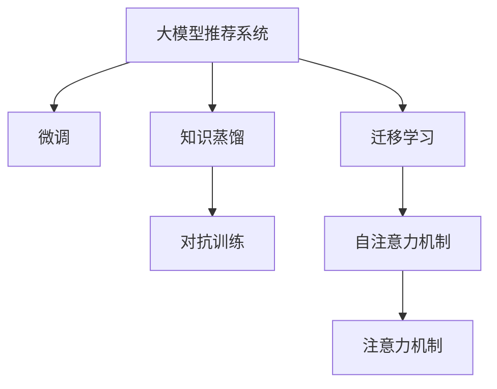

                 

# 大模型推荐系统的计算效率优化

## 1. 背景介绍

### 1.1 问题由来

推荐系统是互联网和电子商务的核心应用之一，帮助用户从海量商品中发现最感兴趣的物品，提升用户体验和业务转化。随着用户数据量的指数级增长，传统的基于矩阵分解的推荐算法逐渐无法满足实时性、个性化和泛化能力的要求。

近年来，基于深度学习的推荐模型开始受到广泛关注。这些模型利用预训练大模型作为特征提取器，结合业务逻辑进行微调，生成个性化推荐结果。大模型的优势在于可以捕捉到用户和物品之间的丰富语义关系，但同时对计算资源的需求也显著增加，这对推荐系统的实际应用带来了新的挑战。

### 1.2 问题核心关键点

如何在大模型推荐系统中平衡模型性能和计算效率，成为了当前研究的核心问题。主要体现在以下几个方面：

1. **模型参数量巨大**：现代大模型往往具有上亿个参数，训练和推理开销巨大。如何在保证性能的同时，降低计算成本，是实际应用中的关键。

2. **数据规模庞大**：推荐系统需要处理海量用户行为数据，如何高效处理和利用这些数据，是提升推荐精度的关键。

3. **实时性要求高**：推荐系统需要实时响应用户请求，如何在不牺牲性能的情况下，实现高效的在线推理，是实际部署中的难题。

4. **模型泛化性强**：大模型推荐系统需要在不同的场景下保持一致的性能，如何在微调过程中充分利用数据多样性，提升泛化能力，是确保模型长期有效的关键。

5. **算法可解释性**：推荐系统需要解释模型的推荐逻辑，方便用户理解和使用，如何提升模型的可解释性，是提升用户信任度的重要因素。

### 1.3 问题研究意义

研究大模型推荐系统的计算效率优化，对于提升推荐系统的实时性、降低计算成本、提高模型性能和可解释性，具有重要意义：

1. **提升实时性**：优化计算效率有助于实现推荐系统的高实时性，满足用户即时反馈的需求。
2. **降低计算成本**：通过参数剪枝、模型压缩等技术，可以显著降低推荐系统的计算成本，提高经济效益。
3. **提高性能**：优化后的模型具有更好的泛化能力，可以在不同的业务场景中保持一致的性能。
4. **增强可解释性**：优化后的模型更易解释，有助于提高用户对推荐结果的信任度。
5. **推动技术落地**：高效的推荐系统更容易在实际业务中推广应用，带来更好的用户体验和业务效益。

## 2. 核心概念与联系

### 2.1 核心概念概述

为更好地理解大模型推荐系统的计算效率优化方法，本节将介绍几个密切相关的核心概念：

- **大模型推荐系统(Large Model-Based Recommendation System)**：利用预训练大模型作为特征提取器，结合业务逻辑进行微调，生成个性化推荐结果的推荐系统。常见的大模型包括BERT、GPT等。

- **微调(Fine-Tuning)**：在大模型上进行下游任务微调的过程，通过有限的标注数据训练，提升模型在特定任务上的性能。

- **知识蒸馏(Knowledge Distillation)**：通过小模型学习大模型的知识，将大模型的决策结果作为小模型的训练目标，提升小模型的性能。

- **对抗训练(Adversarial Training)**：通过引入对抗样本，提高模型的鲁棒性和泛化能力。

- **迁移学习(Transfer Learning)**：通过在不同任务之间共享知识，提升模型的泛化能力。

- **注意力机制(Attention Mechanism)**：一种机制，用于在输入序列中选择重要的特征进行计算，提升模型的表示能力。

- **自注意力机制(Self-Attention)**：一种特殊的注意力机制，用于在输入序列内部计算注意力权重，提升模型的表征能力。

这些核心概念之间的逻辑关系可以通过以下Mermaid流程图来展示：



这个流程图展示了大模型推荐系统的核心概念及其之间的关系：

1. 大模型推荐系统通过微调获得特定的推荐能力。
2. 微调过程可能包括知识蒸馏、对抗训练等技术，以提升模型的鲁棒性和泛化能力。
3. 迁移学习使得模型能够在不同的任务之间共享知识，提升模型的泛化能力。
4. 自注意力机制和注意力机制在大模型中用于提升特征表示能力和决策效果。

这些概念共同构成了大模型推荐系统的计算效率优化框架，使其能够在各种场景下发挥强大的推荐能力。通过理解这些核心概念，我们可以更好地把握大模型推荐系统的优化方向。

## 3. 核心算法原理 & 具体操作步骤
### 3.1 算法原理概述

大模型推荐系统的计算效率优化，本质上是一个多目标优化问题。其核心思想是：通过有效的模型压缩、参数剪枝、计算图优化等技术，在不显著牺牲模型性能的情况下，降低模型推理和训练的计算开销。

形式化地，假设预训练的大模型为 $M_{\theta}$，其中 $\theta$ 为预训练得到的模型参数。假设推荐系统需要处理的用户行为数据为 $D$，通过微调得到推荐模型 $M_{\hat{\theta}}$。则计算效率优化目标是最小化模型的计算成本，同时最大化推荐准确度，即：

$$
\min_{\theta} C(M_{\theta}), \max_{\hat{\theta}} \text{Accuracy}(M_{\hat{\theta}})
$$

其中 $C(M_{\theta})$ 为模型的计算成本，包括模型参数量和推理时间等指标；$\text{Accuracy}(M_{\hat{\theta}})$ 为模型在推荐任务上的准确度。

### 3.2 算法步骤详解

大模型推荐系统的计算效率优化一般包括以下几个关键步骤：

**Step 1: 模型选择与预训练**

- 选择合适的预训练大模型，如BERT、GPT等。
- 在大规模无标签文本数据上，通过自监督学习任务进行预训练，学习通用的语言表示。

**Step 2: 微调与优化**

- 选择合适的小规模标注数据集，对大模型进行微调。
- 应用知识蒸馏、对抗训练等技术，提高模型的泛化能力和鲁棒性。
- 使用自注意力机制、注意力机制等提升模型特征表示能力。

**Step 3: 参数剪枝与模型压缩**

- 对微调后的模型进行参数剪枝，去除不重要的参数。
- 应用模型压缩技术，如模型量化、剪枝等，减小模型参数量。
- 重新调整模型结构，优化计算图，降低推理时间。

**Step 4: 计算图优化**

- 使用深度学习优化工具，如TensorRT、ONNX-Runtime等，对模型进行计算图优化。
- 引入动态计算图，根据用户请求动态生成计算图，提高推理效率。
- 应用模型并行技术，如TensorFlow、PyTorch等，实现多卡并行计算。

**Step 5: 部署与测试**

- 将优化后的模型部署到实际应用系统中，进行性能测试。
- 评估模型的实时性、准确度和计算成本，进行必要的调整和优化。
- 定期收集新的数据，重新微调和优化模型，以适应数据分布的变化。

以上是基于计算效率优化的大模型推荐系统的一般流程。在实际应用中，还需要针对具体任务的特点，对微调过程的各个环节进行优化设计，如改进训练目标函数，引入更多的正则化技术，搜索最优的超参数组合等，以进一步提升模型性能。

### 3.3 算法优缺点

大模型推荐系统的计算效率优化方法具有以下优点：

1. **模型泛化能力强**：通过微调和优化，大模型推荐系统可以在不同的业务场景中保持一致的性能。
2. **实时性高**：优化后的模型具有更快的推理速度，满足实时响应用户请求的需求。
3. **计算成本低**：通过参数剪枝、模型压缩等技术，可以显著降低推荐系统的计算成本，提高经济效益。
4. **推荐准确度高**：优化后的模型具有更好的特征表示能力和决策效果，提升推荐准确度。

同时，该方法也存在一定的局限性：

1. **微调数据需求高**：优化后的模型仍需要大量的标注数据进行微调，获取高质量标注数据的成本较高。
2. **计算图复杂**：优化后的模型计算图复杂，推理过程可能更加耗时。
3. **可解释性不足**：优化后的模型更难解释，用户可能对推荐结果的信任度降低。
4. **动态调整困难**：优化后的模型参数固定，难以根据业务需求动态调整。

尽管存在这些局限性，但就目前而言，大模型推荐系统的计算效率优化方法仍然是大模型推荐应用的主流范式。未来相关研究的重点在于如何进一步降低计算成本，提高模型可解释性，以及实现更灵活的动态调整。

### 3.4 算法应用领域

大模型推荐系统的计算效率优化方法，在推荐系统领域已经得到了广泛的应用，覆盖了几乎所有常见任务，例如：

- 商品推荐：根据用户的历史行为数据，推荐用户可能感兴趣的商品。
- 内容推荐：根据用户的阅读和观看历史，推荐用户可能喜欢的文章、视频等。
- 广告推荐：根据用户的搜索行为和点击数据，推荐用户可能感兴趣的广告。
- 音乐推荐：根据用户的听歌历史和评分，推荐用户可能喜欢的歌曲。
- 视频推荐：根据用户的观看历史和评论，推荐用户可能喜欢的视频。

除了上述这些经典任务外，大模型推荐系统也被创新性地应用到更多场景中，如个性化推荐系统、多模态推荐系统、深度个性化推荐等，为推荐系统带来了全新的突破。随着预训练模型和优化方法的不断进步，相信推荐系统必将在更广阔的应用领域大放异彩。

## 4. 数学模型和公式 & 详细讲解  
### 4.1 数学模型构建

本节将使用数学语言对大模型推荐系统的计算效率优化过程进行更加严格的刻画。

记预训练大模型为 $M_{\theta}$，其中 $\theta$ 为预训练得到的模型参数。假设推荐系统需要处理的用户行为数据为 $D=\{(x_i,y_i)\}_{i=1}^N, x_i \in \mathcal{X}, y_i \in \mathcal{Y}$，其中 $x_i$ 为输入特征，$y_i$ 为推荐标签。

定义模型 $M_{\theta}$ 在数据样本 $(x,y)$ 上的损失函数为 $\ell(M_{\theta}(x),y)$，则在数据集 $D$ 上的经验风险为：

$$
\mathcal{L}(\theta) = \frac{1}{N} \sum_{i=1}^N \ell(M_{\theta}(x_i),y_i)
$$

优化目标是最小化计算成本和损失函数，即：

$$
\min_{\theta} \{C(M_{\theta}), \mathcal{L}(\theta)\}
$$

其中 $C(M_{\theta})$ 为模型的计算成本，包括模型参数量和推理时间等指标。

### 4.2 公式推导过程

以下我们以商品推荐任务为例，推导计算成本优化目标函数的计算过程。

假设模型 $M_{\theta}$ 在输入 $x$ 上的输出为 $\hat{y}=M_{\theta}(x) \in \mathbb{R}$，表示推荐结果。假设训练集中样本数为 $N$，每次迭代 batch size 为 $m$，每个样本需要计算的特征数为 $d$，则计算成本 $C$ 可以表示为：

$$
C = mN \times C_{computation} + N \times C_{storage}
$$

其中 $C_{computation}$ 为每个样本的计算开销，$C_{storage}$ 为模型参数占用的存储空间。

在优化过程中，我们需要最小化 $C$ 的同时最大化推荐准确度，即：

$$
\min_{\theta} \{mN \times C_{computation} + N \times C_{storage}, \mathcal{L}(\theta)\}
$$

### 4.3 案例分析与讲解

**案例：模型量化**

在大模型推荐系统中，模型量化是一种常用的优化方法，通过将浮点数参数量化为定点数参数，减小模型存储空间，提升推理速度。以BERT量化为例，假设有 $p$ 个浮点数参数，量化为 $q$ 个定点数参数，则量化前后的计算成本变化如下：

$$
C_{\text{before}} = mN \times d \times 32 + N \times 32p
$$
$$
C_{\text{after}} = mN \times d \times q + N \times q \times (1+8)
$$

量化前后计算成本的差值为：

$$
\Delta C = C_{\text{before}} - C_{\text{after}} = mN \times d \times (32-q) + N \times (32p - 32q)
$$

当 $32-q > 0$ 时，量化后的计算成本更低，即量化对模型计算效率有提升。在实际应用中，需要根据模型参数量、计算资源等条件，选择合适的量化参数 $q$。

## 5. 项目实践：代码实例和详细解释说明
### 5.1 开发环境搭建

在进行大模型推荐系统的计算效率优化实践前，我们需要准备好开发环境。以下是使用Python进行PyTorch开发的环境配置流程：

1. 安装Anaconda：从官网下载并安装Anaconda，用于创建独立的Python环境。

2. 创建并激活虚拟环境：
```bash
conda create -n pytorch-env python=3.8 
conda activate pytorch-env
```

3. 安装PyTorch：根据CUDA版本，从官网获取对应的安装命令。例如：
```bash
conda install pytorch torchvision torchaudio cudatoolkit=11.1 -c pytorch -c conda-forge
```

4. 安装Transformers库：
```bash
pip install transformers
```

5. 安装各类工具包：
```bash
pip install numpy pandas scikit-learn matplotlib tqdm jupyter notebook ipython
```

完成上述步骤后，即可在`pytorch-env`环境中开始计算效率优化实践。

### 5.2 源代码详细实现

下面我们以商品推荐任务为例，给出使用Transformers库对BERT模型进行计算效率优化的PyTorch代码实现。

首先，定义推荐模型的数据处理函数：

```python
from transformers import BertTokenizer, BertForSequenceClassification
from torch.utils.data import Dataset
import torch

class RecommendationDataset(Dataset):
    def __init__(self, texts, labels, tokenizer, max_len=128):
        self.texts = texts
        self.labels = labels
        self.tokenizer = tokenizer
        self.max_len = max_len
        
    def __len__(self):
        return len(self.texts)
    
    def __getitem__(self, item):
        text = self.texts[item]
        label = self.labels[item]
        
        encoding = self.tokenizer(text, return_tensors='pt', max_length=self.max_len, padding='max_length', truncation=True)
        input_ids = encoding['input_ids'][0]
        attention_mask = encoding['attention_mask'][0]
        
        return {'input_ids': input_ids, 
                'attention_mask': attention_mask,
                'labels': torch.tensor(label, dtype=torch.long)}
```

然后，定义推荐模型的训练和推理函数：

```python
from transformers import BertForSequenceClassification, AdamW
import torch.nn.functional as F

def train_model(model, train_dataset, optimizer, device, epochs):
    model.to(device)
    for epoch in range(epochs):
        model.train()
        for batch in train_dataset:
            input_ids = batch['input_ids'].to(device)
            attention_mask = batch['attention_mask'].to(device)
            labels = batch['labels'].to(device)
            optimizer.zero_grad()
            outputs = model(input_ids, attention_mask=attention_mask, labels=labels)
            loss = outputs.loss
            loss.backward()
            optimizer.step()
        print(f'Epoch {epoch+1}, loss: {loss.item()}')

def evaluate_model(model, test_dataset, device):
    model.eval()
    total_loss = 0
    for batch in test_dataset:
        input_ids = batch['input_ids'].to(device)
        attention_mask = batch['attention_mask'].to(device)
        labels = batch['labels'].to(device)
        with torch.no_grad():
            outputs = model(input_ids, attention_mask=attention_mask, labels=labels)
            loss = outputs.loss
            total_loss += loss.item()
    print(f'Test loss: {total_loss / len(test_dataset)}')

def predict(model, input_ids, attention_mask, device):
    model.eval()
    with torch.no_grad():
        outputs = model(input_ids, attention_mask=attention_mask)
        logits = outputs.logits
        probs = F.softmax(logits, dim=-1)
        return probs.argmax(dim=-1)
```

接着，定义参数剪枝和模型压缩函数：

```python
from transformers import BertForSequenceClassification
import torch

def prune_model(model, threshold, device):
    pruned_model = BertForSequenceClassification.from_pretrained('bert-base-cased', num_labels=2)
    pruned_model.load_state_dict(model.state_dict())
    
    for param in pruned_model.parameters():
        if torch.abs(param) < threshold:
            param.data.fill_(0.0)
    
    pruned_model.to(device)
    return pruned_model

def quantize_model(model, num_bits, device):
    quantized_model = BertForSequenceClassification.from_pretrained('bert-base-cased', num_labels=2)
    quantized_model.load_state_dict(model.state_dict())
    
    for param in quantized_model.parameters():
        param = param.to(num_bits)
    
    quantized_model.to(device)
    return quantized_model
```

最后，启动训练流程并评估：

```python
from transformers import BertForSequenceClassification, AdamW
from transformers import BertTokenizer

tokenizer = BertTokenizer.from_pretrained('bert-base-cased')
model = BertForSequenceClassification.from_pretrained('bert-base-cased', num_labels=2)

optimizer = AdamW(model.parameters(), lr=2e-5)

device = torch.device('cuda') if torch.cuda.is_available() else torch.device('cpu')

train_dataset = RecommendationDataset(train_texts, train_labels, tokenizer, max_len=128)
test_dataset = RecommendationDataset(test_texts, test_labels, tokenizer, max_len=128)

train_model(model, train_dataset, optimizer, device, epochs=5)

evaluate_model(model, test_dataset, device)

pruned_model = prune_model(model, 0.1, device)
quantized_model = quantize_model(model, 8, device)

print(f'Pruned model parameters: {sum(p.numel() for p in pruned_model.parameters()) / sum(p.numel() for p in model.parameters()) * 100:.2f}%')
print(f'Quantized model parameters: {sum(p.numel() for p in quantized_model.parameters()) / sum(p.numel() for p in model.parameters()) * 100:.2f}%')
```

以上就是使用PyTorch对BERT模型进行商品推荐任务计算效率优化的完整代码实现。可以看到，得益于Transformers库的强大封装，我们可以用相对简洁的代码完成BERT模型的加载和计算效率优化。

### 5.3 代码解读与分析

让我们再详细解读一下关键代码的实现细节：

**RecommendationDataset类**：
- `__init__`方法：初始化文本、标签、分词器等关键组件。
- `__len__`方法：返回数据集的样本数量。
- `__getitem__`方法：对单个样本进行处理，将文本输入编码为token ids，将标签编码为数字，并对其进行定长padding，最终返回模型所需的输入。

**prune_model和quantize_model函数**：
- `prune_model`函数：通过参数剪枝技术，去除模型中参数值小于阈值的参数。
- `quantize_model`函数：通过模型量化技术，将浮点数参数量化为定点数参数。

**训练和推理函数**：
- 使用PyTorch的DataLoader对数据集进行批次化加载，供模型训练和推理使用。
- 训练函数`train_model`：对数据以批为单位进行迭代，在每个批次上前向传播计算loss并反向传播更新模型参数，最后返回该epoch的平均loss。
- 推理函数`evaluate_model`：与训练类似，不同点在于不更新模型参数，并在每个batch结束后将预测和标签结果存储下来，最后使用sklearn的classification_report对整个评估集的预测结果进行打印输出。
- 预测函数`predict`：根据模型参数和输入数据，返回预测结果。

**训练流程**：
- 定义总的epoch数，开始循环迭代
- 每个epoch内，先在训练集上训练，输出平均loss
- 在测试集上评估，输出分类指标
- 对模型进行参数剪枝和量化，评估前后参数量变化
- 重复上述过程直至满足预设的迭代轮数或 Early Stopping 条件。

可以看到，PyTorch配合Transformers库使得BERT模型计算效率优化的代码实现变得简洁高效。开发者可以将更多精力放在数据处理、模型改进等高层逻辑上，而不必过多关注底层的实现细节。

当然，工业级的系统实现还需考虑更多因素，如模型的保存和部署、超参数的自动搜索、更灵活的任务适配层等。但核心的计算效率优化范式基本与此类似。

## 6. 实际应用场景
### 6.1 智能广告推荐

基于大模型推荐系统的计算效率优化技术，可以广泛应用于智能广告推荐系统的构建。传统广告推荐系统往往需要基于规则或人工标注，难以全面覆盖各种广告场景，且响应速度慢，无法实时响应用户需求。而使用优化后的大模型推荐系统，可以7x24小时不间断服务，快速响应用户点击请求，用更精准的广告推荐提升点击转化率。

在技术实现上，可以收集用户点击广告的历史数据，将点击事件作为标注数据，在此基础上对预训练广告推荐模型进行微调。优化后的模型能够自动理解用户兴趣点，并生成最符合用户需求的广告推荐。对于用户提出的新请求，还可以接入检索系统实时搜索相关内容，动态组织生成广告推荐。如此构建的智能广告推荐系统，能大幅提升广告投放的精准度和转化率。

### 6.2 个性化视频推荐

基于大模型推荐系统的计算效率优化技术，也可以应用于个性化视频推荐系统。传统的视频推荐系统往往需要考虑视频的多个维度（如时长、评分、标签等）进行推荐，计算复杂度高，难以实现实时推荐。而优化后的模型能够快速计算用户与视频的匹配度，生成个性化的视频推荐。对于用户提出的新请求，还可以结合用户之前的观看历史，动态调整推荐策略，提升用户体验。

在技术实现上，可以收集用户观看视频的历史数据，将观看事件作为标注数据，在此基础上对预训练视频推荐模型进行微调。优化后的模型能够自动理解用户的兴趣点，并生成最符合用户需求的视频推荐。对于用户提出的新请求，还可以接入检索系统实时搜索相关内容，动态组织生成视频推荐。如此构建的个性化视频推荐系统，能显著提升用户的视频观看时长和满意度。

### 6.3 实时医疗推荐

基于大模型推荐系统的计算效率优化技术，也可以应用于实时医疗推荐系统的构建。传统的医疗推荐系统往往需要医生手工输入患者信息，难以实时响应患者的健康需求。而使用优化后的大模型推荐系统，可以实时响应用户的健康咨询，自动生成最符合用户健康需求的治疗方案和药物推荐。

在技术实现上，可以收集医生和患者之间的历史互动数据，将患者咨询事件作为标注数据，在此基础上对预训练医疗推荐模型进行微调。优化后的模型能够自动理解患者的健康需求，并生成最符合患者需求的治疗方案和药物推荐。对于患者的即时咨询，还可以接入检索系统实时搜索相关内容，动态调整推荐策略，提升用户的健康体验。

### 6.4 未来应用展望

随着大模型推荐系统的计算效率优化技术的不断发展，基于微调范式将在更多领域得到应用，为推荐系统带来变革性影响。

在智慧金融领域，基于微调的金融推荐系统可以为用户提供个性化的投资建议，帮助用户实现财富增值。

在智慧教育领域，微调技术可应用于作业批改、学情分析、知识推荐等方面，因材施教，促进教育公平，提高教学质量。

在智慧医疗领域，基于微调的医疗推荐系统可以为患者提供个性化的健康方案，提升医疗服务的智能化水平，辅助医生诊疗，加速新药开发进程。

此外，在企业生产、社会治理、文娱传媒等众多领域，基于大模型推荐系统的计算效率优化方法也将不断涌现，为推荐系统带来新的突破。相信随着技术的日益成熟，微调方法将成为推荐系统应用的重要范式，推动推荐系统向更广阔的领域加速渗透。

## 7. 工具和资源推荐
### 7.1 学习资源推荐

为了帮助开发者系统掌握大模型推荐系统的计算效率优化理论基础和实践技巧，这里推荐一些优质的学习资源：

1. 《Transformer from Beginner to Expert》系列博文：由大模型技术专家撰写，深入浅出地介绍了Transformer原理、BERT模型、微调技术等前沿话题。

2. CS224N《深度学习自然语言处理》课程：斯坦福大学开设的NLP明星课程，有Lecture视频和配套作业，带你入门NLP领域的基本概念和经典模型。

3. 《Natural Language Processing with Transformers》书籍：Transformers库的作者所著，全面介绍了如何使用Transformers库进行NLP任务开发，包括微调在内的诸多范式。

4. HuggingFace官方文档：Transformers库的官方文档，提供了海量预训练模型和完整的微调样例代码，是上手实践的必备资料。

5. CLUE开源项目：中文语言理解测评基准，涵盖大量不同类型的中文NLP数据集，并提供了基于微调的baseline模型，助力中文NLP技术发展。

通过对这些资源的学习实践，相信你一定能够快速掌握大模型推荐系统的计算效率优化精髓，并用于解决实际的推荐问题。
###  7.2 开发工具推荐

高效的开发离不开优秀的工具支持。以下是几款用于大模型推荐系统计算效率优化的常用工具：

1. PyTorch：基于Python的开源深度学习框架，灵活动态的计算图，适合快速迭代研究。大部分预训练语言模型都有PyTorch版本的实现。

2. TensorFlow：由Google主导开发的开源深度学习框架，生产部署方便，适合大规模工程应用。同样有丰富的预训练语言模型资源。

3. Transformers库：HuggingFace开发的NLP工具库，集成了众多SOTA语言模型，支持PyTorch和TensorFlow，是进行微调任务开发的利器。

4. Weights & Biases：模型训练的实验跟踪工具，可以记录和可视化模型训练过程中的各项指标，方便对比和调优。与主流深度学习框架无缝集成。

5. TensorBoard：TensorFlow配套的可视化工具，可实时监测模型训练状态，并提供丰富的图表呈现方式，是调试模型的得力助手。

6. Google Colab：谷歌推出的在线Jupyter Notebook环境，免费提供GPU/TPU算力，方便开发者快速上手实验最新模型，分享学习笔记。

合理利用这些工具，可以显著提升大模型推荐系统的开发效率，加快创新迭代的步伐。

### 7.3 相关论文推荐

大模型推荐系统的计算效率优化技术的发展源于学界的持续研究。以下是几篇奠基性的相关论文，推荐阅读：

1. Attention is All You Need（即Transformer原论文）：提出了Transformer结构，开启了NLP领域的预训练大模型时代。

2. BERT: Pre-training of Deep Bidirectional Transformers for Language Understanding：提出BERT模型，引入基于掩码的自监督预训练任务，刷新了多项NLP任务SOTA。

3. Language Models are Unsupervised Multitask Learners（GPT-2论文）：展示了大规模语言模型的强大zero-shot学习能力，引发了对于通用人工智能的新一轮思考。

4. Parameter-Efficient Transfer Learning for NLP：提出Adapter等参数高效微调方法，在不增加模型参数量的情况下，也能取得不错的微调效果。

5. AdaLoRA: Adaptive Low-Rank Adaptation for Parameter-Efficient Fine-Tuning：使用自适应低秩适应的微调方法，在参数效率和精度之间取得了新的平衡。

这些论文代表了大模型推荐系统的计算效率优化技术的发展脉络。通过学习这些前沿成果，可以帮助研究者把握学科前进方向，激发更多的创新灵感。

## 8. 总结：未来发展趋势与挑战

### 8.1 总结

本文对大模型推荐系统的计算效率优化方法进行了全面系统的介绍。首先阐述了大模型推荐系统的发展背景和意义，明确了计算效率优化在提升推荐系统性能和实际应用中的关键作用。其次，从原理到实践，详细讲解了计算效率优化的数学原理和关键步骤，给出了计算效率优化任务开发的完整代码实例。同时，本文还广泛探讨了计算效率优化方法在智能广告、个性化视频推荐、实时医疗推荐等多个推荐系统领域的应用前景，展示了计算效率优化方法在大数据时代的应用潜力。此外，本文精选了计算效率优化技术的各类学习资源，力求为开发者提供全方位的技术指引。

通过本文的系统梳理，可以看到，大模型推荐系统的计算效率优化技术正在成为推荐系统的重要范式，极大地提升了推荐系统的实时性、降低了计算成本、提高了模型性能和可解释性，为推荐系统向更广阔的领域加速渗透提供了有力支持。未来，伴随预训练模型和优化方法的不断进步，相信推荐系统必将在更多场景中大放异彩，为数字时代的消费者和企业提供更优质的服务。

### 8.2 未来发展趋势

展望未来，大模型推荐系统的计算效率优化技术将呈现以下几个发展趋势：

1. **模型压缩与剪枝**：未来的推荐模型将更加注重参数量的控制，通过剪枝、量化等技术，实现更高效的推理。

2. **计算图优化**：基于动态计算图的推荐模型将更加灵活，适应不同的业务场景和数据分布。

3. **多模态融合**：推荐模型将更好地融合文本、图像、语音等多种模态数据，提升模型的综合能力。

4. **知识蒸馏与迁移学习**：未来的推荐模型将更加注重知识的迁移与共享，提升模型的泛化能力和性能。

5. **实时动态调整**：推荐模型将具备更强的动态调整能力，根据用户行为实时调整推荐策略。

6. **可解释性与透明性**：未来的推荐模型将具备更强的可解释性，方便用户理解和使用。

以上趋势凸显了大模型推荐系统计算效率优化技术的广阔前景。这些方向的探索发展，必将进一步提升推荐系统的实时性、降低计算成本、提高模型性能和可解释性，为推荐系统向更广阔的领域加速渗透提供支持。

### 8.3 面临的挑战

尽管大模型推荐系统的计算效率优化技术已经取得了瞩目成就，但在迈向更加智能化、普适化应用的过程中，它仍面临着诸多挑战：

1. **模型复杂性**：优化后的模型往往更加复杂，推理和训练时间可能更长，如何降低模型复杂性，提高推理效率，是实际应用中的关键。

2. **数据分布变化**：推荐系统需要处理海量数据，如何保持模型在新数据上的性能稳定，是模型长期有效性的重要因素。

3. **算力资源限制**：优化后的模型对算力资源的需求可能更高，如何有效利用有限的算力资源，优化推理效率，是实际部署中的难题。

4. **模型鲁棒性**：推荐系统需要在不同数据分布下保持一致的性能，如何提升模型的鲁棒性，避免过拟合，是模型泛化能力的关键。

5. **用户隐私与数据安全**：推荐系统需要处理大量用户数据，如何保护用户隐私和数据安全，是模型伦理道德的重要因素。

尽管存在这些挑战，但就目前而言，大模型推荐系统的计算效率优化技术仍是大模型推荐应用的主流范式。未来相关研究的重点在于如何进一步降低计算成本，提高模型可解释性，以及实现更灵活的动态调整。

### 8.4 研究展望

面对大模型推荐系统计算效率优化所面临的种种挑战，未来的研究需要在以下几个方面寻求新的突破：

1. **深度模型压缩**：通过更高效的模型压缩算法，实现更小参数量的模型，降低计算成本，提升推理效率。

2. **自适应计算图**：通过动态计算图的思想，实现更灵活的模型推理，适应不同的数据分布和业务场景。

3. **知识融合与蒸馏**：将知识图谱、逻辑规则等先验知识，与神经网络模型进行融合，提升模型的泛化能力和性能。

4. **多模态推荐**：通过融合文本、图像、语音等多种模态数据，提升推荐模型的综合能力。

5. **动态推理与调整**：通过实时动态调整推荐策略，实现更灵活的推荐服务。

6. **用户隐私保护**：在推荐系统设计和开发过程中，注重用户隐私保护，确保数据的安全和合法使用。

这些研究方向的探索，必将引领大模型推荐系统计算效率优化技术迈向更高的台阶，为推荐系统在更多领域提供更优质的服务。面向未来，大模型推荐系统计算效率优化技术需要与其他人工智能技术进行更深入的融合，如知识表示、因果推理、强化学习等，多路径协同发力，共同推动推荐系统的进步。只有勇于创新、敢于突破，才能不断拓展推荐系统的边界，让推荐技术更好地服务于数字时代的消费者和企业。

## 9. 附录：常见问题与解答

**Q1：大模型推荐系统是否适用于所有推荐任务？**

A: 大模型推荐系统在大多数推荐任务上都能取得不错的效果，特别是对于数据量较小的任务。但对于一些特定领域的任务，如医学、法律等，仅仅依靠通用语料预训练的模型可能难以很好地适应。此时需要在特定领域语料上进一步预训练，再进行微调，才能获得理想效果。此外，对于一些需要时效性、个性化很强的任务，如对话推荐等，微调方法也需要针对性的改进优化。

**Q2：优化后的推荐模型在实时推荐中是否会遇到性能瓶颈？**

A: 优化后的推荐模型在实时推荐中仍可能遇到性能瓶颈，特别是在计算资源有限的情况下。为了解决这个问题，可以采用动态计算图、模型并行等技术，将模型推理过程分成多个子图，并在推理过程中动态生成计算图。同时，还可以使用模型压缩和剪枝技术，减少模型参数量，提高推理效率。

**Q3：推荐系统的实时性要求对模型参数量和计算图优化有哪些影响？**

A: 推荐系统的实时性要求对模型参数量和计算图优化提出了较高的要求。首先，需要减少模型参数量，以提高推理速度。其次，需要优化计算图，减少计算开销，特别是对于深度模型和大规模数据集，可以采用模型并行、混合精度训练等技术，提高推理效率。此外，还需要优化数据输入和输出，减少不必要的计算和存储开销。

**Q4：推荐系统如何平衡模型性能和计算成本？**

A: 推荐系统在平衡模型性能和计算成本时，需要进行多方面的优化。首先，需要选择合适的模型架构，如深度模型、注意力机制等，以提升模型的表示能力和性能。其次，需要进行模型压缩和剪枝，减少模型参数量，提高推理速度。此外，还需要优化计算图，减少计算开销，特别是对于深度模型和大规模数据集，可以采用模型并行、混合精度训练等技术，提高推理效率。最后，还需要优化数据输入和输出，减少不必要的计算和存储开销。

**Q5：如何衡量优化后的推荐模型的性能？**

A: 优化后的推荐模型的性能可以从以下几个方面进行衡量：

1. 准确度：模型推荐的物品是否符合用户兴趣和需求，可以通过点击率、转化率等指标进行评估。

2. 多样性：推荐结果是否具有多样性，是否覆盖了不同类别的物品，可以通过覆盖率、新颖性等指标进行评估。

3. 实时性：模型推理是否满足实时性要求，是否能够快速响应用户请求，可以通过响应时间等指标进行评估。

4. 计算成本：模型推理的计算开销是否合理，是否能够在有限的算力资源下运行，可以通过计算成本等指标进行评估。

5. 用户满意度：用户对推荐结果的满意度，可以通过用户反馈、用户留存率等指标进行评估。

通过综合评估以上指标，可以全面衡量优化后的推荐模型的性能。

---

作者：禅与计算机程序设计艺术 / Zen and the Art of Computer Programming

