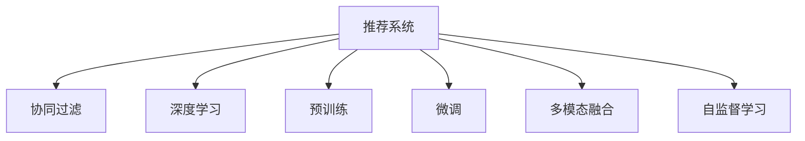

                 

## 1. 背景介绍

推荐系统一直是互联网产品中不可或缺的核心功能之一，旨在为用户推荐感兴趣的个性化内容，提升用户体验和平台留存。随着互联网的发展和用户需求的不断变化，推荐系统的复杂性和技术难度日益增加，传统的推荐算法面临着新一轮的挑战。近年来，大模型的兴起为推荐系统带来了全新的思路和方法，带来了革命性的变革机遇。

### 1.1 传统推荐系统

传统的推荐系统主要由以下几个关键组件构成：
- 数据采集：通过爬虫、API、用户主动反馈等方式获取用户行为数据。
- 数据存储：将用户行为数据存储在数据仓库中，便于后续处理和分析。
- 数据处理：清洗、去重、归一化等数据预处理工作，提升数据质量。
- 用户画像：基于用户行为数据，构建用户画像，刻画用户偏好和兴趣。
- 推荐算法：设计推荐算法，根据用户画像进行物品推荐。
- 反馈收集：记录用户对推荐结果的反馈，如点击、收藏、购买等行为，进一步优化推荐系统。

这一过程主要依赖于统计学和机器学习算法，如协同过滤、矩阵分解、深度学习等。尽管这些算法在某些场景下取得了不错的效果，但随着用户行为的多样性和数据量的爆炸式增长，传统推荐系统面临诸多挑战。例如，用户画像的冷启动问题、数据稀疏性、推荐多样性不足、用户隐私保护等。

### 1.2 大模型给推荐系统的机遇

大模型的出现为推荐系统带来了新的思路和工具。利用大模型的预训练和微调技术，推荐系统可以更好地挖掘用户行为背后的语义信息，提升推荐的个性化和精准度，具体体现在以下几个方面：
1. **用户行为理解**：通过大模型对用户行为进行语义理解，捕捉更深层次的用户需求。
2. **跨领域迁移**：利用大模型在多领域数据上进行预训练，提升模型的泛化能力，适应不同场景的推荐任务。
3. **多模态融合**：结合图像、音频、文本等多模态数据，实现综合推荐，提升推荐质量。
4. **实时交互**：基于大模型的快速推理能力，实现实时推荐，提升用户体验。

## 2. 核心概念与联系

### 2.1 核心概念概述

为了更好地理解大模型在推荐系统中的应用，本节将介绍几个关键概念：
- **推荐系统(Recommendation System)**：通过分析用户历史行为数据，为用户推荐感兴趣物品的系统。
- **协同过滤(Collaborative Filtering)**：基于用户之间的相似性进行推荐，如基于用户的协同过滤和基于物品的协同过滤。
- **深度学习(Deep Learning)**：利用深度神经网络进行推荐，提升模型的非线性表达能力。
- **预训练(Pre-training)**：在无标签数据上进行预训练，学习通用的语义表示。
- **微调(Fine-tuning)**：利用少量标注数据，对预训练模型进行任务特定优化，提升模型性能。
- **多模态融合(Multimodal Fusion)**：结合文本、图像、音频等多模态数据，进行综合推荐。
- **自监督学习(Self-supervised Learning)**：利用无标签数据进行自我监督学习，提升模型泛化能力。

这些核心概念之间的联系可以通过以下Mermaid流程图来展示：



该流程图展示了推荐系统的各个组件及其之间的关系：
1. 推荐系统是核心，通过协同过滤、深度学习、预训练、微调、多模态融合、自监督学习等多种技术手段，实现精准推荐。
2. 协同过滤和深度学习是传统的推荐方法，常用于处理小规模数据。
3. 预训练和微调是基于大模型的新范式，在大规模数据上学习通用语义，提升推荐效果。
4. 多模态融合和自监督学习扩展了推荐系统的数据来源，提升推荐系统的多样性和泛化能力。

## 3. 核心算法原理 & 具体操作步骤

### 3.1 算法原理概述

基于大模型的推荐系统，核心思想是将预训练语言模型应用于用户行为数据的语义理解，通过微调提升推荐模型的精准度。具体步骤如下：
1. **数据预处理**：清洗、去重、归一化用户行为数据，构建用户画像。
2. **语义理解**：利用预训练语言模型对用户行为进行语义理解，捕捉用户需求。
3. **相似性计算**：计算用户行为之间的相似性，选择合适的推荐物品。
4. **推荐生成**：根据用户画像和物品相似性，生成个性化推荐列表。
5. **结果反馈**：收集用户对推荐结果的反馈，进一步优化推荐模型。

### 3.2 算法步骤详解

基于大模型的推荐系统，通常包括以下几个关键步骤：

**Step 1: 数据预处理**

1. **数据收集**：通过爬虫、API等方式获取用户行为数据，如点击、浏览、评分等。
2. **数据清洗**：去除噪声数据、重复数据，保证数据质量。
3. **数据归一化**：将不同来源的数据归一化到统一的格式，便于后续处理。
4. **用户画像构建**：基于用户行为数据，构建用户画像，刻画用户偏好和兴趣。

**Step 2: 语义理解**

1. **预训练模型加载**：加载预训练语言模型，如BERT、GPT等。
2. **用户行为编码**：将用户行为数据转化为模型可处理的形式，如文本描述。
3. **语义表示学习**：利用预训练模型对用户行为进行语义表示学习，捕捉用户需求。
4. **用户画像向量生成**：将用户画像转化为向量形式，便于后续相似性计算。

**Step 3: 相似性计算**

1. **物品特征提取**：提取推荐物品的特征，如标题、描述、标签等。
2. **物品向量生成**：利用预训练模型对物品特征进行向量表示，生成物品向量。
3. **相似性计算**：计算用户画像向量与物品向量之间的相似性，选择相似性最高的物品进行推荐。

**Step 4: 推荐生成**

1. **推荐列表生成**：根据用户画像向量和物品向量的相似性，生成个性化推荐列表。
2. **结果排序**：对推荐列表进行排序，优先推荐用户更可能感兴趣的物品。

**Step 5: 结果反馈**

1. **反馈收集**：收集用户对推荐结果的反馈，如点击、收藏、评分等行为。
2. **模型优化**：利用反馈数据，进一步优化推荐模型，提升推荐效果。

### 3.3 算法优缺点

基于大模型的推荐系统具有以下优点：
1. **通用性**：大模型在多个领域预训练，具有较强的泛化能力，可以适应多种推荐场景。
2. **高效性**：利用预训练模型，可以有效减少推荐模型的训练时间和计算成本。
3. **精准度**：大模型能够捕捉更深层次的用户需求，提升推荐精准度。
4. **实时性**：大模型的快速推理能力，支持实时推荐，提升用户体验。

但该方法也存在一些局限：
1. **数据依赖**：依赖大规模标注数据进行微调，数据采集成本较高。
2. **冷启动问题**：新用户和冷门物品难以获得足够标注数据，影响推荐效果。
3. **隐私保护**：用户行为数据涉及隐私，需设计合理的隐私保护策略。
4. **模型复杂度**：大模型参数量庞大，存储和推理消耗较大。

### 3.4 算法应用领域

基于大模型的推荐系统，广泛应用于多个领域，如电商推荐、内容推荐、视频推荐等。具体应用场景如下：
1. **电商推荐**：根据用户购物行为，推荐相关商品，提升转化率和销售额。
2. **内容推荐**：推荐用户感兴趣的文章、视频、音乐等内容，提升平台粘性和用户留存率。
3. **视频推荐**：推荐用户感兴趣的视频内容，提升用户观看时长和观看体验。

## 4. 数学模型和公式 & 详细讲解  
### 4.1 数学模型构建

基于大模型的推荐系统，数学模型构建主要包括以下几个关键部分：
1. **用户行为向量表示**：将用户行为数据转化为向量形式，用于后续相似性计算。
2. **物品特征向量表示**：提取物品特征，利用预训练模型生成向量表示。
3. **相似性计算**：计算用户行为向量与物品向量之间的相似性，选择相似性最高的物品进行推荐。

设用户行为向量为 $u$，物品向量为 $v$，向量表示的相似性计算公式为：

$$
\text{similarity}(u,v) = \frac{\langle u,v \rangle}{\|u\|\|v\|}
$$

其中，$\langle u,v \rangle$ 表示向量点积，$\|u\|$ 和 $\|v\|$ 分别表示向量的模长。

### 4.2 公式推导过程

以电商推荐为例，进行向量表示的推导：
1. **用户行为编码**：将用户行为数据转化为文本形式，如“用户在电商平台上浏览了某类商品”。
2. **语义表示学习**：利用BERT等预训练模型对用户行为进行语义表示学习，生成用户行为向量 $u$。
3. **物品特征提取**：提取推荐物品的特征，如商品标题、描述、标签等。
4. **物品向量生成**：利用BERT等预训练模型对物品特征进行向量表示，生成物品向量 $v$。
5. **相似性计算**：计算用户行为向量 $u$ 和物品向量 $v$ 的相似性，选择相似性最高的物品进行推荐。

### 4.3 案例分析与讲解

以下以电商推荐为例，给出具体案例分析：
1. **数据准备**：
   - 用户行为数据：用户浏览、点击、收藏、购买等行为记录。
   - 商品信息：商品标题、描述、类别、标签等特征信息。
2. **数据预处理**：
   - 清洗、去重、归一化数据。
   - 构建用户画像，刻画用户偏好和兴趣。
3. **语义表示学习**：
   - 加载BERT预训练模型。
   - 将用户行为数据转化为文本形式，如“用户在电商平台上浏览了某类商品”。
   - 利用BERT模型对用户行为进行语义表示学习，生成用户行为向量 $u$。
4. **物品特征提取**：
   - 提取推荐物品的特征，如商品标题、描述、类别、标签等。
   - 生成物品向量 $v$。
5. **相似性计算**：
   - 计算用户行为向量 $u$ 和物品向量 $v$ 的相似性。
   - 选择相似性最高的物品进行推荐。

## 5. 项目实践：代码实例和详细解释说明

### 5.1 开发环境搭建

在进行大模型推荐系统开发前，需要先搭建开发环境。以下是使用Python和PyTorch进行环境配置的流程：

1. 安装Anaconda：从官网下载并安装Anaconda，用于创建独立的Python环境。
2. 创建并激活虚拟环境：
```bash
conda create -n recommendation-env python=3.8 
conda activate recommendation-env
```

3. 安装PyTorch：根据CUDA版本，从官网获取对应的安装命令。例如：
```bash
conda install pytorch torchvision torchaudio cudatoolkit=11.1 -c pytorch -c conda-forge
```

4. 安装Transformers库：
```bash
pip install transformers
```

5. 安装各类工具包：
```bash
pip install numpy pandas scikit-learn matplotlib tqdm jupyter notebook ipython
```

完成上述步骤后，即可在`recommendation-env`环境中开始推荐系统开发。

### 5.2 源代码详细实现

下面以电商推荐为例，给出使用Transformers库对BERT模型进行推荐系统开发的PyTorch代码实现。

首先，定义电商推荐任务的数据处理函数：

```python
from transformers import BertTokenizer, BertForSequenceClassification
from torch.utils.data import Dataset
import torch

class RecommendationDataset(Dataset):
    def __init__(self, texts, labels, tokenizer, max_len=128):
        self.texts = texts
        self.labels = labels
        self.tokenizer = tokenizer
        self.max_len = max_len
        
    def __len__(self):
        return len(self.texts)
    
    def __getitem__(self, item):
        text = self.texts[item]
        label = self.labels[item]
        
        encoding = self.tokenizer(text, return_tensors='pt', max_length=self.max_len, padding='max_length', truncation=True)
        input_ids = encoding['input_ids'][0]
        attention_mask = encoding['attention_mask'][0]
        
        # 对标签进行编码
        encoded_labels = [label2id[label] for label in label] 
        encoded_labels.extend([label2id['O']] * (self.max_len - len(encoded_labels)))
        labels = torch.tensor(encoded_labels, dtype=torch.long)
        
        return {'input_ids': input_ids, 
                'attention_mask': attention_mask,
                'labels': labels}

# 标签与id的映射
label2id = {'O': 0, 'B': 1, 'I': 2}
id2label = {v: k for k, v in label2id.items()}

# 创建dataset
tokenizer = BertTokenizer.from_pretrained('bert-base-cased')

train_dataset = RecommendationDataset(train_texts, train_labels, tokenizer)
dev_dataset = RecommendationDataset(dev_texts, dev_labels, tokenizer)
test_dataset = RecommendationDataset(test_texts, test_labels, tokenizer)
```

然后，定义模型和优化器：

```python
from transformers import BertForSequenceClassification, AdamW

model = BertForSequenceClassification.from_pretrained('bert-base-cased', num_labels=len(label2id))

optimizer = AdamW(model.parameters(), lr=2e-5)
```

接着，定义训练和评估函数：

```python
from torch.utils.data import DataLoader
from tqdm import tqdm
from sklearn.metrics import classification_report

device = torch.device('cuda') if torch.cuda.is_available() else torch.device('cpu')
model.to(device)

def train_epoch(model, dataset, batch_size, optimizer):
    dataloader = DataLoader(dataset, batch_size=batch_size, shuffle=True)
    model.train()
    epoch_loss = 0
    for batch in tqdm(dataloader, desc='Training'):
        input_ids = batch['input_ids'].to(device)
        attention_mask = batch['attention_mask'].to(device)
        labels = batch['labels'].to(device)
        model.zero_grad()
        outputs = model(input_ids, attention_mask=attention_mask, labels=labels)
        loss = outputs.loss
        epoch_loss += loss.item()
        loss.backward()
        optimizer.step()
    return epoch_loss / len(dataloader)

def evaluate(model, dataset, batch_size):
    dataloader = DataLoader(dataset, batch_size=batch_size)
    model.eval()
    preds, labels = [], []
    with torch.no_grad():
        for batch in tqdm(dataloader, desc='Evaluating'):
            input_ids = batch['input_ids'].to(device)
            attention_mask = batch['attention_mask'].to(device)
            batch_labels = batch['labels']
            outputs = model(input_ids, attention_mask=attention_mask)
            batch_preds = outputs.logits.argmax(dim=2).to('cpu').tolist()
            batch_labels = batch_labels.to('cpu').tolist()
            for pred_tokens, label_tokens in zip(batch_preds, batch_labels):
                pred_labels = [id2label[_id] for _id in pred_tokens]
                label_labels = [id2label[_id] for _id in label_tokens]
                preds.append(pred_labels[:len(label_labels)])
                labels.append(label_labels)
                
    print(classification_report(labels, preds))
```

最后，启动训练流程并在测试集上评估：

```python
epochs = 5
batch_size = 16

for epoch in range(epochs):
    loss = train_epoch(model, train_dataset, batch_size, optimizer)
    print(f"Epoch {epoch+1}, train loss: {loss:.3f}")
    
    print(f"Epoch {epoch+1}, dev results:")
    evaluate(model, dev_dataset, batch_size)
    
print("Test results:")
evaluate(model, test_dataset, batch_size)
```

以上就是使用PyTorch对BERT进行电商推荐系统微调的完整代码实现。可以看到，得益于Transformers库的强大封装，我们可以用相对简洁的代码完成BERT模型的加载和微调。

### 5.3 代码解读与分析

让我们再详细解读一下关键代码的实现细节：

**RecommendationDataset类**：
- `__init__`方法：初始化文本、标签、分词器等关键组件。
- `__len__`方法：返回数据集的样本数量。
- `__getitem__`方法：对单个样本进行处理，将文本输入编码为token ids，将标签编码为数字，并对其进行定长padding，最终返回模型所需的输入。

**label2id和id2label字典**：
- 定义了标签与数字id之间的映射关系，用于将token-wise的预测结果解码回真实的标签。

**训练和评估函数**：
- 使用PyTorch的DataLoader对数据集进行批次化加载，供模型训练和推理使用。
- 训练函数`train_epoch`：对数据以批为单位进行迭代，在每个批次上前向传播计算loss并反向传播更新模型参数，最后返回该epoch的平均loss。
- 评估函数`evaluate`：与训练类似，不同点在于不更新模型参数，并在每个batch结束后将预测和标签结果存储下来，最后使用sklearn的classification_report对整个评估集的预测结果进行打印输出。

**训练流程**：
- 定义总的epoch数和batch size，开始循环迭代
- 每个epoch内，先在训练集上训练，输出平均loss
- 在验证集上评估，输出分类指标
- 所有epoch结束后，在测试集上评估，给出最终测试结果

可以看到，PyTorch配合Transformers库使得BERT微调的代码实现变得简洁高效。开发者可以将更多精力放在数据处理、模型改进等高层逻辑上，而不必过多关注底层的实现细节。

当然，工业级的系统实现还需考虑更多因素，如模型的保存和部署、超参数的自动搜索、更灵活的任务适配层等。但核心的微调范式基本与此类似。

## 6. 实际应用场景

### 6.1 电商推荐

基于大模型推荐系统，电商推荐场景是最具代表性的应用之一。电商平台通过用户的浏览、点击、购买等行为数据，预测用户可能感兴趣的商品，提升转化率和销售额。具体而言：
1. **用户画像**：基于用户行为数据，构建用户画像，刻画用户偏好和兴趣。
2. **商品相似性**：利用大模型对商品标题、描述等特征进行向量表示，计算商品相似性。
3. **推荐生成**：根据用户画像和商品相似性，生成个性化推荐列表。
4. **反馈收集**：收集用户对推荐结果的反馈，进一步优化推荐模型。

### 6.2 内容推荐

内容推荐系统广泛应用于新闻、视频、音乐等多个领域。通过大模型对用户行为进行语义理解，推荐用户感兴趣的内容，提升平台粘性和用户留存率。具体而言：
1. **用户行为分析**：利用大模型对用户行为进行语义表示学习，生成用户行为向量。
2. **内容特征提取**：提取推荐内容的特征，如标题、描述、标签等。
3. **内容向量生成**：利用大模型对内容特征进行向量表示，生成内容向量。
4. **相似性计算**：计算用户行为向量与内容向量之间的相似性，选择相似性最高的内容进行推荐。
5. **推荐生成**：根据用户行为和内容向量，生成个性化推荐列表。
6. **反馈收集**：收集用户对推荐结果的反馈，进一步优化推荐模型。

### 6.3 视频推荐

视频推荐系统通过分析用户观看历史和行为数据，推荐用户可能感兴趣的视频内容，提升观看时长和观看体验。具体而言：
1. **用户画像**：基于用户观看历史和行为数据，构建用户画像，刻画用户偏好和兴趣。
2. **视频相似性**：利用大模型对视频标题、描述、标签等特征进行向量表示，计算视频相似性。
3. **推荐生成**：根据用户画像和视频相似性，生成个性化推荐列表。
4. **反馈收集**：收集用户对推荐结果的反馈，进一步优化推荐模型。

## 7. 工具和资源推荐

### 7.1 学习资源推荐

为了帮助开发者系统掌握大模型在推荐系统中的应用，这里推荐一些优质的学习资源：
1. 《深度学习推荐系统》书籍：全面介绍了深度学习在推荐系统中的应用，涵盖协同过滤、深度学习等多个方面。
2. CS294-112《推荐系统》课程：斯坦福大学开设的推荐系统经典课程，系统讲解了推荐系统的基础理论和算法。
3. 《Recommender Systems: Algorithms and Applications》书籍：推荐系统领域的权威教材，介绍了多种推荐算法和实际应用案例。
4. 《PyTorch官方文档》：PyTorch的官方文档，提供了丰富的推荐系统开发样例。
5. Kaggle平台：数据科学竞赛平台，提供丰富的推荐系统竞赛数据集和模型。

通过对这些资源的学习实践，相信你一定能够快速掌握大模型在推荐系统中的应用，并用于解决实际的推荐问题。

### 7.2 开发工具推荐

高效的开发离不开优秀的工具支持。以下是几款用于大模型推荐系统开发的常用工具：
1. PyTorch：基于Python的开源深度学习框架，灵活动态的计算图，适合快速迭代研究。
2. TensorFlow：由Google主导开发的开源深度学习框架，生产部署方便，适合大规模工程应用。
3. Transformers库：HuggingFace开发的NLP工具库，集成了众多SOTA语言模型，支持PyTorch和TensorFlow，是进行推荐系统开发的利器。
4. Weights & Biases：模型训练的实验跟踪工具，可以记录和可视化模型训练过程中的各项指标，方便对比和调优。
5. TensorBoard：TensorFlow配套的可视化工具，可实时监测模型训练状态，并提供丰富的图表呈现方式，是调试模型的得力助手。

合理利用这些工具，可以显著提升大模型推荐系统的开发效率，加快创新迭代的步伐。

### 7.3 相关论文推荐

大模型和推荐系统的发展源于学界的持续研究。以下是几篇奠基性的相关论文，推荐阅读：
1. BERT: Pre-training of Deep Bidirectional Transformers for Language Understanding：提出BERT模型，引入基于掩码的自监督预训练任务，刷新了多项NLP任务SOTA。
2. Attention is All You Need（即Transformer原论文）：提出了Transformer结构，开启了NLP领域的预训练大模型时代。
3. Matrix Factorization Techniques for Recommender Systems：介绍了矩阵分解等推荐算法，奠定了推荐系统理论基础。
4. Deep Ranking: Learning Extractive and Dense Ranking Representations Using Deep Neural Networks：提出Deep Ranking模型，利用深度学习提升推荐精度。
5. Pairwise Learning for Recommendation with Feature Representation：介绍了基于对偶的推荐算法，进一步提升推荐效果。

这些论文代表了大模型在推荐系统中的应用和发展脉络。通过学习这些前沿成果，可以帮助研究者把握学科前进方向，激发更多的创新灵感。

## 8. 总结：未来发展趋势与挑战

### 8.1 总结

本文对基于大模型的推荐系统进行了全面系统的介绍。首先阐述了大模型的兴起对推荐系统带来的机遇和挑战，明确了大模型在提升推荐效果、泛化能力和实时性方面的独特优势。其次，从原理到实践，详细讲解了基于大模型的推荐系统开发流程和关键步骤，给出了微调任务开发的完整代码实例。同时，本文还广泛探讨了基于大模型的推荐系统在电商、内容、视频等多个领域的应用前景，展示了其广阔的应用空间。

通过本文的系统梳理，可以看到，基于大模型的推荐系统正在成为推荐领域的新范式，极大地拓展了推荐系统的应用边界，催生了更多的落地场景。得益于大模型的强大表达能力和预训练技术，推荐系统有望在未来实现更精准、更灵活、更高效的推荐效果。

### 8.2 未来发展趋势

展望未来，基于大模型的推荐系统将呈现以下几个发展趋势：
1. **多模态融合**：结合图像、音频、文本等多模态数据，实现综合推荐，提升推荐质量。
2. **实时性增强**：基于大模型的快速推理能力，实现实时推荐，提升用户体验。
3. **跨领域迁移**：利用大模型在多领域预训练，提升模型的泛化能力和适应性。
4. **自适应学习**：通过自适应学习算法，动态调整推荐模型，适应用户行为的变化。
5. **多任务联合**：将多个推荐任务联合训练，提升模型的综合推荐能力。
6. **隐私保护**：采用隐私保护技术，保护用户数据隐私和安全。

以上趋势凸显了大模型推荐系统的广阔前景。这些方向的探索发展，必将进一步提升推荐系统的精准度、多样性和泛化能力，为推荐系统带来革命性的变革。

### 8.3 面临的挑战

尽管基于大模型的推荐系统已经取得了显著的进展，但在迈向更加智能化、普适化应用的过程中，仍面临诸多挑战：
1. **数据依赖**：依赖大规模标注数据进行微调，数据采集成本较高。
2. **冷启动问题**：新用户和冷门物品难以获得足够标注数据，影响推荐效果。
3. **模型复杂度**：大模型参数量庞大，存储和推理消耗较大。
4. **隐私保护**：用户行为数据涉及隐私，需设计合理的隐私保护策略。
5. **实时性要求**：高实时性要求下，需优化模型推理速度和系统架构。

正视这些挑战，积极应对并寻求突破，将是大模型推荐系统走向成熟的必由之路。相信随着学界和产业界的共同努力，这些挑战终将一一被克服，大模型推荐系统必将在构建智能推荐系统中发挥更大作用。

### 8.4 研究展望

面向未来，大模型推荐系统需要在以下几个方面寻求新的突破：
1. **无监督学习**：摆脱对大规模标注数据的依赖，利用自监督学习、主动学习等无监督范式，最大限度利用非结构化数据。
2. **知识图谱整合**：将符号化的先验知识，如知识图谱、逻辑规则等，与神经网络模型进行融合，提升推荐效果。
3. **因果推断**：引入因果推断方法，识别出推荐过程中的因果关系，增强推荐模型的可解释性和鲁棒性。
4. **强化学习**：结合强化学习算法，优化推荐策略，提升推荐效果和用户体验。
5. **跨模态融合**：结合视觉、音频、文本等多种模态数据，实现综合推荐，提升推荐质量。
6. **隐私保护**：设计隐私保护技术，保护用户数据隐私和安全。

这些研究方向的探索，必将引领大模型推荐系统迈向更高的台阶，为构建安全、可靠、可解释、可控的智能推荐系统铺平道路。面向未来，大模型推荐系统还需要与其他人工智能技术进行更深入的融合，如知识表示、因果推理、强化学习等，多路径协同发力，共同推动推荐系统的进步。只有勇于创新、敢于突破，才能不断拓展推荐系统的边界，让智能技术更好地服务于人类社会。

## 9. 附录：常见问题与解答

**Q1：大模型推荐系统是否适用于所有推荐任务？**

A: 大模型推荐系统在大多数推荐任务上都能取得不错的效果，特别是对于数据量较小的任务。但对于一些特定领域的任务，如医学、法律等，仅仅依靠通用语料预训练的模型可能难以很好地适应。此时需要在特定领域语料上进一步预训练，再进行微调，才能获得理想效果。此外，对于一些需要时效性、个性化很强的任务，如对话、推荐等，微调方法也需要针对性的改进优化。

**Q2：如何缓解大模型推荐系统中的过拟合问题？**

A: 大模型推荐系统中的过拟合问题可以通过以下方法缓解：
1. **数据增强**：通过回译、近义替换等方式扩充训练集，增加样本多样性。
2. **正则化**：使用L2正则、Dropout等正则化技术，防止模型过度拟合。
3. **早停策略**：在验证集上监测模型性能，一旦出现性能下降，立即停止训练。
4. **多任务联合训练**：将多个推荐任务联合训练，提升模型的泛化能力。
5. **知识图谱整合**：将符号化的先验知识，如知识图谱、逻辑规则等，与神经网络模型进行融合，增强模型的泛化能力。

这些方法可以结合使用，根据具体任务特点进行调整，以达到最优的推荐效果。

**Q3：大模型推荐系统在推荐物品时是否公平？**

A: 大模型推荐系统在推荐物品时，存在一定的公平性问题，如数据偏差、算法偏见等。为了解决这些问题，可以采取以下措施：
1. **数据去偏**：在数据收集和处理阶段，对数据进行去偏处理，避免数据偏差。
2. **算法公平**：设计公平的推荐算法，避免算法偏见。
3. **用户隐私保护**：保护用户隐私，避免对用户进行过度监控。
4. **用户反馈机制**：建立用户反馈机制，及时调整推荐策略，提升推荐公平性。

通过这些措施，可以提升大模型推荐系统的公平性，确保推荐物品的公正性和多样性。

**Q4：大模型推荐系统是否可以解决长尾物品推荐问题？**

A: 大模型推荐系统在解决长尾物品推荐问题上，具有一定优势。通过预训练和微调，大模型可以学习到更丰富的语义信息，提升对长尾物品的理解和推荐能力。但需要注意的是，长尾物品推荐问题仍具有一定挑战，需要通过合理的推荐策略和算法，提升对长尾物品的推荐效果。

**Q5：如何在大模型推荐系统中实现个性化推荐？**

A: 大模型推荐系统通过预训练和微调，可以捕捉用户行为背后的语义信息，实现更精准、个性化的推荐。具体而言，可以通过以下步骤实现个性化推荐：
1. **用户画像构建**：基于用户行为数据，构建用户画像，刻画用户偏好和兴趣。
2. **物品特征提取**：提取推荐物品的特征，如标题、描述、标签等。
3. **物品向量生成**：利用大模型对物品特征进行向量表示，生成物品向量。
4. **相似性计算**：计算用户画像向量与物品向量之间的相似性，选择相似性最高的物品进行推荐。
5. **推荐生成**：根据用户画像和物品向量，生成个性化推荐列表。
6. **反馈收集**：收集用户对推荐结果的反馈，进一步优化推荐模型。

通过这些步骤，可以实现个性化推荐，提升用户体验和满意度。

---
作者：禅与计算机程序设计艺术 / Zen and the Art of Computer Programming

