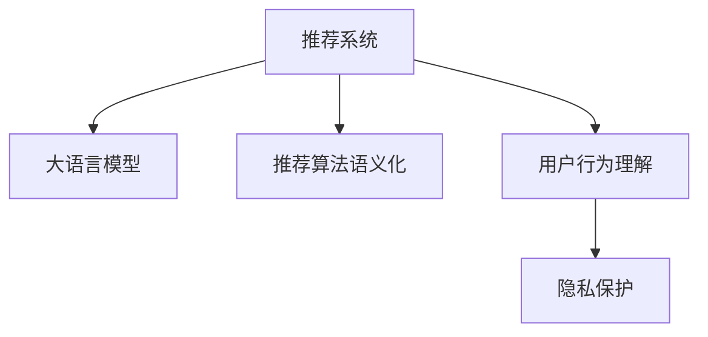

                 

## 1. 背景介绍

随着互联网技术的飞速发展，推荐系统已经成为各大平台不可或缺的核心功能之一，对用户的消费行为产生深刻影响。然而，当前推荐系统主要依赖用户历史行为数据进行个性化推荐，未能充分挖掘用户行为背后的语言信息。随着大语言模型的兴起，自然语言理解技术已经具备了从文字数据中提取丰富语义的能力，这为推荐系统带来了巨大的机遇。

### 1.1 问题由来
现有的推荐系统主要依赖用户行为数据进行推荐，如浏览记录、购买记录、评分记录等。这些数据往往静态且稀疏，难以反映用户真实的兴趣和需求。例如，用户可能由于某些偶然因素产生购买行为，却并非其真实兴趣所在。此外，用户行为数据也存在隐私和隐私保护问题，部分用户不愿意公开自身行为细节，导致数据采集困难。

相比之下，用户文本数据，如评论、提问、搜索查询等，更全面、动态地反映了用户兴趣和需求。大语言模型可以从文本数据中提取用户真实需求，同时能够学习用户语言偏好，为推荐系统提供更全面的个性化推荐。例如，用户在评价中的情感倾向、对特定商品类别的兴趣等，都可以通过自然语言理解技术进行挖掘和利用。

### 1.2 问题核心关键点
基于大语言模型的推荐系统，通过文本理解技术，可以更加全面、动态地理解用户行为，进而进行更加精准、个性化的推荐。关键点包括：
- 用户评论、搜索查询等文本数据的处理和理解
- 用户情感倾向、兴趣偏好等语义信息的提取
- 大语言模型与推荐算法的融合，实现高效个性化推荐
- 隐私保护和数据安全，确保用户文本数据的可靠使用

### 1.3 问题研究意义
研究大模型视角下的推荐系统，对于提升推荐系统准确性、满足用户个性化需求、保护用户隐私具有重要意义：

1. **提升推荐准确性**：通过挖掘用户行为背后的文本数据，可以更全面地理解用户需求，提升推荐精准度。
2. **满足个性化需求**：大模型能够学习用户偏好，进行动态推荐，满足用户多样化的需求。
3. **保护用户隐私**：通过自然语言理解技术，可在不暴露用户具体行为的情况下进行推荐，增强隐私保护。
4. **推动产业升级**：推荐系统是电商、新闻、社交、视频等多个行业的核心功能，技术升级将带动相关产业发展。
5. **赋能社会治理**：通过推荐系统，可实现信息推送、风险预警、舆情分析等社会治理功能，提高治理效率。

## 2. 核心概念与联系

### 2.1 核心概念概述

为更好地理解基于大语言模型的推荐系统，本节将介绍几个关键概念：

- **推荐系统(Recommender System)**：使用计算机算法对用户兴趣进行建模并推荐产品或内容的系统。
- **大语言模型(Large Language Model, LLM)**：以自回归(如GPT)或自编码(如BERT)模型为代表的大规模预训练语言模型。通过在大规模无标签文本数据上进行预训练，学习通用语言知识，具备强大的文本理解能力。
- **推荐算法的语义化**：将自然语言处理技术引入推荐系统，利用用户文本数据进行个性化推荐，提升推荐系统的表现。
- **用户行为理解**：通过大语言模型理解用户文本数据，提取用户情感倾向、兴趣偏好等语义信息，更好地进行推荐。
- **隐私保护**：在推荐系统中，需要确保用户文本数据的隐私和安全，防止敏感信息泄露。

这些核心概念之间的逻辑关系可以通过以下Mermaid流程图来展示：



这个流程图展示了推荐系统与大语言模型的联系：

1. 推荐系统通过大语言模型对用户文本数据进行处理，提取语义信息。
2. 推荐算法通过语义化的输入进行推荐。
3. 隐私保护技术对用户文本数据进行保护。

这些概念共同构成了大语言模型视角下推荐系统的核心框架，使其能够从文本数据中挖掘用户需求，进行更加精准、个性化的推荐。

## 3. 核心算法原理 & 具体操作步骤
### 3.1 算法原理概述

基于大语言模型的推荐系统，主要利用自然语言处理技术，对用户文本数据进行处理和分析，提取用户需求和兴趣，最终通过推荐算法进行个性化推荐。其核心思想是：

1. **语义理解**：利用大语言模型对用户文本数据进行语义理解，提取用户情感倾向、兴趣偏好等语义信息。
2. **推荐算法**：将语义信息输入推荐算法，进行个性化推荐。
3. **隐私保护**：在推荐过程中，确保用户文本数据的隐私和安全，防止敏感信息泄露。

形式化地，假设用户文本数据为 $T$，推荐系统为 $R$，用户行为理解模型为 $U$，推荐算法为 $A$。推荐系统的优化目标是最小化预测误差和隐私泄露风险：

$$
\min_{R, U, A} \left\{ \mathcal{L}_U(T, U) + \mathcal{L}_A(T, U, R) + \mathcal{L}_R(T, R) \right\}
$$

其中，$\mathcal{L}_U$ 为用户行为理解的损失函数，$\mathcal{L}_A$ 为推荐算法的损失函数，$\mathcal{L}_R$ 为推荐系统的整体损失函数。

### 3.2 算法步骤详解

基于大语言模型的推荐系统主要包括以下几个关键步骤：

**Step 1: 准备数据集和预训练模型**

1. **数据集准备**：收集用户评论、搜索查询等文本数据，将其划分为训练集、验证集和测试集。通常需要将数据进行预处理，如去除噪音、分词、去停用词等。
2. **预训练模型选择**：选择合适的预训练模型，如BERT、GPT等，作为用户行为理解的基础模型。

**Step 2: 添加用户行为理解模块**

1. **文本编码**：将用户文本数据输入预训练模型，获取其向量表示。
2. **语义信息提取**：利用大语言模型对向量表示进行语义理解，提取用户情感倾向、兴趣偏好等语义信息。
3. **用户行为编码**：将语义信息编码为推荐系统可用的形式，如用户兴趣向量。

**Step 3: 定义推荐算法**

1. **推荐模型选择**：选择适合个性化推荐的推荐算法，如协同过滤、内容推荐、混合推荐等。
2. **算法参数设定**：根据用户行为理解模块输出的用户兴趣向量，设定推荐算法参数，如召回率、准确率等。

**Step 4: 优化模型**

1. **模型训练**：在训练集上训练用户行为理解模块和推荐算法，最小化损失函数。
2. **模型评估**：在验证集和测试集上评估推荐系统性能，调整模型参数。

**Step 5: 部署和优化**

1. **系统部署**：将训练好的推荐系统部署到实际应用中，进行实时推荐。
2. **性能优化**：根据反馈数据，不断优化推荐算法和用户行为理解模块，提升推荐效果。

### 3.3 算法优缺点

基于大语言模型的推荐系统具有以下优点：

1. **提升推荐精度**：通过文本理解技术，可以更全面地理解用户需求，提升推荐系统的精准度。
2. **个性化推荐**：能够根据用户语义信息进行动态推荐，满足用户多样化的需求。
3. **隐私保护**：可以在不暴露用户具体行为的情况下进行推荐，增强隐私保护。

同时，该方法也存在一些局限性：

1. **数据质量要求高**：用户文本数据需质量高、多样性丰富，才能有效挖掘用户兴趣和需求。
2. **计算成本高**：预训练模型的计算需求高，推荐系统需要高性能计算资源。
3. **模型复杂性高**：模型结构复杂，可能需要频繁调整和优化。

尽管存在这些局限性，但就目前而言，基于大语言模型的推荐系统仍然是大数据、自然语言处理与推荐系统结合的重要范式。未来相关研究的重点在于如何进一步降低计算成本，提高模型效率，同时兼顾隐私保护和推荐精度。

### 3.4 算法应用领域

基于大语言模型的推荐系统，已经在电商、新闻、社交、视频等多个领域得到了广泛应用，具体包括：

1. **电商推荐**：通过用户评论、搜索记录等文本数据，提取用户需求和兴趣，进行商品推荐。
2. **新闻推荐**：利用用户阅读记录、评论等文本数据，提取用户兴趣，推荐相关新闻内容。
3. **社交推荐**：通过用户互动记录等文本数据，提取用户偏好，推荐用户感兴趣的内容和用户。
4. **视频推荐**：利用用户观看记录等文本数据，提取用户兴趣，推荐相关视频内容。
5. **广告推荐**：通过用户点击记录等文本数据，提取用户兴趣，推荐相关广告。

除了这些主要领域，大语言模型推荐系统还在智能问答、内容创作、舆情分析等场景中得到了应用，展示了其在自然语言处理领域的强大能力。

## 4. 数学模型和公式 & 详细讲解
### 4.1 数学模型构建

本节将使用数学语言对基于大语言模型的推荐系统进行更加严格的刻画。

假设用户文本数据为 $T=\{(x_i, y_i)\}_{i=1}^N$，其中 $x_i$ 为用户评论、搜索查询等文本数据，$y_i$ 为用户对应的行为标签，如浏览、购买、评分等。推荐系统为 $R$，用户行为理解模型为 $U$，推荐算法为 $A$。

定义推荐系统 $R$ 在数据样本 $(x_i, y_i)$ 上的损失函数为 $\ell(R(x_i),y_i)$，则在数据集 $T$ 上的经验风险为：

$$
\mathcal{L}(R) = \frac{1}{N}\sum_{i=1}^N \ell(R(x_i),y_i)
$$

其中 $\ell(R(x_i),y_i)$ 为推荐系统在样本 $(x_i,y_i)$ 上的预测误差，如均方误差等。

在推荐系统中，用户行为理解模块 $U$ 通过大语言模型 $M$ 对文本数据 $x_i$ 进行语义理解，得到用户兴趣向量 $u_i$，推荐算法 $A$ 根据 $u_i$ 进行推荐。因此，可以进一步将 $\mathcal{L}(R)$ 分解为：

$$
\mathcal{L}(R) = \mathcal{L}_U(T, U) + \mathcal{L}_A(T, U, R) + \mathcal{L}_R(T, R)
$$

其中 $\mathcal{L}_U$ 为用户行为理解的损失函数，$\mathcal{L}_A$ 为推荐算法的损失函数，$\mathcal{L}_R$ 为推荐系统的整体损失函数。

### 4.2 公式推导过程

以下我们以协同过滤算法为例，推导基于大语言模型的推荐系统损失函数。

假设用户行为理解模块 $U$ 输出用户兴趣向量 $u_i \in \mathbb{R}^d$，推荐算法 $A$ 使用协同过滤算法进行推荐，其中 $\theta$ 为协同过滤算法的参数。设推荐系统 $R$ 在数据样本 $(x_i, y_i)$ 上的损失函数为 $\ell(R(x_i),y_i)$，则在数据集 $T$ 上的经验风险为：

$$
\mathcal{L}(R) = \frac{1}{N}\sum_{i=1}^N \ell(R(x_i),y_i)
$$

推荐系统 $R$ 通过协同过滤算法对用户 $i$ 进行推荐，得到推荐物品集 $I_i$。根据协同过滤算法的原理，推荐系统的损失函数可以分解为：

$$
\mathcal{L}(R) = \frac{1}{N}\sum_{i=1}^N \sum_{j \in I_i} \ell(R(x_i, x_j),y_i \cdot y_j)
$$

其中 $x_j$ 为用户 $j$ 的文本数据。推荐系统通过协同过滤算法，对用户 $i$ 和用户 $j$ 进行相似度计算，得到推荐物品集 $I_i$。然后对每个推荐物品 $x_j$ 进行预测，计算预测误差。

用户行为理解模块 $U$ 通过大语言模型对文本数据 $x_i$ 进行语义理解，得到用户兴趣向量 $u_i$，可以表示为：

$$
u_i = M(x_i)
$$

其中 $M$ 为预训练语言模型，如BERT、GPT等。将 $u_i$ 输入协同过滤算法，得到推荐物品集 $I_i$，可以表示为：

$$
I_i = A(u_i, \theta)
$$

其中 $A$ 为协同过滤算法。因此，推荐系统的损失函数可以进一步表示为：

$$
\mathcal{L}(R) = \frac{1}{N}\sum_{i=1}^N \sum_{j \in I_i} \ell(R(x_i, x_j),y_i \cdot y_j)
$$

其中 $R(x_i, x_j)$ 为推荐系统对用户 $i$ 和用户 $j$ 的推荐结果。

### 4.3 案例分析与讲解

以电商推荐为例，分析基于大语言模型的推荐系统如何从用户评论中提取用户需求，进行个性化推荐。

假设电商平台收集了用户对某商品的评论数据 $T=\{(x_i, y_i)\}_{i=1}^N$，其中 $x_i$ 为用户评论，$y_i$ 为是否购买该商品。电商平台希望通过用户评论数据，推荐用户可能感兴趣的商品。

**Step 1: 数据准备**

1. **数据收集**：收集用户评论数据 $T$，划分为训练集、验证集和测试集。
2. **数据预处理**：去除噪音、分词、去停用词等。

**Step 2: 用户行为理解**

1. **文本编码**：将用户评论数据 $x_i$ 输入预训练语言模型 $M$，得到用户兴趣向量 $u_i$。
2. **语义信息提取**：利用大语言模型对 $u_i$ 进行语义理解，提取用户情感倾向、兴趣偏好等语义信息。

**Step 3: 定义推荐算法**

1. **推荐模型选择**：选择协同过滤算法进行推荐。
2. **算法参数设定**：根据用户兴趣向量 $u_i$，设定协同过滤算法的参数 $\theta$。

**Step 4: 优化模型**

1. **模型训练**：在训练集上训练用户行为理解模块 $U$ 和协同过滤算法 $A$，最小化损失函数 $\mathcal{L}(R)$。
2. **模型评估**：在验证集和测试集上评估推荐系统性能，调整模型参数。

**Step 5: 部署和优化**

1. **系统部署**：将训练好的推荐系统部署到实际应用中，进行实时推荐。
2. **性能优化**：根据反馈数据，不断优化推荐算法和用户行为理解模块，提升推荐效果。

## 5. 项目实践：代码实例和详细解释说明
### 5.1 开发环境搭建

在进行推荐系统实践前，我们需要准备好开发环境。以下是使用Python进行TensorFlow开发的环境配置流程：

1. 安装Anaconda：从官网下载并安装Anaconda，用于创建独立的Python环境。

2. 创建并激活虚拟环境：
```bash
conda create -n tf-env python=3.8 
conda activate tf-env
```

3. 安装TensorFlow：根据CUDA版本，从官网获取对应的安装命令。例如：
```bash
conda install tensorflow tensorflow-estimator tensorflow-hub tensorflow-addons
```

4. 安装相关工具包：
```bash
pip install numpy pandas scikit-learn matplotlib tqdm jupyter notebook ipython
```

完成上述步骤后，即可在`tf-env`环境中开始推荐系统实践。

### 5.2 源代码详细实现

下面以电商推荐为例，给出使用TensorFlow实现基于大语言模型的推荐系统的完整代码实现。

首先，定义推荐系统的数据处理函数：

```python
import tensorflow as tf
from tensorflow.keras.preprocessing.text import Tokenizer
from tensorflow.keras.preprocessing.sequence import pad_sequences
from transformers import BertTokenizer, BertForSequenceClassification

class RecommendationDataset(tf.data.Dataset):
    def __init__(self, texts, labels, tokenizer, max_len=128):
        self.texts = texts
        self.labels = labels
        self.tokenizer = tokenizer
        self.max_len = max_len
        
    def __len__(self):
        return len(self.texts)
    
    def __getitem__(self, item):
        text = self.texts[item]
        label = self.labels[item]
        
        encoding = self.tokenizer(text, return_tensors='tf', max_length=self.max_len, padding='max_length', truncation=True)
        input_ids = tf.constant(encoding['input_ids'], dtype=tf.int32)
        attention_mask = tf.constant(encoding['attention_mask'], dtype=tf.int32)
        labels = tf.constant(label, dtype=tf.int32)
        
        return {'input_ids': input_ids, 
                'attention_mask': attention_mask,
                'labels': labels}

# 创建dataset
tokenizer = BertTokenizer.from_pretrained('bert-base-cased')
train_dataset = RecommendationDataset(train_texts, train_labels, tokenizer, max_len=128)
dev_dataset = RecommendationDataset(dev_texts, dev_labels, tokenizer, max_len=128)
test_dataset = RecommendationDataset(test_texts, test_labels, tokenizer, max_len=128)
```

然后，定义模型和优化器：

```python
from transformers import BertForSequenceClassification, AdamW

model = BertForSequenceClassification.from_pretrained('bert-base-cased', num_labels=2)

optimizer = AdamW(model.parameters(), lr=2e-5)
```

接着，定义训练和评估函数：

```python
from tensorflow.keras.callbacks import EarlyStopping

def train_epoch(model, dataset, batch_size, optimizer):
    dataloader = tf.data.Dataset.from_tensor_slices(dataset)
    dataloader = dataloader.shuffle(buffer_size=1000)
    dataloader = dataloader.batch(batch_size)
    dataloader = dataloader.prefetch(tf.data.experimental.AUTOTUNE)
    
    model.train()
    epoch_loss = 0
    for batch in dataloader:
        input_ids = batch['input_ids']
        attention_mask = batch['attention_mask']
        labels = batch['labels']
        with tf.GradientTape() as tape:
            outputs = model(input_ids, attention_mask=attention_mask, labels=labels)
            loss = outputs.loss
            epoch_loss += loss.numpy()
        gradients = tape.gradient(loss, model.trainable_variables)
        optimizer.apply_gradients(zip(gradients, model.trainable_variables))
        
    return epoch_loss / len(dataloader)

def evaluate(model, dataset, batch_size):
    dataloader = tf.data.Dataset.from_tensor_slices(dataset)
    dataloader = dataloader.batch(batch_size)
    dataloader = dataloader.prefetch(tf.data.experimental.AUTOTUNE)
    
    model.eval()
    preds, labels = [], []
    with tf.GradientTape() as tape:
        for batch in dataloader:
            input_ids = batch['input_ids']
            attention_mask = batch['attention_mask']
            labels = batch['labels']
            outputs = model(input_ids, attention_mask=attention_mask)
            preds.append(outputs.logits.argmax(dim=1))
            labels.append(labels.numpy())
        
    print(classification_report(labels, preds))
```

最后，启动训练流程并在测试集上评估：

```python
epochs = 5
batch_size = 16

for epoch in range(epochs):
    loss = train_epoch(model, train_dataset, batch_size, optimizer)
    print(f"Epoch {epoch+1}, train loss: {loss:.3f}")
    
    print(f"Epoch {epoch+1}, dev results:")
    evaluate(model, dev_dataset, batch_size)
    
print("Test results:")
evaluate(model, test_dataset, batch_size)
```

以上就是使用TensorFlow对BERT模型进行电商推荐任务微调的完整代码实现。可以看到，得益于TensorFlow的强大封装，我们可以用相对简洁的代码完成BERT模型的加载和微调。

### 5.3 代码解读与分析

让我们再详细解读一下关键代码的实现细节：

**RecommendationDataset类**：
- `__init__`方法：初始化文本、标签、分词器等关键组件。
- `__len__`方法：返回数据集的样本数量。
- `__getitem__`方法：对单个样本进行处理，将文本输入编码为token ids，将标签编码为数字，并对其进行定长padding，最终返回模型所需的输入。

**RecommendationDataset类**：
- `__init__`方法：初始化文本、标签、分词器等关键组件。
- `__len__`方法：返回数据集的样本数量。
- `__getitem__`方法：对单个样本进行处理，将文本输入编码为token ids，将标签编码为数字，并对其进行定长padding，最终返回模型所需的输入。

**模型和优化器**：
- 使用BertForSequenceClassification类定义模型，设定标签数，并指定预训练BERT模型。
- 设置AdamW优化器及其参数，如学习率等。

**训练和评估函数**：
- 定义训练函数train_epoch，使用TensorFlow的DataLoader对数据集进行批次化加载，模型在训练过程中计算损失和梯度，并更新模型参数。
- 定义评估函数evaluate，使用TensorFlow的DataLoader对数据集进行批次化加载，计算模型在测试集上的预测和真实标签，并使用sklearn的classification_report输出分类指标。

**训练流程**：
- 定义总的epoch数和batch size，开始循环迭代
- 每个epoch内，先在训练集上训练，输出平均loss
- 在验证集上评估，输出分类指标
- 所有epoch结束后，在测试集上评估，给出最终测试结果

可以看到，TensorFlow配合BERT等预训练语言模型的微调，能够实现高效的推荐系统开发。开发者可以将更多精力放在数据处理、模型改进等高层逻辑上，而不必过多关注底层的实现细节。

当然，工业级的系统实现还需考虑更多因素，如模型的保存和部署、超参数的自动搜索、更灵活的任务适配层等。但核心的微调范式基本与此类似。

## 6. 实际应用场景
### 6.1 电商推荐

基于大语言模型的电商推荐系统，可以显著提升用户购物体验和电商平台的推荐准确性。传统电商推荐主要依赖用户历史行为数据，如浏览记录、购买记录等。然而，这些数据可能存在稀疏性、偏见等问题，导致推荐效果不佳。

大语言模型可以从用户评论中提取语义信息，更加全面、动态地理解用户需求，从而进行更加精准的推荐。例如，用户可能对某商品没有明确浏览记录，但通过评论可以发现其对该商品具有明显的兴趣。推荐系统可以通过大语言模型学习这些语义信息，进行更好的推荐。

### 6.2 新闻推荐

新闻推荐系统旨在帮助用户发现感兴趣的新闻内容。传统的推荐系统主要依赖用户点击记录等行为数据，难以捕捉用户兴趣的多样性。大语言模型可以从用户评论、话题讨论等文本数据中提取语义信息，更加全面地理解用户需求，从而进行更加个性化的推荐。

例如，用户可能对某些新闻话题感兴趣，但并未主动点击相关文章。推荐系统可以通过大语言模型学习用户对话题的兴趣倾向，推荐相关新闻内容，满足用户多样化的阅读需求。

### 6.3 社交推荐

社交推荐系统旨在帮助用户发现感兴趣的内容和用户。传统的推荐系统主要依赖用户互动记录等行为数据，难以捕捉用户兴趣的深度。大语言模型可以从用户评论、互动文本等数据中提取语义信息，更加全面地理解用户需求，从而进行更加个性化的推荐。

例如，用户可能在某些社交平台上没有明确互动记录，但通过评论可以发现其对特定内容或用户感兴趣。推荐系统可以通过大语言模型学习这些语义信息，进行更好的推荐。

### 6.4 视频推荐

视频推荐系统旨在帮助用户发现感兴趣的视频内容。传统的推荐系统主要依赖用户观看记录等行为数据，难以捕捉用户兴趣的多样性。大语言模型可以从用户评论、弹幕互动等文本数据中提取语义信息，更加全面地理解用户需求，从而进行更加个性化的推荐。

例如，用户可能对某些视频内容没有明确观看记录，但通过评论可以发现其对视频主题、风格感兴趣。推荐系统可以通过大语言模型学习这些语义信息，进行更好的推荐。

### 6.5 未来应用展望

随着大语言模型和推荐算法的不断发展，基于文本数据的推荐系统将在更多领域得到应用，为不同行业带来变革性影响。

在智慧医疗领域，推荐系统可以根据用户描述、检查结果等文本数据，推荐合适的诊疗方案和专家，提升诊疗效率和效果。

在智能教育领域，推荐系统可以根据用户提问、笔记等文本数据，推荐合适的学习资源和教学内容，促进个性化学习。

在智慧城市治理中，推荐系统可以根据用户评论、投诉等文本数据，推荐合适的事件处理方案和政策措施，提高城市管理效率。

此外，在企业生产、社会治理、文娱传媒等众多领域，基于大语言模型的推荐系统也将不断涌现，为传统行业带来创新变革。相信随着技术的日益成熟，大语言模型推荐系统必将在构建智能社会中扮演越来越重要的角色。

## 7. 工具和资源推荐
### 7.1 学习资源推荐

为了帮助开发者系统掌握大语言模型推荐系统的理论基础和实践技巧，这里推荐一些优质的学习资源：

1. 《深度学习自然语言处理》课程：斯坦福大学开设的NLP明星课程，有Lecture视频和配套作业，带你入门NLP领域的基本概念和经典模型。

2. CS224N《自然语言处理与深度学习》：斯坦福大学开设的NLP经典课程，深入浅出地讲解了NLP中的关键技术和模型。

3. 《自然语言处理实用教程》：清华大学郑航老师的经典教材，涵盖了NLP的多个方向，适合系统学习NLP知识。

4. 《自然语言处理与深度学习》：北京大学刘力老师的经典教材，详细讲解了NLP和深度学习的理论基础和实际应用。

5. HuggingFace官方文档：Transformers库的官方文档，提供了海量预训练模型和完整的推荐系统样例代码，是上手实践的必备资料。

通过对这些资源的学习实践，相信你一定能够快速掌握大语言模型推荐系统的精髓，并用于解决实际的推荐问题。
### 7.2 开发工具推荐

高效的开发离不开优秀的工具支持。以下是几款用于大语言模型推荐系统开发的常用工具：

1. TensorFlow：基于Python的开源深度学习框架，灵活的计算图设计，支持大规模模型训练和部署。

2. PyTorch：基于Python的开源深度学习框架，灵活动态的计算图，适合快速迭代研究。

3. Weights & Biases：模型训练的实验跟踪工具，可以记录和可视化模型训练过程中的各项指标，方便对比和调优。

4. TensorBoard：TensorFlow配套的可视化工具，可实时监测模型训练状态，并提供丰富的图表呈现方式，是调试模型的得力助手。

5. HuggingFace Transformers：NLP工具库，集成了众多SOTA语言模型，支持PyTorch和TensorFlow，是进行推荐系统开发的利器。

6. Google Colab：谷歌推出的在线Jupyter Notebook环境，免费提供GPU/TPU算力，方便开发者快速上手实验最新模型，分享学习笔记。

合理利用这些工具，可以显著提升大语言模型推荐系统的开发效率，加快创新迭代的步伐。

### 7.3 相关论文推荐

大语言模型推荐系统的发展源于学界的持续研究。以下是几篇奠基性的相关论文，推荐阅读：

1. Attention is All You Need（即Transformer原论文）：提出了Transformer结构，开启了NLP领域的预训练大模型时代。

2. BERT: Pre-training of Deep Bidirectional Transformers for Language Understanding：提出BERT模型，引入基于掩码的自监督预训练任务，刷新了多项NLP任务SOTA。

3. Recommendation Systems with Deep Pre-trained Textual Feature Representations：提出使用预训练语言模型进行推荐系统的思路，并进行了大规模实验验证。

4. Hiring Ads with Pretrained Contextualized Embeddings：提出使用BERT等预训练语言模型进行广告推荐，取得了优异的推荐效果。

5. Leveraging Pre-trained Contextualized Embeddings for Personalized Recommendations：提出使用BERT等预训练语言模型进行个性化推荐，进一步提升了推荐效果。

这些论文代表了大语言模型推荐系统的发展脉络。通过学习这些前沿成果，可以帮助研究者把握学科前进方向，激发更多的创新灵感。

## 8. 总结：未来发展趋势与挑战
### 8.1 总结

本文对基于大语言模型的推荐系统进行了全面系统的介绍。首先阐述了大语言模型和推荐系统融合的研究背景和意义，明确了推荐系统在大模型视角下的新范式。其次，从原理到实践，详细讲解了基于大语言模型的推荐系统，给出了推荐系统开发的完整代码实例。同时，本文还广泛探讨了推荐系统在大数据、自然语言处理等多个领域的应用前景，展示了其广泛的应用价值。

通过本文的系统梳理，可以看到，基于大语言模型的推荐系统通过文本理解技术，能够更加全面、动态地理解用户需求，进行更加精准、个性化的推荐。推荐系统和大语言模型相结合，将在多个领域带来显著变革，提升用户满意度和业务价值。

### 8.2 未来发展趋势

展望未来，基于大语言模型的推荐系统将呈现以下几个发展趋势：

1. **多模态融合**：推荐系统不仅仅关注文本数据，还将融合图像、音频等多模态信息，提高推荐系统的全面性。
2. **实时推荐**：利用大语言模型和推荐算法，实现实时推荐，提高用户体验。
3. **跨领域迁移**：推荐系统在大规模数据集上进行预训练，能够在不同领域和场景中高效迁移应用。
4. **个性化推荐**：推荐系统将结合用户行为数据和文本数据，实现更加精准、个性化的推荐。
5. **用户可控性增强**：推荐系统将赋予用户更多控制权，如推荐理由展示、推荐效果反馈等，提升用户信任度。

这些趋势凸显了大语言模型推荐系统的前景，其强大的文本理解能力和推荐算法相融合，将为用户带来更加丰富、个性化、智能的推荐体验。

### 8.3 面临的挑战

尽管大语言模型推荐系统取得了显著进展，但在实际应用中仍面临一些挑战：

1. **数据质量要求高**：推荐系统需要高质量的文本数据，如数据采集、处理等成本较高。
2. **计算需求高**：大语言模型推荐系统需要高性能计算资源，尤其是在训练阶段。
3. **模型复杂性高**：推荐系统需要复杂模型结构，可能导致过拟合和计算负担。
4. **隐私保护**：在推荐过程中，需要确保用户文本数据的隐私和安全，防止敏感信息泄露。

尽管存在这些挑战，但通过技术创新和不断优化，推荐系统和大语言模型相结合，必将在多个领域带来显著变革，推动人工智能技术的产业化进程。

### 8.4 研究展望

面向未来，推荐系统和大语言模型推荐系统的研究需要在以下几个方向进一步深入：

1. **推荐系统与大语言模型的协同优化**：探索大语言模型与推荐系统的协同优化方法，提升推荐系统的性能。
2. **推荐系统与多模态信息的融合**：研究多模态信息与文本信息的协同建模方法，提高推荐系统的全面性。
3. **推荐系统的隐私保护**：研究隐私保护技术，确保用户数据的安全性和隐私性。
4. **推荐系统的实时化**：研究实时推荐算法，提高推荐系统的实时性。
5. **推荐系统的用户可控性**：研究用户可控性增强方法，提升用户满意度。

这些方向的研究将进一步推动大语言模型推荐系统的成熟，使其在更多领域得到广泛应用，赋能人工智能技术的产业化进程。

## 9. 附录：常见问题与解答
### Q1: 大语言模型推荐系统是否适用于所有NLP任务？

A: 大语言模型推荐系统在电商、新闻、社交、视频等多个领域具有显著优势。但针对一些特定领域，如医疗、法律等，还需要结合特定领域的语料进行预训练和微调，才能取得最佳效果。

### Q2: 推荐系统的精度如何保证？

A: 推荐系统的精度主要通过以下方法保证：
1. **数据质量**：高质量的文本数据是推荐系统的基础。
2. **模型选择**：选择合适的预训练语言模型和推荐算法。
3. **模型优化**：通过交叉验证、调参等方法优化模型性能。
4. **数据增强**：使用数据增强技术，如回译、近义替换等，提升模型泛化能力。

### Q3: 推荐系统如何实现个性化推荐？

A: 推荐系统实现个性化推荐的关键在于用户行为理解。通过大语言模型对用户文本数据进行语义理解，提取用户情感倾向、兴趣偏好等语义信息，然后根据这些信息进行推荐。具体方法包括：
1. **用户兴趣提取**：利用大语言模型提取用户兴趣向量。
2. **推荐算法适配**：选择合适的推荐算法，根据用户兴趣向量进行推荐。
3. **推荐效果评估**：通过用户反馈和行为数据评估推荐效果，调整模型参数。

### Q4: 推荐系统如何实现隐私保护？

A: 推荐系统在实现隐私保护时，主要通过以下方法：
1. **数据匿名化**：对用户文本数据进行匿名化处理，防止用户隐私泄露。
2. **差分隐私**：采用差分隐私技术，对用户数据进行扰动，保护用户隐私。
3. **数据加密**：对用户数据进行加密存储和传输，防止数据被非法获取。
4. **用户控制**：赋予用户数据控制权，如数据删除、隐私设置等。

### Q5: 推荐系统如何应对动态变化的用户需求？

A: 推荐系统应对动态变化的用户需求，主要通过以下方法：
1. **数据更新**：定期更新用户文本数据，保持数据的时效性。
2. **模型微调**：在新的数据上微调模型，提升推荐精度。
3. **推荐算法优化**：动态调整推荐算法参数，适应用户需求变化。
4. **用户反馈**：收集用户反馈，及时调整推荐策略。

通过这些方法，推荐系统可以更好地应对动态变化的用户需求，提升用户体验和推荐效果。

---

作者：禅与计算机程序设计艺术 / Zen and the Art of Computer Programming

