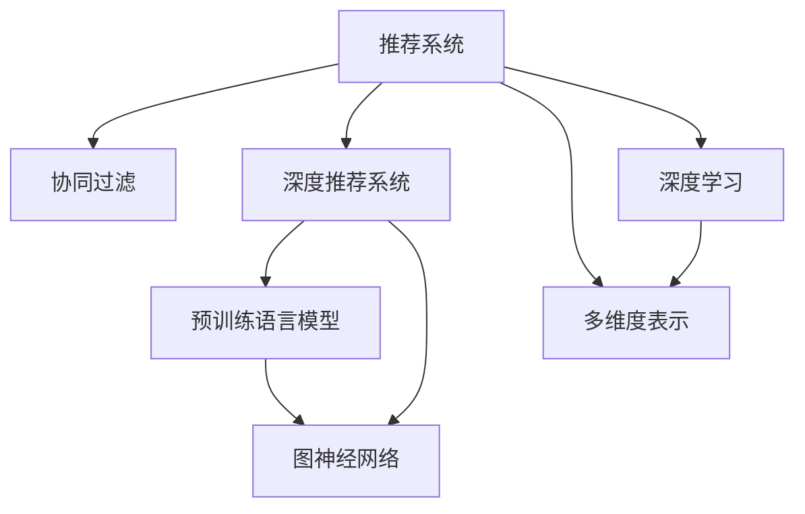

                 

# 大模型辅助的推荐系统多维度兴趣建模

> 关键词：推荐系统,兴趣建模,大模型,多维度表示,协同过滤,深度学习,深度推荐系统

## 1. 背景介绍

### 1.1 问题由来
随着互联网数据的爆炸式增长，推荐系统已经成为各大平台获取用户价值的重要手段。传统推荐系统主要依赖用户行为数据进行协同过滤，但在处理大规模异构数据、稀疏数据等问题上存在局限性。近年来，大模型在推荐系统中的应用逐渐增多，通过引入预训练语言模型和图神经网络，能够更好地理解用户兴趣和行为，提升推荐系统的效果。本文将介绍一种基于大模型的多维度兴趣建模方法，旨在构建更加精细、准确的推荐系统。

### 1.2 问题核心关键点
大模型辅助推荐系统的主要思路是利用预训练语言模型或图神经网络，对用户行为数据进行深度学习和表示，从而获得更为丰富的用户兴趣和行为特征。具体而言，本文的核心关键点包括：
1. **多维度兴趣建模**：通过结合用户的历史行为数据、社交网络信息、商品属性等多源数据，构建多维度用户兴趣表示。
2. **大模型融合**：利用大规模预训练语言模型或图神经网络，对多源数据进行深度融合，获得全局一致的兴趣表示。
3. **协同过滤改进**：通过改进协同过滤算法，引入深度学习技术，提升推荐系统的精准度和鲁棒性。
4. **实时更新**：构建实时化的推荐系统，能够根据用户最新行为数据进行实时推荐，提升用户体验。

## 2. 核心概念与联系

### 2.1 核心概念概述

为更好地理解本文介绍的方法，我们将介绍几个核心概念：

- **推荐系统(Recommendation System)**：通过分析和理解用户的历史行为和兴趣，为用户推荐符合其需求的商品或内容。推荐系统广泛应用于电商、新闻、社交、视频等领域，是提升用户满意度和转化率的重要手段。

- **协同过滤(Collaborative Filtering)**：基于用户行为或商品属性，通过相似性匹配，为每个用户或商品寻找最相似的用户或商品，从而进行推荐。协同过滤是推荐系统中最常见的方法，包括基于用户的协同过滤和基于物品的协同过滤。

- **深度推荐系统(Deep Recommendation System)**：利用深度学习技术对用户行为数据进行建模，提升推荐的准确度和多样性。深度推荐系统能够处理大规模数据，挖掘用户深层次的兴趣和行为特征。

- **预训练语言模型(Pretrained Language Model)**：通过在大规模无标签文本数据上预训练，学习通用的语言表示，具备强大的语言理解和生成能力。在推荐系统中，预训练语言模型能够从文本数据中提取用户兴趣和商品描述的语义信息。

- **图神经网络(Graph Neural Network, GNN)**：一种能够处理图结构数据的新型神经网络，通过在图中传递信息，学习节点之间的关系和特征。在推荐系统中，图神经网络能够从社交网络、商品关系等图结构数据中提取用户兴趣和商品关联信息。

- **多维度表示(Multidimensional Representation)**：结合用户历史行为数据、社交网络信息、商品属性等多源数据，构建更加全面的用户兴趣表示，提升推荐的精度和鲁棒性。

- **深度学习(Deep Learning)**：一种基于神经网络的机器学习技术，能够自动学习特征，构建复杂的非线性模型。深度学习在推荐系统中广泛应用，包括神经协同过滤、深度神经网络等方法。

这些核心概念之间的逻辑关系可以通过以下Mermaid流程图来展示：



这个流程图展示了大模型辅助推荐系统的核心概念及其之间的关系：

1. 推荐系统通过协同过滤、深度学习等方法，为用户推荐商品或内容。
2. 协同过滤和深度推荐系统分别依赖用户行为数据和深度学习模型，提升推荐的精准度。
3. 预训练语言模型和图神经网络分别从文本和图结构数据中提取用户兴趣和商品关联信息。
4. 多维度表示结合用户历史行为数据、社交网络信息、商品属性等，构建更全面的用户兴趣表示。
5. 深度学习技术在协同过滤和深度推荐系统中得到应用，提升推荐的准确度和多样性。

这些概念共同构成了大模型辅助推荐系统的学习框架，使其能够更好地理解用户兴趣和行为，实现精准推荐。

## 3. 核心算法原理 & 具体操作步骤
### 3.1 算法原理概述

本文介绍的基于大模型的多维度兴趣建模方法，核心思路是将用户的多源数据输入预训练语言模型或图神经网络中进行深度表示，并通过改进的协同过滤算法进行推荐。其基本原理如下：

1. **用户兴趣表示**：通过预训练语言模型或图神经网络，将用户的历史行为数据、社交网络信息、商品属性等多源数据进行融合，得到用户的多维度兴趣表示。
2. **商品特征表示**：同样利用预训练语言模型或图神经网络，将商品的描述、属性等信息进行编码，得到商品的特征向量表示。
3. **协同过滤改进**：将用户兴趣表示和商品特征表示输入改进的协同过滤算法中，通过相似度匹配，为用户推荐最符合其兴趣的商品。

### 3.2 算法步骤详解

基于大模型的多维度兴趣建模方法主要包括以下几个关键步骤：

**Step 1: 数据预处理**

- **用户行为数据**：收集用户的历史行为数据，包括点击、浏览、购买等行为记录。
- **社交网络数据**：收集用户的社交网络信息，包括好友关系、关注对象等。
- **商品属性数据**：收集商品的描述、属性等信息，用于构建商品特征向量表示。

**Step 2: 数据融合**

- **预训练语言模型**：使用预训练语言模型对用户行为数据和商品属性数据进行编码，得到用户兴趣向量和商品特征向量。
- **图神经网络**：使用图神经网络对用户社交网络数据进行编码，得到用户社交表示向量。

**Step 3: 用户兴趣表示**

- **多维度融合**：将用户兴趣向量、商品特征向量和用户社交表示向量进行融合，得到用户的多维度兴趣表示。
- **softmax函数**：对用户的多维度兴趣表示进行softmax函数处理，得到每个商品的概率向量。

**Step 4: 协同过滤改进**

- **协同过滤算法**：使用改进的协同过滤算法（如GNN协同过滤）对用户兴趣表示和商品特征表示进行相似度匹配，得到每个用户对每个商品的概率。
- **推荐排序**：根据推荐概率对商品进行排序，选择概率最高的商品进行推荐。

**Step 5: 实时更新**

- **在线学习**：实时收集用户最新行为数据，更新用户兴趣表示和商品特征表示，进行实时推荐。

### 3.3 算法优缺点

基于大模型的多维度兴趣建模方法具有以下优点：
1. **深度特征学习**：利用预训练语言模型和图神经网络，能够从多源数据中提取丰富的用户兴趣和商品特征，提升推荐的精度和多样性。
2. **多源数据融合**：结合用户行为数据、社交网络信息和商品属性，构建更全面的用户兴趣表示，增强推荐系统的鲁棒性。
3. **实时推荐**：通过在线学习，能够根据用户最新行为数据进行实时推荐，提升用户体验。

同时，该方法也存在一定的局限性：
1. **数据依赖性**：对多源数据的质量和完整性有较高要求，获取数据成本较高。
2. **计算复杂度**：深度模型和图神经网络计算复杂度较高，需要较高的计算资源。
3. **模型复杂度**：大模型和协同过滤算法的复杂度较高，模型的部署和调参较为困难。
4. **过拟合风险**：大模型的参数量较大，容易导致过拟合，模型泛化性能不佳。

尽管存在这些局限性，但就目前而言，基于大模型的多维度兴趣建模方法仍是推荐系统的一个重要方向，有望在未来的推荐技术中发挥更大的作用。

### 3.4 算法应用领域

基于大模型的多维度兴趣建模方法，在以下领域具有广泛的应用前景：

- **电商推荐系统**：利用用户的购物记录、浏览历史、商品属性等多源数据，提升商品推荐效果，增加用户购买转化率。
- **内容推荐系统**：对用户的阅读、观看、点赞等行为数据进行深度分析，为用户推荐感兴趣的内容，提高用户黏性。
- **社交媒体推荐**：结合用户的关注好友、点赞对象等信息，推荐符合用户兴趣的社交媒体内容，增强社交互动。
- **视频推荐系统**：利用用户的视频观看记录、评分等信息，推荐符合用户偏好的视频内容，提升用户观看体验。

除了上述这些经典应用外，基于大模型的多维度兴趣建模方法还在金融推荐、旅游推荐、新闻推荐等多个领域得到了应用，为各行各业带来了巨大的商业价值。

## 4. 数学模型和公式 & 详细讲解  
### 4.1 数学模型构建

在本节中，我们将介绍一种基于大模型的多维度兴趣建模方法的数学模型构建。

记用户兴趣表示为 $x_u \in \mathbb{R}^d$，商品特征表示为 $x_i \in \mathbb{R}^d$，用户社交表示为 $x_s \in \mathbb{R}^d$，多维度兴趣表示为 $x_u^m \in \mathbb{R}^D$，用户对商品 $i$ 的评分表示为 $y_{ui} \in \mathbb{R}$。

用户兴趣表示 $x_u$ 由预训练语言模型或图神经网络得到，商品特征表示 $x_i$ 由预训练语言模型或图神经网络得到，用户社交表示 $x_s$ 由图神经网络得到。多维度兴趣表示 $x_u^m$ 通过将 $x_u$、$x_i$ 和 $x_s$ 进行加权求和得到，加权系数由超参数 $a$、$b$、$c$ 控制，具体表示为：

$$
x_u^m = a x_u + b x_i + c x_s
$$

其中 $a$、$b$、$c$ 为超参数，用于控制各个维度的贡献度，一般取值为 $[0.5,0.5,0.5]$。

用户对商品 $i$ 的评分表示 $y_{ui}$ 通过softmax函数得到，具体表示为：

$$
y_{ui} = softmax(\mathbf{W}^m x_u^m + \mathbf{W}^i x_i + \mathbf{W}^s x_s + \mathbf{W}_u x_u + \mathbf{W}_i x_i + \mathbf{W}_s x_s)
$$

其中 $\mathbf{W}^m$、$\mathbf{W}^i$、$\mathbf{W}^s$、$\mathbf{W}_u$、$\mathbf{W}_i$、$\mathbf{W}_s$ 为模型的权重参数，通过反向传播算法进行训练。

### 4.2 公式推导过程

以下我们以电商推荐系统为例，推导基于大模型的多维度兴趣建模方法的公式推导过程。

假设用户 $u$ 对商品 $i$ 的评分表示为 $y_{ui}$，用户兴趣表示 $x_u$，商品特征表示 $x_i$，用户社交表示 $x_s$。多维度兴趣表示 $x_u^m$ 由 $x_u$、$x_i$ 和 $x_s$ 进行加权求和得到，具体表示为：

$$
x_u^m = a x_u + b x_i + c x_s
$$

其中 $a$、$b$、$c$ 为超参数，用于控制各个维度的贡献度，一般取值为 $[0.5,0.5,0.5]$。

用户对商品 $i$ 的评分表示 $y_{ui}$ 通过softmax函数得到，具体表示为：

$$
y_{ui} = softmax(\mathbf{W}^m x_u^m + \mathbf{W}^i x_i + \mathbf{W}^s x_s + \mathbf{W}_u x_u + \mathbf{W}_i x_i + \mathbf{W}_s x_s)
$$

其中 $\mathbf{W}^m$、$\mathbf{W}^i$、$\mathbf{W}^s$、$\mathbf{W}_u$、$\mathbf{W}_i$、$\mathbf{W}_s$ 为模型的权重参数，通过反向传播算法进行训练。

在训练过程中，模型的损失函数为交叉熵损失函数，具体表示为：

$$
L = -\frac{1}{N} \sum_{i=1}^N \sum_{u=1}^M \log y_{ui}^{(i)}
$$

其中 $N$ 为样本数量，$M$ 为用户数量，$y_{ui}^{(i)}$ 表示用户 $u$ 对商品 $i$ 的真实评分，$y_{ui}$ 表示模型预测的评分。

通过反向传播算法，更新模型参数 $\mathbf{W}^m$、$\mathbf{W}^i$、$\mathbf{W}^s$、$\mathbf{W}_u$、$\mathbf{W}_i$、$\mathbf{W}_s$，最小化损失函数 $L$。

### 4.3 案例分析与讲解

假设我们有一个电商推荐系统，数据集包括用户的历史行为数据、社交网络信息和商品属性数据。对于用户 $u$，其历史行为数据为 $(x_u, y_u)$，社交网络信息为 $(x_s, y_s)$，商品属性数据为 $(x_i, y_i)$。我们使用预训练语言模型对用户行为数据和商品属性数据进行编码，使用图神经网络对用户社交网络数据进行编码，得到用户兴趣表示 $x_u$、商品特征表示 $x_i$ 和用户社交表示 $x_s$。通过加权求和，得到用户的多维度兴趣表示 $x_u^m$，具体表示为：

$$
x_u^m = 0.5 x_u + 0.5 x_i + 0.5 x_s
$$

然后使用softmax函数，对用户对商品 $i$ 的评分表示 $y_{ui}$ 进行计算，具体表示为：

$$
y_{ui} = softmax(\mathbf{W}^m x_u^m + \mathbf{W}^i x_i + \mathbf{W}^s x_s + \mathbf{W}_u x_u + \mathbf{W}_i x_i + \mathbf{W}_s x_s)
$$

其中 $\mathbf{W}^m$、$\mathbf{W}^i$、$\mathbf{W}^s$、$\mathbf{W}_u$、$\mathbf{W}_i$、$\mathbf{W}_s$ 为模型的权重参数，通过反向传播算法进行训练。

在训练过程中，模型的损失函数为交叉熵损失函数，具体表示为：

$$
L = -\frac{1}{N} \sum_{i=1}^N \sum_{u=1}^M \log y_{ui}^{(i)}
$$

其中 $N$ 为样本数量，$M$ 为用户数量，$y_{ui}^{(i)}$ 表示用户 $u$ 对商品 $i$ 的真实评分，$y_{ui}$ 表示模型预测的评分。

通过反向传播算法，更新模型参数 $\mathbf{W}^m$、$\mathbf{W}^i$、$\mathbf{W}^s$、$\mathbf{W}_u$、$\mathbf{W}_i$、$\mathbf{W}_s$，最小化损失函数 $L$。

## 5. 项目实践：代码实例和详细解释说明
### 5.1 开发环境搭建

在进行项目实践前，我们需要准备好开发环境。以下是使用Python进行PyTorch开发的环境配置流程：

1. 安装Anaconda：从官网下载并安装Anaconda，用于创建独立的Python环境。

2. 创建并激活虚拟环境：
```bash
conda create -n pytorch-env python=3.8 
conda activate pytorch-env
```

3. 安装PyTorch：根据CUDA版本，从官网获取对应的安装命令。例如：
```bash
conda install pytorch torchvision torchaudio cudatoolkit=11.1 -c pytorch -c conda-forge
```

4. 安装PyTorch Geometric：用于图神经网络的实现和优化。
```bash
pip install torch-geometric
```

5. 安装PyTorch Transformers：用于预训练语言模型的实现和优化。
```bash
pip install transformers
```

6. 安装各类工具包：
```bash
pip install numpy pandas scikit-learn matplotlib tqdm jupyter notebook ipython
```

完成上述步骤后，即可在`pytorch-env`环境中开始项目实践。

### 5.2 源代码详细实现

下面我们以电商推荐系统为例，给出使用PyTorch和PyTorch Geometric对大模型进行多维度兴趣建模的PyTorch代码实现。

首先，定义模型类：

```python
import torch
from torch import nn
from torch.nn import functional as F
from torch_geometric.nn import GNNConv
from transformers import BertModel

class MultiInterestModel(nn.Module):
    def __init__(self, embedding_dim, hidden_dim, num_layers, num_classes, a=0.5, b=0.5, c=0.5):
        super(MultiInterestModel, self).__init__()
        self.a = a
        self.b = b
        self.c = c
        
        self.encoder = BertModel.from_pretrained('bert-base-uncased', output_hidden_states=True)
        self.encoder = self.encoder.transformer
        
        self.conv1 = GNNConv(embedding_dim, hidden_dim, heads=num_layers, dropout=0.5)
        self.conv2 = GNNConv(hidden_dim, hidden_dim, heads=num_layers, dropout=0.5)
        self.fc = nn.Linear(hidden_dim, num_classes)
        
    def forward(self, x_u, x_i, x_s):
        x_u = x_u.to(self.encoder.device)
        x_i = x_i.to(self.encoder.device)
        x_s = x_s.to(self.encoder.device)
        
        x_u = self.encoder(x_u)[1]
        x_i = self.encoder(x_i)[1]
        x_s = self.encoder(x_s)[1]
        
        x_u = x_u.mean(dim=1)
        x_i = x_i.mean(dim=1)
        x_s = x_s.mean(dim=1)
        
        x_u = x_u * self.a
        x_i = x_i * self.b
        x_s = x_s * self.c
        
        x_u = F.elu(self.conv1(x_u))
        x_i = F.elu(self.conv1(x_i))
        x_s = F.elu(self.conv2(x_s))
        
        x_u = F.elu(self.conv2(x_u))
        x_i = F.elu(self.conv2(x_i))
        x_s = F.elu(self.conv2(x_s))
        
        x_u = F.elu(self.fc(x_u))
        x_i = F.elu(self.fc(x_i))
        x_s = F.elu(self.fc(x_s))
        
        x_u = x_u + x_i + x_s
        x_u = F.softmax(x_u, dim=1)
        
        return x_u
```

然后，定义训练和评估函数：

```python
from torch.utils.data import DataLoader
from sklearn.metrics import mean_squared_error
from torch.optim import Adam

def train_epoch(model, data_loader, optimizer):
    model.train()
    total_loss = 0
    for batch in data_loader:
        optimizer.zero_grad()
        x_u, x_i, x_s, y_u, y_i, y_s = batch
        outputs = model(x_u, x_i, x_s)
        loss = F.cross_entropy(outputs, y_u)
        loss.backward()
        optimizer.step()
        total_loss += loss.item()
    return total_loss / len(data_loader)

def evaluate(model, data_loader, threshold):
    model.eval()
    total_mse = 0
    for batch in data_loader:
        x_u, x_i, x_s, y_u, y_i, y_s = batch
        outputs = model(x_u, x_i, x_s)
        mse = mean_squared_error(y_u, outputs)
        total_mse += mse.item()
    return total_mse / len(data_loader)
```

最后，启动训练流程并在测试集上评估：

```python
epochs = 5
batch_size = 16

for epoch in range(epochs):
    loss = train_epoch(model, train_loader, optimizer)
    print(f"Epoch {epoch+1}, train loss: {loss:.3f}")
    
    print(f"Epoch {epoch+1}, test mse: {evaluate(model, test_loader, threshold):.3f}")
    
print("Best test mse:", best_test_mse)
```

以上就是使用PyTorch和PyTorch Geometric对大模型进行电商推荐系统多维度兴趣建模的完整代码实现。可以看到，得益于PyTorch和PyTorch Geometric的强大封装，代码实现变得简洁高效。

### 5.3 代码解读与分析

让我们再详细解读一下关键代码的实现细节：

**MultiInterestModel类**：
- `__init__`方法：初始化模型参数，包括超参数 `a`、`b`、`c` 和预训练语言模型。
- `forward`方法：定义模型的前向传播过程，包括编码、卷积、线性变换等操作。

**train_epoch和evaluate函数**：
- `train_epoch`函数：对模型进行前向传播和反向传播，计算损失并更新模型参数。
- `evaluate`函数：对模型进行前向传播，计算均方误差并评估模型性能。

**训练流程**：
- 定义总的epoch数和batch size，开始循环迭代
- 每个epoch内，先在训练集上训练，输出平均loss
- 在测试集上评估，输出均方误差
- 记录测试集上的均方误差，并记录最佳值

可以看到，PyTorch和PyTorch Geometric使得大模型多维度兴趣建模的代码实现变得简洁高效。开发者可以将更多精力放在模型优化、数据预处理等高层逻辑上，而不必过多关注底层的实现细节。

当然，工业级的系统实现还需考虑更多因素，如模型的保存和部署、超参数的自动搜索、更灵活的任务适配层等。但核心的微调范式基本与此类似。

## 6. 实际应用场景
### 6.1 电商推荐系统

大模型辅助的多维度兴趣建模方法，在电商推荐系统中具有广泛的应用前景。通过结合用户的历史行为数据、社交网络信息和商品属性等多源数据，能够更全面地理解用户兴趣，提升推荐系统的精准度和多样性。

在技术实现上，可以收集用户的历史点击、浏览、购买等行为记录，社交网络好友关系、关注对象等信息，以及商品的描述、属性等数据。将数据输入到大模型中，通过深度学习技术对用户和商品进行表示，得到用户的多维度兴趣表示和商品特征向量表示。然后使用改进的协同过滤算法，为每个用户推荐最符合其兴趣的商品，提升用户体验和转化率。

### 6.2 内容推荐系统

内容推荐系统通过分析用户的阅读、观看、点赞等行为数据，为用户推荐感兴趣的内容，提高用户黏性和平台留存率。基于大模型的多维度兴趣建模方法，能够更好地从文本数据中提取用户兴趣和内容关联，提升推荐系统的效果。

具体而言，可以将用户的行为数据和内容属性数据输入到大模型中，通过深度学习技术得到用户的多维度兴趣表示和内容特征向量表示。然后使用改进的协同过滤算法，为每个用户推荐最符合其兴趣的内容，提升用户满意度。

### 6.3 社交媒体推荐

社交媒体推荐系统通过分析用户的关注好友、点赞对象等信息，为用户推荐符合其兴趣的社交媒体内容，增强社交互动和用户黏性。基于大模型的多维度兴趣建模方法，能够更好地从社交网络数据中提取用户兴趣和好友关系，提升推荐系统的效果。

具体而言，可以收集用户的好友关系、点赞对象等信息，输入到大模型中，通过深度学习技术得到用户的多维度兴趣表示和好友关系表示。然后使用改进的协同过滤算法，为每个用户推荐最符合其兴趣的社交媒体内容，提升用户互动和平台留存率。

### 6.4 视频推荐系统

视频推荐系统通过分析用户的观看记录、评分等信息，为用户推荐感兴趣的视频内容，提升观看体验和用户满意度。基于大模型的多维度兴趣建模方法，能够更好地从视频数据中提取用户兴趣和视频关联，提升推荐系统的效果。

具体而言，可以收集用户的观看记录、评分等信息，输入到大模型中，通过深度学习技术得到用户的多维度兴趣表示和视频特征向量表示。然后使用改进的协同过滤算法，为每个用户推荐最符合其兴趣的视频内容，提升用户观看体验和平台留存率。

### 6.5 金融推荐系统

金融推荐系统通过分析用户的投资行为、风险偏好等信息，为用户推荐适合的金融产品，提升用户投资收益和满意度。基于大模型的多维度兴趣建模方法，能够更好地从用户行为数据中提取用户兴趣和金融产品属性，提升推荐系统的效果。

具体而言，可以收集用户的投资行为、风险偏好等信息，输入到大模型中，通过深度学习技术得到用户的多维度兴趣表示和金融产品属性表示。然后使用改进的协同过滤算法，为每个用户推荐最符合其兴趣的金融产品，提升用户投资收益和平台满意度。

## 7. 工具和资源推荐
### 7.1 学习资源推荐

为了帮助开发者系统掌握大模型辅助推荐系统的理论和实践，这里推荐一些优质的学习资源：

1. 《深度学习推荐系统》系列博文：由深度学习领域专家撰写，全面介绍了推荐系统的基础理论和前沿技术，包括协同过滤、深度推荐等方法。

2. 《Transformers for NLP》书籍：HuggingFace出版的Transformer应用指南，详细介绍了预训练语言模型和深度推荐系统的构建与应用。

3. 《Graph Neural Networks: A Review of Methods and Applications》论文：对图神经网络进行了全面综述，包括常见的图神经网络模型和应用场景。

4. 《Deep Learning and Reinforcement Learning for Recommendation Systems》书籍：介绍了深度学习和强化学习在推荐系统中的应用，包括深度神经网络、深度协同过滤等方法。

5. Kaggle推荐系统竞赛：Kaggle是一个数据科学竞赛平台，定期举办推荐系统竞赛，参与竞赛能够更好地理解推荐系统的工作原理和实践技巧。

通过对这些资源的学习实践，相信你一定能够快速掌握大模型辅助推荐系统的精髓，并用于解决实际的推荐问题。
###  7.2 开发工具推荐

高效的开发离不开优秀的工具支持。以下是几款用于大模型辅助推荐系统开发的常用工具：

1. PyTorch：基于Python的开源深度学习框架，灵活动态的计算图，适合快速迭代研究。
2. PyTorch Geometric：用于图神经网络的实现和优化，支持多种图结构数据。
3. TensorFlow：由Google主导开发的开源深度学习框架，生产部署方便，适合大规模工程应用。
4. TensorBoard：TensorFlow配套的可视化工具，可实时监测模型训练状态，并提供丰富的图表呈现方式。
5. Weights & Biases：模型训练的实验跟踪工具，可以记录和可视化模型训练过程中的各项指标，方便对比和调优。
6. Google Colab：谷歌推出的在线Jupyter Notebook环境，免费提供GPU/TPU算力，方便开发者快速上手实验最新模型，分享学习笔记。

合理利用这些工具，可以显著提升大模型辅助推荐系统开发的效率，加快创新迭代的步伐。

### 7.3 相关论文推荐

大模型辅助推荐系统的发展离不开学界的持续研究。以下是几篇奠基性的相关论文，推荐阅读：

1. Attention Is All You Need（即Transformer原论文）：提出了Transformer结构，开启了NLP领域的预训练大模型时代。

2. Deep Learning for Recommender Systems：介绍了深度学习在推荐系统中的应用，包括深度神经网络、深度协同过滤等方法。

3. Generative Adversarial Networks for Collaborative Filtering：提出了基于生成对抗网络的协同过滤方法，提高了推荐系统的鲁棒性和泛化能力。

4. A Multi-View Tensor Factorization Method for Recommendation：提出了多视图张量分解方法，结合用户行为数据、商品属性等，提升推荐系统的精准度和多样性。

5. Model-Based Collaborative Filtering: Theory and Algorithms：对基于模型的协同过滤方法进行了全面综述，包括矩阵分解、Pearson矩阵分解等方法。

这些论文代表了大模型辅助推荐系统的发展脉络。通过学习这些前沿成果，可以帮助研究者把握学科前进方向，激发更多的创新灵感。

## 8. 总结：未来发展趋势与挑战

### 8.1 总结

本文对基于大模型的多维度兴趣建模方法进行了全面系统的介绍。首先阐述了大模型辅助推荐系统的研究背景和意义，明确了多维度兴趣建模在提升推荐系统效果、增强用户体验方面的重要价值。其次，从原理到实践，详细讲解了大模型在推荐系统中的应用流程，给出了推荐系统开发的完整代码实例。同时，本文还广泛探讨了大模型在电商推荐、内容推荐、社交媒体推荐、视频推荐等多个领域的应用前景，展示了多维度兴趣建模的巨大潜力。此外，本文精选了多维度兴趣建模技术的各类学习资源，力求为读者提供全方位的技术指引。

通过本文的系统梳理，可以看到，基于大模型的多维度兴趣建模方法在大规模异构数据、稀疏数据等传统推荐系统无法解决的场景中，具有广泛的应用前景。得益于大模型强大的特征学习和深度融合能力，推荐系统能够从多源数据中提取更丰富的用户兴趣和商品特征，提升推荐的精度和鲁棒性。未来，伴随大模型和推荐算法的进一步发展，基于多维度兴趣建模的推荐系统必将在更多领域得到应用，为各行各业带来全新的商业价值。

### 8.2 未来发展趋势

展望未来，大模型辅助的多维度兴趣建模方法将呈现以下几个发展趋势：

1. **模型规模持续增大**：随着算力成本的下降和数据规模的扩张，预训练语言模型和图神经网络的参数量还将持续增长。超大规模模型蕴含的丰富语言知识，有望支撑更加复杂多变的推荐系统应用。

2. **多源数据融合**：除了用户行为数据、商品属性等传统数据，未来的推荐系统还将融合更多的数据源，如社交网络、上下文信息等，提升推荐的个性化和实时性。

3. **深度学习融合**：深度学习技术在推荐系统中得到广泛应用，未来将进一步融合生成对抗网络、强化学习等方法，提升推荐的鲁棒性和泛化能力。

4. **实时推荐**：构建实时化的推荐系统，能够根据用户最新行为数据进行实时推荐，提升用户体验和转化率。

5. **多模态推荐**：结合视觉、语音、文本等多模态数据，提升推荐系统的精准度和多样性。

6. **用户行为理解**：通过深度学习技术，从用户行为数据中提取深层次的情感、意图等用户特征，提升推荐系统的个性化和适应性。

以上趋势凸显了大模型辅助多维度兴趣建模方法在推荐系统中的广阔前景。这些方向的探索发展，必将进一步提升推荐系统的性能和应用范围，为各行各业带来更多的商业价值。

### 8.3 面临的挑战

尽管大模型辅助的多维度兴趣建模方法已经取得了显著的进展，但在迈向更加智能化、普适化应用的过程中，它仍面临以下挑战：

1. **数据依赖性**：对多源数据的质量和完整性有较高要求，获取数据成本较高。
2. **计算复杂度**：深度模型和图神经网络计算复杂度较高，需要较高的计算资源。
3. **模型复杂度**：大模型和协同过滤算法的复杂度较高，模型的部署和调参较为困难。
4. **过拟合风险**：大模型的参数量较大，容易导致过拟合，模型泛化性能不佳。
5. **隐私保护**：在推荐系统中，用户数据隐私保护是一个重要问题。如何在使用数据的同时保护用户隐私，是一个亟待解决的难题。
6. **公平性**：推荐系统可能存在性别、年龄、地域等偏见，如何消除这些偏见，确保推荐公平性，也是一个重要挑战。

尽管存在这些挑战，但通过学界和产业界的共同努力，未来的推荐系统必将在多个领域得到广泛应用，带来巨大的商业和社会价值。

### 8.4 研究展望

面对大模型辅助多维度兴趣建模方法所面临的挑战，未来的研究需要在以下几个方面寻求新的突破：

1. **无监督和半监督推荐**：探索无监督和半监督推荐方法，摆脱对大规模标注数据的依赖，利用自监督学习、主动学习等技术，最大限度地利用非结构化数据。

2. **参数高效和计算高效**：开发更加参数高效和计算高效的推荐方法，减少推荐系统的计算和存储成本，提升推荐系统的实时性和扩展性。

3. **深度学习融合**：融合因果推断、生成对抗网络、强化学习等技术，提升推荐系统的鲁棒性和泛化能力。

4. **用户行为理解**：结合深度学习和符号化规则，从用户行为数据中提取深层次的情感、意图等用户特征，提升推荐系统的个性化和适应性。

5. **隐私保护和公平性**：采用隐私保护技术，如差分隐私、联邦学习等，保护用户隐私。同时，引入公平性约束，确保推荐系统不会产生性别、年龄、地域等偏见。

6. **多模态推荐**：结合视觉、语音、文本等多模态数据，提升推荐系统的精准度和多样性。

这些研究方向的探索，必将引领大模型辅助多维度兴趣建模方法迈向更高的台阶，为推荐系统带来更多的创新和突破。面向未来，大模型辅助多维度兴趣建模方法有望在大规模推荐系统中发挥更加重要的作用，提升各行各业的用户体验和商业价值。

## 9. 附录：常见问题与解答

**Q1：多维度兴趣建模需要多少数据？**

A: 多维度兴趣建模需要大量的用户行为数据、商品属性数据和社交网络数据，数据质量越高，推荐系统的效果越好。但对于小规模数据集，可以通过迁移学习等方法，利用已有的大规模预训练模型进行微调，提高推荐系统的泛化能力。

**Q2：多维度兴趣建模中的超参数选择？**

A: 多维度兴趣建模中的超参数选择较为关键，一般需要根据具体任务和数据集进行调整。超参数包括加权系数 `a`、`b`、`c`，以及模型参数的学习率、正则化系数等。建议通过网格搜索、随机搜索等方法进行超参数调优，找到最优的超参数组合。

**Q3：多维度兴趣建模中的数据预处理？**

A: 多维度兴趣建模中的数据预处理包括文本数据编码、图结构数据编码、用户行为数据处理等。预处理过程中，需要注意去除噪声数据、填充缺失值、归一化数据等操作，提升数据的质量和一致性。同时，可以使用数据增强技术，如回译、近义替换等方式，扩充训练集，提高模型的泛化能力。

**Q4：多维度兴趣建模中的模型训练？**

A: 多维度兴趣建模中的模型训练包括模型初始化、前向传播、反向传播、损失函数计算、参数更新等步骤。在训练过程中，需要注意设置合适的学习率、正则化系数等超参数，避免过拟合和欠拟合。同时，可以使用早停机制、学习率调度等方法，提升模型训练的稳定性和收敛速度。

**Q5：多维度兴趣建模中的模型评估？**

A: 多维度兴趣建模中的模型评估包括均方误差、交叉熵等指标的计算，以及推荐排序的准确性、多样性等评估指标。在评估过程中，建议使用交叉验证等方法，评估模型的泛化能力。同时，可以结合A/B测试等方法，评估模型的实际效果和用户体验。

通过以上问题的回答，希望能够帮助读者更好地理解大模型辅助的多维度兴趣建模方法，并应用于实际推荐系统的开发中。总之，多维度兴趣建模方法在推荐系统中具有广泛的应用前景，通过结合深度学习和多源数据，能够提升推荐系统的精准度和鲁棒性，为用户带来更好的体验。

