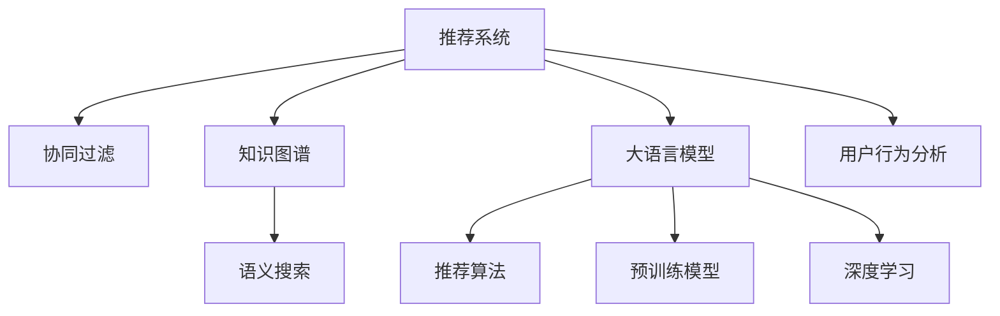

                 

# 大模型辅助的推荐系统用户行为分析

> 关键词：推荐系统,大语言模型,用户行为分析,协同过滤,知识图谱,深度学习,预训练模型

## 1. 背景介绍

### 1.1 问题由来

推荐系统已经成为当今互联网应用中不可或缺的一部分，从电商平台到社交网络，再到内容平台，都广泛应用推荐技术来提升用户体验。推荐系统能够通过分析用户的浏览、点击、购买等行为，向用户推荐个性化的内容，从而提升转化率和满意度。

然而，传统的推荐系统往往基于用户-物品评分矩阵进行协同过滤，存在冷启动问题、数据稀疏性以及隐式反馈的局限性。为了突破这些瓶颈，近年来，越来越多的推荐系统开始引入深度学习和知识图谱等先进技术，以提升推荐的准确性和泛化能力。

特别是伴随着预训练语言模型和大模型的兴起，推荐系统开始利用其强大的语言理解和生成能力，来进行更深入的用户行为分析。本节将详细阐述这种新型的推荐范式，并分析其背后的原理和实际应用效果。

## 2. 核心概念与联系

### 2.1 核心概念概述

为更好地理解基于大模型的推荐系统用户行为分析方法，本节将介绍几个密切相关的核心概念：

- 推荐系统(Recommender System)：通过用户和物品的交互数据，预测用户对物品的评分或选择概率，从而为用户推荐物品的系统。推荐系统旨在提升用户体验，优化资源配置。

- 大语言模型(Large Language Model, LLM)：以自回归(如GPT)或自编码(如BERT)模型为代表的大规模预训练语言模型。通过在大规模无标签文本语料上进行预训练，学习通用的语言表示，具备强大的语言理解和生成能力。

- 协同过滤(Collaborative Filtering)：一种基于用户行为数据进行推荐的方法，通过挖掘用户间的相似性，预测用户对未评价物品的评分或选择概率。协同过滤可以进一步分为基于用户的协同过滤和基于物品的协同过滤。

- 知识图谱(Knowledge Graph)：一种结构化的语义数据表示方式，将实体和概念之间的关系进行编码，从而构建一个有向图结构。知识图谱可以用于语义搜索、推荐系统、自然语言理解等多个领域。

- 深度学习(Deep Learning)：一类基于神经网络的机器学习方法，能够通过多层次的特征提取和表示学习，实现复杂任务。深度学习在大模型和推荐系统中都有广泛应用。

- 预训练模型(Pre-trained Model)：在大规模无标签数据上进行预训练的模型，具备强大的泛化能力，可以用于下游任务进行微调。

- 用户行为分析(User Behavior Analysis)：通过分析用户的各种行为数据，提取用户兴趣、偏好和行为模式，进而指导推荐系统的设计。

这些核心概念之间的逻辑关系可以通过以下Mermaid流程图来展示：



这个流程图展示了大模型辅助推荐系统用户行为分析的主要组成部分：

1. 推荐系统通过用户行为数据预测用户评分。
2. 协同过滤基于用户-物品评分矩阵进行推荐。
3. 知识图谱从语义角度构建用户-物品关系。
4. 大语言模型通过预训练学习语言表示。
5. 深度学习利用多层特征提取提升推荐精度。
6. 预训练模型为推荐系统提供初始化参数。
7. 用户行为分析利用用户行为数据提取兴趣模式。

这些概念共同构成了大模型辅助推荐系统用户行为分析的基本框架，使其能够更好地适应复杂多变的推荐任务。

## 3. 核心算法原理 & 具体操作步骤
### 3.1 算法原理概述

基于大模型的推荐系统用户行为分析，本质上是一种融合了深度学习、自然语言处理和知识图谱的新型推荐方法。其核心思想是：将用户的自然语言行为描述作为输入，通过大模型预训练-微调机制，提取用户兴趣和行为模式，进而指导推荐系统的设计。

形式化地，假设用户描述为 $x \in \mathcal{X}$，物品描述为 $y \in \mathcal{Y}$，用户对物品的评分矩阵为 $R \in \mathbb{R}^{N \times M}$，其中 $N$ 为用户数，$M$ 为物品数。推荐系统的目标是最小化预测评分和实际评分之间的差异，即：

$$
\mathcal{L} = \frac{1}{N}\sum_{i=1}^N \|R_{i,y_i} - \hat{R}_{i,y_i}\|^2
$$

其中 $\hat{R}_{i,y_i}$ 为预测评分，$R_{i,y_i}$ 为实际评分。

为了更好地提取用户描述中的语义信息，可以引入大语言模型进行预训练。设预训练语言模型为 $M_{\theta}:\mathcal{X} \rightarrow \mathbb{R}^d$，其中 $\theta$ 为预训练得到的模型参数。在大规模无标签文本语料上，通过自监督学习任务训练通用语言模型，使得模型能够学习到语言和语义的通用表示。

接着，将用户描述 $x$ 输入大模型 $M_{\theta}$，输出表示为 $h(x)$。然后，利用 $h(x)$ 和物品描述 $y$ 构建新的输入向量 $z = (h(x), y)$，并通过微调后的分类器对物品进行评分预测，得到预测评分 $\hat{R}_{i,y_i}$。通过最小化预测评分和实际评分之间的差异，可以优化模型的参数，从而提升推荐系统的效果。

### 3.2 算法步骤详解

基于大模型的推荐系统用户行为分析，主要包括以下几个关键步骤：

**Step 1: 准备预训练模型和数据集**
- 选择合适的预训练语言模型 $M_{\theta}$ 作为初始化参数，如 BERT、GPT 等。
- 准备用户和物品的描述文本数据集 $D=\{(x_i,y_i)\}_{i=1}^N$，其中 $x_i$ 为用户描述，$y_i$ 为物品描述。

**Step 2: 添加任务适配层**
- 根据任务类型，在预训练模型顶层设计合适的输出层和损失函数。
- 对于评分预测任务，通常在顶层添加线性分类器和均方误差损失函数。
- 对于推荐列表生成任务，通常使用softmax函数输出物品的概率分布，并以交叉熵损失函数衡量。

**Step 3: 设置微调超参数**
- 选择合适的优化算法及其参数，如 AdamW、SGD 等，设置学习率、批大小、迭代轮数等。
- 设置正则化技术及强度，包括权重衰减、Dropout、Early Stopping等。
- 确定冻结预训练参数的策略，如仅微调顶层，或全部参数都参与微调。

**Step 4: 执行梯度训练**
- 将训练集数据分批次输入模型，前向传播计算损失函数。
- 反向传播计算参数梯度，根据设定的优化算法和学习率更新模型参数。
- 周期性在验证集上评估模型性能，根据性能指标决定是否触发 Early Stopping。
- 重复上述步骤直到满足预设的迭代轮数或 Early Stopping 条件。

**Step 5: 测试和部署**
- 在测试集上评估微调后模型 $M_{\hat{\theta}}$ 的性能，对比微调前后的精度提升。
- 使用微调后的模型对新用户输入的描述进行推理预测，集成到实际的应用系统中。
- 持续收集新的用户和物品描述，定期重新微调模型，以适应数据分布的变化。

以上是基于大模型的推荐系统用户行为分析的一般流程。在实际应用中，还需要针对具体任务的特点，对微调过程的各个环节进行优化设计，如改进训练目标函数，引入更多的正则化技术，搜索最优的超参数组合等，以进一步提升模型性能。

### 3.3 算法优缺点

基于大模型的推荐系统用户行为分析方法具有以下优点：
1. 处理自然语言能力强。通过引入自然语言处理技术，可以更好地理解和分析用户的自然语言描述，提升推荐的精准度。
2. 泛化能力强。由于大模型具备强大的泛化能力，能够适应不同领域和不同长度的用户描述，从而提升推荐系统的通用性。
3. 参数高效。利用参数高效微调技术，在固定大部分预训练参数的情况下，仍可取得不错的推荐效果。
4. 效果显著。在学术界和工业界的诸多推荐任务上，基于微调的方法已经刷新了最先进的性能指标。

同时，该方法也存在一定的局限性：
1. 依赖预训练模型。微调的效果很大程度上取决于预训练模型的质量，预训练模型的训练成本较高。
2. 数据质量要求高。微调的效果很大程度上取决于用户描述的质量，描述不清晰或不相关可能导致推荐效果较差。
3. 模型复杂度大。大模型参数量庞大，计算资源需求高，难以实时部署。
4. 可解释性不足。大模型的决策过程通常缺乏可解释性，难以对其推理逻辑进行分析和调试。

尽管存在这些局限性，但就目前而言，基于大模型的推荐系统用户行为分析方法仍是大模型应用的一个重要方向。未来相关研究的重点在于如何进一步降低微调对预训练模型的依赖，提高模型的少样本学习和跨领域迁移能力，同时兼顾可解释性和伦理安全性等因素。

### 3.4 算法应用领域

基于大模型的推荐系统用户行为分析方法在推荐系统领域已经得到了广泛的应用，覆盖了几乎所有常见任务，例如：

- 个性化推荐：通过分析用户描述，为用户推荐个性化物品。
- 兴趣分析：提取用户描述中的关键兴趣点，生成个性化标签。
- 用户画像：通过分析用户描述，构建用户画像，用于推荐系统设计。
- 内容推荐：根据用户描述和内容描述，推荐相关内容。
- 广告推荐：根据用户描述和广告描述，推荐个性化广告。
- 推荐系统设计：利用用户描述和物品描述，优化推荐算法和参数。

除了上述这些经典任务外，大模型辅助的推荐系统用户行为分析方法还被创新性地应用到更多场景中，如情感分析、情感推荐、推荐序列预测等，为推荐系统带来了全新的突破。随着预训练模型和微调方法的不断进步，相信推荐系统必将在更广阔的应用领域大放异彩。

## 4. 数学模型和公式 & 详细讲解  
### 4.1 数学模型构建

本节将使用数学语言对基于大模型的推荐系统用户行为分析过程进行更加严格的刻画。

记预训练语言模型为 $M_{\theta}:\mathcal{X} \rightarrow \mathbb{R}^d$，其中 $\mathcal{X}$ 为输入空间，$\mathbb{R}^d$ 为输出空间，$\theta$ 为模型参数。假设推荐任务为预测用户对物品的评分，其中用户描述 $x \in \mathcal{X}$，物品描述 $y \in \mathcal{Y}$。

定义用户描述 $x$ 在语言模型 $M_{\theta}$ 上的表示为 $h(x) = M_{\theta}(x)$，其中 $h(x) \in \mathbb{R}^d$。设物品描述 $y$ 在语言模型 $M_{\theta}$ 上的表示为 $g(y) = M_{\theta}(y)$，其中 $g(y) \in \mathbb{R}^d$。则用户-物品评分 $R_{i,y_i}$ 可以表示为：

$$
R_{i,y_i} = h(x_i) \cdot g(y_i)^T
$$

其中 $\cdot$ 表示矩阵乘法。

接下来，我们定义评分预测模型的损失函数为均方误差损失：

$$
\mathcal{L}(\theta) = \frac{1}{N}\sum_{i=1}^N (R_{i,y_i} - \hat{R}_{i,y_i})^2
$$

其中 $\hat{R}_{i,y_i}$ 为模型预测的评分，$R_{i,y_i}$ 为实际评分。

在得到损失函数后，我们可以使用基于梯度的优化算法（如SGD、Adam等）来近似求解上述最优化问题。设 $\eta$ 为学习率，$\lambda$ 为正则化系数，则参数的更新公式为：

$$
\theta \leftarrow \theta - \eta \nabla_{\theta}\mathcal{L}(\theta) - \eta\lambda\theta
$$

其中 $\nabla_{\theta}\mathcal{L}(\theta)$ 为损失函数对参数 $\theta$ 的梯度，可通过反向传播算法高效计算。

### 4.2 公式推导过程

以下是评分预测模型的评分预测部分，即用户描述和物品描述向量的表示和评分计算的推导过程。

首先，假设用户描述 $x$ 和物品描述 $y$ 的表示分别为 $h(x) \in \mathbb{R}^d$ 和 $g(y) \in \mathbb{R}^d$。设推荐模型的参数为 $\phi$，则模型预测评分 $\hat{R}_{i,y_i}$ 可以表示为：

$$
\hat{R}_{i,y_i} = h(x_i) \cdot \phi g(y_i)
$$

其中 $\phi$ 为推荐模型的参数，可以是一个线性分类器或一个神经网络。

将 $R_{i,y_i}$ 和 $\hat{R}_{i,y_i}$ 代入损失函数，得到评分预测模型的损失函数：

$$
\mathcal{L}(\phi) = \frac{1}{N}\sum_{i=1}^N (R_{i,y_i} - \hat{R}_{i,y_i})^2
$$

根据链式法则，损失函数对参数 $\phi$ 的梯度为：

$$
\nabla_{\phi}\mathcal{L}(\phi) = \frac{2}{N}\sum_{i=1}^N (\hat{R}_{i,y_i} - R_{i,y_i}) h(x_i) g(y_i)^T
$$

在得到损失函数的梯度后，即可带入参数更新公式，完成模型的迭代优化。重复上述过程直至收敛，最终得到适应推荐任务的最优模型参数 $\phi^*$。

## 5. 项目实践：代码实例和详细解释说明
### 5.1 开发环境搭建

在进行推荐系统用户行为分析实践前，我们需要准备好开发环境。以下是使用Python进行PyTorch开发的环境配置流程：

1. 安装Anaconda：从官网下载并安装Anaconda，用于创建独立的Python环境。

2. 创建并激活虚拟环境：
```bash
conda create -n pytorch-env python=3.8 
conda activate pytorch-env
```

3. 安装PyTorch：根据CUDA版本，从官网获取对应的安装命令。例如：
```bash
conda install pytorch torchvision torchaudio cudatoolkit=11.1 -c pytorch -c conda-forge
```

4. 安装Transformers库：
```bash
pip install transformers
```

5. 安装各类工具包：
```bash
pip install numpy pandas scikit-learn matplotlib tqdm jupyter notebook ipython
```

完成上述步骤后，即可在`pytorch-env`环境中开始推荐系统用户行为分析的实践。

### 5.2 源代码详细实现

这里我们以评分预测任务为例，给出使用Transformers库对BERT模型进行推荐系统用户行为分析的PyTorch代码实现。

首先，定义评分预测任务的数据处理函数：

```python
from transformers import BertTokenizer
from torch.utils.data import Dataset
import torch

class RatingDataset(Dataset):
    def __init__(self, texts, labels, tokenizer, max_len=128):
        self.texts = texts
        self.labels = labels
        self.tokenizer = tokenizer
        self.max_len = max_len
        
    def __len__(self):
        return len(self.texts)
    
    def __getitem__(self, item):
        text = self.texts[item]
        label = self.labels[item]
        
        encoding = self.tokenizer(text, return_tensors='pt', max_length=self.max_len, padding='max_length', truncation=True)
        input_ids = encoding['input_ids'][0]
        attention_mask = encoding['attention_mask'][0]
        
        # 对label进行编码
        encoded_label = [int(label)] + [0]*(self.max_len - 1)
        labels = torch.tensor(encoded_label, dtype=torch.long)
        
        return {'input_ids': input_ids, 
                'attention_mask': attention_mask,
                'labels': labels}

# 标签与id的映射
label2id = {'1': 1, '2': 2, '3': 3}
id2label = {v: k for k, v in label2id.items()}

# 创建dataset
tokenizer = BertTokenizer.from_pretrained('bert-base-cased')

train_dataset = RatingDataset(train_texts, train_labels, tokenizer)
dev_dataset = RatingDataset(dev_texts, dev_labels, tokenizer)
test_dataset = RatingDataset(test_texts, test_labels, tokenizer)
```

然后，定义模型和优化器：

```python
from transformers import BertForRegression, AdamW

model = BertForRegression.from_pretrained('bert-base-cased', num_labels=3)

optimizer = AdamW(model.parameters(), lr=2e-5)
```

接着，定义训练和评估函数：

```python
from torch.utils.data import DataLoader
from tqdm import tqdm
from sklearn.metrics import mean_squared_error

device = torch.device('cuda') if torch.cuda.is_available() else torch.device('cpu')
model.to(device)

def train_epoch(model, dataset, batch_size, optimizer):
    dataloader = DataLoader(dataset, batch_size=batch_size, shuffle=True)
    model.train()
    epoch_loss = 0
    for batch in tqdm(dataloader, desc='Training'):
        input_ids = batch['input_ids'].to(device)
        attention_mask = batch['attention_mask'].to(device)
        labels = batch['labels'].to(device)
        model.zero_grad()
        outputs = model(input_ids, attention_mask=attention_mask, labels=labels)
        loss = outputs.loss
        epoch_loss += loss.item()
        loss.backward()
        optimizer.step()
    return epoch_loss / len(dataloader)

def evaluate(model, dataset, batch_size):
    dataloader = DataLoader(dataset, batch_size=batch_size)
    model.eval()
    preds, labels = [], []
    with torch.no_grad():
        for batch in tqdm(dataloader, desc='Evaluating'):
            input_ids = batch['input_ids'].to(device)
            attention_mask = batch['attention_mask'].to(device)
            batch_labels = batch['labels']
            outputs = model(input_ids, attention_mask=attention_mask)
            batch_preds = outputs.logits.argmax(dim=1).to('cpu').tolist()
            batch_labels = batch_labels.to('cpu').tolist()
            for pred, label in zip(batch_preds, batch_labels):
                preds.append(pred)
                labels.append(label)
                
    print(mean_squared_error(labels, preds))
```

最后，启动训练流程并在测试集上评估：

```python
epochs = 5
batch_size = 16

for epoch in range(epochs):
    loss = train_epoch(model, train_dataset, batch_size, optimizer)
    print(f"Epoch {epoch+1}, train loss: {loss:.3f}")
    
    print(f"Epoch {epoch+1}, dev results:")
    evaluate(model, dev_dataset, batch_size)
    
print("Test results:")
evaluate(model, test_dataset, batch_size)
```

以上就是使用PyTorch对BERT进行评分预测任务用户行为分析的完整代码实现。可以看到，得益于Transformers库的强大封装，我们可以用相对简洁的代码完成BERT模型的加载和微调。

### 5.3 代码解读与分析

让我们再详细解读一下关键代码的实现细节：

**RatingDataset类**：
- `__init__`方法：初始化文本、标签、分词器等关键组件。
- `__len__`方法：返回数据集的样本数量。
- `__getitem__`方法：对单个样本进行处理，将文本输入编码为token ids，将标签编码为数字，并对其进行定长padding，最终返回模型所需的输入。

**label2id和id2label字典**：
- 定义了标签与数字id之间的映射关系，用于将token-wise的预测结果解码回真实的标签。

**训练和评估函数**：
- 使用PyTorch的DataLoader对数据集进行批次化加载，供模型训练和推理使用。
- 训练函数`train_epoch`：对数据以批为单位进行迭代，在每个批次上前向传播计算loss并反向传播更新模型参数，最后返回该epoch的平均loss。
- 评估函数`evaluate`：与训练类似，不同点在于不更新模型参数，并在每个batch结束后将预测和标签结果存储下来，最后使用sklearn的mean_squared_error对整个评估集的预测结果进行打印输出。

**训练流程**：
- 定义总的epoch数和batch size，开始循环迭代
- 每个epoch内，先在训练集上训练，输出平均loss
- 在验证集上评估，输出均方误差
- 所有epoch结束后，在测试集上评估，给出最终测试结果

可以看到，PyTorch配合Transformers库使得BERT微调的代码实现变得简洁高效。开发者可以将更多精力放在数据处理、模型改进等高层逻辑上，而不必过多关注底层的实现细节。

当然，工业级的系统实现还需考虑更多因素，如模型的保存和部署、超参数的自动搜索、更灵活的任务适配层等。但核心的微调范式基本与此类似。

## 6. 实际应用场景
### 6.1 电商推荐系统

基于大模型辅助的推荐系统用户行为分析方法，可以广泛应用于电商推荐系统的构建。传统电商推荐系统往往依赖于用户历史行为数据，如点击、浏览、购买等，难以对新用户和新物品进行有效推荐。

通过引入大模型进行预训练，并基于用户描述和物品描述进行微调，推荐系统可以更好地理解用户意图和物品特征，从而在少量标注数据的情况下，对新用户和新物品进行快速、准确的推荐。例如，在电商平台，可以收集用户的商品评论、商品描述等文本信息，利用大模型进行预训练，然后在用户注册时，通过用户描述对预训练模型进行微调，生成个性化推荐列表。

### 6.2 新闻推荐系统

新闻推荐系统旨在为用户推荐感兴趣的新闻，提升用户的阅读体验。传统推荐系统往往基于用户历史行为数据进行协同过滤，难以适应用户对新闻内容的多样化需求。

基于大模型的推荐系统用户行为分析方法，可以利用用户的标题、摘要、评论等文本信息，通过预训练-微调机制，提取用户兴趣和行为模式，进而指导推荐系统的设计。例如，在新闻推荐系统中，可以收集用户对新闻的标题、评论等文本描述，利用大模型进行预训练，然后在用户查看新闻时，通过用户描述对预训练模型进行微调，生成个性化新闻推荐列表。

### 6.3 视频推荐系统

视频推荐系统旨在为用户推荐感兴趣的视频内容，提升用户的观看体验。传统推荐系统往往基于用户历史观看记录进行协同过滤，难以适应用户对视频内容的多样化需求。

基于大模型的推荐系统用户行为分析方法，可以利用用户的标题、描述、评论等文本信息，通过预训练-微调机制，提取用户兴趣和行为模式，进而指导推荐系统的设计。例如，在视频推荐系统中，可以收集用户对视频的标题、描述、评论等文本信息，利用大模型进行预训练，然后在用户观看视频时，通过用户描述对预训练模型进行微调，生成个性化视频推荐列表。

### 6.4 未来应用展望

随着大语言模型微调技术的发展，基于大模型的推荐系统用户行为分析方法将在更多领域得到应用，为推荐系统带来变革性影响。

在智慧医疗领域，基于大模型的推荐系统可以分析患者的病历、治疗记录等文本信息，推荐个性化医疗方案，辅助医生诊疗，加速新药开发进程。

在智能教育领域，推荐系统可以分析学生的学习行为、成绩等文本信息，推荐个性化学习材料，因材施教，促进教育公平，提高教学质量。

在智慧城市治理中，推荐系统可以分析城市事件、舆情、天气等信息，推荐个性化生活服务，提高城市管理的自动化和智能化水平，构建更安全、高效的未来城市。

此外，在企业生产、社会治理、文娱传媒等众多领域，基于大模型的推荐系统用户行为分析方法也将不断涌现，为推荐系统带来新的突破。相信随着技术的日益成熟，大语言模型微调必将成为推荐系统的重要范式，推动推荐系统向更广阔的领域加速渗透。

## 7. 工具和资源推荐
### 7.1 学习资源推荐

为了帮助开发者系统掌握大语言模型微调的理论基础和实践技巧，这里推荐一些优质的学习资源：

1. 《Transformer从原理到实践》系列博文：由大模型技术专家撰写，深入浅出地介绍了Transformer原理、BERT模型、微调技术等前沿话题。

2. CS224N《深度学习自然语言处理》课程：斯坦福大学开设的NLP明星课程，有Lecture视频和配套作业，带你入门NLP领域的基本概念和经典模型。

3. 《Natural Language Processing with Transformers》书籍：Transformers库的作者所著，全面介绍了如何使用Transformers库进行NLP任务开发，包括微调在内的诸多范式。

4. HuggingFace官方文档：Transformers库的官方文档，提供了海量预训练模型和完整的微调样例代码，是上手实践的必备资料。

5. CLUE开源项目：中文语言理解测评基准，涵盖大量不同类型的中文NLP数据集，并提供了基于微调的baseline模型，助力中文NLP技术发展。

通过对这些资源的学习实践，相信你一定能够快速掌握大语言模型微调的精髓，并用于解决实际的NLP问题。
###  7.2 开发工具推荐

高效的开发离不开优秀的工具支持。以下是几款用于大语言模型微调开发的常用工具：

1. PyTorch：基于Python的开源深度学习框架，灵活动态的计算图，适合快速迭代研究。大部分预训练语言模型都有PyTorch版本的实现。

2. TensorFlow：由Google主导开发的开源深度学习框架，生产部署方便，适合大规模工程应用。同样有丰富的预训练语言模型资源。

3. Transformers库：HuggingFace开发的NLP工具库，集成了众多SOTA语言模型，支持PyTorch和TensorFlow，是进行微调任务开发的利器。

4. Weights & Biases：模型训练的实验跟踪工具，可以记录和可视化模型训练过程中的各项指标，方便对比和调优。与主流深度学习框架无缝集成。

5. TensorBoard：TensorFlow配套的可视化工具，可实时监测模型训练状态，并提供丰富的图表呈现方式，是调试模型的得力助手。

6. Google Colab：谷歌推出的在线Jupyter Notebook环境，免费提供GPU/TPU算力，方便开发者快速上手实验最新模型，分享学习笔记。

合理利用这些工具，可以显著提升大语言模型微调任务的开发效率，加快创新迭代的步伐。

### 7.3 相关论文推荐

大语言模型和微调技术的发展源于学界的持续研究。以下是几篇奠基性的相关论文，推荐阅读：

1. Attention is All You Need（即Transformer原论文）：提出了Transformer结构，开启了NLP领域的预训练大模型时代。

2. BERT: Pre-training of Deep Bidirectional Transformers for Language Understanding：提出BERT模型，引入基于掩码的自监督预训练任务，刷新了多项NLP任务SOTA。

3. Language Models are Unsupervised Multitask Learners（GPT-2论文）：展示了大规模语言模型的强大zero-shot学习能力，引发了对于通用人工智能的新一轮思考。

4. Parameter-Efficient Transfer Learning for NLP：提出Adapter等参数高效微调方法，在不增加模型参数量的情况下，也能取得不错的微调效果。

5. Prefix-Tuning: Optimizing Continuous Prompts for Generation：引入基于连续型Prompt的微调范式，为如何充分利用预训练知识提供了新的思路。

6. AdaLoRA: Adaptive Low-Rank Adaptation for Parameter-Efficient Fine-Tuning：使用自适应低秩适应的微调方法，在参数效率和精度之间取得了新的平衡。

这些论文代表了大语言模型微调技术的发展脉络。通过学习这些前沿成果，可以帮助研究者把握学科前进方向，激发更多的创新灵感。

## 8. 总结：未来发展趋势与挑战

### 8.1 总结

本文对基于大模型的推荐系统用户行为分析方法进行了全面系统的介绍。首先阐述了大语言模型和微调技术的研究背景和意义，明确了微调在拓展预训练模型应用、提升推荐系统性能方面的独特价值。其次，从原理到实践，详细讲解了基于大模型的推荐系统用户行为分析的数学原理和关键步骤，给出了推荐系统用户行为分析的完整代码实例。同时，本文还广泛探讨了该方法在电商、新闻、视频等多个推荐系统中的应用前景，展示了微调范式的巨大潜力。此外，本文精选了微调技术的各类学习资源，力求为读者提供全方位的技术指引。

通过本文的系统梳理，可以看到，基于大模型的推荐系统用户行为分析方法正在成为推荐系统的重要范式，极大地拓展了预训练语言模型的应用边界，催生了更多的落地场景。受益于大规模语料的预训练，微调推荐系统能够更好地理解用户行为，提升推荐的精准度，在推荐系统领域带来了革命性影响。未来，伴随预训练语言模型和微调方法的不断进步，相信推荐系统必将在更广阔的应用领域大放异彩，深刻影响用户的生产生活方式。

### 8.2 未来发展趋势

展望未来，基于大模型的推荐系统用户行为分析方法将呈现以下几个发展趋势：

1. 模型规模持续增大。随着算力成本的下降和数据规模的扩张，预训练语言模型的参数量还将持续增长。超大规模语言模型蕴含的丰富语言知识，有望支撑更加复杂多变的推荐任务。

2. 微调方法日趋多样。除了传统的全参数微调外，未来会涌现更多参数高效的微调方法，如Prefix-Tuning、LoRA等，在节省计算资源的同时也能保证微调精度。

3. 持续学习成为常态。随着数据分布的不断变化，推荐系统也需要持续学习新知识以保持性能。如何在不遗忘原有知识的同时，高效吸收新样本信息，将成为重要的研究课题。

4. 标注样本需求降低。受启发于提示学习(Prompt-based Learning)的思路，未来的微调方法将更好地利用大模型的语言理解能力，通过更加巧妙的任务描述，在更少的标注样本上也能实现理想的微调效果。

5. 推荐系统设计更加灵活。未来推荐系统可以更好地与外部知识库、规则库等专家知识结合，形成更加全面、准确的信息整合能力，实现更加个性化的推荐。

以上趋势凸显了大语言模型微调技术的广阔前景。这些方向的探索发展，必将进一步提升推荐系统的性能和应用范围，为人工智能技术在推荐系统中的应用带来新的突破。

### 8.3 面临的挑战

尽管基于大模型的推荐系统用户行为分析方法已经取得了瞩目成就，但在迈向更加智能化、普适化应用的过程中，它仍面临着诸多挑战：

1. 标注成本瓶颈。虽然微调大大降低了标注数据的需求，但对于长尾应用场景，难以获得充足的高质量标注数据，成为制约微调性能的瓶颈。如何进一步降低微调对标注样本的依赖，将是一大难题。

2. 模型鲁棒性不足。当前微调模型面对域外数据时，泛化性能往往大打折扣。对于测试样本的微小扰动，微调模型的预测也容易发生波动。如何提高微调模型的鲁棒性，避免灾难性遗忘，还需要更多理论和实践的积累。

3. 推理效率有待提高。大规模语言模型虽然精度高，但在实际部署时往往面临推理速度慢、内存占用大等效率问题。如何在保证性能的同时，简化模型结构，提升推理速度，优化资源占用，将是重要的优化方向。

4. 可解释性亟需加强。当前微调模型更像是"黑盒"系统，难以解释其内部工作机制和决策逻辑。对于医疗、金融等高风险应用，算法的可解释性和可审计性尤为重要。如何赋予微调模型更强的可解释性，将是亟待攻克的难题。

5. 安全性有待保障。预训练语言模型难免会学习到有偏见、有害的信息，通过微调传递到下游任务，产生误导性、歧视性的输出，给实际应用带来安全隐患。如何从数据和算法层面消除模型偏见，避免恶意用途，确保输出的安全性，也将是重要的研究课题。

6. 知识整合能力不足。现有的微调模型往往局限于任务内数据，难以灵活吸收和运用更广泛的先验知识。如何让微调过程更好地与外部知识库、规则库等专家知识结合，形成更加全面、准确的信息整合能力，还有很大的想象空间。

正视推荐系统面临的这些挑战，积极应对并寻求突破，将是大语言模型微调技术走向成熟的必由之路。相信随着学界和产业界的共同努力，这些挑战终将一一被克服，大语言模型微调必将成为推荐系统的重要范式，推动推荐系统向更广阔的领域加速渗透。

### 8.4 研究展望

面对大语言模型微调所面临的种种挑战，未来的研究需要在以下几个方面寻求新的突破：

1. 探索无监督和半监督微调方法。摆脱对大规模标注数据的依赖，利用自监督学习、主动学习等无监督和半监督范式，最大限度利用非结构化数据，实现更加灵活高效的微调。

2. 研究参数高效和计算高效的微调范式。开发更加参数高效的微调方法，在固定大部分预训练参数的同时，只更新极少量的任务相关参数。同时优化微调模型的计算图，减少前向传播和反向传播的资源消耗，实现更加轻量级、实时性的部署。

3. 融合因果和对比学习范式。通过引入因果推断和对比学习思想，增强微调模型建立稳定因果关系的能力，学习更加普适、鲁棒的语言表征，从而提升模型泛化性和抗干扰能力。

4. 引入更多先验知识。将符号化的先验知识，如知识图谱、逻辑规则等，与神经网络模型进行巧妙融合，引导微调过程学习更准确、合理的语言模型。同时加强不同模态数据的整合，实现视觉、语音等多模态信息与文本信息的协同建模。

5. 结合因果分析和博弈论工具。将因果分析方法引入微调模型，识别出模型决策的关键特征，增强输出解释的因果性和逻辑性。借助博弈论工具刻画人机交互过程，主动探索并规避模型的脆弱点，提高系统稳定性。

6. 纳入伦理道德约束。在模型训练目标中引入伦理导向的评估指标，过滤和惩罚有偏见、有害的输出倾向。同时加强人工干预和审核，建立模型行为的监管机制，确保输出符合人类价值观和伦理道德。

这些研究方向的探索，必将引领大语言模型微调技术迈向更高的台阶，为构建安全、可靠、可解释、可控的智能系统铺平道路。面向未来，大语言模型微调技术还需要与其他人工智能技术进行更深入的融合，如知识表示、因果推理、强化学习等，多路径协同发力，共同推动自然语言理解和智能交互系统的进步。只有勇于创新、敢于突破，才能不断拓展语言模型的边界，让智能技术更好地造福人类社会。

## 9. 附录：常见问题与解答

**Q1：大语言模型微调是否适用于所有推荐系统任务？**

A: 大语言模型微调在大多数推荐系统任务上都能取得不错的效果，特别是对于数据量较小的任务。但对于一些特定领域的任务，如医学、法律等，仅仅依靠通用语料预训练的模型可能难以很好地适应。此时需要在特定领域语料上进一步预训练，再进行微调，才能获得理想效果。此外，对于一些需要时效性、个性化很强的任务，如对话、推荐等，微调方法也需要针对性的改进优化。

**Q2：微调过程中如何选择合适的学习率？**

A: 微调的学习率一般要比预训练时小1-2个数量级，如果使用过大的学习率，容易破坏预训练权重，导致过拟合。一般建议从1e-5开始调参，逐步减小学习率，直至收敛。也可以使用warmup策略，在开始阶段使用较小的学习率，再逐渐过渡到预设值。需要注意的是，不同的优化器(如AdamW、Adafactor等)以及不同的学习率调度策略，可能需要设置不同的学习率阈值。

**Q3：采用大模型微调时会面临哪些资源瓶颈？**

A: 目前主流的预训练大模型动辄以亿计的参数规模，对算力、内存、存储都提出了很高的要求。GPU/TPU等高性能设备是必不可少的，但即便如此，超大批次的训练和推理也可能遇到显存不足的问题。因此需要采用一些资源优化技术，如梯度积累、混合精度训练、模型并行等，来突破硬件瓶颈。同时，模型的存储和读取也可能占用大量时间和空间，需要采用模型压缩、稀疏化存储等方法进行优化。

**Q4：如何缓解微调过程中的过拟合问题？**

A: 过拟合是微调面临的主要挑战，尤其是在标注数据不足的情况下。常见的缓解策略包括：
1. 数据增强：通过回译、近义替换等方式扩充训练集
2. 正则化：使用L2正则、Dropout、Early Stopping等避免过拟合
3. 对抗训练：引入对抗样本，提高模型鲁棒性
4. 参数高效微调：只调整少量参数(如Adapter、Prefix等)，减小过拟合风险
5. 多模型集成：训练多个微调模型，取平均输出，抑制过拟合

这些策略往往需要根据具体任务和数据特点进行灵活组合。只有在数据、模型、训练、推理等各环节进行全面优化，才能最大限度地发挥大模型微调的威力。

**Q5：微调模型在落地部署时需要注意哪些问题？**

A: 将微调模型转化为实际应用，还需要考虑以下因素：
1. 模型裁剪：去除不必要的层和参数，减小模型尺寸，加快推理速度
2. 量化加速：将浮点模型转为定点模型，压缩存储空间，提高计算效率
3. 服务化封装：将模型封装为标准化服务接口，便于集成调用
4. 弹性伸缩：根据请求流量动态调整资源配置，平衡服务质量和成本
5. 监控告警：实时采集系统指标，设置异常告警阈值，确保服务稳定性
6. 安全防护：采用访问鉴权、数据脱敏等措施，保障数据和模型安全

大语言模型微调为推荐系统提供了强大的用户行为分析能力，但如何将强大的性能转化为稳定、高效、安全的业务价值，还需要工程实践的不断打磨。唯有从数据、算法、工程、业务等多个维度协同发力，才能真正实现人工智能技术在推荐系统中的应用。总之，微调需要开发者根据具体任务，不断迭代和优化模型、数据和算法，方能得到理想的效果。

---

作者：禅与计算机程序设计艺术 / Zen and the Art of Computer Programming

