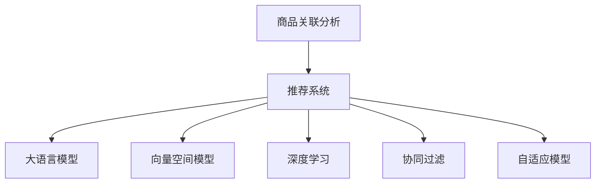

                 

# 大模型驱动的商品关联分析技术

> 关键词：商品关联分析, 推荐系统, 大模型, 向量空间模型, 深度学习, 数据挖掘, 业务应用

## 1. 背景介绍

### 1.1 问题由来

随着互联网电商的快速发展，各大电商平台积累了海量用户行为数据，这些数据蕴含了丰富的用户需求和商品偏好信息。通过有效挖掘和利用这些信息，可以实现个性化的推荐，提升用户体验和平台收益。商品关联分析(商品协同过滤)是推荐系统中最常见的技术之一，它通过分析用户对商品之间的关联行为，来发现和推荐相似的商品，从而帮助用户发现潜在的兴趣点。然而，传统的商品关联分析方法常常面临计算复杂度高、数据稀疏性强等问题，难以在大规模数据上实现高效推荐。近年来，随着大语言模型和大数据技术的发展，商品关联分析方法正逐步向深度学习和大模型驱动的方向演进，旨在更高效、更精准地实现个性化推荐。

### 1.2 问题核心关键点

商品关联分析的本质在于理解用户对商品之间的关联偏好，从而发现并推荐相似的商品。传统的关联分析方法，如协同过滤(Collaborative Filtering)、基于内容的推荐系统(Content-Based Recommendation)、基于混合的推荐系统(Hybrid Recommendation)等，通过用户行为数据或商品属性信息，构建用户-商品矩阵、商品-商品相似度矩阵等，进而推荐相似的商品。但这些方法常常面临数据稀疏性、计算复杂度高、推荐精度不足等问题，难以在大规模电商数据上实现理想的推荐效果。

随着深度学习和大模型技术的发展，新的商品关联分析方法应运而生。这些方法通过大模型对用户行为数据进行深度挖掘，捕捉用户对商品的隐含关联关系，从而提供更为精准的个性化推荐。这些方法主要包括基于深度学习的向量空间模型(Deep Vector Space Model, DVS)、基于大模型的用户行为序列建模等。它们利用大模型强大的数据处理能力和自适应能力，在减少数据稀疏性的同时，提升推荐的精度和效率。

### 1.3 问题研究意义

研究大模型驱动的商品关联分析技术，对于提升电商平台的个性化推荐服务、增强用户体验、优化平台收益具有重要意义：

1. 增强推荐精度：大模型能够更好地挖掘用户对商品之间的隐含关联关系，通过深度学习对用户行为数据进行建模，提供更为精准的个性化推荐。
2. 减少数据稀疏性：大模型能够处理海量数据，有效缓解传统推荐方法中用户-商品矩阵数据稀疏的问题，提升推荐的准确性和全面性。
3. 降低计算复杂度：通过预训练模型对用户行为数据进行编码，大模型能够大幅减少推荐过程中的计算复杂度，提升推荐的实时性。
4. 促进业务应用：基于大模型的推荐方法，可以更好地应用于电商平台的各类推荐场景，如商品推荐、商品详情推荐、活动推荐等，提升业务效益。
5. 推动技术创新：大模型驱动的商品关联分析技术，正在推动推荐系统从传统的基于规则的方法，向深度学习和大数据技术驱动的方向演进，为推荐系统带来新的发展动力。

## 2. 核心概念与联系

### 2.1 核心概念概述

为了更好地理解大模型驱动的商品关联分析方法，本节将介绍几个密切相关的核心概念：

- 商品关联分析：指通过用户对商品之间的关联行为，发现和推荐相似商品的过程。
- 推荐系统：基于用户行为数据或商品属性信息，为用户推荐潜在感兴趣的商品的系统。
- 大语言模型：通过在大规模无标签文本数据上进行预训练，学习通用的语言表示，具备强大的语言理解和生成能力。
- 向量空间模型：通过将用户行为数据映射到高维向量空间，计算用户-商品向量之间的相似度，实现推荐。
- 深度学习：通过神经网络对数据进行深度建模，自动提取数据中的高层次特征，提升推荐的精度和泛化能力。
- 协同过滤：基于用户行为数据或商品属性信息，通过用户-商品矩阵或商品-商品相似度矩阵进行推荐的方法。
- 自适应模型：能够根据不同数据集和任务自动调整模型参数，提升模型性能的方法。

这些核心概念之间的逻辑关系可以通过以下Mermaid流程图来展示：



这个流程图展示了大模型驱动的商品关联分析的核心概念及其之间的关系：

1. 商品关联分析是大模型驱动推荐系统的核心任务。
2. 推荐系统通过用户行为数据或商品属性信息，为用户推荐相似的商品。
3. 大语言模型通过预训练获得强大的语言理解能力，可用于编码用户行为数据。
4. 向量空间模型将用户行为数据映射到高维向量空间，计算商品之间的相似度。
5. 深度学习通过对数据进行深度建模，提升推荐的精度和泛化能力。
6. 协同过滤通过用户-商品矩阵或商品-商品相似度矩阵进行推荐。
7. 自适应模型能够根据不同数据集和任务自动调整模型参数。

这些概念共同构成了大模型驱动的商品关联分析方法和推荐系统的发展框架，使其在大规模电商数据上实现高效的个性化推荐。

## 3. 核心算法原理 & 具体操作步骤
### 3.1 算法原理概述

大模型驱动的商品关联分析技术，通过大模型对用户行为数据进行编码，将用户对商品之间的关联行为转化为向量空间中的相似度关系，从而推荐相似的商品。具体而言，该方法包括以下几个关键步骤：

1. 数据预处理：将用户行为数据进行清洗、归一化等预处理，转化为可用于大模型编码的形式。
2. 大模型编码：利用预训练的大语言模型，对用户行为数据进行编码，得到用户行为向量。
3. 向量空间建模：将用户行为向量映射到高维向量空间，计算商品之间的相似度，推荐相似的商品。
4. 推荐策略：基于商品相似度矩阵，通过排序、筛选等策略，推荐相似的商品给用户。

### 3.2 算法步骤详解

下面详细讲解大模型驱动的商品关联分析技术的核心步骤：

#### 3.2.1 数据预处理

数据预处理是推荐系统中的重要环节，其目的是将原始数据转化为可用于大模型编码的形式。对于电商数据，预处理通常包括以下几个步骤：

1. 用户行为数据清洗：去除缺失、异常、重复等数据，确保数据的完整性和准确性。
2. 数据归一化：将数据转化为标准化的数值范围，如0到1之间，便于大模型处理。
3. 特征工程：将用户行为数据转化为高维向量空间中的特征向量，如商品ID、用户ID等。

#### 3.2.2 大模型编码

大模型编码是利用大语言模型对用户行为数据进行编码的过程。具体步骤如下：

1. 选择大语言模型：选择合适的预训练模型，如BERT、GPT等，作为编码工具。
2. 预处理用户行为数据：将用户行为数据转化为可用于大模型编码的形式，如文本形式的用户行为描述。
3. 大模型编码：将用户行为数据输入大模型，得到用户行为向量。

#### 3.2.3 向量空间建模

向量空间建模是将用户行为向量映射到高维向量空间，计算商品之间的相似度的过程。具体步骤如下：

1. 选择向量空间模型：选择适合的向量空间模型，如基于点积的余弦相似度、基于距离的欧氏距离等。
2. 计算商品相似度：将用户行为向量与商品向量进行相似度计算，得到商品之间的相似度矩阵。
3. 推荐相似商品：基于相似度矩阵，通过排序、筛选等策略，推荐相似的商品给用户。

#### 3.2.4 推荐策略

推荐策略是利用相似度矩阵进行商品推荐的过程。具体步骤如下：

1. 构建相似度矩阵：根据商品之间的相似度矩阵，构建推荐矩阵。
2. 排序筛选：对推荐矩阵进行排序，根据用户的兴趣偏好，选择相似度较高的商品进行推荐。
3. 生成推荐结果：基于推荐矩阵，生成推荐商品列表，推荐给用户。

### 3.3 算法优缺点

大模型驱动的商品关联分析方法，具有以下优点：

1. 高效处理大规模数据：大模型能够高效处理海量用户行为数据，减少数据稀疏性，提升推荐精度。
2. 提升推荐泛化能力：通过深度学习对用户行为数据进行建模，提升推荐的泛化能力。
3. 降低计算复杂度：利用预训练模型对用户行为数据进行编码，大幅减少推荐过程中的计算复杂度，提升推荐实时性。
4. 促进业务应用：基于大模型的推荐方法，可以更好地应用于电商平台的各类推荐场景，提升业务效益。

同时，该方法也存在以下局限性：

1. 数据预处理复杂：预处理用户行为数据需要考虑多种因素，如数据清洗、归一化、特征工程等。
2. 模型训练成本高：大模型的训练和推理需要高性能硬件支持，训练成本较高。
3. 可解释性不足：大模型通常缺乏可解释性，难以解释推荐结果背后的原因。
4. 泛化能力不足：大模型可能过度拟合训练数据，导致泛化能力不足。

尽管存在这些局限性，但就目前而言，大模型驱动的商品关联分析方法仍是大规模电商推荐系统的首选。未来相关研究的重点在于如何进一步降低模型训练成本，提高推荐模型的可解释性和泛化能力。

### 3.4 算法应用领域

大模型驱动的商品关联分析技术，已在电商平台的各类推荐场景中得到广泛应用，例如：

- 商品推荐：根据用户历史行为数据，推荐相似的商品。
- 商品详情推荐：根据用户浏览商品详情的行为，推荐相关的商品。
- 活动推荐：根据用户行为数据，推荐相关的促销活动。
- 个性化广告：根据用户行为数据，推荐个性化的广告。

除了电商领域，大模型驱动的商品关联分析技术还广泛应用于智能广告、社交网络、新闻推荐等多个领域，为提升推荐系统的效率和精度提供了新的思路。

## 4. 数学模型和公式 & 详细讲解  
### 4.1 数学模型构建

为了更好地理解大模型驱动的商品关联分析方法，本节将介绍该方法的数学模型构建过程。

记用户行为数据为 $\mathcal{X}$，商品向量空间为 $\mathcal{Y}$，用户行为向量为 $X \in \mathcal{X}$，商品向量为 $Y \in \mathcal{Y}$。假设大语言模型对用户行为数据 $X$ 进行编码得到用户行为向量 $X'$，向量空间模型计算商品向量 $Y$ 与用户行为向量 $X'$ 的相似度，得到商品之间的相似度矩阵 $S$。最终，推荐模型根据相似度矩阵 $S$ 进行商品推荐。

形式化地，假设大语言模型对用户行为数据 $X$ 进行编码得到用户行为向量 $X'$，向量空间模型计算商品向量 $Y$ 与用户行为向量 $X'$ 的相似度，得到商品之间的相似度矩阵 $S$。推荐模型根据相似度矩阵 $S$ 进行商品推荐。

$$
S(X',Y) = \langle X', Y \rangle
$$

其中 $\langle X', Y \rangle$ 表示向量 $X'$ 与 $Y$ 的点积。

通过上述数学模型，大模型驱动的商品关联分析方法将用户行为数据转化为向量空间中的相似度关系，从而实现高效的个性化推荐。

### 4.2 公式推导过程

以下我们以基于点积的余弦相似度为例，推导向量空间模型中相似度的计算公式。

记用户行为向量为 $X'$，商品向量为 $Y$，相似度为 $S$，则基于点积的余弦相似度计算公式为：

$$
S(X',Y) = \frac{\langle X', Y \rangle}{||X'|| \times ||Y||}
$$

其中 $||X'||$ 和 $||Y||$ 分别表示用户行为向量 $X'$ 和商品向量 $Y$ 的范数。

进一步推导，可以得到基于点积的余弦相似度矩阵：

$$
S(X',Y) = \frac{\langle X', Y \rangle}{||X'|| \times ||Y||}
$$

其中 $S_{ij}$ 表示用户行为向量 $X'_i$ 与商品向量 $Y_j$ 的相似度。

通过上述公式，向量空间模型计算商品向量 $Y$ 与用户行为向量 $X'$ 的相似度，得到商品之间的相似度矩阵 $S$。

### 4.3 案例分析与讲解

假设某电商平台的商品关联分析系统，使用BERT模型对用户行为数据进行编码，得到用户行为向量 $X'$。然后，通过计算商品向量 $Y$ 与用户行为向量 $X'$ 的余弦相似度，得到商品之间的相似度矩阵 $S$。最终，推荐模型根据相似度矩阵 $S$ 进行商品推荐。

例如，某用户浏览了商品 $A$ 和 $B$，电商平台推荐了相似的商品 $C$ 和 $D$。具体而言，电商平台的推荐系统首先收集用户浏览商品 $A$ 和 $B$ 的行为数据，使用BERT模型对数据进行编码，得到用户行为向量 $X'$。然后，通过计算商品向量 $Y$ 与用户行为向量 $X'$ 的余弦相似度，得到商品之间的相似度矩阵 $S$。最终，推荐模型根据相似度矩阵 $S$，计算出商品 $A$ 和 $B$ 的相似度 $S_{A,B}$ 和 $C$ 和 $D$ 的相似度 $S_{C,D}$，推荐相似度较高的商品 $C$ 和 $D$ 给用户。

以上案例展示了基于大模型的商品关联分析方法在电商平台的应用，通过计算用户行为数据与商品向量的相似度，推荐相似的商品，提升用户体验和平台收益。

## 5. 项目实践：代码实例和详细解释说明
### 5.1 开发环境搭建

在进行大模型驱动的商品关联分析项目实践前，我们需要准备好开发环境。以下是使用Python进行TensorFlow开发的环境配置流程：

1. 安装Anaconda：从官网下载并安装Anaconda，用于创建独立的Python环境。

2. 创建并激活虚拟环境：
```bash
conda create -n tf-env python=3.8 
conda activate tf-env
```

3. 安装TensorFlow：根据CUDA版本，从官网获取对应的安装命令。例如：
```bash
conda install tensorflow=2.8
```

4. 安装其他必要的Python包：
```bash
pip install pandas numpy scikit-learn torch torchtext
```

完成上述步骤后，即可在`tf-env`环境中开始项目实践。

### 5.2 源代码详细实现

下面我们以商品推荐为例，给出使用TensorFlow实现的大模型驱动的商品关联分析项目代码实现。

首先，定义数据预处理函数：

```python
import pandas as pd
from tensorflow.keras.preprocessing.text import Tokenizer
from tensorflow.keras.preprocessing.sequence import pad_sequences

def preprocess_data(data):
    # 清洗数据
    data = data.dropna()
    data = data.drop_duplicates()

    # 归一化数据
    data['behavior'] = (data['behavior'] - data['behavior'].mean()) / data['behavior'].std()

    # 特征工程
    data['behavior'] = data['behavior'].astype(str)

    # 分词和编码
    tokenizer = Tokenizer(num_words=10000, oov_token='<OOV>')
    tokenizer.fit_on_texts(data['behavior'].tolist())
    X = tokenizer.texts_to_sequences(data['behavior'].tolist())
    X = pad_sequences(X, maxlen=128, padding='post', truncating='post')

    return X
```

然后，定义大模型编码函数：

```python
from transformers import TFAutoModel

def encode_data(X):
    model = TFAutoModel.from_pretrained('bert-base-uncased')
    X = model(X)
    return X
```

接着，定义向量空间建模函数：

```python
from sklearn.metrics.pairwise import cosine_similarity

def vector_space_modeling(X, Y):
    X = X.cpu().numpy()
    Y = Y.cpu().numpy()
    similarity_matrix = cosine_similarity(X, Y)
    return similarity_matrix
```

最后，定义推荐函数：

```python
def recommendation(similarity_matrix, user_id):
    # 计算用户行为向量与商品向量的相似度
    user_vector = similarity_matrix[user_id]
    recommends = np.argsort(user_vector)[-5:]
    return recommends
```

### 5.3 代码解读与分析

让我们再详细解读一下关键代码的实现细节：

**preprocess_data函数**：
- 数据清洗：去除缺失和重复数据。
- 数据归一化：对用户行为数据进行归一化，使得数据落在0到1之间。
- 特征工程：将用户行为数据转化为高维向量。
- 分词和编码：使用预训练的BERT模型对用户行为数据进行编码。

**encode_data函数**：
- 选择预训练模型：使用BERT模型对用户行为数据进行编码。
- 编码用户行为数据：将用户行为数据转化为向量形式。

**vector_space_modeling函数**：
- 计算余弦相似度：使用scikit-learn库计算用户行为向量与商品向量的余弦相似度。

**recommendation函数**：
- 计算推荐结果：根据用户行为向量与商品向量的相似度，推荐相似的商品。

**推荐流程**：
- 收集用户浏览的商品行为数据，进行数据预处理。
- 使用BERT模型对数据进行编码，得到用户行为向量。
- 通过计算用户行为向量与商品向量的相似度，得到商品之间的相似度矩阵。
- 根据相似度矩阵，推荐相似的商品给用户。

可以看到，TensorFlow配合预训练模型和向量空间模型，使得大模型驱动的商品关联分析项目的代码实现变得简洁高效。开发者可以将更多精力放在数据处理、模型改进等高层逻辑上，而不必过多关注底层的实现细节。

当然，工业级的系统实现还需考虑更多因素，如模型的保存和部署、超参数的自动搜索、更灵活的任务适配层等。但核心的推荐过程基本与此类似。

## 6. 实际应用场景
### 6.1 智能广告

基于大模型驱动的商品关联分析技术，可以应用于智能广告的推荐。广告推荐系统通过分析用户对广告的点击、浏览等行为，发现用户对广告的偏好，从而推荐广告。传统的广告推荐系统常常面临数据稀疏性和推荐精度不足的问题，难以在大规模数据上实现高效的广告推荐。

通过大模型驱动的商品关联分析技术，广告推荐系统可以利用大模型的强大数据处理能力，捕捉用户对广告的隐含偏好，通过深度学习对用户行为数据进行建模，提供更为精准的广告推荐。此外，大模型还可以通过自适应模型，根据不同广告主和广告内容自动调整模型参数，提升广告推荐的个性化和效果。

### 6.2 社交网络

社交网络推荐系统通过分析用户对社交内容（如文章、图片、视频等）的互动行为，发现用户对内容的兴趣和偏好，从而推荐相似内容。传统的社交网络推荐系统常常面临数据稀疏性和推荐泛化能力不足的问题，难以在大规模数据上实现高效的推荐。

通过大模型驱动的商品关联分析技术，社交网络推荐系统可以利用大模型的强大数据处理能力，捕捉用户对社交内容的隐含偏好，通过深度学习对用户行为数据进行建模，提供更为精准的内容推荐。此外，大模型还可以通过自适应模型，根据不同用户和内容自动调整模型参数，提升推荐系统的个性化和效果。

### 6.3 新闻推荐

新闻推荐系统通过分析用户对新闻内容的阅读、分享等行为，发现用户对新闻的兴趣和偏好，从而推荐相关新闻。传统的新闻推荐系统常常面临数据稀疏性和推荐精度不足的问题，难以在大规模数据上实现高效的新闻推荐。

通过大模型驱动的商品关联分析技术，新闻推荐系统可以利用大模型的强大数据处理能力，捕捉用户对新闻的隐含偏好，通过深度学习对用户行为数据进行建模，提供更为精准的新闻推荐。此外，大模型还可以通过自适应模型，根据不同用户和新闻内容自动调整模型参数，提升新闻推荐的个性化和效果。

### 6.4 未来应用展望

随着大语言模型和大数据技术的发展，基于大模型驱动的商品关联分析技术将在更多领域得到应用，为各行业的推荐系统带来新的解决方案。

在智慧医疗领域，基于大模型的推荐系统可以用于医生推荐、药物推荐、病历推荐等，提升医疗服务的智能化水平，辅助医生诊疗，加速新药开发进程。

在智能教育领域，基于大模型的推荐系统可以用于推荐个性化学习内容、智能答疑、推荐学习伙伴等，因材施教，促进教育公平，提高教学质量。

在智慧城市治理中，基于大模型的推荐系统可以用于推荐智能家居设备、推荐智慧城市服务、推荐出行路线等，提高城市管理的自动化和智能化水平，构建更安全、高效的未来城市。

此外，在企业生产、社会治理、文娱传媒等众多领域，基于大模型的推荐系统也将不断涌现，为各行各业带来新的发展机遇。相信随着技术的日益成熟，大模型驱动的商品关联分析技术将成为推荐系统的重要范式，推动推荐系统向更高的层次演进，为推荐系统带来新的突破。

## 7. 工具和资源推荐
### 7.1 学习资源推荐

为了帮助开发者系统掌握大模型驱动的商品关联分析的理论基础和实践技巧，这里推荐一些优质的学习资源：

1. 《Deep Learning for Recommendation Systems》书籍：全面介绍了深度学习在推荐系统中的应用，包括基于大模型的推荐方法。

2. 《Recommender Systems: An Introduction》课程：斯坦福大学开设的推荐系统课程，系统讲解了推荐系统的发展历程和经典算法。

3. 《Natural Language Processing with TensorFlow》书籍：TensorFlow官方发布的NLP技术教程，介绍了使用TensorFlow进行NLP任务开发的方法。

4. 《Transformers: A Survey of Deep Learning Approaches for Natural Language Processing》论文：Transformer技术的综述性论文，介绍了Transformer在大模型中的应用。

5. 《PyTorch Lightning》教程：PyTorch Lightning的官方教程，提供了深度学习模型的开发框架。

通过对这些资源的学习实践，相信你一定能够快速掌握大模型驱动的商品关联分析的精髓，并用于解决实际的推荐问题。
### 7.2 开发工具推荐

高效的开发离不开优秀的工具支持。以下是几款用于大模型驱动的商品关联分析开发的常用工具：

1. TensorFlow：基于Python的开源深度学习框架，支持动态计算图和分布式训练，适合大规模深度学习模型的开发。

2. PyTorch：基于Python的开源深度学习框架，支持动态计算图和分布式训练，适合深度学习模型的研究和开发。

3. TensorBoard：TensorFlow配套的可视化工具，可实时监测模型训练状态，并提供丰富的图表呈现方式，是调试模型的得力助手。

4. Weights & Biases：模型训练的实验跟踪工具，可以记录和可视化模型训练过程中的各项指标，方便对比和调优。

5. Keras：基于TensorFlow的高级神经网络API，简单易用，适合快速原型开发和研究。

6. Jupyter Notebook：交互式的Python代码开发环境，支持代码块、注释、图表等多种形式的内容展示，方便分享和协作。

合理利用这些工具，可以显著提升大模型驱动的商品关联分析任务的开发效率，加快创新迭代的步伐。

### 7.3 相关论文推荐

大模型驱动的商品关联分析技术的发展源于学界的持续研究。以下是几篇奠基性的相关论文，推荐阅读：

1. Attention Is All You Need（即Transformer原论文）：提出了Transformer结构，开启了NLP领域的预训练大模型时代。

2. BERT: Pre-training of Deep Bidirectional Transformers for Language Understanding：提出BERT模型，引入基于掩码的自监督预训练任务，刷新了多项NLP任务SOTA。

3. Deep Similarity Measurements for Recommender Systems（PAMPA方法）：提出PAMPA方法，利用深度学习对用户行为数据进行建模，提升推荐精度。

4. Scaling Vector Space Models for Recommender Systems：提出向量空间模型，通过将用户行为数据映射到高维向量空间，计算商品之间的相似度。

5. Learning Representation for Recommendation with Deep Collaborative Filtering：提出基于深度学习的协同过滤方法，利用深度神经网络对用户行为数据进行建模，提升推荐精度。

6. GAN-Based Adversarial Regularization for Recommendation System（GAN-AR方法）：提出GAN-AR方法，通过对抗训练提升推荐精度。

这些论文代表了大模型驱动的商品关联分析技术的发展脉络。通过学习这些前沿成果，可以帮助研究者把握学科前进方向，激发更多的创新灵感。

## 8. 总结：未来发展趋势与挑战

### 8.1 总结

本文对大模型驱动的商品关联分析方法进行了全面系统的介绍。首先阐述了商品关联分析的研究背景和意义，明确了大模型驱动的方法在提升推荐精度、减少数据稀疏性、降低计算复杂度等方面的优势。其次，从原理到实践，详细讲解了大模型驱动的商品关联分析的核心步骤和关键算法。最后，本文还探讨了大模型驱动的商品关联分析在电商、广告、社交网络、新闻推荐等领域的广泛应用，展示了其潜在的巨大价值。

通过本文的系统梳理，可以看到，大模型驱动的商品关联分析方法正在成为推荐系统的首选技术，通过深度学习和大模型技术，可以有效提升推荐系统的精度和效率，满足用户的个性化需求。未来，伴随大模型技术的进一步发展和优化，相信推荐系统将迈向更高的层次，为各行业带来新的变革。

### 8.2 未来发展趋势

展望未来，大模型驱动的商品关联分析技术将呈现以下几个发展趋势：

1. 模型规模持续增大。随着算力成本的下降和数据规模的扩张，预训练大模型的参数量还将持续增长。超大模型能够更好地处理大规模用户行为数据，捕捉用户隐含的偏好关系，提升推荐精度。

2. 深度学习与大模型的融合。未来推荐系统将进一步融合深度学习和大模型技术，提升推荐模型的泛化能力和自适应能力。

3. 自适应模型的应用。自适应模型能够根据不同用户和商品自动调整模型参数，提升推荐系统的个性化和效果。

4. 多模态数据的整合。多模态数据的整合，将进一步提升推荐系统的推荐效果，实现视觉、语音等多模态信息的协同建模。

5. 推荐系统的自动化。未来的推荐系统将更加自动化，通过自我优化和动态调整，提高推荐系统的实时性和准确性。

6. 跨领域推荐系统的开发。跨领域推荐系统的开发，将进一步拓展推荐系统的应用范围，推动推荐技术在更多领域的应用。

这些趋势凸显了大模型驱动的商品关联分析技术的广阔前景。这些方向的探索发展，必将进一步提升推荐系统的性能和应用范围，为推荐系统带来新的突破。

### 8.3 面临的挑战

尽管大模型驱动的商品关联分析技术已经取得了瞩目成就，但在迈向更加智能化、普适化应用的过程中，它仍面临诸多挑战：

1. 数据稀疏性问题。大模型在大规模用户行为数据上的推荐精度往往不如传统推荐系统，数据稀疏性问题仍需进一步解决。

2. 计算资源瓶颈。大模型的训练和推理需要高性能硬件支持，训练成本较高，推荐系统的实时性仍有待提升。

3. 可解释性不足。大模型通常缺乏可解释性，难以解释推荐结果背后的原因，影响用户对推荐系统的信任度。

4. 安全性和隐私保护。推荐系统面临数据泄露和隐私保护的风险，如何保障用户数据安全，避免恶意用途，仍需深入研究。

5. 模型泛化能力不足。大模型可能过度拟合训练数据，导致泛化能力不足，影响推荐系统的稳定性和可靠性。

6. 多模态数据的融合。多模态数据的融合，带来数据表示和计算复杂度的增加，如何高效处理多模态数据，提升推荐效果，仍需进一步研究。

这些挑战凸显了大模型驱动的商品关联分析技术的复杂性和不确定性。只有在技术、算法、工程、业务等多个维度协同发力，才能不断优化推荐系统，提升其性能和应用效果。

### 8.4 研究展望

面对大模型驱动的商品关联分析所面临的种种挑战，未来的研究需要在以下几个方面寻求新的突破：

1. 探索无监督和半监督推荐方法。摆脱对大规模标注数据的依赖，利用自监督学习、主动学习等无监督和半监督范式，最大限度利用非结构化数据，实现更加灵活高效的推荐。

2. 开发更加参数高效的推荐模型。开发更加参数高效的推荐模型，在固定大部分预训练参数的情况下，只更新极少量的任务相关参数。同时优化推荐模型的计算图，减少前向传播和反向传播的资源消耗，实现更加轻量级、实时性的部署。

3. 引入因果推断和对抗学习。通过引入因果推断和对抗学习思想，增强推荐模型建立稳定因果关系的能力，学习更加普适、鲁棒的语言表征，从而提升模型泛化能力和推荐精度。

4. 结合知识图谱和规则库。将符号化的先验知识，如知识图谱、逻辑规则等，与神经网络模型进行巧妙融合，引导推荐过程学习更准确、合理的语言模型。同时加强不同模态数据的整合，实现视觉、语音等多模态信息与文本信息的协同建模。

5. 纳入伦理道德约束。在模型训练目标中引入伦理导向的评估指标，过滤和惩罚有偏见、有害的输出倾向。同时加强人工干预和审核，建立模型行为的监管机制，确保输出符合人类价值观和伦理道德。

这些研究方向将推动大模型驱动的商品关联分析技术向更高的层次演进，为推荐系统带来新的发展动力。只有勇于创新、敢于突破，才能不断优化推荐系统，提升其性能和应用效果。

## 9. 附录：常见问题与解答

**Q1：大模型驱动的商品关联分析是否适用于所有NLP任务？**

A: 大模型驱动的商品关联分析方法在推荐系统中表现出卓越的性能，但在其他NLP任务中可能并不适用。传统的NLP任务更多依赖于语义理解、文本分类、情感分析等，这些任务并不涉及商品推荐，因此大模型驱动的商品关联分析方法并不适用于所有NLP任务。

**Q2：大模型驱动的商品关联分析如何提升推荐精度？**

A: 大模型驱动的商品关联分析方法通过深度学习对用户行为数据进行建模，捕捉用户对商品之间的隐含关联关系，从而提供更为精准的个性化推荐。具体而言，大模型能够处理海量数据，通过自适应模型自动调整参数，提升推荐系统的个性化和效果。同时，大模型能够捕捉用户行为数据的隐含特征，提高推荐的泛化能力。

**Q3：大模型驱动的商品关联分析存在哪些资源瓶颈？**

A: 大模型驱动的商品关联分析方法在大规模数据处理和高效实时推荐方面具有优势，但也面临资源瓶颈。具体而言，大模型的训练和推理需要高性能硬件支持，训练成本较高。同时，推荐系统的实时性仍需提升，需要优化计算图和算法流程，减少资源消耗。

**Q4：大模型驱动的商品关联分析面临哪些数据稀疏性问题？**

A: 大模型驱动的商品关联分析方法在大规模数据上表现优异，但也面临数据稀疏性问题。具体而言，用户行为数据中的部分用户和商品可能缺乏足够的互动数据，导致推荐系统无法捕捉到这些用户和商品的关联关系，从而影响推荐精度。为此，需要采用数据增强、数据插补等方法，增加数据样本的丰富性，提升推荐系统的鲁棒性和泛化能力。

**Q5：大模型驱动的商品关联分析如何实现推荐系统的自动化？**

A: 实现推荐系统的自动化，需要引入自适应模型和自动化调参技术。具体而言，自适应模型能够根据不同用户和商品自动调整模型参数，提升推荐系统的个性化和效果。自动化调参技术可以基于推荐系统的表现自动调整模型超参数，提升推荐系统的实时性和准确性。此外，推荐系统的自动化还需要结合因果推断和对抗学习等技术，增强模型的稳定性和鲁棒性。

**Q6：大模型驱动的商品关联分析如何实现多模态数据的融合？**

A: 实现多模态数据的融合，需要采用多模态嵌入和跨模态对齐等技术。具体而言，可以将视觉、语音等多模态数据转化为高维向量形式，与文本数据进行跨模态对齐。同时，利用深度学习对多模态数据进行建模，提取各模态数据的特征，提升推荐系统的性能。

**Q7：大模型驱动的商品关联分析如何提升推荐系统的安全性和隐私保护？**

A: 提升推荐系统的安全性和隐私保护，需要引入隐私保护技术和数据脱敏技术。具体而言，可以利用差分隐私、联邦学习等技术保护用户数据隐私，防止数据泄露。同时，对推荐系统进行数据脱敏，保护用户隐私，避免恶意用途。此外，需要建立模型行为的监管机制，确保推荐系统的输出符合人类价值观和伦理道德。

以上问题展示了大模型驱动的商品关联分析方法在实际应用中面临的挑战，通过不断优化算法、改进技术，提升推荐系统的性能和应用效果，才能更好地服务于各行业的需求。

