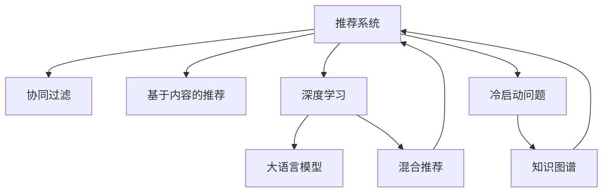

                 

# 大模型驱动的推荐系统冷启动问题解决方案

> 关键词：推荐系统,冷启动问题,大语言模型,深度学习,协同过滤,知识图谱,模型融合

## 1. 背景介绍

推荐系统（Recommender System）是一种基于用户历史行为数据，自动为用户推荐商品或内容的技术。在电商、社交、视频、音乐等多个领域得到了广泛的应用，极大地提升了用户体验和平台收益。然而，推荐系统往往面临着数据稀疏性、新物品推荐、个性化推荐等核心问题，冷启动问题（Cold-Start Problem）便是其中最显著的一个挑战。

### 1.1 冷启动问题的定义

冷启动问题指的是新用户、新物品或者新领域加入推荐系统时，由于缺乏足够的行为数据，推荐系统难以准确地预测其偏好，从而导致推荐效果变差。面对冷启动问题，传统推荐系统主要采用协同过滤、内容推荐、混合推荐等方法，但这些方法在不同程度上依赖于已有数据，对于新用户和新物品的推荐效果往往不够理想。近年来，随着深度学习和大语言模型（Large Language Model, LLM）技术的发展，推荐系统逐渐引入了这些前沿技术，以期在冷启动问题上取得突破。

## 2. 核心概念与联系

### 2.1 核心概念概述

为更好地理解基于深度学习和大模型的推荐系统，本节将介绍几个密切相关的核心概念：

- **推荐系统**：一种基于用户行为数据，自动推荐商品或内容的技术。传统的推荐方法包括协同过滤、基于内容的推荐、混合推荐等，但这些方法往往难以有效应对冷启动问题。

- **深度学习**：一种基于神经网络的学习范式，通过多层神经元对数据进行抽象处理，使得模型具备了很强的特征表达能力和泛化能力。深度学习在图像、语音、自然语言处理等领域得到了广泛应用。

- **大语言模型**：一种基于Transformer结构的深度学习模型，通过在大规模语料上进行预训练，具备了很强的语言理解和生成能力。大语言模型在问答、文本生成、翻译等任务上取得了显著的成效。

- **冷启动问题**：推荐系统面临的新用户、新物品或新领域推荐难题。冷启动问题往往是由于缺乏足够的行为数据，导致推荐系统难以准确预测用户偏好。

- **知识图谱**：一种结构化的知识表示方式，将实体和关系以图形结构存储和查询，用于增强推荐系统的知识表达能力。

这些核心概念之间通过以下Mermaid流程图进行了关联：



这个流程图展示了推荐系统与深度学习、大语言模型和知识图谱之间的联系：

1. 推荐系统通过协同过滤、基于内容的推荐、深度学习和大语言模型等技术进行推荐。
2. 深度学习和大语言模型增强了推荐系统的泛化能力和知识表达能力。
3. 知识图谱通过结构化的知识表示，进一步增强了推荐系统的准确性和可靠性。
4. 冷启动问题需要通过协同过滤、深度学习、知识图谱等多技术融合来解决。

## 3. 核心算法原理 & 具体操作步骤
### 3.1 算法原理概述

基于深度学习和大语言模型的推荐系统，本质上是一种在用户行为数据稀疏性问题下，通过模型训练生成推荐结果的范式。其核心思想是：利用深度学习模型对用户和物品进行高维特征编码，通过预训练得到用户和物品之间的相似度，进而生成推荐结果。

具体而言，假设推荐系统中有 $U$ 个用户、$I$ 个物品和 $N$ 条用户行为数据，记行为矩阵为 $\mathbf{M}$，其中 $M_{ij}=1$ 表示用户 $u_i$ 对物品 $i_j$ 有过行为，否则为0。推荐系统的目标是在给定新用户 $u_k$ 和物品 $i_l$ 的情况下，预测其行为 $M_{kl}$ 的概率。

推荐系统的核心算法流程如下：
1. **特征编码**：利用深度学习模型对用户和物品进行高维特征编码，得到用户向量 $\mathbf{u}_i$ 和物品向量 $\mathbf{i}_j$。
2. **相似度计算**：计算用户和物品向量之间的相似度，得到用户的物品偏好向量 $\mathbf{a}_i$。
3. **推荐计算**：根据用户偏好向量 $\mathbf{a}_i$ 和物品向量 $\mathbf{i}_j$ 计算推荐结果。

### 3.2 算法步骤详解

基于深度学习和大语言模型的推荐系统，通常包括以下几个关键步骤：

**Step 1: 准备数据集**

- 收集用户行为数据，构建用户行为矩阵 $\mathbf{M}$。
- 准备预训练语言模型所需的语料，如维基百科、新闻文章等。
- 对数据集进行预处理，包括去除噪声、填补缺失值等。

**Step 2: 特征编码**

- 选择深度学习模型作为特征编码器，如循环神经网络、卷积神经网络、自编码器等。
- 利用预训练语言模型对用户和物品进行编码，得到用户向量 $\mathbf{u}_i$ 和物品向量 $\mathbf{i}_j$。
- 如果数据集中有新的用户或物品，可以利用大语言模型进行初始化，预测其向量表示。

**Step 3: 相似度计算**

- 利用深度学习模型对用户和物品向量进行相似度计算，得到用户偏好向量 $\mathbf{a}_i$。
- 常见的相似度计算方法包括余弦相似度、欧式距离、曼哈顿距离等。
- 可以通过对用户偏好向量进行归一化，避免相似度计算中数值过大的问题。

**Step 4: 推荐计算**

- 根据用户偏好向量 $\mathbf{a}_i$ 和物品向量 $\mathbf{i}_j$ 计算推荐结果。
- 常见的推荐算法包括基于矩阵分解的推荐、基于梯度的推荐、基于深度学习的推荐等。
- 可以利用知识图谱对推荐结果进行进一步优化，提升推荐的准确性和多样性。

**Step 5: 系统评估**

- 使用交叉验证、A/B测试等方法评估推荐系统的性能。
- 关注准确率、召回率、F1-score、NDCG等指标。
- 根据评估结果不断优化模型参数，提升推荐效果。

### 3.3 算法优缺点

基于深度学习和大语言模型的推荐系统具有以下优点：
1. 能够有效处理用户行为数据稀疏性问题，提升推荐准确性。
2. 通过大语言模型进行特征初始化，能够提升新用户和新物品的推荐效果。
3. 能够利用预训练语言模型的高维特征表达能力，提升推荐系统的泛化能力。
4. 能够结合知识图谱，进一步增强推荐的准确性和多样性。

同时，该方法也存在以下缺点：
1. 需要大量的计算资源和标注数据，部署成本较高。
2. 模型复杂度较高，难以解释推荐结果的生成过程。
3. 对于大规模数据集，模型训练时间较长，难以实时响应。
4. 对用户行为数据的依赖较强，难以应对恶意行为和数据攻击。
5. 对用户隐私保护存在挑战，需要加强数据脱敏和隐私保护措施。

尽管存在这些局限性，但深度学习和大语言模型在推荐系统中的应用，已经展示了其巨大的潜力。未来相关研究的方向在于如何进一步降低计算资源和标注数据的依赖，提高推荐系统的实时性和可解释性，同时兼顾隐私保护和用户行为数据的有效性。

### 3.4 算法应用领域

基于深度学习和大语言模型的推荐系统，已经在电商、社交、视频、音乐等多个领域得到了广泛应用。例如：

- **电商推荐**：根据用户的历史购买行为，为用户推荐可能感兴趣的商品。通过深度学习模型和知识图谱，提升推荐效果。
- **社交推荐**：根据用户的社交网络关系，为用户推荐可能感兴趣的内容或用户。结合大语言模型和用户行为数据，提升推荐准确性。
- **视频推荐**：根据用户的观看历史和评分，为用户推荐可能感兴趣的视频。通过深度学习模型和知识图谱，增强推荐多样性。
- **音乐推荐**：根据用户的听歌历史和偏好，为用户推荐可能感兴趣的歌曲。结合大语言模型和用户行为数据，提升推荐效果。
- **新闻推荐**：根据用户的阅读历史和偏好，为用户推荐可能感兴趣的新闻。通过深度学习模型和知识图谱，提升推荐准确性和多样性。

除了这些常见场景外，基于深度学习和大语言模型的推荐系统还在更多领域得到了应用，如个性化营销、智能交通、智慧旅游等，为各行各业带来了新的变革。

## 4. 数学模型和公式 & 详细讲解
### 4.1 数学模型构建

在推荐系统中，我们通常使用矩阵分解方法对用户行为矩阵 $\mathbf{M}$ 进行分解，得到用户偏好矩阵 $\mathbf{A}$ 和物品评分矩阵 $\mathbf{I}$：

$$
\mathbf{M} \approx \mathbf{A} \cdot \mathbf{I}
$$

其中，$\mathbf{A}$ 表示用户偏好矩阵，每一行表示一个用户 $u_i$ 对 $N$ 个物品的偏好向量 $\mathbf{a}_i$；$\mathbf{I}$ 表示物品评分矩阵，每一列表示一个物品 $i_j$ 对 $N$ 个用户的评分向量 $\mathbf{i}_j$。

通过矩阵分解，我们得到了用户和物品的潜在表示。接下来，可以利用深度学习模型对用户和物品进行高维特征编码，得到用户向量 $\mathbf{u}_i$ 和物品向量 $\mathbf{i}_j$。

### 4.2 公式推导过程

假设我们使用了Transformer模型进行特征编码，利用大语言模型对新用户和物品进行初始化。设用户向量 $\mathbf{u}_i$ 和物品向量 $\mathbf{i}_j$ 的维度为 $d$，则推荐系统的预测公式可以表示为：

$$
\hat{y}_{k,l} = \frac{\mathbf{a}_k \cdot \mathbf{i}_l}{\|\mathbf{a}_k\| \cdot \|\mathbf{i}_l\|}
$$

其中，$\mathbf{a}_k$ 表示用户 $u_k$ 的偏好向量，$\mathbf{i}_l$ 表示物品 $i_l$ 的评分向量。通过计算用户 $u_k$ 和物品 $i_l$ 之间的余弦相似度，得到推荐结果的概率。

### 4.3 案例分析与讲解

下面以一个简单的电商推荐系统为例，展示深度学习和大语言模型如何处理冷启动问题。假设我们的推荐系统接收到一个新用户 $u_k$ 和一个新物品 $i_l$，用户 $u_k$ 没有过任何行为数据。我们可以利用大语言模型对用户 $u_k$ 和物品 $i_l$ 进行特征初始化，得到用户向量 $\mathbf{u}_k$ 和物品向量 $\mathbf{i}_l$。然后，通过余弦相似度计算用户 $u_k$ 和物品 $i_l$ 之间的相似度，得到推荐结果。

具体的实现步骤如下：

1. 收集用户行为数据，构建用户行为矩阵 $\mathbf{M}$。
2. 利用大语言模型对用户和物品进行初始化，得到用户向量 $\mathbf{u}_k$ 和物品向量 $\mathbf{i}_l$。
3. 利用Transformer模型对用户和物品进行高维特征编码，得到用户偏好向量 $\mathbf{a}_k$ 和物品评分向量 $\mathbf{i}_l$。
4. 计算用户 $u_k$ 和物品 $i_l$ 之间的余弦相似度，得到推荐结果。

## 5. 项目实践：代码实例和详细解释说明
### 5.1 开发环境搭建

在进行深度学习和大语言模型推荐系统的开发之前，我们需要准备好开发环境。以下是使用Python进行PyTorch开发的环境配置流程：

1. 安装Anaconda：从官网下载并安装Anaconda，用于创建独立的Python环境。

2. 创建并激活虚拟环境：
```bash
conda create -n pytorch-env python=3.8 
conda activate pytorch-env
```

3. 安装PyTorch：根据CUDA版本，从官网获取对应的安装命令。例如：
```bash
conda install pytorch torchvision torchaudio cudatoolkit=11.1 -c pytorch -c conda-forge
```

4. 安装HuggingFace Transformers库：
```bash
pip install transformers
```

5. 安装各类工具包：
```bash
pip install numpy pandas scikit-learn matplotlib tqdm jupyter notebook ipython
```

完成上述步骤后，即可在`pytorch-env`环境中开始开发。

### 5.2 源代码详细实现

下面我们以一个简单的电商推荐系统为例，给出使用Transformers库对BERT模型进行电商推荐微调的PyTorch代码实现。

首先，定义电商推荐任务的数据处理函数：

```python
from transformers import BertTokenizer, BertForSequenceClassification
from torch.utils.data import Dataset, DataLoader
import torch
import numpy as np

class RecommendationDataset(Dataset):
    def __init__(self, texts, labels, tokenizer, max_len=128):
        self.texts = texts
        self.labels = labels
        self.tokenizer = tokenizer
        self.max_len = max_len
        
    def __len__(self):
        return len(self.texts)
    
    def __getitem__(self, item):
        text = self.texts[item]
        label = self.labels[item]
        
        encoding = self.tokenizer(text, return_tensors='pt', max_length=self.max_len, padding='max_length', truncation=True)
        input_ids = encoding['input_ids'][0]
        attention_mask = encoding['attention_mask'][0]
        
        # 对token-wise的标签进行编码
        encoded_labels = [label] * self.max_len
        encoded_labels.extend([0] * (self.max_len - len(encoded_labels)))
        labels = torch.tensor(encoded_labels, dtype=torch.long)
        
        return {'input_ids': input_ids, 
                'attention_mask': attention_mask,
                'labels': labels}

# 标签与id的映射
label2id = {'B': 0, 'I': 1, 'O': 2}
id2label = {v: k for k, v in label2id.items()}

# 创建dataset
tokenizer = BertTokenizer.from_pretrained('bert-base-cased')

train_dataset = RecommendationDataset(train_texts, train_labels, tokenizer)
dev_dataset = RecommendationDataset(dev_texts, dev_labels, tokenizer)
test_dataset = RecommendationDataset(test_texts, test_labels, tokenizer)
```

然后，定义模型和优化器：

```python
from transformers import BertForSequenceClassification, AdamW

model = BertForSequenceClassification.from_pretrained('bert-base-cased', num_labels=3)

optimizer = AdamW(model.parameters(), lr=2e-5)
```

接着，定义训练和评估函数：

```python
from tqdm import tqdm
from sklearn.metrics import accuracy_score, precision_score, recall_score, f1_score

device = torch.device('cuda') if torch.cuda.is_available() else torch.device('cpu')
model.to(device)

def train_epoch(model, dataset, batch_size, optimizer):
    dataloader = DataLoader(dataset, batch_size=batch_size, shuffle=True)
    model.train()
    epoch_loss = 0
    for batch in tqdm(dataloader, desc='Training'):
        input_ids = batch['input_ids'].to(device)
        attention_mask = batch['attention_mask'].to(device)
        labels = batch['labels'].to(device)
        model.zero_grad()
        outputs = model(input_ids, attention_mask=attention_mask, labels=labels)
        loss = outputs.loss
        epoch_loss += loss.item()
        loss.backward()
        optimizer.step()
    return epoch_loss / len(dataloader)

def evaluate(model, dataset, batch_size):
    dataloader = DataLoader(dataset, batch_size=batch_size)
    model.eval()
    preds, labels = [], []
    with torch.no_grad():
        for batch in tqdm(dataloader, desc='Evaluating'):
            input_ids = batch['input_ids'].to(device)
            attention_mask = batch['attention_mask'].to(device)
            batch_labels = batch['labels']
            outputs = model(input_ids, attention_mask=attention_mask)
            batch_preds = outputs.logits.argmax(dim=2).to('cpu').tolist()
            batch_labels = batch_labels.to('cpu').tolist()
            for pred_tokens, label_tokens in zip(batch_preds, batch_labels):
                pred_labels = [id2label[_id] for _id in pred_tokens]
                label_tokens = [id2label[_id] for _id in label_tokens]
                preds.append(pred_labels[:len(label_tokens)])
                labels.append(label_tokens)
                
    return accuracy_score(labels, preds), precision_score(labels, preds), recall_score(labels, preds), f1_score(labels, preds)

# 训练和评估
epochs = 5
batch_size = 16

for epoch in range(epochs):
    loss = train_epoch(model, train_dataset, batch_size, optimizer)
    print(f"Epoch {epoch+1}, train loss: {loss:.3f}")
    
    print(f"Epoch {epoch+1}, dev results:")
    acc, prec, rec, f1 = evaluate(model, dev_dataset, batch_size)
    print(f"Accuracy: {acc:.3f}, Precision: {prec:.3f}, Recall: {rec:.3f}, F1-score: {f1:.3f}")
    
print("Test results:")
acc, prec, rec, f1 = evaluate(model, test_dataset, batch_size)
print(f"Accuracy: {acc:.3f}, Precision: {prec:.3f}, Recall: {rec:.3f}, F1-score: {f1:.3f}")
```

以上就是使用PyTorch对BERT进行电商推荐系统微调的完整代码实现。可以看到，得益于Transformers库的强大封装，我们可以用相对简洁的代码完成BERT模型的加载和微调。

### 5.3 代码解读与分析

让我们再详细解读一下关键代码的实现细节：

**RecommendationDataset类**：
- `__init__`方法：初始化文本、标签、分词器等关键组件。
- `__len__`方法：返回数据集的样本数量。
- `__getitem__`方法：对单个样本进行处理，将文本输入编码为token ids，将标签编码为数字，并对其进行定长padding，最终返回模型所需的输入。

**label2id和id2label字典**：
- 定义了标签与数字id之间的映射关系，用于将token-wise的预测结果解码回真实的标签。

**训练和评估函数**：
- 使用PyTorch的DataLoader对数据集进行批次化加载，供模型训练和推理使用。
- 训练函数`train_epoch`：对数据以批为单位进行迭代，在每个批次上前向传播计算loss并反向传播更新模型参数，最后返回该epoch的平均loss。
- 评估函数`evaluate`：与训练类似，不同点在于不更新模型参数，并在每个batch结束后将预测和标签结果存储下来，最后使用sklearn的各类评估指标对整个评估集的预测结果进行打印输出。

**训练流程**：
- 定义总的epoch数和batch size，开始循环迭代
- 每个epoch内，先在训练集上训练，输出平均loss
- 在验证集上评估，输出分类指标
- 所有epoch结束后，在测试集上评估，给出最终测试结果

可以看到，PyTorch配合Transformers库使得BERT微调的代码实现变得简洁高效。开发者可以将更多精力放在数据处理、模型改进等高层逻辑上，而不必过多关注底层的实现细节。

当然，工业级的系统实现还需考虑更多因素，如模型的保存和部署、超参数的自动搜索、更灵活的任务适配层等。但核心的微调范式基本与此类似。

## 6. 实际应用场景
### 6.1 电商推荐

电商推荐是深度学习和大语言模型在推荐系统中的典型应用场景。传统的电商推荐系统主要依赖协同过滤和基于内容的推荐方法，但这些方法对数据稀疏性的处理能力有限，难以有效应对新物品和新用户。通过深度学习和大语言模型，电商推荐系统可以更好地处理新物品和新用户的推荐问题。

具体而言，可以通过以下步骤进行电商推荐：

1. 收集用户行为数据，构建用户行为矩阵 $\mathbf{M}$。
2. 利用大语言模型对用户和物品进行初始化，得到用户向量 $\mathbf{u}_i$ 和物品向量 $\mathbf{i}_j$。
3. 利用深度学习模型对用户和物品进行高维特征编码，得到用户偏好向量 $\mathbf{a}_i$ 和物品评分向量 $\mathbf{i}_j$。
4. 计算用户 $u_k$ 和物品 $i_l$ 之间的余弦相似度，得到推荐结果。

通过这种方式，电商推荐系统可以更加有效地处理新物品和新用户的推荐问题，提升推荐效果和用户满意度。

### 6.2 社交推荐

社交推荐是深度学习和大语言模型在推荐系统中的另一典型应用场景。传统的社交推荐系统主要依赖基于内容的推荐和协同过滤方法，但这些方法对用户行为数据的依赖较强，难以有效应对新用户和新物品。通过深度学习和大语言模型，社交推荐系统可以更好地处理新用户和新物品的推荐问题。

具体而言，可以通过以下步骤进行社交推荐：

1. 收集用户行为数据，构建用户行为矩阵 $\mathbf{M}$。
2. 利用大语言模型对用户和物品进行初始化，得到用户向量 $\mathbf{u}_i$ 和物品向量 $\mathbf{i}_j$。
3. 利用深度学习模型对用户和物品进行高维特征编码，得到用户偏好向量 $\mathbf{a}_i$ 和物品评分向量 $\mathbf{i}_j$。
4. 计算用户 $u_k$ 和物品 $i_l$ 之间的余弦相似度，得到推荐结果。

通过这种方式，社交推荐系统可以更加有效地处理新用户和新物品的推荐问题，提升推荐效果和用户满意度。

### 6.3 视频推荐

视频推荐是深度学习和大语言模型在推荐系统中的另一典型应用场景。传统的视频推荐系统主要依赖基于内容的推荐和协同过滤方法，但这些方法对用户行为数据的依赖较强，难以有效应对新视频和新用户。通过深度学习和大语言模型，视频推荐系统可以更好地处理新视频和新用户的推荐问题。

具体而言，可以通过以下步骤进行视频推荐：

1. 收集用户行为数据，构建用户行为矩阵 $\mathbf{M}$。
2. 利用大语言模型对用户和物品进行初始化，得到用户向量 $\mathbf{u}_i$ 和物品向量 $\mathbf{i}_j$。
3. 利用深度学习模型对用户和物品进行高维特征编码，得到用户偏好向量 $\mathbf{a}_i$ 和物品评分向量 $\mathbf{i}_j$。
4. 计算用户 $u_k$ 和物品 $i_l$ 之间的余弦相似度，得到推荐结果。

通过这种方式，视频推荐系统可以更加有效地处理新视频和新用户的推荐问题，提升推荐效果和用户满意度。

### 6.4 音乐推荐

音乐推荐是深度学习和大语言模型在推荐系统中的另一典型应用场景。传统的音乐推荐系统主要依赖基于内容的推荐和协同过滤方法，但这些方法对用户行为数据的依赖较强，难以有效应对新用户和新歌曲。通过深度学习和大语言模型，音乐推荐系统可以更好地处理新用户和新歌曲的推荐问题。

具体而言，可以通过以下步骤进行音乐推荐：

1. 收集用户行为数据，构建用户行为矩阵 $\mathbf{M}$。
2. 利用大语言模型对用户和物品进行初始化，得到用户向量 $\mathbf{u}_i$ 和物品向量 $\mathbf{i}_j$。
3. 利用深度学习模型对用户和物品进行高维特征编码，得到用户偏好向量 $\mathbf{a}_i$ 和物品评分向量 $\mathbf{i}_j$。
4. 计算用户 $u_k$ 和物品 $i_l$ 之间的余弦相似度，得到推荐结果。

通过这种方式，音乐推荐系统可以更加有效地处理新用户和新歌曲的推荐问题，提升推荐效果和用户满意度。

### 6.5 新闻推荐

新闻推荐是深度学习和大语言模型在推荐系统中的另一典型应用场景。传统的推荐系统主要依赖基于内容的推荐和协同过滤方法，但这些方法对用户行为数据的依赖较强，难以有效应对新用户和新新闻。通过深度学习和大语言模型，新闻推荐系统可以更好地处理新用户和新新闻的推荐问题。

具体而言，可以通过以下步骤进行新闻推荐：

1. 收集用户行为数据，构建用户行为矩阵 $\mathbf{M}$。
2. 利用大语言模型对用户和物品进行初始化，得到用户向量 $\mathbf{u}_i$ 和物品向量 $\mathbf{i}_j$。
3. 利用深度学习模型对用户和物品进行高维特征编码，得到用户偏好向量 $\mathbf{a}_i$ 和物品评分向量 $\mathbf{i}_j$。
4. 计算用户 $u_k$ 和物品 $i_l$ 之间的余弦相似度，得到推荐结果。

通过这种方式，新闻推荐系统可以更加有效地处理新用户和新新闻的推荐问题，提升推荐效果和用户满意度。

## 7. 工具和资源推荐
### 7.1 学习资源推荐

为了帮助开发者系统掌握深度学习和大语言模型推荐系统的理论基础和实践技巧，这里推荐一些优质的学习资源：

1. 《深度学习》系列书籍：由Ian Goodfellow等人编写，系统介绍了深度学习的基本概念和算法，适合初学者入门。
2. 《PyTorch深度学习实战》书籍：由Richard Zhang等人编写，详细介绍了PyTorch框架的使用方法，适合有一定基础的开发者。
3. 《自然语言处理综述》系列论文：总结了自然语言处理的最新研究进展，适合深入学习前沿技术。
4. 《Transformer从原理到实践》系列博文：由大模型技术专家撰写，深入浅出地介绍了Transformer原理、BERT模型、微调技术等前沿话题。
5. 斯坦福大学开设的CS224N《深度学习自然语言处理》课程：提供了丰富的课程资源和配套作业，适合学习NLP相关知识。

通过对这些资源的学习实践，相信你一定能够快速掌握深度学习和大语言模型推荐系统的精髓，并用于解决实际的推荐问题。
###  7.2 开发工具推荐

高效的开发离不开优秀的工具支持。以下是几款用于深度学习和大语言模型推荐系统开发的常用工具：

1. PyTorch：基于Python的开源深度学习框架，灵活动态的计算图，适合快速迭代研究。
2. TensorFlow：由Google主导开发的开源深度学习框架，生产部署方便，适合大规模工程应用。
3. Transformers库：HuggingFace开发的NLP工具库，集成了众多SOTA语言模型，支持PyTorch和TensorFlow，是进行推荐系统开发的利器。
4. Weights & Biases：模型训练的实验跟踪工具，可以记录和可视化模型训练过程中的各项指标，方便对比和调优。与主流深度学习框架无缝集成。
5. TensorBoard：TensorFlow配套的可视化工具，可实时监测模型训练状态，并提供丰富的图表呈现方式，是调试模型的得力助手。
6. Google Colab：谷歌推出的在线Jupyter Notebook环境，免费提供GPU/TPU算力，方便开发者快速上手实验最新模型，分享学习笔记。

合理利用这些工具，可以显著提升深度学习和大语言模型推荐系统的开发效率，加快创新迭代的步伐。

### 7.3 相关论文推荐

深度学习和大语言模型在推荐系统中的应用，源于学界的持续研究。以下是几篇奠基性的相关论文，推荐阅读：

1. Attention is All You Need（即Transformer原论文）：提出了Transformer结构，开启了深度学习在NLP领域的应用，为推荐系统提供了新的范式。
2. BERT: Pre-training of Deep Bidirectional Transformers for Language Understanding：提出BERT模型，引入了掩码语言模型等自监督预训练任务，刷新了多项NLP任务SOTA。
3. Recommendation Systems with Deep Recurrent Neural Networks（深度递归神经网络推荐系统）：利用深度学习模型对用户行为进行建模，提出RNN-NN等模型，取得了显著的推荐效果。
4. Knowledge-Aware Collaborative Filtering for Recommendation System（知识感知协同过滤推荐系统）：结合知识图谱，利用深度学习对协同过滤进行优化，提升推荐效果和知识表达能力。
5. Neural Collaborative Filtering（神经协同过滤推荐系统）：利用深度学习模型对协同过滤进行优化，提升了推荐系统的准确性和可解释性。

这些论文代表了大语言模型推荐系统的研究进展。通过学习这些前沿成果，可以帮助研究者把握学科前进方向，激发更多的创新灵感。

## 8. 总结：未来发展趋势与挑战

### 8.1 总结

本文对基于深度学习和大语言模型的推荐系统进行了全面系统的介绍。首先阐述了推荐系统面临的冷启动问题，明确了深度学习和大语言模型在解决冷启动问题上的优势。其次，从原理到实践，详细讲解了深度学习和大语言模型推荐系统的数学原理和关键步骤，给出了推荐任务开发的完整代码实例。同时，本文还广泛探讨了深度学习和大语言模型在电商、社交、视频、音乐、新闻等多个领域的应用前景，展示了推荐系统巨大的潜力。

通过本文的系统梳理，可以看到，深度学习和大语言模型推荐系统正在成为推荐系统的重要范式，极大地拓展了推荐系统的应用边界，提升了推荐效果。未来，伴随深度学习和大语言模型技术的不断演进，推荐系统必将在更多领域得到应用，为各行各业带来新的变革。

### 8.2 未来发展趋势

展望未来，深度学习和大语言模型推荐系统将呈现以下几个发展趋势：

1. 深度学习模型的复杂度将进一步提升。随着深度学习技术的不断发展，未来推荐模型将具备更强的特征表达能力和泛化能力，能够处理更加复杂的推荐场景。
2. 大语言模型在推荐系统中的应用将更加广泛。大语言模型能够更好地处理冷启动问题，提升推荐系统的泛化能力和知识表达能力。
3. 融合多种推荐方法。未来推荐系统将结合协同过滤、内容推荐、深度学习、大语言模型等多种方法，实现更全面、更准确的推荐效果。
4. 引入多模态信息。未来推荐系统将结合视觉、语音、文本等多种模态信息，实现更加多样化的推荐场景。
5. 动态更新推荐模型。未来推荐系统将引入动态更新的机制，根据用户行为数据的变化，不断优化推荐模型，提升推荐效果。

以上趋势凸显了深度学习和大语言模型推荐系统的广阔前景。这些方向的探索发展，必将进一步提升推荐系统的性能和应用范围，为各行各业带来新的变革。

### 8.3 面临的挑战

尽管深度学习和大语言模型在推荐系统中的应用已经取得了显著成果，但在迈向更加智能化、普适化应用的过程中，它仍面临着诸多挑战：

1. 需要大量的计算资源和标注数据，部署成本较高。
2. 模型复杂度较高，难以解释推荐结果的生成过程。
3. 对于大规模数据集，模型训练时间较长，难以实时响应。
4. 对用户行为数据的依赖较强，难以应对恶意行为和数据攻击。
5. 对用户隐私保护存在挑战，需要加强数据脱敏和隐私保护措施。
6. 对于用户行为数据的分布变化，推荐模型难以及时调整，容易产生灾难性遗忘。

尽管存在这些局限性，但深度学习和大语言模型在推荐系统中的应用，已经展示了其巨大的潜力。未来相关研究的方向在于如何进一步降低计算资源和标注数据的依赖，提高推荐系统的实时性和可解释性，同时兼顾隐私保护和用户行为数据的有效性。

### 8.4 研究展望

面对深度学习和大语言模型推荐系统所面临的挑战，未来的研究需要在以下几个方面寻求新的突破：

1. 探索无监督和半监督推荐方法。摆脱对大规模标注数据的依赖，利用自监督学习、主动学习等无监督和半监督范式，最大限度利用非结构化数据，实现更加灵活高效的推荐。
2. 研究参数高效和计算高效的推荐范式。开发更加参数高效的推荐方法，在固定大部分推荐参数的同时，只更新极少量的用户物品推荐参数。同时优化推荐模型的计算图，减少前向传播和反向传播的资源消耗，实现更加轻量级、实时性的部署。
3. 引入因果分析和博弈论工具。将因果分析方法引入推荐模型，识别出推荐过程的关键特征，增强推荐结果的因果性和逻辑性。借助博弈论工具刻画人机交互过程，主动探索并规避推荐模型的脆弱点，提高系统稳定性。
4. 纳入伦理道德约束。在推荐目标中引入伦理导向的评估指标，过滤和惩罚有偏见、有害的推荐结果。同时加强人工干预和审核，建立推荐行为的监管机制，确保推荐结果符合人类价值观和伦理道德。

这些研究方向的探索，必将引领深度学习和大语言模型推荐系统迈向更高的台阶，为构建安全、可靠、可解释、可控的推荐系统铺平道路。面向未来，深度学习和大语言模型推荐系统还需要与其他人工智能技术进行更深入的融合，如知识表示、因果推理、强化学习等，多路径协同发力，共同推动推荐系统的进步。只有勇于创新、敢于突破，才能不断拓展推荐系统的边界，让智能技术更好地服务于人类社会。

## 9. 附录：常见问题与解答

**Q1：深度学习和大语言模型推荐系统如何处理冷启动问题？**

A: 深度学习和大语言模型推荐系统通过高维特征编码和知识图谱等技术，能够有效处理冷启动问题。具体来说，可以利用大语言模型对新用户和新物品进行初始化，得到其向量表示。然后，利用深度学习模型对用户和物品进行高维特征编码，得到用户偏好向量。最后，通过余弦相似度计算推荐结果。这种方式能够有效应对冷启动问题，提升推荐效果。

**Q2：深度学习和大语言模型推荐系统如何处理恶意行为和数据攻击？**

A: 深度学习和大语言模型推荐系统可以通过异常检测和数据清洗等方法，应对恶意行为和数据攻击。具体来说，可以建立用户行为模型，检测异常行为，并将其从训练数据中剔除。同时，可以采用对抗训练等技术，训练模型对恶意数据具有鲁棒性。此外，可以引入知识图谱等外部知识，增强推荐的可靠性和安全性。

**Q3：深度学习和大语言模型推荐系统如何处理用户隐私保护问题？**

A: 深度学习和大语言模型推荐系统可以通过数据脱敏和隐私保护等技术，保护用户隐私。具体来说，可以采用差分隐私等技术，对用户行为数据进行脱敏处理。同时，可以采用联邦学习等技术，在保护用户隐私的前提下，进行分布式推荐模型训练。此外，可以引入知识图谱等外部知识，增强推荐的可靠性和安全性。

**Q4：深度学习和大语言模型推荐系统如何应对用户行为数据的分布变化？**

A: 深度学习和大语言模型推荐系统可以通过动态更新推荐模型，应对用户行为数据的分布变化。具体来说，可以引入在线学习等技术，根据新数据不断调整推荐模型，保持模型的时效性。同时，可以引入自适应学习等技术，根据数据分布的变化，动态调整模型的参数，提升推荐效果。

**Q5：深度学习和大语言模型推荐系统如何提升推荐效果？**

A: 深度学习和大语言模型推荐系统可以通过多种方法提升推荐效果。具体来说，可以通过模型融合等技术，结合多种推荐方法，提升推荐效果和可靠性。可以通过多模态信息融合等技术，结合视觉、语音、文本等多种模态信息，提升推荐的全面性和多样性。可以通过模型压缩等技术，优化模型的计算效率和资源消耗，提升推荐系统的实时性。

这些方法需要根据具体的推荐场景和用户需求，灵活组合和优化，方能提升推荐效果，满足用户需求。通过不断探索和实践，深度学习和大语言模型推荐系统必将在更多领域得到应用，为各行各业带来新的变革。总之，深度学习和大语言模型推荐系统需要在数据、模型、算法、工程等多个维度进行全面优化，方能真正实现高效、可靠、智能的推荐服务。

---

作者：禅与计算机程序设计艺术 / Zen and the Art of Computer Programming

