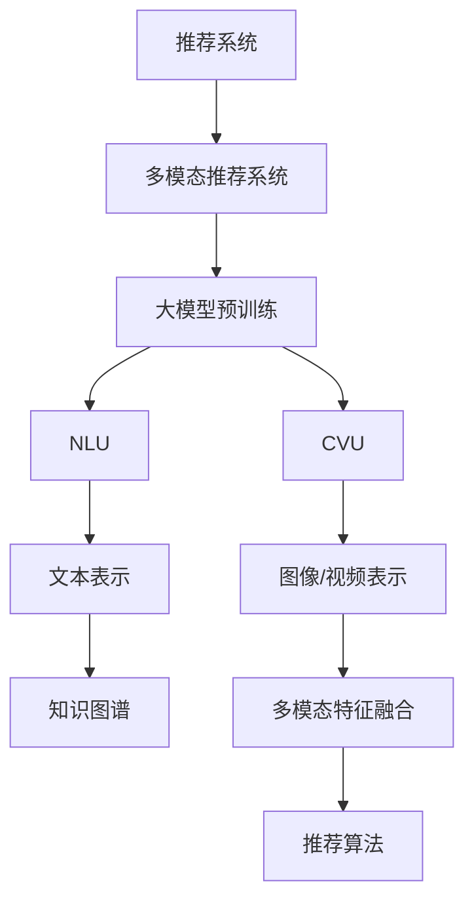

                 

# 大模型驱动的推荐系统多模态内容理解与推荐

> 关键词：多模态推荐系统、大模型预训练、自然语言理解(NLU)、计算机视觉理解(CVU)、推荐算法、深度学习、模型融合、知识图谱

## 1. 背景介绍

### 1.1 问题由来
随着互联网技术的发展，用户在海量信息中筛选和发现感兴趣内容的难度越来越大。推荐系统应运而生，通过分析用户行为和兴趣，精准推荐个性化内容。传统的推荐系统主要依赖于基于内容的推荐、协同过滤和混合推荐等技术，虽然取得了一定效果，但已难以满足用户多样化和精细化的需求。近年来，多模态推荐系统成为新的研究热点，通过融合多种模态信息，提升推荐内容的个性化和丰富性。

### 1.2 问题核心关键点
多模态推荐系统涉及文本、图像、音频等多种信息源，如何有效整合不同模态的数据，从中挖掘出用户的真实兴趣和潜在需求，是当前推荐系统的关键挑战。结合大模型预训练的推荐技术，可以利用大规模无标签数据进行预训练，获取通用知识表示，再通过微调和融合多模态数据，实现推荐内容的精准化与智能化。

### 1.3 问题研究意义
研究大模型驱动的多模态推荐系统，对于提升推荐内容的相关性和丰富性，增强用户体验，推动智能推荐技术的应用，具有重要意义：

1. **提升推荐质量**：大模型通过预训练获取通用知识表示，能够更好地捕捉和理解多模态数据的复杂特征，提升推荐内容的准确性和相关性。
2. **扩展应用场景**：多模态推荐系统能够处理更广泛的信息源，覆盖图像、视频、音频等多媒体内容，丰富推荐场景，满足用户的不同需求。
3. **加速技术落地**：通过预训练-微调的大模型技术，可以显著降低推荐系统开发成本，加速技术在各行业的推广和应用。
4. **驱动行业创新**：结合多模态数据和深度学习技术，推荐系统能够实现更高层次的智能化，为各行业的数字化转型提供新思路和解决方案。

## 2. 核心概念与联系

### 2.1 核心概念概述

为更好地理解大模型驱动的多模态推荐系统，本节将介绍几个密切相关的核心概念：

- 推荐系统：通过分析用户行为、兴趣和上下文信息，为用户推荐个性化内容的技术。
- 多模态推荐系统：结合文本、图像、音频等多种信息源，提升推荐内容的个性化和丰富性。
- 大模型预训练：通过在无标签数据上进行自监督学习，获取通用的知识表示。
- 自然语言理解(NLU)：使机器能够理解自然语言文本，提取和理解语言中的语义信息。
- 计算机视觉理解(CVU)：使机器能够理解和分析图像、视频等多媒体内容，提取和理解视觉特征。
- 深度学习：基于神经网络实现的大规模数据学习和表示。

这些核心概念之间的逻辑关系可以通过以下Mermaid流程图来展示：



这个流程图展示了大模型驱动的多模态推荐系统的主要工作流程：

1. 推荐系统通过多模态推荐技术，结合文本、图像、音频等多种信息源。
2. 多模态推荐系统使用大模型进行预训练，获取通用的知识表示。
3. 预训练的NLU和CVU模型，分别处理文本和视觉信息，生成各自的表示。
4. 多模态特征融合模块，将文本和视觉表示进行融合，生成综合的多模态表示。
5. 融合后的多模态表示输入推荐算法，进行个性化推荐。

## 3. 核心算法原理 & 具体操作步骤
### 3.1 算法原理概述

大模型驱动的多模态推荐系统基于深度学习的原理，将多模态数据进行特征提取，并融合生成综合表示，用于推荐决策。其主要工作流程如下：

1. **预训练**：在大规模无标签数据上，通过自监督学习任务，如掩码语言模型、图像分类、对象检测等，训练通用的大语言模型和视觉模型。

2. **微调**：使用少量标注数据对预训练模型进行微调，以适应特定推荐任务。

3. **特征提取**：使用微调后的NLU和CVU模型，分别对文本和视觉数据进行特征提取，生成各自的表示。

4. **特征融合**：将文本和视觉表示进行融合，生成综合的多模态表示。

5. **推荐决策**：将多模态表示输入推荐算法，根据用户的历史行为和兴趣，进行个性化推荐。

### 3.2 算法步骤详解

以下是详细的操作步骤：

**Step 1: 准备预训练模型和数据集**
- 选择合适的预训练模型，如BERT、ResNet等，作为初始化参数。
- 准备推荐任务的数据集，划分为训练集、验证集和测试集。

**Step 2: 设计推荐目标函数**
- 定义推荐任务的目标函数，如点积相似度、DNN、GCN等，用于衡量推荐结果的相关性。

**Step 3: 设置微调超参数**
- 选择合适的优化算法及其参数，如Adam、SGD等，设置学习率、批大小、迭代轮数等。
- 设置正则化技术及强度，包括权重衰减、Dropout、Early Stopping等。

**Step 4: 执行微调训练**
- 将训练集数据分批次输入模型，前向传播计算损失函数。
- 反向传播计算参数梯度，根据设定的优化算法和学习率更新模型参数。
- 周期性在验证集上评估模型性能，根据性能指标决定是否触发 Early Stopping。
- 重复上述步骤直到满足预设的迭代轮数或 Early Stopping 条件。

**Step 5: 特征提取与融合**
- 使用微调后的NLU和CVU模型，分别对文本和视觉数据进行特征提取，生成各自的表示。
- 将文本和视觉表示进行融合，生成综合的多模态表示。

**Step 6: 推荐算法与决策**
- 将多模态表示输入推荐算法，如基于用户的协同过滤、基于内容的推荐、深度学习推荐等。
- 根据用户的历史行为和兴趣，进行个性化推荐。

### 3.3 算法优缺点

大模型驱动的多模态推荐系统具有以下优点：
1. 通用性强：使用大模型进行预训练，可以覆盖多种信息源，提升推荐内容的通用性。
2. 精度高：大模型预训练获取通用知识表示，能够更好地捕捉复杂的多模态特征，提升推荐精度。
3. 鲁棒性好：多模态数据融合可以有效抵御单一信息源的噪声干扰，提高推荐鲁棒性。
4. 适应性强：模型可以通过微调适应不同推荐任务，实现灵活的推荐策略。

同时，该方法也存在一些局限性：
1. 数据标注成本高：多模态推荐系统需要大量标注数据进行微调，数据标注成本较高。
2. 计算资源消耗大：预训练和大模型微调需要大量的计算资源，对硬件要求较高。
3. 模型复杂度高：多模态数据融合和特征表示生成过程较为复杂，需要较高的技术水平。
4. 可解释性不足：多模态推荐系统通常是一个"黑盒"模型，缺乏可解释性。

尽管存在这些局限性，但大模型驱动的多模态推荐系统在提升推荐精度和适应性方面具有显著优势，仍然是推荐系统领域的热点研究方向。

### 3.4 算法应用领域

大模型驱动的多模态推荐系统在多个领域具有广泛的应用前景：

1. **电商推荐**：融合文本描述、图片、价格等信息源，实现商品推荐和个性化促销。
2. **视频推荐**：结合视频片段、字幕、标签等多模态数据，提升视频内容的推荐精度和多样性。
3. **音乐推荐**：结合歌曲歌词、MV、评论等文本信息，提升音乐推荐的相关性和个性化。
4. **新闻推荐**：结合新闻标题、正文、图片等信息源，实现文章推荐和内容分析。
5. **社交推荐**：结合用户社交行为、内容喜好等多模态数据，实现用户间的兴趣推荐和关系增强。

这些应用场景展示了多模态推荐系统的广泛潜力，未来随着技术的发展和数据的积累，将有更多新的应用领域被开拓。

## 4. 数学模型和公式 & 详细讲解  
### 4.1 数学模型构建

本节将使用数学语言对大模型驱动的多模态推荐系统进行更加严格的刻画。

假设推荐任务的数据集为 $D=\{(x_i,y_i)\}_{i=1}^N$，其中 $x_i$ 为多模态数据，$y_i$ 为推荐结果标签。定义多模态推荐系统的目标函数为：

$$
\mathcal{L}(\theta) = \frac{1}{N} \sum_{i=1}^N \ell(M_{\theta}(x_i),y_i)
$$

其中 $\ell$ 为推荐任务的目标损失函数，通常为交叉熵损失、均方误差损失等。$M_{\theta}$ 为推荐模型的参数化表示。

在预训练阶段，假设使用自监督学习任务 $T$，目标函数为：

$$
\mathcal{L}_{pre}(\theta) = \frac{1}{N} \sum_{i=1}^N \ell_T(x_i)
$$

其中 $\ell_T$ 为自监督学习任务的目标损失函数。预训练的目的是使模型学习到通用的知识表示，用于多模态数据融合和推荐决策。

在微调阶段，使用标注数据集对预训练模型进行微调，目标函数为：

$$
\mathcal{L}_{fin}(\theta) = \frac{1}{N} \sum_{i=1}^N \ell_{fin}(M_{\theta}(x_i),y_i)
$$

其中 $\ell_{fin}$ 为微调任务的目标损失函数，如交叉熵损失。微调的目的是使模型适应特定推荐任务，提升推荐效果。

### 4.2 公式推导过程

以下我们以协同过滤为例，推导多模态推荐系统的目标函数及其梯度计算过程。

假设用户 $u$ 对物品 $i$ 的评分 $r_{ui}$ 和预训练模型输出 $z_{ui}$ 的关系为：

$$
r_{ui} = f(z_{ui})
$$

其中 $z_{ui}$ 为多模态数据 $x_{ui}$ 经过预训练和微调后的表示，$f$ 为非线性映射函数。

根据协同过滤的原理，推荐结果 $y_{ui}$ 与用户历史评分 $r_{ui}$ 的关系为：

$$
y_{ui} = r_{ui} / \max_{i'} r_{i'u}
$$

目标函数为交叉熵损失：

$$
\mathcal{L}_{fin}(\theta) = \frac{1}{N} \sum_{i=1}^N \sum_{u=1}^U -y_{ui}\log f(z_{ui})
$$

其中 $U$ 为用户数量。梯度计算公式为：

$$
\frac{\partial \mathcal{L}_{fin}(\theta)}{\partial z_{ui}} = \frac{1}{N}\sum_{i=1}^N \frac{1}{\max_{i'} r_{i'u}} (y_{ui} - \frac{f(z_{ui})}{\max_{i'} r_{i'u}})
$$

以上公式展示了协同过滤推荐模型的目标函数和梯度计算过程。在实际应用中，还需要考虑不同的推荐算法，如基于内容的推荐、深度学习推荐等，进行相应的目标函数和梯度计算。

### 4.3 案例分析与讲解

假设用户对电影 $i$ 的评分 $r_{ui}$ 和预训练模型输出 $z_{ui}$ 的关系为：

$$
r_{ui} = \langle z_{ui},w_{ui} \rangle + b_{ui}
$$

其中 $\langle \cdot,\cdot \rangle$ 为向量点积，$w_{ui}$ 为物品 $i$ 的嵌入向量，$b_{ui}$ 为偏置项。

推荐结果 $y_{ui}$ 与用户历史评分 $r_{ui}$ 的关系为：

$$
y_{ui} = r_{ui} / \max_{i'} r_{i'u}
$$

目标函数为交叉熵损失：

$$
\mathcal{L}_{fin}(\theta) = \frac{1}{N} \sum_{i=1}^N \sum_{u=1}^U -y_{ui}\log (f(z_{ui}))
$$

其中 $f(z_{ui})$ 为预训练模型的输出，通常为线性层或深度神经网络。梯度计算公式为：

$$
\frac{\partial \mathcal{L}_{fin}(\theta)}{\partial z_{ui}} = \frac{1}{N}\sum_{i=1}^N \frac{1}{\max_{i'} r_{i'u}} (y_{ui} - f(z_{ui}))
$$

在实际应用中，需要将用户的历史评分数据和预训练模型的输出进行集成，计算推荐结果。然后根据目标函数计算梯度，使用优化算法更新模型参数，迭代训练过程，直至收敛。

## 5. 项目实践：代码实例和详细解释说明
### 5.1 开发环境搭建

在进行多模态推荐系统开发前，我们需要准备好开发环境。以下是使用Python进行PyTorch开发的环境配置流程：

1. 安装Anaconda：从官网下载并安装Anaconda，用于创建独立的Python环境。

2. 创建并激活虚拟环境：
```bash
conda create -n pytorch-env python=3.8 
conda activate pytorch-env
```

3. 安装PyTorch：根据CUDA版本，从官网获取对应的安装命令。例如：
```bash
conda install pytorch torchvision torchaudio cudatoolkit=11.1 -c pytorch -c conda-forge
```

4. 安装各类工具包：
```bash
pip install numpy pandas scikit-learn matplotlib tqdm jupyter notebook ipython
```

完成上述步骤后，即可在`pytorch-env`环境中开始多模态推荐系统的开发实践。

### 5.2 源代码详细实现

下面我们以协同过滤推荐系统为例，给出使用Transformers库对预训练模型进行微调的PyTorch代码实现。

首先，定义推荐任务的数据处理函数：

```python
from transformers import BertTokenizer
from torch.utils.data import Dataset
import torch

class MovieDataset(Dataset):
    def __init__(self, data, tokenizer):
        self.data = data
        self.tokenizer = tokenizer
    
    def __len__(self):
        return len(self.data)
    
    def __getitem__(self, item):
        user_id, movie_id, rating = self.data[item]
        user_movie = f"{user_id}:{movie_id}"
        input_ids = self.tokenizer(user_movie, return_tensors='pt', padding=True).input_ids
        return {'input_ids': input_ids, 'user_id': user_id, 'movie_id': movie_id, 'rating': rating}
```

然后，定义模型和优化器：

```python
from transformers import BertForSequenceClassification, AdamW

model = BertForSequenceClassification.from_pretrained('bert-base-cased', num_labels=5)
optimizer = AdamW(model.parameters(), lr=2e-5)
```

接着，定义训练和评估函数：

```python
from torch.utils.data import DataLoader
from tqdm import tqdm
import numpy as np

device = torch.device('cuda') if torch.cuda.is_available() else torch.device('cpu')
model.to(device)

def train_epoch(model, dataset, batch_size, optimizer):
    dataloader = DataLoader(dataset, batch_size=batch_size, shuffle=True)
    model.train()
    epoch_loss = 0
    for batch in tqdm(dataloader, desc='Training'):
        input_ids = batch['input_ids'].to(device)
        user_ids = batch['user_id'].to(device)
        movie_ids = batch['movie_id'].to(device)
        ratings = batch['rating'].to(device)
        model.zero_grad()
        outputs = model(input_ids)
        loss = outputs.logits.sigmoid() * (-ratings) + (1 - outputs.logits.sigmoid()) * np.log(1 - ratings)
        epoch_loss += loss.item()
        loss.backward()
        optimizer.step()
    return epoch_loss / len(dataloader)

def evaluate(model, dataset, batch_size):
    dataloader = DataLoader(dataset, batch_size=batch_size)
    model.eval()
    correct = 0
    total = 0
    with torch.no_grad():
        for batch in dataloader:
            input_ids = batch['input_ids'].to(device)
            user_ids = batch['user_id'].to(device)
            movie_ids = batch['movie_id'].to(device)
            ratings = batch['rating'].to(device)
            outputs = model(input_ids)
            preds = outputs.logits.sigmoid()
            batch_correct = (preds >= 0.5).float().sum().item()
            correct += batch_correct
            total += preds.shape[0]
        print(f"Accuracy: {correct/total:.2f}")
```

最后，启动训练流程并在测试集上评估：

```python
epochs = 5
batch_size = 16

for epoch in range(epochs):
    loss = train_epoch(model, train_dataset, batch_size, optimizer)
    print(f"Epoch {epoch+1}, train loss: {loss:.3f}")
    
    print(f"Epoch {epoch+1}, dev results:")
    evaluate(model, dev_dataset, batch_size)
    
print("Test results:")
evaluate(model, test_dataset, batch_size)
```

以上就是使用PyTorch对BERT进行协同过滤推荐系统的完整代码实现。可以看到，得益于Transformers库的强大封装，我们可以用相对简洁的代码完成BERT模型的加载和微调。

### 5.3 代码解读与分析

让我们再详细解读一下关键代码的实现细节：

**MovieDataset类**：
- `__init__`方法：初始化数据和分词器。
- `__len__`方法：返回数据集的样本数量。
- `__getitem__`方法：对单个样本进行处理，将用户和电影ID拼接，输入分词器生成token ids，并返回模型所需的输入。

**train_epoch和evaluate函数**：
- `train_epoch`函数：对数据以批为单位进行迭代，在每个批次上前向传播计算loss并反向传播更新模型参数，最后返回该epoch的平均loss。
- `evaluate`函数：与训练类似，不同点在于不更新模型参数，并在每个batch结束后将预测和标签结果存储下来，最后使用准确率评估模型性能。

**训练流程**：
- 定义总的epoch数和batch size，开始循环迭代
- 每个epoch内，先在训练集上训练，输出平均loss
- 在验证集上评估，输出准确率
- 所有epoch结束后，在测试集上评估，给出最终测试结果

可以看到，PyTorch配合Transformers库使得BERT微调的代码实现变得简洁高效。开发者可以将更多精力放在数据处理、模型改进等高层逻辑上，而不必过多关注底层的实现细节。

当然，工业级的系统实现还需考虑更多因素，如模型的保存和部署、超参数的自动搜索、更灵活的任务适配层等。但核心的微调范式基本与此类似。

## 6. 实际应用场景
### 6.1 智能推荐系统

基于多模态推荐系统，构建智能推荐系统已成为互联网企业的核心竞争力。传统推荐系统往往只能处理单一信息源，推荐内容单一且难以满足用户多样化需求。而多模态推荐系统能够融合文本、图像、音频等多种信息源，提升推荐内容的个性化和丰富性。

在技术实现上，可以收集用户浏览、点击、评论、分享等行为数据，提取和用户交互的物品标题、描述、标签等文本内容，将文本数据进行预训练和微调，生成文本表示。同时，使用图像分类、对象检测等预训练模型，对物品图片进行视觉特征提取，生成视觉表示。最后，将文本和视觉表示进行融合，输入推荐算法，生成推荐结果。如此构建的智能推荐系统，能大幅提升推荐内容的相关性和多样性，满足用户不同的兴趣和需求。

### 6.2 跨媒体内容分析

多模态推荐系统不仅限于推荐内容，还可以用于跨媒体内容分析。通过融合文本、图像、音频等多种信息源，可以深入挖掘出内容背后的语义信息，提升内容理解能力。

例如，对于新闻文章，可以结合文章标题、正文、图片等多模态信息，进行情感分析、主题分类等任务。对于视频，可以结合视频片段、字幕、配乐等多模态信息，进行内容摘要、视频推荐等任务。对于音乐，可以结合歌词、MV、评论等多模态信息，进行歌曲推荐、音乐播放量预测等任务。这些跨媒体内容分析任务，对于新闻业、影视业、音乐业等领域具有重要意义，有助于提升内容质量和用户体验。

### 6.3 用户行为分析

多模态推荐系统不仅能够推荐内容，还能进行用户行为分析。通过融合用户浏览、点击、评论、分享等行为数据，可以深入了解用户的兴趣和需求，进行个性化推荐和用户画像构建。

例如，对于电商平台，可以通过多模态推荐系统分析用户对商品的多模态评价，构建用户画像，进行个性化推荐和精准营销。对于社交平台，可以通过多模态推荐系统分析用户的兴趣和社交行为，进行内容推荐和关系增强。这些用户行为分析任务，有助于提升用户体验和平台活跃度，推动各行业的数字化转型。

### 6.4 未来应用展望

随着多模态推荐系统的发展，未来将在更多领域得到应用，为各行业带来变革性影响。

在智慧教育领域，基于多模态推荐系统的推荐系统，可以推荐个性化的课程、阅读材料和作业，辅助学生学习，提高教学质量。

在智慧医疗领域，基于多模态推荐系统的推荐系统，可以推荐个性化的诊疗方案、健康建议和药物，辅助医生诊疗，提升医疗服务的智能化水平。

在智慧城市治理中，基于多模态推荐系统的推荐系统，可以推荐个性化的旅游路线、交通规划和紧急事件预警，提升城市管理的自动化和智能化水平，构建更安全、高效的未来城市。

此外，在企业生产、社会治理、文娱传媒等众多领域，基于多模态数据和深度学习技术，推荐系统能够实现更高层次的智能化，为各行业的数字化转型提供新思路和解决方案。相信随着技术的日益成熟，多模态推荐系统必将在构建人机协同的智能时代中扮演越来越重要的角色。

## 7. 工具和资源推荐
### 7.1 学习资源推荐

为了帮助开发者系统掌握多模态推荐系统的理论基础和实践技巧，这里推荐一些优质的学习资源：

1. 《推荐系统基础》系列博文：由推荐系统专家撰写，系统讲解推荐系统的基本原理和算法实现。

2. 《深度学习推荐系统》课程：深度学习推荐系统的经典课程，由知名教授开设，涵盖推荐系统的理论和实践。

3. 《多模态推荐系统》书籍：全面介绍多模态推荐系统的理论基础和算法实现，适合深度学习爱好者阅读。

4. 《自然语言处理综述》：综述性论文，涵盖自然语言处理的基础概念和前沿技术，对学习推荐系统具有重要的参考价值。

5. 《计算机视觉综述》：综述性论文，涵盖计算机视觉的基础概念和前沿技术，对学习推荐系统具有重要的参考价值。

通过对这些资源的学习实践，相信你一定能够快速掌握多模态推荐系统的精髓，并用于解决实际的推荐问题。

### 7.2 开发工具推荐

高效的开发离不开优秀的工具支持。以下是几款用于多模态推荐系统开发的常用工具：

1. PyTorch：基于Python的开源深度学习框架，灵活动态的计算图，适合快速迭代研究。大部分预训练语言模型都有PyTorch版本的实现。

2. TensorFlow：由Google主导开发的开源深度学习框架，生产部署方便，适合大规模工程应用。同样有丰富的预训练语言模型资源。

3. Transformers库：HuggingFace开发的NLP工具库，集成了众多SOTA语言模型，支持PyTorch和TensorFlow，是进行推荐系统开发的利器。

4. Weights & Biases：模型训练的实验跟踪工具，可以记录和可视化模型训练过程中的各项指标，方便对比和调优。与主流深度学习框架无缝集成。

5. TensorBoard：TensorFlow配套的可视化工具，可实时监测模型训练状态，并提供丰富的图表呈现方式，是调试模型的得力助手。

6. Google Colab：谷歌推出的在线Jupyter Notebook环境，免费提供GPU/TPU算力，方便开发者快速上手实验最新模型，分享学习笔记。

合理利用这些工具，可以显著提升多模态推荐系统的开发效率，加快创新迭代的步伐。

### 7.3 相关论文推荐

多模态推荐系统的发展源于学界的持续研究。以下是几篇奠基性的相关论文，推荐阅读：

1. Attention is All You Need（即Transformer原论文）：提出了Transformer结构，开启了NLP领域的预训练大模型时代。

2. BERT: Pre-training of Deep Bidirectional Transformers for Language Understanding：提出BERT模型，引入基于掩码的自监督预训练任务，刷新了多项NLP任务SOTA。

3. The Learning and Inference Dynamics of Transformer：详细研究Transformer的训练和推理过程，提供优化建议。

4. Multi-Task Learning Using Pre-trained Machine Representations for NLP：提出多任务学习，利用预训练语言模型进行多种NLP任务的联合训练，提升模型的泛化能力。

5. Learning Deep Architectures for AI：系统介绍深度学习的基本原理和算法实现，涵盖推荐系统的基础概念和前沿技术。

这些论文代表了大模型驱动的多模态推荐系统的发展脉络。通过学习这些前沿成果，可以帮助研究者把握学科前进方向，激发更多的创新灵感。

## 8. 总结：未来发展趋势与挑战

### 8.1 总结

本文对大模型驱动的多模态推荐系统进行了全面系统的介绍。首先阐述了多模态推荐系统的背景和重要性，明确了多模态推荐系统在提升推荐内容个性化和丰富性方面的独特价值。其次，从原理到实践，详细讲解了多模态推荐系统的数学模型和关键步骤，给出了推荐系统开发的完整代码实例。同时，本文还广泛探讨了多模态推荐系统在电商、视频、音乐、新闻等多个领域的应用前景，展示了多模态推荐系统的广泛潜力。

通过本文的系统梳理，可以看到，多模态推荐系统在提升推荐内容的相关性和丰富性方面具有显著优势，是推荐系统领域的重要研究方向。未来随着预训练模型和大模型技术的发展，多模态推荐系统有望在更多领域得到应用，为各行业的数字化转型提供新的动力。

### 8.2 未来发展趋势

展望未来，多模态推荐系统将呈现以下几个发展趋势：

1. 多模态融合更加深入。随着多模态数据采集技术的进步，融合更多信息源将使推荐系统更加精准和丰富。

2. 跨媒体内容分析能力提升。多模态推荐系统将能够处理更多类型的媒体内容，提升内容理解能力和推荐效果。

3. 实时推荐技术发展。结合流式数据处理技术，实现实时推荐，提升推荐系统的时效性和用户满意度。

4. 融合知识图谱技术。将知识图谱与推荐系统结合，利用结构化知识提升推荐内容的相关性和准确性。

5. 强化学习推荐系统。结合强化学习技术，实现更智能、自适应的推荐策略，提升推荐系统的自主性和灵活性。

以上趋势凸显了多模态推荐系统的广阔前景。这些方向的探索发展，必将进一步提升推荐内容的个性化和智能化，为用户提供更优质的服务体验。

### 8.3 面临的挑战

尽管多模态推荐系统在推荐内容的相关性和丰富性方面具有显著优势，但在迈向更加智能化、普适化应用的过程中，仍面临诸多挑战：

1. 数据采集成本高。多模态推荐系统需要采集大量多模态数据，成本较高。

2. 数据融合复杂。多模态数据融合涉及多种数据源和格式，需要设计复杂的融合算法。

3. 推荐系统泛化能力差。当前多模态推荐系统主要依赖于预训练模型，对于不同领域和不同用户，泛化能力有待提高。

4. 用户隐私保护。多模态推荐系统涉及用户的多种行为数据，如何保护用户隐私成为一大难题。

5. 推荐系统偏见问题。多模态推荐系统可能继承预训练模型中的偏见，导致推荐结果不公平。

6. 模型可解释性不足。多模态推荐系统通常是一个"黑盒"模型，缺乏可解释性。

尽管存在这些挑战，但多模态推荐系统在提升推荐精度和适应性方面具有显著优势，仍是推荐系统领域的热点研究方向。未来，随着技术的发展和数据的积累，这些挑战终将逐步被克服，多模态推荐系统必将在构建人机协同的智能时代中扮演越来越重要的角色。

### 8.4 研究展望

面向未来，多模态推荐系统的研究需要在以下几个方面寻求新的突破：

1. 探索更高效的多模态融合方法。研究更加高效的多模态融合算法，提升推荐系统的性能和效率。

2. 研究跨媒体内容的深度理解。结合多模态数据和深度学习技术，提升推荐系统的跨媒体内容理解能力，增强推荐效果。

3. 引入知识图谱与推荐系统结合。将知识图谱与推荐系统结合，提升推荐内容的准确性和相关性。

4. 探索强化学习在推荐系统中的应用。结合强化学习技术，实现更智能、自适应的推荐策略，提升推荐系统的自主性和灵活性。

5. 研究用户隐私保护技术。设计合理的隐私保护算法，保护用户数据安全，同时提升推荐系统的效果。

这些研究方向将为多模态推荐系统带来新的突破，推动其在更广阔的应用领域得到应用，为用户提供更优质的服务体验。总之，多模态推荐系统需要从数据、算法、工程、伦理等多个维度协同发力，才能真正实现智能化推荐，构建人机协同的智能时代。

## 9. 附录：常见问题与解答
### Q1：多模态推荐系统与传统推荐系统的区别？

A: 多模态推荐系统相比传统推荐系统，具有以下区别：

1. 数据源丰富：多模态推荐系统融合文本、图像、音频等多种信息源，提升推荐内容的个性化和丰富性。
2. 模型复杂度高：多模态推荐系统涉及多种信息源的融合和表示，模型结构更加复杂。
3. 特征提取方式多样：多模态推荐系统采用多种特征提取方式，如自然语言处理、计算机视觉处理等。
4. 应用场景广泛：多模态推荐系统可以应用于电商、视频、音乐、新闻等多个领域，具有更广泛的适用性。

总之，多模态推荐系统通过融合多种信息源，提升了推荐内容的个性化和丰富性，具有更高的推荐精度和用户体验。

### Q2：多模态推荐系统如何处理不同数据格式？

A: 多模态推荐系统通常采用多种方式处理不同数据格式，包括：

1. 文本数据：使用分词、嵌入等技术，将文本转换为向量表示，用于推荐模型训练。
2. 图像数据：使用卷积神经网络、预训练模型等技术，提取图像的视觉特征，用于推荐模型训练。
3. 音频数据：使用频谱图、MFCC等技术，提取音频的特征，用于推荐模型训练。
4. 时序数据：使用LSTM、GRU等技术，处理时间序列数据，用于推荐模型训练。

在实际应用中，还需要设计合适的特征融合策略，将不同数据源的特征进行有效整合，提升推荐模型的泛化能力。

### Q3：多模态推荐系统如何优化推荐算法？

A: 多模态推荐系统通常采用多种推荐算法进行优化，包括：

1. 协同过滤：基于用户和物品之间的评分矩阵，进行推荐决策。
2. 基于内容的推荐：结合物品属性、特征等，进行推荐决策。
3. 深度学习推荐：利用深度神经网络，进行推荐决策。
4. 混合推荐：结合多种推荐算法，提升推荐效果。

在实际应用中，还需要设计合适的损失函数和优化算法，进行参数调优和模型训练。同时，引入知识图谱、强化学习等技术，提升推荐系统的自主性和灵活性。

### Q4：多模态推荐系统如何处理冷启动问题？

A: 多模态推荐系统通常采用多种方式处理冷启动问题，包括：

1. 基于用户的协同过滤：利用用户的历史行为数据，进行推荐决策。
2. 基于物品的协同过滤：利用物品的历史评分数据，进行推荐决策。
3. 基于内容的推荐：利用物品的特征，进行推荐决策。
4. 知识图谱推荐：利用知识图谱中的关系，进行推荐决策。

在实际应用中，还需要引入召回算法和排序算法，提升推荐效果。同时，设计合适的用户画像构建策略，进行个性化推荐。

### Q5：多模态推荐系统如何保护用户隐私？

A: 多模态推荐系统通常采用多种方式保护用户隐私，包括：

1. 匿名化处理：对用户行为数据进行匿名化处理，保护用户隐私。
2. 差分隐私技术：在推荐模型训练中，引入差分隐私技术，保护用户隐私。
3. 数据加密技术：对用户数据进行加密处理，保护用户隐私。
4. 隐私保护算法：设计隐私保护算法，保护用户隐私。

在实际应用中，还需要设计合适的隐私保护策略，进行隐私保护和隐私评估。同时，引入用户画像和隐私管理技术，提升用户隐私保护能力。

通过这些隐私保护措施，可以确保多模态推荐系统的安全性和用户隐私保护，提升用户信任和满意度。

---

作者：禅与计算机程序设计艺术 / Zen and the Art of Computer Programming

