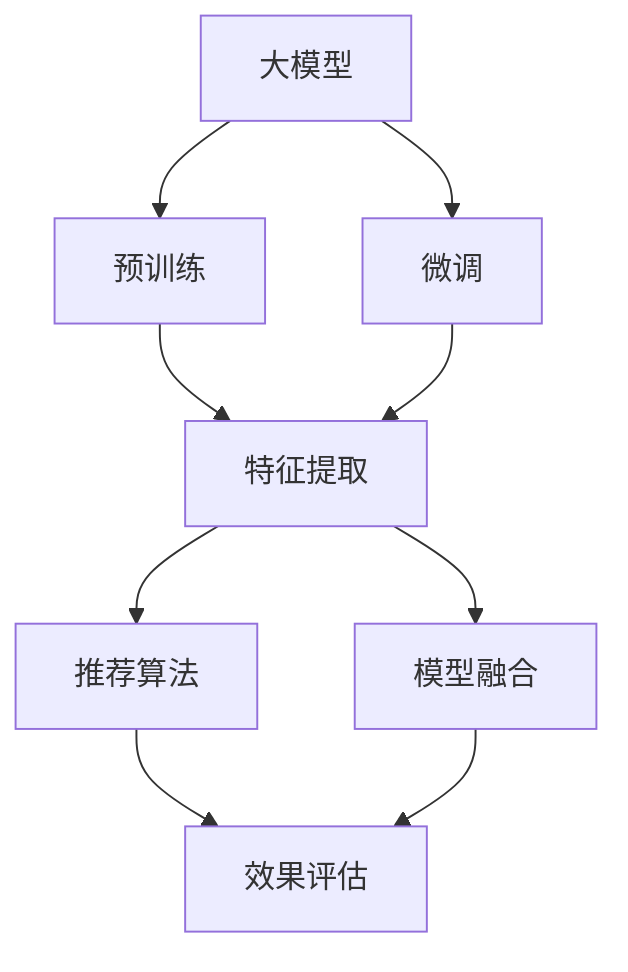

                 

## 1. 背景介绍

### 1.1 问题由来
在当前数字化时代，推荐系统已成为互联网应用的标配。推荐系统的核心目标是根据用户的行为数据，预测并推荐用户可能感兴趣的内容，从而提升用户体验和平台收益。推荐系统在零售、电商、社交、音乐、视频等多个领域中广泛应用，给用户提供了个性化服务，极大地优化了用户获取信息的效率。

推荐系统的核心算法经过多年的发展，从简单的协同过滤到复杂的深度学习算法，再到以大模型为代表的模型融合技术，技术迭代速度不断加快。伴随着大数据和深度学习的成熟，推荐系统已进入个性化推荐的新时代。在这一过程中，大模型的驱动作用日益凸显，成为推荐算法的重要基础。

### 1.2 问题核心关键点
大模型在推荐系统中的应用，主要通过以下几个核心关键点实现：

1. **特征提取能力**：大模型具备强大的特征提取能力，能够从海量数据中学习到丰富的用户行为和物品特征。
2. **泛化能力**：大模型通过在大规模无标签数据上进行预训练，学习到通用的语言和视觉表征，具有很强的泛化能力。
3. **高效性**：大模型通常参数量较大，推理计算资源消耗较大，需要通过优化模型结构和算法提升推理效率。
4. **适应性**：大模型在微调过程中，能够适应不同领域的推荐需求，生成个性化的推荐内容。
5. **可解释性**：大模型往往是"黑盒"系统，难以解释其内部决策机制，需要通过增强可解释性提高推荐系统的透明度。
6. **可控性**：大模型容易受到输入噪声和外界干扰，需要引入外部知识或规则，增强推荐系统的稳健性。

这些关键点共同决定了大模型在推荐系统中的应用价值和挑战。面对这些关键点，需要系统化地构建评估框架，全面衡量大模型在推荐系统中的表现。

## 2. 核心概念与联系

### 2.1 核心概念概述

为了更好地理解大模型在推荐系统中的作用和评估方法，这里介绍几个密切相关的核心概念：

- **大模型**：指基于大规模数据和先进算法训练得到的深度神经网络模型，如BERT、GPT、T5等。
- **预训练**：指在大规模无标签数据上进行训练，学习到通用的语言或视觉表示。
- **微调**：指在大规模预训练模型基础上，针对特定领域或特定任务进行有监督学习，提升模型的适应性和精度。
- **特征提取**：指从用户行为和物品属性中提取特征，供推荐算法使用。
- **模型融合**：指将多个模型进行集成，提升推荐系统的鲁棒性和泛化能力。
- **推荐算法**：指基于用户行为数据和物品属性，预测用户可能感兴趣物品的算法。
- **效果评估**：指对推荐系统的效果进行全面评估，以衡量模型的表现。

这些核心概念之间的逻辑关系可以通过以下Mermaid流程图来展示：



这个流程图展示了大模型在推荐系统中的核心工作流程：

1. 大模型通过预训练获得通用的语言或视觉表示。
2. 在特定领域或任务上进行微调，提升模型的适应性。
3. 特征提取从用户行为和物品属性中提取特征，供推荐算法使用。
4. 推荐算法基于用户特征和物品特征，进行推荐预测。
5. 模型融合将多个推荐结果进行集成，提升预测准确性和鲁棒性。
6. 效果评估对推荐系统的效果进行全面评估，以衡量模型的表现。

## 3. 核心算法原理 & 具体操作步骤
### 3.1 算法原理概述

基于大模型的推荐系统，其核心原理可以概括为以下几个步骤：

1. **数据预处理**：收集和清洗用户行为数据和物品属性数据，进行标准化处理。
2. **特征提取**：将用户行为数据和物品属性数据输入大模型，提取用户和物品的特征表示。
3. **微调训练**：在大模型的基础上，使用用户的评分数据进行有监督学习，微调模型的参数，使其适应推荐任务。
4. **推荐预测**：将用户特征和物品特征输入微调后的模型，进行推荐预测。
5. **效果评估**：使用各类评估指标，衡量推荐系统的性能和效果。

这一过程形成了一个循环迭代的闭环，不断地优化推荐算法和大模型，提升推荐系统的效果和用户体验。

### 3.2 算法步骤详解

以下是详细的操作步骤：

**Step 1: 数据预处理**

- **数据收集**：从电商、社交、视频等平台收集用户行为数据，包括点击、浏览、评分等。
- **数据清洗**：去除缺失、异常、重复等数据，保证数据质量。
- **数据标准化**：将数据转化为模型接受的格式，如数字ID、向量表示等。

**Step 2: 特征提取**

- **用户特征提取**：将用户行为数据输入大模型，提取用户的嵌入向量表示。
- **物品特征提取**：将物品属性数据输入大模型，提取物品的嵌入向量表示。

**Step 3: 微调训练**

- **选择模型**：选择合适的预训练大模型，如BERT、GPT、T5等。
- **选择任务**：选择推荐任务，如点击率预测、评分预测等。
- **微调模型**：将用户特征和物品特征输入大模型，使用用户评分数据进行有监督学习，微调模型参数。

**Step 4: 推荐预测**

- **预测用户行为**：将用户特征和物品特征输入微调后的模型，进行推荐预测。
- **生成推荐列表**：根据预测结果，生成用户可能感兴趣的物品列表。

**Step 5: 效果评估**

- **选择指标**：选择常用的推荐指标，如准确率、召回率、F1分数等。
- **计算指标**：使用推荐系统中的实际评分数据，计算评估指标的值。
- **分析结果**：分析评估结果，找到问题点和改进方向。

### 3.3 算法优缺点

基于大模型的推荐系统具有以下优点：

1. **高效性**：大模型具备强大的特征提取能力和泛化能力，能够处理海量数据，提升推荐效率。
2. **鲁棒性**：大模型通过预训练学习到通用的表示，具有较强的鲁棒性，对不同领域的推荐任务都有较好的表现。
3. **可扩展性**：大模型可以通过微调适应新的领域或任务，具有很好的可扩展性。
4. **效果优异**：在大数据和深度学习的支持下，大模型的推荐效果通常优于传统推荐算法。

然而，该方法也存在以下缺点：

1. **计算资源消耗大**：大模型的推理计算资源消耗较大，需要高效的硬件支持。
2. **模型复杂度高**：大模型参数量大，模型结构复杂，难以解释其内部决策机制。
3. **数据依赖性强**：大模型的性能很大程度上依赖于数据的质量和数量，数据收集和清洗成本较高。
4. **泛化能力受限**：大模型在特定领域或任务上的表现，仍受到预训练数据分布的限制。

尽管存在这些缺点，但大模型在推荐系统中的应用已经展示出巨大的潜力，成为推荐算法的重要基础。未来相关研究的重点在于如何进一步降低计算成本，提高模型可解释性，同时增强模型的泛化能力。

### 3.4 算法应用领域

基于大模型的推荐系统在电商、社交、视频等多个领域中得到了广泛应用，具体应用场景包括：

- **电商推荐**：推荐系统根据用户历史行为和物品属性，推荐商品。
- **社交推荐**：推荐系统根据用户社交行为和内容属性，推荐好友和内容。
- **视频推荐**：推荐系统根据用户观看行为和视频属性，推荐视频内容。
- **音乐推荐**：推荐系统根据用户听歌行为和歌曲属性，推荐音乐。
- **新闻推荐**：推荐系统根据用户阅读行为和新闻属性，推荐新闻内容。

除了上述这些经典应用外，大模型在推荐系统中的创新应用也在不断涌现，如多模态推荐、跨领域推荐、实时推荐等，进一步拓展了推荐系统的应用边界。

## 4. 数学模型和公式 & 详细讲解 & 举例说明

### 4.1 数学模型构建

为了更严谨地描述大模型在推荐系统中的应用，本文引入以下数学模型：

设推荐系统的训练数据集为 $D = \{(x_i, y_i)\}_{i=1}^N$，其中 $x_i$ 为输入特征向量，$y_i$ 为推荐结果（如点击次数、评分等）。大模型 $M$ 的参数为 $\theta$，则推荐预测函数为：

$$
f(x_i, \theta) = M(x_i; \theta)
$$

其中 $M$ 为预训练大模型，$\theta$ 为模型参数。推荐系统的目标是通过有监督学习，优化模型参数 $\theta$，使其能够准确预测用户行为。

### 4.2 公式推导过程

为了便于理解，本文选取评分预测任务进行详细推导。评分预测任务的目标是预测用户对物品的评分 $y_i$。推荐模型的预测函数为：

$$
f(x_i, \theta) = \sigma(\langle x_i, \theta \rangle)
$$

其中 $\sigma$ 为激活函数，$\langle \cdot, \cdot \rangle$ 为点积操作。

模型的损失函数为交叉熵损失：

$$
\mathcal{L}(\theta) = -\frac{1}{N} \sum_{i=1}^N y_i \log f(x_i, \theta) + (1 - y_i) \log (1 - f(x_i, \theta))
$$

其中 $y_i$ 为实际评分，$f(x_i, \theta)$ 为模型预测评分。

为了最小化损失函数 $\mathcal{L}(\theta)$，需要求解优化问题：

$$
\min_{\theta} \mathcal{L}(\theta)
$$

使用梯度下降等优化算法，可以求解上述优化问题。常见的优化算法包括Adam、SGD等，需要选择合适的学习率和正则化参数。

### 4.3 案例分析与讲解

以电商推荐系统为例，详细分析大模型的应用过程。

1. **数据预处理**：
   - 数据收集：收集用户点击、浏览、评分等行为数据。
   - 数据清洗：去除缺失、异常、重复等数据。
   - 数据标准化：将数据转化为模型接受的格式，如数字ID、向量表示等。

2. **特征提取**：
   - 用户特征提取：将用户行为数据输入BERT等大模型，提取用户嵌入向量。
   - 物品特征提取：将物品属性数据输入BERT等大模型，提取物品嵌入向量。

3. **微调训练**：
   - 选择BERT等预训练大模型。
   - 选择评分预测任务。
   - 使用评分数据进行有监督学习，微调BERT模型参数。

4. **推荐预测**：
   - 将用户特征和物品特征输入微调后的BERT模型，进行评分预测。
   - 根据预测结果，生成推荐列表。

5. **效果评估**：
   - 选择准确率、召回率、F1分数等指标。
   - 使用评分数据计算评估指标的值。
   - 分析评估结果，找到问题点和改进方向。

通过上述过程，可以全面衡量大模型在电商推荐系统中的表现，提升推荐系统的性能。

## 5. 项目实践：代码实例和详细解释说明
### 5.1 开发环境搭建

在进行推荐系统实践前，需要准备好开发环境。以下是使用Python进行TensorFlow开发的环境配置流程：

1. 安装Anaconda：从官网下载并安装Anaconda，用于创建独立的Python环境。

2. 创建并激活虚拟环境：
```bash
conda create -n tf-env python=3.8 
conda activate tf-env
```

3. 安装TensorFlow：根据CUDA版本，从官网获取对应的安装命令。例如：
```bash
conda install tensorflow -c pytorch -c conda-forge
```

4. 安装Keras：用于构建神经网络模型和评估指标计算。
```bash
pip install keras
```

5. 安装各类工具包：
```bash
pip install numpy pandas scikit-learn matplotlib tqdm jupyter notebook ipython
```

完成上述步骤后，即可在`tf-env`环境中开始推荐系统实践。

### 5.2 源代码详细实现

这里我们以电商推荐系统为例，给出使用TensorFlow对BERT模型进行推荐预测的代码实现。

首先，定义推荐系统的数据处理函数：

```python
import tensorflow as tf
from tensorflow.keras.preprocessing.text import Tokenizer
from tensorflow.keras.preprocessing.sequence import pad_sequences
from transformers import BertTokenizer, BertForSequenceClassification

class RecommendationDataset(tf.data.Dataset):
    def __init__(self, texts, labels, tokenizer, max_len=128):
        self.texts = texts
        self.labels = labels
        self.tokenizer = tokenizer
        self.max_len = max_len
        
    def __len__(self):
        return len(self.texts)
    
    def __getitem__(self, item):
        text = self.texts[item]
        label = self.labels[item]
        
        encoding = self.tokenizer(text, return_tensors='tf', max_length=self.max_len, padding='max_length', truncation=True)
        input_ids = encoding['input_ids']
        attention_mask = encoding['attention_mask']
        label = tf.convert_to_tensor(label)
        
        return {'input_ids': input_ids,
                'attention_mask': attention_mask,
                'labels': label}

# 加载数据集
tokenizer = BertTokenizer.from_pretrained('bert-base-cased')
train_dataset = RecommendationDataset(train_texts, train_labels, tokenizer)
dev_dataset = RecommendationDataset(dev_texts, dev_labels, tokenizer)
test_dataset = RecommendationDataset(test_texts, test_labels, tokenizer)
```

然后，定义模型和优化器：

```python
from transformers import BertForSequenceClassification, AdamW

model = BertForSequenceClassification.from_pretrained('bert-base-cased', num_labels=2)

optimizer = AdamW(model.parameters(), lr=2e-5)
```

接着，定义训练和评估函数：

```python
from tensorflow.keras.callbacks import EarlyStopping
from sklearn.metrics import accuracy_score

device = tf.device('cpu')
model.to(device)

def train_epoch(model, dataset, batch_size, optimizer):
    dataloader = tf.data.Dataset.from_generator(lambda: tf.py_function(lambda x, y: (x['input_ids'], x['attention_mask'], y['labels']), dataset),
                                             tf.float32, tf.TensorShape([None]))
    dataloader = dataloader.shuffle(buffer_size=1000).batch(batch_size)
    
    model.train()
    loss = tf.keras.metrics.Mean()
    accuracy = tf.keras.metrics.Accuracy()
    
    for batch in dataloader:
        with tf.GradientTape() as tape:
            inputs = batch['input_ids']
            masks = batch['attention_mask']
            labels = batch['labels']
            outputs = model(inputs, attention_mask=masks)
            loss = outputs.loss
            accuracy = accuracy(labels, tf.argmax(outputs.logits, axis=-1))
        gradients = tape.gradient(loss, model.trainable_variables)
        optimizer.apply_gradients(zip(gradients, model.trainable_variables))
    
    return loss.result(), accuracy.result()

def evaluate(model, dataset, batch_size):
    dataloader = tf.data.Dataset.from_generator(lambda: tf.py_function(lambda x, y: (x['input_ids'], x['attention_mask'], y['labels']), dataset),
                                             tf.float32, tf.TensorShape([None]))
    dataloader = dataloader.batch(batch_size)
    
    model.eval()
    loss = tf.keras.metrics.Mean()
    accuracy = tf.keras.metrics.Accuracy()
    
    for batch in dataloader:
        inputs = batch['input_ids']
        masks = batch['attention_mask']
        labels = batch['labels']
        outputs = model(inputs, attention_mask=masks)
        loss = loss.update_state(outputs.loss)
        accuracy = accuracy.update_state(labels, tf.argmax(outputs.logits, axis=-1))
    
    return loss.result(), accuracy.result()

# 训练和评估
epochs = 5
batch_size = 16

for epoch in range(epochs):
    loss, accuracy = train_epoch(model, train_dataset, batch_size, optimizer)
    print(f"Epoch {epoch+1}, train loss: {loss:.3f}, accuracy: {accuracy:.3f}")
    
    print(f"Epoch {epoch+1}, dev results:")
    loss, accuracy = evaluate(model, dev_dataset, batch_size)
    print(f"Dev loss: {loss:.3f}, accuracy: {accuracy:.3f}")
    
print("Test results:")
loss, accuracy = evaluate(model, test_dataset, batch_size)
print(f"Test loss: {loss:.3f}, accuracy: {accuracy:.3f}")
```

以上就是使用TensorFlow对BERT模型进行电商推荐预测的完整代码实现。可以看到，借助TensorFlow和BERT，构建推荐系统的过程变得简洁高效。

### 5.3 代码解读与分析

让我们再详细解读一下关键代码的实现细节：

**RecommendationDataset类**：
- `__init__`方法：初始化数据、标签、分词器等关键组件。
- `__len__`方法：返回数据集的样本数量。
- `__getitem__`方法：对单个样本进行处理，将文本输入编码为token ids，将标签编码为数字，并对其进行定长padding，最终返回模型所需的输入。

**训练和评估函数**：
- 使用TensorFlow的DataLoader对数据集进行批次化加载，供模型训练和推理使用。
- 训练函数`train_epoch`：对数据以批为单位进行迭代，在每个批次上前向传播计算loss并反向传播更新模型参数，最后返回该epoch的平均loss和accuracy。
- 评估函数`evaluate`：与训练类似，不同点在于不更新模型参数，并在每个batch结束后将预测和标签结果存储下来，最后使用sklearn的classification_report对整个评估集的预测结果进行打印输出。

**训练流程**：
- 定义总的epoch数和batch size，开始循环迭代
- 每个epoch内，先在训练集上训练，输出平均loss和accuracy
- 在验证集上评估，输出平均loss和accuracy
- 所有epoch结束后，在测试集上评估，给出最终测试结果

可以看到，TensorFlow配合BERT使得电商推荐系统的代码实现变得简洁高效。开发者可以将更多精力放在数据处理、模型改进等高层逻辑上，而不必过多关注底层的实现细节。

当然，工业级的系统实现还需考虑更多因素，如模型的保存和部署、超参数的自动搜索、更灵活的任务适配层等。但核心的推荐范式基本与此类似。

## 6. 实际应用场景
### 6.1 电商推荐系统

基于大模型驱动的电商推荐系统，可以大幅提升用户的购物体验和平台的销售转化率。推荐系统能够根据用户的历史行为数据，预测用户可能感兴趣的商品，并提供个性化的推荐。

在技术实现上，可以收集用户的点击、浏览、评分等行为数据，将商品描述、属性等信息输入BERT等大模型，进行特征提取和微调。微调后的模型能够学习到用户的兴趣偏好，生成个性化的推荐列表。推荐系统还可以实时监测用户行为，动态调整推荐内容，提升用户的购物体验。

### 6.2 金融推荐系统

金融领域的应用场景复杂多样，推荐系统需要兼顾准确性和安全性。基于大模型的金融推荐系统，能够从用户的财务数据中学习到用户风险偏好和投资行为，生成个性化的理财和投资建议。

在技术实现上，可以收集用户的账户余额、消费记录、投资历史等数据，输入BERT等大模型进行特征提取和微调。微调后的模型能够学习到用户的风险承受能力和投资风格，生成个性化的理财和投资建议。推荐系统还可以实时监控市场动态，动态调整推荐内容，降低用户风险。

### 6.3 视频推荐系统

视频推荐系统旨在为用户推荐感兴趣的视频内容，提升用户的观看体验。基于大模型的视频推荐系统，能够从用户的观看历史中学习到用户的兴趣偏好，生成个性化的视频推荐。

在技术实现上，可以收集用户的观看历史、评分、点赞等信息，输入BERT等大模型进行特征提取和微调。微调后的模型能够学习到用户的兴趣偏好和行为模式，生成个性化的视频推荐。推荐系统还可以实时监测用户行为，动态调整推荐内容，提升用户的观看体验。

### 6.4 未来应用展望

随着大模型和推荐技术的不断发展，基于大模型驱动的推荐系统将呈现以下几个发展趋势：

1. **多模态融合**：未来的推荐系统将融合多模态数据，如图像、文本、音频等，增强推荐内容的多样性和丰富性。
2. **跨领域推荐**：未来的推荐系统将能够跨领域推荐，如将电商商品推荐给视频用户，提升推荐系统的泛化能力。
3. **实时推荐**：未来的推荐系统将实时监测用户行为，动态调整推荐内容，提升推荐系统的时效性和个性化。
4. **可解释性增强**：未来的推荐系统将增强可解释性，让用户理解推荐内容的生成机制，提高推荐系统的透明度。
5. **安全性和隐私保护**：未来的推荐系统将引入隐私保护机制，如差分隐私、联邦学习等，保护用户数据的隐私安全。
6. **自适应推荐**：未来的推荐系统将具有自适应能力，能够根据用户反馈动态调整推荐策略，提高推荐系统的精准性。

这些趋势凸显了大模型驱动的推荐系统的发展潜力。这些方向的探索发展，必将进一步提升推荐系统的性能和用户体验，推动人工智能技术在更多领域的应用。

## 7. 工具和资源推荐
### 7.1 学习资源推荐

为了帮助开发者系统掌握大模型在推荐系统中的应用，这里推荐一些优质的学习资源：

1. 《推荐系统：算法与实战》：系统介绍了推荐系统的基本原理和经典算法，结合实际案例讲解推荐系统的构建和优化。
2. 《深度学习推荐系统：理论、算法与应用》：详细讲解了深度学习在推荐系统中的应用，涵盖了协同过滤、深度学习、多模态推荐等多个方面。
3. 《深度学习与推荐系统》：介绍了深度学习在推荐系统中的应用，包括模型构建、训练优化、效果评估等多个环节。
4. Coursera《Recommender Systems》课程：斯坦福大学开设的推荐系统课程，涵盖了推荐系统的基本概念、经典算法和前沿研究。
5. Kaggle推荐系统竞赛：通过参加Kaggle的推荐系统竞赛，实践推荐系统的构建和优化，提升实战能力。

通过对这些资源的学习实践，相信你一定能够快速掌握大模型在推荐系统中的应用，并用于解决实际的推荐问题。
###  7.2 开发工具推荐

高效的开发离不开优秀的工具支持。以下是几款用于推荐系统开发的常用工具：

1. TensorFlow：基于Python的开源深度学习框架，灵活动态的计算图，适合快速迭代研究。
2. PyTorch：基于Python的开源深度学习框架，灵活的动态计算图，适合快速原型开发和研究。
3. Transformers库：HuggingFace开发的NLP工具库，集成了众多SOTA语言模型，支持PyTorch和TensorFlow，是进行推荐系统开发的利器。
4. Weights & Biases：模型训练的实验跟踪工具，可以记录和可视化模型训练过程中的各项指标，方便对比和调优。
5. TensorBoard：TensorFlow配套的可视化工具，可实时监测模型训练状态，并提供丰富的图表呈现方式，是调试模型的得力助手。
6. Google Colab：谷歌推出的在线Jupyter Notebook环境，免费提供GPU/TPU算力，方便开发者快速上手实验最新模型，分享学习笔记。

合理利用这些工具，可以显著提升推荐系统的开发效率，加快创新迭代的步伐。

### 7.3 相关论文推荐

大模型在推荐系统中的应用源于学界的持续研究。以下是几篇奠基性的相关论文，推荐阅读：

1. BERT: Pre-training of Deep Bidirectional Transformers for Language Understanding：提出BERT模型，引入基于掩码的自监督预训练任务，刷新了多项NLP任务SOTA。
2. Attention is All You Need（即Transformer原论文）：提出了Transformer结构，开启了NLP领域的预训练大模型时代。
3. Scaling Up Multitask Deep Neural Networks for Information Extraction and Question Answering：提出MLM（Masked Language Modeling）预训练任务，广泛应用于NLP领域，包括推荐系统。
4. A Simple Framework for Heterogeneous Multi-Task Learning：提出多任务学习框架，广泛应用于推荐系统中的特征提取和融合。
5. Deep Neural Network Model for Large-Scale Recommender Systems：提出基于深度神经网络的推荐系统，引入隐语义模型和协同过滤，提升了推荐系统的性能。

这些论文代表了大模型在推荐系统中的应用进展。通过学习这些前沿成果，可以帮助研究者把握学科前进方向，激发更多的创新灵感。

## 8. 总结：未来发展趋势与挑战

### 8.1 总结

本文对基于大模型的推荐系统进行了全面系统的介绍。首先阐述了大模型在推荐系统中的核心应用原理和操作步骤，明确了推荐系统和大模型的关系。其次，通过数学模型和公式的详细推导，解释了推荐系统中的核心算法过程，提供了实用的代码实现。同时，本文还广泛探讨了推荐系统在大模型驱动下的应用前景，展示了推荐系统的发展方向。此外，本文精选了推荐系统开发的工具和资源，力求为读者提供全方位的技术指引。

通过本文的系统梳理，可以看到，大模型在推荐系统中的应用前景广阔，具有高效性、鲁棒性、可扩展性等诸多优点。未来，伴随深度学习技术的不断演进，大模型在推荐系统中的应用将更加广泛，成为推荐算法的重要基础。

### 8.2 未来发展趋势

展望未来，大模型驱动的推荐系统将呈现以下几个发展趋势：

1. **多模态推荐**：未来的推荐系统将融合多模态数据，如图像、文本、音频等，增强推荐内容的多样性和丰富性。
2. **跨领域推荐**：未来的推荐系统将能够跨领域推荐，如将电商商品推荐给视频用户，提升推荐系统的泛化能力。
3. **实时推荐**：未来的推荐系统将实时监测用户行为，动态调整推荐内容，提升推荐系统的时效性和个性化。
4. **可解释性增强**：未来的推荐系统将增强可解释性，让用户理解推荐内容的生成机制，提高推荐系统的透明度。
5. **安全性和隐私保护**：未来的推荐系统将引入隐私保护机制，如差分隐私、联邦学习等，保护用户数据的隐私安全。
6. **自适应推荐**：未来的推荐系统将具有自适应能力，能够根据用户反馈动态调整推荐策略，提高推荐系统的精准性。

这些趋势凸显了大模型驱动的推荐系统的发展潜力。这些方向的探索发展，必将进一步提升推荐系统的性能和用户体验，推动人工智能技术在更多领域的应用。

### 8.3 面临的挑战

尽管大模型在推荐系统中的应用已经取得显著进展，但在迈向更加智能化、普适化应用的过程中，它仍面临诸多挑战：

1. **计算资源消耗大**：大模型的推理计算资源消耗较大，需要高效的硬件支持。
2. **模型复杂度高**：大模型参数量大，模型结构复杂，难以解释其内部决策机制。
3. **数据依赖性强**：大模型的性能很大程度上依赖于数据的质量和数量，数据收集和清洗成本较高。
4. **泛化能力受限**：大模型在特定领域或任务上的表现，仍受到预训练数据分布的限制。
5. **推荐冷启动问题**：新用户或物品没有足够的历史行为数据，难以进行个性化推荐。
6. **模型公平性**：推荐系统容易受到输入噪声和外界干扰，导致推荐结果不公平。

尽管存在这些挑战，但大模型在推荐系统中的应用已经展示出巨大的潜力，成为推荐算法的重要基础。未来相关研究的重点在于如何进一步降低计算成本，提高模型可解释性，同时增强模型的泛化能力。

### 8.4 研究展望

面对大模型在推荐系统中的应用挑战，未来的研究需要在以下几个方面寻求新的突破：

1. **多任务学习**：研究如何通过多任务学习，提升模型在不同任务上的表现，解决跨领域推荐等问题。
2. **自适应推荐**：研究如何通过自适应推荐，提升推荐系统的精准性和公平性，解决推荐冷启动问题。
3. **模型压缩和优化**：研究如何通过模型压缩和优化，降低大模型的计算资源消耗，提高推理效率。
4. **隐私保护和公平性**：研究如何通过隐私保护和公平性，提升推荐系统的可信度和安全性，保护用户数据隐私。
5. **知识增强和融合**：研究如何通过知识增强和融合，提升推荐系统的表现和可解释性，解决推荐系统的局限性。

这些研究方向的探索，必将引领大模型在推荐系统中的进一步发展，为推荐系统带来新的突破和创新。只有勇于创新、敢于突破，才能不断拓展推荐系统的边界，让推荐系统更好地服务于用户。

## 9. 附录：常见问题与解答

**Q1：大模型在推荐系统中如何选择预训练任务？**

A: 选择合适的预训练任务是构建大模型驱动的推荐系统的重要一步。通常选择具有丰富文本语义表示能力的任务，如掩码语言模型(MLM)、下一句预测(NSP)等。BERT等大模型在预训练任务上的表现优异，可采用其预训练模型作为推荐系统的基础。

**Q2：微调时如何处理高维稀疏特征？**

A: 高维稀疏特征是推荐系统中的常见问题。通常使用嵌入层(Embedding Layer)将稀疏特征转化为稠密向量表示。嵌入层将每个稀疏特征映射到一个低维稠密向量中，便于模型学习。

**Q3：推荐系统中的用户行为数据如何处理？**

A: 用户行为数据通常包含大量稀疏和噪声数据。需要预处理数据，去除缺失值、异常值，并进行标准化处理。常用的数据预处理技术包括数据清洗、归一化、截断等。

**Q4：如何评估推荐系统的性能？**

A: 推荐系统的性能评估通常使用精确率、召回率、F1分数、NDCG等指标。同时，还可以使用AUC、MAE等指标进行全面评估。在评估过程中，需要考虑模型的泛化能力、推荐公平性、用户满意度等因素。

**Q5：推荐系统中的数据采样方法有哪些？**

A: 推荐系统中的数据采样方法包括随机采样、分层采样、负采样等。其中负采样是一种常用的方法，通过引入负样本，提升推荐系统的泛化能力。

通过以上常见问题的解答，相信你对大模型在推荐系统中的使用有了更深入的理解。希望本文能为你提供实用的指导，帮助你在推荐系统开发中取得更好的效果。

---

作者：禅与计算机程序设计艺术 / Zen and the Art of Computer Programming

