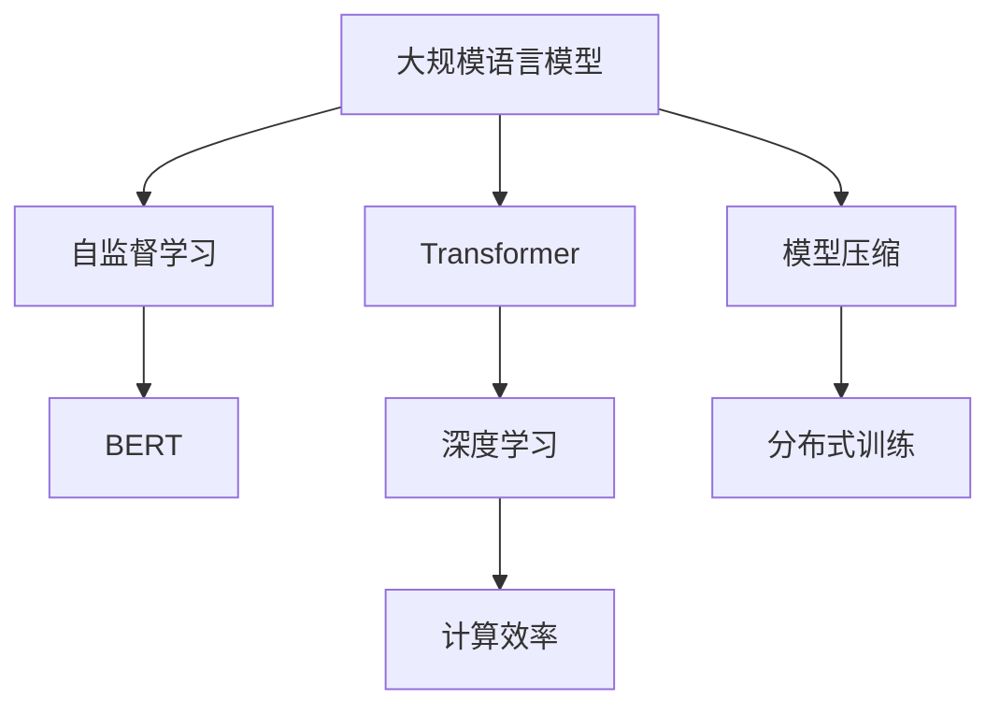

                 

# 大规模语言模型训练：挑战与解决方案

> 关键词：大规模语言模型,自监督学习,Transformer,BERT,深度学习,计算效率,模型压缩,分布式训练

## 1. 背景介绍

### 1.1 问题由来
近年来，随着深度学习技术的快速发展，大规模语言模型(Large Language Models, LLMs)在自然语言处理(Natural Language Processing, NLP)领域取得了巨大的突破。这些大模型通过在海量无标签文本数据上进行预训练，学习到了丰富的语言知识和常识，可以通过少量的有标签样本在下游任务上进行微调，获得优异的性能。

然而，由于大规模语言模型的训练涉及海量的数据和巨大的计算资源，这使得它们在实际应用中面临许多挑战。这些问题主要包括训练数据需求高、模型参数量大、训练速度慢、资源消耗大等。本文将围绕这些挑战展开讨论，并提出相应的解决方案。

### 1.2 问题核心关键点
本节的目的是帮助读者理解大规模语言模型训练的关键问题，并提供一些解决思路。以下是这些关键点：

- **数据需求**：预训练模型需要大量的无标签数据进行训练，如何获取这些数据是首要问题。
- **计算资源**：模型参数量和计算复杂度随着模型规模的增大而增大，如何高效利用计算资源成为挑战。
- **模型压缩**：大规模语言模型往往占用大量内存和存储资源，如何压缩模型以适应实际应用场景。
- **分布式训练**：如何在大规模计算集群上高效分布式训练模型。

## 2. 核心概念与联系

### 2.1 核心概念概述

为了更好地理解大规模语言模型训练的挑战和解决方案，本节将介绍几个密切相关的核心概念：

- **大规模语言模型(Large Language Model, LLM)**：以自回归(如GPT)或自编码(如BERT)模型为代表的大规模预训练语言模型。通过在大规模无标签文本语料上进行预训练，学习通用的语言表示。

- **自监督学习(Self-supervised Learning)**：使用无标签数据进行训练，利用数据本身的内在结构设计预训练任务，如掩码语言模型、句子顺序预测等。

- **Transformer**：一种用于序列到序列任务的神经网络架构，由自注意力机制组成，适合处理长序列输入。

- **BERT(Bidirectional Encoder Representations from Transformers)**：一种预训练语言模型，利用双向Transformer架构进行预训练，具有很强的文本表示能力。

- **深度学习(Deep Learning)**：一种基于神经网络的机器学习方法，通过多层非线性变换进行特征提取和模式识别。

- **计算效率(Computational Efficiency)**：指模型在计算资源上的使用效率，包括时间、空间和能耗等方面。

- **模型压缩(Model Compression)**：通过剪枝、量化、蒸馏等技术，减小模型参数量，优化模型结构。

- **分布式训练(Distributed Training)**：在大规模计算集群上，将模型的训练任务并行化，以提高训练效率。

这些核心概念之间的逻辑关系可以通过以下Mermaid流程图来展示：



这个流程图展示了大规模语言模型的核心概念及其之间的关系：

1. 大规模语言模型通过自监督学习进行预训练。
2. Transformer作为其核心架构，用于学习长序列表示。
3. BERT则是一种具体的预训练模型，利用双向Transformer实现。
4. 深度学习是用于表示学习和训练的底层技术。
5. 计算效率是评估模型性能的重要指标。
6. 模型压缩技术用于减小模型规模，提高效率。
7. 分布式训练技术用于在大规模集群上高效训练。

这些概念共同构成了大规模语言模型训练的理论基础，有助于理解并解决相关问题。

## 3. 核心算法原理 & 具体操作步骤
### 3.1 算法原理概述

大规模语言模型训练的总体目标是通过自监督学习获取高质量的语言表示，用于下游任务的微调。其核心思想是：在无标签的数据上，通过设计合适的预训练任务，让模型自动学习语言的规律和模式。

假设模型参数为 $\theta$，数据集为 $D=\{x_i\}_{i=1}^N$，其中每个样本 $x_i$ 都是一个文本序列。预训练过程可以表示为：

$$
\theta = \mathop{\arg\min}_{\theta} \mathcal{L}_{\text{pre}}(\theta, D)
$$

其中 $\mathcal{L}_{\text{pre}}(\theta, D)$ 表示预训练损失函数。常见的预训练任务包括掩码语言模型、句子顺序预测、下位表示预测等。

微调过程与预训练不同，其目标是在预训练得到的基础之上，通过有监督的数据集进行训练，使得模型能够适应特定的下游任务。假设下游任务的标注数据集为 $D_{\text{task}}=\{(x_i,y_i)\}_{i=1}^M$，微调过程可以表示为：

$$
\theta^* = \mathop{\arg\min}_{\theta} \mathcal{L}_{\text{task}}(\theta, D_{\text{task}})
$$

其中 $\mathcal{L}_{\text{task}}(\theta, D_{\text{task}})$ 表示微调损失函数。

### 3.2 算法步骤详解

大规模语言模型训练的具体步骤包括：

1. **数据收集**：收集大规模无标签文本数据，用于预训练。
2. **模型选择**：选择合适的预训练模型架构和参数初始化方式。
3. **预训练**：使用自监督学习任务进行预训练。
4. **微调准备**：将预训练模型作为初始化参数，准备下游任务的标注数据集。
5. **微调**：使用标注数据集进行有监督训练，优化模型参数。

### 3.3 算法优缺点

大规模语言模型训练的优点包括：

- **通用性强**：预训练模型在各种NLP任务上都有较好的泛化能力，可以用于多种下游任务的微调。
- **参数量较大**：虽然参数量大，但模型表达能力更强，能够学习到更多的语言知识和模式。
- **训练效率高**：利用并行计算和大规模集群，可以显著提高训练速度。

同时，其缺点也较为明显：

- **数据需求高**：需要大量的无标签数据进行预训练，数据获取难度大。
- **计算资源消耗大**：模型参数量和计算复杂度高，需要高性能计算资源。
- **存储资源占用大**：大规模模型需要大量存储空间，存储和加载成本高。

### 3.4 算法应用领域

大规模语言模型训练技术已经在多个领域得到了应用，例如：

- **机器翻译**：通过预训练和微调，可以显著提升翻译质量和流畅度。
- **文本分类**：预训练模型可以作为通用文本表示，用于分类任务微调。
- **问答系统**：通过预训练和微调，可以构建智能问答系统，提升用户互动体验。
- **文本生成**：利用预训练模型生成高质量的自然语言文本，如对话、摘要等。
- **情感分析**：通过预训练和微调，可以分析文本情感，用于舆情监测、市场分析等。

除了这些经典应用外，大规模语言模型还广泛应用于推荐系统、智能客服、自动摘要、语音识别等多个领域，为这些应用场景带来了革命性的变化。

## 4. 数学模型和公式 & 详细讲解 & 举例说明
### 4.1 数学模型构建

本节将使用数学语言对大规模语言模型训练过程进行更加严格的刻画。

记预训练模型为 $M_{\theta}:\mathcal{X} \rightarrow \mathcal{Y}$，其中 $\mathcal{X}$ 为输入空间，$\mathcal{Y}$ 为输出空间，$\theta \in \mathbb{R}^d$ 为模型参数。假设预训练任务为 $\{P_i\}_{i=1}^I$，训练集为 $D=\{(x_i,y_i)\}_{i=1}^N$。

定义预训练损失函数为：

$$
\mathcal{L}_{\text{pre}}(\theta, D) = \sum_{i=1}^N \ell_i(M_{\theta}(x_i))
$$

其中 $\ell_i$ 表示预训练任务 $P_i$ 的损失函数。常见的预训练任务及其损失函数如下：

- **掩码语言模型(Masked Language Modeling)**：通过掩码输入序列中的一部分，让模型预测被掩码的单词。
- **句子顺序预测(Sentence Order Prediction)**：随机交换两个句子，让模型预测其顺序。

微调任务的标注数据集为 $D_{\text{task}}=\{(x_i,y_i)\}_{i=1}^M$，微调损失函数为：

$$
\mathcal{L}_{\text{task}}(\theta, D_{\text{task}}) = \frac{1}{M} \sum_{i=1}^M \ell_i(M_{\theta}(x_i), y_i)
$$

其中 $\ell_i$ 表示下游任务 $P_i$ 的损失函数。

### 4.2 公式推导过程

以下我们以掩码语言模型为例，推导其损失函数及其梯度的计算公式。

假设模型 $M_{\theta}$ 在输入 $x$ 上的输出为 $\hat{y}=M_{\theta}(x)$，表示模型预测的单词序列。真实标签 $y$ 为掩码单词的原始序列。则掩码语言模型的损失函数定义为：

$$
\ell(x, y) = -\sum_{i=1}^n \log M_{\theta}(y_i \mid x)
$$

将其代入预训练损失函数公式，得：

$$
\mathcal{L}_{\text{pre}}(\theta, D) = -\frac{1}{N} \sum_{i=1}^N \sum_{j=1}^n \log M_{\theta}(y_j \mid x_i)
$$

根据链式法则，损失函数对参数 $\theta_k$ 的梯度为：

$$
\frac{\partial \mathcal{L}_{\text{pre}}(\theta)}{\partial \theta_k} = -\frac{1}{N} \sum_{i=1}^N \sum_{j=1}^n \frac{\partial M_{\theta}(y_j \mid x_i)}{\partial \theta_k}
$$

其中 $\frac{\partial M_{\theta}(y_j \mid x_i)}{\partial \theta_k}$ 可进一步递归展开，利用自动微分技术完成计算。

### 4.3 案例分析与讲解

以BERT为例，其预训练过程包括两个阶段：掩码语言模型和句子顺序预测。其中，掩码语言模型定义为：

$$
\ell(x, y) = -\sum_{i=1}^n \log \frac{M_{\theta}(y_i \mid x)}{\sum_{j=1}^n M_{\theta}(y_j \mid x)}
$$

这个公式的含义是：对于每个单词 $y_i$，模型预测其出现在输入序列 $x$ 中的概率，然后取对数并求和。

在训练过程中，BERT模型首先随机选择一些单词进行掩码，然后通过反向传播更新模型参数。通过大量重复训练，模型可以学习到丰富的语言知识。

## 5. 项目实践：代码实例和详细解释说明
### 5.1 开发环境搭建

在进行大规模语言模型训练前，我们需要准备好开发环境。以下是使用Python进行PyTorch开发的环境配置流程：

1. 安装Anaconda：从官网下载并安装Anaconda，用于创建独立的Python环境。

2. 创建并激活虚拟环境：
```bash
conda create -n pytorch-env python=3.8 
conda activate pytorch-env
```

3. 安装PyTorch：根据CUDA版本，从官网获取对应的安装命令。例如：
```bash
conda install pytorch torchvision torchaudio cudatoolkit=11.1 -c pytorch -c conda-forge
```

4. 安装Transformers库：
```bash
pip install transformers
```

5. 安装各类工具包：
```bash
pip install numpy pandas scikit-learn matplotlib tqdm jupyter notebook ipython
```

完成上述步骤后，即可在`pytorch-env`环境中开始大规模语言模型训练。

### 5.2 源代码详细实现

下面我们以BERT为例，给出使用PyTorch进行大规模语言模型预训练的PyTorch代码实现。

首先，导入必要的库和数据集：

```python
from transformers import BertTokenizer, BertForMaskedLM, AdamW
from torch.utils.data import Dataset, DataLoader
import torch

class MaskedDataset(Dataset):
    def __init__(self, texts, tokenizer, max_len=128):
        self.texts = texts
        self.tokenizer = tokenizer
        self.max_len = max_len
        
    def __len__(self):
        return len(self.texts)
    
    def __getitem__(self, item):
        text = self.texts[item]
        encoding = self.tokenizer(text, return_tensors='pt', max_length=self.max_len, padding='max_length', truncation=True)
        input_ids = encoding['input_ids'][0]
        attention_mask = encoding['attention_mask'][0]
        
        # 对token-wise的掩码进行编码
        tokens = input_ids.tolist()
        masked_indices = random.sample(tokens, 8)
        for i in masked_indices:
            tokens[i] = tokenizer.mask_token_id
        encoded_tokens = [token2id[token] for token in tokens] 
        encoded_tokens.extend([token2id['[MASK]']] * (self.max_len - len(encoded_tokens)))
        labels = torch.tensor(encoded_tokens, dtype=torch.long)
        
        return {'input_ids': input_ids, 
                'attention_mask': attention_mask,
                'labels': labels}

# 标签与id的映射
tag2id = {'[MASK]': 0, 'O': 1, 'B': 2, 'I': 3, 'X': 4}
id2tag = {v: k for k, v in tag2id.items()}

# 创建dataset
tokenizer = BertTokenizer.from_pretrained('bert-base-cased')

train_dataset = MaskedDataset(train_texts, tokenizer)
dev_dataset = MaskedDataset(dev_texts, tokenizer)
test_dataset = MaskedDataset(test_texts, tokenizer)
```

然后，定义模型和优化器：

```python
from transformers import BertForMaskedLM, AdamW

model = BertForMaskedLM.from_pretrained('bert-base-cased', num_labels=len(tag2id))

optimizer = AdamW(model.parameters(), lr=2e-5)
```

接着，定义训练和评估函数：

```python
from tqdm import tqdm
from sklearn.metrics import classification_report

device = torch.device('cuda') if torch.cuda.is_available() else torch.device('cpu')
model.to(device)

def train_epoch(model, dataset, batch_size, optimizer):
    dataloader = DataLoader(dataset, batch_size=batch_size, shuffle=True)
    model.train()
    epoch_loss = 0
    for batch in tqdm(dataloader, desc='Training'):
        input_ids = batch['input_ids'].to(device)
        attention_mask = batch['attention_mask'].to(device)
        labels = batch['labels'].to(device)
        model.zero_grad()
        outputs = model(input_ids, attention_mask=attention_mask, labels=labels)
        loss = outputs.loss
        epoch_loss += loss.item()
        loss.backward()
        optimizer.step()
    return epoch_loss / len(dataloader)

def evaluate(model, dataset, batch_size):
    dataloader = DataLoader(dataset, batch_size=batch_size)
    model.eval()
    preds, labels = [], []
    with torch.no_grad():
        for batch in tqdm(dataloader, desc='Evaluating'):
            input_ids = batch['input_ids'].to(device)
            attention_mask = batch['attention_mask'].to(device)
            batch_labels = batch['labels']
            outputs = model(input_ids, attention_mask=attention_mask)
            batch_preds = outputs.logits.argmax(dim=2).to('cpu').tolist()
            batch_labels = batch_labels.to('cpu').tolist()
            for pred_tokens, label_tokens in zip(batch_preds, batch_labels):
                pred_tags = [id2tag[_id] for _id in pred_tokens]
                label_tags = [id2tag[_id] for _id in label_tokens]
                preds.append(pred_tags[:len(label_tags)])
                labels.append(label_tags)
                
    print(classification_report(labels, preds))
```

最后，启动训练流程并在测试集上评估：

```python
epochs = 5
batch_size = 16

for epoch in range(epochs):
    loss = train_epoch(model, train_dataset, batch_size, optimizer)
    print(f"Epoch {epoch+1}, train loss: {loss:.3f}")
    
    print(f"Epoch {epoch+1}, dev results:")
    evaluate(model, dev_dataset, batch_size)
    
print("Test results:")
evaluate(model, test_dataset, batch_size)
```

以上就是使用PyTorch对BERT进行大规模语言模型预训练的完整代码实现。可以看到，得益于Transformers库的强大封装，我们可以用相对简洁的代码完成BERT模型的加载和预训练。

### 5.3 代码解读与分析

让我们再详细解读一下关键代码的实现细节：

**MaskedDataset类**：
- `__init__`方法：初始化文本、分词器等关键组件。
- `__len__`方法：返回数据集的样本数量。
- `__getitem__`方法：对单个样本进行处理，将文本输入编码为token ids，将掩码位置的id替换为特殊符号，并对其进行定长padding，最终返回模型所需的输入。

**tag2id和id2tag字典**：
- 定义了标签与数字id之间的映射关系，用于将token-wise的预测结果解码回真实的标签。

**训练和评估函数**：
- 使用PyTorch的DataLoader对数据集进行批次化加载，供模型训练和推理使用。
- 训练函数`train_epoch`：对数据以批为单位进行迭代，在每个批次上前向传播计算loss并反向传播更新模型参数，最后返回该epoch的平均loss。
- 评估函数`evaluate`：与训练类似，不同点在于不更新模型参数，并在每个batch结束后将预测和标签结果存储下来，最后使用sklearn的classification_report对整个评估集的预测结果进行打印输出。

**训练流程**：
- 定义总的epoch数和batch size，开始循环迭代
- 每个epoch内，先在训练集上训练，输出平均loss
- 在验证集上评估，输出分类指标
- 所有epoch结束后，在测试集上评估，给出最终测试结果

可以看到，PyTorch配合Transformers库使得BERT预训练的代码实现变得简洁高效。开发者可以将更多精力放在数据处理、模型改进等高层逻辑上，而不必过多关注底层的实现细节。

当然，工业级的系统实现还需考虑更多因素，如模型的保存和部署、超参数的自动搜索、更灵活的任务适配层等。但核心的预训练过程基本与此类似。

## 6. 实际应用场景
### 6.1 智能客服系统

大规模语言模型训练的对话技术，可以广泛应用于智能客服系统的构建。传统客服往往需要配备大量人力，高峰期响应缓慢，且一致性和专业性难以保证。而使用预训练和微调后的对话模型，可以7x24小时不间断服务，快速响应客户咨询，用自然流畅的语言解答各类常见问题。

在技术实现上，可以收集企业内部的历史客服对话记录，将问题和最佳答复构建成监督数据，在此基础上对预训练对话模型进行微调。微调后的对话模型能够自动理解用户意图，匹配最合适的答案模板进行回复。对于客户提出的新问题，还可以接入检索系统实时搜索相关内容，动态组织生成回答。如此构建的智能客服系统，能大幅提升客户咨询体验和问题解决效率。

### 6.2 金融舆情监测

金融机构需要实时监测市场舆论动向，以便及时应对负面信息传播，规避金融风险。传统的人工监测方式成本高、效率低，难以应对网络时代海量信息爆发的挑战。基于大规模语言模型训练的文本分类和情感分析技术，为金融舆情监测提供了新的解决方案。

具体而言，可以收集金融领域相关的新闻、报道、评论等文本数据，并对其进行主题标注和情感标注。在此基础上对预训练语言模型进行训练，使其能够自动判断文本属于何种主题，情感倾向是正面、中性还是负面。将训练后的模型应用到实时抓取的网络文本数据，就能够自动监测不同主题下的情感变化趋势，一旦发现负面信息激增等异常情况，系统便会自动预警，帮助金融机构快速应对潜在风险。

### 6.3 个性化推荐系统

当前的推荐系统往往只依赖用户的历史行为数据进行物品推荐，无法深入理解用户的真实兴趣偏好。基于大规模语言模型训练的个性化推荐系统可以更好地挖掘用户行为背后的语义信息，从而提供更精准、多样的推荐内容。

在实践中，可以收集用户浏览、点击、评论、分享等行为数据，提取和用户交互的物品标题、描述、标签等文本内容。将文本内容作为模型输入，用户的后续行为（如是否点击、购买等）作为监督信号，在此基础上训练预训练语言模型。训练后的模型能够从文本内容中准确把握用户的兴趣点。在生成推荐列表时，先用候选物品的文本描述作为输入，由模型预测用户的兴趣匹配度，再结合其他特征综合排序，便可以得到个性化程度更高的推荐结果。

### 6.4 未来应用展望

随着大规模语言模型训练技术的发展，基于预训练-微调的范式将在更多领域得到应用，为传统行业带来变革性影响。

在智慧医疗领域，基于预训练的问答、病历分析、药物研发等应用将提升医疗服务的智能化水平，辅助医生诊疗，加速新药开发进程。

在智能教育领域，预训练模型可应用于作业批改、学情分析、知识推荐等方面，因材施教，促进教育公平，提高教学质量。

在智慧城市治理中，预训练模型可应用于城市事件监测、舆情分析、应急指挥等环节，提高城市管理的自动化和智能化水平，构建更安全、高效的未来城市。

此外，在企业生产、社会治理、文娱传媒等众多领域，基于大规模语言模型的应用也将不断涌现，为经济社会发展注入新的动力。相信随着技术的日益成熟，预训练-微调方法将成为NLP技术的重要范式，推动人工智能技术在各行各业的普及和应用。

## 7. 工具和资源推荐
### 7.1 学习资源推荐

为了帮助开发者系统掌握大规模语言模型训练的理论基础和实践技巧，这里推荐一些优质的学习资源：

1. 《Transformer从原理到实践》系列博文：由大模型技术专家撰写，深入浅出地介绍了Transformer原理、BERT模型、训练技术等前沿话题。

2. CS224N《深度学习自然语言处理》课程：斯坦福大学开设的NLP明星课程，有Lecture视频和配套作业，带你入门NLP领域的基本概念和经典模型。

3. 《Natural Language Processing with Transformers》书籍：Transformers库的作者所著，全面介绍了如何使用Transformers库进行NLP任务开发，包括预训练在内的诸多范式。

4. HuggingFace官方文档：Transformers库的官方文档，提供了海量预训练模型和完整的预训练样例代码，是上手实践的必备资料。

5. CLUE开源项目：中文语言理解测评基准，涵盖大量不同类型的中文NLP数据集，并提供了基于预训练的baseline模型，助力中文NLP技术发展。

通过对这些资源的学习实践，相信你一定能够快速掌握大规模语言模型训练的精髓，并用于解决实际的NLP问题。
###  7.2 开发工具推荐

高效的开发离不开优秀的工具支持。以下是几款用于大规模语言模型训练开发的常用工具：

1. PyTorch：基于Python的开源深度学习框架，灵活动态的计算图，适合快速迭代研究。大部分预训练语言模型都有PyTorch版本的实现。

2. TensorFlow：由Google主导开发的开源深度学习框架，生产部署方便，适合大规模工程应用。同样有丰富的预训练语言模型资源。

3. Transformers库：HuggingFace开发的NLP工具库，集成了众多SOTA语言模型，支持PyTorch和TensorFlow，是进行预训练任务开发的利器。

4. Weights & Biases：模型训练的实验跟踪工具，可以记录和可视化模型训练过程中的各项指标，方便对比和调优。与主流深度学习框架无缝集成。

5. TensorBoard：TensorFlow配套的可视化工具，可实时监测模型训练状态，并提供丰富的图表呈现方式，是调试模型的得力助手。

6. Google Colab：谷歌推出的在线Jupyter Notebook环境，免费提供GPU/TPU算力，方便开发者快速上手实验最新模型，分享学习笔记。

合理利用这些工具，可以显著提升大规模语言模型训练的开发效率，加快创新迭代的步伐。

### 7.3 相关论文推荐

大规模语言模型训练技术的发展源于学界的持续研究。以下是几篇奠基性的相关论文，推荐阅读：

1. Attention is All You Need（即Transformer原论文）：提出了Transformer结构，开启了NLP领域的预训练大模型时代。

2. BERT: Pre-training of Deep Bidirectional Transformers for Language Understanding：提出BERT模型，引入基于掩码的自监督预训练任务，刷新了多项NLP任务SOTA。

3. Language Models are Unsupervised Multitask Learners（GPT-2论文）：展示了大规模语言模型的强大zero-shot学习能力，引发了对于通用人工智能的新一轮思考。

4. Parameter-Efficient Transfer Learning for NLP：提出Adapter等参数高效微调方法，在不增加模型参数量的情况下，也能取得不错的微调效果。

5. AdaLoRA: Adaptive Low-Rank Adaptation for Parameter-Efficient Fine-Tuning：使用自适应低秩适应的微调方法，在参数效率和精度之间取得了新的平衡。

这些论文代表了大规模语言模型训练技术的发展脉络。通过学习这些前沿成果，可以帮助研究者把握学科前进方向，激发更多的创新灵感。

## 8. 总结：未来发展趋势与挑战
### 8.1 总结

本文对大规模语言模型训练的挑战与解决方案进行了全面系统的介绍。首先阐述了大规模语言模型训练的关键问题，明确了其在NLP任务中的重要地位和应用潜力。其次，从原理到实践，详细讲解了大规模语言模型训练的过程，给出了大规模预训练的代码实现。同时，本文还广泛探讨了大规模语言模型在多个领域的应用前景，展示了其广泛的潜力和深远的影响。

通过本文的系统梳理，可以看到，大规模语言模型训练技术正在成为NLP领域的重要范式，极大地拓展了预训练语言模型的应用边界，催生了更多的落地场景。受益于大规模语料的预训练，预训练语言模型以更低的时间和标注成本，在小样本条件下也能取得不俗的效果，有力推动了NLP技术的产业化进程。未来，伴随预训练语言模型和训练方法的持续演进，相信NLP技术将在更广阔的应用领域大放异彩，深刻影响人类的生产生活方式。

### 8.2 未来发展趋势

展望未来，大规模语言模型训练技术将呈现以下几个发展趋势：

1. **数据需求**：随着预训练模型的参数量和计算复杂度的增加，数据需求将进一步增长。未来的预训练模型可能需要更大量的数据进行训练，以提升模型的表达能力和泛化能力。

2. **计算资源**：预训练模型的计算需求将继续增长，大规模集群和高速计算设备的部署将成为必要条件。同时，分布式训练技术也将进一步成熟，以提高训练效率。

3. **模型压缩**：预训练模型的存储和加载需求高，需要开发更加高效的模型压缩技术，如剪枝、量化、蒸馏等，以减小模型规模，提高存储和推理效率。

4. **自监督学习**：自监督学习将继续成为大规模语言模型训练的重要手段，新的预训练任务设计和模型架构将不断涌现，以提升模型的泛化能力和表达能力。

5. **多模态学习**：未来预训练模型将更加注重多模态数据的融合，视觉、语音、文本等信息的整合，提升模型的感知能力和应用范围。

6. **实时训练**：预训练模型将更加注重实时训练和动态更新，以应对数据分布的变化和用户需求的变化。

以上趋势凸显了大规模语言模型训练技术的广阔前景。这些方向的探索发展，必将进一步提升NLP系统的性能和应用范围，为人类认知智能的进化带来深远影响。

### 8.3 面临的挑战

尽管大规模语言模型训练技术已经取得了瞩目成就，但在迈向更加智能化、普适化应用的过程中，它仍面临着诸多挑战：

1. **数据获取**：预训练模型需要大量的无标签数据进行训练，数据获取难度大，成本高。如何高效收集和利用大规模无标签数据，是预训练模型面临的主要问题。

2. **计算资源消耗**：预训练模型的参数量和计算复杂度高，需要高性能计算资源。如何优化计算资源使用，提高训练效率，是预训练模型需要解决的关键问题。

3. **模型存储**：大规模预训练模型占用大量存储空间，存储和加载成本高。如何优化模型结构，减少存储需求，是预训练模型面临的另一大挑战。

4. **过拟合问题**：预训练模型在训练过程中容易出现过拟合，导致泛化能力下降。如何设计合适的正则化技术，防止过拟合，是预训练模型需要关注的重点。

5. **模型评估**：预训练模型的评估需要复杂多样的指标，如一致性、相关性、泛化能力等。如何设计合适的评估方法，客观评估预训练模型的性能，也是预训练模型需要解决的问题。

6. **应用部署**：预训练模型在实际应用中的部署效率和资源消耗仍然存在问题，如何优化模型部署，实现高性能推理，是预训练模型需要解决的重要挑战。

正视预训练模型面临的这些挑战，积极应对并寻求突破，将是大规模语言模型训练走向成熟的必由之路。相信随着学界和产业界的共同努力，这些挑战终将一一被克服，大规模语言模型训练必将在构建人机协同的智能时代中扮演越来越重要的角色。

### 8.4 研究展望

面对大规模语言模型训练所面临的种种挑战，未来的研究需要在以下几个方面寻求新的突破：

1. **高效数据获取**：探索自动化的数据收集和标注技术，如主动学习、数据增强等，降低预训练模型的数据获取难度。

2. **计算资源优化**：开发更加高效的分布式训练技术，利用异构计算和多级并行，提高训练效率，降低计算成本。

3. **模型压缩技术**：研究新的模型压缩方法，如剪枝、量化、蒸馏等，减小模型参数量，优化模型结构。

4. **自监督学习范式**：研究新的自监督学习任务和模型架构，提高预训练模型的泛化能力和表达能力。

5. **多模态学习**：开发更加灵活的多模态融合技术，提升预训练模型的感知能力和应用范围。

6. **实时训练**：研究动态更新和实时训练技术，使预训练模型能够快速适应数据分布的变化和用户需求的变化。

7. **模型评估方法**：开发更加全面和客观的模型评估方法，客观评估预训练模型的性能，提升模型的应用价值。

8. **模型部署优化**：研究高效的模型部署技术，实现高性能推理，提升模型在实际应用中的使用效率。

这些研究方向的前沿探索，必将引领大规模语言模型训练技术迈向更高的台阶，为构建安全、可靠、可解释、可控的智能系统铺平道路。面向未来，大规模语言模型训练技术还需要与其他人工智能技术进行更深入的融合，如知识表示、因果推理、强化学习等，多路径协同发力，共同推动自然语言理解和智能交互系统的进步。只有勇于创新、敢于突破，才能不断拓展语言模型的边界，让智能技术更好地造福人类社会。

## 9. 附录：常见问题与解答

**Q1：大规模语言模型训练的计算资源需求高，如何解决？**

A: 大规模语言模型训练的计算需求高，可以通过以下方法解决：

1. **分布式训练**：将训练任务并行化，利用多台机器协同计算，提高训练效率。
2. **GPU/TPU优化**：使用GPU/TPU等高性能设备进行加速计算，提高训练速度。
3. **混合精度训练**：采用混合精度技术，减少浮点数运算，降低计算成本。
4. **资源调度**：利用云计算平台，动态调度计算资源，优化资源使用。
5. **模型压缩**：通过剪枝、量化等技术，减小模型参数量，优化计算需求。

**Q2：大规模语言模型训练如何避免过拟合？**

A: 大规模语言模型训练容易出现过拟合，可以采用以下方法避免：

1. **正则化技术**：使用L2正则、Dropout等正则化技术，防止模型过度适应训练数据。
2. **提前停止**：在验证集上监控模型性能，一旦性能不再提升，提前停止训练。
3. **数据增强**：通过回译、近义替换等方式扩充训练集，提高模型泛化能力。
4. **模型压缩**：通过剪枝、量化等技术，减小模型复杂度，减少过拟合风险。
5. **自监督学习**：引入自监督学习任务，让模型学习更多泛化能力强的特征。

**Q3：大规模语言模型训练的模型评估方法有哪些？**

A: 大规模语言模型训练的模型评估方法包括：

1. **一致性评估**：评估模型在不同数据集上的表现是否一致。
2. **相关性评估**：评估模型输出的特征与真实标签的相关性。
3. **泛化能力评估**：评估模型在未见过的数据上的表现。
4. **计算效率评估**：评估模型在计算资源上的使用效率，包括时间、空间和能耗等方面。
5. **可解释性评估**：评估模型的决策过程是否透明，是否易于理解和调试。

以上方法可以结合使用，全面评估模型的性能。

**Q4：大规模语言模型训练如何优化模型压缩？**

A: 大规模语言模型训练优化模型压缩的方法包括：

1. **剪枝**：去掉冗余的参数，减少模型大小。
2. **量化**：将浮点数参数转换为定点数，减小内存占用。
3. **蒸馏**：使用小型模型压缩大型模型，保留关键特征。
4. **参数共享**：共享模型参数，减少重复计算。
5. **矩阵分解**：将大矩阵分解为小矩阵，减小计算量。

这些技术可以结合使用，根据具体应用场景选择合适的方法。

**Q5：大规模语言模型训练如何提升实时训练效率？**

A: 大规模语言模型训练提升实时训练效率的方法包括：

1. **微调**：使用预训练模型进行微调，加速模型训练。
2. **增量训练**：只更新部分参数，减少训练时间。
3. **GPU/TPU优化**：使用高性能计算设备，提高训练速度。
4. **分布式训练**：将训练任务并行化，利用多台机器协同计算。
5. **模型压缩**：通过剪枝、量化等技术，减小模型大小。

这些方法可以结合使用，根据具体应用场景选择合适的方法。

**Q6：大规模语言模型训练的模型评估指标有哪些？**

A: 大规模语言模型训练的模型评估指标包括：

1. **准确率**：评估模型在分类任务上的准确率。
2. **精确率**：评估模型在预测为正类样本中的准确率。
3. **召回率**：评估模型在真实为正类样本中被正确预测的比例。
4. **F1值**：综合考虑精确率和召回率，评估模型性能。
5. **AUC**：评估模型在不同阈值下的性能。
6. **ROC曲线**：绘制模型在不同阈值下的True Positive Rate和False Positive Rate曲线，评估模型性能。

这些指标可以结合使用，全面评估模型的性能。

---

作者：禅与计算机程序设计艺术 / Zen and the Art of Computer Programming

