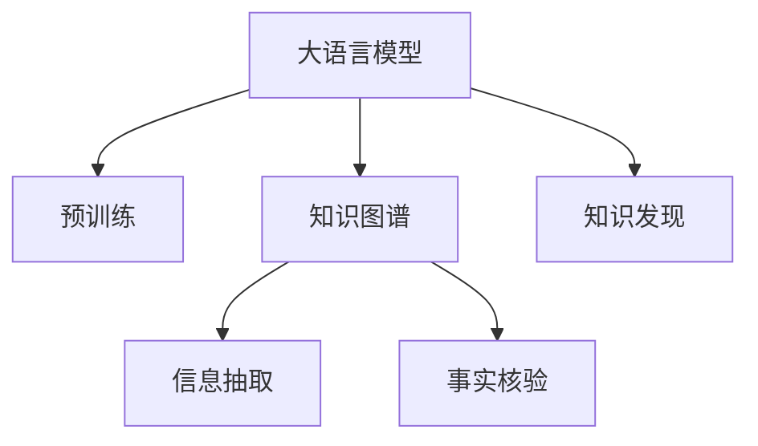

                 

# 大语言模型在知识发现中的应用

> 关键词：大语言模型,知识发现,知识图谱,信息抽取,自然语言处理(NLP)

## 1. 背景介绍

### 1.1 问题由来
近年来，随着人工智能技术的迅猛发展，大语言模型(Large Language Models, LLMs)在自然语言处理(Natural Language Processing, NLP)领域取得了突破性进展。LLMs通过在大规模无标签文本语料上预训练，学习到丰富的语言知识和语义表示。然而，预训练模型往往缺乏对特定领域知识的结构化表达能力，难以直接用于知识发现(Knowledge Discovery, KD)任务。

### 1.2 问题核心关键点
知识发现是大数据时代的重要应用场景之一，旨在从大量文本数据中自动提取和组织出结构化的知识，以服务于知识图谱构建、信息抽取、事实核验等多个领域。大语言模型通过预训练获得了强大的语言表示能力，但在知识发现过程中需要进一步扩展其语义理解能力，才能发挥更大的价值。

当前，知识发现技术主要基于规则、统计和机器学习等多种手段，依赖领域专家的知识积累。然而，这些方法在处理大规模数据时，容易出现知识漏洞和更新不及时等问题。而大语言模型能够自动学习各类知识表示，有望实现更高效、更全面的知识发现。

### 1.3 问题研究意义
大语言模型在知识发现领域的应用，能够提升知识获取的效率和准确性，拓宽知识发现的应用场景，同时推动NLP技术向更广泛的应用领域扩展。具体而言：

1. **提升知识图谱构建效率**：大语言模型能够自动从文本数据中提取和验证实体、关系等知识元素，加速知识图谱的构建。
2. **促进信息抽取与融合**：能够自动识别并抽取文档中的关键信息，并与其他数据源进行融合，形成更全面的信息视图。
3. **支持事实核验与验证**：通过比较不同数据源的信息，实现对同一事实的一致性验证，避免知识的错误传播。
4. **赋能智慧决策与分析**：知识发现技术可以帮助企业进行决策支持和数据分析，提升决策的智能化水平。
5. **辅助人工智能的各行各业落地**：知识图谱、信息抽取等技术，能够赋能更多行业领域，如金融、医疗、教育等，推动人工智能技术的产业化进程。

## 2. 核心概念与联系

### 2.1 核心概念概述

为了更好地理解大语言模型在知识发现中的应用，本节将介绍几个核心概念：

- 大语言模型(Large Language Model, LLM)：以自回归(如GPT)或自编码(如BERT)模型为代表的大规模预训练语言模型。通过在大规模无标签文本语料上进行预训练，学习到丰富的语言知识和语义表示。

- 知识发现(Knowledge Discovery, KD)：指从大量数据中自动提取、组织、验证和应用知识的过程。包括实体抽取、关系抽取、事实核验等子任务。

- 知识图谱(Knowledge Graph)：一种结构化的知识表示方式，用于存储实体和实体之间的关系，支持各类知识应用和服务。

- 信息抽取(Information Extraction, IE)：从非结构化文本中自动提取实体、关系等信息，生成结构化数据。

- 事实核验(Fact Verification)：对不同来源的事实信息进行一致性验证，判断其真实性。

这些核心概念之间的逻辑关系可以通过以下Mermaid流程图来展示：



这个流程图展示了大语言模型的核心概念及其之间的关系：

1. 大语言模型通过预训练获得基础能力。
2. 知识图谱是知识发现的输出，用于存储和表达结构化知识。
3. 信息抽取和事实核验是知识发现的具体子任务，负责从文本中抽取和验证知识。
4. 大语言模型在知识发现过程中，通过融合信息抽取和事实核验的输出，进一步提炼和构建知识图谱。

## 3. 核心算法原理 & 具体操作步骤

### 3.1 算法原理概述

大语言模型在知识发现中的应用，本质上是一种基于自监督学习的信息抽取和知识验证方法。其核心思想是：利用大语言模型的语言理解能力，自动从文本中提取和验证实体、关系等知识元素，并构建知识图谱，辅助各类知识应用和服务。

形式化地，假设大语言模型为 $M_{\theta}$，其中 $\theta$ 为预训练得到的模型参数。给定知识发现任务 $T$ 的标注数据集 $D=\{(x_i, y_i)\}_{i=1}^N$，知识发现的优化目标是最小化经验风险，即找到最优参数：

$$
\theta^* = \mathop{\arg\min}_{\theta} \mathcal{L}(M_{\theta},D)
$$

其中 $\mathcal{L}$ 为针对任务 $T$ 设计的损失函数，用于衡量模型预测输出与真实标签之间的差异。常见的损失函数包括交叉熵损失、F1分数损失等。

### 3.2 算法步骤详解

大语言模型在知识发现中的应用，通常包括以下几个关键步骤：

**Step 1: 准备预训练模型和数据集**
- 选择合适的预训练语言模型 $M_{\theta}$ 作为初始化参数，如 BERT、GPT等。
- 准备知识发现任务 $T$ 的标注数据集 $D$，划分为训练集、验证集和测试集。一般要求标注数据与预训练数据的分布不要差异过大。

**Step 2: 设计知识发现任务**
- 根据知识发现任务的类型，设计合适的信息抽取和事实核验任务，并构建训练样本。例如，针对实体抽取任务，可以使用命名实体识别(NER)数据集进行训练。

**Step 3: 微调大语言模型**
- 在预训练模型的基础上，使用知识发现任务的数据集 $D$ 进行有监督的微调，优化模型在特定任务上的性能。微调的目标函数通常为任务相关损失函数，如交叉熵损失。

**Step 4: 构建知识图谱**
- 使用微调后的模型，从大规模文本数据中自动抽取实体和关系，生成知识图谱。可以通过图数据库存储和管理知识图谱，支持各类知识应用和服务。

**Step 5: 知识图谱应用**
- 使用知识图谱辅助各类应用场景，如推荐系统、问答系统、决策支持等，提升应用的智能化水平。

### 3.3 算法优缺点

大语言模型在知识发现中的应用具有以下优点：
1. 自动抽取和验证知识：无需手动标注数据，能够高效自动化地提取文本中的实体和关系，减少人工成本。
2. 处理大规模数据：大语言模型能够处理海量文本数据，提升知识发现的速度和广度。
3. 鲁棒性较强：预训练模型对文本格式、语言风格等变化有较强的适应能力，能够处理多种多样化的文本数据。
4. 支持多种应用场景：适用于各类信息抽取、事实核验任务，构建知识图谱，辅助知识应用。

同时，该方法也存在一定的局限性：
1. 依赖高质量标注数据：微调性能依赖标注数据的质量和数量，高质量标注数据的获取成本较高。
2. 泛化能力有限：当目标任务与预训练数据的分布差异较大时，微调的性能提升有限。
3. 知识偏见问题：预训练模型可能学习到领域内的知识偏见，影响知识发现结果的公正性和准确性。
4. 可解释性不足：微调模型的决策过程通常缺乏可解释性，难以对其推理逻辑进行分析和调试。

尽管存在这些局限性，但就目前而言，基于大语言模型的知识发现方法仍然是大规模文本数据处理的重要范式。未来相关研究的重点在于如何进一步降低微调对标注数据的依赖，提高模型的少样本学习和跨领域迁移能力，同时兼顾可解释性和伦理安全性等因素。

### 3.4 算法应用领域

大语言模型在知识发现领域的应用非常广泛，包括但不限于以下几个方面：

- 医疗知识抽取：从医学文献、病历记录中自动抽取和验证各类医学知识，辅助临床决策和科研工作。
- 金融知识发现：从金融报告、新闻报道中抽取和验证财务、市场、风险等知识，支持投资策略和风险控制。
- 企业知识管理：从企业文档、邮件、社交媒体中抽取和验证各类商业知识，辅助知识管理与决策支持。
- 教育知识生成：从教材、论文、教育资源中自动抽取和验证各类教育知识，支持教学内容生成和学生辅助。
- 政府数据治理：从政府公开数据中自动抽取和验证各类公共信息，辅助政府数据管理和公共服务。

除了上述这些典型应用外，大语言模型还可以用于多种领域的知识发现和信息抽取任务，如法律、新闻、娱乐等，为各行各业提供新的智能化解决方案。

## 4. 数学模型和公式 & 详细讲解 & 举例说明

### 4.1 数学模型构建

本节将使用数学语言对大语言模型在知识发现中的应用进行更加严格的刻画。

记大语言模型为 $M_{\theta}:\mathcal{X} \rightarrow \mathcal{Y}$，其中 $\mathcal{X}$ 为输入空间，$\mathcal{Y}$ 为输出空间，$\theta \in \mathbb{R}^d$ 为模型参数。假设知识发现任务 $T$ 的训练集为 $D=\{(x_i,y_i)\}_{i=1}^N, x_i \in \mathcal{X}, y_i \in \mathcal{Y}$。

定义模型 $M_{\theta}$ 在输入 $x$ 上的损失函数为 $\ell(M_{\theta}(x),y)$，则在数据集 $D$ 上的经验风险为：

$$
\mathcal{L}(\theta) = \frac{1}{N} \sum_{i=1}^N \ell(M_{\theta}(x_i),y_i)
$$

其中 $\ell$ 为任务相关的损失函数，如交叉熵损失、F1分数损失等。微调的优化目标是最小化经验风险，即找到最优参数：

$$
\theta^* = \mathop{\arg\min}_{\theta} \mathcal{L}(\theta)
$$

在实践中，我们通常使用基于梯度的优化算法（如SGD、Adam等）来近似求解上述最优化问题。设 $\eta$ 为学习率，$\lambda$ 为正则化系数，则参数的更新公式为：

$$
\theta \leftarrow \theta - \eta \nabla_{\theta}\mathcal{L}(\theta) - \eta\lambda\theta
$$

其中 $\nabla_{\theta}\mathcal{L}(\theta)$ 为损失函数对参数 $\theta$ 的梯度，可通过反向传播算法高效计算。

### 4.2 公式推导过程

以下我们以实体抽取任务为例，推导基于大语言模型的信息抽取方法。

假设模型 $M_{\theta}$ 在输入 $x$ 上的输出为 $\hat{y}=M_{\theta}(x) \in [0,1]$，表示样本中是否包含目标实体。真实标签 $y \in \{0,1\}$。则二分类交叉熵损失函数定义为：

$$
\ell(M_{\theta}(x),y) = -[y\log \hat{y} + (1-y)\log (1-\hat{y})]
$$

将其代入经验风险公式，得：

$$
\mathcal{L}(\theta) = -\frac{1}{N}\sum_{i=1}^N [y_i\log M_{\theta}(x_i)+(1-y_i)\log(1-M_{\theta}(x_i))]
$$

根据链式法则，损失函数对参数 $\theta_k$ 的梯度为：

$$
\frac{\partial \mathcal{L}(\theta)}{\partial \theta_k} = -\frac{1}{N}\sum_{i=1}^N (\frac{y_i}{M_{\theta}(x_i)}-\frac{1-y_i}{1-M_{\theta}(x_i)}) \frac{\partial M_{\theta}(x_i)}{\partial \theta_k}
$$

其中 $\frac{\partial M_{\theta}(x_i)}{\partial \theta_k}$ 可进一步递归展开，利用自动微分技术完成计算。

在得到损失函数的梯度后，即可带入参数更新公式，完成模型的迭代优化。重复上述过程直至收敛，最终得到适应知识发现任务的最优模型参数 $\theta^*$。

### 4.3 案例分析与讲解

为了更好地理解大语言模型在知识发现中的数学模型和公式推导，以下我们通过一个具体案例进行详细讲解。

假设我们希望从医疗领域的大量医学文献中抽取和验证医疗实体，如医生、疾病、药物等。具体步骤如下：

1. **数据准备**：收集医疗领域的标注数据集，包括医生、疾病、药物等实体的文本数据。将标注数据分为训练集、验证集和测试集。
2. **模型选择**：选择BERT或GPT等大语言模型作为预训练模型，用于提取文本中的实体信息。
3. **微调训练**：在预训练模型的基础上，使用标注数据集进行微调，优化模型在实体抽取任务上的性能。微调的目标函数为交叉熵损失函数。
4. **实体抽取**：使用微调后的模型，输入医学文献，自动抽取其中的实体信息，如医生名、疾病名、药物名等。
5. **结果验证**：将抽取的实体信息与标注数据进行对比，评估模型的准确率、召回率、F1分数等指标，以衡量模型的性能。

通过以上步骤，我们可以自动从大量医疗文献中抽取和验证各类实体信息，为医疗知识图谱构建、临床决策支持等应用提供数据支持。

## 5. 项目实践：代码实例和详细解释说明

### 5.1 开发环境搭建

在进行知识发现实践前，我们需要准备好开发环境。以下是使用Python进行PyTorch开发的环境配置流程：

1. 安装Anaconda：从官网下载并安装Anaconda，用于创建独立的Python环境。

2. 创建并激活虚拟环境：
```bash
conda create -n pytorch-env python=3.8 
conda activate pytorch-env
```

3. 安装PyTorch：根据CUDA版本，从官网获取对应的安装命令。例如：
```bash
conda install pytorch torchvision torchaudio cudatoolkit=11.1 -c pytorch -c conda-forge
```

4. 安装Transformers库：
```bash
pip install transformers
```

5. 安装各类工具包：
```bash
pip install numpy pandas scikit-learn matplotlib tqdm jupyter notebook ipython
```

完成上述步骤后，即可在`pytorch-env`环境中开始知识发现实践。

### 5.2 源代码详细实现

下面我们以实体抽取任务为例，给出使用Transformers库对BERT模型进行微调的PyTorch代码实现。

首先，定义实体抽取任务的数据处理函数：

```python
from transformers import BertTokenizer
from torch.utils.data import Dataset
import torch

class BIOERDataset(Dataset):
    def __init__(self, texts, tags, tokenizer, max_len=128):
        self.texts = texts
        self.tags = tags
        self.tokenizer = tokenizer
        self.max_len = max_len
        
    def __len__(self):
        return len(self.texts)
    
    def __getitem__(self, item):
        text = self.texts[item]
        tags = self.tags[item]
        
        encoding = self.tokenizer(text, return_tensors='pt', max_length=self.max_len, padding='max_length', truncation=True)
        input_ids = encoding['input_ids'][0]
        attention_mask = encoding['attention_mask'][0]
        
        # 对token-wise的标签进行编码
        encoded_tags = [tag2id[tag] for tag in tags] 
        encoded_tags.extend([tag2id['O']] * (self.max_len - len(encoded_tags)))
        labels = torch.tensor(encoded_tags, dtype=torch.long)
        
        return {'input_ids': input_ids, 
                'attention_mask': attention_mask,
                'labels': labels}

# 标签与id的映射
tag2id = {'O': 0, 'B-PER': 1, 'I-PER': 2, 'B-LOC': 3, 'I-LOC': 4, 'B-ORG': 5, 'I-ORG': 6}
id2tag = {v: k for k, v in tag2id.items()}

# 创建dataset
tokenizer = BertTokenizer.from_pretrained('bert-base-cased')

train_dataset = BIOERDataset(train_texts, train_tags, tokenizer)
dev_dataset = BIOERDataset(dev_texts, dev_tags, tokenizer)
test_dataset = BIOERDataset(test_texts, test_tags, tokenizer)
```

然后，定义模型和优化器：

```python
from transformers import BertForTokenClassification, AdamW

model = BertForTokenClassification.from_pretrained('bert-base-cased', num_labels=len(tag2id))

optimizer = AdamW(model.parameters(), lr=2e-5)
```

接着，定义训练和评估函数：

```python
from torch.utils.data import DataLoader
from tqdm import tqdm
from sklearn.metrics import classification_report

device = torch.device('cuda') if torch.cuda.is_available() else torch.device('cpu')
model.to(device)

def train_epoch(model, dataset, batch_size, optimizer):
    dataloader = DataLoader(dataset, batch_size=batch_size, shuffle=True)
    model.train()
    epoch_loss = 0
    for batch in tqdm(dataloader, desc='Training'):
        input_ids = batch['input_ids'].to(device)
        attention_mask = batch['attention_mask'].to(device)
        labels = batch['labels'].to(device)
        model.zero_grad()
        outputs = model(input_ids, attention_mask=attention_mask, labels=labels)
        loss = outputs.loss
        epoch_loss += loss.item()
        loss.backward()
        optimizer.step()
    return epoch_loss / len(dataloader)

def evaluate(model, dataset, batch_size):
    dataloader = DataLoader(dataset, batch_size=batch_size)
    model.eval()
    preds, labels = [], []
    with torch.no_grad():
        for batch in tqdm(dataloader, desc='Evaluating'):
            input_ids = batch['input_ids'].to(device)
            attention_mask = batch['attention_mask'].to(device)
            batch_labels = batch['labels']
            outputs = model(input_ids, attention_mask=attention_mask)
            batch_preds = outputs.logits.argmax(dim=2).to('cpu').tolist()
            batch_labels = batch_labels.to('cpu').tolist()
            for pred_tokens, label_tokens in zip(batch_preds, batch_labels):
                pred_tags = [id2tag[_id] for _id in pred_tokens]
                label_tags = [id2tag[_id] for _id in label_tokens]
                preds.append(pred_tags[:len(label_tags)])
                labels.append(label_tags)
                
    print(classification_report(labels, preds))
```

最后，启动训练流程并在测试集上评估：

```python
epochs = 5
batch_size = 16

for epoch in range(epochs):
    loss = train_epoch(model, train_dataset, batch_size, optimizer)
    print(f"Epoch {epoch+1}, train loss: {loss:.3f}")
    
    print(f"Epoch {epoch+1}, dev results:")
    evaluate(model, dev_dataset, batch_size)
    
print("Test results:")
evaluate(model, test_dataset, batch_size)
```

以上就是使用PyTorch对BERT进行实体抽取任务微调的完整代码实现。可以看到，得益于Transformers库的强大封装，我们可以用相对简洁的代码完成BERT模型的加载和微调。

### 5.3 代码解读与分析

让我们再详细解读一下关键代码的实现细节：

**BIOERDataset类**：
- `__init__`方法：初始化文本、标签、分词器等关键组件。
- `__len__`方法：返回数据集的样本数量。
- `__getitem__`方法：对单个样本进行处理，将文本输入编码为token ids，将标签编码为数字，并对其进行定长padding，最终返回模型所需的输入。

**tag2id和id2tag字典**：
- 定义了标签与数字id之间的映射关系，用于将token-wise的预测结果解码回真实的标签。

**训练和评估函数**：
- 使用PyTorch的DataLoader对数据集进行批次化加载，供模型训练和推理使用。
- 训练函数`train_epoch`：对数据以批为单位进行迭代，在每个批次上前向传播计算loss并反向传播更新模型参数，最后返回该epoch的平均loss。
- 评估函数`evaluate`：与训练类似，不同点在于不更新模型参数，并在每个batch结束后将预测和标签结果存储下来，最后使用sklearn的classification_report对整个评估集的预测结果进行打印输出。

**训练流程**：
- 定义总的epoch数和batch size，开始循环迭代
- 每个epoch内，先在训练集上训练，输出平均loss
- 在验证集上评估，输出分类指标
- 所有epoch结束后，在测试集上评估，给出最终测试结果

可以看到，PyTorch配合Transformers库使得BERT微调的代码实现变得简洁高效。开发者可以将更多精力放在数据处理、模型改进等高层逻辑上，而不必过多关注底层的实现细节。

当然，工业级的系统实现还需考虑更多因素，如模型的保存和部署、超参数的自动搜索、更灵活的任务适配层等。但核心的微调范式基本与此类似。

## 6. 实际应用场景

### 6.1 医疗知识图谱构建

在医疗领域，知识图谱的构建是提升医疗服务智能化水平的重要手段。传统上，医疗知识图谱的构建依赖于领域专家的知识和经验，工作量大且效率低。而基于大语言模型的知识发现技术，可以自动从医学文献、病历记录中抽取和验证各类医疗实体和关系，大幅提升知识图谱构建的效率和质量。

具体而言，可以收集大量的医学文献和病历记录，将其作为标注数据集，训练BERT等大语言模型进行实体抽取和关系抽取。抽取出的医疗实体和关系，可以进一步整合到知识图谱中，支持临床决策、疾病预测、治疗方案推荐等应用。

### 6.2 金融知识管理

金融领域数据量大、复杂度高，需要快速准确地从海量数据中提取和验证各类知识。基于大语言模型的知识发现技术，能够从金融报告、新闻报道中自动抽取和验证财务、市场、风险等知识，支持投资策略和风险控制。

例如，可以使用BERT模型对金融新闻进行实体抽取和关系抽取，自动生成金融事件图谱，帮助分析师快速掌握市场动态，优化投资决策。

### 6.3 企业文档管理

在企业运营过程中，文档管理是一个重要的环节。企业文档通常包含大量的组织知识，需要自动化的抽取和整合。基于大语言模型的知识发现技术，可以从企业文档、邮件、社交媒体中自动抽取和验证各类商业知识，支持知识管理与决策支持。

例如，可以训练BERT模型对企业文档进行实体抽取和关系抽取，自动生成企业知识图谱，支持组织信息管理、项目管理、决策支持等应用。

### 6.4 教育知识生成

教育领域需要大量的知识资源，传统的教育资源管理依赖于人工标注和分类，工作量大且容易出错。基于大语言模型的知识发现技术，能够自动从教材、论文、教育资源中抽取和验证各类教育知识，支持教学内容生成和学生辅助。

例如，可以训练BERT模型对教育资源进行实体抽取和关系抽取，自动生成教育知识图谱，支持智能教材推荐、学习路径规划、学生辅助学习等应用。

### 6.5 智慧城市治理

智慧城市治理需要快速准确地从各类数据源中抽取和验证各类公共信息，支持城市事件监测、舆情分析、应急指挥等环节。基于大语言模型的知识发现技术，能够从政府公开数据、社交媒体、新闻报道中自动抽取和验证各类公共信息，提升城市治理的智能化水平。

例如，可以训练BERT模型对社交媒体和新闻报道进行实体抽取和关系抽取，自动生成城市事件图谱，支持城市事件监测、舆情分析、应急指挥等应用。

## 7. 工具和资源推荐

### 7.1 学习资源推荐

为了帮助开发者系统掌握大语言模型在知识发现中的应用理论基础和实践技巧，这里推荐一些优质的学习资源：

1. 《Transformer从原理到实践》系列博文：由大模型技术专家撰写，深入浅出地介绍了Transformer原理、BERT模型、知识发现等前沿话题。

2. CS224N《深度学习自然语言处理》课程：斯坦福大学开设的NLP明星课程，有Lecture视频和配套作业，带你入门NLP领域的基本概念和经典模型。

3. 《Natural Language Processing with Transformers》书籍：Transformers库的作者所著，全面介绍了如何使用Transformers库进行NLP任务开发，包括知识发现在内的诸多范式。

4. HuggingFace官方文档：Transformers库的官方文档，提供了海量预训练模型和完整的知识发现样例代码，是上手实践的必备资料。

5. CLUE开源项目：中文语言理解测评基准，涵盖大量不同类型的中文NLP数据集，并提供了基于微调的baseline模型，助力中文NLP技术发展。

通过对这些资源的学习实践，相信你一定能够快速掌握大语言模型在知识发现中的应用精髓，并用于解决实际的NLP问题。
###  7.2 开发工具推荐

高效的开发离不开优秀的工具支持。以下是几款用于大语言模型知识发现开发的常用工具：

1. PyTorch：基于Python的开源深度学习框架，灵活动态的计算图，适合快速迭代研究。大部分预训练语言模型都有PyTorch版本的实现。

2. TensorFlow：由Google主导开发的开源深度学习框架，生产部署方便，适合大规模工程应用。同样有丰富的预训练语言模型资源。

3. Transformers库：HuggingFace开发的NLP工具库，集成了众多SOTA语言模型，支持PyTorch和TensorFlow，是进行知识发现任务开发的利器。

4. Weights & Biases：模型训练的实验跟踪工具，可以记录和可视化模型训练过程中的各项指标，方便对比和调优。与主流深度学习框架无缝集成。

5. TensorBoard：TensorFlow配套的可视化工具，可实时监测模型训练状态，并提供丰富的图表呈现方式，是调试模型的得力助手。

6. Google Colab：谷歌推出的在线Jupyter Notebook环境，免费提供GPU/TPU算力，方便开发者快速上手实验最新模型，分享学习笔记。

合理利用这些工具，可以显著提升大语言模型知识发现的开发效率，加快创新迭代的步伐。

### 7.3 相关论文推荐

大语言模型和知识发现技术的发展源于学界的持续研究。以下是几篇奠基性的相关论文，推荐阅读：

1. Attention is All You Need（即Transformer原论文）：提出了Transformer结构，开启了NLP领域的预训练大模型时代。

2. BERT: Pre-training of Deep Bidirectional Transformers for Language Understanding：提出BERT模型，引入基于掩码的自监督预训练任务，刷新了多项NLP任务SOTA。

3. Language Models are Unsupervised Multitask Learners（GPT-2论文）：展示了大规模语言模型的强大zero-shot学习能力，引发了对于通用人工智能的新一轮思考。

4. Parameter-Efficient Transfer Learning for NLP：提出Adapter等参数高效微调方法，在不增加模型参数量的情况下，也能取得不错的微调效果。

5. Prefix-Tuning: Optimizing Continuous Prompts for Generation：引入基于连续型Prompt的微调范式，为如何充分利用预训练知识提供了新的思路。

6. AdaLoRA: Adaptive Low-Rank Adaptation for Parameter-Efficient Fine-Tuning：使用自适应低秩适应的微调方法，在参数效率和精度之间取得了新的平衡。

这些论文代表了大语言模型知识发现技术的发展脉络。通过学习这些前沿成果，可以帮助研究者把握学科前进方向，激发更多的创新灵感。

## 8. 总结：未来发展趋势与挑战

### 8.1 总结

本文对大语言模型在知识发现中的应用进行了全面系统的介绍。首先阐述了大语言模型和知识发现的研究背景和意义，明确了知识发现技术在人工智能时代的重要地位。其次，从原理到实践，详细讲解了大语言模型在知识发现中的应用流程和方法，给出了知识发现任务开发的完整代码实例。同时，本文还广泛探讨了知识发现技术在医疗、金融、企业、教育、城市治理等各个领域的应用前景，展示了知识发现技术的巨大潜力。

通过本文的系统梳理，可以看到，大语言模型在知识发现领域的应用正处于快速发展阶段，有望提升各类应用场景的智能化水平。未来，伴随大语言模型和知识发现技术的不断进步，基于知识图谱构建、信息抽取、事实核验等技术，将进一步拓展人工智能技术在各行各业的应用边界，推动智慧社会的构建。

### 8.2 未来发展趋势

展望未来，大语言模型在知识发现领域的应用将呈现以下几个发展趋势：

1. **多模态知识发现**：未来的知识发现将更多地融合视觉、语音、文本等多种模态数据，构建多模态知识图谱，提升知识表示的全面性和多样性。

2. **自适应知识发现**：大语言模型将能够根据任务的复杂度、数据量等因素，自动调整模型的参数和训练策略，提高知识发现的效率和效果。

3. **零样本和少样本学习**：通过精巧的Prompt设计，大语言模型将能够在不进行有标注数据训练的情况下，实现零样本和少样本学习，拓展知识发现的应用场景。

4. **跨领域知识迁移**：大语言模型将能够更好地进行跨领域知识迁移，实现知识在不同领域之间的推广和应用，提高知识发现的泛化能力。

5. **知识图谱智能化**：通过增强学习的理念，知识图谱将能够自我优化和迭代更新，保持知识的时效性和准确性，提升知识应用的智能化水平。

6. **知识推理与生成**：结合常识推理和生成对抗网络等技术，知识发现模型将能够自动推导出新的知识，生成更有价值的知识表示，推动知识发现技术的智能化和自动化。

以上趋势凸显了大语言模型在知识发现领域的应用前景。这些方向的探索发展，必将进一步提升知识发现技术的性能和应用范围，为人工智能技术在各行各业的应用奠定坚实的基础。

### 8.3 面临的挑战

尽管大语言模型在知识发现领域的应用取得了显著进展，但在迈向更加智能化、普适化应用的过程中，仍面临诸多挑战：

1. **数据获取难度**：知识发现技术依赖于大规模高质量标注数据，而获取这些数据往往需要耗费大量人力和时间。如何降低数据获取难度，是当前亟需解决的问题。

2. **模型泛化能力**：大语言模型在处理特定领域知识时，可能存在泛化能力不足的问题。如何在通用领域预训练与特定领域微调之间找到平衡，是未来研究的重要方向。

3. **知识偏见问题**：预训练模型可能学习到领域内的知识偏见，影响知识发现结果的公正性和准确性。如何消除模型偏见，避免有害信息的传播，是亟需关注的问题。

4. **推理效率问题**：大语言模型在推理阶段可能面临计算资源消耗大的问题。如何优化推理流程，提高计算效率，是知识发现技术在实际应用中的关键挑战。

5. **知识更新与迭代**：知识图谱和知识库需要不断更新，以保持知识的时效性和准确性。如何在知识发现过程中实现动态更新和迭代，是未来研究的重要方向。

6. **伦理与安全性**：知识发现技术涉及大量敏感信息，如何确保数据隐私和模型安全性，是亟需解决的问题。

正视知识发现面临的这些挑战，积极应对并寻求突破，将是大语言模型知识发现技术迈向成熟的重要步骤。相信随着学界和产业界的共同努力，这些挑战终将一一被克服，知识发现技术必将在构建智慧社会中发挥更大的作用。

### 8.4 研究展望

面对知识发现所面临的挑战，未来的研究需要在以下几个方面寻求新的突破：

1. **无监督与半监督知识发现**：探索无监督和半监督学习方法，摆脱对大规模标注数据的依赖，利用自监督学习、主动学习等方法，最大化利用非结构化数据，实现高效的知识发现。

2. **多模态知识发现**：研究多模态数据融合技术，将视觉、语音、文本等多种模态信息融合到知识发现过程中，构建多模态知识图谱。

3. **自适应知识发现**：开发自适应知识发现方法，根据任务的复杂度和数据量，自动调整模型的参数和训练策略，提升知识发现的效率和效果。

4. **零样本与少样本学习**：研究零样本和少样本学习方法，通过巧妙的Prompt设计，实现高效的知识发现。

5. **跨领域知识迁移**：研究跨领域知识迁移技术，实现知识在不同领域之间的推广和应用，提升知识发现的泛化能力。

6. **知识图谱智能化**：研究知识图谱智能化方法，通过增强学习的理念，实现知识图谱的自我优化和迭代更新。

7. **知识推理与生成**：研究知识推理与生成技术，结合常识推理和生成对抗网络等方法，自动推导出新的知识，生成更有价值的知识表示。

8. **数据隐私与安全性**：研究数据隐私保护和模型安全性技术，确保知识发现过程中的数据隐私和模型安全。

这些研究方向的探索，必将引领知识发现技术迈向更高的台阶，为构建智慧社会提供更强大的技术支撑。面向未来，知识发现技术还需要与其他人工智能技术进行更深入的融合，如知识表示、因果推理、强化学习等，多路径协同发力，共同推动智慧社会的构建。只有勇于创新、敢于突破，才能不断拓展知识发现的边界，让人工智能技术更好地造福人类社会。

## 9. 附录：常见问题与解答

**Q1：什么是知识发现？**

A: 知识发现(Knowledge Discovery, KD)是从大量数据中自动提取、组织、验证和应用知识的过程。包括实体抽取、关系抽取、事实核验等子任务。

**Q2：大语言模型如何应用于知识发现？**

A: 大语言模型通过预训练学习到丰富的语言知识和语义表示，在知识发现任务中可以自动从文本中抽取和验证实体、关系等知识元素，构建知识图谱，辅助各类知识应用和服务。

**Q3：知识发现技术面临的主要挑战有哪些？**

A: 知识发现技术面临的主要挑战包括数据获取难度、模型泛化能力不足、知识偏见问题、推理效率问题、知识更新与迭代、伦理与安全性等。

**Q4：未来知识发现技术的发展方向是什么？**

A: 未来知识发现技术的发展方向包括多模态知识发现、自适应知识发现、零样本和少样本学习、跨领域知识迁移、知识图谱智能化、知识推理与生成、数据隐私与安全性等。

通过这些研究方向的探索，知识发现技术必将在构建智慧社会中发挥更大的作用，推动人工智能技术的普及和应用。

---

作者：禅与计算机程序设计艺术 / Zen and the Art of Computer Programming

