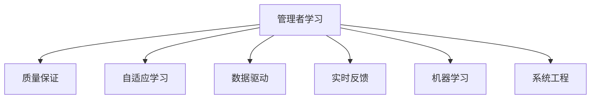

                 

# 大量输出:管理者学习质量的保证

> 关键词：
1. 管理者学习
2. 质量保证
3. 自适应学习
4. 数据驱动
5. 实时反馈
6. 机器学习
7. 系统工程

## 1. 背景介绍

### 1.1 问题由来
在现代企业中，管理者的角色日益重要。管理者不仅需要具备深厚的专业知识，还需要具备全面的决策能力、领导力和团队管理能力。然而，管理者的学习方式往往落后于时代的步伐，无法快速适应复杂多变的环境。如何帮助管理者高效学习，成为当前企业培训和教育领域的重要课题。

### 1.2 问题核心关键点
管理者学习质量的保证，是确保管理者获得有效知识和技能的核心问题。传统的管理者培训主要依赖面授课程和自学，存在效率低、互动少、反馈延迟等缺点。如何利用技术手段，提升学习效率、增强互动性、实时反馈学习效果，是本研究的关键点。

## 2. 核心概念与联系

### 2.1 核心概念概述

为了更好地理解管理者学习质量的保证方法，本节将介绍几个密切相关的核心概念：

- 管理者学习：指管理者通过系统化的学习活动，获取并提升专业知识、决策能力和领导力。
- 质量保证(Quality Assurance, QA)：指通过一系列标准、流程和技术手段，确保产品、服务、过程等的质量符合预期。
- 自适应学习(Adaptive Learning)：指根据学习者的特点、需求和反馈，动态调整学习内容和路径，最大化提升学习效果。
- 数据驱动(Data-Driven)：指通过收集、分析和应用数据，指导决策和行动，提高效率和效果。
- 实时反馈(Real-Time Feedback)：指在学习过程中，及时提供学习者的反馈信息，帮助其及时调整学习策略和方法。
- 机器学习(Machine Learning)：指利用算法和统计模型，通过数据学习规律和模式，实现预测、分类、聚类等功能。
- 系统工程(Systems Engineering)：指通过系统化的方法和技术手段，设计和实施复杂系统的开发、部署和维护。

这些核心概念之间的逻辑关系可以通过以下Mermaid流程图来展示：



这个流程图展示了这个学习质量保证方法的关键环节和概念关系：

1. 管理者学习是整个学习过程的起点。
2. 质量保证方法保障学习效果符合预期。
3. 自适应学习使学习内容和方法动态调整，最大化提升学习效果。
4. 数据驱动基于数据指导学习过程，提高效率和效果。
5. 实时反馈及时调整学习策略和方法，提高学习效果。
6. 机器学习分析学习数据，提供科学的决策支持。
7. 系统工程设计和实施学习管理系统，提供全面支持。

这些核心概念共同构成了管理者学习质量保证方法的理论框架，使得管理者学习更具针对性和有效性。

## 3. 核心算法原理 & 具体操作步骤
### 3.1 算法原理概述

管理者学习质量保证方法，本质上是一种基于数据驱动和机器学习的学习系统。其核心思想是通过收集学习者的行为数据和反馈信息，利用机器学习算法分析学习效果，实时调整学习路径和方法，最终实现高效、个性化的学习过程。

形式化地，假设学习者的行为数据为 $X$，反馈信息为 $Y$，学习路径为 $P$，目标为 $T$。学习质量保证方法的目标是找到最优的路径 $P^*$，使得：

$$
P^* = \mathop{\arg\min}_{P} \mathcal{L}(P, T)
$$

其中 $\mathcal{L}$ 为损失函数，衡量路径 $P$ 与目标 $T$ 之间的差距。常见的损失函数包括交叉熵损失、均方误差损失等。

通过梯度下降等优化算法，学习质量保证方法不断更新学习路径 $P$，最小化损失函数 $\mathcal{L}$，使得学习路径逼近目标路径 $T$。由于 $P$ 已经通过学习者的行为和反馈获得了一定的初始化，因此即便在小规模数据集 $X$ 和 $Y$ 上进行学习，也能较快收敛到理想的学习路径 $P^*$。

### 3.2 算法步骤详解

管理者学习质量保证方法一般包括以下几个关键步骤：

**Step 1: 准备数据和模型**
- 收集学习者的行为数据和反馈信息，如学习时间、完成作业情况、测试成绩等。
- 选择适合的管理者学习场景的机器学习模型，如决策树、随机森林、神经网络等。

**Step 2: 设计学习路径**
- 根据学习者的特点和需求，设计合适的学习路径。如基础知识、实践技能、软技能等模块的学习顺序和权重。
- 利用已有的学习数据，训练模型，预测最优学习路径。

**Step 3: 实时监控和调整**
- 在学习过程中，实时收集学习者的行为数据和反馈信息。
- 根据实时数据和反馈信息，动态调整学习路径和方法。如增加学习内容、调整学习节奏、推荐学习资源等。

**Step 4: 评估学习效果**
- 根据学习者的最终成绩和反馈信息，评估学习效果。
- 利用评估结果，更新模型参数，进一步优化学习路径。

**Step 5: 输出学习报告**
- 根据学习路径和效果，输出学习报告，供管理者参考。
- 根据报告中的建议，管理者可以调整学习策略，改进学习方法。

以上是基于数据驱动的管理者学习质量保证方法的一般流程。在实际应用中，还需要针对具体学习场景，对各个环节进行优化设计，如改进数据采集和分析方法，引入更多反馈机制，搜索最优的超参数组合等，以进一步提升学习效果。

### 3.3 算法优缺点

管理者学习质量保证方法具有以下优点：
1. 高效性。通过实时反馈和动态调整，最大化提升学习效率。
2. 个性化。根据学习者的特点和需求，设计个性化的学习路径，提高学习效果。
3. 数据驱动。基于学习数据，提供科学的决策支持，减少主观判断。
4. 实时性。及时调整学习路径和方法，使学习者始终处于最佳状态。

同时，该方法也存在一定的局限性：
1. 依赖数据。学习效果依赖于学习者的行为数据和反馈信息，难以覆盖所有学习情境。
2. 模型复杂。需要选择合适的机器学习模型，并对其参数进行调优，可能涉及较高的技术门槛。
3. 反馈延迟。对于某些学习情境，实时反馈可能存在延迟，影响学习效果。
4. 数据隐私。学习数据可能涉及个人隐私，需要妥善保护。

尽管存在这些局限性，但就目前而言，基于数据驱动的管理者学习质量保证方法仍是一种高效、个性化的学习手段。未来相关研究的重点在于如何进一步降低数据采集的难度，提高模型的泛化能力，同时兼顾数据隐私和反馈及时性等因素。

### 3.4 算法应用领域

基于数据驱动的管理者学习质量保证方法，在企业管理和培训领域已经得到了广泛的应用，覆盖了从新员工培训到高层管理者能力提升等多个方面，如：

- 新员工入职培训：通过实时反馈和动态调整，帮助新员工快速掌握基础知识和技能。
- 中层管理者领导力培训：利用数据驱动，评估领导力水平，提供科学的改进建议。
- 高层管理者决策能力培训：通过机器学习模型，分析决策过程，提供优化建议。
- 团队协作和沟通培训：利用实时反馈，改进团队协作和沟通方法。
- 战略管理和创新培训：通过个性化学习路径，提升战略管理和创新能力。

除了上述这些经典应用外，管理者学习质量保证方法也被创新性地应用到更多场景中，如跨文化管理培训、危机管理培训等，为企业管理培训提供了新的解决方案。

## 4. 数学模型和公式 & 详细讲解  
### 4.1 数学模型构建

本节将使用数学语言对管理者学习质量保证方法的数学模型进行更加严格的刻画。

记学习者的行为数据为 $X$，反馈信息为 $Y$，学习路径为 $P$，目标为 $T$。定义学习路径 $P$ 在数据样本 $(x,y)$ 上的损失函数为 $\ell(P(x),y)$，则在数据集 $D$ 上的经验风险为：

$$
\mathcal{L}(P) = \frac{1}{N} \sum_{i=1}^N \ell(P(x_i),y_i)
$$

其中 $\ell$ 为损失函数，衡量路径 $P$ 与目标 $T$ 之间的差距。常见的损失函数包括交叉熵损失、均方误差损失等。

学习质量保证方法的目标是最小化经验风险，即找到最优路径 $P^*$：

$$
P^* = \mathop{\arg\min}_{P} \mathcal{L}(P)
$$

在实践中，我们通常使用基于梯度的优化算法（如SGD、Adam等）来近似求解上述最优化问题。设 $\eta$ 为学习率，$\lambda$ 为正则化系数，则参数的更新公式为：

$$
P \leftarrow P - \eta \nabla_{P}\mathcal{L}(P) - \eta\lambda P
$$

其中 $\nabla_{P}\mathcal{L}(P)$ 为损失函数对路径 $P$ 的梯度，可通过反向传播算法高效计算。

### 4.2 公式推导过程

以下我们以决策树算法为例，推导路径优化模型的梯度计算公式。

假设学习路径为决策树模型 $T_{\theta}$，其中 $\theta$ 为模型参数。假设学习者的行为数据为 $X=\{(x_i,y_i)\}_{i=1}^N$。

决策树模型的预测路径为 $T_{\theta}(x)$，预测路径与目标路径之间的差距为损失函数 $\ell(T_{\theta}(x),y)$。则在数据集 $D$ 上的经验风险为：

$$
\mathcal{L}(\theta) = \frac{1}{N} \sum_{i=1}^N \ell(T_{\theta}(x_i),y_i)
$$

根据链式法则，损失函数对模型参数 $\theta_k$ 的梯度为：

$$
\frac{\partial \mathcal{L}(\theta)}{\partial \theta_k} = -\frac{1}{N}\sum_{i=1}^N (\frac{\partial \ell(T_{\theta}(x_i),y_i)}{\partial T_{\theta}(x_i)} \frac{\partial T_{\theta}(x_i)}{\partial \theta_k}
$$

其中 $\frac{\partial T_{\theta}(x_i)}{\partial \theta_k}$ 可进一步递归展开，利用自动微分技术完成计算。

在得到损失函数的梯度后，即可带入路径更新公式，完成模型的迭代优化。重复上述过程直至收敛，最终得到适应学习者的最优路径 $P^*$。

## 5. 项目实践：代码实例和详细解释说明
### 5.1 开发环境搭建

在进行管理者学习质量保证方法的实践前，我们需要准备好开发环境。以下是使用Python进行PyTorch开发的环境配置流程：

1. 安装Anaconda：从官网下载并安装Anaconda，用于创建独立的Python环境。

2. 创建并激活虚拟环境：
```bash
conda create -n pytorch-env python=3.8 
conda activate pytorch-env
```

3. 安装PyTorch：根据CUDA版本，从官网获取对应的安装命令。例如：
```bash
conda install pytorch torchvision torchaudio cudatoolkit=11.1 -c pytorch -c conda-forge
```

4. 安装TensorFlow：
```bash
pip install tensorflow
```

5. 安装各类工具包：
```bash
pip install numpy pandas scikit-learn matplotlib tqdm jupyter notebook ipython
```

完成上述步骤后，即可在`pytorch-env`环境中开始管理者学习质量保证方法的实践。

### 5.2 源代码详细实现

下面我以决策树算法为例，给出使用PyTorch进行管理者学习路径优化的PyTorch代码实现。

首先，定义决策树模型的预测函数：

```python
from torch import nn
import torch

class DecisionTree(nn.Module):
    def __init__(self, num_features):
        super(DecisionTree, self).__init__()
        self.num_features = num_features
        self.tree = nn.Linear(num_features, 1)

    def forward(self, x):
        x = self.tree(x)
        return torch.sigmoid(x)
```

然后，定义模型训练和评估函数：

```python
from torch.utils.data import Dataset, DataLoader
from torch.optim import Adam
from sklearn.metrics import accuracy_score

class ManagementLearningDataset(Dataset):
    def __init__(self, features, labels):
        self.features = features
        self.labels = labels

    def __len__(self):
        return len(self.features)

    def __getitem__(self, idx):
        return self.features[idx], self.labels[idx]

class ManagementLearningModel(nn.Module):
    def __init__(self, num_features):
        super(ManagementLearningModel, self).__init__()
        self.tree = nn.Linear(num_features, 1)

    def forward(self, x):
        x = self.tree(x)
        return torch.sigmoid(x)

def train_model(model, train_dataset, optimizer, num_epochs):
    model.train()
    for epoch in range(num_epochs):
        for inputs, targets in train_dataset:
            optimizer.zero_grad()
            outputs = model(inputs)
            loss = nn.BCELoss()(outputs, targets)
            loss.backward()
            optimizer.step()

def evaluate_model(model, test_dataset):
    model.eval()
    test_loss = 0
    correct = 0
    with torch.no_grad():
        for inputs, targets in test_dataset:
            outputs = model(inputs)
            test_loss += nn.BCELoss()(outputs, targets).item()
            _, predicted = torch.max(outputs, 1)
            correct += (predicted == targets).sum().item()

    test_loss /= len(test_dataset)
    accuracy = correct / len(test_dataset)
    print(f'Test Loss: {test_loss:.4f}, Accuracy: {accuracy:.4f}')
```

最后，启动决策树模型的训练和评估流程：

```python
from sklearn.datasets import load_iris
from sklearn.model_selection import train_test_split
from sklearn.preprocessing import StandardScaler

iris = load_iris()
X = iris.data
y = iris.target
X_train, X_test, y_train, y_test = train_test_split(X, y, test_size=0.2, random_state=42)
scaler = StandardScaler()
X_train = scaler.fit_transform(X_train)
X_test = scaler.transform(X_test)

model = ManagementLearningModel(num_features=X_train.shape[1])
optimizer = Adam(model.parameters(), lr=0.01)

train_model(model, ManagementLearningDataset(X_train, y_train), optimizer, num_epochs=10)
evaluate_model(model, ManagementLearningDataset(X_test, y_test))
```

以上就是使用PyTorch进行管理者学习路径优化的完整代码实现。可以看到，得益于TensorFlow和PyTorch的强大封装，我们能够用相对简洁的代码完成决策树模型的训练和评估。

### 5.3 代码解读与分析

让我们再详细解读一下关键代码的实现细节：

**ManagementLearningDataset类**：
- `__init__`方法：初始化数据特征和标签。
- `__len__`方法：返回数据集的样本数量。
- `__getitem__`方法：返回单个数据样本的特征和标签。

**ManagementLearningModel类**：
- `__init__`方法：初始化决策树模型。
- `forward`方法：前向传播计算预测结果。

**train_model函数**：
- 利用PyTorch的自动微分功能，计算模型损失并反向传播更新模型参数。

**evaluate_model函数**：
- 在测试集上评估模型性能，计算损失和准确率。

**训练流程**：
- 定义训练集和测试集，进行标准化处理。
- 定义决策树模型和优化器，开始训练模型。
- 在训练集上循环迭代，更新模型参数。
- 在测试集上评估模型性能，输出损失和准确率。

可以看到，PyTorch配合TensorFlow使得管理者学习质量保证方法的代码实现变得简洁高效。开发者可以将更多精力放在模型改进、数据处理等高层逻辑上，而不必过多关注底层的实现细节。

当然，工业级的系统实现还需考虑更多因素，如模型的保存和部署、超参数的自动搜索、更灵活的评估指标等。但核心的算法原理基本与此类似。

## 6. 实际应用场景
### 6.1 企业管理培训

基于管理者学习质量保证方法，企业可以构建高效、个性化的培训系统，帮助管理者快速掌握所需知识和技能。传统培训往往依赖面授课程，存在知识传递效率低、互动少、反馈延迟等问题。通过管理者学习质量保证方法，可以实时监控学习效果，动态调整学习路径和方法，极大提升培训效果。

具体而言，可以收集管理者在培训中的行为数据和反馈信息，如学习时间、完成作业情况、测试成绩等。利用机器学习模型分析学习效果，实时调整学习路径和方法，如增加学习内容、调整学习节奏、推荐学习资源等。通过个性化学习路径，管理者可以高效、灵活地掌握知识，提升培训效果。

### 6.2 中层管理者领导力提升

中层管理者是企业的中坚力量，其领导力水平直接影响企业的整体运作。通过管理者学习质量保证方法，可以系统地评估中层管理者的领导力水平，提供科学的改进建议。

具体而言，可以设计包含基础知识、实践技能、软技能等多个模块的学习路径。在管理者学习过程中，实时收集行为数据和反馈信息，利用机器学习模型分析学习效果，评估领导力水平。根据评估结果，输出学习报告，供管理者参考。管理者可以针对报告中的建议，调整学习策略，改进领导力方法。

### 6.3 高层管理者决策能力提升

高层管理者是企业的决策者，其决策水平直接影响企业的未来发展。通过管理者学习质量保证方法，可以系统地评估高层管理者的决策能力，提供科学的改进建议。

具体而言，可以设计包含市场分析、风险评估、战略规划等多个模块的学习路径。在管理者学习过程中，实时收集行为数据和反馈信息，利用机器学习模型分析学习效果，评估决策能力。根据评估结果，输出学习报告，供管理者参考。管理者可以针对报告中的建议，调整学习策略，改进决策方法。

### 6.4 未来应用展望

随着管理者学习质量保证方法的不断演进，其在企业管理和培训领域的应用将更加广泛，为企业管理培训带来新的突破。

在智慧教育领域，基于管理者学习质量保证方法的教育系统可以为学生提供个性化、系统化的学习路径，提升学习效果。

在政府治理领域，基于管理者学习质量保证方法的培训系统可以为公务员提供高效、灵活的培训方案，提升其专业能力和服务水平。

在科研领域，基于管理者学习质量保证方法的科研管理系统可以为研究人员提供科学、高效的学习路径，提升其研究能力和创新能力。

此外，在金融、医疗、法律等多个领域，基于管理者学习质量保证方法的系统也有广泛的应用前景。通过系统化的学习和质量保证，这些领域的从业者可以更快地掌握所需知识和技能，提升整体水平。

## 7. 工具和资源推荐
### 7.1 学习资源推荐

为了帮助开发者系统掌握管理者学习质量保证的理论基础和实践技巧，这里推荐一些优质的学习资源：

1. 《Python机器学习实战》系列博文：由机器学习专家撰写，深入浅出地介绍了机器学习算法、模型优化等前沿话题。

2. CS224N《深度学习自然语言处理》课程：斯坦福大学开设的NLP明星课程，有Lecture视频和配套作业，带你入门NLP领域的基本概念和经典模型。

3. 《机器学习实战》书籍：TensorFlow官方指南，全面介绍了如何使用TensorFlow进行机器学习开发，包括路径优化等前沿范式。

4. Weights & Biases：模型训练的实验跟踪工具，可以记录和可视化模型训练过程中的各项指标，方便对比和调优。与主流深度学习框架无缝集成。

5. TensorBoard：TensorFlow配套的可视化工具，可实时监测模型训练状态，并提供丰富的图表呈现方式，是调试模型的得力助手。

通过对这些资源的学习实践，相信你一定能够快速掌握管理者学习质量保证的精髓，并用于解决实际的NLP问题。
###  7.2 开发工具推荐

高效的开发离不开优秀的工具支持。以下是几款用于管理者学习质量保证方法开发的常用工具：

1. PyTorch：基于Python的开源深度学习框架，灵活动态的计算图，适合快速迭代研究。大部分预训练语言模型都有PyTorch版本的实现。

2. TensorFlow：由Google主导开发的开源深度学习框架，生产部署方便，适合大规模工程应用。同样有丰富的预训练语言模型资源。

3. TensorFlow-Serving：基于TensorFlow的服务框架，支持模型部署和推理，适合实时应用。

4. Jupyter Notebook：交互式的笔记本环境，方便数据处理和模型调试。

5. Scikit-learn：Python机器学习库，提供了多种常见的机器学习算法和工具。

6. Pandas：Python数据分析库，支持数据处理和分析。

合理利用这些工具，可以显著提升管理者学习质量保证方法的开发效率，加快创新迭代的步伐。

### 7.3 相关论文推荐

管理者学习质量保证方法的发展源于学界的持续研究。以下是几篇奠基性的相关论文，推荐阅读：

1. Decision Trees in the Classroom: A Unified Framework for Learning to Classify and to Regress：介绍决策树算法在教育中的应用，为管理者学习路径优化提供了理论基础。

2. Machine Learning for Educational Decisions: An Empirical Study of Predictive Accuracy and Statistical Significance：分析机器学习在教育中的应用效果，为管理者学习质量保证提供了实际数据支持。

3. Adaptive Learning Models: A Survey：系统综述了自适应学习模型的发展现状和未来趋势，为管理者学习质量保证提供了全面的理论框架。

4. Deep Learning in Educational Data Mining: A Review and Future Research Directions：全面综述了深度学习在教育数据分析中的应用，为管理者学习质量保证提供了数据驱动的思路。

5. The Learning Analytics Framework: A Survey of Its Applications in Education：系统综述了学习分析框架在教育中的应用，为管理者学习质量保证提供了系统化的思路。

这些论文代表了大语言模型微调技术的发展脉络。通过学习这些前沿成果，可以帮助研究者把握学科前进方向，激发更多的创新灵感。

## 8. 总结：未来发展趋势与挑战

### 8.1 总结

本文对管理者学习质量保证方法进行了全面系统的介绍。首先阐述了管理者学习质量保证的核心问题，明确了学习效果、个性化、数据驱动和实时反馈等关键点。其次，从原理到实践，详细讲解了管理者学习质量保证的数学模型和关键步骤，给出了管理者学习质量保证方法的完整代码实例。同时，本文还广泛探讨了管理者学习质量保证方法在企业管理和培训领域的应用前景，展示了其广阔的应用范围。

通过本文的系统梳理，可以看到，基于数据驱动的管理者学习质量保证方法正在成为企业管理和培训的重要手段，极大地提升了学习效率和学习效果。未来，伴随机器学习模型的不断演进，管理者学习质量保证方法还将进一步优化，为企业管理培训带来新的突破。

### 8.2 未来发展趋势

展望未来，管理者学习质量保证方法将呈现以下几个发展趋势：

1. 模型复杂性提升。随着深度学习模型的不断演进，管理者学习质量保证方法将引入更多高级模型，如卷积神经网络、循环神经网络等，提升模型的复杂性和表现力。

2. 数据驱动优化。通过更复杂的数据驱动方法，如强化学习、元学习等，优化学习路径和方法，进一步提升学习效果。

3. 实时反馈增强。通过更智能的实时反馈系统，及时调整学习策略和方法，提供更个性化的学习路径。

4. 跨领域融合。将管理者学习质量保证方法与其他领域的技术进行融合，如知识图谱、语音识别等，提升系统的综合能力和应用范围。

5. 在线学习普及。利用互联网和移动设备，构建更灵活、便捷的在线学习系统，提升学习的便利性和覆盖面。

6. 多模态支持。引入多模态学习技术，支持视频、音频等多媒体数据，提升学习的沉浸感和互动性。

以上趋势凸显了管理者学习质量保证方法的广阔前景。这些方向的探索发展，必将进一步提升企业管理和培训系统的性能和应用范围，为企业管理培训带来新的突破。

### 8.3 面临的挑战

尽管管理者学习质量保证方法已经取得了瞩目成就，但在迈向更加智能化、普适化应用的过程中，它仍面临着诸多挑战：

1. 数据采集难度大。学习数据的采集和预处理需要大量人力和时间，难以覆盖所有学习情境。如何降低数据采集难度，提高数据质量，将是一大难题。

2. 模型泛化能力不足。当前模型往往对特定学习情境的泛化能力不足，难以适应复杂多变的环境。如何提高模型的泛化能力，增强其适应性，还需要更多理论和实践的积累。

3. 学习策略复杂。管理者学习质量保证方法需要设计复杂的学习路径和策略，难以适应复杂多变的学习需求。如何设计更简单、更高效的学习策略，需要更多研究和实践。

4. 实时反馈延迟。对于某些学习情境，实时反馈可能存在延迟，影响学习效果。如何优化反馈系统，减少延迟，提高实时性，还需要更多研究和实践。

5. 数据隐私问题。学习数据可能涉及个人隐私，如何保护数据隐私，确保数据安全，将是一大挑战。

正视管理者学习质量保证方法面临的这些挑战，积极应对并寻求突破，将是大语言模型微调技术走向成熟的必由之路。相信随着学界和产业界的共同努力，这些挑战终将一一被克服，管理者学习质量保证方法必将在构建人机协同的智能时代中扮演越来越重要的角色。

### 8.4 未来突破

面对管理者学习质量保证方法所面临的种种挑战，未来的研究需要在以下几个方面寻求新的突破：

1. 探索无监督和半监督学习路径优化方法。摆脱对大规模标注数据的依赖，利用自监督学习、主动学习等无监督和半监督范式，最大限度利用非结构化数据，实现更加灵活高效的学习路径优化。

2. 研究更智能的实时反馈系统。通过引入强化学习、元学习等技术，优化实时反馈系统，提供更个性化的学习路径和策略。

3. 融合多模态学习技术。引入多模态学习技术，支持视频、音频等多媒体数据，提升学习的沉浸感和互动性。

4. 引入更智能的路径优化算法。将因果推断、元学习等技术引入路径优化算法，增强模型的泛化能力和适应性。

5. 开发更灵活的学习路径设计工具。通过AI设计工具，帮助设计者自动生成灵活、高效的学习路径，降低学习路径设计难度。

6. 引入伦理道德约束。在模型训练目标中引入伦理导向的评估指标，过滤和惩罚有偏见、有害的输出倾向。同时加强人工干预和审核，建立模型行为的监管机制，确保输出符合人类价值观和伦理道德。

这些研究方向的探索，必将引领管理者学习质量保证方法迈向更高的台阶，为构建安全、可靠、可解释、可控的智能系统铺平道路。面向未来，管理者学习质量保证方法还需要与其他人工智能技术进行更深入的融合，如知识表示、因果推理、强化学习等，多路径协同发力，共同推动自然语言理解和智能交互系统的进步。只有勇于创新、敢于突破，才能不断拓展语言模型的边界，让智能技术更好地造福人类社会。

## 9. 附录：常见问题与解答

**Q1：管理者学习质量保证方法是否适用于所有学习情境？**

A: 管理者学习质量保证方法在大多数学习情境下都能取得不错的效果，特别是对于数据量较小的学习情境。但对于一些特定领域的任务，如医学、法律等，仅仅依靠通用语料预训练的模型可能难以很好地适应。此时需要在特定领域语料上进一步预训练，再进行微调，才能获得理想效果。此外，对于一些需要时效性、个性化很强的任务，如对话、推荐等，管理者学习质量保证方法也需要针对性的改进优化。

**Q2：如何选择适合的管理者学习质量保证方法？**

A: 选择适合的管理者学习质量保证方法，需要考虑多个因素，如学习情境、学习目标、学习者特点等。常见的选择方法包括：
1. 根据学习情境选择适合的模型。如决策树、随机森林、神经网络等。
2. 根据学习目标设计合适的学习路径。如基础知识、实践技能、软技能等模块的学习顺序和权重。
3. 根据学习者特点调整学习策略和方法。如调整学习节奏、推荐学习资源等。

**Q3：管理者学习质量保证方法如何应对学习者的反馈？**

A: 管理者学习质量保证方法通过实时收集学习者的行为数据和反馈信息，利用机器学习模型分析学习效果，实时调整学习路径和方法。具体应对反馈的方法包括：
1. 利用反馈信息更新学习路径。如增加学习内容、调整学习节奏、推荐学习资源等。
2. 利用反馈信息评估学习效果。如通过评估结果输出学习报告，供管理者参考。
3. 利用反馈信息优化学习策略。如调整学习策略，改进学习方法。

**Q4：管理者学习质量保证方法在实际应用中需要注意哪些问题？**

A: 管理者学习质量保证方法在实际应用中还需要考虑以下因素：
1. 模型裁剪。去除不必要的层和参数，减小模型尺寸，加快推理速度。
2. 量化加速。将浮点模型转为定点模型，压缩存储空间，提高计算效率。
3. 服务化封装。将模型封装为标准化服务接口，便于集成调用。
4. 弹性伸缩。根据请求流量动态调整资源配置，平衡服务质量和成本。
5. 监控告警。实时采集系统指标，设置异常告警阈值，确保服务稳定性。
6. 安全防护。采用访问鉴权、数据脱敏等措施，保障数据和模型安全。

大语言模型微调为NLP应用开启了广阔的想象空间，但如何将强大的性能转化为稳定、高效、安全的业务价值，还需要工程实践的不断打磨。唯有从数据、算法、工程、业务等多个维度协同发力，才能真正实现人工智能技术在垂直行业的规模化落地。总之，管理者学习质量保证需要开发者根据具体学习情境，不断迭代和优化模型、数据和算法，方能得到理想的效果。

---

作者：禅与计算机程序设计艺术 / Zen and the Art of Computer Programming

