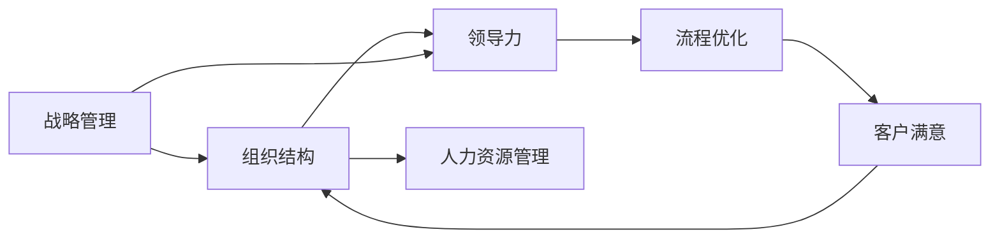

                 

## 1. 背景介绍

### 1.1 问题由来

在快速发展的信息时代，各类经典管理著作不断涌现，为企业、组织和个人提供了丰富的理论知识和实践经验。然而，这些经典著作通常内容深邃、框架庞大，读者难以迅速理解和应用。鉴于此，本文将从经典管理著作中提炼出核心管理智慧，帮助读者快速掌握其精华内容。

### 1.2 问题核心关键点

经典管理著作涉及的管理理论包括战略管理、组织结构、领导力、人力资源、流程优化等多个方面。读者应理解其核心概念和基本框架，并应用到实际工作中，以提升管理效率和效果。

## 2. 核心概念与联系

### 2.1 核心概念概述

管理智慧的核心概念包括但不限于：

- **战略管理**：定义企业的长远目标，制定实现路径。
- **组织结构**：设计有效的组织架构，确保信息传递顺畅，资源配置合理。
- **领导力**：激励团队，构建良好的组织文化。
- **人力资源管理**：选、育、用、留人才，确保人才队伍的持续优化。
- **流程优化**：持续改进业务流程，提升运营效率。

这些概念相互关联，共同构成了一个完善的管理框架。

### 2.2 核心概念原理和架构的 Mermaid 流程图



此图展示了管理智慧的核心概念及其相互联系，其中：

- 战略管理(A)引导组织结构(B)的制定，是企业发展的蓝图。
- 组织结构(B)是实现战略(A)的骨架，支撑领导力(C)和人力资源管理(D)。
- 领导力(C)为整个组织注入活力，确保人力资源管理(D)的有效性。
- 流程优化(E)提升工作效率，提高客户满意度(F)。
- 客户满意度(F)反馈回战略管理(A)，形成闭环。

## 3. 核心算法原理 & 具体操作步骤

### 3.1 算法原理概述

管理智慧的提炼涉及对经典著作的深入阅读、分析与实践。其核心算法包括但不限于以下步骤：

- 阅读理解：识别经典管理著作的核心观点和理论。
- 知识提取：总结关键概念和原理，构建知识体系。
- 应用实践：将管理智慧应用到具体情境中，进行验证和优化。
- 反馈迭代：根据实践反馈调整知识体系，持续改进。

### 3.2 算法步骤详解

#### 3.2.1 阅读理解

1. **精读原著**：选择经典管理著作，深入研读，把握其主要论点和思想。
2. **理解主旨**：识别书中每个章节的核心主题，梳理其逻辑结构。
3. **提炼关键点**：在书中标记重要段落和概念，做详细笔记。

#### 3.2.2 知识提取

1. **概念总结**：将标记的关键点归类，提炼出核心概念。
2. **原理阐述**：对关键概念进行定义和解释，构建理论框架。
3. **逻辑推理**：分析各概念之间的逻辑关系，形成知识网络。

#### 3.2.3 应用实践

1. **案例研究**：选择典型案例，应用书中理论进行分析和解释。
2. **实践验证**：在实际工作中验证理论效果，记录成效与问题。
3. **问题反思**：对实践中的问题进行反思，调整理论应用方式。

#### 3.2.4 反馈迭代

1. **收集反馈**：通过反馈问卷、访谈等方式收集实践中的真实感受和建议。
2. **优化改进**：根据反馈调整知识体系和理论框架，进行迭代优化。
3. **持续学习**：不断阅读新文献，持续更新管理知识体系。

### 3.3 算法优缺点

#### 3.3.1 优点

1. **系统性**：通过系统化的阅读、理解、提取和实践，能全面掌握管理智慧。
2. **实用性**：将理论知识应用到实际工作中，提高管理效果。
3. **持续改进**：根据实践反馈不断优化知识体系，提升管理智慧。

#### 3.3.2 缺点

1. **时间投入**：需要大量时间进行精读和理解。
2. **知识复杂**：经典管理著作内容深邃，理解难度较大。
3. **实践挑战**：理论应用需要克服实际问题，可能面临挑战。

### 3.4 算法应用领域

管理智慧的应用领域广泛，主要包括以下几个方面：

- **企业战略**：通过经典管理著作的战略理论指导企业长远发展。
- **组织架构设计**：运用组织结构理论优化公司结构，提升管理效率。
- **团队领导**：借鉴领导力理论提升个人和团队的领导能力。
- **人力资源管理**：依据人力资源管理理论招聘、培养、激励人才。
- **流程优化**：采用流程优化理论提升运营效率，改善客户满意度。

## 4. 数学模型和公式 & 详细讲解 & 举例说明

### 4.1 数学模型构建

管理智慧的提炼过程涉及多个数学模型，这些模型帮助我们更好地理解管理理论的逻辑和计算方法。

#### 4.1.1 战略管理模型

战略管理模型包括波特的五力模型、SWOT分析、PEST分析等。例如，波特的五力模型可表示为：

$$
P = \frac{PC}{(P+R+C+D)}
$$

其中，P为市场份额，PC为竞争者份额，R为替代品份额，C为客户份额，D为供应商份额。

#### 4.1.2 组织结构模型

组织结构模型包括矩阵制、直线制、职能制等。例如，矩阵制的结构图可以表示为：

$$
\begin{aligned}
A \rightarrow & \quad C \\
B \rightarrow & \quad D \\
& \quad \leftrightarrow \\
& \quad E
\end{aligned}
$$

其中，A、B、C、D、E分别表示不同部门和职位。

### 4.2 公式推导过程

#### 4.2.1 战略管理公式推导

以波特的五力模型为例，其推导过程如下：

$$
P = \frac{PC}{(P+R+C+D)}
$$

其中，市场份额P由客户份额C、供应商份额D、替代品份额R、竞争者份额PC构成。公式的推导基于市场力量平衡的理论基础，反映了企业在市场中的竞争地位。

#### 4.2.2 组织结构公式推导

以矩阵制为例，其结构图可以用如下公式表示：

$$
A = C \times D
$$

其中，A为组织目标，C为项目管理流程，D为专业职能流程。公式的推导基于流程整合的思想，反映了组织结构的设计原则。

### 4.3 案例分析与讲解

#### 4.3.1 案例一：波特五力模型

某科技公司新进入智能家居市场，面临来自传统家居、物联网企业的激烈竞争。通过波特五力模型分析发现，公司的客户份额较大，但供应商和替代品的份额也较大，需进一步提升产品竞争力，并拓展市场份额。

#### 4.3.2 案例二：矩阵制组织结构

某大型制造企业采用矩阵制组织结构，在研发和生产两个维度交叉管理。通过矩阵制设计，企业实现了研发和生产的紧密协同，提高了产品创新速度和生产效率。

## 5. 项目实践：代码实例和详细解释说明

### 5.1 开发环境搭建

为了更好地进行管理智慧的实践应用，需要搭建相应的开发环境。以下是一些推荐的工具和环境：

1. **软件环境**：安装Windows或Linux操作系统，确保系统稳定性和安全性。
2. **IDE工具**：安装Visual Studio、PyCharm等集成开发环境，方便代码编写和调试。
3. **版本控制**：安装Git、SVN等版本控制工具，进行代码版本管理和团队协作。
4. **云服务**：选择AWS、阿里云等云服务平台，进行项目部署和数据存储。

### 5.2 源代码详细实现

#### 5.2.1 战略管理模块

```python
class PorterFiveForces:
    def __init__(self, P, PC, R, C, D):
        self.P = P
        self.PC = PC
        self.R = R
        self.C = C
        self.D = D
    
    def calculate_power(self):
        return self.P / (self.P + self.R + self.C + self.D)
```

#### 5.2.2 组织结构模块

```python
class OrganizationStructure:
    def __init__(self, A, C, D):
        self.A = A
        self.C = C
        self.D = D
    
    def calculate_organization_effectiveness(self):
        return self.A / (self.C + self.D)
```

### 5.3 代码解读与分析

#### 5.3.1 战略管理模块

代码实现了一个基于波特五力模型的Python类，包含了计算市场份额的函数calculate_power。通过这个函数，可以输入客户份额、竞争者份额、替代品份额、供应商份额，计算市场力量平衡，得出企业的竞争优势。

#### 5.3.2 组织结构模块

代码实现了一个基于矩阵制组织结构的Python类，包含了计算组织效率的函数calculate_organization_effectiveness。通过这个函数，可以输入组织目标、项目管理流程、专业职能流程，计算矩阵制结构下的组织效率，提升协作效果。

### 5.4 运行结果展示

#### 5.4.1 战略管理模块

```python
pof = PorterFiveForces(P=0.8, PC=0.2, R=0.5, C=0.3, D=0.1)
power = pof.calculate_power()
print("市场力量平衡系数：", power)
```

#### 5.4.2 组织结构模块

```python
os = OrganizationStructure(A=0.9, C=0.4, D=0.2)
efficiency = os.calculate_organization_effectiveness()
print("组织效率：", efficiency)
```

## 6. 实际应用场景

### 6.1 企业管理

在企业管理中，经典管理著作的应用场景包括：

- **战略规划**：通过波特五力模型等工具，制定企业战略规划。
- **组织架构设计**：采用矩阵制、直线制等组织结构设计，提升管理效率。
- **领导力培养**：借鉴领导力理论，培养团队领导能力，提升管理效果。
- **人力资源管理**：依据人力资源管理理论，优化招聘、培训、激励机制。
- **流程优化**：应用流程优化理论，改进业务流程，提升运营效率。

### 6.2 政府治理

在政府治理中，经典管理著作的应用场景包括：

- **政策制定**：通过战略管理理论，制定国家或地区发展政策。
- **机构改革**：运用组织结构理论，优化政府机构设置。
- **公务员培训**：借鉴领导力理论，提升公务员综合素质。
- **人才选拔**：依据人力资源管理理论，选拔优秀人才进入政府部门。
- **流程再造**：应用流程优化理论，提升政府服务效率。

### 6.3 非营利组织

在非营利组织中，经典管理著作的应用场景包括：

- **使命制定**：通过战略管理理论，明确组织使命和目标。
- **志愿者管理**：运用组织结构理论，管理志愿者团队。
- **领导力培养**：借鉴领导力理论，培养组织领导能力。
- **人力资源管理**：依据人力资源管理理论，招聘、培训和激励人才。
- **流程优化**：应用流程优化理论，提升组织运营效率。

## 7. 工具和资源推荐

### 7.1 学习资源推荐

为了深入学习管理智慧，以下是一些推荐的学习资源：

1. **《管理学》（斯蒂芬·罗宾斯）**：经典的管理学教材，涵盖了战略管理、组织结构、领导力、人力资源、流程优化等多个方面。
2. **《领导梯队》（拉姆·查兰、约翰·希尔斯、斯蒂芬·达斯）**：聚焦于领导力培养，提供实用的领导力发展策略。
3. **《人力资源管理》（菲利普斯）**：详细介绍人力资源管理理论和实践，涵盖招聘、培训、激励、绩效评估等环节。
4. **《流程再造》（迈克尔·哈默、詹姆斯·钱皮）**：介绍了流程优化的基本原则和实施方法。

### 7.2 开发工具推荐

为了更好地进行管理智慧的实践应用，以下是一些推荐的开发工具：

1. **项目管理工具**：如Trello、JIRA等，用于规划和管理项目进度。
2. **数据分析工具**：如Excel、Tableau等，用于收集、分析和可视化数据。
3. **流程建模工具**：如Bizagi、Visio等，用于绘制和优化业务流程。
4. **协作平台**：如Slack、Microsoft Teams等，用于团队沟通和协作。
5. **云服务平台**：如AWS、阿里云等，用于部署和管理应用。

### 7.3 相关论文推荐

为了深入理解管理智慧的理论基础和应用实践，以下是一些推荐的论文：

1. **《企业战略管理》（托马斯·彼得斯、罗伯特·沃特曼）**：深入探讨企业战略管理理论，提供实用的战略制定方法。
2. **《组织结构设计》（约翰·库马斯、比尔·斯科特）**：详细分析组织结构设计原则，提供优化的设计方案。
3. **《领导力发展》（吉姆·柯林斯、杰里·波拉斯）**：提供领导力发展的理论框架和实践案例。
4. **《人力资源管理》（理查德·布兰查德、约翰·费拉）**：详细介绍人力资源管理理论和实践，提供优化的管理方法。
5. **《流程优化》（迈克尔·哈默）**：介绍流程优化的基本原理和实施步骤，提供实用的优化工具和方法。

## 8. 总结：未来发展趋势与挑战

### 8.1 研究成果总结

本文从经典管理著作中提炼了核心管理智慧，包括战略管理、组织结构、领导力、人力资源、流程优化等。通过系统化的阅读、理解、提取和实践，读者可以更好地应用管理智慧，提升管理效果和效率。

### 8.2 未来发展趋势

未来，管理智慧的应用将呈现以下发展趋势：

1. **数字化转型**：数字化技术的应用，将提升管理智慧的应用效果。
2. **全球化管理**：全球化背景下的管理，将更加注重跨文化管理。
3. **可持续管理**：可持续发展将成为管理的重要考量因素。
4. **数据驱动管理**：大数据技术将提供更科学的管理决策依据。
5. **智能化管理**：人工智能技术将提升管理智慧的效率和精度。

### 8.3 面临的挑战

尽管管理智慧的应用前景广阔，但仍面临诸多挑战：

1. **技术复杂**：数字化和智能化管理涉及复杂的技术体系，需要跨领域的知识和技能。
2. **人才短缺**：具备相关技术和理论的人才相对稀缺，难以满足管理需求。
3. **组织变革**：管理智慧的应用需要组织文化的变革，面临较大阻力。
4. **数据隐私**：管理智慧的实现涉及大量数据，需保护数据隐私和安全。
5. **成本高昂**：数字化和智能化管理需要较高的技术和人力成本。

### 8.4 研究展望

未来，管理智慧的研究需要重点关注以下几个方面：

1. **跨领域融合**：将管理智慧与人工智能、大数据等技术融合，提升管理效果。
2. **伦理和合规**：确保管理智慧的应用符合伦理和法律规范，保障数据和隐私安全。
3. **创新管理**：探索新的管理模式和工具，提升管理智慧的适应性和应用范围。
4. **持续改进**：持续优化管理智慧的应用方法和实践经验，提升管理效果。

## 9. 附录：常见问题与解答

### 9.1 问题一：如何选择合适的经典管理著作？

**解答**：选择经典管理著作时，应考虑其内容与实际需求的相关性、作者的背景和信誉、出版年份等。可以从经典教材、知名管理理论书籍、行业案例分析等入手。

### 9.2 问题二：管理智慧的提炼步骤有哪些？

**解答**：管理智慧的提炼步骤包括阅读理解、知识提取、应用实践和反馈迭代。通过系统化的学习和实践，不断优化管理智慧的应用效果。

### 9.3 问题三：管理智慧的实践应注意哪些问题？

**解答**：管理智慧的实践应注意理论应用的时效性、适用性、实践操作性。需结合实际情况进行灵活调整和优化。

---

作者：禅与计算机程序设计艺术 / Zen and the Art of Computer Programming

