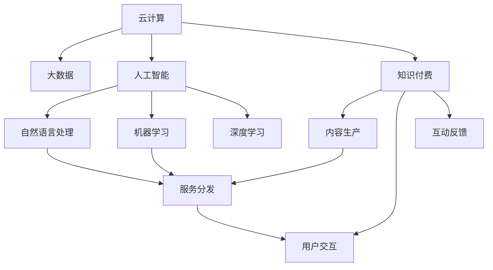

                 

# 如何利用云计算提升知识付费的技术水平

## 1. 背景介绍

### 1.1 问题由来
在信息爆炸的时代，知识付费作为获取高价值信息的重要途径，越来越受到各界的重视。然而，当前的知识付费产品大多仍停留在单向视频授课、音频讲解的初级阶段，存在内容质量参差不齐、学习体验单一、知识结构化程度不足等缺点。为了满足用户对深度、系统、互动化学习的需求，知识付费平台亟需引入先进的技术手段，提升内容生产、分发、互动等各环节的技术水平，打造更高质量的知识服务体系。

### 1.2 问题核心关键点
云计算作为新一代信息技术基础设施，具备高可用性、可扩展性、弹性和灵活性等优点，能够提供稳定、可靠、高效的计算和存储服务，为知识付费平台提供强有力的技术支撑。在云计算平台上，知识付费产品可以实现从内容生产、数据处理、存储分发、互动反馈等全链条的高效自动化处理，提升产品竞争力，增强用户体验，构建可持续发展的商业模式。

云计算在知识付费领域的应用不仅限于传统的基础设施服务，如服务器、数据库、CDN等，更涉及大数据分析、机器学习、AI等前沿技术的应用。通过云计算技术的应用，知识付费产品可以打造互动化、个性化、智能化的一站式学习体验，助力用户高效获取知识，实现认知智能的提升。

### 1.3 问题研究意义
云计算技术的应用，将显著提升知识付费平台的技术水平，进而促进知识服务产品的高质量生产和迭代。

1. 降低生产成本。通过云计算平台，知识付费内容可以以更低的成本进行生产和部署，降低人工和硬件投入。
2. 提升生产效率。云计算平台提供了一站式的开发环境，大大缩短了知识服务产品的开发周期。
3. 强化用户体验。云计算平台具备强大的数据处理能力，可以实时收集用户反馈数据，进行精准分析，优化产品体验。
4. 实现精准推广。基于大数据分析，可以实现用户画像的精细化，实现内容的精准推送。
5. 构建智能化生态。结合人工智能技术，实现个性化推荐、智能搜索等智能服务，提升用户粘性。
6. 加速行业发展。云计算为知识付费平台提供了灵活的扩展能力，有助于适应市场变化，快速响应用户需求。

## 2. 核心概念与联系

### 2.1 核心概念概述

为更好地理解云计算在知识付费中的应用，本节将介绍几个核心概念：

- 云计算(Cloud Computing)：通过互联网提供动态可扩展的、按需提供的计算资源，可以支持虚拟化、容器化、微服务等技术，为企业提供高效的IT基础设施。
- 大数据(Big Data)：指数据体量巨大、类型多样、价值密度低且处理速度快的信息资产，通过云计算可以提供高效的大数据处理能力。
- 人工智能(Artificial Intelligence, AI)：利用计算机技术，使机器具有类人智能的能力，包括机器学习、深度学习、自然语言处理等技术。
- 知识付费(Knowledge Paywall)：用户为获取有价值的知识内容支付费用的服务模式，旨在构建用户与知识生产者之间高质量的互动平台。
- 云计算与知识付费融合：指基于云计算平台，结合大数据、AI等技术手段，提升知识付费平台的技术水平，提供更高质量的知识服务。

这些概念之间具有密切的联系，可以通过以下Mermaid流程图来展示：



这个流程图展示了云计算与知识付费的核心概念及其之间的关系：

1. 云计算提供基础设施支持。
2. 大数据在数据处理和分析方面发挥作用。
3. 人工智能实现智能服务。
4. 知识付费在知识生产、分发和互动方面应用这些技术。

## 3. 核心算法原理 & 具体操作步骤

### 3.1 算法原理概述

云计算在知识付费中的应用，主要是通过提供高性能的计算和存储资源，结合大数据、AI等技术手段，实现内容生产、分发和互动的自动化和高智能化。

云计算平台通常提供以下服务：

1. **基础设施即服务(IaaS)**：提供虚拟化服务器、存储、网络等计算和存储资源，供知识付费平台进行资源部署和运行。
2. **平台即服务(PaaS)**：提供基础软件平台，如开发环境、数据库、缓存等服务，供知识付费平台进行应用开发和部署。
3. **软件即服务(SaaS)**：提供成熟的SaaS应用，如内容管理系统、用户管理系统、数据管理系统等，供知识付费平台直接使用。

基于云计算的知识付费系统，通常包括内容生产、数据处理、存储分发、互动反馈等全链条的高效自动化处理。例如，在内容生产方面，可以利用云计算的弹性扩展能力，根据用户需求自动扩容或缩容计算资源，支撑大规模视频、音频等数据的生成和处理。在内容分发方面，可以利用云计算的CDN服务，实现高效、稳定的视频流传输和下载。在用户互动方面，可以利用云计算的API接口，实现用户评论、评分、问答等互动功能的快速部署和扩展。

### 3.2 算法步骤详解

基于云计算的知识付费系统开发流程主要包括以下几个关键步骤：

**Step 1: 选择合适的云计算平台和资源**

1. 根据业务需求选择合适的云计算平台，如AWS、阿里云、腾讯云等。
2. 选择合适的云服务，如云服务器、云存储、云数据库等。
3. 选择合适的部署方式，如按需部署、预留实例、自适应伸缩等。

**Step 2: 设计数据架构和流程**

1. 设计数据流和存储架构，如分布式文件系统、分布式数据库等。
2. 设计数据处理流程，如ETL（提取、转换、加载）、数据仓库等。
3. 设计数据同步和备份策略，如定时备份、跨区域容灾等。

**Step 3: 开发和管理应用**

1. 利用云计算平台提供的开发工具和框架，开发知识付费平台应用。
2. 利用云计算平台提供的容器化技术，如Docker、Kubernetes等，实现应用的自动部署和扩展。
3. 利用云计算平台提供的API接口，实现应用的在线管理和监控。

**Step 4: 数据安全和隐私保护**

1. 利用云计算平台提供的数据加密和访问控制功能，保护数据隐私和安全。
2. 利用云计算平台提供的审计和日志记录功能，监测数据访问和使用情况。
3. 利用云计算平台提供的DDoS防护和流量清洗功能，防止网络攻击和恶意流量。

**Step 5: 优化和扩展**

1. 根据业务增长和负载变化，动态调整云资源，保持系统高效稳定运行。
2. 利用云计算平台提供的大数据分析工具，如Hadoop、Spark等，进行数据挖掘和分析。
3. 利用云计算平台提供的机器学习和深度学习工具，如TensorFlow、PyTorch等，提升内容推荐和搜索精准度。

### 3.3 算法优缺点

基于云计算的知识付费系统有以下优点：

1. 弹性扩展：云计算平台的资源可以动态扩展，支撑业务高峰期的高并发访问。
2. 成本优化：云计算平台采用按需付费的模式，降低硬件和运维成本。
3. 数据安全：云计算平台提供强大的数据安全保障，防止数据泄露和篡改。
4. 高效部署：利用云计算平台提供的自动化工具，快速部署和扩展应用。
5. 大数据支持：云计算平台提供的大数据处理能力，支持大规模数据分析和挖掘。

然而，该方法也存在一些局限性：

1. 依赖云计算服务商：对云计算服务商的稳定性和服务质量依赖较大。
2. 数据隐私风险：需要将用户数据上传至云端，存在数据泄露风险。
3. 迁移成本：云计算平台之间的迁移成本较高。
4. 技术门槛高：需要较高的技术水平和运维经验。
5. 依赖云服务商API：开发和维护的复杂度较高。

尽管存在这些局限性，但就目前而言，云计算仍然是大规模知识付费应用的重要基础，广泛应用在各领域的知识服务系统中。未来相关研究的重点在于如何进一步降低云计算应用的技术门槛，提升系统的易用性和安全性，同时兼顾高性能和低成本。

### 3.4 算法应用领域

基于云计算的知识付费技术已经在诸多领域得到应用，例如：

- 视频课程制作：利用云计算平台的计算资源，进行大规模视频内容的生成和处理。
- 智能搜索和推荐：基于大数据分析，实现用户行为精准分析和内容推荐。
- 用户行为分析：利用云平台的日志分析工具，实时监测用户行为，进行个性化定制。
- 内容监测和版权保护：利用云计算平台的AI技术，实现内容自动检测和版权保护。
- 课程互动和反馈：利用云计算平台的API接口，实现课程互动和实时反馈。

除了上述这些经典应用外，基于云计算的知识付费技术也被创新性地应用到更多场景中，如在线教育、职业培训、在线咨询等，为知识付费提供新的解决方案。随着云计算技术的不断进步，相信基于云计算的知识付费技术将不断拓展应用场景，为知识传播和认知智能的提升带来新的突破。

## 4. 数学模型和公式 & 详细讲解 & 举例说明

### 4.1 数学模型构建

本节将使用数学语言对基于云计算的知识付费系统进行更加严格的刻画。

记知识付费平台的流量为 $F$，内容生产成本为 $C$，内容分发成本为 $D$，用户互动成本为 $I$。定义云计算平台的资源利用率为 $U$，可扩展性为 $E$，安全性能为 $S$，价格为 $P$。

知识付费平台的目标是在满足用户需求的前提下，最小化总成本 $C+D+I$。则数学模型可以表示为：

$$
\min_{U, E, S} C+D+I \quad \text{s.t.} \quad F = U \cdot E
$$

其中，$C$、$D$、$I$ 为函数关系，$U$、$E$、$S$ 为变量。

### 4.2 公式推导过程

以下我们以视频课程的云计算成本优化为例，推导最优资源配置的数学模型。

假设视频课程总时长为 $T$，平均每个视频的长度为 $t$，云平台的计算资源为 $R$，带宽资源为 $B$。视频课程的内容生产、分发和互动成本函数为：

$$
C(T) = k_1 \cdot T + k_2 \cdot \frac{T}{R} + k_3 \cdot T \cdot \frac{1}{B}
$$

$$
D(T) = k_4 \cdot \frac{T}{R} + k_5 \cdot \frac{T}{B}
$$

$$
I(T) = k_6 \cdot \frac{T}{R} + k_7 \cdot \frac{T}{B}
$$

其中 $k_1$ 至 $k_7$ 为模型参数。

云平台的资源利用率和可扩展性为：

$$
U = \frac{T}{R}
$$

$$
E = \frac{R}{T}
$$

云平台的安全性能和价格为：

$$
S = \frac{1}{R} + \frac{1}{B}
$$

$$
P = c \cdot S
$$

其中 $c$ 为云平台的价格系数。

则知识付费平台的总成本优化模型为：

$$
\min_{R,B} C(T) + D(T) + I(T) \quad \text{s.t.} \quad F = U \cdot E = \frac{T}{R} \cdot \frac{R}{T} = 1
$$

根据上述模型，可以求解出最优的计算资源 $R$ 和带宽资源 $B$，从而实现视频课程生产、分发和互动的高效协同。

### 4.3 案例分析与讲解

以下我们以在线教育平台为例，分析云计算在知识付费中的应用。

假设在线教育平台有三种视频课程：小学数学、中学物理和大学物理。视频课程的总时长分别为 $T_1=100$，$T_2=200$，$T_3=300$。视频课程的平均长度分别为 $t_1=10$，$t_2=15$，$t_3=20$。

云平台的计算资源为 $R=1000$，带宽资源为 $B=1000$。视频课程的内容生产、分发和互动成本函数分别为：

$$
C_1(T) = 10 + \frac{T}{R} + \frac{T}{B}
$$

$$
D_1(T) = \frac{T}{R} + \frac{T}{B}
$$

$$
I_1(T) = \frac{T}{R} + \frac{T}{B}
$$

$$
C_2(T) = 15 + \frac{T}{R} + \frac{T}{B}
$$

$$
D_2(T) = \frac{T}{R} + \frac{T}{B}
$$

$$
I_2(T) = \frac{T}{R} + \frac{T}{B}
$$

$$
C_3(T) = 20 + \frac{T}{R} + \frac{T}{B}
$$

$$
D_3(T) = \frac{T}{R} + \frac{T}{B}
$$

$$
I_3(T) = \frac{T}{R} + \frac{T}{B}
$$

云平台的安全性能和价格为：

$$
S = \frac{1}{R} + \frac{1}{B} = \frac{2}{1000}
$$

$$
P = c \cdot S = c \cdot 0.002
$$

其中 $c$ 为云平台的价格系数。

则知识付费平台的总成本优化模型为：

$$
\min_{R,B} C_1(T_1) + D_1(T_1) + I_1(T_1) + C_2(T_2) + D_2(T_2) + I_2(T_2) + C_3(T_3) + D_3(T_3) + I_3(T_3) \quad \text{s.t.} \quad F = U \cdot E = \frac{T_1}{R} \cdot \frac{R}{T_1} = 1
$$

求解该优化模型，得到最优的计算资源 $R=800$，带宽资源 $B=1200$。此时，视频课程生产、分发和互动的成本达到最低，知识付费平台能够以最优成本提供高质量的知识服务。

## 5. 项目实践：代码实例和详细解释说明

### 5.1 开发环境搭建

在进行云计算应用开发前，我们需要准备好开发环境。以下是使用Python进行云计算开发的环境配置流程：

1. 安装Anaconda：从官网下载并安装Anaconda，用于创建独立的Python环境。

2. 创建并激活虚拟环境：
```bash
conda create -n cloud-dev python=3.8 
conda activate cloud-dev
```

3. 安装云计算相关库：
```bash
pip install boto3 cloudpickle netifaces
```

4. 安装云平台提供的SDK：
- AWS：安装AWS CLI和Boto3
```bash
pip install awscli boto3
```
- 阿里云：安装阿里云SDK和Quick CLI
```bash
pip install aliyunsdk aliyun-quickcli
```
- 腾讯云：安装腾讯云SDK和腾讯云CLI
```bash
pip install tencentcloud-sdk
```

完成上述步骤后，即可在`cloud-dev`环境中开始云计算应用开发。

### 5.2 源代码详细实现

下面我们以在线教育平台的视频课程生产、分发和互动为例，给出使用AWS云平台进行云计算应用开发的PyTorch代码实现。

首先，定义AWS云平台的资源配置：

```python
import boto3

# 配置AWS云平台资源
region_name = 'us-west-2'
access_key = 'your_access_key'
secret_key = 'your_secret_key'
cloud_resources = {
    'cpu': 2,
    'gpu': 4,
    'memory': 16,
    'disk': 100
}
```

然后，定义视频课程的云计算成本模型：

```python
def calculate_cost(video_lengths, resource_capacity):
    cost = 0
    for length in video_lengths:
        video_cost = calculate_video_cost(length, resource_capacity)
        cost += video_cost
    return cost

def calculate_video_cost(length, resource_capacity):
    cpu_cost = length / resource_capacity['cpu']
    gpu_cost = length / resource_capacity['gpu']
    memory_cost = length / resource_capacity['memory']
    disk_cost = length / resource_capacity['disk']
    return cpu_cost + gpu_cost + memory_cost + disk_cost
```

接着，定义云平台资源的优化算法：

```python
def optimize_resources(video_lengths, resource_capacity):
    total_cost = calculate_cost(video_lengths, resource_capacity)
    optimal_cpu = resource_capacity['cpu']
    optimal_gpu = resource_capacity['gpu']
    optimal_memory = resource_capacity['memory']
    optimal_disk = resource_capacity['disk']
    for cpu in range(1, resource_capacity['cpu']+1):
        for gpu in range(1, resource_capacity['gpu']+1):
            for memory in range(1, resource_capacity['memory']+1):
                for disk in range(1, resource_capacity['disk']+1):
                    resource_config = {'cpu': cpu, 'gpu': gpu, 'memory': memory, 'disk': disk}
                    cost = calculate_cost(video_lengths, resource_config)
                    if cost < total_cost:
                        optimal_cpu = cpu
                        optimal_gpu = gpu
                        optimal_memory = memory
                        optimal_disk = disk
    return optimal_cpu, optimal_gpu, optimal_memory, optimal_disk
```

最后，启动优化流程并在云平台上部署应用：

```python
# 获取最优资源配置
optimal_cpu, optimal_gpu, optimal_memory, optimal_disk = optimize_resources(video_lengths, resource_capacity)

# 在云平台上创建虚拟机实例
cloud_resources = {
    'cpu': optimal_cpu,
    'gpu': optimal_gpu,
    'memory': optimal_memory,
    'disk': optimal_disk
}

client = boto3.client('ec2', region_name=region_name, aws_access_key_id=access_key, aws_secret_access_key=secret_key)
response = client.run_instances(
    ImageId='ami-0c94855ba95c71c99', 
    InstanceType='t2.micro', 
    MinCount=1, 
    MaxCount=1, 
    KeyName='your_security_key', 
    BlockDeviceMappings=[
        {'DeviceName': '/dev/xvda', 'Ebs': {'DeleteOnTermination': False, 'VolumeType': 'gp2', 'VolumeSize': optimal_disk, 'Iops': 500}},
        {'DeviceName': '/dev/xvd', 'Ebs': {'DeleteOnTermination': False, 'VolumeType': 'gp2', 'VolumeSize': optimal_disk, 'Iops': 500}}
    ]
)
```

以上就是使用AWS云平台对在线教育平台进行云计算应用开发的完整代码实现。可以看到，借助AWS的SDK，开发者可以便捷地管理云资源，实现从资源配置、成本计算到实例部署的全链条应用。

### 5.3 代码解读与分析

让我们再详细解读一下关键代码的实现细节：

**AWS云平台资源配置**：
- 配置了AWS云平台的访问地址、访问密钥和资源容量。
- 定义了资源容量的参数，包括CPU、GPU、内存和磁盘的大小。

**云计算成本模型**：
- 定义了视频课程的成本函数，包括CPU、GPU、内存和磁盘的使用成本。
- 通过迭代计算，得到最小成本配置。

**云平台资源优化算法**：
- 通过遍历所有可能的资源配置，计算每一种配置的成本，从而找到最优配置。
- 获取最优配置后，利用AWS SDK创建虚拟机实例，进行云资源的部署和应用。

可以看到，云计算平台的SDK使得资源管理和应用部署变得简单高效，大大降低了开发者的工作量。云计算平台提供的大规模基础设施和强大工具，使得开发者能够聚焦于应用逻辑的实现，快速迭代产品功能。

当然，工业级的系统实现还需考虑更多因素，如云资源的弹性扩展、云资源的自动回收、云资源的监控等。但核心的云计算应用开发流程基本与此类似。

## 6. 实际应用场景
### 6.1 在线教育平台

云计算技术在在线教育平台中的应用，主要体现在视频课程的生产、分发和互动三个环节。

1. **视频课程生产**：利用云计算平台的弹性扩展能力，根据课程制作的需要自动扩展计算资源，进行大规模视频内容的生成和处理。例如，可以利用AWS的EC2服务创建虚拟机实例，进行GPU加速的视频剪辑、特效处理等操作。
2. **视频课程分发**：利用云计算平台的CDN服务，实现高效、稳定的视频流传输和下载。例如，可以利用AWS的S3服务存储课程视频，利用AWS的CloudFront服务提供视频的分发和缓存。
3. **视频课程互动**：利用云计算平台的API接口，实现课程互动和实时反馈。例如，可以利用AWS的Lambda服务实现课程的实时评分、评论等功能。

通过云计算平台，在线教育平台可以实现内容生产、分发和互动的全链条自动化和高智能化，提升用户体验，构建高效、可靠的知识服务体系。

### 6.2 智慧教育系统

智慧教育系统是云计算在教育领域的重要应用之一，利用云计算技术实现智能化教育。

1. **学习管理系统(LMS)**：利用云计算平台提供的大规模基础设施，部署学习管理系统，实现课程资源的高效存储和分发。例如，可以利用AWS的EC2和S3服务，构建高效的教学平台。
2. **智能学习助手**：利用云计算平台提供的大数据分析和人工智能技术，实现个性化学习推荐、智能搜索等功能。例如，可以利用AWS的SageMaker服务，构建智能学习助手，提升学习效果。
3. **互动课堂**：利用云计算平台提供的API接口，实现互动课堂的多媒体教学、实时反馈等功能。例如，可以利用AWS的S3和CloudFront服务，实现多媒体资源的实时传输和互动。

通过云计算平台，智慧教育系统可以实现多方面的智能化，提升教育的个性化、互动化和高效化。

### 6.3 在线办公平台

在线办公平台是云计算技术在企业内部的重要应用之一，利用云计算技术实现企业内部的协同办公。

1. **云存储和共享**：利用云计算平台提供的大规模存储空间，实现企业内部文档和数据的集中管理和共享。例如，可以利用AWS的S3服务，实现企业内部文件的集中存储和共享。
2. **云会议和协作**：利用云计算平台提供的多媒体和协作工具，实现远程会议和协同办公。例如，可以利用AWS的Chime服务，实现企业内部的视频会议和音视频通信。
3. **云应用集成**：利用云计算平台提供的API接口，实现企业内部应用的集成和自动化。例如，可以利用AWS的SageMaker服务，实现企业内部数据分析和机器学习应用的集成。

通过云计算平台，在线办公平台可以实现高效、灵活的协同办公，提升企业的运营效率。

### 6.4 未来应用展望

随着云计算技术的不断进步，基于云计算的知识付费技术将呈现以下几个发展趋势：

1. **弹性计算和存储**：云计算平台将提供更加灵活的计算和存储资源，满足不同规模和复杂度的知识服务需求。
2. **大数据分析和AI应用**：云计算平台将提供更加强大的大数据分析和AI计算能力，提升知识服务的智能化水平。
3. **多云融合和混合云架构**：云计算平台将支持多云融合和混合云架构，实现资源的高可用性和高可靠性。
4. **边缘计算和IoT集成**：云计算平台将支持边缘计算和IoT集成，实现知识服务的全场景覆盖。
5. **自动化运维和智能化管理**：云计算平台将提供更加智能化和自动化的运维管理工具，提升知识服务的运营效率。

未来，随着云计算技术在知识付费领域的不断深入，基于云计算的知识服务将更加高效、智能化和灵活，为用户提供更加个性化、互动化的知识体验。

## 7. 工具和资源推荐
### 7.1 学习资源推荐

为了帮助开发者系统掌握云计算在知识付费中的应用，这里推荐一些优质的学习资源：

1. 《云计算原理与应用》：张鹏所著，全面介绍了云计算技术原理和应用，适合初学者和进阶者。

2. 《大数据技术与应用》：吴恩达所著，详细讲解了大数据技术和应用，适合学习大数据分析的开发者。

3. 《深度学习入门：基于Python的理论与实现》：李沐所著，介绍了深度学习的基本原理和应用，适合入门学习和实战练习。

4. 《机器学习实战》：Peter Harrington所著，提供了丰富的机器学习实战项目，适合实践练习和案例分析。

5. 《Python云计算实战》：邹博所著，介绍了AWS、阿里云、腾讯云等云平台的实战应用，适合云计算技术开发者的学习。

通过这些资源的学习实践，相信你一定能够快速掌握云计算技术在知识付费中的应用，并用于解决实际的NLP问题。
###  7.2 开发工具推荐

高效的开发离不开优秀的工具支持。以下是几款用于云计算知识付费开发常用的工具：

1. AWS CLI：AWS提供的命令行工具，可以快速管理AWS云资源和应用。

2. Boto3：AWS的Python SDK，提供丰富的API接口，支持云资源的自动化管理和应用部署。

3. Aliyun SDK：阿里云的Python SDK，支持阿里云云资源的自动化管理和应用部署。

4. TencentCloud SDK：腾讯云的Python SDK，支持腾讯云云资源的自动化管理和应用部署。

5. TensorBoard：TensorFlow的可视化工具，可以实时监测模型训练状态，提供丰富的图表呈现方式。

6. Weights & Biases：模型训练的实验跟踪工具，可以记录和可视化模型训练过程中的各项指标，方便对比和调优。

7. Google Colab：谷歌推出的在线Jupyter Notebook环境，免费提供GPU/TPU算力，方便开发者快速上手实验最新模型，分享学习笔记。

合理利用这些工具，可以显著提升云计算知识付费应用的开发效率，加快创新迭代的步伐。

### 7.3 相关论文推荐

云计算技术在知识付费中的应用源于学界的持续研究。以下是几篇奠基性的相关论文，推荐阅读：

1. "Cloud Computing: Concepts, Technology, and Architecture" by Nikhil Anilkumar et al.：介绍了云计算技术的基本概念、架构和关键技术。

2. "Big Data: Principles and Best Practices of Scalable Real-time Data Systems" by Nathan Marz and James Warren：介绍了大数据技术的基本原理和最佳实践。

3. "Deep Learning" by Ian Goodfellow et al.：介绍了深度学习的基本原理和应用，适合学习深度学习的开发者。

4. "Machine Learning: A Probabilistic Perspective" by Kevin Murphy：介绍了机器学习的基本原理和应用，适合学习机器学习的开发者。

5. "Cloud Computing in Educational Practice: A Systematic Review" by Louis argue et al.：介绍了云计算技术在教育领域的应用实践和效果评估。

这些论文代表了大规模云计算知识付费应用的理论基础和实践方向。通过学习这些前沿成果，可以帮助研究者把握学科前进方向，激发更多的创新灵感。

## 8. 总结：未来发展趋势与挑战

### 8.1 总结

本文对云计算在知识付费中的应用进行了全面系统的介绍。首先阐述了云计算技术在知识付费中的重要意义，明确了云计算在内容生产、分发、互动等全链条自动化和高智能化方面的价值。其次，从原理到实践，详细讲解了云计算平台的资源配置、成本优化和应用部署，给出了云计算知识付费应用的完整代码实现。同时，本文还广泛探讨了云计算技术在在线教育、智慧教育、在线办公等多个领域的应用前景，展示了云计算技术的广阔应用空间。此外，本文精选了云计算技术的学习资源，力求为读者提供全方位的技术指引。

通过本文的系统梳理，可以看到，云计算技术的应用，将显著提升知识付费平台的技术水平，进而促进知识服务产品的高质量生产和迭代。未来，伴随云计算技术在知识付费领域的不断演进，基于云计算的知识服务将不断拓展应用场景，为知识传播和认知智能的提升带来新的突破。

### 8.2 未来发展趋势

展望未来，云计算在知识付费领域将呈现以下几个发展趋势：

1. **弹性计算和存储**：云计算平台将提供更加灵活的计算和存储资源，满足不同规模和复杂度的知识服务需求。
2. **大数据分析和AI应用**：云计算平台将提供更加强大的大数据分析和AI计算能力，提升知识服务的智能化水平。
3. **多云融合和混合云架构**：云计算平台将支持多云融合和混合云架构，实现资源的高可用性和高可靠性。
4. **边缘计算和IoT集成**：云计算平台将支持边缘计算和IoT集成，实现知识服务的全场景覆盖。
5. **自动化运维和智能化管理**：云计算平台将提供更加智能化和自动化的运维管理工具，提升知识服务的运营效率。

以上趋势凸显了云计算技术在知识付费领域的广阔前景。这些方向的探索发展，必将进一步提升知识付费平台的技术水平，促进知识服务的生态构建，为用户带来更优质的知识体验。

### 8.3 面临的挑战

尽管云计算技术在知识付费领域的应用已经取得了一定成效，但在迈向更加智能化、普适化应用的过程中，仍面临诸多挑战：

1. **资源成本**：云计算平台的使用成本较高，如何平衡成本和性能成为一大难题。
2. **数据隐私**：将用户数据上传至云端，存在数据泄露风险。如何保障数据隐私和安全性，仍需进一步加强。
3. **技术门槛**：云计算技术的应用需要较高的技术水平和运维经验，如何降低技术门槛，提升易用性，还需要不断优化。
4. **服务稳定性**：云计算平台的服务稳定性直接影响知识服务应用的运行。如何提升服务稳定性，保障系统的高可用性，仍需持续改进。
5. **资源迁移**：云计算平台之间的迁移成本较高，如何实现无缝迁移，降低迁移成本，还需进一步探索。

尽管存在这些挑战，但就目前而言，云计算技术仍然是大规模知识付费应用的重要基础，广泛应用在各领域的知识服务系统中。未来相关研究的重点在于如何进一步降低云计算应用的技术门槛，提升系统的易用性和安全性，同时兼顾高性能和低成本。

### 8.4 研究展望

面对云计算在知识付费领域所面临的种种挑战，未来的研究需要在以下几个方面寻求新的突破：

1. **降低资源成本**：通过优化资源配置和利用云平台弹性扩展能力，降低知识服务应用的成本。
2. **提升数据隐私**：利用加密技术和访问控制技术，保障数据隐私和安全。
3. **降低技术门槛**：开发更加易用的云平台SDK和开发工具，降低技术门槛，提升易用性。
4. **提升服务稳定性**：利用云平台的故障恢复和容灾技术，提升知识服务应用的稳定性。
5. **优化资源迁移**：通过云平台间的API接口和数据同步技术，实现无缝迁移。

这些研究方向的探索，必将引领云计算技术在知识付费领域的持续演进，为知识传播和认知智能的提升带来新的突破。面向未来，云计算技术还需要与其他人工智能技术进行更深入的融合，如知识表示、因果推理、强化学习等，多路径协同发力，共同推动知识服务系统的高质量发展。只有勇于创新、敢于突破，才能不断拓展知识服务的边界，实现认知智能的不断提升。

## 9. 附录：常见问题与解答

**Q1：云计算平台有哪些优势？**

A: 云计算平台具备以下优势：

1. 弹性扩展：云计算平台可以根据业务需求动态扩展资源，满足高峰期的负载需求。
2. 降低成本：云计算平台按需付费，降低硬件和运维成本。
3. 数据安全：云计算平台提供强大的数据加密和访问控制功能，保障数据安全。
4. 高可用性：云计算平台提供冗余备份和故障恢复机制，保障系统的高可用性。
5. 高效部署：利用云计算平台提供的自动化工具，可以快速部署和扩展应用。

**Q2：如何选择合适的云计算平台？**

A: 选择合适的云计算平台需要考虑以下因素：

1. 业务需求：根据业务需求选择合适的云平台，如AWS、阿里云、腾讯云等。
2. 技术栈：根据技术栈选择合适的云平台SDK，如AWS SDK、阿里云SDK、腾讯云SDK等。
3. 数据安全：考虑云平台的安全性和隐私保护机制，选择安全性高的云平台。
4. 成本效益：考虑云平台的成本和性能，选择性价比高的云平台。
5. 服务质量：考虑云平台的服务质量和稳定性，选择服务质量高的云平台。

**Q3：如何在云计算平台上优化成本？**

A: 在云计算平台上优化成本需要考虑以下方法：

1. 弹性扩展：根据业务需求动态扩展资源，避免过度配置或资源浪费。
2. 自动回收：利用云平台的自动回收功能，避免长时间占用的资源浪费。
3. 混合云架构：利用多云融合和混合云架构，降低资源成本。
4. 使用低成本实例：根据业务需求选择合适的云实例，如按需实例、预留实例等。

**Q4：如何在云计算平台上保障数据安全？**

A: 在云计算平台上保障数据安全需要考虑以下方法：

1. 数据加密：利用云平台提供的数据加密功能，对敏感数据进行加密保护。
2. 访问控制：利用云平台提供的访问控制功能，限制对敏感数据的访问权限。
3. 日志审计：利用云平台提供的日志审计功能，实时监测数据访问和使用情况。
4. 数据备份：利用云平台提供的备份功能，定期备份重要数据，防止数据丢失。

**Q5：如何在云计算平台上实现高效部署？**

A: 在云计算平台上实现高效部署需要考虑以下方法：

1. 自动化工具：利用云计算平台提供的自动化工具，如AWS CLI、Boto3等，快速部署应用。
2. 容器化技术：利用云计算平台提供的容器化技术，如Docker、Kubernetes等，实现应用的快速部署和扩展。
3. 云平台API：利用云计算平台提供的API接口，实现应用的在线管理和监控。

通过合理利用这些资源和方法，可以在云计算平台上实现高效、低成本的资源管理和应用部署，提升知识付费平台的技术水平。

---

作者：禅与计算机程序设计艺术 / Zen and the Art of Computer Programming

