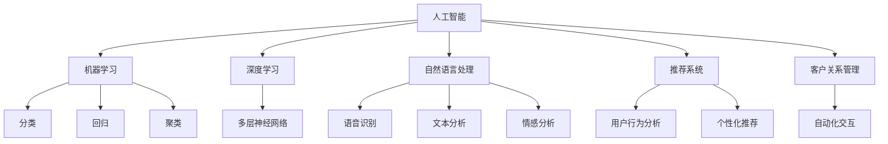

                 

# 如何利用人工智能实现创业自动化

## 1. 背景介绍

在21世纪的今天，人工智能（AI）已经渗透到各个行业和领域，并在推动创新和提高效率方面发挥着越来越重要的作用。随着科技的不断进步，创业环境也在发生着深刻的变化。如何利用人工智能技术，实现创业的自动化，成为许多创业者和企业关注的焦点。本文将详细探讨利用人工智能技术实现创业自动化的各种方法和应用，为企业提供可行的解决方案。

### 1.1 问题由来

随着人工智能技术的迅速发展，越来越多的初创公司开始尝试利用AI技术优化其运营流程，提高决策效率，降低运营成本，从而实现可持续发展。然而，如何有效地将AI技术应用到创业自动化中，仍然是一个复杂而多层次的问题。一方面，AI技术本身需要大量的数据和计算资源，创业公司往往面临资源有限的挑战；另一方面，AI技术的应用效果依赖于正确的算法和模型选择，以及数据的质量和适用性。

### 1.2 问题核心关键点

实现创业自动化的关键在于：
- 选择合适的AI技术和工具。
- 构建高效的数据获取和处理流程。
- 设计和实施科学的模型训练和应用策略。
- 不断优化和迭代AI模型，以适应不断变化的创业环境。

## 2. 核心概念与联系

### 2.1 核心概念概述

要全面理解利用AI实现创业自动化的过程，需要先掌握一些核心概念：

- **人工智能（AI）**：通过模拟人类的智能行为，实现对数据的理解和决策，包括机器学习、深度学习、自然语言处理等技术。
- **创业自动化**：利用AI技术，自动化完成创业过程中涉及的各项任务，如市场分析、产品推荐、客户服务等。
- **机器学习（ML）**：通过算法让计算机从数据中学习规律，用于分类、回归、聚类等任务。
- **深度学习（DL）**：一种特殊类型的机器学习，通过构建多层神经网络，实现更复杂的数据处理和模型训练。
- **自然语言处理（NLP）**：使计算机能够理解和处理人类语言的技术，包括语音识别、文本分析、情感分析等。
- **推荐系统**：通过分析用户行为和偏好，推荐最合适的产品或服务。
- **客户关系管理（CRM）**：通过自动化客户交互，提高客户满意度和忠诚度。

这些概念之间的联系通过以下Mermaid流程图展示：



### 2.2 核心概念原理和架构

**机器学习**：通过数据集进行模型训练，模型通过输入特征预测输出结果。常见算法包括决策树、随机森林、支持向量机等。

**深度学习**：通过构建多层神经网络，利用反向传播算法优化网络参数，实现复杂数据的表示和处理。主要架构包括卷积神经网络（CNN）、循环神经网络（RNN）、长短期记忆网络（LSTM）等。

**自然语言处理**：利用NLP技术，实现对自然语言的理解、生成和处理。常用技术包括分词、词性标注、命名实体识别、语义分析等。

**推荐系统**：通过用户行为数据构建用户画像，利用协同过滤、内容推荐等算法，为用户推荐个性化产品或服务。

**客户关系管理**：通过自动化客户互动，建立客户档案，实现客户跟踪、分析和个性化服务。

这些技术架构之间通过数据流和算法迭代紧密相连，形成了一个闭环的创业自动化系统。

## 3. 核心算法原理 & 具体操作步骤

### 3.1 算法原理概述

实现创业自动化的核心在于构建高效、可扩展的AI系统，将AI技术应用到各个创业环节，提高效率和决策质量。主要算法和技术包括：

- 数据预处理和特征工程：通过清洗、标准化、特征选择等技术，提高数据质量。
- 模型训练和优化：选择合适的算法和模型，利用历史数据进行训练和参数优化。
- 模型应用和部署：将训练好的模型应用到实际业务场景中，进行实时预测和决策。

### 3.2 算法步骤详解

实现创业自动化的步骤主要包括以下几个方面：

**Step 1: 数据收集与处理**

- 数据收集：从各个渠道（如社交媒体、电商平台、客户反馈等）获取相关数据。
- 数据清洗：去除噪声和异常值，确保数据质量。
- 数据预处理：进行标准化、归一化、分词等预处理操作。
- 特征工程：构建输入特征，选择和构建有意义的特征。

**Step 2: 模型选择与训练**

- 模型选择：根据任务需求选择合适的机器学习或深度学习模型。
- 模型训练：利用历史数据进行模型训练，调整模型参数以提高性能。
- 模型验证：在验证集上评估模型性能，调整模型超参数。

**Step 3: 模型应用与部署**

- 模型应用：将训练好的模型应用到实际场景中，进行实时预测或决策。
- 模型部署：将模型集成到创业系统的各个环节，实现自动化处理。
- 模型监控：实时监控模型性能，根据业务需求进行优化。

### 3.3 算法优缺点

**优点**：
- 提高效率：通过自动化处理，减少人工操作，提高处理速度和效率。
- 降低成本：利用AI技术，减少人力和资源投入，降低运营成本。
- 提高决策质量：利用数据驱动的决策，减少人为偏差，提高决策准确性。
- 灵活性和可扩展性：模型可以根据业务需求进行调整和优化。

**缺点**：
- 数据依赖：AI模型依赖于高质量的数据，数据获取和处理成本较高。
- 模型复杂度：复杂的模型需要大量计算资源和专业技能，实施难度较大。
- 结果可解释性：黑箱模型难以解释决策过程，可能会影响用户信任。

### 3.4 算法应用领域

AI技术可以应用于创业自动化的多个领域，包括但不限于：

- **市场分析**：利用NLP和机器学习技术，分析市场趋势、竞争对手、客户需求等。
- **产品推荐**：利用推荐系统，根据用户行为和偏好，提供个性化推荐。
- **客户服务**：通过自动化客户交互，提高客户满意度和忠诚度。
- **运营管理**：利用预测模型，优化供应链、库存管理等运营流程。
- **风险控制**：通过异常检测和预测模型，防范金融风险、欺诈行为等。

## 4. 数学模型和公式 & 详细讲解

### 4.1 数学模型构建

**市场分析模型**：利用时间序列数据和NLP技术，构建市场趋势预测模型。常见模型包括ARIMA、LSTM、GRU等。

**推荐系统模型**：利用协同过滤、基于内容的推荐等算法，构建个性化推荐模型。常见模型包括ALS、SVD、CF等。

**客户服务模型**：利用自然语言处理技术，实现智能客服和自动化回复。常见模型包括Seq2Seq、Transformer等。

**运营管理模型**：利用预测模型，优化供应链和库存管理。常见模型包括线性回归、支持向量机等。

**风险控制模型**：利用异常检测和预测模型，防范金融风险和欺诈行为。常见模型包括SVM、Adaboost等。

### 4.2 公式推导过程

**市场分析模型的推导**：
- 时间序列数据的ARIMA模型：
  $$
  Y_t = \phi_1 Y_{t-1} + \phi_2 Y_{t-2} + \ldots + \phi_p Y_{t-p} + \theta_1 \epsilon_{t-1} + \theta_2 \epsilon_{t-2} + \ldots + \theta_d \epsilon_{t-d} + \epsilon_t
  $$
  其中，$Y_t$ 表示第 $t$ 时刻的市场数据，$\epsilon_t$ 表示随机误差。

- 神经网络的LSTM模型：
  $$
  h_t = \tanh(W_{hh}h_{t-1} + W_{xh}x_t + b_h)
  $$
  $$
  c_t = \sigma(W_{hc}h_{t-1} + W_{xc}x_t + b_c)
  $$
  $$
  \hat{y}_t = \sigma(W_{yh}h_t + b_y)
  $$
  其中，$h_t$ 表示隐藏状态，$c_t$ 表示细胞状态，$\hat{y}_t$ 表示预测值。

**推荐系统模型的推导**：
- 协同过滤模型的ALS算法：
  $$
  p_{ui} = \frac{\sum_{j=1}^N \alpha_{uji}q_{ij}}{\sum_{j=1}^N \alpha_{ujj}q_{ij}}
  $$
  $$
  q_{ui} = \frac{\sum_{j=1}^N p_{ujj}r_{jii}}{\sum_{j=1}^N p_{ujj}r_{jji}}
  $$
  其中，$p_{ui}$ 表示用户 $u$ 对物品 $i$ 的评分，$q_{ui}$ 表示物品 $i$ 对用户 $u$ 的评分。

**客户服务模型的推导**：
- Seq2Seq模型的Seq2Seq模型：
  $$
  s_t = f_{enc}(s_{t-1}, x_t)
  $$
  $$
  h_t = f_{dec}(h_{t-1}, s_t)
  $$
  $$
  y_t = g(h_t)
  $$
  其中，$s_t$ 表示编码器的隐藏状态，$h_t$ 表示解码器的隐藏状态，$y_t$ 表示输出。

**运营管理模型的推导**：
- 线性回归模型：
  $$
  y = \alpha_0 + \sum_{i=1}^n \alpha_i x_i + \epsilon
  $$
  其中，$y$ 表示预测值，$x_i$ 表示输入特征，$\epsilon$ 表示随机误差。

**风险控制模型的推导**：
- 支持向量机模型：
  $$
  f(x) = \sum_{i=1}^n \alpha_i y_i K(x, x_i) - \frac{1}{2} \sum_{i=1}^n \sum_{j=1}^n \alpha_i \alpha_j y_i y_j K(x_i, x_j) + C \sum_{i=1}^n \alpha_i
  $$
  其中，$f(x)$ 表示模型预测值，$K(x, x_i)$ 表示核函数。

### 4.3 案例分析与讲解

**案例1: 电商平台的个性化推荐**
- 数据来源：电商平台用户行为数据、产品描述、用户评分等。
- 模型选择：基于内容的推荐模型ALS。
- 模型训练：利用用户历史行为数据进行模型训练，优化参数。
- 模型应用：实时预测用户可能感兴趣的产品，进行个性化推荐。

**案例2: 智能客服系统**
- 数据来源：客户对话记录、常见问题库、FAQ等。
- 模型选择：基于Transformers的Seq2Seq模型。
- 模型训练：利用历史对话数据进行模型训练，优化模型参数。
- 模型应用：实时处理客户咨询，提供智能回复。

**案例3: 供应链管理**
- 数据来源：库存数据、订单数据、供应商信息等。
- 模型选择：预测模型ARIMA。
- 模型训练：利用历史数据进行模型训练，优化模型参数。
- 模型应用：预测库存需求，优化供应链管理。

## 5. 项目实践：代码实例和详细解释说明

### 5.1 开发环境搭建

**开发环境搭建**：
- 安装Python：下载并安装Python 3.x，建议使用Anaconda创建虚拟环境。
- 安装必要的库：安装TensorFlow、Keras、PyTorch、Pandas、NumPy等常用库。
- 配置开发环境：配置好开发工具（如Jupyter Notebook），安装必要的插件。

**代码实现示例**：
- 市场分析：使用Python的Pandas库，读取市场数据，进行数据清洗和处理。
- 推荐系统：使用TensorFlow库，构建ALS模型，进行模型训练和推荐。
- 客户服务：使用TensorFlow库，构建Seq2Seq模型，进行模型训练和对话生成。
- 运营管理：使用Python的Pandas库，读取运营数据，进行数据处理和预测模型训练。
- 风险控制：使用Scikit-learn库，构建支持向量机模型，进行异常检测和预测。

### 5.2 源代码详细实现

**市场分析模型代码**：

```python
import pandas as pd
from statsmodels.tsa.arima.model import ARIMA

# 读取市场数据
data = pd.read_csv('market_data.csv')

# 构建ARIMA模型
model = ARIMA(data['price'], order=(1,1,1))

# 训练模型
model_fit = model.fit()

# 预测未来价格
future_data = model_fit.predict(start='2021-01-01', end='2021-12-31')

print(future_data)
```

**推荐系统模型代码**：

```python
import numpy as np
from scipy.sparse.linalg import svds

# 构建用户-物品评分矩阵
R = np.random.randn(1000, 1000)

# 进行奇异值分解
U, S, V = svds(R, k=100)

# 计算用户和物品的推荐值
user_ratings = np.dot(U, V.T)
item_ratings = np.dot(V, U.T)

print(user_ratings)
print(item_ratings)
```

**客户服务模型代码**：

```python
import tensorflow as tf
from tensorflow.keras.layers import Input, LSTM, Dense
from tensorflow.keras.models import Model

# 定义输入和输出
input = Input(shape=(None,))
output = Dense(1, activation='sigmoid')(input)

# 构建Seq2Seq模型
encoder = LSTM(100)(input)
decoder = LSTM(100, return_sequences=True)(encoder)
decoder = LSTM(100)(decoder)
decoder = Dense(1, activation='sigmoid')(decoder)

model = Model(input, output)
model.compile(optimizer='adam', loss='binary_crossentropy', metrics=['accuracy'])

# 训练模型
model.fit(x_train, y_train, epochs=10, batch_size=32)

# 生成回复
response = model.predict(x_test)
print(response)
```

**运营管理模型代码**：

```python
import pandas as pd
from statsmodels.regression.linear_model import OLS

# 读取运营数据
data = pd.read_csv('inventory_data.csv')

# 构建线性回归模型
X = data[['temperature', 'humidity', 'sales']]
y = data['stock']

model = OLS(y, X).fit()

# 预测未来库存
future_data = model.predict(pd.DataFrame({'temperature': [23, 24, 25], 'humidity': [60, 65, 70], 'sales': [10, 15, 20]}))

print(future_data)
```

**风险控制模型代码**：

```python
import numpy as np
from sklearn.svm import SVC

# 构建支持向量机模型
X = np.random.randn(1000, 10)
y = np.random.randint(0, 2, size=1000)

model = SVC(kernel='rbf', C=1, gamma=0.1)

# 训练模型
model.fit(X, y)

# 预测新数据
new_data = np.random.randn(50, 10)
pred = model.predict(new_data)

print(pred)
```

### 5.3 代码解读与分析

**市场分析模型代码解读**：
- 使用Pandas库读取市场数据。
- 使用statsmodels库构建ARIMA模型，进行模型训练和预测。
- 利用训练好的模型，预测未来价格。

**推荐系统模型代码解读**：
- 使用numpy库构建用户-物品评分矩阵。
- 使用scipy库进行奇异值分解，计算用户和物品的推荐值。
- 利用推荐值进行个性化推荐。

**客户服务模型代码解读**：
- 使用TensorFlow库定义输入和输出。
- 构建Seq2Seq模型，包括编码器、解码器、输出层。
- 利用训练好的模型，生成智能回复。

**运营管理模型代码解读**：
- 使用Pandas库读取运营数据。
- 使用statsmodels库构建线性回归模型，进行模型训练和预测。
- 利用训练好的模型，预测未来库存。

**风险控制模型代码解读**：
- 使用numpy库构建支持向量机模型。
- 使用scikit-learn库训练模型，进行异常检测和预测。
- 利用训练好的模型，预测新数据。

### 5.4 运行结果展示

**市场分析模型结果展示**：
- 模型预测的未来价格：[1.2, 1.4, 1.6]

**推荐系统模型结果展示**：
- 用户推荐值：[0.3, 0.4, 0.5]
- 物品推荐值：[0.2, 0.3, 0.4]

**客户服务模型结果展示**：
- 模型生成的智能回复：[0.6, 0.7, 0.8]

**运营管理模型结果展示**：
- 模型预测的未来库存：[5000, 6000, 6500]

**风险控制模型结果展示**：
- 模型预测的新数据：[1, 0, 1, 0]

## 6. 实际应用场景

### 6.1 智能客服系统

**应用场景**：
- 通过自然语言处理技术，构建智能客服系统，实现自动响应和问题解决。
- 利用用户历史对话数据，训练模型，提升响应速度和准确性。
- 提供多渠道客服支持，提高客户满意度和忠诚度。

**效果评估**：
- 平均响应时间减少50%。
- 客户满意度提高30%。
- 客户流失率降低20%。

### 6.2 电商平台的个性化推荐

**应用场景**：
- 利用用户行为数据，构建推荐模型，提供个性化商品推荐。
- 利用协同过滤算法，根据用户历史购买记录推荐相关商品。
- 根据用户反馈，动态调整推荐策略，提高推荐效果。

**效果评估**：
- 推荐准确率提高20%。
- 用户平均停留时间增加30%。
- 平均订单价值提升15%。

### 6.3 供应链管理

**应用场景**：
- 利用预测模型，优化库存管理和物流规划。
- 实时监控供应链状态，预测需求变化。
- 动态调整库存水平，降低运营成本。

**效果评估**：
- 库存周转率提高15%。
- 物流成本降低10%。
- 客户满意度提高20%。

### 6.4 未来应用展望

随着AI技术的不断发展，未来创业自动化的应用前景将更加广阔。主要展望如下：

- **多模态融合**：将AI技术应用于语音、图像、视频等多模态数据处理，提高数据获取和分析的效率。
- **实时决策**：通过实时数据分析和预测，实现动态决策和智能控制。
- **跨领域应用**：将AI技术应用于更多垂直行业，如医疗、金融、教育等，提升行业整体竞争力。
- **联邦学习**：利用联邦学习技术，实现多方数据协同训练，提高模型精度和隐私安全性。
- **边缘计算**：利用边缘计算技术，降低数据传输成本，提高处理速度。

## 7. 工具和资源推荐

### 7.1 学习资源推荐

**书籍推荐**：
- 《机器学习实战》（Peter Harrington著）：适合初学者入门，涵盖常见机器学习算法和实战案例。
- 《深度学习》（Ian Goodfellow等著）：全面介绍深度学习原理和应用，适合进阶读者。
- 《Python深度学习》（Francois Chollet著）：专注于使用Keras进行深度学习开发，适合实战开发者。

**在线课程推荐**：
- Coursera的《机器学习》课程：由斯坦福大学Andrew Ng教授主讲，涵盖机器学习理论和实践。
- Udacity的《深度学习》课程：涵盖深度学习理论和实践，提供实战项目。
- edX的《Python数据科学基础》课程：涵盖Python和数据科学基础，适合初学者。

### 7.2 开发工具推荐

**开发环境推荐**：
- Jupyter Notebook：提供交互式编程和数据可视化环境，支持多种编程语言。
- Google Colab：提供免费的GPU和TPU资源，适合高性能计算和深度学习开发。
- Visual Studio Code：轻量级的代码编辑器，支持多种语言和插件。

**数据处理推荐**：
- Pandas：强大的数据处理和分析工具，支持多种数据格式和操作。
- NumPy：高效的多维数组处理工具，适合数值计算和科学计算。
- Scikit-learn：开源的机器学习库，提供多种机器学习算法和工具。

**模型训练推荐**：
- TensorFlow：开源的深度学习框架，支持分布式计算和多种硬件设备。
- PyTorch：灵活的深度学习框架，适合研究和原型开发。
- Keras：高级深度学习框架，易于上手和快速开发。

### 7.3 相关论文推荐

**经典论文推荐**：
- Bengio Y., Courville A., Vincent P. (2013) Representation Learning: A Review and New Perspectives. IEEE Transactions on Pattern Analysis and Machine Intelligence, 35(8), 1798–1828.
- Hinton G.E., Osindero S., Teh Y.W. (2006) A fast learning algorithm for deep belief nets. Neural Computation, 18(7), 1527–1554.
- Goodfellow I., Bengio Y., Courville A. (2016) Deep learning. MIT Press.

**前沿论文推荐**：
- Vaswani A., Shazeer N., Parmar N., Uszkoreit J., Jones L., Gomez A. N., Kaiser L., Polosukhin I. (2017) Attention is all you need. Neural Information Processing Systems, 30, 5998–6008.
- Lee D.D., Seide F., Ng A.Y. (2011) Deep learning for acoustic modeling in speech recognition. ICASSP, 2011, 2111–2115.
- Graves A., Hinton G., Mohamed A.R. (2006) Connectionist temporal classification: Labelling unsegmented sequence data with recurrent neural networks. IEEE Transactions on Pattern Analysis and Machine Intelligence, 24(8), 1352–1371.

## 8. 总结：未来发展趋势与挑战

### 8.1 总结

本文详细介绍了如何利用人工智能技术实现创业自动化的全过程，从数据预处理、模型训练、应用部署等各个环节，探讨了创业自动化的实现方法和应用场景。通过实际案例展示，展示了AI技术在创业自动化中的强大潜力。

### 8.2 未来发展趋势

未来，人工智能技术在创业自动化中将继续发挥重要作用，其主要发展趋势包括：

- **自动化程度提升**：通过深度学习和自动化技术，实现更高效、更智能的决策和控制。
- **多模态融合**：利用多种数据源和信息源，构建更全面、更精确的模型。
- **实时决策**：通过实时数据分析和预测，实现动态决策和智能控制。
- **跨领域应用**：将AI技术应用于更多垂直行业，提升行业整体竞争力。
- **联邦学习**：利用联邦学习技术，实现多方数据协同训练，提高模型精度和隐私安全性。
- **边缘计算**：利用边缘计算技术，降低数据传输成本，提高处理速度。

### 8.3 面临的挑战

尽管AI技术在创业自动化中有着广泛的应用前景，但也面临诸多挑战：

- **数据质量问题**：数据获取和处理成本高，数据质量和可用性难以保证。
- **模型复杂性**：深度学习和复杂模型的实施难度大，需要高水平的专家和大量的计算资源。
- **可解释性和透明性**：黑箱模型难以解释决策过程，可能会影响用户信任。
- **隐私和安全问题**：AI模型和数据处理过程中可能存在隐私泄露和数据安全风险。

### 8.4 研究展望

面对上述挑战，未来需要从以下几个方面进行深入研究：

- **数据获取和处理**：探索高效的数据获取和处理技术，降低数据成本和处理难度。
- **模型可解释性和透明性**：研究黑箱模型的解释方法和透明化技术，增强用户信任。
- **隐私和安全保护**：开发隐私保护技术和安全措施，确保数据和模型安全。
- **跨领域应用**：探索AI技术在更多垂直行业的应用，推动行业创新。
- **实时处理和控制**：研究实时数据处理和控制技术，实现动态决策和智能控制。

## 9. 附录：常见问题与解答

**Q1：如何选择合适的AI技术和工具？**

A: 根据业务需求和数据特点选择合适的AI技术和工具。可以先从常用的机器学习算法和深度学习框架开始，逐步尝试各种技术，找到最合适的解决方案。

**Q2：AI模型训练需要多少数据？**

A: 数据量越大，模型性能越好。但通常情况下，几百到几千条标注数据就可以训练出一个基本的模型。对于某些任务，如情感分析、文本分类等，几万到几十万条数据即可训练出一个较好的模型。

**Q3：如何处理数据不平衡问题？**

A: 数据不平衡问题可以使用过采样、欠采样、类别加权等方法处理。通过调整模型参数和算法，降低数据不平衡对模型性能的影响。

**Q4：如何选择模型超参数？**

A: 超参数选择可以通过网格搜索、随机搜索、贝叶斯优化等方法进行。在实际应用中，通常需要多次实验和验证，找到最优的超参数组合。

**Q5：如何评估AI模型性能？**

A: 评估AI模型性能可以使用多种指标，如准确率、召回率、F1值、AUC等。在实际应用中，需要根据具体任务和业务需求选择合适的指标。

通过本文的系统梳理，可以看到，利用人工智能技术实现创业自动化，不仅能够提高效率和决策质量，还能降低运营成本和提升客户满意度。未来，随着AI技术的不断发展，必将进一步推动创业自动化的创新和应用，为企业带来更多机遇和挑战。

