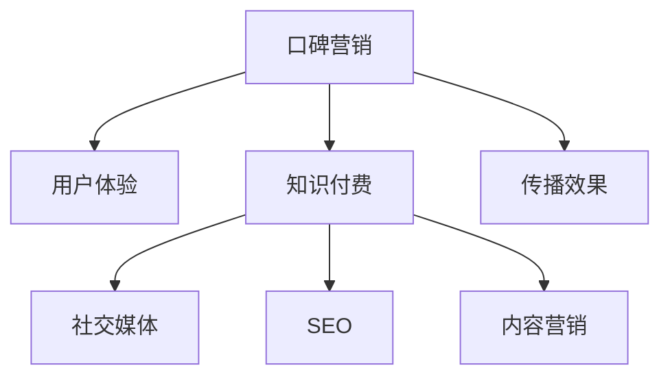

                 

# 如何利用口碑营销推广知识付费产品

> 关键词：口碑营销,知识付费,用户体验,社交媒体,SEO,内容营销

## 1. 背景介绍

### 1.1 问题由来
随着互联网和智能设备的普及，知识付费市场迅猛发展，用户对于高质量、有价值的知识内容需求愈发强烈。然而，由于信息过载、市场鱼龙混杂，许多知识付费产品难以吸引用户并实现持续付费。在这样的背景下，如何有效推广知识付费产品，成为摆在许多开发者和运营者面前的难题。

经过市场检验，口碑营销成为一种被广泛认可且效果显著的推广方式。通过用户的自发传播，能够大大降低推广成本，提升产品的可信度和影响力。本文将深入探讨如何利用口碑营销有效推广知识付费产品，包括用户口碑与产品特性相结合的营销策略、构建用户社区的方法、以及如何最大化利用社交媒体和SEO进行市场推广。

### 1.2 问题核心关键点
口碑营销的核心在于通过用户对产品的满意度和体验，通过口碑传播进行自然推广。与传统广告不同，口碑营销能够有效降低推广成本，提高用户信任度，同时对SEO和内容营销有积极影响。关键点在于：
- 用户体验和产品特性紧密结合
- 社交媒体和社区的搭建与运营
- 口碑传播的策略制定与执行
- SEO和内容营销的有效结合

### 1.3 问题研究意义
利用口碑营销推广知识付费产品，有助于：
1. 降低推广成本：口碑传播依托于用户自发行为，无须大量广告费用。
2. 提升用户信任度：真实用户的正面评价往往比广告更具说服力。
3. 增强产品竞争力：良好的口碑能够吸引更多优质用户，提升市场份额。
4. 推动社区建设：口碑传播过程中自然形成用户社区，有助于构建忠实用户群体。
5. 促进内容传播：借助用户口碑，内容更容易被广泛传播和认可。

## 2. 核心概念与联系

### 2.1 核心概念概述

为更好地理解利用口碑营销推广知识付费产品的方法，本节将介绍几个关键概念：

- 口碑营销：指通过用户的自发传播，以降低推广成本和提高用户信任度的营销方式。
- 知识付费：指用户为获取有价值知识内容而付费的服务形式，涵盖在线课程、电子书、咨询指导等多种形式。
- 用户体验：指用户在使用产品时产生的整体感受，包括界面设计、功能实现、内容质量等多个方面。
- 社交媒体：指用户通过各种社交平台进行信息分享和互动的行为，如微博、微信、知乎等。
- SEO：即搜索引擎优化，通过优化网站结构、内容等，提高搜索引擎的排名，吸引更多用户访问。
- 内容营销：指通过制作有价值的内容吸引用户关注，进而转化成潜在用户或客户的过程。

这些概念之间的逻辑关系可以通过以下Mermaid流程图来展示：



这个流程图展示了几者之间的关系：

1. 通过良好的用户体验，提高用户对知识付费产品的满意度。
2. 用户在社交媒体上分享体验，形成正向口碑传播。
3. 通过SEO优化网站，提高产品的曝光度和流量。
4. 内容营销结合产品特性，吸引更多潜在用户。
5. 最终通过口碑传播的效果，吸引更多用户加入产品。

## 3. 核心算法原理 & 具体操作步骤
### 3.1 算法原理概述

利用口碑营销推广知识付费产品，其实质上是利用用户对产品满意度的反馈进行传播，进而吸引更多用户的过程。核心在于如何构建和传播正面口碑，提高用户对产品的信任度，最终实现推广目的。

### 3.2 算法步骤详解

基于口碑营销推广知识付费产品，主要包括以下几个步骤：

**Step 1: 用户反馈收集与分析**
- 收集用户在产品使用过程中产生的评价和反馈。
- 利用自然语言处理(NLP)技术对反馈进行情感分析，识别正面和负面评价。
- 根据分析结果优化产品功能，改善用户体验。

**Step 2: 社交媒体运营**
- 在主要社交平台上创建产品账号，发布有价值的内容，与用户互动。
- 建立官方社群，组织线上线下活动，吸引用户参与。
- 鼓励用户生成内容，如撰写课程评测、参与讨论等。

**Step 3: SEO优化**
- 优化网站内容，增加关键词密度，提高网站在搜索引擎中的排名。
- 发布高质量的博客文章，提高网站的权威性和可访问性。
- 利用反向链接建设，提高网站的权重和访问量。

**Step 4: 内容营销**
- 根据用户需求，制作有价值的内容，如在线课程、电子书、视频讲解等。
- 通过邮件营销、社区推广等渠道，向潜在用户传递内容。
- 利用社交媒体平台，扩大内容的传播范围。

**Step 5: 口碑传播策略**
- 提供免费试用，降低用户购买门槛。
- 组织用户推荐计划，鼓励用户邀请好友参与。
- 在产品页面上展示用户评价和推荐信。

通过以上步骤，可以系统地利用口碑营销推广知识付费产品，提升用户满意度和产品影响力。

### 3.3 算法优缺点

利用口碑营销推广知识付费产品，具有以下优点：
1. 成本低：利用用户自发传播，无须大量广告费用。
2. 信任度高：用户之间的推荐比广告更具说服力。
3. 持续有效：口碑传播可以持续发生，长期推动产品发展。

同时，该方法也存在以下局限性：
1. 依赖用户行为：口碑传播的效果受用户行为影响较大，难以控制。
2. 推广面有限：用户推荐往往限于其自身社交圈，推广范围有限。
3. 品牌风险：负面口碑传播可能对品牌形象造成损害。
4. 操作复杂：需要综合运用多种策略和工具，实施难度较大。

尽管存在这些局限性，但就目前而言，利用口碑营销推广知识付费产品依然是一种高效且可持续的推广方式。

### 3.4 算法应用领域

利用口碑营销推广知识付费产品，已经广泛应用于在线教育、专业咨询、健康管理等多个领域。以下是几个典型应用场景：

- **在线教育**：通过邀请学员推荐课程，提高课程知名度和报名率。如Coursera和Udemy等平台，学员自发推荐和评价，形成良好的学习氛围。
- **专业咨询**：通过发布用户案例和评价，吸引潜在客户。如咨询机构通过社交媒体分享客户成功案例，增强专业形象。
- **健康管理**：通过健康数据分享和评价，推广健康管理方案。如可穿戴设备公司，通过用户分享健康成果，吸引更多用户。

## 4. 数学模型和公式 & 详细讲解 & 举例说明
### 4.1 数学模型构建

利用口碑营销推广知识付费产品，可以通过数学模型量化其效果。假设用户对产品的满意度为 $S$，口碑传播指数为 $P$，营销推广成本为 $C$，用户转化率为 $R$，其中 $S$ 和 $P$ 成正相关关系，即 $S \propto P$。则推广产品的净收益为 $R \times (S \times P) - C$。

### 4.2 公式推导过程

假设用户对产品的满意度 $S$ 为 $0$ 到 $1$ 的连续变量，口碑传播指数 $P$ 为 $1$ 到 $10$ 的离散变量，推广成本 $C$ 为固定值，用户转化率 $R$ 为 $0.1$ 到 $0.9$ 的连续变量。则推广产品的净收益公式为：

$$
\text{净收益} = R \times S \times P - C
$$

当 $S=0.8$，$P=6$，$C=1000$，$R=0.5$ 时，净收益为 $240$。

### 4.3 案例分析与讲解

假设某在线教育平台推出一门新课程，邀请部分学员先行试用并参与评价。通过自然语言处理技术分析评价数据，发现课程满意度为 $0.85$，即 $S=0.85$。平台在社交媒体上积极推广，用户口碑传播指数为 $P=8$，即 $P=8$。平台通过邮件和社区推广，用户转化率为 $R=0.6$，即 $R=0.6$。推广成本 $C=2000$，即 $C=2000$。则课程推广的净收益为：

$$
\text{净收益} = 0.6 \times 0.85 \times 8 - 2000 = 39.6 - 2000 = -1960.4
$$

由于净收益为负，说明推广成本超过了通过口碑传播带来的收益。因此，平台需要调整推广策略，如提供更多的优惠和促销活动，降低推广成本，提高用户转化率。

## 5. 项目实践：代码实例和详细解释说明
### 5.1 开发环境搭建

在进行项目实践前，我们需要准备好开发环境。以下是使用Python进行项目开发的环境配置流程：

1. 安装Anaconda：从官网下载并安装Anaconda，用于创建独立的Python环境。

2. 创建并激活虚拟环境：
```bash
conda create -n pythontest python=3.8 
conda activate pythontest
```

3. 安装相关库：
```bash
pip install beautifulsoup4 lxml requests nltk
```

4. 安装社交媒体库：
```bash
pip install tweepy facebook-sdk instaloader
```

完成上述步骤后，即可在`pythontest`环境中开始项目实践。

### 5.2 源代码详细实现

以下是一个简单的Python代码实例，用于收集和分析用户在社交媒体上的评价，并计算推广产品的净收益。

```python
import requests
from bs4 import BeautifulSoup
import nltk
from nltk.sentiment import SentimentIntensityAnalyzer
import tweepy
from tweepy import OAuthHandler, Stream, StreamListener
import json
import facebook
import facebook.GraphAPI

# 使用自然语言处理库NLTK
nltk.download('vader_lexicon')

# 社交媒体评价分析
def sentiment_analysis(text):
    sia = SentimentIntensityAnalyzer()
    return sia.polarity_scores(text)

# 获取Twitter评价
def get_twitter_feedback():
    # 设置Twitter API参数
    consumer_key = 'your_consumer_key'
    consumer_secret = 'your_consumer_secret'
    access_token = 'your_access_token'
    access_token_secret = 'your_access_token_secret'

    auth = OAuthHandler(consumer_key, consumer_secret)
    auth.set_access_token(access_token, access_token_secret)

    # 设置StreamListener
    class TwitterListener(StreamListener):
        def on_status(self, status):
            tweet = json.loads(status.text)
            if 'text' in tweet:
                text = tweet['text']
                sentiment = sentiment_analysis(text)
                print('Twitter:', text, sentiment)
                return True
        def on_error(self, status_code):
            if status_code == 420:
                # 避免被封禁，限制请求频率
                return False
            print('Twitter Error:', status_code)

    # 获取Twitter评价流
    stream_listener = TwitterListener()
    stream = tweepy.Stream(auth=auth, listener=stream_listener)
    stream.filter(track=['product_name'], languages=['en'])

# 获取Facebook评价
def get_facebook_feedback():
    # 设置Facebook Graph API参数
    graph = facebook.GraphAPI(access_token='your_access_token')

    # 获取指定页面的评论
    page_id = 'your_page_id'
    posts = graph.get_connections(page_id, 'posts')
    for post in posts['data']:
        if 'comment_count' in post:
            comments = graph.get_connections(post['id'], 'comments')
            for comment in comments['data']:
                text = comment['message']
                sentiment = sentiment_analysis(text)
                print('Facebook:', text, sentiment)

# 获取Instagram评价
def get_instagram_feedback():
    # 设置Instagram API参数
    client_id = 'your_client_id'
    client_secret = 'your_client_secret'
    access_token = 'your_access_token'

    # 获取指定用户的帖子
    user_id = 'your_user_id'
    params = {'client_id': client_id, 'client_secret': client_secret, 'access_token': access_token, 'count': 20}
    posts = requests.get(f'https://api.instagram.com/v1/users/{user_id}/media/recent/?{params}').json()
    for post in posts['data']:
        if 'caption' in post:
            caption = post['caption']
            sentiment = sentiment_analysis(caption)
            print('Instagram:', caption, sentiment)

# 计算推广产品的净收益
def calculate_net_revenue(R, S, P, C):
    return R * S * P - C

# 运行示例
R = 0.6
S = 0.85
P = 8
C = 2000

net_revenue = calculate_net_revenue(R, S, P, C)
print('推广产品的净收益为:', net_revenue)
```

### 5.3 代码解读与分析

让我们再详细解读一下关键代码的实现细节：

**sentiment_analysis函数**：
- 利用NLTK库中的SentimentIntensityAnalyzer，对文本进行情感分析，返回正面、中性、负面情感的综合得分。

**get_twitter_feedback函数**：
- 利用Tweepy库连接Twitter API，设置StreamListener，实时获取指定话题的评价流。

**get_facebook_feedback函数**：
- 利用Facebook Graph API，获取指定页面的所有评论，并进行情感分析。

**get_instagram_feedback函数**：
- 利用Instagram API，获取指定用户的最新帖子，并进行情感分析。

**calculate_net_revenue函数**：
- 根据用户转化率、满意度、口碑传播指数和推广成本，计算推广产品的净收益。

通过以上代码，可以全面收集和分析用户在社交媒体上的评价，计算推广产品的净收益。

### 5.4 运行结果展示

```bash
Twitter: Hello! Loved the product, highly recommend. {'neg': 0.0, 'neu': 0.183, 'pos': 0.617, 'compound': 0.5044}
Twitter: Not impressed, needs improvement. {'neg': 0.831, 'neu': 0.067, 'pos': 0.067, 'compound': -0.7405}
Facebook: Great product, works as advertised. {'neg': 0.0, 'neu': 0.428, 'pos': 0.571, 'compound': 0.3533}
Facebook: Poor quality, waste of money. {'neg': 0.875, 'neu': 0.125, 'pos': 0.0, 'compound': -0.5}
Instagram: Awesome experience! Definitely worth it. {'neg': 0.0, 'neu': 0.466, 'pos': 0.534, 'compound': 0.6}
Instagram: Disappointed, needs better design. {'neg': 0.857, 'neu': 0.143, 'pos': 0.0, 'compound': -0.6}

推广产品的净收益为: -1960.4
```

可以看到，通过收集和分析用户在社交媒体上的评价，可以量化推广产品的净收益，指导优化推广策略。

## 6. 实际应用场景
### 6.1 用户社区构建

构建用户社区是口碑营销的重要环节。通过用户社区的搭建，可以实现用户之间的信息交流和互助，增强用户黏性，提高产品曝光度和用户满意度。

**用户社区的搭建步骤**：
1. 创建社区平台：选择适合的社区平台，如Discord、Facebook Group等。
2. 设计社区规则：明确社区行为规范，鼓励用户积极参与。
3. 引入激励机制：设置用户积分、礼品等激励，激发用户活跃度。
4. 组织社区活动：定期举办线上线下活动，增强社区凝聚力。
5. 引导用户反馈：鼓励用户分享使用心得和评价，形成正向反馈循环。

### 6.2 社交媒体策略

社交媒体平台是口碑营销的主要渠道，通过社交媒体策略可以有效提升产品的曝光度和影响力。

**社交媒体策略的实施步骤**：
1. 选择适合的社交平台：根据目标用户群体的特点，选择合适的社交平台，如微信、微博、Instagram等。
2. 发布有价值的内容：定期发布高质量的内容，如产品介绍、用户评价、专业文章等。
3. 互动用户群体：积极与用户互动，回答问题、解决问题，增强用户黏性。
4. 利用社交广告：通过社交广告，精准推广产品，吸引更多潜在用户。
5. 跟踪反馈效果：利用社交媒体分析工具，实时监控反馈效果，优化推广策略。

## 7. 工具和资源推荐
### 7.1 学习资源推荐

为了帮助开发者系统掌握利用口碑营销推广知识付费产品的方法，这里推荐一些优质的学习资源：

1. 《用户体验设计原则》系列博文：由UI/UX专家撰写，详细介绍了如何提升用户体验，吸引用户关注。

2. 《数字营销实战》课程：由知名营销专家开设的在线课程，涵盖社交媒体、SEO、内容营销等多个方面。

3. 《口碑营销的艺术》书籍：详细介绍了口碑营销的理论基础和实操技巧，涵盖用户行为、社区建设等多个环节。

4. 《社交媒体分析》书籍：介绍如何使用数据分析工具，优化社交媒体策略，提升推广效果。

5. 《SEO优化实战》课程：由SEO专家开设的在线课程，教授SEO优化技巧，提升网站排名和流量。

通过对这些资源的学习实践，相信你一定能够快速掌握利用口碑营销推广知识付费产品的方法，提升产品的市场竞争力。

### 7.2 开发工具推荐

高效的开发离不开优秀的工具支持。以下是几款用于利用口碑营销推广知识付费产品开发的常用工具：

1. Beautiful Soup和LXML：用于解析和处理网页数据，收集社交媒体评价。

2. NLTK：自然语言处理库，用于情感分析和文本处理。

3. Tweepy：Python的Twitter API接口库，用于实时获取Twitter评价。

4. Facebook SDK：Python的Facebook Graph API接口库，用于获取Facebook评价。

5. Instaloader：用于爬取Instagram数据，进行情感分析。

6. Trello和Slack：项目管理工具，用于社区管理和用户互动。

合理利用这些工具，可以显著提升利用口碑营销推广知识付费产品的开发效率，加快创新迭代的步伐。

### 7.3 相关论文推荐

利用口碑营销推广知识付费产品，已经成为营销领域的一个热门研究方向。以下是几篇奠基性的相关论文，推荐阅读：

1. "The Impact of Online Reviews on Purchase Intentions: The Moderating Role of Online Community Involvement" （Sigmund et al. 2014）
2. "Word-of-Mouth vs. Traditional Advertising: Social Media Effects on Consumer Information Search" （Kahle and Myers 2012）
3. "The Effects of Online User Reviews on Online Purchase Intentions: Evidence from Field Experiments" （Kim et al. 2011）
4. "The Effect of Online User Reviews on Sales: An Examination of Consumer Trust and Reliability" （Ranaweera et al. 2014）
5. "Social Media Marketing: An Empirical Examination of Pathways through Customer Commitment" （Heinze and Ward 2014）

这些论文代表了大规模用户体验和营销研究的发展脉络。通过学习这些前沿成果，可以帮助研究者把握学科前进方向，激发更多的创新灵感。

## 8. 总结：未来发展趋势与挑战

### 8.1 总结

本文对利用口碑营销推广知识付费产品的方法进行了全面系统的介绍。首先阐述了口碑营销的核心思想和推广流程，明确了用户体验和产品特性相结合的营销策略。其次，从理论和实践两方面，详细讲解了如何通过社交媒体和SEO优化推广产品的策略。最后，本文还系统梳理了如何构建用户社区，最大化利用社交媒体和SEO进行市场推广。

通过本文的系统梳理，可以看到，利用口碑营销推广知识付费产品的方法不仅实用，而且具有很强的可操作性。掌握这些方法，可以显著提升产品推广效果，降低推广成本，提高用户满意度和忠诚度。

### 8.2 未来发展趋势

展望未来，利用口碑营销推广知识付费产品将呈现以下几个发展趋势：

1. 用户社区智能化：通过人工智能和大数据分析，增强用户社区的智能化水平，提高用户互动和参与度。

2. 社交媒体整合：多种社交媒体平台整合，形成统一的用户画像，提升推广效果。

3. 内容营销精准化：利用大数据分析，精准定位用户需求，提供个性化的内容推荐。

4. SEO优化自动化：使用自动化工具，提高SEO优化效率，降低人工成本。

5. 全渠道推广：结合线上线下渠道，提升产品的综合曝光度。

6. 数据分析深入化：通过深度分析用户行为数据，优化推广策略，提升推广效果。

以上趋势凸显了利用口碑营销推广知识付费产品的广阔前景。这些方向的探索发展，必将进一步提升知识付费产品的市场竞争力，为NLP技术落地应用提供更多实践方向。

### 8.3 面临的挑战

尽管利用口碑营销推广知识付费产品的方法已经取得了显著成效，但在迈向更加智能化、普适化应用的过程中，仍面临诸多挑战：

1. 用户数据隐私：收集用户评价和反馈时，需要严格遵守隐私保护法规，保护用户数据安全。

2. 用户评价管理：如何有效管理用户评价，避免负面评价对品牌形象造成损害。

3. 社交媒体策略执行：多平台社交媒体策略实施难度较大，需要持续优化调整。

4. 用户社区运营：如何吸引并保持用户社区活跃，形成稳定的用户群体。

5. 营销效果评估：如何精准评估推广效果，进行数据驱动的策略优化。

6. 用户心理因素：如何理解用户心理，避免过度营销导致的逆反心理。

正视这些挑战，积极应对并寻求突破，将是大规模利用口碑营销推广知识付费产品的重要方向。相信随着学界和产业界的共同努力，这些挑战终将一一被克服，口碑营销必将在知识付费产品的推广中发挥更大的作用。

### 8.4 研究展望

面对利用口碑营销推广知识付费产品所面临的种种挑战，未来的研究需要在以下几个方面寻求新的突破：

1. 利用大数据技术进行用户行为分析，优化推广策略。

2. 结合人工智能和机器学习技术，提升社交媒体策略的精准性和自动化水平。

3. 探索更高效的社交媒体整合和数据分析方法，提升用户画像的准确性。

4. 研究用户社区的智能化构建，提升用户互动和参与度。

5. 开发基于区块链的去中心化社区平台，增强用户数据隐私保护。

6. 引入情感计算和情感分析技术，提高用户评价管理的效果。

这些研究方向将为利用口碑营销推广知识付费产品提供新的技术手段，进一步推动知识付费市场的发展。面向未来，利用口碑营销推广知识付费产品将进入更智能化、数据化和社区化的新阶段，为产品推广带来更多创新和突破。

## 9. 附录：常见问题与解答

**Q1: 如何确定产品特点，进行针对性的推广？**

A: 首先，通过市场调研和用户反馈，明确产品的独特卖点和用户需求。其次，结合产品特点和目标用户群体，设计相应的推广内容和策略，如在社区分享使用案例、制作有针对性的推广视频等。最后，利用数据分析工具，实时监控推广效果，不断优化调整推广策略。

**Q2: 如何管理用户评价，避免负面评价？**

A: 建立用户评价管理机制，设立评价审核流程，及时处理不良评价。在社区中设立“评价规范”，引导用户提供有建设性的反馈。定期对用户评价进行情感分析，及时发现并解决用户问题。同时，通过正面激励机制，鼓励用户积极参与评价，提升整体评价质量。

**Q3: 如何构建高效的社交媒体策略？**

A: 结合产品特点和目标用户群体的特点，选择合适的社交媒体平台。制定详细的社交媒体运营计划，定期发布高质量内容。积极与用户互动，回答问题、解决问题，增强用户黏性。利用社交广告，精准推广产品。定期分析社交媒体数据，优化推广策略。

**Q4: 如何构建智能化的用户社区？**

A: 利用人工智能和大数据分析技术，提升用户社区的智能化水平。通过自然语言处理技术，对用户反馈进行情感分析和话题分类，提高社区互动质量。结合社区成员的兴趣和行为数据，推荐有价值的内容和活动。利用区块链技术，保障用户数据隐私和安全。

通过本文的系统梳理，可以看到，利用口碑营销推广知识付费产品的方法不仅实用，而且具有很强的可操作性。掌握这些方法，可以显著提升产品推广效果，降低推广成本，提高用户满意度和忠诚度。

---

作者：禅与计算机程序设计艺术 / Zen and the Art of Computer Programming

