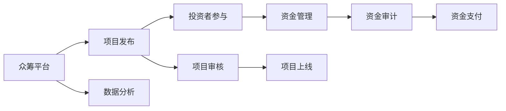

                 

# 如何利用技术能力进行众筹

## 1. 背景介绍

众筹是一种新型的融资模式，它通过互联网平台将投资者与创业项目连接起来，项目发起者（创业者）提出项目创意、目标、计划和预期回报，吸引潜在投资者的支持，筹集项目所需资金。这种模式打破了传统金融体系的束缚，为创业者提供了更多元化的融资渠道，也为投资者提供了更多元化的投资机会。然而，众筹不仅是一种金融行为，更是一种技术应用。

本文章将深入探讨如何利用技术能力进行众筹，不仅包括基本的平台搭建和技术实现，还涉及项目管理和数据驱动的决策分析。我们将从概念、算法、具体实践和应用场景等多个角度全面剖析众筹的技术核心，为有意从事众筹平台的开发者和创业者提供全面的技术指南。

## 2. 核心概念与联系

### 2.1 核心概念概述

在众筹平台中，技术能力贯穿始终，从项目发布、投资者互动、资金管理和数据分析，每一个环节都离不开技术的支持。以下是众筹平台中几个核心概念及其关联：

- **众筹平台**：即众筹网站或应用程序，它为项目发布者提供展示项目的机会，为投资者提供评估和支持项目的手段。平台通常由前端页面、后端服务、数据库和支付系统组成。

- **项目发起**：项目发起者需要在平台上发布项目信息，包括项目名称、目标金额、项目描述、预期回报等。项目信息的质量和吸引力直接影响到项目的成功率。

- **投资者参与**：投资者根据项目信息和自身投资偏好，选择支持项目。投资者需完成注册、审核和资金投入等步骤，通过平台与项目发起者沟通，甚至可能参与项目的早期决策。

- **资金管理**：众筹平台需负责项目的资金管理和分配。一旦项目成功筹资，平台需确保资金安全、合规和按期支付。

- **数据分析**：众筹平台需具备强大的数据分析能力，对项目进展、投资者行为、市场趋势等进行实时监控和分析，为平台运营和项目评估提供决策支持。

### 2.2 核心概念原理和架构的 Mermaid 流程图



## 3. 核心算法原理 & 具体操作步骤

### 3.1 算法原理概述

众筹平台的技术实现涉及前端页面、后端服务、数据库管理、支付系统等多个方面。在众筹平台上，前端页面通过JavaScript等技术实现交互式用户界面，后端服务通过API和服务器处理业务逻辑，数据库通过SQL或NoSQL技术存储和管理数据，支付系统通过支付网关保证交易安全。

### 3.2 算法步骤详解

#### 3.2.1 前端页面设计

前端页面设计是众筹平台的用户界面。其核心在于如何吸引潜在投资者关注项目，并提供清晰的交互方式。设计者需考虑以下几个要素：

1. **用户体验（UX）**：界面需简洁直观，便于投资者快速理解项目信息。
2. **用户界面（UI）**：界面元素需美观大方，易于吸引投资者注意力。
3. **交互设计**：需提供简洁的注册、登录、投资流程，使投资者操作顺畅。
4. **动态内容**：需实时更新项目进展、资金情况、投资者反馈等动态内容，增加投资者参与度。

#### 3.2.2 后端服务实现

后端服务是众筹平台的核心功能模块，主要处理用户注册、项目审核、资金管理、数据分析等业务逻辑。

1. **用户管理**：需设计用户注册、登录、认证等功能，保障平台安全。
2. **项目审核**：需实现项目发布审核机制，确保项目信息真实可靠。
3. **资金管理**：需实现资金安全存储、按比例分配等功能，确保资金透明公正。
4. **数据分析**：需集成数据分析工具，实时监控项目进展和投资者行为。

#### 3.2.3 数据库设计

数据库是众筹平台的数据存储和管理工具。需设计合理的数据表结构和索引，以保障数据的存储效率和查询性能。

1. **用户表**：记录用户基本信息、注册信息、投资记录等。
2. **项目表**：记录项目基本信息、进度、资金情况等。
3. **交易表**：记录交易流水、支付记录等。
4. **日志表**：记录用户行为、系统操作等日志信息，便于分析和审计。

#### 3.2.4 支付系统实现

支付系统是众筹平台的重要功能模块，需实现资金的支付、退款、退税等功能。

1. **支付接口**：需与第三方支付平台对接，提供支付接口，处理交易请求。
2. **退款机制**：需设计退款流程，保障投资者权益。
3. **退税功能**：需支持退税申请和处理，减少税收影响。

### 3.3 算法优缺点

#### 3.3.1 优点

1. **灵活性**：众筹平台技术实现具有一定的灵活性，可以根据项目和投资者的需求进行调整和优化。
2. **透明度**：众筹平台通过公开信息，提高了项目的透明度和可信度，增加了投资者的信任。
3. **多样化**：众筹平台为投资者提供了多样化的投资选择，满足了不同投资者的需求。

#### 3.3.2 缺点

1. **风险高**：众筹平台面临项目失败的风险，需承担投资者资金损失的风险。
2. **监管要求**：众筹平台需符合相关法律法规要求，需对项目和投资者进行严格的审核和监管。
3. **技术复杂**：众筹平台的实现涉及多个技术领域，需具备较强的技术能力和经验。

### 3.4 算法应用领域

众筹平台技术实现的应用领域广泛，涉及多个行业和领域。以下是几个典型的应用场景：

1. **创意项目**：如艺术、音乐、电影、游戏等创意项目的众筹。
2. **科技创新**：如技术开发、硬件研发等科技项目的众筹。
3. **公益事业**：如教育、环保、医疗等公益项目的众筹。
4. **商业企业**：如初创企业、小微企业的众筹。
5. **创业孵化**：如创业孵化器、加速器的众筹。

## 4. 数学模型和公式 & 详细讲解 & 举例说明

### 4.1 数学模型构建

在众筹平台中，数据分析和决策优化是其核心功能之一。我们可以建立一个基于统计学的数学模型，用于分析项目成功率、投资者行为等关键指标。

假设众筹平台有 $N$ 个项目，每个项目 $i$ 的融资目标为 $F_i$，实际筹资量为 $C_i$，项目成功率为 $P_i$。设平台上有 $M$ 个投资者，每个投资者 $j$ 的资金量为 $I_j$，已投资项目数为 $N_j$。

定义平台平均筹资率为 $R$，即所有项目的平均筹资率，定义为：

$$ R = \frac{1}{N} \sum_{i=1}^N C_i / F_i $$

定义平台平均投资回报率为 $R'$，即所有投资者平均投资回报率，定义为：

$$ R' = \frac{1}{M} \sum_{j=1}^M \frac{1}{N_j} \sum_{i=1}^N \frac{C_i}{I_j} \cdot P_i $$

### 4.2 公式推导过程

利用上述定义的数学模型，我们可以推导平台成功率的表达式：

$$ S = \frac{1}{N} \sum_{i=1}^N P_i $$

其中，$S$ 表示平台成功筹资的项目比例。

通过分析 $R$ 和 $R'$ 与 $S$ 的关系，我们可以建立回归模型，预测平台成功率。例如，利用线性回归模型：

$$ S = \beta_0 + \beta_1 R + \beta_2 R' + \epsilon $$

其中，$\beta_0$、$\beta_1$、$\beta_2$ 为回归系数，$\epsilon$ 为误差项。

### 4.3 案例分析与讲解

假设某众筹平台有 $N=100$ 个项目，每个项目的融资目标为 $F_i \in [1,10]$，实际筹资量为 $C_i$，项目成功率为 $P_i$。设平台上有 $M=1000$ 个投资者，每个投资者 $j$ 的资金量为 $I_j \in [1,100]$，已投资项目数为 $N_j$。

我们通过分析平台历史数据，发现平均筹资率 $R$ 为 $0.8$，平均投资回报率 $R'$ 为 $0.5$，平台成功率 $S$ 为 $0.6$。根据上述线性回归模型，我们可以得到回归系数 $\beta_0=0.2$、$\beta_1=0.1$、$\beta_2=0.2$。

这意味着，平台平均筹资率每增加 $0.1$，平台成功率将增加 $0.01$，平均投资回报率每增加 $0.1$，平台成功率将增加 $0.02$。通过回归模型，我们可以预测未来项目的成功率，优化平台的运营策略。

## 5. 项目实践：代码实例和详细解释说明

### 5.1 开发环境搭建

在开发众筹平台时，我们首先需要搭建开发环境。以下是使用Python和Django框架搭建众筹平台的简单流程：

1. **安装Python**：从官网下载并安装Python 3.8。
2. **安装Django**：使用pip安装Django框架。
3. **创建项目**：在命令行中执行 `django-admin startproject myproject`。
4. **创建应用**：在命令行中执行 `python manage.py startapp myapp`。
5. **配置数据库**：在`settings.py`中配置数据库连接信息。

### 5.2 源代码详细实现

以下是众筹平台核心模块的Python代码实现：

#### 5.2.1 用户注册和登录

```python
from django.contrib.auth.forms import UserCreationForm
from django.contrib.auth.models import User

class RegistrationForm(UserCreationForm):
    email = forms.EmailField()

    def save(self, commit=True):
        user = super(RegistrationForm, self).save(commit=False)
        user.email = self.cleaned_data['email']
        if commit:
            user.save()
        return user
```

#### 5.2.2 项目发布和审核

```python
from django.db import models
from django.contrib.auth.models import User

class Project(models.Model):
    title = models.CharField(max_length=255)
    description = models.TextField()
    goal = models.DecimalField(max_digits=10, decimal_places=2)
    current = models.DecimalField(max_digits=10, decimal_places=2)
    state = models.CharField(max_length=20, choices=[('active', 'Active'), ('inactive', 'Inactive')])
    owner = models.ForeignKey(User, on_delete=models.CASCADE)
    def __str__(self):
        return self.title

class ProjectReview(models.Model):
    project = models.ForeignKey(Project, on_delete=models.CASCADE)
    user = models.ForeignKey(User, on_delete=models.CASCADE)
    content = models.TextField()
    date = models.DateTimeField(auto_now_add=True)
    def __str__(self):
        return f"{self.project.title} - Review by {self.user.username}"
```

#### 5.2.3 投资者投资和资金管理

```python
from django.db import models
from django.contrib.auth.models import User

class Investment(models.Model):
    project = models.ForeignKey(Project, on_delete=models.CASCADE)
    user = models.ForeignKey(User, on_delete=models.CASCADE)
    amount = models.DecimalField(max_digits=10, decimal_places=2)
    date = models.DateTimeField(auto_now_add=True)
    def __str__(self):
        return f"{self.project.title} - Invested by {self.user.username} - {self.amount}"

class ProjectBalance(models.Model):
    project = models.ForeignKey(Project, on_delete=models.CASCADE)
    amount = models.DecimalField(max_digits=10, decimal_places=2)
    date = models.DateTimeField(auto_now_add=True)
    def __str__(self):
        return f"{self.project.title} - Balance on {self.date}"
```

### 5.3 代码解读与分析

上述代码实现了用户注册、项目发布、审核、投资和资金管理等功能。

**用户注册**：使用Django内置的UserCreationForm，实现用户注册功能。在保存用户时，将邮箱信息保存至User模型中。

**项目发布**：使用Django的Model功能，定义Project模型，记录项目基本信息。ProjectReview模型用于记录项目的审核信息，便于平台管理。

**投资者投资**：定义Investment模型，记录投资者的投资信息。ProjectBalance模型用于记录项目的资金情况，便于资金管理。

### 5.4 运行结果展示

运行上述代码，可以在浏览器中查看众筹平台的界面。用户可以注册、登录、发布项目、审核项目、投资等，平台管理员可以查看项目进展、资金情况等。

## 6. 实际应用场景

### 6.1 创意项目众筹

创意项目如艺术、音乐、电影、游戏等，通常具有较高的投资回报率。众筹平台可以为这些项目提供展示机会，吸引投资者支持。

### 6.2 科技创新众筹

科技创新项目如技术开发、硬件研发等，需大量资金投入。众筹平台可以为这些项目提供资金支持，加速研发进程。

### 6.3 公益事业众筹

公益事业如教育、环保、医疗等，通常缺乏资金支持。众筹平台可以为这些项目提供资金援助，促进公益事业的发展。

### 6.4 商业企业众筹

商业企业如初创企业、小微企业等，需快速筹集资金。众筹平台可以为这些企业提供融资渠道，助力其发展。

### 6.5 创业孵化众筹

创业孵化器和加速器通常需大量资金支持。众筹平台可以为这些孵化器提供资金支持，加速创业企业的成长。

## 7. 工具和资源推荐

### 7.1 学习资源推荐

#### 7.1.1 Django官方文档

Django官方文档详细介绍了Django框架的使用方法和最佳实践，适合初学者和进阶开发者。

#### 7.1.2 Django Girl教程

Django Girl教程为新手提供了Django框架的入门教程，简单易懂，适合初学者。

#### 7.1.3 Django Cookbook

Django Cookbook提供了丰富的Django应用实例和解决方案，适合进阶开发者。

### 7.2 开发工具推荐

#### 7.2.1 Python

Python是一种流行的编程语言，具有简洁易学、功能强大的特点。Python广泛用于Web开发、数据科学等领域。

#### 7.2.2 Django

Django是一个高层次的Web框架，具有快速开发、安全可靠的特点。Django适合构建复杂的Web应用。

#### 7.2.3 PostgreSQL

PostgreSQL是一个功能强大的开源数据库，具有高可靠性、高扩展性等特点。PostgreSQL适合处理复杂的数据结构。

### 7.3 相关论文推荐

#### 7.3.1 Crowdfunding Analytics and Innovation
这篇论文研究了众筹数据分析在创新过程中的作用，探讨了众筹平台的数据驱动决策。

#### 7.3.2 The Crowdfunding Solution: How and Why
这篇论文探讨了众筹平台的解决方案，分析了众筹平台的技术实现和业务模式。

#### 7.3.3 Crowdfunding Projects: Characteristics, Results and Impact
这篇论文研究了众筹项目的特点、结果和影响，探讨了众筹平台的应用效果。

## 8. 总结：未来发展趋势与挑战

### 8.1 总结

众筹平台技术能力的应用，为项目发布、投资者互动、资金管理和数据分析提供了全面支持。通过前端页面设计、后端服务实现、数据库管理和支付系统实现，众筹平台实现了投资者和项目发起者的高效互动。

### 8.2 未来发展趋势

#### 8.2.1 大数据分析

大数据分析技术将进一步应用于众筹平台，通过数据挖掘和机器学习，预测项目成功率和投资者行为，优化运营策略。

#### 8.2.2 人工智能应用

人工智能技术将进一步应用于众筹平台，通过自然语言处理、计算机视觉等技术，提升平台的用户体验和业务处理能力。

#### 8.2.3 区块链技术

区块链技术将进一步应用于众筹平台，通过智能合约和分布式账本，保障资金安全和透明度。

### 8.3 面临的挑战

#### 8.3.1 技术复杂性

众筹平台的技术实现涉及多个技术领域，需具备较强的技术能力和经验。平台开发者需持续学习和更新技术栈。

#### 8.3.2 安全性

众筹平台需保障平台和用户数据的安全，防止信息泄露和资金盗窃。平台需采用多种安全措施，保障用户权益。

#### 8.3.3 法规合规

众筹平台需符合相关法律法规要求，需对项目和投资者进行严格的审核和监管。平台需持续关注法规变化，及时调整运营策略。

### 8.4 研究展望

#### 8.4.1 多模态众筹平台

多模态众筹平台结合了图像、视频、音频等多模态数据，提升了用户体验和平台互动能力。

#### 8.4.2 众筹社交网络

众筹社交网络通过构建用户社区，促进投资者和项目发起者的互动和沟通，提升了平台黏性和活跃度。

#### 8.4.3 实时众筹数据分析

实时众筹数据分析通过实时监控平台数据，预测项目进展和投资者行为，优化运营策略。

## 9. 附录：常见问题与解答

**Q1: 如何设计用户界面？**

A: 设计用户界面需考虑用户体验（UX）和用户界面（UI），通过简洁直观的界面和美观大方的布局，提升用户的使用体验。

**Q2: 如何实现项目审核机制？**

A: 项目审核机制需通过Django的Model功能实现，定义审核信息模型，记录项目审核状态和审核人信息。平台管理员需根据审核结果决定项目是否上线。

**Q3: 如何保障投资者权益？**

A: 保障投资者权益需实现资金安全和按期支付，通过Django的Model功能记录投资信息和项目资金情况，确保资金透明公正。

通过上述技术指南，我们可以全面掌握众筹平台的技术实现，为创业者提供强大的技术支持，推动众筹平台的发展和创新。

