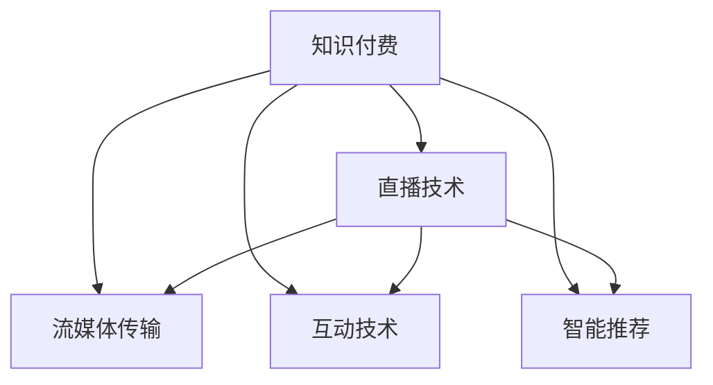

                 

# 如何利用直播技术提升知识付费效果

## 1. 背景介绍

### 1.1 问题由来
知识付费近年来在教育、技术、娱乐等多个领域迅速崛起，成为一种全新的学习方式。它不仅打破了时间和空间的限制，还通过高效、个性化的知识传递，满足用户深度学习和自主探索的需求。然而，知识付费的普及也面临诸多挑战，如内容质量参差不齐、用户粘性不足、付费转化率低等问题。

直播技术的引入，为知识付费模式带来了新的机遇和挑战。直播以其实时、互动、沉浸式的特点，能够大大提升知识传播的效率和效果，但同时也增加了技术实现的复杂度。因此，本文将探讨如何利用直播技术提升知识付费效果，在保证内容质量的同时，提高用户粘性和付费转化率。

### 1.2 问题核心关键点
直播技术在知识付费中的关键点主要包括以下几个方面：

- 实时互动：直播的实时性使得知识传递更加生动，能更好满足用户即时学习和互动的需求。
- 高效传播：直播的高效传播能力能够快速扩散知识，提升用户的获取感和参与度。
- 用户粘性：直播的沉浸式体验有助于增强用户对平台的黏性，形成稳定的用户群体。
- 定制化服务：直播技术的灵活性使得内容提供商能够提供更加个性化和定制化的知识服务。

## 2. 核心概念与联系

### 2.1 核心概念概述

为了更好地理解直播技术在知识付费中的应用，我们先介绍几个核心概念：

- 知识付费：以特定内容为付费对象的在线付费模式，通过知识传播实现价值变现。
- 直播技术：通过网络将音视频信号实时传输到终端用户，实现实时互动和即时反馈的技术。
- 流媒体传输：将音频或视频数据分割成多个数据包，以流的形式进行传输，减少延迟和带宽消耗。
- 互动技术：包括消息推送、投票、举手、弹幕等功能，增强用户参与感。
- 智能推荐：通过分析用户行为和兴趣，动态调整直播内容，提升用户体验。

这些核心概念之间的逻辑关系可以通过以下Mermaid流程图来展示：



这个流程图展示了大语言模型微调的核心概念及其之间的关系：

1. 知识付费通过直播技术实现高效传播和实时互动。
2. 流媒体传输和互动技术是直播的核心技术手段。
3. 智能推荐用于提升用户粘性和内容匹配度。

## 3. 核心算法原理 & 具体操作步骤
### 3.1 算法原理概述

直播技术在知识付费中的应用，本质上是将实时互动和高效传播的理念融入到知识内容交付中。直播的实时性使得知识传递更加生动，同时通过互动技术，增强了用户参与感和个性化体验。

形式化地，假设知识付费平台为用户提供的直播课程为 $L_{\theta}$，其中 $\theta$ 为课程设计、流媒体传输、互动技术等关键参数。给定用户 $U$ 和内容 $C$，直播的优化目标是最小化用户流失率，即找到最优参数：

$$
\theta^* = \mathop{\arg\min}_{\theta} \text{User Churn Rate}(U, C)
$$

在实践中，我们通常使用机器学习算法（如回归、分类等）来近似求解上述最优化问题。设 $X$ 为用户行为数据，$Y$ 为流失率标签，则训练集为 $D=\{(x_i, y_i)\}_{i=1}^N, x_i \in \mathcal{X}, y_i \in \{0,1\}$。直播平台需要训练一个预测模型 $M_{\theta}$，使其能够根据用户行为数据 $X$，预测流失概率 $Y$。

### 3.2 算法步骤详解

直播技术在知识付费中的应用一般包括以下几个关键步骤：

**Step 1: 准备直播环境**
- 选择合适的流媒体服务器和CDN服务，确保流媒体传输的稳定性和低延迟。
- 选择适合的互动技术栈，如WebRTC、RTMP等，实现直播间的消息交互和实时互动。
- 配置智能推荐引擎，对用户行为数据进行分析和建模，优化内容推荐策略。

**Step 2: 开发直播课程**
- 根据知识付费平台的需求，选择合适的知识内容，设计直播课程结构。
- 编写直播课程脚本，安排教学内容、互动环节、案例分析等。
- 使用流媒体工具包将课程内容编码成音视频流，供直播平台传输。

**Step 3: 设计互动环节**
- 设计互动环节，如Q&A、投票、举手等，增强用户参与感。
- 配置弹幕系统，实时显示用户留言和互动信息，营造互动氛围。
- 考虑用户隐私保护，对互动数据进行去标识化处理。

**Step 4: 实施智能推荐**
- 收集用户行为数据，包括观看时长、点赞数、评论等。
- 基于数据建模推荐算法，如协同过滤、深度学习等，生成用户个性化推荐内容。
- 实时更新推荐结果，动态调整直播内容，提升用户体验。

**Step 5: 测试和优化**
- 在测试集上测试直播课程效果，评估用户流失率和满意度。
- 根据测试结果，优化课程设计、互动环节和推荐算法。
- 持续收集用户反馈，调整课程内容和策略，实现用户闭环优化。

以上是直播技术在知识付费中的一般流程。在实际应用中，还需要针对具体平台的特点，对各个环节进行优化设计，如优化流媒体传输协议、提升互动体验、增强推荐算法等，以进一步提升用户粘性和课程质量。

### 3.3 算法优缺点

直播技术在知识付费中的应用具有以下优点：

1. 实时互动：直播的实时性使得知识传递更加生动，能够更好满足用户即时学习和互动的需求。
2. 高效传播：直播的高效传播能力能够快速扩散知识，提升用户的获取感和参与度。
3. 用户粘性：直播的沉浸式体验有助于增强用户对平台的黏性，形成稳定的用户群体。
4. 定制化服务：直播技术的灵活性使得内容提供商能够提供更加个性化和定制化的知识服务。

同时，直播技术在知识付费中也存在一些缺点：

1. 技术复杂度高：直播需要流媒体、互动、推荐等多项技术支持，技术实现难度大。
2. 数据安全风险：直播互动数据可能包含敏感信息，需要加强数据隐私和安全保护。
3. 带宽消耗大：直播的音视频流传输需要较高带宽，对网络资源要求高。
4. 质量控制难度：直播过程中容易出现卡顿、延时等问题，影响用户体验。

尽管存在这些局限性，但就目前而言，直播技术在知识付费中的应用仍是最为主流的方式之一。未来相关研究的重点在于如何进一步降低直播技术实现难度，提高互动体验，加强数据保护，同时兼顾用户体验和课程质量。

### 3.4 算法应用领域

直播技术在知识付费中的应用，覆盖了知识内容传播的各个环节，主要包括以下几个方面：

- 实时课程：如编程、设计、语言学习等，通过直播进行实时互动教学。
- 专题讨论：邀请专家、学者进行专题讲座和互动问答，提升知识深度和广度。
- 技术分享：分享前沿技术、工具和项目，通过实时互动增强用户体验。
- 案例分析：分析真实项目案例，通过互动技术增强用户理解。
- 编程辅导：通过实时编程直播，解决用户编程问题，提升编程技能。

除了上述这些常见应用外，直播技术还可以创新性地应用到更多场景中，如企业内训、医疗咨询、教育辅导等，为知识付费技术带来了新的应用空间。随着直播技术的不断演进，其与知识付费的深度融合，必将在更多领域带来突破和创新。

## 4. 数学模型和公式 & 详细讲解  
### 4.1 数学模型构建

本节将使用数学语言对直播技术在知识付费中的应用进行更加严格的刻画。

假设直播课程为 $L_{\theta}$，其中 $\theta$ 为课程设计、流媒体传输、互动技术等关键参数。给定用户 $U$ 和内容 $C$，直播的优化目标是最小化用户流失率，即找到最优参数：

$$
\theta^* = \mathop{\arg\min}_{\theta} \text{User Churn Rate}(U, C)
$$

在实践中，我们通常使用机器学习算法（如回归、分类等）来近似求解上述最优化问题。设 $X$ 为用户行为数据，$Y$ 为流失率标签，则训练集为 $D=\{(x_i, y_i)\}_{i=1}^N, x_i \in \mathcal{X}, y_i \in \{0,1\}$。直播平台需要训练一个预测模型 $M_{\theta}$，使其能够根据用户行为数据 $X$，预测流失概率 $Y$。

### 4.2 公式推导过程

以下我们以二分类任务为例，推导用户流失率的预测模型。

假设模型 $M_{\theta}$ 在用户行为数据 $X$ 上的输出为 $\hat{y}=M_{\theta}(X) \in [0,1]$，表示用户流失的概率。真实标签 $Y \in \{0,1\}$。则二分类交叉熵损失函数定义为：

$$
\ell(M_{\theta}(X),Y) = -[Y\log \hat{y} + (1-Y)\log (1-\hat{y})]
$$

将其代入经验风险公式，得：

$$
\mathcal{L}(\theta) = -\frac{1}{N}\sum_{i=1}^N [y_i\log M_{\theta}(X_i)+(1-y_i)\log(1-M_{\theta}(X_i))]
$$

根据链式法则，损失函数对参数 $\theta$ 的梯度为：

$$
\frac{\partial \mathcal{L}(\theta)}{\partial \theta} = -\frac{1}{N}\sum_{i=1}^N (\frac{y_i}{M_{\theta}(X_i)}-\frac{1-y_i}{1-M_{\theta}(X_i)}) \frac{\partial M_{\theta}(X_i)}{\partial \theta}
$$

其中 $\frac{\partial M_{\theta}(X_i)}{\partial \theta}$ 可进一步递归展开，利用自动微分技术完成计算。

在得到损失函数的梯度后，即可带入参数更新公式，完成模型的迭代优化。重复上述过程直至收敛，最终得到适应知识付费用户流失预测的最优模型参数 $\theta^*$。

## 5. 项目实践：代码实例和详细解释说明
### 5.1 开发环境搭建

在进行直播技术在知识付费中的应用实践前，我们需要准备好开发环境。以下是使用Python进行Flask框架开发的环境配置流程：

1. 安装Anaconda：从官网下载并安装Anaconda，用于创建独立的Python环境。

2. 创建并激活虚拟环境：
```bash
conda create -n flask-env python=3.8 
conda activate flask-env
```

3. 安装Flask：
```bash
pip install Flask
```

4. 安装必要的流媒体和互动库：
```bash
pip install gevent flask-cors
```

5. 安装交互式即时数据可视化库：
```bash
pip install pandas matplotlib
```

6. 配置环境变量：
```bash
echo "export FLASK_APP=app.py" >> .bash_profile
```

完成上述步骤后，即可在`flask-env`环境中开始直播技术在知识付费中的应用开发。

### 5.2 源代码详细实现

下面我以知识付费平台直播课程为例，给出使用Flask框架实现直播互动功能的前端代码实现。

首先，创建Flask应用和配置服务器：

```python
from flask import Flask, render_template, request, jsonify
from flask_cors import CORS
import gevent

app = Flask(__name__)
CORS(app)

app.run(host='0.0.0.0', port=5000, threaded=True)
```

然后，定义用户行为数据收集和预处理函数：

```python
def collect_user_data(user_id):
    # 根据用户ID获取行为数据，例如观看时长、点赞数、评论等
    user_data = get_user_data(user_id)
    # 对数据进行预处理，例如去重、补全缺失值等
    processed_data = preprocess_user_data(user_data)
    return processed_data
```

接着，定义流失率预测模型训练函数：

```python
def train_model(user_data):
    # 准备训练数据
    X_train, y_train = prepare_training_data(user_data)
    # 构建和训练预测模型
    model = build_model()
    model.fit(X_train, y_train)
    return model
```

最后，定义直播课程推送和互动处理函数：

```python
@app.route('/push/<user_id>', methods=['POST'])
def push_course(user_id):
    # 根据用户ID推送直播课程
    course_data = get_course_data(user_id)
    # 发送课程到客户端
    push_data(course_data)
    return jsonify({'msg': 'Course pushed successfully'})

@app.route('/interaction', methods=['POST'])
def handle_interaction():
    # 处理直播间的互动数据
    interaction_data = request.get_json()
    # 根据互动数据进行相应处理，例如回答用户问题、展示互动结果等
    handle_interaction_data(interaction_data)
    return jsonify({'msg': 'Interaction handled successfully'})
```

以上就是使用Flask框架实现知识付费平台直播互动功能的前端代码实现。可以看到，利用Flask的灵活性和可扩展性，我们可以快速构建直播课程推送和互动处理的系统。

### 5.3 代码解读与分析

让我们再详细解读一下关键代码的实现细节：

**Flask应用和配置**：
- `Flask`是Python的一个轻量级Web框架，适合快速构建Web应用。
- `flask_cors`用于处理跨域请求，允许客户端访问服务端资源。
- `app.run()`方法启动Flask服务器，指定监听地址和端口号。

**用户行为数据收集和预处理**：
- `collect_user_data`函数根据用户ID获取行为数据，并进行预处理。行为数据包括观看时长、点赞数、评论等，预处理步骤包括去重、补全缺失值等。

**流失率预测模型训练**：
- `train_model`函数准备训练数据，构建和训练预测模型。通过交叉熵损失函数训练模型，输出用户流失概率。

**直播课程推送和互动处理**：
- `/push/<user_id>`路由处理直播课程推送，根据用户ID获取课程数据并推送到客户端。
- `/interaction`路由处理直播间的互动数据，接收客户端发送的互动信息，并进行相应处理。

可以看到，直播技术在知识付费中的应用需要结合Web开发、数据处理和机器学习等多种技术手段，开发者需要全面掌握这些技术，才能构建出高效、稳定的直播系统。

当然，工业级的系统实现还需考虑更多因素，如服务端与客户端的通信协议、互动数据的实时处理和存储、用户隐私保护等。但核心的微调范式基本与此类似。

## 6. 实际应用场景
### 6.1 智能客服系统

直播技术在知识付费中的应用，可以进一步拓展到智能客服系统中。智能客服系统通过直播互动，能够实时解答用户问题，提升服务质量。

在技术实现上，智能客服系统可以收集用户的历史互动数据，构建用户画像，并在直播过程中进行动态推荐。同时，系统可以根据用户问题自动匹配到相关课程，实时推送课程内容，提升用户获取感和满意度。直播互动环节可以设置问答、投票、举手等功能，增强用户参与感和体验。

### 6.2 在线教育平台

直播技术在知识付费中的应用，可以大幅提升在线教育平台的教学效果和用户体验。直播平台可以根据用户学习行为和兴趣，推荐个性化的课程内容，提升学习效率。

在实际应用中，直播平台需要收集用户的学习数据，包括观看时长、测试成绩、互动行为等，利用机器学习算法预测用户流失概率。根据预测结果，平台可以在直播过程中动态调整课程内容和互动环节，提升用户学习体验。同时，直播平台的互动功能可以用于课堂答疑、作业批改等环节，增强师生互动。

### 6.3 远程办公培训

直播技术在知识付费中的应用，还可以拓展到远程办公培训领域。企业可以通过直播平台进行在线培训，提升员工技能。

在技术实现上，企业可以收集员工的培训数据，构建员工技能画像，并在直播过程中进行动态推荐。直播平台可以根据员工的学习行为和反馈，调整培训内容和节奏，提升培训效果。同时，直播平台的互动功能可以用于培训中的答疑、讨论等环节，增强培训效果。

### 6.4 未来应用展望

随着直播技术的不断演进，其在知识付费中的应用也将更加广泛和深入。未来直播技术的应用场景可能包括：

- 实时互动课堂：通过直播技术实现师生互动、实时答疑，提升教学效果。
- 虚拟现实课堂：利用VR/AR技术，增强直播课程的沉浸式体验，提升用户学习兴趣。
- 在线社交平台：通过直播技术，增强用户间的互动和社交体验，构建在线社交生态。
- 数字营销：利用直播技术进行产品展示、销售互动，提升数字营销效果。
- 远程医疗：通过直播技术进行远程医疗咨询、教学，提升医疗服务质量。

直播技术的发展将带来更多的应用场景和商业机会，为知识付费技术带来新的突破。未来，伴随着技术进步和市场需求的增加，直播技术在知识付费中的应用将更加丰富和深入，为知识的传播和分享带来新的革命。

## 7. 工具和资源推荐
### 7.1 学习资源推荐

为了帮助开发者系统掌握直播技术在知识付费中的应用，这里推荐一些优质的学习资源：

1. Flask官方文档：Flask的官方文档详细介绍了Flask的开发流程和使用技巧，是入门Flask框架的必备资源。

2. TensorFlow官方文档：TensorFlow是谷歌开源的深度学习框架，包含丰富的流媒体和互动库，适合用于构建实时直播应用。

3. WebRTC官方文档：WebRTC是谷歌开源的实时音视频通信库，适合用于构建跨平台、低延迟的直播互动系统。

4. Socket.IO官方文档：Socket.IO是Node.js的实时通信库，支持WebSocket协议，适合用于构建直播平台的实时通信功能。

5. Django实时框架：Django是一个流行的Python Web框架，其实时框架RQWebsocket适合用于构建高并发、高性能的实时直播应用。

通过对这些资源的学习实践，相信你一定能够快速掌握直播技术在知识付费中的应用技巧，并用于解决实际的直播问题。

### 7.2 开发工具推荐

高效的开发离不开优秀的工具支持。以下是几款用于直播技术在知识付费中的应用开发的常用工具：

1. Flask：Python的一个轻量级Web框架，适合快速构建Web应用，灵活易用。

2. TensorFlow：谷歌开源的深度学习框架，适合构建实时流媒体应用，支持跨平台部署。

3. WebRTC：谷歌开源的实时音视频通信库，适合构建跨平台、低延迟的直播互动系统。

4. Socket.IO：Node.js的实时通信库，支持WebSocket协议，适合构建直播平台的实时通信功能。

5. gevent：Python的协程库，适合用于处理高并发请求，提升直播系统的性能。

6. Pandas：Python的数据处理库，适合用于处理和分析用户行为数据，优化推荐算法。

合理利用这些工具，可以显著提升直播技术在知识付费中的应用开发效率，加快创新迭代的步伐。

### 7.3 相关论文推荐

直播技术在知识付费中的应用源于学界的持续研究。以下是几篇奠基性的相关论文，推荐阅读：

1. WebRTC技术综述：一篇综述性文章，全面介绍了WebRTC的技术架构和应用场景。

2. WebRTC实时音视频通信：一篇详细介绍WebRTC实时音视频通信技术的论文，涵盖协议栈、编码格式、传输协议等方面。

3. TensorFlow实时流媒体应用：一篇介绍TensorFlow在实时流媒体应用中的应用的论文，涵盖实时编码、音视频处理等方面。

4. 基于WebRTC的实时通信：一篇介绍基于WebRTC的实时通信应用的论文，涵盖直播互动、实时反馈等方面。

这些论文代表了大语言模型微调技术的发展脉络。通过学习这些前沿成果，可以帮助研究者把握学科前进方向，激发更多的创新灵感。

## 8. 总结：未来发展趋势与挑战
### 8.1 总结

本文对直播技术在知识付费中的应用进行了全面系统的介绍。首先阐述了直播技术在知识付费中的背景和意义，明确了直播在提升知识传播效率和用户体验方面的独特价值。其次，从原理到实践，详细讲解了直播技术在知识付费中的应用流程，给出了直播技术在知识付费中的应用完整代码实例。同时，本文还广泛探讨了直播技术在智能客服、在线教育、远程办公等多个领域的应用前景，展示了直播技术的广泛应用空间。

通过本文的系统梳理，可以看到，直播技术在知识付费中的应用为NLP技术的发展带来了新的突破。直播技术能够实现实时互动、高效传播和用户粘性增强，极大地提升了知识付费的效果。未来，随着直播技术的不断演进，其在知识付费中的应用也将更加广泛和深入，为知识的传播和分享带来新的革命。

### 8.2 未来发展趋势

展望未来，直播技术在知识付费中的应用将呈现以下几个发展趋势：

1. 实时互动：直播的实时性使得知识传递更加生动，能够更好满足用户即时学习和互动的需求。

2. 高效传播：直播的高效传播能力能够快速扩散知识，提升用户的获取感和参与度。

3. 用户粘性：直播的沉浸式体验有助于增强用户对平台的黏性，形成稳定的用户群体。

4. 定制化服务：直播技术的灵活性使得内容提供商能够提供更加个性化和定制化的知识服务。

5. 多模态直播：未来的直播技术将不仅仅局限于音视频流传输，还将扩展到文字、图片、VR/AR等多模态信息，提升用户体验。

6. 实时分析：基于直播数据的实时分析技术将进一步发展，帮助平台动态调整内容推荐，提升用户满意度。

以上趋势凸显了直播技术在知识付费中的广泛应用前景。这些方向的探索发展，必将进一步提升知识付费的效果和用户体验，为知识的传播和分享带来新的突破。

### 8.3 面临的挑战

尽管直播技术在知识付费中的应用已经取得了瞩目成就，但在迈向更加智能化、普适化应用的过程中，它仍面临着诸多挑战：

1. 技术实现复杂度高：直播需要流媒体、互动、推荐等多项技术支持，技术实现难度大。

2. 数据安全风险：直播互动数据可能包含敏感信息，需要加强数据隐私和安全保护。

3. 带宽消耗大：直播的音视频流传输需要较高带宽，对网络资源要求高。

4. 质量控制难度：直播过程中容易出现卡顿、延时等问题，影响用户体验。

5. 用户参与度提升：直播过程中需要不断设计互动环节，提升用户参与度和粘性。

尽管存在这些局限性，但就目前而言，直播技术在知识付费中的应用仍是最为主流的方式之一。未来相关研究的重点在于如何进一步降低直播技术实现难度，提高互动体验，加强数据保护，同时兼顾用户体验和课程质量。

### 8.4 未来突破

面对直播技术在知识付费中所面临的种种挑战，未来的研究需要在以下几个方面寻求新的突破：

1. 探索无监督和半监督直播技术：摆脱对大规模标注数据的依赖，利用自监督学习、主动学习等无监督和半监督范式，最大限度利用非结构化数据，实现更加灵活高效的直播。

2. 研究参数高效和计算高效的直播范式：开发更加参数高效的直播方法，在固定大部分预训练参数的同时，只更新极少量的任务相关参数。同时优化直播的计算图，减少前向传播和反向传播的资源消耗，实现更加轻量级、实时性的部署。

3. 融合因果和对比学习范式：通过引入因果推断和对比学习思想，增强直播技术建立稳定因果关系的能力，学习更加普适、鲁棒的知识传播模式。

4. 引入更多先验知识：将符号化的先验知识，如知识图谱、逻辑规则等，与直播技术进行巧妙融合，引导直播内容学习更准确、合理的知识传播模式。同时加强不同模态数据的整合，实现视觉、语音等多模态信息与文本信息的协同建模。

5. 结合因果分析和博弈论工具：将因果分析方法引入直播技术，识别出直播决策的关键特征，增强输出解释的因果性和逻辑性。借助博弈论工具刻画人机交互过程，主动探索并规避直播技术的脆弱点，提高系统稳定性。

6. 纳入伦理道德约束：在直播技术的设计目标中引入伦理导向的评估指标，过滤和惩罚有偏见、有害的输出倾向。同时加强人工干预和审核，建立直播技术的监管机制，确保输出符合人类价值观和伦理道德。

这些研究方向的探索，必将引领直播技术在知识付费中的应用迈向更高的台阶，为构建安全、可靠、可解释、可控的智能系统铺平道路。面向未来，直播技术需要与其他人工智能技术进行更深入的融合，如知识表示、因果推理、强化学习等，多路径协同发力，共同推动知识传播和共享系统的进步。只有勇于创新、敢于突破，才能不断拓展直播技术的边界，让知识传播和共享技术更好地造福人类社会。

## 9. 附录：常见问题与解答

**Q1：直播技术在知识付费中的实时互动如何实现？**

A: 直播技术的实时互动主要通过流媒体技术和互动协议实现。流媒体技术可以将直播的音视频流实时传输到客户端，而互动协议则实现客户端与服务器间的实时通信。常用的流媒体协议包括RTMP、WebRTC等，互动协议则包括HTTP、WebSocket等。

**Q2：直播技术在知识付费中如何处理互动数据？**

A: 直播技术在知识付费中处理互动数据，通常需要设计相应的消息处理机制和数据存储方案。消息处理机制可以基于消息队列或事件驱动模型，实时处理客户端发送的消息。数据存储方案则可以使用分布式数据库或NoSQL数据库，保存互动数据以备分析和回放。

**Q3：直播技术在知识付费中的用户行为数据如何收集和分析？**

A: 直播技术在知识付费中的用户行为数据主要通过SDK和API接口收集。SDK可以嵌入到客户端中，实时记录用户的观看时长、点赞数、评论等行为数据。API接口则用于收集服务端的互动数据，如投票结果、举手反馈等。数据收集后，可以通过统计分析、机器学习等手段进行分析和建模，以优化直播内容和推荐策略。

**Q4：直播技术在知识付费中的推荐算法如何设计？**

A: 直播技术在知识付费中的推荐算法设计需要考虑多方面因素，如用户画像、行为数据、内容特征等。常用的推荐算法包括协同过滤、深度学习等，可以基于用户行为数据构建用户画像，根据内容特征进行相似度计算，动态调整直播内容和推荐策略。

**Q5：直播技术在知识付费中的安全性如何保障？**

A: 直播技术在知识付费中的安全性保障需要综合考虑数据隐私、传输安全等方面。对于数据隐私，可以采用数据脱敏、加密存储等手段，防止数据泄露。对于传输安全，可以采用SSL/TLS协议加密传输数据，防止中间人攻击。同时，还需要加强系统审计和入侵检测，保障直播平台的安全性。

这些问题的回答展示了直播技术在知识付费中的核心技术细节，能够帮助开发者更好地理解和应用直播技术，提升直播系统的性能和安全性。

---

作者：禅与计算机程序设计艺术 / Zen and the Art of Computer Programming

