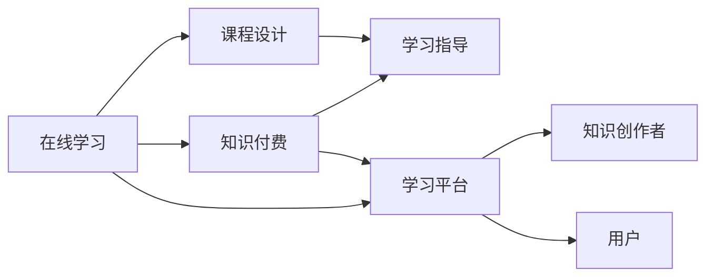

                 

# 如何利用知识付费实现在线学习与在线学习指导？

在信息技术快速发展的今天，在线学习已成为重要的教育方式之一。知识付费，作为在线学习的有效补充，以其高质量、高效率、高价值的特点，正在吸引越来越多的用户和企业的关注。本文将深入探讨如何利用知识付费实现在线学习与在线学习指导，旨在为教育工作者和知识创作者提供实用的指导，促进教育信息化的深入发展。

## 1. 背景介绍

### 1.1 在线学习的兴起

在线学习，即通过网络技术，将传统课堂教学转化为在线形式，打破了时间和空间的限制，实现了教育资源的共享。随着互联网技术的发展，在线学习逐渐成为主流教育形式之一，尤其是在新冠疫情影响下，全球范围内的在线学习需求急剧增加。

### 1.2 知识付费的崛起

知识付费是指用户为获取特定知识而支付费用的模式，主要形式包括在线课程、电子书、知识问答等。知识付费平台的兴起，使得高质量的知识内容能够更快速、更精准地传递给用户，提升了学习的效率和效果。

## 2. 核心概念与联系

### 2.1 核心概念概述

1. **在线学习**：通过网络技术进行的远程学习活动，包括观看视频、参与讨论、完成作业等。
2. **知识付费**：用户为获取特定知识而支付费用的模式，常以在线课程、电子书等形式出现。
3. **学习指导**：教育工作者或知识创作者为学习者提供的学习建议、指导和支持。
4. **知识付费平台**：提供知识内容订阅、购买和分享的平台，如Coursera、Udemy、知乎live等。
5. **课程设计**：结合在线学习的特点，设计出能够适应网络学习环境的教育课程。

### 2.2 核心概念原理和架构的 Mermaid 流程图



这个流程图展示了在线学习、知识付费、课程设计、学习指导、知识创作者和用户之间的联系。在线学习通过知识付费平台，为用户提供高质量的课程和学习指导，同时吸引知识创作者提供内容，形成了一个完整的教育生态系统。

## 3. 核心算法原理 & 具体操作步骤

### 3.1 算法原理概述

基于知识付费的在线学习与指导，其核心在于将高质量的知识内容与有效的学习指导相结合，通过在线平台进行高效传递。核心算法原理主要包括以下几个方面：

1. **个性化推荐算法**：根据用户的学习行为和偏好，推荐适合的学习内容和课程。
2. **内容优化算法**：通过分析用户反馈和评价，优化课程内容和结构，提高学习效果。
3. **交互式学习算法**：设计互动环节，如提问、讨论、模拟实验等，增强学习的参与性和趣味性。
4. **学习效果评估算法**：通过测试和评估，反馈学习者的学习成果，提供个性化的改进建议。

### 3.2 算法步骤详解

1. **需求分析**：对目标学习群体的需求进行深入分析，了解其学习目标、知识背景和学习风格。
2. **课程设计**：根据需求分析结果，设计课程内容和结构，包括知识点、学习路径、互动环节等。
3. **内容制作**：制作课程视频、文档、练习题等学习材料，确保内容的准确性和时效性。
4. **平台搭建**：选择合适的知识付费平台，进行课程上传和发布。
5. **互动支持**：设计互动环节，如在线问答、讨论区、作业提交等，提供学习指导。
6. **效果评估**：通过测试和评估，反馈学习者的学习成果，提供改进建议。

### 3.3 算法优缺点

**优点**：

- **高效性**：在线学习不受时间和空间限制，用户可以随时随地进行学习。
- **灵活性**：用户可以根据自己的时间安排和学习节奏，自主选择学习内容和节奏。
- **互动性**：通过互动环节，增强学习的参与性和趣味性。
- **个性化**：根据用户的学习行为和偏好，推荐个性化学习内容。

**缺点**：

- **自律性要求高**：在线学习需要用户具备较高的自律性，缺乏课堂学习氛围和即时反馈。
- **内容质量参差不齐**：课程内容的质量和深度依赖于知识创作者，可能存在内容质量参差不齐的情况。
- **学习效果监测难**：缺乏面对面的互动，学习效果的监测和评估难度较大。

### 3.4 算法应用领域

知识付费在在线学习中的应用领域非常广泛，主要包括：

- **职业培训**：为在职人员提供技能提升的课程，如编程、项目管理、市场营销等。
- **语言学习**：提供多种语言的学习课程，包括语音、词汇、语法、文化等方面。
- **学术研究**：为科研人员提供最新的学术研究成果和研究方法，促进学术交流。
- **兴趣培养**：提供各类兴趣爱好的学习课程，如音乐、绘画、摄影等。

## 4. 数学模型和公式 & 详细讲解 & 举例说明

### 4.1 数学模型构建

基于知识付费的在线学习与指导，可以构建如下数学模型：

设用户数为 $N$，课程数为 $M$，学习效果为 $E$，推荐算法为 $A$，学习指导为 $G$，则模型可以表示为：

$$
E = f(A(N, M), G(N))
$$

其中，$f$ 表示推荐算法和指导的函数映射关系。

### 4.2 公式推导过程

对于推荐算法 $A$，可以使用协同过滤算法、内容推荐算法、基于深度学习的推荐算法等。这里以基于协同过滤的推荐算法为例，其基本思想是根据用户的历史行为，找到与其兴趣相似的课程。具体推导过程如下：

设用户 $i$ 对课程 $j$ 的评分向量为 $x_i$，课程 $j$ 的属性向量为 $y_j$，则协同过滤算法的推荐公式为：

$$
r_{ij} = \frac{x_i^T y_j}{||x_i|| ||y_j||}
$$

其中 $||x_i||$ 和 $||y_j||$ 分别为用户向量 $x_i$ 和课程向量 $y_j$ 的范数。

### 4.3 案例分析与讲解

以Coursera平台的在线学习课程为例，其推荐算法结合了协同过滤和基于内容的推荐，确保推荐的课程能够满足用户的学习需求。具体实现流程如下：

1. **数据收集**：收集用户的学习行为数据，包括课程观看时长、完成作业情况、课程评价等。
2. **特征提取**：将课程的标题、描述、视频时长等特征转换为向量表示，用于计算相似度。
3. **协同过滤**：根据用户的历史行为数据，找到与其兴趣相似的课程。
4. **内容推荐**：结合课程的属性向量，进行内容推荐。
5. **效果评估**：根据用户的学习效果，反馈推荐算法的效果，进行持续优化。

## 5. 项目实践：代码实例和详细解释说明

### 5.1 开发环境搭建

在开发在线学习平台时，需要选择合适的编程语言和开发工具，如Python、JavaScript、React等。具体步骤如下：

1. **安装Python**：从官网下载并安装Python，建议使用最新版本的Python 3.x。
2. **安装开发工具**：安装PyCharm、VS Code等开发工具，以及相应的插件和扩展。
3. **配置环境**：安装必要的库和模块，如Django、Flask、TensorFlow等，并进行环境配置。

### 5.2 源代码详细实现

以Django框架为例，实现一个简单的在线学习平台。代码实现主要包括以下几个模块：

- **用户管理**：使用Django自带的User模型，管理用户注册、登录、信息修改等功能。
- **课程管理**：设计课程列表、课程详情、课程注册等功能，展示课程信息和视频资源。
- **学习管理**：提供课程观看、作业提交、测试反馈等功能，记录学习者的学习进度和效果。
- **互动支持**：设计在线问答、讨论区、模拟实验等功能，增强学习的互动性。

### 5.3 代码解读与分析

以下是一个简单的Django代码示例，展示如何实现用户注册和登录功能：

```python
from django.contrib.auth.models import User
from django.contrib.auth import authenticate, login, logout

def register(request):
    if request.method == 'POST':
        username = request.POST['username']
        password = request.POST['password']
        user = User.objects.create_user(username, password)
        user.save()
        login(request, user)
        return redirect('index')
    else:
        return render(request, 'register.html')

def login(request):
    if request.method == 'POST':
        username = request.POST['username']
        password = request.POST['password']
        user = authenticate(request, username=username, password=password)
        if user is not None:
            login(request, user)
            return redirect('index')
        else:
            return render(request, 'login.html', {'error': 'Invalid username or password'})
    else:
        return render(request, 'login.html')
```

### 5.4 运行结果展示

运行上述代码后，用户可以完成注册和登录操作，进入在线学习平台主页。用户可以看到课程列表和课程详情，参与在线问答和讨论等互动环节。

## 6. 实际应用场景

### 6.1 在线教育

在线教育领域是知识付费和在线学习的重要应用场景之一。通过知识付费平台，用户可以轻松获取高质量的课程，根据自身需求选择学习内容，完成课程学习并获得证书。

### 6.2 企业培训

企业可以通过知识付费平台，为员工提供定制化的培训课程，提高员工技能水平，增强企业竞争力。在线学习平台可以根据员工的培训需求，推荐适合的课程和学习路径，提高培训效果。

### 6.3 学术研究

学术研究领域是知识付费和在线学习的重要应用场景之一。研究人员可以通过在线学习平台，获取最新的学术研究成果和研究方法，促进学术交流和合作。

## 7. 工具和资源推荐

### 7.1 学习资源推荐

- **Coursera**：提供来自全球顶尖大学和机构的在线课程，涵盖多个学科领域。
- **Udemy**：提供各类实用技能培训课程，包括编程、设计、营销等。
- **edX**：提供高质量的在线课程和专业证书，涵盖多个学科领域。
- **Khan Academy**：提供免费的教育资源，包括数学、科学、历史等多个领域。

### 7.2 开发工具推荐

- **PyCharm**：功能强大的Python开发工具，提供代码编辑、调试、测试等综合功能。
- **VS Code**：轻量级的代码编辑器，支持多种编程语言和插件。
- **React**：流行的前端框架，用于开发高质量的Web应用。
- **TensorFlow**：流行的深度学习框架，支持各种深度学习模型的实现。

### 7.3 相关论文推荐

- **Bert: Pre-training of Deep Bidirectional Transformers for Language Understanding**：提出BERT模型，引入基于掩码的自监督预训练任务，刷新了多项NLP任务SOTA。
- **Attention is All You Need**：提出Transformer结构，开启了NLP领域的预训练大模型时代。
- **Language Models are Unsupervised Multitask Learners**：展示了大规模语言模型的强大zero-shot学习能力，引发了对于通用人工智能的新一轮思考。

## 8. 总结：未来发展趋势与挑战

### 8.1 总结

本文详细探讨了如何利用知识付费实现在线学习与在线学习指导，从算法原理到项目实践，全面介绍了在线学习与指导的实现方法和应用场景。通过知识付费平台，用户可以随时随地获取高质量的学习资源，增强学习的灵活性和效率。未来，随着技术的不断进步，在线学习将更加普及，成为教育的重要形式。

### 8.2 未来发展趋势

1. **AI辅助学习**：结合人工智能技术，实现智能推荐和个性化学习，提高学习效果。
2. **虚拟现实**：结合虚拟现实技术，创建沉浸式的学习环境，增强学习的趣味性和互动性。
3. **区块链技术**：结合区块链技术，保障学习数据的安全性和透明性，构建可信的学习生态。
4. **多元化学习资源**：结合多样化的学习资源，如视频、音频、文本等，提供更丰富的学习体验。
5. **全球化教育**：结合全球教育资源，提供多语言、多文化的学习课程，促进全球教育公平。

### 8.3 面临的挑战

1. **内容质量保障**：如何确保知识付费平台上的课程内容高质量、高时效性，需要持续的内容更新和优化。
2. **用户体验提升**：如何提升用户体验，增强学习的参与性和趣味性，是未来需要持续改进的方向。
3. **技术融合**：如何将AI、VR、区块链等前沿技术与在线学习相结合，提升学习效果，还需更多的技术探索和创新。
4. **监管和伦理**：在线学习平台需要建立完善的监管和伦理机制，保障用户数据和隐私安全。

### 8.4 研究展望

未来，在线学习与知识付费将迎来更多的创新和发展，具体方向包括：

1. **智能推荐系统**：结合AI技术，实现更精准、更个性化的推荐，提升学习效果。
2. **虚拟现实应用**：结合VR技术，创建沉浸式的学习环境，增强学习的趣味性和互动性。
3. **区块链技术应用**：结合区块链技术，保障学习数据的安全性和透明性，构建可信的学习生态。
4. **全球化教育**：结合全球教育资源，提供多语言、多文化的学习课程，促进全球教育公平。

总之，在线学习和知识付费的未来发展充满无限可能，需要我们不断探索和创新，才能实现教育的现代化和普及化。

## 9. 附录：常见问题与解答

**Q1：如何选择合适的在线学习平台？**

A: 选择合适的在线学习平台，需要考虑以下因素：

1. **平台知名度和信誉度**：选择知名度高、信誉好的平台，保障学习内容的质量和平台的安全性。
2. **课程质量和种类**：选择提供多样化课程和高质量内容的平台，满足自己的学习需求。
3. **学习体验和界面**：选择界面友好、操作便捷的平台，提升学习体验。
4. **技术支持和服务**：选择提供良好技术支持和服务的平台，保障学习过程中的顺畅和高效。

**Q2：如何提高在线学习的互动性？**

A: 提高在线学习的互动性，可以从以下几个方面入手：

1. **设计互动环节**：设计互动环节，如在线问答、讨论区、模拟实验等，增强学习的参与性和趣味性。
2. **引入社交元素**：引入社交元素，如学习小组、论坛等，促进学习者之间的交流和合作。
3. **提供实时反馈**：提供实时反馈，如作业批改、测试评分等，增强学习者的学习效果。
4. **利用AI技术**：利用AI技术，实现智能推荐和个性化学习，提高学习效果。

**Q3：如何保障在线学习的安全性？**

A: 保障在线学习的安全性，可以从以下几个方面入手：

1. **数据加密**：采用数据加密技术，保障用户数据和隐私安全。
2. **身份认证**：建立完善的身份认证机制，防止非法用户进入系统。
3. **访问控制**：建立严格的访问控制机制，限制敏感数据的访问权限。
4. **安全审计**：建立安全审计机制，定期检查和修复系统漏洞。

**Q4：如何设计高效的在线学习课程？**

A: 设计高效的在线学习课程，可以从以下几个方面入手：

1. **明确学习目标**：明确课程的学习目标和预期效果，制定清晰的学习路径。
2. **设计互动环节**：设计互动环节，如在线问答、讨论区、模拟实验等，增强学习的参与性和趣味性。
3. **合理分配内容**：合理分配课程内容，根据学习者的认知水平和学习进度，逐步深入。
4. **提供实时反馈**：提供实时反馈，如作业批改、测试评分等，增强学习者的学习效果。
5. **引入多样化的教学资源**：引入多样化的教学资源，如视频、音频、文本等，提供更丰富的学习体验。

总之，在线学习和知识付费正在快速发展的今天，为教育工作者和知识创作者提供了新的机遇和挑战。通过合理利用知识付费，结合在线学习的特点，设计高效的学习课程和互动环节，能够大幅提升学习效果，实现教育的现代化和普及化。相信随着技术的不断进步，在线学习将变得更加普及和高效，为全球教育事业的发展注入新的动力。

---

作者：禅与计算机程序设计艺术 / Zen and the Art of Computer Programming

