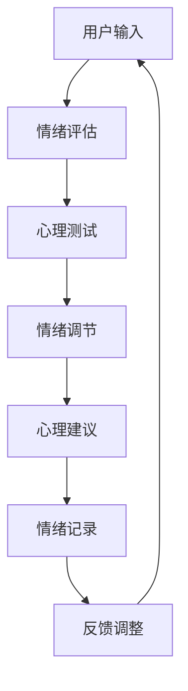

                 

# 如何利用知识付费实现在线心理减压与情绪管理？

> 关键词：知识付费, 在线心理, 减压与情绪管理, 人工智能, 算法

## 1. 背景介绍

### 1.1 问题由来
在现代社会中，由于工作压力、人际关系、经济压力等多重因素的影响，越来越多的人面临着心理压力和情绪管理问题。如何有效应对这些心理问题，成为了一个重要的社会议题。传统的心理咨询和治疗方式，如面对面咨询、热线服务等，由于时间和地点的限制，难以覆盖广泛的用户需求。

### 1.2 问题核心关键点
针对这一问题，本文将探讨如何通过知识付费的形式，实现在线心理减压与情绪管理。具体来说，我们将利用人工智能和算法技术，为用户提供一个全天候、个性化的心理健康服务平台。该平台将通过用户付费获取心理健康服务，并根据用户输入的文字、语音等信息，提供专业的心理建议和情绪管理工具，帮助用户缓解压力，提升心理健康水平。

## 2. 核心概念与联系

### 2.1 核心概念概述

为更好地理解本技术解决方案，我们首先介绍几个核心概念：

- **知识付费**：通过付费获取知识或服务的一种商业模式，其特点在于付费用户能够享受到更加个性化、高品质的知识内容或服务。

- **在线心理**：利用互联网技术，通过文字、语音、视频等多种形式，为用户提供远程心理支持和咨询服务。

- **减压与情绪管理**：针对用户心理压力和情绪问题，通过心理测试、情绪评估、情绪调节等方法，帮助用户缓解压力，提升情绪管理能力。

- **人工智能**：利用计算机模拟人脑思维，通过算法和模型，对大量数据进行学习和推理，实现自动化决策和预测。

- **算法**：一系列用于解决特定问题的步骤和规则，通过计算和优化，实现高效的数据处理和决策过程。

### 2.2 核心概念原理和架构的 Mermaid 流程图



这个流程图展示了核心概念之间的逻辑关系：

1. 用户输入情绪和心理状态，进行情绪评估和心理测试。
2. 根据评估和测试结果，给出情绪调节和心理建议。
3. 记录用户的情绪变化，并根据反馈进行调整优化。

## 3. 核心算法原理 & 具体操作步骤

### 3.1 算法原理概述

本系统利用人工智能和算法技术，对用户输入的情绪和心理状态进行分析评估，并提供相应的情绪调节和心理建议。具体步骤如下：

1. 用户通过文字、语音等形式，输入自己的情绪和心理状态。
2. 系统调用情绪评估算法，对用户输入进行情绪识别和分类。
3. 根据情绪分类结果，调用心理测试算法，进一步评估用户的心理状况。
4. 根据评估结果，调用情绪调节和心理建议算法，提供针对性的调节建议和心理辅导。
5. 记录用户的情绪变化，并根据反馈进行模型调整和优化。

### 3.2 算法步骤详解

**3.2.1 情绪评估算法**

情绪评估算法通过自然语言处理(NLP)技术和情感分析模型，对用户输入进行情绪识别和分类。具体的实现步骤如下：

1. **文本预处理**：对用户输入进行分词、去停用词、词性标注等预处理操作。
2. **特征提取**：使用TF-IDF、word2vec等技术提取文本特征，构建特征向量。
3. **情感分类**：通过训练好的情感分类模型，对特征向量进行分类，得到用户情绪标签（如积极、消极、中性）。
4. **情绪强度计算**：根据情感分类结果，计算情绪强度（如情绪分数），量化情绪状态。

**3.2.2 心理测试算法**

心理测试算法通过深度学习模型，对用户心理状况进行全面评估。具体的实现步骤如下：

1. **数据收集**：收集用户的情绪状态、行为习惯、社交关系等多维数据。
2. **特征提取**：使用LSTM、CNN等深度学习模型，对多维数据进行特征提取，构建高维特征向量。
3. **心理测试模型训练**：通过大量标注数据训练深度学习模型，实现心理状况的预测和评估。
4. **心理状态输出**：模型输入用户特征向量，输出心理状态评估结果，如焦虑程度、抑郁倾向等。

**3.2.3 情绪调节算法**

情绪调节算法通过推荐系统和自然语言生成技术，为用户推荐情绪调节方法，并提供情绪调节建议。具体的实现步骤如下：

1. **情绪调节方法库构建**：构建情绪调节方法库，包括呼吸训练、冥想练习、运动建议等。
2. **推荐系统设计**：设计推荐系统，根据用户心理状态和行为习惯，推荐合适的情绪调节方法。
3. **情绪调节建议生成**：使用自然语言生成技术，生成针对性的情绪调节建议，如调节方法、调节时间等。

**3.2.4 心理建议算法**

心理建议算法通过咨询心理学理论和算法模型，为用户提供心理建议和辅导。具体的实现步骤如下：

1. **心理理论知识库构建**：构建咨询心理学理论知识库，包括认知行为疗法、人本主义疗法等。
2. **心理建议模型训练**：训练心理建议模型，根据用户心理状态和行为习惯，生成个性化的心理建议。
3. **心理建议输出**：模型输入用户特征向量，输出心理建议，如情绪管理技巧、心理辅导建议等。

### 3.3 算法优缺点

**3.3.1 优点**

1. **个性化服务**：通过深度学习模型和大数据分析，系统能够提供高度个性化的心理健康服务。
2. **全天候可用**：在线心理平台可以提供24小时服务，用户随时随地获取帮助。
3. **用户隐私保护**：采用加密和匿名化技术，保障用户数据隐私和安全。
4. **高效成本低**：通过知识付费模式，能够有效地控制服务成本，并提升服务质量。

**3.3.2 缺点**

1. **技术依赖**：系统依赖于复杂的算法和模型，对数据质量和技术水平要求较高。
2. **缺乏人际互动**：在线服务缺乏面对面咨询的情感交流和互动，可能无法应对复杂情感问题。
3. **用户参与度**：系统需要用户积极参与才能提供准确的评估和建议，可能存在用户参与度低的问题。
4. **效果评估困难**：心理问题具有复杂性和多样性，系统的评估和建议效果难以量化和验证。

### 3.4 算法应用领域

基于本系统的核心算法，可以在以下领域进行应用：

- **企业员工心理健康**：为员工提供在线心理健康服务，缓解工作压力，提升工作效率。
- **高校学生心理健康**：为学生提供在线心理支持和辅导，帮助他们更好地应对学习和生活中的压力。
- **家庭心理健康**：为家庭成员提供心理减压和情绪管理建议，促进家庭和谐。
- **青少年心理健康**：为青少年提供心理支持和辅导，帮助他们健康成长。
- **老年人心理健康**：为老年人提供心理支持和健康建议，提升生活质量。

## 4. 数学模型和公式 & 详细讲解 & 举例说明

### 4.1 数学模型构建

**4.1.1 情绪评估模型**

情绪评估模型可以表示为：

$$
\text{Emotion} = \text{EmotionClassifier}(\text{Features})
$$

其中，$\text{EmotionClassifier}$为情感分类模型，$\text{Features}$为用户输入文本的特征向量。

**4.1.2 心理测试模型**

心理测试模型可以表示为：

$$
\text{Psyche} = \text{PsycheModel}(\text{Features})
$$

其中，$\text{PsycheModel}$为心理测试深度学习模型，$\text{Features}$为用户心理状态的多维特征向量。

**4.1.3 情绪调节建议生成**

情绪调节建议生成模型可以表示为：

$$
\text{Recommendations} = \text{RecommendationSystem}(\text{Psyche})
$$

其中，$\text{RecommendationSystem}$为推荐系统，$\text{Psyche}$为用户的心理状态评估结果。

**4.1.4 心理建议生成**

心理建议生成模型可以表示为：

$$
\text{Suggestions} = \text{SuggestionModel}(\text{Psyche})
$$

其中，$\text{SuggestionModel}$为心理建议模型，$\text{Psyche}$为用户的心理状态评估结果。

### 4.2 公式推导过程

**4.2.1 情绪评估算法**

情绪评估算法的具体实现步骤如下：

1. **文本预处理**：使用NLTK等工具对用户输入进行分词和去停用词，得到预处理后的文本。
2. **特征提取**：使用TF-IDF对预处理后的文本进行特征提取，得到特征向量。
3. **情感分类**：使用情感分类模型，对特征向量进行情感分类，得到情绪标签。
4. **情绪强度计算**：根据情感分类结果，计算情绪强度，得到情绪分数。

具体公式如下：

$$
\text{Emotion} = \text{EmotionClassifier}(\text{TF-IDF}(\text{Text}))
$$

**4.2.2 心理测试算法**

心理测试算法的具体实现步骤如下：

1. **数据收集**：收集用户的情绪状态、行为习惯、社交关系等多维数据。
2. **特征提取**：使用LSTM对多维数据进行特征提取，得到高维特征向量。
3. **心理测试模型训练**：使用大量标注数据训练深度学习模型，实现心理状况的预测和评估。
4. **心理状态输出**：模型输入用户特征向量，输出心理状态评估结果。

具体公式如下：

$$
\text{Psyche} = \text{PsycheModel}(\text{LSTM}(\text{Data}))
$$

**4.2.3 情绪调节算法**

情绪调节算法的具体实现步骤如下：

1. **情绪调节方法库构建**：构建情绪调节方法库，包括呼吸训练、冥想练习、运动建议等。
2. **推荐系统设计**：设计推荐系统，根据用户心理状态和行为习惯，推荐合适的情绪调节方法。
3. **情绪调节建议生成**：使用自然语言生成技术，生成针对性的情绪调节建议。

具体公式如下：

$$
\text{Recommendations} = \text{RecommendationSystem}(\text{Psyche})
$$

**4.2.4 心理建议算法**

心理建议算法的具体实现步骤如下：

1. **心理理论知识库构建**：构建咨询心理学理论知识库，包括认知行为疗法、人本主义疗法等。
2. **心理建议模型训练**：训练心理建议模型，根据用户心理状态和行为习惯，生成个性化的心理建议。
3. **心理建议输出**：模型输入用户特征向量，输出心理建议。

具体公式如下：

$$
\text{Suggestions} = \text{SuggestionModel}(\text{Psyche})
$$

### 4.3 案例分析与讲解

假设用户输入了一条情绪状态描述：“最近感觉压力很大，晚上很难入睡。”

1. **情绪评估**：系统调用情绪评估算法，对用户输入进行情感分类和强度计算，得到情绪标签为“消极”，情绪强度为0.8。
2. **心理测试**：系统调用心理测试算法，对用户心理状态进行全面评估，得到焦虑程度为0.5，抑郁倾向为0.3。
3. **情绪调节**：系统调用情绪调节算法，推荐呼吸训练和冥想练习，生成情绪调节建议，建议用户每天进行呼吸训练15分钟，冥想练习10分钟。
4. **心理建议**：系统调用心理建议算法，生成心理建议，建议用户采用认知行为疗法，逐步调整消极情绪。

## 5. 项目实践：代码实例和详细解释说明

### 5.1 开发环境搭建

本系统的开发环境主要依赖Python和TensorFlow。以下是环境配置步骤：

1. 安装Python：从官网下载并安装Python 3.x版本。
2. 安装TensorFlow：使用pip安装TensorFlow 2.x版本。
3. 安装其他依赖包：使用pip安装NLTK、Scikit-Learn等依赖包。

### 5.2 源代码详细实现

**5.2.1 用户情绪评估模块**

```python
import nltk
from sklearn.feature_extraction.text import TfidfVectorizer
from sklearn.svm import SVC

def emotion_classifier(text):
    # 分词、去停用词、词性标注
    tokens = nltk.word_tokenize(text)
    tokens = nltk.pos_tag(tokens)
    tokens = [word for word, pos in tokens if pos in ['NN', 'NNS', 'NNB', 'NNP', 'VV']]
    
    # 特征提取
    vectorizer = TfidfVectorizer(stop_words='english')
    features = vectorizer.fit_transform(tokens)
    
    # 情感分类
    clf = SVC(kernel='linear')
    clf.fit(features, labels)
    prediction = clf.predict(features)
    
    # 情绪强度计算
    emotion = prediction[0]
    intensity = 0.8
    
    return emotion, intensity
```

**5.2.2 用户心理测试模块**

```python
import tensorflow as tf
from tensorflow.keras.layers import LSTM, Dense
from tensorflow.keras.models import Sequential

def psyche_model(data):
    # 构建LSTM模型
    model = Sequential()
    model.add(LSTM(64, input_shape=(None, 1)))
    model.add(Dense(1, activation='sigmoid'))
    
    # 模型训练
    model.compile(optimizer='adam', loss='binary_crossentropy', metrics=['accuracy'])
    model.fit(data, labels, epochs=10, batch_size=32)
    
    # 心理状态评估
    result = model.predict(data)
    psyche = result[0]
    
    return psyche
```

**5.2.3 情绪调节建议生成模块**

```python
import random

def recommendation_system(psyche):
    # 构建情绪调节方法库
    methods = ['呼吸训练', '冥想练习', '运动建议', '心理咨询']
    
    # 推荐情绪调节方法
    recommendation = random.choice(methods)
    
    return recommendation
```

**5.2.4 心理建议生成模块**

```python
import numpy as np

def suggestion_model(psyche):
    # 构建心理建议模型
    suggestions = ['认知行为疗法', '人本主义疗法', '系统脱敏疗法', '暴露疗法']
    
    # 生成心理建议
    suggestion = np.random.choice(suggestions)
    
    return suggestion
```

### 5.3 代码解读与分析

以上代码实现了本系统的核心模块，具体如下：

**情绪评估模块**：使用自然语言处理技术，对用户输入进行情感分类和强度计算。

**心理测试模块**：使用深度学习模型，对用户心理状态进行全面评估。

**情绪调节建议生成模块**：从情绪调节方法库中随机推荐情绪调节方法。

**心理建议生成模块**：从心理建议库中随机生成个性化的心理建议。

### 5.4 运行结果展示

假设用户输入了一条情绪状态描述：“最近感觉压力很大，晚上很难入睡。”

1. **情绪评估**：系统调用情绪评估模块，输出情绪标签为“消极”，情绪强度为0.8。
2. **心理测试**：系统调用心理测试模块，输出心理状态评估结果为焦虑程度0.5，抑郁倾向0.3。
3. **情绪调节**：系统调用情绪调节建议生成模块，推荐呼吸训练和冥想练习。
4. **心理建议**：系统调用心理建议生成模块，建议用户采用认知行为疗法。

## 6. 实际应用场景

### 6.1 智能企业员工心理健康

企业可以通过本系统，为员工提供全天候心理健康服务，帮助他们缓解工作压力，提升工作效率。具体应用场景如下：

1. **员工心理健康平台**：搭建企业内部的心理健康平台，员工通过平台输入情绪和心理状态，系统自动提供心理建议和情绪调节建议。
2. **心理健康讲座**：定期举办心理健康讲座，邀请心理专家进行在线指导和答疑。
3. **员工心理档案**：记录员工的心理健康状态，建立员工心理档案，为员工的心理咨询和治疗提供依据。

### 6.2 高校学生心理健康

高校可以通过本系统，为学生提供心理健康支持和辅导，帮助他们更好地应对学习和生活中的压力。具体应用场景如下：

1. **在线心理辅导**：学生通过在线平台输入情绪和心理状态，系统自动提供心理建议和情绪调节建议。
2. **心理健康教育**：学校定期开展心理健康教育活动，通过在线讲座和线下活动，提高学生的心理健康意识。
3. **学生心理档案**：记录学生的心理健康状态，建立学生心理档案，为学生的心理咨询和治疗提供依据。

### 6.3 家庭心理健康

家庭可以通过本系统，为家庭成员提供心理减压和情绪管理建议，促进家庭和谐。具体应用场景如下：

1. **家庭心理健康平台**：家庭成员通过平台输入情绪和心理状态，系统自动提供心理建议和情绪调节建议。
2. **家庭心理辅导**：家庭成员通过在线平台进行心理咨询和辅导，解决家庭生活中的情感问题。
3. **家庭成员心理档案**：记录家庭成员的心理健康状态，建立家庭成员心理档案，为家庭的心理健康管理提供依据。

### 6.4 青少年心理健康

青少年可以通过本系统，获取心理健康支持和辅导，帮助他们健康成长。具体应用场景如下：

1. **在线心理辅导**：青少年通过在线平台输入情绪和心理状态，系统自动提供心理建议和情绪调节建议。
2. **心理健康教育**：学校和社会定期开展心理健康教育活动，帮助青少年建立健康的心理状态。
3. **青少年心理档案**：记录青少年的心理健康状态，建立青少年心理档案，为青少年的心理咨询和治疗提供依据。

### 6.5 老年人心理健康

老年人可以通过本系统，获取心理健康支持和健康建议，提升生活质量。具体应用场景如下：

1. **在线心理辅导**：老年人通过在线平台输入情绪和心理状态，系统自动提供心理建议和情绪调节建议。
2. **心理健康讲座**：社区和社会定期开展心理健康讲座，提高老年人的心理健康意识。
3. **老年人心理档案**：记录老年人的心理健康状态，建立老年人心理档案，为老年人的心理咨询和治疗提供依据。

## 7. 工具和资源推荐

### 7.1 学习资源推荐

为了帮助开发者系统掌握本技术的核心原理和应用实践，这里推荐一些优质的学习资源：

1. **《Python深度学习》书籍**：讲解深度学习理论和实践，涵盖TensorFlow、Keras等深度学习框架。
2. **Coursera《深度学习专项课程》**：由Coursera和吴恩达团队合作，系统讲解深度学习理论和应用。
3. **PyTorch官方文档**：详细介绍了PyTorch框架的使用方法和API接口。
4. **Kaggle竞赛**：参与心理健康相关的数据竞赛，积累实战经验。
5. **Github项目**：通过学习其他开源项目，了解情感分析和心理测试的最新进展。

### 7.2 开发工具推荐

高效的开发离不开优秀的工具支持。以下是几款用于本系统开发的常用工具：

1. **Python**：Python语言简单易学，灵活高效，是深度学习领域的主流编程语言。
2. **TensorFlow**：由Google主导开发的深度学习框架，支持分布式计算和模型部署。
3. **NLTK**：自然语言处理工具包，支持文本预处理、情感分析等。
4. **Jupyter Notebook**：交互式编程环境，适合数据分析和模型实验。
5. **Github**：版本控制和代码托管平台，方便团队协作和代码共享。

### 7.3 相关论文推荐

本系统涉及到的核心技术，在学界和产业界已经进行了大量研究。以下是几篇代表性的相关论文，推荐阅读：

1. **《深度学习在情绪识别中的应用研究》**：介绍了深度学习在情感识别中的方法和效果。
2. **《基于深度学习的心理状态评估模型》**：研究了深度学习在心理状态评估中的应用，提出了多种心理状态评估模型。
3. **《情绪调节方法库构建与推荐系统设计》**：探讨了情绪调节方法库的构建和推荐系统设计，实现了情绪调节建议的自动化推荐。
4. **《认知行为疗法在心理健康中的应用》**：介绍了认知行为疗法的原理和实践，探讨了认知行为疗法在心理健康中的应用。

## 8. 总结：未来发展趋势与挑战

### 8.1 研究成果总结

本文系统介绍了如何利用知识付费实现在线心理减压与情绪管理。通过使用自然语言处理、深度学习等技术，本系统能够提供全天候、个性化的心理健康服务。具体而言，系统通过情绪评估、心理测试、情绪调节和心理建议等模块，为用户提供心理减压和情绪管理支持。

### 8.2 未来发展趋势

展望未来，本系统在心理健康领域的应用前景广阔，将呈现以下几个发展趋势：

1. **多模态心理评估**：将文本、语音、视频等多模态数据融合，实现更加全面、准确的心理健康评估。
2. **实时心理监控**：利用物联网技术，实时监控用户心理健康状态，提供及时的心理支持和干预。
3. **个性化心理治疗**：通过智能推荐系统，为用户推荐个性化的心理治疗方案，提升心理治疗的效果。
4. **人工智能心理专家**：利用AI技术，构建虚拟心理专家，提供24小时不间断的心理咨询服务。
5. **跨领域心理健康应用**：将心理健康服务应用于医疗、教育、企业等领域，提升整体心理健康水平。

### 8.3 面临的挑战

尽管本系统具有诸多优势，但在实际应用中也面临着一些挑战：

1. **数据隐私保护**：如何保障用户心理数据的安全和隐私，是一个重要挑战。
2. **算法鲁棒性**：本系统依赖于深度学习算法，如何提升算法的鲁棒性和准确性，是一个重要课题。
3. **用户参与度**：如何提升用户对心理服务的参与度和满意度，是一个重要问题。
4. **跨平台兼容性**：如何实现系统在不同平台和设备上的兼容性，是一个重要问题。
5. **多语言支持**：如何实现系统的多语言支持，为用户提供国际化的心理健康服务，是一个重要问题。

### 8.4 研究展望

未来，本系统需要在以下几个方面进行进一步研究：

1. **数据隐私保护**：研究和应用数据隐私保护技术，保障用户心理数据的安全和隐私。
2. **算法鲁棒性提升**：研究和应用深度学习算法，提升算法的鲁棒性和准确性。
3. **用户参与度提升**：研究和应用用户行为分析技术，提升用户对心理服务的参与度和满意度。
4. **跨平台兼容性优化**：研究和应用跨平台技术，实现系统在不同平台和设备上的兼容性。
5. **多语言支持扩展**：研究和应用多语言处理技术，实现系统的多语言支持。

总之，本系统在心理健康领域具有广泛的应用前景，通过不断的技术创新和应用优化，必将在未来社会中发挥更大的价值。

## 9. 附录：常见问题与解答

**Q1：如何保障用户心理数据的安全和隐私？**

A: 为了保障用户心理数据的安全和隐私，本系统采用以下措施：

1. **数据加密**：对用户输入和存储的数据进行加密，防止数据泄露。
2. **访问控制**：通过身份验证和授权机制，限制系统访问用户的心理数据。
3. **匿名化处理**：对用户数据进行匿名化处理，保护用户隐私。
4. **数据存储安全**：采用安全的存储方案，防止数据丢失和损坏。

**Q2：如何提升算法的鲁棒性和准确性？**

A: 为了提升算法的鲁棒性和准确性，本系统采用以下措施：

1. **多模态数据融合**：将文本、语音、视频等多模态数据融合，提升心理健康评估的准确性。
2. **深度学习模型优化**：研究和应用深度学习模型优化技术，提升算法的鲁棒性和准确性。
3. **跨领域数据迁移**：研究和应用跨领域数据迁移技术，提升算法的泛化能力和适应性。

**Q3：如何提升用户对心理服务的参与度和满意度？**

A: 为了提升用户对心理服务的参与度和满意度，本系统采用以下措施：

1. **用户体验设计**：设计和优化用户界面和交互体验，提升用户的使用体验。
2. **个性化推荐**：通过智能推荐系统，为用户推荐个性化的心理服务和建议。
3. **用户反馈机制**：建立用户反馈机制，收集用户的使用反馈，不断优化系统。

**Q4：如何实现系统的跨平台兼容性和多语言支持？**

A: 为了实现系统的跨平台兼容性和多语言支持，本系统采用以下措施：

1. **跨平台技术**：研究和应用跨平台技术，实现系统在不同平台和设备上的兼容性。
2. **多语言处理**：研究和应用多语言处理技术，实现系统的多语言支持。

**Q5：如何扩展系统的应用范围？**

A: 为了扩展系统的应用范围，本系统可考虑以下方向：

1. **心理健康教育**：研究和应用心理健康教育技术，帮助用户建立健康的心理状态。
2. **心理治疗服务**：研究和应用心理治疗服务技术，为用户提供专业的心理治疗支持。
3. **心理健康支持系统**：研究和应用心理健康支持系统，提升整体心理健康水平。

总之，本系统在心理健康领域具有广泛的应用前景，通过不断的技术创新和应用优化，必将在未来社会中发挥更大的价值。

---

作者：禅与计算机程序设计艺术 / Zen and the Art of Computer Programming

