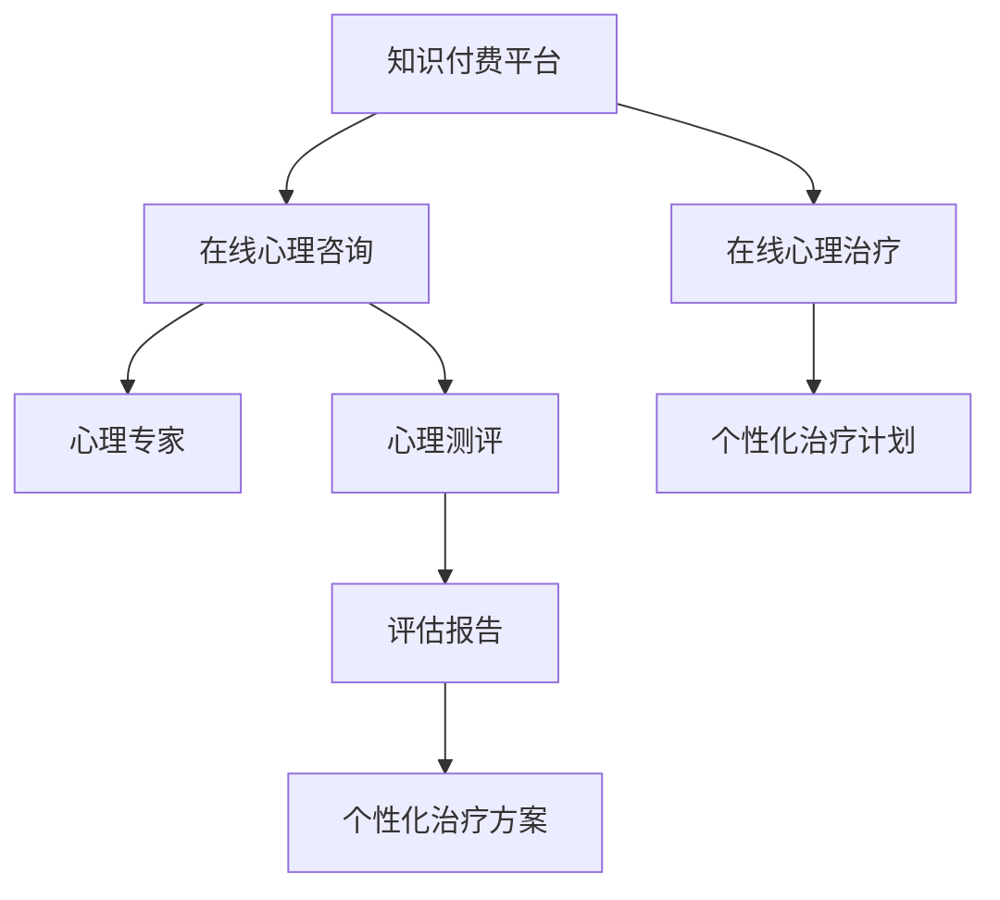

                 

# 如何利用知识付费实现在线心理咨询与治疗？

## 1. 背景介绍

随着社会的发展和人们生活压力的增大，心理健康问题逐渐成为全球关注的重要话题。据世界卫生组织(WHO)统计，全球约有四分之一的人在其一生中遭受过心理疾病。因此，在线心理咨询和治疗成为缓解这一问题的重要手段。

知识付费平台的出现，为在线心理咨询和治疗带来了新的机遇。利用知识付费模式，用户可以通过付费获取专业的心理健康服务，这不仅能够帮助他们解决心理问题，还能提高知识付费平台的营收能力。

## 2. 核心概念与联系

### 2.1 核心概念概述

- **知识付费**：基于知识市场化理论，用户通过付费获取特定知识或技能的一种商业模式。
- **在线心理咨询**：通过互联网平台，用户可以远程获得心理健康专家的帮助和指导。
- **在线心理治疗**：利用互联网技术，为用户提供系统的心理治疗服务，如认知行为疗法(CBT)、精神分析等。

### 2.2 核心概念原理和架构的 Mermaid 流程图



这个流程图展示了知识付费平台在在线心理咨询和治疗过程中的核心逻辑：

1. 用户通过知识付费平台订阅心理服务。
2. 平台提供在线心理咨询和心理测评服务。
3. 心理专家根据测评结果，制定个性化治疗方案。
4. 用户获取在线心理治疗，并在平台上进行反馈和评估。
5. 平台根据用户反馈，优化心理服务质量。

## 3. 核心算法原理 & 具体操作步骤

### 3.1 算法原理概述

在线心理咨询和治疗的核心在于将专业的心理健康知识转化为用户可接受的服务形式。具体而言，可以通过以下几个步骤实现：

1. **用户注册与验证**：用户注册后，平台进行身份验证，确认其心理健康问题的严重性。
2. **心理测评**：通过心理测评工具，收集用户的心理健康状态数据。
3. **匹配心理专家**：根据测评结果，平台匹配合适的心理健康专家。
4. **个性化治疗方案**：心理专家根据测评结果和用户需求，制定个性化治疗方案。
5. **在线治疗**：用户通过平台与心理专家进行实时或异步交流，获取心理治疗服务。
6. **治疗效果评估**：用户反馈治疗效果，平台收集数据进行评估和优化。

### 3.2 算法步骤详解

#### 3.2.1 用户注册与验证

1. **用户注册**：用户通过知识付费平台注册账号，填写基本信息。
2. **身份验证**：平台通过问卷、电话面试等方式验证用户的心理健康问题，确保其符合平台服务范围。

#### 3.2.2 心理测评

1. **选择测评工具**：平台提供多种心理测评工具，如MMPI、焦虑自评量表等。
2. **测评数据收集**：用户完成测评后，平台收集数据，形成心理健康状态报告。
3. **数据处理与分析**：平台对数据进行初步分析，生成初步诊断结果。

#### 3.2.3 匹配心理专家

1. **专家数据库**：平台建立心理健康专家数据库，涵盖不同专业背景和资历的专家。
2. **匹配算法**：平台根据用户测评结果和需求，采用推荐算法匹配合适的心理专家。

#### 3.2.4 个性化治疗方案

1. **专家制定方案**：心理专家根据测评结果和用户需求，制定个性化的治疗方案。
2. **方案呈现与反馈**：平台向用户展示治疗方案，并收集用户反馈。

#### 3.2.5 在线治疗

1. **实时交流**：用户与心理专家通过平台进行实时视频、文字交流。
2. **异步交流**：用户发送问题，心理专家异步回复。

#### 3.2.6 治疗效果评估

1. **用户反馈**：用户在治疗结束后，通过平台反馈治疗效果。
2. **数据分析与优化**：平台收集用户反馈数据，进行数据分析，优化心理服务质量。

### 3.3 算法优缺点

#### 3.3.1 优点

1. **便于获取专业服务**：用户可以随时随地获取专业心理健康服务。
2. **隐私保护**：平台采用加密技术，保护用户隐私数据。
3. **费用透明**：平台提供透明的价格体系，让用户明明白白消费。

#### 3.3.2 缺点

1. **技术门槛高**：需要搭建高并发、高可靠性的互联网平台。
2. **用户体验复杂**：用户需要学习使用在线心理咨询工具。
3. **效果评估困难**：心理治疗效果难以量化，评估难度较大。

### 3.4 算法应用领域

在线心理咨询和治疗主要应用于以下几个领域：

- **教育**：帮助学生缓解学业压力，提高学习效率。
- **企业**：帮助员工应对工作压力，提升工作效率。
- **家庭**：帮助家庭成员解决关系问题，促进家庭和谐。
- **个人**：帮助个人应对各种生活问题，提升生活质量。

## 4. 数学模型和公式 & 详细讲解 & 举例说明

### 4.1 数学模型构建

在线心理咨询和治疗的数学模型可以表示为：

$$
\begin{aligned}
M &= \{M_{注册}, M_{测评}, M_{匹配}, M_{治疗}, M_{评估}\} \\
&= \{M_{用户注册}, M_{身份验证}, M_{选择测评工具}, M_{测评数据收集}, M_{数据处理与分析}, M_{专家匹配}, M_{制定方案}, M_{方案呈现与反馈}, M_{实时交流}, M_{异步交流}, M_{用户反馈}, M_{数据分析与优化}\}
\end{aligned}
$$

其中，$M$表示整个在线心理咨询和治疗流程，$M_{i}$表示流程中的具体模块。

### 4.2 公式推导过程

以心理测评模块为例，设用户心理健康状态向量为$\mathbf{x} \in \mathbb{R}^n$，心理测评工具为$T \in \mathbb{R}^{n \times m}$，测评数据为$\mathbf{y} \in \mathbb{R}^m$，其中$m$为测评题数。

则测评数据与心理健康状态的关系可以表示为：

$$
\mathbf{y} = T\mathbf{x} + \mathbf{e}
$$

其中$\mathbf{e}$为随机误差项，通常假设为高斯噪声，即$\mathbf{e} \sim \mathcal{N}(0, \sigma^2\mathbf{I})$。

通过最小二乘法求解$\mathbf{x}$：

$$
\hat{\mathbf{x}} = (T^T T)^{-1} T^T \mathbf{y}
$$

### 4.3 案例分析与讲解

以某平台提供的在线心理治疗服务为例，用户李某（化名）因工作压力大，感到焦虑和失眠。李某通过平台注册账号，填写基本信息，并完成焦虑自评量表，平台收集数据并进行初步分析，得出李某的焦虑指数为68分。平台通过推荐算法匹配到心理专家王医生（化名），王医生根据测评结果，制定了个性化的治疗方案，包括CBT心理疗法和放松训练，并通过平台向李某呈现方案。李某按照方案进行为期四周的在线治疗，并在平台反馈治疗效果。平台收集李某的数据，进行数据分析，优化治疗方案。

## 5. 项目实践：代码实例和详细解释说明

### 5.1 开发环境搭建

1. **选择平台架构**：可以选择基于Web或移动端的开发平台，如React、Flutter等。
2. **选择数据库**：选择关系型数据库（如MySQL、PostgreSQL）或NoSQL数据库（如MongoDB）。
3. **选择服务器**：选择高性能服务器（如AWS、Google Cloud等）。

### 5.2 源代码详细实现

以下是一个简单的在线心理咨询和治疗系统的代码实现，包括用户注册、心理测评、专家匹配和治疗效果评估等功能模块。

```python
# 用户注册模块
def register_user():
    # 获取用户信息
    name = input("请输入您的姓名：")
    age = input("请输入您的年龄：")
    gender = input("请输入您的性别：")
    # 存储用户信息到数据库
    user_info = {
        "name": name,
        "age": age,
        "gender": gender
    }
    save_to_database(user_info)

# 心理测评模块
def mental_test():
    # 选择测评工具
    test_type = input("请选择测评工具（1-焦虑自评量表，2-抑郁自评量表）：")
    # 测评数据收集
    test_results = {}
    # 数据处理与分析
    # ...
    # 生成测评报告
    test_report = generate_report(test_results)
    return test_report

# 专家匹配模块
def match_expert(test_report):
    # 专家数据库
    experts = {
        "李医生": {"specialty": "心理医学", "experience": 10},
        "王医生": {"specialty": "精神分析", "experience": 15},
        "张医生": {"specialty": "CBT", "experience": 8}
    }
    # 匹配算法
    # ...
    return match_expert

# 个性化治疗方案模块
def generate_treatment_plan(expert_id, test_report):
    # 专家制定方案
    # ...
    return treatment_plan

# 在线治疗模块
def online_treatment(treatment_plan):
    # 实时交流
    # ...
    # 异步交流
    # ...

# 治疗效果评估模块
def evaluate_treatment():
    # 用户反馈
    # ...
    # 数据分析与优化
    # ...
```

### 5.3 代码解读与分析

以上代码仅展示了基本的在线心理咨询和治疗系统的模块实现。在实际开发中，还需要考虑数据安全、平台并发处理、用户隐私保护等复杂问题。

1. **数据安全**：采用加密技术，保护用户隐私数据。
2. **平台并发处理**：采用负载均衡和缓存技术，提高平台处理能力。
3. **用户隐私保护**：严格控制数据访问权限，防止数据泄露。

## 6. 实际应用场景

### 6.1 教育领域

在线心理咨询和治疗在教育领域具有广泛应用前景。学生面临的学业压力和人际关系问题，可以通过平台寻求专业的帮助和指导。教育机构可以通过平台监控学生的心理健康状态，及时干预问题学生，提升教育质量。

### 6.2 企业领域

企业员工面临的工作压力和职业倦怠，可以通过平台进行心理咨询和治疗。企业可以通过平台记录员工的心理健康状态，及时发现和解决潜在问题，提升员工的工作满意度和工作效率。

### 6.3 家庭领域

家庭成员之间的关系问题、婚姻危机等问题，可以通过平台寻求专业帮助。家庭成员可以通过平台进行沟通和咨询，解决潜在问题，促进家庭和谐。

## 7. 工具和资源推荐

### 7.1 学习资源推荐

1. **《心理治疗技术基础》**：介绍各种心理治疗技术，如CBT、精神分析等。
2. **《在线心理咨询平台开发指南》**：涵盖平台设计、开发、测试等各个环节的详细指南。
3. **《人工智能在心理健康领域的应用》**：介绍人工智能技术在心理健康领域的应用，包括在线心理咨询和治疗等。

### 7.2 开发工具推荐

1. **Python**：采用Python开发平台，简单易学，具有强大的数据处理能力。
2. **React**：采用React框架开发Web端平台，具有良好的用户体验。
3. **Flutter**：采用Flutter框架开发移动端平台，跨平台兼容性好。

### 7.3 相关论文推荐

1. **《基于大数据的心理健康服务研究》**：探讨大数据在心理健康服务中的应用，包括在线心理咨询和治疗等。
2. **《知识付费平台用户行为分析》**：研究知识付费平台的用户行为，探讨如何提高平台的用户粘性和满意度。
3. **《心理健康在线服务的技术架构研究》**：探讨在线心理健康服务的核心技术架构，包括平台设计、数据处理、专家匹配等。

## 8. 总结：未来发展趋势与挑战

### 8.1 总结

在线心理咨询和治疗作为知识付费的重要应用场景，为心理健康问题的解决提供了新的路径。通过平台化、标准化的服务模式，提高了心理健康服务的可获取性和便利性。然而，平台在发展过程中也面临着技术复杂度高、用户体验复杂等挑战。未来，平台需要通过技术创新、用户体验优化等手段，进一步提升服务质量和用户满意度。

### 8.2 未来发展趋势

1. **AI技术应用**：引入AI技术，提升心理咨询和治疗的精准度和效果。
2. **跨领域合作**：与其他行业（如医疗、教育）进行合作，拓展应用场景。
3. **个性化服务**：根据用户需求和心理状态，提供个性化的心理咨询和治疗方案。
4. **数据分析与优化**：利用大数据技术，分析用户行为，优化平台服务质量。

### 8.3 面临的挑战

1. **技术复杂度高**：平台需要综合运用多种技术，包括人工智能、大数据等，技术难度较大。
2. **用户体验复杂**：平台需要提供友好的用户界面，降低用户体验门槛。
3. **数据安全**：平台需要确保用户数据的安全性，防止数据泄露和滥用。
4. **专家匹配**：平台需要建立高效的专家匹配算法，确保匹配到合适的心理专家。

### 8.4 研究展望

未来，在线心理咨询和治疗平台将在技术、应用和体验等方面不断创新，为心理健康问题的解决提供更高效、更便捷的解决方案。

## 9. 附录：常见问题与解答

**Q1：在线心理咨询和治疗的隐私保护如何实现？**

A: 平台可以采用加密技术，对用户数据进行加密处理。此外，平台需要建立严格的数据访问权限控制机制，确保只有授权人员能够访问用户数据。

**Q2：如何提高在线心理咨询和治疗的效果？**

A: 平台可以通过引入AI技术，提高心理咨询和治疗的精准度。例如，使用自然语言处理技术进行情感分析，根据用户的情感状态进行个性化治疗方案的设计。

**Q3：如何提升在线心理咨询和治疗的用户体验？**

A: 平台需要提供友好的用户界面，降低用户体验门槛。例如，采用交互式设计，让用户能够直观地了解自己的心理健康状态和推荐的治疗方案。

**Q4：在线心理咨询和治疗的效果如何评估？**

A: 平台可以通过用户反馈数据和专家评估数据，对心理咨询和治疗的效果进行综合评估。例如，使用调查问卷收集用户满意度，使用治疗效果评估量表评估治疗效果。

**Q5：如何建立高效的专家匹配算法？**

A: 平台可以采用推荐算法，根据用户测评结果和专家资历进行匹配。例如，使用协同过滤算法，根据用户历史行为和专家评价，推荐合适的专家。

---

作者：禅与计算机程序设计艺术 / Zen and the Art of Computer Programming

