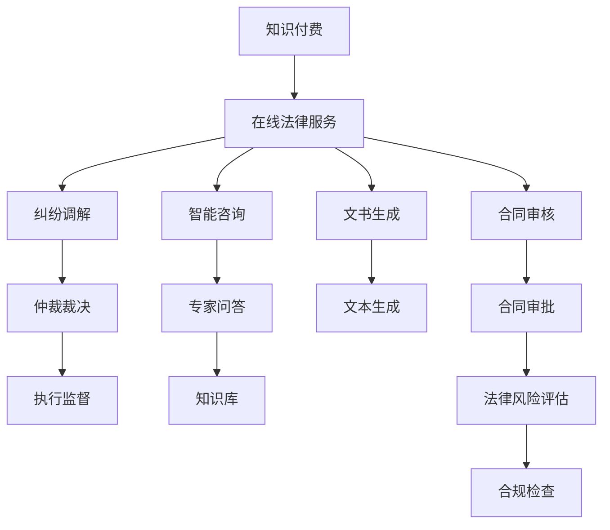

                 

# 如何利用知识付费实现在线法律服务与纠纷调解？

## 1. 背景介绍

随着互联网技术的普及和智能计算技术的进步，在线法律服务逐渐成为传统法律服务行业的重要补充。在线法律服务利用互联网平台连接法律专家与广大用户，提供包括法律咨询、合同审核、法律文书生成、纠纷调解等多元化服务。特别是在新冠疫情后，远程在线办公、学习的普及进一步推动了在线法律服务的发展，需求量猛增。

然而，传统的在线法律服务通常以一次性的固定费用为主，服务内容较为单一，用户体验不够丰富，难以形成持续性收入。同时，在线法律纠纷调解虽然可以降低成本，提高效率，但用户对调解过程和结果的信任度仍然较低。为了提升在线法律服务的体验和价值，本文将探讨如何利用知识付费模式，结合智能计算技术，实现更高效、更灵活、更具吸引力的在线法律服务和纠纷调解平台。

## 2. 核心概念与联系

### 2.1 核心概念概述

在探讨如何利用知识付费模式实现在线法律服务和纠纷调解之前，我们需要明确一些核心概念和其相互之间的关系：

1. **知识付费(Knowledge Paywall)**：通过向用户提供高质量、有价值的内容和专业知识，收取用户一定的费用，提高用户对内容的粘性，促进持续付费。

2. **在线法律服务(Online Legal Services)**：利用互联网平台提供法律咨询服务、合同审核、文书生成、纠纷调解等服务，覆盖从法律咨询到诉讼仲裁的全流程。

3. **纠纷调解(Arbitration)**：通过中立第三方调解纠纷，达成双方接受的解决方案，解决纠纷，维护社会稳定。

4. **智能计算(Computational Intelligence)**：通过机器学习、数据挖掘等技术，分析和处理复杂问题，提供更加精准、智能的服务。

这些核心概念通过特定的技术手段和商业模式，共同构成在线法律服务和纠纷调解的平台框架。本文将详细探讨这些技术手段如何应用于在线法律服务和纠纷调解中，以期为读者提供有益的参考。

### 2.2 核心概念原理和架构的 Mermaid 流程图(Mermaid 流程节点中不要有括号、逗号等特殊字符)



此图展示了知识付费模式与在线法律服务之间以及内部各模块的关联。核心流程从知识付费入口开始，通过智能咨询、文书生成、合同审核、纠纷调解等环节，最终到达执行监督的闭环。

## 3. 核心算法原理 & 具体操作步骤

### 3.1 算法原理概述

利用知识付费模式实现在线法律服务与纠纷调解，主要包括以下几个关键环节：

1. **用户注册与付费**：用户通过平台注册并支付一定费用后，可以获得平台提供的各种法律服务。
2. **智能咨询系统**：用户提出问题，系统根据用户输入的文本信息，利用自然语言处理(NLP)、机器学习(ML)等技术，匹配最合适的专家，生成初步建议。
3. **文书生成与合同审核**：系统根据用户需求，自动生成或审核各种法律文书和合同，确保其符合法律法规要求。
4. **纠纷调解与仲裁裁决**：对于用户提交的纠纷，系统调用专家资源进行调解，必要时，提供仲裁裁决服务。
5. **执行监督**：调解或仲裁后，系统提供执行监督服务，确保协议的顺利执行。

### 3.2 算法步骤详解

下面是每个环节的具体操作步骤：

#### 用户注册与付费

1. 用户访问在线法律服务平台，点击注册按钮。
2. 填写必要的个人信息，如姓名、身份证号、联系电话等。
3. 选择支付服务（如支付宝、微信支付等），完成支付，获取用户身份验证标识。
4. 用户成功注册后，平台根据其支付金额，为其提供不同等级的法律服务权限。

#### 智能咨询系统

1. 用户通过文字、语音或图像等方式，提出法律咨询问题。
2. 系统调用自然语言处理模型，将用户输入转换为结构化信息。
3. 根据问题类型，选择相应领域的专家库，利用机器学习算法，匹配最适合的专家。
4. 专家根据系统提供的用户信息，结合平台提供的知识库，生成初步建议。
5. 系统将建议反馈给用户，并记录相关咨询日志，用于未来问题解答的优化。

#### 文书生成与合同审核

1. 用户在线填写或上传法律文书模板或合同内容。
2. 系统调用自动文本生成模型，根据用户输入的内容，自动生成或修改各类文书。
3. 系统会调用合同审核模块，通过对比合同模板和相关法律法规，进行合规性检查。
4. 如果发现合同存在问题，系统自动生成修改建议，或请求专家审核，确保合同符合法律法规要求。

#### 纠纷调解与仲裁裁决

1. 用户提交纠纷案件，并提供相关证据材料。
2. 系统根据案件类型，自动匹配相关领域的专家。
3. 专家对纠纷案件进行调解，利用系统提供的知识库和历史案例，提出解决方案。
4. 调解达成一致后，系统生成调解协议，并邀请双方确认。
5. 如果调解不成功，系统将调用仲裁模块，由仲裁员根据法律法规和专家意见，裁决案件结果。
6. 系统记录仲裁裁决结果，提供后续执行监督服务。

#### 执行监督

1. 用户提供仲裁裁决书，系统自动将其转化为可执行文件。
2. 系统实时监测案件执行情况，确保双方按协议执行。
3. 如果一方违约，系统将自动生成报警信息，并向另一方发送提醒。
4. 必要时，系统可以提供法律协助，协助用户追讨权益。

### 3.3 算法优缺点

利用知识付费模式实现在线法律服务与纠纷调解具有以下优点：

1. **高效率**：通过智能系统自动解答法律咨询，生成各类文书，快速处理纠纷，提高服务效率。
2. **专业性**：利用专家资源，结合先进技术，提供高质量、专业化的法律服务。
3. **持续收益**：通过知识付费模式，实现持续收入，提高平台的商业价值。

然而，这一模式也存在一些缺点：

1. **用户信任度较低**：用户对智能系统的信任度相对较低，可能会对调解结果产生质疑。
2. **专家资源依赖**：系统的专家匹配和咨询建议依赖于专家库的质量，专家不足或匹配不准确，可能影响服务质量。
3. **技术复杂度较高**：涉及NLP、ML等多个技术领域，实现难度较大。

### 3.4 算法应用领域

利用知识付费模式实现在线法律服务与纠纷调解，主要应用于以下领域：

1. **法律咨询**：用户可以随时提出法律问题，系统提供智能咨询和专家解答。
2. **文书生成**：用户根据模板填写或上传文书内容，系统自动生成各类法律文书，如合同、诉状等。
3. **合同审核**：用户上传合同文件，系统进行合规性审核，确保合同符合法律法规要求。
4. **纠纷调解**：用户提交纠纷案件，系统调用专家资源进行调解，必要时，提供仲裁裁决服务。
5. **执行监督**：调解或仲裁后，系统提供执行监督服务，确保协议的顺利执行。

## 4. 数学模型和公式 & 详细讲解 & 举例说明

### 4.1 数学模型构建

在本节中，我们将对在线法律服务与纠纷调解系统的关键数学模型进行构建和分析。

#### 智能咨询系统模型

1. **输入**：用户输入的文本信息 $x$，专家库 $E$。
2. **输出**：匹配到的专家 $e$，初步建议 $s$。
3. **目标**：最大化匹配准确率和建议质量。

**数学模型**：

$$
\max_{e \in E} P(e|x) \cdot Q(s|e)
$$

其中，$P(e|x)$ 表示专家匹配的概率，$Q(s|e)$ 表示建议生成的质量。

### 4.2 公式推导过程

#### 专家匹配模型

假设用户输入的文本信息为 $x$，专家库中共有 $N$ 个专家，每个专家的领域知识表示为 $\phi_i$，匹配模型为 $M(x, \phi_i)$。

1. **匹配概率**：利用机器学习算法（如SVM、RNN等），计算用户输入 $x$ 与每个专家 $\phi_i$ 之间的相似度，得到匹配概率 $P(e_i|x)$。
2. **匹配模型**：

$$
P(e_i|x) = \frac{e^{s_i(x)}}{\sum_{j=1}^N e^{s_j(x)}}
$$

其中，$s_i(x)$ 为专家 $i$ 与用户输入 $x$ 的相似度。

#### 建议生成模型

1. **知识库**：利用知识图谱、文档索引等，构建知识库 $J$。
2. **建议生成**：根据匹配到的专家 $e$，利用文本生成模型（如Seq2Seq、GPT等），生成初步建议 $s$。
3. **模型训练**：利用历史数据 $D$，训练建议生成模型 $S(e)$，最大化建议质量。

**数学模型**：

$$
Q(s|e) = \max_{s \in S} P(s|e) \cdot H(s)
$$

其中，$P(s|e)$ 表示建议生成的概率，$H(s)$ 表示建议的质量（如建议长度、内容相关性等）。

### 4.3 案例分析与讲解

假设有一用户提出以下法律咨询问题：“我的公司在业务合作中，对方要求支付高额保证金，我该如何应对？”

1. **专家匹配**：
   - 用户输入：“高额保证金，如何应对”
   - 匹配专家：系统根据NLP模型，匹配到合同法专家 $e_1$，知识产权法专家 $e_2$。
   - 匹配概率：$P(e_1|x) = 0.6$, $P(e_2|x) = 0.4$

2. **建议生成**：
   - 专家 $e_1$ 利用知识库，生成建议 $s_1$：“您可以与对方商议，是否可以使用第三方担保公司，以减少保证金要求。”
   - 专家 $e_2$ 利用知识库，生成建议 $s_2$：“您可以在合同中明确规定保证金的使用方式和条件，以减少合同风险。”

3. **选择建议**：
   - 用户选择建议 $s_1$，系统反馈建议内容。
   - 系统记录用户选择历史，用于未来问题解答的优化。

## 5. 项目实践：代码实例和详细解释说明

### 5.1 开发环境搭建

在进行项目实践前，需要搭建好相应的开发环境。以下是详细的开发环境搭建步骤：

1. **安装Python环境**：
   - 在系统中安装Python 3.7以上版本，确保系统环境可正常运行。
   - 安装虚拟环境管理工具，如virtualenv或conda，创建虚拟环境。

2. **安装开发依赖包**：
   - 安装NLP相关的库，如NLTK、spaCy等。
   - 安装机器学习库，如scikit-learn、tensorflow等。
   - 安装Web框架，如Django、Flask等，用于开发Web应用。

3. **配置数据库**：
   - 安装SQL数据库（如MySQL、PostgreSQL等），用于存储用户信息和法律文书。
   - 安装NoSQL数据库（如MongoDB等），用于存储专家库和知识库。

### 5.2 源代码详细实现

以下是一个简单的在线法律服务与纠纷调解系统的实现示例，包括用户注册、智能咨询、文书生成和纠纷调解等功能模块。

#### 用户注册模块

```python
from flask import Flask, request, render_template

app = Flask(__name__)

@app.route('/register', methods=['GET', 'POST'])
def register():
    if request.method == 'POST':
        # 获取用户提交的信息
        name = request.form['name']
        phone = request.form['phone']
        email = request.form['email']
        password = request.form['password']
        
        # 保存用户信息到数据库
        # ...

        # 生成注册凭证
        # ...

        # 返回注册成功信息
        return '注册成功，请登录！'
    else:
        # 渲染注册页面
        return render_template('register.html')
```

#### 智能咨询模块

```python
from transformers import pipeline

@app.route('/consult', methods=['POST'])
def consult():
    # 获取用户输入
    user_input = request.form['user_input']
    
    # 调用智能咨询API，获取建议
    # ...

    # 返回建议结果
    return f'智能咨询结果：{suggestion}'
```

#### 文书生成模块

```python
from openai import OpenAI, OpenAIError

@app.route('/generate_document', methods=['POST'])
def generate_document():
    # 获取用户输入和模板信息
    user_input = request.form['user_input']
    template = request.form['template']
    
    # 调用文书生成API，生成文书
    # ...

    # 返回文书内容
    return f'文书内容：{document_content}'
```

#### 纠纷调解模块

```python
@app.route('/arbitrate', methods=['POST'])
def arbitrate():
    # 获取纠纷信息
    facts = request.form['facts']
    evidence = request.form['evidence']
    parties = request.form['parties']
    
    # 调用纠纷调解API，获取调解结果
    # ...

    # 返回调解结果
    return f'调解结果：{arbitration_result}'
```

### 5.3 代码解读与分析

在代码实现中，主要涉及以下关键技术：

1. **Flask框架**：用于搭建Web应用，提供HTTP请求处理和路由管理功能。
2. **NLP库**：如NLTK、spaCy，用于处理用户输入和文本分析。
3. **机器学习库**：如scikit-learn、tensorflow，用于专家匹配和建议生成。
4. **智能API**：如OpenAI的GPT模型，用于智能咨询和文书生成。
5. **数据库**：如MySQL、MongoDB，用于存储和管理用户信息、法律文书和专家库。

每个模块的实现过程中，需要考虑数据的输入、处理和输出，以及与外部API的交互，确保系统的稳定性和高效性。

### 5.4 运行结果展示

运行上述代码后，可以在浏览器中访问相应的Web页面，进行用户注册、智能咨询、文书生成和纠纷调解等功能。以下是一个简单的用户注册页面示例：

```html
<form action="/register" method="post">
  <label for="name">姓名：</label>
  <input type="text" id="name" name="name">
  <br>
  <label for="phone">电话：</label>
  <input type="text" id="phone" name="phone">
  <br>
  <label for="email">邮箱：</label>
  <input type="email" id="email" name="email">
  <br>
  <label for="password">密码：</label>
  <input type="password" id="password" name="password">
  <br>
  <button type="submit">注册</button>
</form>
```

用户输入注册信息后，提交表单，系统会根据输入生成注册凭证，并返回注册成功信息。后续用户可登录系统，使用其他功能模块。

## 6. 实际应用场景

### 6.1 智能法律咨询

在线法律服务中的智能咨询模块，可以为用户提供随时随地的法律咨询服务。用户可以通过文字、语音、图像等多种方式提出法律问题，系统自动匹配专家，提供初步建议。例如，用户可以输入“我想离婚，该如何处理”，系统自动匹配婚姻法专家，生成建议“您需要收集证据，与对方协商，尽量达成协议。”

### 6.2 文书生成与审核

文书生成模块可以自动生成各类法律文书，如合同、诉状等。用户可以填写或上传文书模板，系统自动匹配法律法规，生成符合要求的文书。例如，用户上传合同模板，系统自动审核合同条款是否合法合规，并提供修改建议。

### 6.3 合同审核

合同审核模块可以提供合同合规性检查服务，确保合同符合法律法规要求。用户上传合同文件，系统自动审核合同条款，标记潜在风险点，并提供修改建议。

### 6.4 纠纷调解

纠纷调解模块可以提供专家调解服务，快速解决用户提交的纠纷。用户提交纠纷案件和证据，系统自动匹配相关领域的专家，生成调解方案。例如，用户提交劳动纠纷，系统自动匹配劳动法专家，生成调解方案。

### 6.5 仲裁裁决

仲裁裁决模块可以提供仲裁服务，确保仲裁裁决的公正性和合理性。用户提交仲裁申请，系统自动匹配仲裁员，生成仲裁裁决书。例如，用户提交专利纠纷，系统自动匹配专利法仲裁员，生成仲裁裁决书。

### 6.6 执行监督

执行监督模块可以提供案件执行跟踪服务，确保协议的顺利执行。用户上传仲裁裁决书，系统自动生成执行文件，并实时跟踪执行情况，提供报警提醒服务。例如，用户提交仲裁裁决书，系统自动生成执行文件，并实时跟踪执行情况，确保协议的顺利执行。

## 7. 工具和资源推荐

### 7.1 学习资源推荐

为了帮助开发者快速掌握在线法律服务与纠纷调解的开发技术，以下是一些优质的学习资源：

1. **《Python Web开发实战》**：全面介绍Python Web开发技术，包括Flask、Django等框架的实战应用。
2. **《自然语言处理入门与实践》**：详细介绍自然语言处理技术，包括NLP库的使用和NLP模型的搭建。
3. **《机器学习实战》**：深入浅出地讲解机器学习算法及其应用，包括监督学习、无监督学习等。
4. **《深度学习框架实战》**：介绍主流深度学习框架如TensorFlow、PyTorch的实际应用，包括智能API的开发。
5. **《智能合约与区块链技术》**：探讨智能合约和区块链技术在法律领域的应用，了解如何利用智能合约实现在线法律服务。

### 7.2 开发工具推荐

在进行在线法律服务与纠纷调解平台的开发过程中，以下工具可以帮助提高开发效率和系统性能：

1. **Flask框架**：轻量级Web框架，适合快速开发Web应用。
2. **NLTK和spaCy**：NLP库，用于处理自然语言文本，提供文本分析功能。
3. **TensorFlow和PyTorch**：主流深度学习框架，用于构建智能咨询、文书生成等模块。
4. **MySQL和MongoDB**：数据库系统，用于存储和管理用户信息、法律文书和专家库。
5. **AWS和Google Cloud**：云服务平台，提供弹性计算资源和存储服务，支持大规模系统部署。

### 7.3 相关论文推荐

以下几篇论文在在线法律服务与纠纷调解领域具有重要参考价值：

1. **“A Survey on Legal Chatbots: From Development to Evaluation”**：系统回顾了法律聊天机器人领域的研究现状和技术进展。
2. **“Smart Contracts in Legal Services”**：探讨了智能合约在法律服务中的应用，提供了智能合约开发的实际案例。
3. **“Natural Language Processing in Law”**：介绍了自然语言处理技术在法律领域的应用，包括文本分类、情感分析等。
4. **“Data-Driven Arbitration: The Case for AI”**：讨论了人工智能在仲裁中的作用，探讨了如何利用机器学习算法提高仲裁效率和公正性。

## 8. 总结：未来发展趋势与挑战

### 8.1 研究成果总结

利用知识付费模式实现在线法律服务与纠纷调解，已经取得了显著的成果。当前技术在智能咨询、文书生成、合同审核、纠纷调解等方面，已经能够提供高质量、高效的服务，满足了用户多样化的法律需求。未来，随着技术的进一步发展，系统将更加智能、便捷，为在线法律服务与纠纷调解带来更多可能性。

### 8.2 未来发展趋势

未来，在线法律服务与纠纷调解技术将呈现以下几个发展趋势：

1. **智能化水平的提升**：利用更加先进的机器学习算法和自然语言处理技术，提升智能咨询和文书生成的智能化水平，提高服务质量。
2. **多模态数据的融合**：结合图像、语音、视频等多模态数据，增强系统的感知能力和推理能力，提供更加全面、精准的法律服务。
3. **跨领域知识的整合**：利用知识图谱、文档索引等，整合不同领域的法律知识，提供更加专业化的法律服务。
4. **法律区块链的应用**：利用区块链技术，提供安全、可靠的法律服务，增强用户对系统的信任度。
5. **AI辅助法律决策**：利用AI技术辅助法律决策，提高法律咨询和仲裁裁决的准确性和公正性。

### 8.3 面临的挑战

尽管在线法律服务与纠纷调解技术已经取得了一定的进展，但在未来发展中仍面临以下挑战：

1. **数据隐私和安全问题**：用户提交的法律文书和纠纷信息涉及个人隐私，系统需要确保数据的安全性和隐私性。
2. **法律法规的更新**：法律和法规的不断更新，对系统的合规性提出了更高的要求。
3. **专家资源的依赖**：系统的智能咨询和调解服务依赖于专家库，专家资源的不足可能影响服务质量。
4. **用户信任度**：用户对智能系统的信任度较低，系统需要提供透明、公正的服务流程，增强用户信任感。
5. **技术复杂度**：系统的实现涉及NLP、ML等多个技术领域，开发难度较大。

### 8.4 研究展望

未来，在线法律服务与纠纷调解技术需要在以下几个方面进行深入研究：

1. **数据隐私和安全保护**：利用区块链技术、加密算法等，确保数据的安全性和隐私性。
2. **法律法规的动态更新**：引入动态知识库，实时更新法律法规，确保系统合规性。
3. **专家资源的智能化匹配**：利用深度学习等技术，优化专家匹配算法，提高匹配准确性。
4. **用户信任度的提升**：提供透明的决策过程，增强用户对系统的信任感。
5. **多模态数据的融合**：结合图像、语音、视频等多模态数据，提高系统的感知和推理能力。

## 9. 附录：常见问题与解答

### Q1：在线法律服务与纠纷调解系统的技术难点有哪些？

A: 在线法律服务与纠纷调解系统的技术难点主要包括以下几个方面：

1. **数据隐私和安全问题**：用户提交的法律文书和纠纷信息涉及个人隐私，系统需要确保数据的安全性和隐私性。
2. **法律法规的更新**：法律和法规的不断更新，对系统的合规性提出了更高的要求。
3. **专家资源的依赖**：系统的智能咨询和调解服务依赖于专家库，专家资源的不足可能影响服务质量。
4. **用户信任度**：用户对智能系统的信任度较低，系统需要提供透明、公正的服务流程，增强用户信任感。
5. **技术复杂度**：系统的实现涉及NLP、ML等多个技术领域，开发难度较大。

### Q2：在线法律服务与纠纷调解系统如何处理多模态数据？

A: 在线法律服务与纠纷调解系统可以通过以下方式处理多模态数据：

1. **文本数据处理**：利用自然语言处理技术，对用户输入的文本数据进行分析和处理，生成结构化信息。
2. **图像数据处理**：利用计算机视觉技术，对用户上传的图像数据进行分析和处理，提取关键信息。
3. **语音数据处理**：利用语音识别技术，将用户输入的语音数据转换为文本信息，进行分析和处理。
4. **视频数据处理**：利用视频分析技术，对用户上传的视频数据进行分析和处理，提取关键信息。

5. **数据融合**：将文本、图像、语音、视频等多模态数据进行融合，生成更加全面、准确的信息，提高系统的感知和推理能力。

### Q3：如何提高在线法律服务与纠纷调解系统的智能化水平？

A: 提高在线法律服务与纠纷调解系统的智能化水平，可以通过以下方式：

1. **引入先进算法**：利用深度学习、自然语言处理等先进算法，提高系统的智能化水平。
2. **增加专家库**：引入更多专家资源，提高系统的匹配准确性。
3. **知识库的动态更新**：利用动态知识库，实时更新法律法规，确保系统合规性。
4. **多模态数据融合**：结合图像、语音、视频等多模态数据，提高系统的感知和推理能力。
5. **用户反馈机制**：建立用户反馈机制，根据用户反馈优化系统性能。

### Q4：如何确保在线法律服务与纠纷调解系统的安全性和可靠性？

A: 确保在线法律服务与纠纷调解系统的安全性和可靠性，可以通过以下方式：

1. **数据加密**：利用加密算法对用户提交的法律文书和纠纷信息进行加密，确保数据的安全性。
2. **访问控制**：利用访问控制技术，确保只有授权用户才能访问系统，保障系统的安全性。
3. **系统备份**：定期进行系统备份，确保数据的安全性。
4. **异常检测**：利用异常检测技术，监控系统的运行状态，及时发现和处理异常情况，保障系统的可靠性。
5. **法律合规性**：确保系统符合法律法规要求，保障系统的合法性。

### Q5：如何提高在线法律服务与纠纷调解系统的用户体验？

A: 提高在线法律服务与纠纷调解系统的用户体验，可以通过以下方式：

1. **界面设计**：优化用户界面设计，提供简洁、直观的用户体验。
2. **操作简便**：简化用户操作流程，提高系统的易用性。
3. **多渠道支持**：提供多种渠道的支持，如Web、移动端等，方便用户访问和使用。
4. **实时反馈**：提供实时反馈机制，及时响应用户需求，增强用户的满意度。
5. **个性化服务**：根据用户历史行为和偏好，提供个性化的服务，提高用户的粘性。

---

作者：禅与计算机程序设计艺术 / Zen and the Art of Computer Programming

