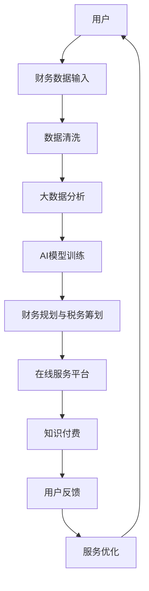

                 

# 如何利用知识付费实现在线财务管理与税务筹划？

> 关键词：知识付费, 在线财务管理, 税务筹划, AI, 数据驱动, 个人理财, 税务优化

## 1. 背景介绍

### 1.1 问题由来

随着数字化经济的发展，人们对于财务管理和税务筹划的需求日益增长。传统的财务顾问和税务规划师由于时间和成本限制，无法提供量身定制的个性化服务。与此同时，随着知识付费的兴起，在线平台成为了获取财务知识和税务咨询的理想渠道。因此，利用知识付费模式，结合人工智能和大数据分析技术，实现在线财务管理与税务筹划服务，已成为行业发展的趋势。

### 1.2 问题核心关键点

在线财务管理与税务筹划的核心关键点包括：

1. **个性化需求满足**：根据用户的具体财务状况和税务需求，提供量身定制的财务规划和税务优化建议。
2. **数据驱动决策**：利用大数据分析技术，对用户财务数据进行深度挖掘，提供精准的财务分析和税务筹划建议。
3. **实时反馈与调整**：在用户财务状况和税务政策变化时，实时更新财务规划和税务优化策略。
4. **知识付费模式**：通过知识付费，建立用户信任和付费机制，确保服务的持续性和高质量。
5. **跨平台集成**：实现跨银行、跨税务平台的数据互通，提供一站式服务体验。

## 2. 核心概念与联系

### 2.1 核心概念概述

在线财务管理与税务筹划涉及多个核心概念，包括：

- **财务规划**：根据用户的财务状况，制定合理的财务目标和预算计划。
- **税务筹划**：通过对用户税务数据的分析，优化税务策略，降低税务负担。
- **知识付费**：用户为获取财务和税务知识服务支付费用，形成市场化的付费机制。
- **AI和大数据**：利用人工智能和大数据分析技术，提高财务规划和税务筹划的准确性和效率。
- **跨平台集成**：实现不同银行、税务平台的数据集成，提供无缝的用户体验。

### 2.2 核心概念原理和架构的 Mermaid 流程图



该图展示了在线财务管理与税务筹划的核心流程，包括数据输入、清洗、分析、模型训练、规划与筹划、平台服务、付费和反馈优化。

## 3. 核心算法原理 & 具体操作步骤

### 3.1 算法原理概述

在线财务管理与税务筹划的核心算法原理主要包括以下几个方面：

1. **数据清洗与预处理**：对用户提供的财务数据进行清洗和预处理，确保数据的准确性和完整性。
2. **大数据分析**：利用大数据分析技术，对用户财务数据进行深度挖掘，提取有价值的信息。
3. **AI模型训练**：使用机器学习和深度学习模型，训练财务规划和税务筹划的AI模型，提高预测和决策的准确性。
4. **财务规划与税务筹划**：根据AI模型的预测和分析结果，提供个性化的财务规划和税务筹划建议。
5. **实时反馈与优化**：在用户财务状况和税务政策变化时，实时更新财务规划和税务优化策略。

### 3.2 算法步骤详解

#### 3.2.1 数据收集与清洗

数据收集与清洗是财务管理与税务筹划的基础，具体步骤如下：

1. **数据收集**：通过在线服务平台收集用户的财务数据，包括收入、支出、资产、负债、投资、税务等。
2. **数据清洗**：对收集的数据进行格式转换、缺失值填补、异常值处理等清洗工作，确保数据质量。

#### 3.2.2 大数据分析

大数据分析是财务管理与税务筹划的关键步骤，具体步骤如下：

1. **数据存储与管理**：使用分布式数据库技术，如Hadoop和Spark，存储和管理用户财务数据。
2. **数据挖掘**：利用大数据分析技术，挖掘用户财务数据中的规律和趋势，如消费习惯、收入变化等。
3. **预测分析**：使用机器学习算法，如时间序列分析、回归分析等，对用户未来财务状况和税务负担进行预测。

#### 3.2.3 AI模型训练

AI模型训练是财务管理与税务筹划的核心技术，具体步骤如下：

1. **模型选择**：选择适合问题的机器学习或深度学习模型，如决策树、随机森林、神经网络等。
2. **数据准备**：对清洗后的数据进行特征工程，提取有意义的特征，用于训练模型。
3. **模型训练**：使用训练集数据训练AI模型，优化模型参数。
4. **模型评估**：使用测试集数据评估模型的准确性和鲁棒性，调整模型参数。

#### 3.2.4 财务规划与税务筹划

财务规划与税务筹划是AI模型的最终应用，具体步骤如下：

1. **需求分析**：根据用户输入的财务数据和目标，进行需求分析，确定财务规划和税务筹划的目标。
2. **规划与筹划**：使用AI模型对用户财务数据进行分析，生成财务规划和税务筹划建议。
3. **方案评估**：对生成的财务规划和税务筹划方案进行评估，选择最优方案。
4. **方案实施**：指导用户实施选定的财务规划和税务筹划方案，实时监控和调整。

#### 3.2.5 实时反馈与优化

实时反馈与优化是财务管理与税务筹划的重要环节，具体步骤如下：

1. **实时监控**：实时监控用户财务状况和税务政策变化，收集新的财务数据。
2. **数据更新**：将新的财务数据更新到数据库中，进行重新分析和计算。
3. **策略调整**：根据实时监控和数据更新的结果，调整财务规划和税务筹划策略。
4. **反馈优化**：收集用户对财务规划和税务筹划方案的反馈，进行优化和改进。

### 3.3 算法优缺点

在线财务管理与税务筹划的算法优点包括：

1. **个性化服务**：根据用户的具体情况，提供量身定制的财务规划和税务筹划建议。
2. **数据驱动决策**：利用大数据分析技术，提供精准的财务分析和税务筹划建议。
3. **实时反馈与调整**：在用户财务状况和税务政策变化时，实时更新财务规划和税务优化策略。
4. **跨平台集成**：实现不同银行、税务平台的数据互通，提供一站式服务体验。

算法缺点包括：

1. **数据隐私问题**：收集和分析用户的财务数据可能涉及隐私问题，需要确保数据安全。
2. **模型复杂性**：AI模型训练需要大量数据和计算资源，模型复杂度较高。
3. **用户接受度**：部分用户可能对知识付费模式不熟悉，存在接受度问题。

### 3.4 算法应用领域

在线财务管理与税务筹划的算法应用领域包括：

1. **个人理财**：提供个性化的财务规划和投资建议，帮助用户实现财务目标。
2. **税务优化**：通过大数据分析和AI模型，优化税务策略，降低税务负担。
3. **企业财务管理**：为企业提供财务分析和税务筹划服务，帮助企业优化财务结构。
4. **税务咨询**：提供税务政策解读和筹划建议，帮助用户合法合规地降低税务负担。
5. **财务分析与报告**：提供财务数据分析和报告服务，帮助用户了解财务状况。

## 4. 数学模型和公式 & 详细讲解 & 举例说明

### 4.1 数学模型构建

在线财务管理与税务筹划的数学模型主要包括以下几个方面：

1. **财务数据分析模型**：包括消费习惯分析、收入预测、资产配置等。
2. **税务筹划模型**：包括税务负担预测、税收优惠策略等。
3. **用户需求分析模型**：包括财务目标设定、风险偏好等。

### 4.2 公式推导过程

以税务筹划模型为例，假设用户当前年收入为$I$，当前税务负担率为$T$，预测未来年收入为$I'$，未来税务负担率为$T'$，则税务筹划的目标是通过调整收入和支出，使未来的税务负担率$T'$最小化。

设用户的收入调整为$\Delta I$，支出调整为$\Delta C$，则有：

$$
I' = I + \Delta I
$$

$$
T' = T \times (1 - \Delta C/I')
$$

税务筹划的目标函数为：

$$
\min_{\Delta I, \Delta C} T' = T \times (1 - \Delta C/I')
$$

约束条件为：

$$
I' = I + \Delta I
$$

$$
\Delta C \geq 0
$$

### 4.3 案例分析与讲解

假设某用户当前年收入为50万元，当前税务负担率为30%，即每年需缴纳税务15万元。用户希望通过调整收入和支出，使未来5年的税务负担率降至25%。使用税务筹划模型，可以计算出最优的收入和支出调整策略。

首先，根据历史数据和市场预测，假设未来5年的年收入将增长至60万元。设用户需要调整的收入为$\Delta I$，支出为$\Delta C$，则有：

$$
I' = 50 + \Delta I
$$

$$
T' = 0.25 \times (1 - \Delta C/I')
$$

目标函数为：

$$
\min_{\Delta I, \Delta C} 0.25 \times (1 - \Delta C/I')
$$

约束条件为：

$$
I' = 50 + \Delta I
$$

$$
\Delta C \geq 0
$$

通过求解目标函数和约束条件，可以得出最优的收入和支出调整策略。假设最优解为$\Delta I = 10$万元，$\Delta C = 2$万元，则未来5年的年收入将增长至60万元，支出将增加至52万元，税务负担率降至25%。

## 5. 项目实践：代码实例和详细解释说明

### 5.1 开发环境搭建

在线财务管理与税务筹划的项目开发环境包括：

1. **Python环境**：使用Python进行数据分析和模型训练。
2. **分布式数据库**：使用Hadoop或Spark进行数据存储和管理。
3. **机器学习框架**：使用Scikit-learn、TensorFlow或PyTorch进行模型训练和预测。
4. **在线服务平台**：使用Flask或Django搭建在线服务平台，提供知识付费和用户交互功能。

### 5.2 源代码详细实现

以下是一个使用Python和TensorFlow实现税务筹划模型的示例代码：

```python
import tensorflow as tf
import pandas as pd

# 加载数据
data = pd.read_csv('tax_data.csv')

# 数据预处理
X = data[['income', 'expenses']]  # 特征
y = data['tax_rate']  # 目标

# 定义模型
model = tf.keras.Sequential([
    tf.keras.layers.Dense(32, activation='relu', input_shape=(2,)),
    tf.keras.layers.Dense(1, activation='linear')
])

# 编译模型
model.compile(optimizer='adam', loss='mse', metrics=['mae'])

# 训练模型
model.fit(X, y, epochs=100, batch_size=32)

# 预测
new_data = pd.DataFrame([[60, 50]], columns=['income', 'expenses'])
y_pred = model.predict(new_data)

# 输出预测结果
print('预测税务负担率:', y_pred[0][0])
```

### 5.3 代码解读与分析

代码中，我们首先加载数据，并对数据进行预处理。然后定义一个简单的神经网络模型，使用TensorFlow进行训练。最后使用训练好的模型对新的数据进行预测，并输出预测结果。

代码中的关键点包括：

1. **数据加载与预处理**：使用Pandas加载数据，并进行特征提取和目标设定。
2. **模型定义与编译**：定义一个简单的神经网络模型，使用TensorFlow进行编译。
3. **模型训练**：使用训练集数据训练模型，优化模型参数。
4. **模型预测**：使用测试集数据进行预测，输出预测结果。

## 6. 实际应用场景

### 6.1 智能理财顾问

智能理财顾问通过知识付费模式，为用户提供个性化的财务规划和投资建议。平台可以收集用户的收入、支出、资产、负债、投资偏好等信息，使用大数据分析和AI模型进行财务分析，生成个性化的财务规划和投资建议。

例如，平台可以根据用户的财务状况，生成一份详细的财务报表，包括收入、支出、资产配置、投资收益等。同时，平台还可以根据市场动态，提供实时更新的投资建议，帮助用户实现财务目标。

### 6.2 税务优化咨询

税务优化咨询通过知识付费模式，为用户提供个性化的税务筹划建议。平台可以收集用户的税务数据，使用大数据分析和AI模型进行税务分析，生成个性化的税务筹划建议。

例如，平台可以根据用户的税务数据，分析其当前的税务负担率，提出降低税务负担的优化策略。同时，平台还可以根据未来税收政策的变化，实时调整税务筹划策略，确保用户税务负担最小化。

### 6.3 企业财务管理

企业财务管理通过知识付费模式，为企业提供财务分析和税务筹划服务。平台可以收集企业的财务数据，使用大数据分析和AI模型进行财务分析，生成财务规划和税务筹划建议。

例如，平台可以根据企业的财务数据，生成详细的财务报表，包括收入、支出、资产配置、投资收益等。同时，平台还可以根据市场动态，提供实时更新的财务规划和税务筹划建议，帮助企业优化财务结构。

## 7. 工具和资源推荐

### 7.1 学习资源推荐

以下是几本推荐的学习资源：

1. **《Python数据分析与机器学习》**：全面介绍Python数据分析和机器学习的基本概念和常用技术。
2. **《深度学习》**：介绍深度学习的基本原理和常用算法，适合初学者入门。
3. **《Python数据科学手册》**：详细讲解Python数据科学库的使用，包括NumPy、Pandas、Scikit-learn等。
4. **《TensorFlow实战》**：实战教程，介绍TensorFlow的基本用法和常用技术。
5. **《机器学习实战》**：实战教程，介绍机器学习的基本算法和应用案例。

### 7.2 开发工具推荐

以下是几款推荐的开发工具：

1. **Python环境**：使用Anaconda或Miniconda搭建Python环境。
2. **分布式数据库**：使用Hadoop或Spark进行数据存储和管理。
3. **机器学习框架**：使用Scikit-learn、TensorFlow或PyTorch进行模型训练和预测。
4. **在线服务平台**：使用Flask或Django搭建在线服务平台，提供知识付费和用户交互功能。

### 7.3 相关论文推荐

以下是几篇推荐的相关论文：

1. **《基于深度学习的财务规划与税务筹划方法研究》**：介绍基于深度学习的财务规划与税务筹划方法，包括模型选择、数据准备、模型训练等。
2. **《大数据在财务分析与税务筹划中的应用》**：介绍大数据技术在财务分析与税务筹划中的应用，包括数据挖掘、预测分析、模型训练等。
3. **《智能理财顾问系统设计与实现》**：介绍智能理财顾问系统的设计与实现，包括用户界面、数据采集、财务分析等。
4. **《税务筹划优化算法研究》**：介绍税务筹划优化算法的研究进展，包括优化目标、约束条件、算法设计等。

## 8. 总结：未来发展趋势与挑战

### 8.1 研究成果总结

在线财务管理与税务筹划的研究成果包括：

1. **个性化服务**：提供量身定制的财务规划和税务筹划建议。
2. **数据驱动决策**：利用大数据分析技术，提供精准的财务分析和税务筹划建议。
3. **实时反馈与调整**：在用户财务状况和税务政策变化时，实时更新财务规划和税务优化策略。
4. **跨平台集成**：实现不同银行、税务平台的数据互通，提供一站式服务体验。

### 8.2 未来发展趋势

未来，在线财务管理与税务筹划的发展趋势包括：

1. **智能化提升**：随着AI技术的进步，财务规划和税务筹划的智能化水平将进一步提升，实现更精准的预测和分析。
2. **场景化扩展**：将财务规划和税务筹划应用于更多场景，如企业财务、税务咨询、智能理财顾问等。
3. **跨领域融合**：与其他技术领域进行融合，如区块链、物联网等，实现更全面的服务功能。
4. **用户交互优化**：通过自然语言处理和语音识别技术，提升用户交互体验，实现更智能的用户界面。
5. **隐私与安全**：加强数据隐私保护和安全防护，确保用户数据安全。

### 8.3 面临的挑战

在线财务管理与税务筹划面临的挑战包括：

1. **数据隐私问题**：收集和分析用户的财务数据可能涉及隐私问题，需要确保数据安全。
2. **模型复杂性**：AI模型训练需要大量数据和计算资源，模型复杂度较高。
3. **用户接受度**：部分用户可能对知识付费模式不熟悉，存在接受度问题。

### 8.4 研究展望

未来的研究方向包括：

1. **隐私保护技术**：研究如何保护用户数据隐私，确保数据安全。
2. **高效模型设计**：研究如何设计高效模型，降低计算资源消耗。
3. **用户交互优化**：研究如何提升用户交互体验，实现更智能的用户界面。
4. **跨领域融合**：研究如何与其他技术领域进行融合，实现更全面的服务功能。

## 9. 附录：常见问题与解答

### 常见问题解答

**Q1：在线财务管理与税务筹划如何保护用户数据隐私？**

A：在线财务管理与税务筹划需要收集用户的财务和税务数据，为保护用户数据隐私，可以采取以下措施：

1. **数据加密**：对数据进行加密存储和传输，确保数据在传输和存储过程中不被泄露。
2. **匿名化处理**：对用户数据进行匿名化处理，去除可以识别用户身份的敏感信息。
3. **权限控制**：对数据访问进行严格的权限控制，确保只有授权人员可以访问数据。
4. **数据去重**：对数据进行去重处理，确保同一用户的数据不被重复使用。

**Q2：如何降低在线财务管理与税务筹划的计算资源消耗？**

A：在线财务管理与税务筹划需要大量的计算资源进行数据处理和模型训练，可以采取以下措施：

1. **分布式计算**：使用分布式计算框架，如Hadoop、Spark等，提高计算效率。
2. **模型压缩**：对模型进行压缩和优化，减少计算资源消耗。
3. **数据分片**：对数据进行分片处理，提高计算并行性。
4. **模型并行**：使用模型并行技术，减少计算资源消耗。

**Q3：如何提升用户对在线财务管理与税务筹划的接受度？**

A：提升用户对在线财务管理与税务筹划的接受度，可以采取以下措施：

1. **用户教育**：通过宣传和教育，提升用户对知识付费模式和在线理财工具的认知。
2. **用户引导**：通过引导用户逐步体验服务，降低用户接受度门槛。
3. **用户反馈**：收集用户反馈，不断优化服务和用户体验。

**Q4：如何优化在线财务管理与税务筹划的用户界面？**

A：优化在线财务管理与税务筹划的用户界面，可以采取以下措施：

1. **自然语言处理**：通过自然语言处理技术，实现用户与系统的自然交互。
2. **语音识别**：通过语音识别技术，实现语音交互，提升用户体验。
3. **智能推荐**：通过智能推荐技术，提供个性化的财务规划和税务筹划建议。

---

作者：禅与计算机程序设计艺术 / Zen and the Art of Computer Programming

