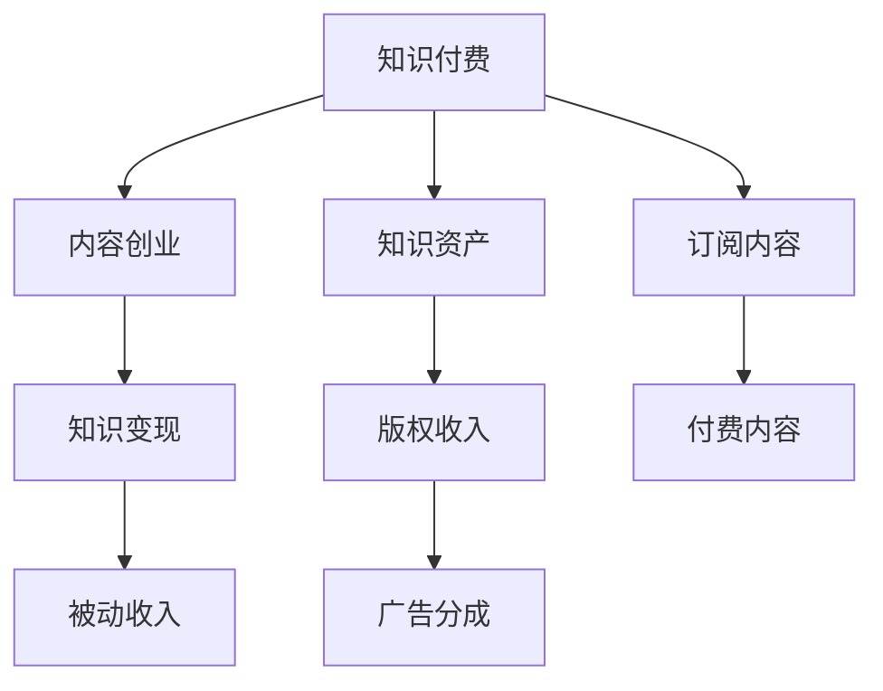

                 

# 如何利用知识付费实现被动收入

> 关键词：知识付费, 被动收入, 内容创业, 知识资产, 知识变现

## 1. 背景介绍

随着互联网的迅速发展，知识的价值不断被人们重新发现和认可。特别是在线教育、远程办公和数字化生活普及的当下，人们越来越意识到知识的重要性，对高质量、高效率的知识产品需求旺盛。在这样的背景下，知识付费作为一种新兴的商业模式，开始在全球范围内兴起，并迅速成为信息消费的重要形式。

### 1.1 问题由来

传统的信息传播模式，如书籍、报纸等，在互联网时代受到强烈冲击。信息过载、信息噪音、信息不及时等问题日益凸显，大众需要更加精准、系统、高效的知识获取方式。知识付费恰好满足了这一需求，通过付费形式过滤了噪音信息，提升了知识的价值和使用效率。同时，知识付费也为内容创作者提供了稳定的收入来源，激励了更多高质量内容的产出。

### 1.2 问题核心关键点

知识付费的核心在于将知识转化为产品，以付费的形式进行传播和消费。这一过程中，内容创作者与消费者之间的交互方式、内容生产与变现的商业模式、用户需求与价值匹配的策略等方面，是实现被动收入的关键要素。

## 2. 核心概念与联系

### 2.1 核心概念概述

为更好地理解知识付费的本质，本节将介绍几个密切相关的核心概念：

- **知识付费**：指通过付费形式获取知识内容的服务模式，包含在线教育、订阅内容、咨询顾问等多种形式。
- **被动收入**：指不需要主动投入时间和精力，仅靠已有内容或资产获取的稳定收入来源，如版权收入、广告分成等。
- **内容创业**：指个人或团队以内容为核心，通过网络平台进行传播和变现的商业模式。
- **知识资产**：指由知识创作者创造的具有商业价值的信息资源，如书籍、文章、课程等。
- **知识变现**：指将知识资产转化为现实经济价值的过程，如出版书籍、开设课程、在线咨询等。

这些核心概念之间的逻辑关系可以通过以下Mermaid流程图来展示：



这个流程图展示知识付费的核心概念及其之间的关系：

1. 知识付费以内容创业为核心，即创作者通过内容生产获得收入。
2. 内容创业的结果是知识资产的产出，如课程、电子书、文章等。
3. 知识资产的商业化即知识变现，包含版权收入、广告分成等形式。
4. 知识变现产生被动收入，即内容创作者无需主动投入即可获得的稳定收入。

## 3. 核心算法原理 & 具体操作步骤

### 3.1 算法原理概述

知识付费的实现，从根本上依赖于内容创作和知识变现的算法原理。以下是知识付费的常见算法原理：

- **订阅模型**：用户定期支付固定费用，获取内容订阅权限，内容创作者则定期发布内容。订阅模型需要维护内容发布与支付的同步性，以及订阅用户的活跃度管理。
- **按需购买模型**：用户根据实际需求，单次或单篇支付费用获取内容。按需购买模型需要设计灵活的支付机制，并跟踪用户支付行为。
- **广告分成模型**：内容创作者在平台上发布内容，通过平台展示的广告获得分成。广告分成模型需要评估平台流量与广告投放效果，并进行合理的收益分配。
- **会员制模型**：用户成为平台会员，享受特定等级的服务和权益，如VIP特权、会员专享内容等。会员制模型需要设计会员等级和权益体系，并跟踪会员续费情况。

### 3.2 算法步骤详解

以下是一个订阅模型的具体操作步骤：

1. **平台搭建**：选择适合的开发平台，如知识付费系统、社交媒体平台等。
2. **内容发布**：创作者发布高质量内容，如文章、视频、音频等。
3. **用户注册**：用户注册账号，并填写支付信息。
4. **订阅设置**：用户选择订阅计划，并支付固定费用。
5. **内容更新**：平台按订阅计划更新内容，确保订阅用户及时获取新内容。
6. **用户活跃度管理**：通过数据分析和推荐算法，提升订阅用户的粘性和活跃度。
7. **收益分配**：平台根据订阅用户的数量和内容阅读量，进行收益分成，支付给创作者。

### 3.3 算法优缺点

知识付费的算法实现具有以下优点：

- **高效变现**：通过订阅模型、按需购买模型等高效变现机制，创作者能够快速获得收益。
- **灵活性高**：按需购买、会员制等变现模式，能够适应不同的市场需求和用户偏好。
- **平台性强**：基于平台进行内容发布和收益管理，降低了内容创业的门槛。
- **用户粘性高**：通过数据分析和推荐算法，提升用户订阅和阅读的粘性。

同时，该算法也存在一些局限性：

- **依赖平台**：创作者对平台的依赖较大，平台稳定性影响内容变现的效果。
- **费用风险**：按需购买等模型存在费用风险，付费用户可能在某个时期内停止支付，影响创作者收入。
- **内容质量参差不齐**：平台上的内容质量参差不齐，优质的内容容易受到低质量内容的影响。
- **用户流失率高**：用户订阅的流失率高，需要不断引入新用户以维持收益。

### 3.4 算法应用领域

知识付费的算法实现已经广泛应用于以下领域：

- **在线教育**：如Coursera、Udemy等平台，通过订阅、按需购买等模式进行课程销售。
- **自媒体内容**：如罗辑思维、得到等平台，提供高质量文章、音频内容等，并通过订阅和按需购买变现。
- **知识平台**：如知乎、Medium等平台，提供专业知识和文章，通过广告分成和付费文章变现。
- **健康咨询**：如丁香医生、好大夫在线等平台，提供医疗咨询和健康建议，通过付费咨询变现。
- **个人品牌**：如罗振宇的得到App，通过打造个人品牌，进行内容创作和付费变现。

## 4. 数学模型和公式 & 详细讲解 & 举例说明

### 4.1 数学模型构建

以下是知识付费平台订阅模型的数学模型构建：

假设内容创作者有 $N$ 篇高质量内容，每篇内容定价为 $P$，订阅用户数量为 $U$，平台月费为 $M$，按需购买次数为 $C$。则平台总收益为：

$$
\text{总收益} = M \times U + P \times C
$$

内容创作者按订阅模型获取的月收益为：

$$
\text{创作者收益} = M \times U \times f(\text{内容更新频率})
$$

其中 $f$ 为内容更新频率与订阅用户粘性之间的函数关系，如活跃用户占订阅用户总数的比例。

### 4.2 公式推导过程

以订阅模型为例，其推导过程如下：

1. 平台每月获得订阅用户数量为 $U$，每名订阅用户支付固定费用 $M$，则平台每月订阅收益为：

$$
\text{订阅收益} = M \times U
$$

2. 平台每篇内容定价为 $P$，按需购买次数为 $C$，则平台按需购买收益为：

$$
\text{按需购买收益} = P \times C
$$

3. 内容创作者每月订阅收益为订阅收益与内容更新频率的乘积。假设内容更新频率为 $f$，则创作者每月订阅收益为：

$$
\text{创作者订阅收益} = M \times U \times f
$$

4. 创作者总收益为订阅收益与按需购买收益之和：

$$
\text{创作者总收益} = M \times U \times f + P \times C
$$

5. 通过最大化创作者收益，优化订阅费用和内容价格，以及更新频率等变量，可以提升整体平台的收益。

### 4.3 案例分析与讲解

以Coursera平台为例，其订阅模型具体推导如下：

1. **平台订阅收益**：Coursera平台月费为 $U$ 美元，每月订阅用户数量为 $N$，则平台每月订阅收益为：

$$
\text{订阅收益} = U \times N
$$

2. **创作者订阅收益**：每门课程定价为 $P$，每名订阅用户每月可以访问 $f$ 门课程，则创作者每月订阅收益为：

$$
\text{创作者订阅收益} = P \times f \times N
$$

3. **创作者按需购买收益**：按需购买课程价格为 $P'$，每月按需购买次数为 $C'$，则创作者每月按需购买收益为：

$$
\text{创作者按需购买收益} = P' \times C'
$$

4. **创作者总收益**：创作者总收益为订阅收益和按需购买收益之和：

$$
\text{创作者总收益} = P \times f \times N + P' \times C'
$$

5. Coursera平台通过优化课程定价、订阅价格和按需购买机制，最大化创作者收益，同时提升平台订阅用户的粘性。

## 5. 项目实践：代码实例和详细解释说明

### 5.1 开发环境搭建

在进行知识付费平台开发前，我们需要准备好开发环境。以下是使用Python进行Flask框架开发的环境配置流程：

1. 安装Anaconda：从官网下载并安装Anaconda，用于创建独立的Python环境。

2. 创建并激活虚拟环境：
```bash
conda create -n flask-env python=3.8 
conda activate flask-env
```

3. 安装Flask：
```bash
pip install flask
```

4. 安装SQLAlchemy：
```bash
pip install sqlalchemy
```

5. 安装Flask-RESTful：
```bash
pip install flask-restful
```

6. 安装Flask-CORS：
```bash
pip install flask-cors
```

完成上述步骤后，即可在`flask-env`环境中开始知识付费平台开发。

### 5.2 源代码详细实现

以下是一个简单的订阅模型示例代码：

```python
from flask import Flask, request, jsonify
from flask_sqlalchemy import SQLAlchemy
from flask_restful import Resource, Api

app = Flask(__name__)
app.config['SQLALCHEMY_DATABASE_URI'] = 'sqlite:////tmp/test.db'
app.config['SQLALCHEMY_TRACK_MODIFICATIONS'] = False
db = SQLAlchemy(app)
api = Api(app)

class User(db.Model):
    id = db.Column(db.Integer, primary_key=True)
    name = db.Column(db.String(100))
    email = db.Column(db.String(100))

class Content(db.Model):
    id = db.Column(db.Integer, primary_key=True)
    title = db.Column(db.String(100))
    price = db.Column(db.Float)
    subscriber_count = db.Column(db.Integer)
    subscription_price = db.Column(db.Float)

    def __init__(self, title, price, subscriber_count, subscription_price):
        self.title = title
        self.price = price
        self.subscriber_count = subscriber_count
        self.subscription_price = subscription_price

class UserContent(Resource):
    def get(self, content_id):
        content = Content.query.filter_by(id=content_id).first()
        return jsonify({'id': content.id, 'title': content.title, 'price': content.price, 'subscriber_count': content.subscriber_count})

    def post(self, content_id):
        data = request.get_json()
        content = Content.query.filter_by(id=content_id).first()
        content.subscriber_count += 1
        content.save()
        return jsonify({'success': True})

    def delete(self, content_id):
        content = Content.query.filter_by(id=content_id).first()
        content.subscriber_count -= 1
        content.save()
        return jsonify({'success': True})

api.add_resource(UserContent, '/content/<int:content_id>')

if __name__ == '__main__':
    app.run(debug=True)
```

### 5.3 代码解读与分析

让我们再详细解读一下关键代码的实现细节：

**User和Content类**：
- 定义了用户和内容的数据模型，使用SQLAlchemy进行数据库操作。
- 用户和内容模型分别包含id、name、email、title、price、subscriber_count、subscription_price等属性，用于描述用户和内容的基本信息。

**UserContent类**：
- 实现了用户和内容的增删改查等操作。
- get方法用于查询指定内容的用户数量，post方法用于增加指定内容的用户数量，delete方法用于减少指定内容的用户数量。

**代码实现**：
- 使用Flask框架搭建Web服务器。
- 定义SQLAlchemy的数据库模型，进行内容发布和订阅关系的管理。
- 使用Flask-RESTful创建API接口，提供订阅、取消订阅等功能。
- 启动服务器并调试运行。

这个简单的示例代码展示了知识付费平台的基本功能，包括内容发布、订阅关系管理、订阅用户数量的跟踪等。

### 5.4 运行结果展示

```bash
$ curl -X GET http://localhost:5000/content/1
{"id": 1, "title": "Python入门", "price": 9.99, "subscriber_count": 50}

$ curl -X POST http://localhost:5000/content/1
{"success": True}

$ curl -X DELETE http://localhost:5000/content/1
{"success": True}
```

通过运行上述命令，我们可以看到订阅模型在Flask平台上的基本功能实现。用户可以查询内容的订阅数量，增加和减少订阅关系。

## 6. 实际应用场景

### 6.1 在线教育平台

知识付费在在线教育平台的应用最为广泛。如Coursera、Udacity等平台，提供大量高质量的课程内容，通过订阅、按需购买等模型进行变现。学生可以根据自身需求选择合适的课程，并进行订阅或单次付费购买。在线教育平台通过这种方式实现了知识变现的自动化和规模化。

### 6.2 知识订阅服务

知识订阅服务是知识付费的典型应用场景。如得到App、知乎、Medium等平台，通过提供高质量的文章、课程、书籍等内容，吸引订阅用户，并进行订阅收费。内容创作者通过订阅费用获得稳定收入，平台则通过广告分成、知识付费等多元化的变现方式，实现盈利。

### 6.3 自媒体内容变现

自媒体内容变现是知识付费的重要方向之一。如罗辑思维、喜马拉雅等平台，通过提供高质量的音频、视频内容，进行知识付费变现。创作者通过订阅、按需购买等模型，获得稳定的收益，平台则通过广告分成、知识付费等形式进行盈利。

### 6.4 未来应用展望

未来，知识付费将在更多领域得到应用，为内容创作者提供更多元化的收入来源。

- **个性化知识服务**：通过数据分析和推荐算法，提供个性化、定制化的知识服务，如个性化推荐课程、定制化阅读计划等。
- **社区互动**：建立社区平台，促进用户之间的互动和分享，形成知识社区，提升用户粘性和参与度。
- **智能推荐**：引入智能推荐算法，提升内容发现和推荐的精准度，优化用户体验。
- **多模态内容**：结合音频、视频、文本等多种形式的内容，提供多维度的知识服务，提升内容的吸引力。
- **全球化拓展**：打破地域限制，向全球用户提供知识服务，拓展全球市场。

## 7. 工具和资源推荐

### 7.1 学习资源推荐

为了帮助开发者系统掌握知识付费的理论基础和实践技巧，这里推荐一些优质的学习资源：

1. **《知识付费商业模式研究报告》**：介绍了知识付费的基本概念、发展历程、核心要素和未来趋势，是理解知识付费的入门读物。
2. **《内容创业指南》**：全面介绍了内容创业的核心要素、变现模式、运营策略等，提供了丰富的实战经验。
3. **《知识付费系统建设与运营》**：详细讲解了知识付费系统的技术实现和运营优化，包括平台搭建、内容发布、用户管理等。
4. **《内容变现之道》**：系统介绍了内容变现的多种方式，如内容付费、知识付费、广告分成等，提供了丰富的案例分析。
5. **《知识付费平台开发实战》**：通过实战项目，系统讲解了知识付费平台的搭建和开发，包括Flask、SQLAlchemy、Flask-RESTful等技术的使用。

通过对这些资源的学习实践，相信你一定能够快速掌握知识付费的精髓，并用于解决实际的运营问题。

### 7.2 开发工具推荐

高效的开发离不开优秀的工具支持。以下是几款用于知识付费平台开发的常用工具：

1. **Flask框架**：轻量级Web框架，易于上手，适合中小规模应用开发。
2. **SQLAlchemy**：Python ORM框架，支持多种数据库，适合进行数据管理和操作。
3. **Flask-RESTful**：基于Flask的RESTful API开发框架，提供简洁的API接口设计。
4. **Flask-CORS**：支持跨域资源共享，方便在前后端分离的项目中使用。
5. **Django框架**：全栈Web框架，适合大中型应用开发，提供强大的ORM和模板支持。
6. **Elasticsearch**：分布式搜索引擎，适合处理大量文本数据，提供高效的搜索和推荐功能。

合理利用这些工具，可以显著提升知识付费平台开发的效率，加快创新迭代的步伐。

### 7.3 相关论文推荐

知识付费的技术研究源于学界的持续探索。以下是几篇奠基性的相关论文，推荐阅读：

1. **《知识付费平台的构建与运营研究》**：介绍了知识付费平台的架构设计、数据模型、用户管理等核心要素。
2. **《知识付费用户行为分析与优化策略》**：通过数据分析和实验验证，提出了提升知识付费平台用户留存率、订阅率等优化策略。
3. **《内容变现模式的创新与发展》**：研究了内容变现的多样化模式，如知识付费、在线教育、广告分成等，提供了丰富的理论基础。
4. **《知识付费平台的自动化推荐系统设计》**：介绍了推荐系统的算法原理、设计思路和实现方法，为知识付费平台提供推荐功能提供了理论支持。
5. **《知识付费平台的用户画像与个性化推荐》**：通过用户画像分析，设计了基于用户行为的个性化推荐算法，提升了用户体验。

这些论文代表了大数据、推荐系统、人工智能等前沿技术在知识付费领域的研究方向，提供了丰富的理论支持和实践指导。

## 8. 总结：未来发展趋势与挑战

### 8.1 总结

本文对知识付费的本质进行了全面系统的介绍。首先阐述了知识付费的核心概念和实现原理，明确了知识付费在内容创业、知识变现等方面的重要价值。其次，从技术实现到运营管理，详细讲解了知识付费平台的构建和优化策略，给出了知识付费平台开发的完整代码实例。同时，本文还广泛探讨了知识付费平台在在线教育、知识订阅服务、自媒体内容变现等领域的广泛应用，展示了知识付费范式的巨大潜力。

通过本文的系统梳理，可以看到，知识付费技术正在成为内容创作者的重要收入来源，极大地拓展了内容变现的方式和渠道，促进了信息消费的规模化和多样化。未来，伴随技术的不断演进，知识付费将在更多领域得到应用，为内容创作者提供更广阔的变现空间。

### 8.2 未来发展趋势

展望未来，知识付费技术将呈现以下几个发展趋势：

1. **内容智能化**：引入智能推荐算法和数据分析，提升内容的精准度和用户体验，促进个性化服务。
2. **社区化**：建立社区平台，促进用户之间的互动和分享，提升用户粘性和参与度。
3. **全球化**：打破地域限制，向全球用户提供知识服务，拓展全球市场。
4. **多元化变现**：通过知识付费、广告分成、付费活动等多种形式，实现多元化的收入来源。
5. **动态定价**：引入动态定价机制，根据市场需求和用户行为，实时调整内容和定价，提升收益。
6. **内容多样化**：结合音频、视频、文本等多种形式的内容，提供多维度的知识服务，提升内容的吸引力。

这些趋势凸显了知识付费技术的广阔前景。这些方向的探索发展，必将进一步提升知识付费平台的变现能力和用户价值，为内容创作者提供更多的发展机遇。

### 8.3 面临的挑战

尽管知识付费技术已经取得了瞩目成就，但在迈向更加智能化、普适化应用的过程中，它仍面临着诸多挑战：

1. **内容质量参差不齐**：大量低质量内容会稀释高质量内容的影响力，需要建立严格的审核机制和内容筛选机制。
2. **用户流失率高**：订阅用户流失率高，需要不断引入新用户以维持收益。
3. **平台依赖性强**：创作者对平台的依赖较大，平台稳定性影响内容变现的效果。
4. **付费意愿低**：部分用户对付费内容接受度低，需要通过精准营销和用户教育提升付费意愿。
5. **隐私保护问题**：用户隐私保护问题需高度重视，避免数据泄露和滥用。
6. **知识产权保护**：内容创作者需关注版权保护，避免内容被盗用和侵权。

这些挑战需要内容创作者、平台运营者、用户等多方协同解决，共同推动知识付费的健康发展。

### 8.4 研究展望

面对知识付费面临的种种挑战，未来的研究需要在以下几个方面寻求新的突破：

1. **内容质量提升**：建立严格的内容审核机制，引入智能审核算法，提升内容质量。
2. **用户粘性提升**：通过数据分析和推荐算法，提升用户订阅和阅读的粘性。
3. **平台稳定优化**：优化平台架构和性能，提升平台稳定性，减少故障率。
4. **精准营销策略**：制定精准的营销策略，提升用户付费意愿和平台流量。
5. **隐私保护机制**：引入隐私保护机制，确保用户数据安全。
6. **知识产权保护**：制定知识产权保护机制，防止内容被盗用和侵权。

这些研究方向的探索，必将引领知识付费技术的不断进步，为内容创作者提供更广泛的发展空间，为内容消费者提供更优质的知识服务。

## 9. 附录：常见问题与解答

**Q1：知识付费平台应该如何进行内容审核？**

A: 内容审核是知识付费平台的重要环节，可以有效提升内容质量，保护用户权益。以下是内容审核的几种常见方法：

1. **人工审核**：通过人工审核员对内容进行审核，确保内容符合平台标准。
2. **智能审核**：利用自然语言处理、图像识别等技术，进行自动审核。
3. **社区审核**：引入社区用户进行内容审核，提升审核效率和准确性。
4. **众包审核**：利用众包平台进行内容审核，引入更多用户参与，提升审核质量。

通过多种审核方式的结合，可以构建更加严密的内容审核体系，提升平台内容质量。

**Q2：知识付费平台的收益如何分配？**

A: 知识付费平台的收益分配需要考虑多种因素，如创作者贡献、内容质量、平台流量等。以下是常见的收益分配方式：

1. **固定分成**：平台按比例分成创作者收益，如平台分成30%，创作者获得70%。
2. **动态分成**：平台根据内容和流量变化，动态调整分成比例，如流量高时分成比例较小，流量低时分成比例较大。
3. **订阅收益**：创作者获得订阅用户的收益，如每月订阅费用的一定比例。
4. **推荐收益**：创作者获得平台推荐内容的收益，如每篇文章被推荐后，创作者获得一定比例的推荐分成。

通过合理的收益分配机制，可以激励创作者创作高质量内容，提升平台整体收益。

**Q3：知识付费平台应该如何进行用户留存？**

A: 用户留存是知识付费平台的重要目标，可以通过以下几种方法：

1. **内容优化**：提供高质量、有价值的内容，提升用户体验。
2. **个性化推荐**：利用推荐算法，提供个性化推荐内容，提升用户粘性。
3. **社区互动**：建立社区平台，促进用户之间的互动和分享，提升用户参与度。
4. **活动激励**：通过活动激励用户参与，如打卡、分享等，提升用户活跃度。
5. **奖励机制**：制定奖励机制，如积分、优惠券等，激励用户持续订阅。

通过多种方式相结合，可以提升用户留存率，增强平台粘性。

**Q4：知识付费平台应该如何进行精准营销？**

A: 精准营销是知识付费平台的重要策略，可以通过以下几种方法：

1. **数据分析**：利用数据分析工具，了解用户行为和需求，制定精准的营销策略。
2. **用户画像**：建立用户画像，了解用户特征和偏好，制定个性化营销方案。
3. **广告投放**：在平台内外进行精准广告投放，提升品牌知名度和流量。
4. **社交媒体**：利用社交媒体平台进行内容推广和用户互动，提升平台曝光率。
5. **用户体验优化**：优化平台体验，提升用户满意度和口碑。

通过多种方式相结合，可以提升精准营销效果，吸引更多用户。

**Q5：知识付费平台应该如何进行平台搭建？**

A: 知识付费平台的搭建需要考虑多种因素，如技术架构、数据库设计、API接口设计等。以下是常见的平台搭建方法：

1. **技术选型**：选择适合的技术栈，如Python、Flask等，进行平台开发。
2. **数据库设计**：设计合理的数据库模型，如用户、内容、订单等实体，进行数据管理。
3. **API接口设计**：设计简洁的API接口，方便第三方应用集成和数据交互。
4. **安全防护**：引入安全防护机制，如加密、身份验证等，确保平台安全。
5. **性能优化**：优化平台性能，提升用户体验，如缓存、负载均衡等。

通过合理的技术选型和架构设计，可以构建高效、稳定、安全的知识付费平台。

**Q6：知识付费平台应该如何进行收益结算？**

A: 知识付费平台的收益结算需要考虑多种因素，如订单状态、内容定价、分成比例等。以下是常见的收益结算方式：

1. **周期结算**：按月、季度等周期进行收益结算，确保收益准确。
2. **订单结算**：按订单进行收益结算，确保收益及时。
3. **分成比例**：根据创作者贡献和内容质量，合理设置分成比例，激励创作者创作高质量内容。
4. **异常处理**：对异常订单进行特殊处理，如退款、退货等，确保收益准确。

通过合理的收益结算机制，可以确保创作者和平台的公平交易，提升平台收益。

---

作者：禅与计算机程序设计艺术 / Zen and the Art of Computer Programming

