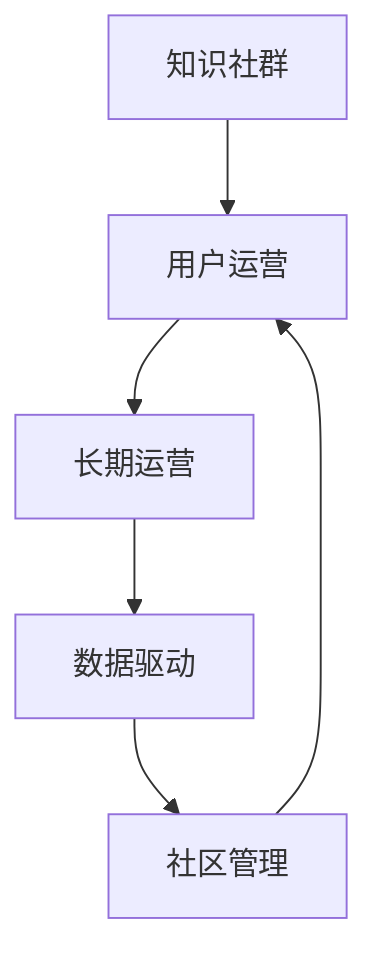

                 

# 如何利用知识社群实现用户的长期运营

> 关键词：知识社群,用户运营,长期运营,数据驱动,社区管理

## 1. 背景介绍

### 1.1 问题由来
在互联网时代，用户的获取、留存、活跃度提升和转化率优化成为了企业关注的重点。随着社交媒体和内容平台的兴起，传统的产品营销策略面临挑战，用户之间的交互和信息共享变得越发重要。用户运营不再仅仅是产品功能开发和推广渠道拓展，而是需要借助社区力量，构建深度的用户关系，实现品牌的口碑传播和用户忠诚度的提升。

### 1.2 问题核心关键点
长期运营用户的核心在于激发用户的活跃度和忠诚度，通过用户之间的互动和内容分享，构建知识社群，形成良好的社区氛围。知识社群可以成为品牌与用户沟通的桥梁，帮助品牌收集用户反馈，提升产品迭代速度。

### 1.3 问题研究意义
构建知识社群，可以提升用户对品牌的粘性，增加用户对产品的认同感和忠诚度，通过社区的互动和内容分享，增强用户的参与感和归属感。这对于构建品牌忠诚用户群体，推动产品的长期发展具有重要意义。

## 2. 核心概念与联系

### 2.1 核心概念概述

为更好地理解如何利用知识社群实现用户的长期运营，本节将介绍几个密切相关的核心概念：

- **知识社群**：以知识和信息共享为核心目的的社交群体，用户在其中进行讨论、交流和协作，形成良性互动和信息循环。
- **用户运营**：通过各种策略和手段，提升用户与品牌的互动频率和时长，增加用户的参与度和忠诚度。
- **长期运营**：在获取用户后，通过持续的交互和关系维护，延长用户生命周期，提升用户价值。
- **数据驱动**：利用数据分析和挖掘技术，分析用户行为和需求，指导用户运营策略的制定和优化。
- **社区管理**：通过制定社区规则和引导社区文化，维护社区秩序，鼓励用户积极参与和贡献。

这些核心概念之间的逻辑关系可以通过以下Mermaid流程图来展示：



这个流程图展示的知识社群与用户运营、长期运营、数据驱动和社区管理之间的关系：

1. 知识社群为用户运营提供了土壤，通过社群互动提升用户活跃度和粘性。
2. 长期运营的目标是通过社区的力量，增加用户对品牌的忠诚度。
3. 数据驱动是通过分析用户行为数据，优化运营策略。
4. 社区管理是维护社群秩序，鼓励用户积极参与和贡献。

## 3. 核心算法原理 & 具体操作步骤

### 3.1 算法原理概述

利用知识社群实现用户的长期运营，主要依赖于社区的活力和用户参与度。通过设计合适的激励机制和社区规则，激发用户之间的互动和内容创作，从而构建一个积极参与和知识分享的社群。

具体而言，可以采用以下几个步骤：

1. **社区建设**：根据品牌的定位和目标用户群体，设计社区的主题和规则，吸引用户加入。
2. **内容激励**：通过积分、排行榜、认证等手段，激励用户创作和分享高质量内容。
3. **互动促进**：鼓励用户之间进行互动和评论，通过话题引导和活动策划，增加用户之间的互动频率。
4. **数据分析**：利用数据分析技术，评估社区活动的效果，优化运营策略。

### 3.2 算法步骤详解

以下是具体实现用户运营的详细步骤：

**Step 1: 社区设计与运营**
- 分析目标用户群体，确定社区的主题和定位。
- 设计社区的规则和互动机制，如积分系统、话题引导、认证机制等。
- 选择合适的社交媒体平台进行社区建设，如建立论坛、微信群、QQ群等。

**Step 2: 内容激励机制**
- 设计积分和排行榜系统，对优质内容和互动行为进行奖励。
- 推出内容创作者认证计划，对优质内容创作者进行表彰。
- 引入话题引导功能，通过热门话题引导用户参与讨论。

**Step 3: 互动促进活动**
- 策划定期举办的社区活动，如主题讨论、知识竞赛、用户交流会等。
- 利用数据分析，预测用户活跃度，提前策划活动，增加用户参与度。
- 引入用户推荐机制，通过用户推荐新用户加入社区，增加社区活跃度。

**Step 4: 数据分析与优化**
- 利用数据分析工具，监测社区的活跃度、用户参与度、内容质量等指标。
- 定期评估社区活动的效果，根据数据反馈，调整优化运营策略。
- 利用机器学习算法，预测用户行为，提升社区互动的精准性。

### 3.3 算法优缺点

利用知识社群实现用户长期运营的算法具有以下优点：

1. **提高用户粘性**：通过社区的互动和内容分享，增加用户对品牌的认同感和忠诚度。
2. **促进内容创作**：通过激励机制和社区规则，激发用户创作和分享高质量内容。
3. **提升用户活跃度**：通过多样化的社区活动和互动机制，增加用户参与度和互动频率。
4. **精准运营**：通过数据分析，优化运营策略，提升社区运营的精准性。

同时，该方法也存在一定的局限性：

1. **用户筛选难度大**：吸引高质量用户加入社群，可能需要较高的运营成本。
2. **运营复杂度高**：维护社区秩序和互动机制，需要较高的运营团队支持。
3. **数据隐私风险**：用户数据的安全和隐私保护，需要严格的制度和技术措施。
4. **内容质量参差不齐**：社区中用户水平不一，可能导致内容质量参差不齐，影响用户体验。

尽管存在这些局限性，但就目前而言，利用知识社群实现用户长期运营，仍是大规模用户运营的可行方式。未来相关研究的重点在于如何进一步降低用户筛选难度，提高运营效率，同时兼顾数据隐私保护和内容质量。

### 3.4 算法应用领域

基于知识社群的长期用户运营，已经在多个领域得到了广泛应用，例如：

- **电商领域**：通过社群营销提升用户复购率，增加产品销量。
- **教育领域**：通过知识社群，培养用户的学习兴趣和忠诚度，提升课程质量。
- **科技社区**：构建技术知识分享和交流的社群，增加用户对品牌的认同感。
- **健康管理**：建立健康知识社群，提供健康咨询和互动，提升用户对品牌的信任感。

除了上述这些经典领域外，知识社群在更多场景中也会发挥重要作用，如旅游、金融、娱乐等，为品牌提供深度用户互动和口碑传播的新渠道。

## 4. 数学模型和公式 & 详细讲解 & 举例说明

### 4.1 数学模型构建

为了更加系统和准确地理解利用知识社群实现用户长期运营的数学模型，本节将给出详细的模型构建过程。

假设社区中用户数量为 $N$，每个用户每天的活跃时间为 $T$，社区的平均活跃时间为 $T_0$。用户对社区的满意度和忠诚度可以通过互动频率和内容质量等指标来衡量。设用户对社区的满意度为 $S$，满意度的提升速度为 $\eta$，满意度的提升与活跃度、互动质量、内容质量等因素成正相关。社区的用户流失率为 $\lambda$，流失率与用户满意度成反比。

根据上述假设，可以构建如下的用户活跃度和流失率的数学模型：

$$
\frac{dS}{dt} = \eta \times (N \times T - N \times T_0) \times f(Q)
$$

其中 $f(Q)$ 为内容质量和互动质量的函数，$Q$ 为社区的内容质量指标。社区的用户流失率 $\lambda$ 为：

$$
\lambda = \frac{1}{S}
$$

社区的平均用户数量 $U$ 为：

$$
U = N \times \frac{S}{1 + \lambda \times T_0}
$$

### 4.2 公式推导过程

根据上述模型，可以推导出用户满意度和流失率的动态方程：

$$
\frac{dS}{dt} = \eta \times N \times T \times (1 - \frac{T_0}{T}) \times f(Q)
$$

由于社区中用户数量 $N$ 相对稳定，可以将 $N$ 视为常数。进一步化简得：

$$
\frac{dS}{dT} = \eta \times (1 - \frac{T_0}{T}) \times f(Q)
$$

社区的用户流失率 $\lambda$ 为：

$$
\lambda = \frac{1}{S}
$$

将用户流失率代入用户活跃度的动态方程，可得：

$$
\frac{dS}{dt} = \eta \times (1 - \frac{T_0}{T}) \times f(Q) - \frac{1}{S}
$$

### 4.3 案例分析与讲解

假设社区的平均活跃时间为 $T_0=4$ 小时/天，用户每天的活跃时间为 $T=8$ 小时/天，满意度的提升速度为 $\eta=0.1$，内容质量与满意度的关系为 $f(Q)=Q^2$，初始用户满意度 $S_0=0.5$。根据上述模型，可以计算用户满意度和流失率随时间的变化过程。

以 $S(t)$ 和 $\lambda(t)$ 分别表示用户满意度和流失率，可得：

$$
\frac{dS}{dt} = 0.1 \times (1 - \frac{4}{8}) \times Q^2 - \frac{1}{S}
$$

$$
\lambda = \frac{1}{S}
$$

通过数值积分或解析求解，可以计算出在不同时间点用户满意度和流失率的值，进而评估社区运营的效果。

## 5. 项目实践：代码实例和详细解释说明

### 5.1 开发环境搭建

在进行用户运营的实践前，我们需要准备好开发环境。以下是使用Python进行数据分析和社区管理的开发环境配置流程：

1. 安装Anaconda：从官网下载并安装Anaconda，用于创建独立的Python环境。

2. 创建并激活虚拟环境：
```bash
conda create -n user_ops_env python=3.8 
conda activate user_ops_env
```

3. 安装必要的工具包：
```bash
pip install pandas numpy matplotlib scikit-learn seaborn jupyter notebook 
```

4. 安装社区管理工具：
```bash
pip install django redis
```

完成上述步骤后，即可在`user_ops_env`环境中开始用户运营的实践。

### 5.2 源代码详细实现

以下是一个简单的社区管理系统，包含用户注册、登录、内容发布、互动等功能。代码示例基于Django框架和Redis数据库，具体实现如下：

```python
# models.py
from django.db import models

class User(models.Model):
    username = models.CharField(max_length=50, unique=True)
    password = models.CharField(max_length=100)
    email = models.EmailField(unique=True)
    created_at = models.DateTimeField(auto_now_add=True)

class Post(models.Model):
    title = models.CharField(max_length=255)
    content = models.TextField()
    user = models.ForeignKey(User, on_delete=models.CASCADE)
    created_at = models.DateTimeField(auto_now_add=True)
     likes = models.IntegerField(default=0)

# views.py
from django.shortcuts import render, redirect
from django.http import HttpResponse
from .models import User, Post

def user_login(request):
    if request.method == 'POST':
        username = request.POST['username']
        password = request.POST['password']
        user = User.objects.filter(username=username, password=password).first()
        if user:
            request.session['user_id'] = user.id
            return redirect('home')
    return render(request, 'login.html')

def user_logout(request):
    del request.session['user_id']
    return redirect('home')

def user_profile(request):
    if 'user_id' in request.session:
        user = User.objects.get(id=request.session['user_id'])
        posts = Post.objects.filter(user=user).order_by('-created_at')
        return render(request, 'profile.html', {'user': user, 'posts': posts})
    return redirect('home')

def post_create(request):
    if 'user_id' in request.session:
        user = User.objects.get(id=request.session['user_id'])
        if request.method == 'POST':
            title = request.POST['title']
            content = request.POST['content']
            post = Post(title=title, content=content, user=user)
            post.save()
            return redirect('home')
    return render(request, 'create.html')

def post_detail(request, post_id):
    post = Post.objects.get(id=post_id)
    return render(request, 'detail.html', {'post': post})

# urls.py
from django.urls import path
from . import views

urlpatterns = [
    path('login/', views.user_login, name='login'),
    path('logout/', views.user_logout, name='logout'),
    path('profile/', views.user_profile, name='profile'),
    path('create/', views.post_create, name='create'),
    path('post/<int:post_id>/', views.post_detail, name='detail'),
]

# 其他代码省略
```

### 5.3 代码解读与分析

以上代码示例包含了基本的用户管理和内容发布功能。具体解读如下：

**User模型**：
- 定义了用户的基本信息，包括用户名、密码、邮箱和创建时间。

**Post模型**：
- 定义了帖子的信息，包括标题、内容、作者和创建时间。
- 帖子还包含了点赞数，记录用户对内容的互动。

**用户登录和注销视图**：
- `user_login`视图：处理用户登录请求，验证用户名和密码，并设置会话变量。
- `user_logout`视图：处理用户注销请求，清除会话变量。

**用户个人主页视图**：
- 显示用户的基本信息和自己的帖子列表，根据创建时间倒序排列。

**内容发布视图**：
- 显示内容发布表单，用户填写标题和内容后提交，系统创建新的帖子并保存到数据库。

**内容详情视图**：
- 显示指定帖子的详细信息，包括标题、内容和作者信息。

### 5.4 运行结果展示

运行上述代码后，用户可以通过注册和登录功能，发布自己的帖子并与其他用户互动。系统会根据用户的活跃度和互动情况，进行相应的数据分析和优化。

## 6. 实际应用场景

### 6.1 智能客服系统

基于知识社群的用户运营，可以构建智能客服系统的知识库和社区。用户可以在社区中提问，其他用户和客服团队共同回答，形成一个互动频繁的知识社群。通过社群的互动，提升用户对客服系统的满意度，增强用户对品牌的忠诚度。

### 6.2 在线教育平台

在线教育平台可以通过知识社群，构建学习交流社区。用户可以在社区中分享学习经验、讨论问题，形成良好的学习氛围。平台还可以通过社区中的互动数据，优化课程内容和教学方法，提升用户的整体学习效果。

### 6.3 社交媒体平台

社交媒体平台可以利用知识社群，提升用户的活跃度和粘性。通过话题引导和内容激励，增加用户之间的互动和内容分享，形成社区文化。平台还可以通过社区数据分析，优化产品推荐和内容推送，提升用户的使用体验。

### 6.4 未来应用展望

随着知识社群在用户运营中的应用不断深入，未来的发展前景将更加广阔。以下是对未来应用场景的展望：

1. **智能推荐系统**：利用社群中的用户行为数据，优化推荐算法，提升个性化推荐的准确性。
2. **内容创作平台**：建立知识创作社区，吸引专业创作者入驻，形成高质量内容的供应链。
3. **在线协作工具**：构建知识协作平台，支持团队协作和项目管理，提升企业工作效率。
4. **虚拟偶像与虚拟主播**：利用知识社群，培育虚拟偶像和虚拟主播，形成粉丝互动和内容分享的生态系统。

## 7. 工具和资源推荐

### 7.1 学习资源推荐

为了帮助开发者系统掌握利用知识社群实现用户运营的理论基础和实践技巧，这里推荐一些优质的学习资源：

1. **《用户运营的艺术》系列书籍**：详细介绍了用户运营的核心概念和策略，涵盖了用户获取、留存、转化等多个方面。

2. **《社区管理与运营》课程**：由社区管理专家授课，全面讲解社区建设、用户互动、内容激励等核心技术。

3. **《数据分析与挖掘》书籍**：介绍了数据分析和挖掘技术，帮助开发者通过数据驱动用户运营。

4. **《NLP与社区管理》在线课程**：通过自然语言处理技术，提升社区内容管理和用户互动的效率。

5. **Kaggle竞赛**：参加Kaggle社区中的数据科学竞赛，通过实际项目积累数据处理和模型优化经验。

通过对这些资源的学习实践，相信你一定能够快速掌握利用知识社群实现用户运营的精髓，并用于解决实际的社区运营问题。

### 7.2 开发工具推荐

高效的开发离不开优秀的工具支持。以下是几款用于知识社群开发的常用工具：

1. **Django**：基于Python的开源Web框架，适合快速迭代和开发社区管理系统。

2. **Flask**：轻量级Web框架，适合小型社区应用，易于扩展和部署。

3. **MongoDB**：非关系型数据库，适合存储用户互动数据和内容数据。

4. **Elasticsearch**：分布式搜索引擎，适合处理大规模社区数据，支持高效查询和分析。

5. **Jupyter Notebook**：数据科学和机器学习开发的利器，适合快速迭代和可视化分析。

合理利用这些工具，可以显著提升知识社群开发和运营的效率，加快创新迭代的步伐。

### 7.3 相关论文推荐

利用知识社群实现用户运营的研究源于学界的持续探索。以下是几篇奠基性的相关论文，推荐阅读：

1. **《社区驱动的用户行为研究》**：探讨了社区互动对用户行为的影响，提出了社区激励和用户粘性的理论框架。

2. **《基于社交网络的情感分析》**：利用社交网络数据，分析用户的情感变化趋势，为社区运营提供数据支持。

3. **《用户参与度的量化研究》**：通过数据分析和建模，量化用户参与度和满意度，优化社区运营策略。

4. **《用户社区的传播效果评估》**：评估用户社区在品牌传播中的效果，提出社区口碑管理的策略。

5. **《知识管理与社区协作》**：讨论了知识管理在社区协作中的应用，提升社区知识共享和协作的效率。

这些论文代表了利用知识社群实现用户运营的研究进展，通过学习这些前沿成果，可以帮助研究者把握学科前进方向，激发更多的创新灵感。

## 8. 总结：未来发展趋势与挑战

### 8.1 总结

本文对利用知识社群实现用户长期运营进行了全面系统的介绍。首先阐述了知识社群和用户运营的理论基础，明确了社区建设、内容激励、互动促进和数据分析等关键环节的作用。其次，从原理到实践，详细讲解了社区建设的具体步骤和运营策略，给出了社区管理的完整代码实现。同时，本文还广泛探讨了知识社群在智能客服、在线教育、社交媒体等各个行业领域的应用前景，展示了知识社群在用户运营中的巨大潜力。最后，本文精选了社区运营的各类学习资源和开发工具，力求为读者提供全方位的技术指引。

通过本文的系统梳理，可以看到，利用知识社群实现用户长期运营，是当前用户运营的重要方向。社区的互动和内容分享，使得用户之间的连接更加紧密，通过社区的力量，可以提升用户的粘性和忠诚度，增加品牌的口碑传播。未来，伴随社区运营技术的不断进步，知识社群将在更多场景中发挥重要作用，助力品牌实现用户运营的突破。

### 8.2 未来发展趋势

展望未来，知识社群和用户运营将呈现以下几个发展趋势：

1. **数据驱动**：利用大数据和人工智能技术，优化社区运营策略，提升用户满意度和互动频率。
2. **多模态融合**：结合文本、图像、视频等多模态数据，增强社区的互动性和用户参与度。
3. **实时响应**：通过实时数据分析，及时调整社区运营策略，提升用户满意度。
4. **内容生成**：利用生成对抗网络(GAN)等技术，生成高质量的内容，丰富社区的内容生态。
5. **用户引导**：利用推荐算法和个性化展示，引导用户参与和互动，增加社区的活跃度。

以上趋势凸显了知识社群和用户运营的广阔前景。这些方向的探索发展，必将进一步提升社区互动的精准性和用户参与度，构建更活跃、更健康的社区环境。

### 8.3 面临的挑战

尽管知识社群在用户运营中的应用已经取得了一定成效，但在迈向更加智能化、普适化应用的过程中，它仍面临诸多挑战：

1. **用户筛选难度大**：吸引高质量用户加入社群，可能需要较高的运营成本。
2. **运营复杂度高**：维护社区秩序和互动机制，需要较高的运营团队支持。
3. **数据隐私风险**：用户数据的安全和隐私保护，需要严格的制度和技术措施。
4. **内容质量参差不齐**：社区中用户水平不一，可能导致内容质量参差不齐，影响用户体验。

尽管存在这些挑战，但通过持续的研究和优化，相信知识社群在用户运营中的价值将会得到进一步挖掘和应用。

### 8.4 研究展望

面向未来，知识社群和用户运营的研究需要在以下几个方面寻求新的突破：

1. **智能推荐系统**：结合深度学习和推荐算法，提升社区内容推荐和用户互动的精准性。
2. **内容生成平台**：利用生成对抗网络等技术，生成高质量的内容，丰富社区的内容生态。
3. **社区自动化管理**：通过智能算法和自动化工具，减轻社区管理的负担，提升运营效率。
4. **用户行为分析**：利用大数据和机器学习技术，深入分析用户行为和需求，指导社区运营策略。
5. **用户隐私保护**：结合隐私保护技术，保障用户数据的隐私和安全。

这些研究方向的探索，必将引领知识社群和用户运营技术迈向更高的台阶，为构建安全、可靠、可解释、可控的社区环境铺平道路。面向未来，知识社群和用户运营需要与其他人工智能技术进行更深入的融合，共同推动社区管理的进步。

## 9. 附录：常见问题与解答

**Q1：如何衡量知识社群的运营效果？**

A: 衡量知识社群的运营效果，可以从以下几个方面进行评估：
1. **用户活跃度**：通过用户登录频次、帖子发布频次、互动频率等指标，衡量社区的活跃程度。
2. **用户满意度**：通过用户评分、评论、反馈等，了解用户对社区的满意度和改进建议。
3. **用户留存率**：通过用户流失率、社区停留时间等指标，评估用户对社区的忠诚度。
4. **内容质量**：通过内容点赞数、评论数、回复数等指标，衡量社区内容的质量和受欢迎程度。
5. **运营成本**：通过运营投入和产出对比，评估社区运营的经济效益。

以上指标可以通过数据分析和挖掘技术进行量化评估，帮助社区管理者了解运营效果，优化运营策略。

**Q2：社区管理中如何平衡用户自由与社区秩序？**

A: 社区管理中，平衡用户自由与社区秩序的关键在于建立合理的规则和激励机制。具体来说：
1. **制定社区规则**：明确社区的行为规范和底线，防止用户发布有害内容或进行恶意行为。
2. **引导社区文化**：通过正向激励和引导，鼓励用户积极参与和互动，形成良好的社区氛围。
3. **用户行为监控**：利用数据分析技术，实时监控用户行为，及时发现和处理违规行为。
4. **社区自治机制**：鼓励用户自我管理和自我监督，增强社区的自治性和自我管理能力。

通过合理的设计和管理，可以在保障社区秩序的同时，最大化用户自由和互动的空间。

**Q3：如何吸引高质量用户加入社群？**

A: 吸引高质量用户加入社群，可以通过以下几种策略：
1. **品牌宣传**：通过社交媒体、官网等渠道，宣传社群的价值和优势，吸引潜在用户加入。
2. **用户推荐**：通过奖励机制和积分系统，鼓励现有用户推荐新用户加入。
3. **内容激励**：提供高质量的内容激励，如内容创作者认证、荣誉奖励等，吸引专业用户入驻。
4. **活动策划**：策划有吸引力的社区活动，如主题讨论、知识竞赛等，增加用户参与度。
5. **个性化互动**：通过数据分析，了解用户的兴趣和需求，进行个性化推荐和互动，提升用户体验。

通过多种策略的综合运用，可以吸引更多高质量用户加入社群，提升社区的用户质量和活跃度。

**Q4：社区运营中如何优化内容推荐？**

A: 优化内容推荐可以通过以下步骤实现：
1. **数据收集**：收集用户的浏览、点赞、评论等行为数据，构建用户画像。
2. **内容分析**：对社区中的内容进行分类和标签化，提取关键特征。
3. **推荐算法**：利用机器学习算法，如协同过滤、内容基推荐、混合推荐等，进行内容推荐。
4. **反馈迭代**：根据用户反馈，不断优化推荐算法和内容质量，提升推荐效果。
5. **个性化展示**：通过数据分析和用户画像，进行个性化推荐，增加用户互动频率。

通过以上步骤，可以构建一个高效、个性化的内容推荐系统，提升用户对社区的满意度。

**Q5：社区运营中如何保障用户隐私和安全？**

A: 社区运营中保障用户隐私和安全，需要采取以下措施：
1. **数据加密**：对用户数据进行加密存储，防止数据泄露和被恶意攻击。
2. **隐私保护**：制定隐私保护政策，明确用户数据的收集和使用范围，保障用户隐私。
3. **访问控制**：通过身份验证和权限管理，防止未授权用户访问和修改社区数据。
4. **监控和审计**：建立实时监控和审计机制，及时发现和处理数据安全问题。
5. **用户教育**：通过教育引导，提高用户对隐私和安全的意识，减少数据泄露的风险。

通过综合运用以上措施，可以构建一个安全可靠的知识社群环境，保障用户数据和隐私的安全。

---

作者：禅与计算机程序设计艺术 / Zen and the Art of Computer Programming

