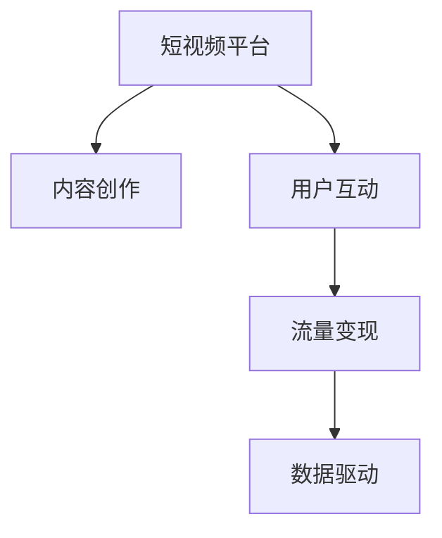

                 

# 如何利用短视频平台进行知识付费营销

> 关键词：短视频平台,知识付费,内容创作,用户互动,流量变现,数据驱动

## 1. 背景介绍

### 1.1 问题由来
随着互联网技术的发展，短视频平台逐渐成为信息传播的新主流。相比于传统的图文内容，短视频以其直观生动、易于消化的特点，吸引了大量用户的关注。然而，短视频平台的内容生态仍较为松散，优质的原创内容相对缺乏，用户体验尚有提升空间。知识付费作为近年来快速兴起的商业模式，正致力于利用专业知识提升用户价值，但如何在短视频平台中实现高效的内容变现，仍是业界面临的一大难题。

### 1.2 问题核心关键点
如何利用短视频平台进行知识付费营销，可以概括为以下几个核心关键点：
1. **内容创作**：创作与用户需求高度匹配的知识视频内容。
2. **用户互动**：构建用户与内容创作者之间的有效互动机制。
3. **流量变现**：通过各种方式将平台流量转化为实际收益。
4. **数据驱动**：利用数据分析优化内容生产和用户运营策略。

这些关键点共同构成了知识付费营销的基础框架，而短视频平台为这一框架的实现提供了良好的条件。

## 2. 核心概念与联系

### 2.1 核心概念概述

为更好地理解利用短视频平台进行知识付费营销的策略，本节将介绍几个关键概念：

- **短视频平台**：如抖音、快手、Bilibili等，是用户上传、浏览短视频内容的主要平台。
- **知识付费**：通过提供有价值的知识内容，向用户收取费用以获取回报的商业模式。
- **内容创作**：创作并发布高质量的短视频内容，包括文案编写、视频拍摄、剪辑等。
- **用户互动**：通过点赞、评论、分享等方式，增加用户与内容创作者之间的互动，提升用户黏性。
- **流量变现**：通过广告收入、用户打赏、付费课程等形式，将平台流量转化为收益。
- **数据驱动**：利用平台提供的数据分析工具，优化内容策略，提升用户参与度。

这些概念之间的逻辑关系可以通过以下Mermaid流程图来展示：



这个流程图展示了我们利用短视频平台进行知识付费营销的核心概念及其之间的关联。

## 3. 核心算法原理 & 具体操作步骤
### 3.1 算法原理概述

利用短视频平台进行知识付费营销，本质上是一种基于内容与用户互动的商业策略。其核心在于：

1. **内容创作与分发**：创作高质量、有价值的短视频内容，并通过平台算法优化分发策略，吸引更多用户关注。
2. **用户互动与参与**：通过互动机制提升用户参与度，增加用户的转化率和留存率。
3. **流量变现与优化**：通过多样化的流量变现方式，如广告、打赏、课程等，将用户流量转化为实际收益，同时不断优化变现策略。
4. **数据驱动与分析**：利用平台提供的数据分析工具，对用户行为和内容效果进行深入分析，不断调整和优化营销策略。

### 3.2 算法步骤详解

以下是利用短视频平台进行知识付费营销的具体操作步骤：

**Step 1: 内容创作与分发策略制定**

1. **内容主题确定**：基于用户需求和兴趣，确定短视频内容的主题和方向，如科技、财经、教育等。
2. **内容质量提升**：通过视频拍摄、剪辑、特效等技术手段，提升视频质量和观赏性。
3. **平台算法优化**：了解平台推荐算法的工作原理，调整内容发布时间、频率等策略，最大化提高内容的曝光率和用户互动率。

**Step 2: 用户互动机制设计与实施**

1. **互动内容设计**：在视频结尾或中间设计互动内容，如提问、投票、挑战等，引导用户参与。
2. **互动激励机制**：设置打赏、评论互动奖励机制，激励用户积极参与互动。
3. **用户反馈收集**：通过评论、私信等方式收集用户反馈，及时调整内容策略。

**Step 3: 流量变现策略制定与实施**

1. **广告收入获取**：通过平台广告系统，根据内容定位，投放与内容匹配的广告，获取广告收入。
2. **用户打赏功能开通**：在视频中设置打赏按钮，用户可以根据内容质量进行打赏，部分收益归内容创作者所有。
3. **付费课程开发与推广**：开发相关领域的付费课程，通过短视频平台推广，引导用户购买。

**Step 4: 数据驱动与优化**

1. **数据分析工具使用**：利用平台提供的数据分析工具，如观看次数、点赞数、评论数等指标，评估内容效果。
2. **用户行为分析**：通过用户行为数据，分析用户偏好和互动规律，指导内容创作和互动设计。
3. **策略调整与优化**：根据数据分析结果，不断调整内容创作、互动设计和流量变现策略，提升整体效果。

### 3.3 算法优缺点

利用短视频平台进行知识付费营销的优势在于：

1. **高用户参与度**：短视频内容易于吸引用户注意力，互动机制增加用户参与度。
2. **多渠道变现**：广告、打赏、付费课程等多种变现方式，增加收益来源。
3. **内容多样化**：视频形式多样，内容形式更加灵活，能更好地呈现知识内容。

然而，这一策略也存在以下缺点：

1. **内容制作成本高**：高质量视频的制作需要较高的技术水平和成本投入。
2. **流量不稳定**：短视频平台流量受多种因素影响，如平台政策变化、内容竞争等，可能导致流量波动。
3. **用户转化率较低**：部分用户可能更偏向于免费观看内容，付费意愿较低。
4. **数据隐私问题**：平台数据的收集和使用，可能涉及用户隐私，需注意数据合规性。

### 3.4 算法应用领域

利用短视频平台进行知识付费营销，适用于多种知识传播和变现场景，例如：

1. **教育培训**：如编程教育、外语学习、职业技能培训等。通过短视频形式传授专业知识，提升用户技能。
2. **个人品牌塑造**：如行业专家、名人和博主等通过分享专业知识，塑造个人品牌形象。
3. **企业品牌推广**：企业通过发布行业相关视频，展示企业实力和专业性，增强品牌影响力。
4. **文化娱乐**：如历史、艺术、音乐等领域的专业知识分享，吸引更多受众关注。

这些应用领域展示了短视频平台知识付费营销的广泛适用性和巨大潜力。

## 4. 数学模型和公式 & 详细讲解 & 举例说明
### 4.1 数学模型构建

假设短视频平台上的知识付费营销系统由内容创作者、用户和平台三方组成。设内容创作者的收益函数为 $R_{content}$，用户获得的知识价值为 $V_{user}$，平台获得的广告收入和用户打赏为 $R_{platform}$。系统整体的收益为 $R_{system}$。

**内容创作收益函数**：

$$
R_{content} = f(C_{quality}, C_{diversity}, C_{interaction})
$$

其中 $C_{quality}$ 为视频内容的质量，$C_{diversity}$ 为内容的多样性，$C_{interaction}$ 为用户互动水平。

**用户知识价值函数**：

$$
V_{user} = g(U_{engagement}, U_{feedback}, U_{subscription})
$$

其中 $U_{engagement}$ 为用户参与度，$U_{feedback}$ 为用户反馈质量，$U_{subscription}$ 为用户订阅率。

**平台收益函数**：

$$
R_{platform} = h(A_{ads}, A_{donations}, A_{courses})
$$

其中 $A_{ads}$ 为广告收入，$A_{donations}$ 为用户打赏收入，$A_{courses}$ 为付费课程销售收入。

**系统整体收益函数**：

$$
R_{system} = R_{content} + R_{platform}
$$

### 4.2 公式推导过程

以用户参与度 $U_{engagement}$ 为例，进行具体推导：

1. **用户点击率**：设短视频平台上的某个视频 $i$ 的点击率为 $C_i$，表示用户观看该视频的概率。点击率受视频标题、缩略图、内容预告等多因素影响。
2. **用户观看时长**：设用户观看该视频的时间为 $T_i$，时间越长表示用户越满意。观看时长受视频内容质量和用户兴趣匹配度影响。
3. **用户互动率**：设用户对视频 $i$ 的点赞、评论、分享等互动行为的概率为 $I_i$，互动率反映用户对视频内容的认可程度。

假设用户的点击、观看时长和互动率呈线性关系，则有：

$$
U_{engagement} = \alpha C_i + \beta T_i + \gamma I_i
$$

其中 $\alpha, \beta, \gamma$ 为相关系数，需要通过实际数据进行拟合。

### 4.3 案例分析与讲解

假设一个编程教育内容创作者在某短视频平台上运营其知识付费频道，通过数据驱动分析，其内容策略调整为：

1. **内容主题调整**：根据用户观看数据，增加热门编程语言的教程内容，减少用户关注度较低的主题。
2. **互动机制设计**：在视频结尾设置编程小挑战，鼓励用户参与编程练习，提升用户参与度。
3. **付费课程推广**：在热门视频中插入付费课程广告，吸引用户购买高级课程。

通过这一系列策略调整，内容创作者的收益显著提升，具体表现为：

1. **点击率提升**：调整视频标题和缩略图，提升视频点击率。
2. **观看时长增加**：改进视频质量和内容预告，增加用户观看时长。
3. **互动率增长**：设计互动机制，如编程挑战，增加用户互动率。
4. **付费课程销售**：通过视频推广，提升付费课程的销售转化率。

## 5. 项目实践：代码实例和详细解释说明
### 5.1 开发环境搭建

在进行知识付费营销系统开发前，我们需要准备好开发环境。以下是使用Python进行Django开发的环境配置流程：

1. 安装Anaconda：从官网下载并安装Anaconda，用于创建独立的Python环境。

2. 创建并激活虚拟环境：
```bash
conda create -n myenv python=3.8 
conda activate myenv
```

3. 安装Django：根据CUDA版本，从官网获取对应的安装命令。例如：
```bash
pip install django
```

4. 安装开发工具：
```bash
pip install numpy pandas scikit-learn requests
```

5. 安装数据库：
```bash
pip install psycopg2-binary
```

6. 安装Django模板和静态文件管理工具：
```bash
pip install django-templates django-compressor django-assets
```

完成上述步骤后，即可在`myenv`环境中开始知识付费营销系统的开发。

### 5.2 源代码详细实现

这里我们以开发一个简化的短视频平台知识付费营销系统为例，代码实现如下：

**模型定义**：

```python
from django.db import models

class Video(models.Model):
    title = models.CharField(max_length=255)
    content = models.TextField()
    uploader = models.ForeignKey(User, on_delete=models.CASCADE)
    created_at = models.DateTimeField(auto_now_add=True)
    update_at = models.DateTimeField(auto_now=True)
    view_count = models.IntegerField(default=0)
    like_count = models.IntegerField(default=0)
    comment_count = models.IntegerField(default=0)

class Comment(models.Model):
    video = models.ForeignKey(Video, on_delete=models.CASCADE)
    user = models.ForeignKey(User, on_delete=models.CASCADE)
    content = models.TextField()
    created_at = models.DateTimeField(auto_now_add=True)
    update_at = models.DateTimeField(auto_now=True)
```

**视图处理**：

```python
from django.shortcuts import render
from django.http import JsonResponse

def video_list(request):
    videos = Video.objects.all().order_by('-created_at')
    data = {
        'videos': [video.as_json() for video in videos]
    }
    return JsonResponse(data)

def video_detail(request, pk):
    video = Video.objects.get(pk=pk)
    data = {
        'video': video.as_json(),
        'comments': Comment.objects.filter(video=video).order_by('-created_at'),
    }
    return JsonResponse(data)

def video_like(request, pk):
    video = Video.objects.get(pk=pk)
    video.like_count += 1
    video.save()
    return JsonResponse({'success': True})

def video_comment(request, pk):
    video = Video.objects.get(pk=pk)
    video.comment_count += 1
    video.save()
    return JsonResponse({'success': True})
```

**模板定义**：

```html
<!-- video.html -->
<html>
<head>
    <title>Video</title>
    <script src=""></script>
</head>
<body>
    <h1>{{ video.title }}</h1>
    <div id="video">
        
    </div>
    <div id="comment">
        
    </div>
    <button onclick="likeVideo('{{ video.id }}')">Like</button>
    <button onclick="addComment('{{ video.id }}')">Comment</button>
</body>
</html>
```

**静态文件管理**：

```python
from django.conf import settings
from django.contrib.sites.shortcuts import get_current_site
from django.conf.urls.static import static

urlpatterns = [
    # 视频列表
    url(r'^videos/$', video_list),
    # 视频详情
    url(r'^videos/(?P<pk>\d+)/$', video_detail),
    # 点赞
    url(r'^videos/(?P<pk>\d+)/like/$', video_like),
    # 评论
    url(r'^videos/(?P<pk>\d+)/comment/$', video_comment),
]

# 静态文件配置
urlpatterns += static(settings.MEDIA_URL, document_root=settings.MEDIA_ROOT)
```

**运行结果展示**：

启动Django开发服务器，即可在浏览器中查看已上传的视频内容，并进行点赞、评论等互动操作。根据用户行为数据，内容创作者可以进行数据驱动的策略调整，提升整体收益。

## 6. 实际应用场景
### 6.1 教育培训

在教育培训领域，知识付费营销能够显著提升课程质量和用户满意度。例如，某教育机构通过短视频平台发布各类编程课程，包括Python、Java、前端开发等。通过用户互动数据，机构可以了解用户最感兴趣的主题，并据此调整课程内容和形式，提升用户的学习效果和满意度。同时，平台还可以通过广告和课程销售等多种方式实现收益。

### 6.2 个人品牌塑造

知名博主或行业专家可以通过短视频平台分享专业知识，提升个人品牌影响力。例如，某程序员通过发布编程技巧、项目经验等视频内容，吸引大量粉丝关注。通过用户互动数据，博主可以分析粉丝的需求和兴趣，提供更有价值的内容，同时通过打赏和付费课程等方式实现变现。

### 6.3 企业品牌推广

企业通过短视频平台发布行业相关视频，展示其技术实力和行业地位。例如，某科技公司通过发布技术创新、产品演示、员工活动等视频内容，提升品牌形象。通过用户互动数据，企业可以分析用户对品牌内容的反馈，优化营销策略，同时通过广告和课程销售等方式实现收益。

### 6.4 文化娱乐

文化娱乐领域也可以通过短视频平台进行知识付费营销。例如，某博物馆通过发布历史文化、艺术作品等视频内容，吸引大量观众关注。通过用户互动数据，博物馆可以分析观众的兴趣和需求，提供更有趣的内容，同时通过广告和付费课程等方式实现收益。

## 7. 工具和资源推荐
### 7.1 学习资源推荐

为了帮助开发者系统掌握短视频平台知识付费营销的理论基础和实践技巧，这里推荐一些优质的学习资源：

1. **Django官方文档**：Django官方提供的详细开发手册，涵盖从安装配置到高级功能的全过程，是入门Django的必备资料。

2. **YouTube营销指南**：YouTube官方提供的营销指南，介绍YouTube平台的使用方法和技巧，帮助创作者提升视频效果。

3. **知识付费在线课程**：各大在线教育平台提供的知识付费课程，涵盖内容创作、用户互动、流量变现等多个方面，系统学习知识付费营销知识。

4. **Django-VideoJS文档**：VideoJS官方提供的Django视频集成文档，详细介绍了如何在Django项目中集成VideoJS，实现视频播放和互动功能。

5. **数据分析工具学习**：学习使用Google Analytics、Mixpanel等数据分析工具，分析用户行为数据，指导内容创作和策略调整。

通过对这些资源的学习实践，相信你一定能够快速掌握短视频平台知识付费营销的精髓，并用于解决实际的营销问题。

### 7.2 开发工具推荐

高效的开发离不开优秀的工具支持。以下是几款用于短视频平台知识付费营销开发的常用工具：

1. **Django**：Python开发的最流行的Web框架之一，提供了丰富的内置功能，易于开发和部署。

2. **VideoJS**：一个功能强大的HTML5视频播放器，支持多种媒体格式和设备，适合在Django项目中集成。

3. **React**：流行的JavaScript库，用于构建高性能和交互式的用户界面，适合在前端进行视频内容展示。

4. **Google Analytics**：一款免费的数据分析工具，提供详细的用户行为统计和报告，帮助优化内容和运营策略。

5. **Mixpanel**：一款高级的用户行为分析工具，支持深入的用户行为追踪和分析，帮助优化用户参与度和留存率。

6. **AWS**：云服务提供商，提供强大的计算和存储资源，支持Django应用的高效部署和扩展。

合理利用这些工具，可以显著提升短视频平台知识付费营销的开发效率，加快创新迭代的步伐。

### 7.3 相关论文推荐

知识付费营销技术的发展源于学界的持续研究。以下是几篇奠基性的相关论文，推荐阅读：

1. **知识付费：模型、策略与平台研究**：探讨知识付费商业模式的基本概念和主要类型，分析知识付费平台的发展趋势和关键策略。

2. **短视频平台用户行为分析**：研究短视频平台用户行为数据，分析用户特征和互动规律，提出相应的内容推荐和互动设计策略。

3. **短视频平台内容优化**：讨论短视频平台内容创作和优化的方法和技术，分析不同内容形式的效果和用户反馈。

4. **短视频平台广告收入优化**：研究短视频平台广告投放的策略和方法，分析不同广告形式和展示位置的有效性，提出优化建议。

5. **短视频平台知识付费变现**：探讨短视频平台知识付费变现的方式和策略，分析不同变现模式的优缺点，提出改进建议。

这些论文代表了大数据和人工智能技术在短视频平台知识付费营销中的应用研究，通过学习这些前沿成果，可以帮助研究者把握学科前进方向，激发更多的创新灵感。

## 8. 总结：未来发展趋势与挑战
### 8.1 总结

本文对利用短视频平台进行知识付费营销的方法进行了全面系统的介绍。首先阐述了知识付费营销和短视频平台的应用背景和价值，明确了内容创作、用户互动和流量变现的关键点。其次，从原理到实践，详细讲解了知识付费营销的数学模型和操作步骤，给出了短视频平台知识付费营销的完整代码实例。同时，本文还广泛探讨了知识付费营销在教育培训、个人品牌塑造、企业品牌推广和文化娱乐等多个行业领域的应用前景，展示了其广泛适用性和巨大潜力。最后，本文精选了知识付费营销的各类学习资源，力求为读者提供全方位的技术指引。

通过本文的系统梳理，可以看到，利用短视频平台进行知识付费营销能够显著提升内容质量和用户参与度，实现多渠道流量变现。短视频平台为用户提供了丰富的视频内容，同时也为内容创作者和平台提供了高效的变现途径。未来，伴随技术的发展和市场的成熟，这一模式将进一步深化和发展，为内容创作和平台运营带来更多可能性。

### 8.2 未来发展趋势

展望未来，短视频平台知识付费营销将呈现以下几个发展趋势：

1. **内容多样化和个性化**：随着用户需求的不断变化，内容创作将更加多样化，个性化推荐和内容适配将成为主要趋势。

2. **用户互动与社区化**：用户互动机制将更加完善，社区化平台将逐渐兴起，用户之间可以更加便捷地交流和分享。

3. **AI技术应用**：引入AI技术如智能推荐、内容生成等，提升内容质量和用户体验。

4. **数据驱动与智能决策**：利用大数据和AI技术，进行更深入的用户行为分析和智能决策，优化内容策略和运营方案。

5. **跨平台内容整合**：将短视频平台与其他社交平台（如微信、微博等）的内容进行整合，扩大内容传播范围。

6. **国际化和本地化**：通过本地化内容创作和运营策略，拓展国际市场，提升全球用户覆盖率。

以上趋势凸显了短视频平台知识付费营销的广阔前景。这些方向的探索发展，必将进一步提升内容质量和用户满意度，实现更加高效和多样化的变现。

### 8.3 面临的挑战

尽管短视频平台知识付费营销已经取得了显著成效，但在迈向更加智能化、普适化应用的过程中，仍面临以下挑战：

1. **内容创作成本高**：高质量视频的制作需要较高的技术水平和成本投入，可能成为内容创作的瓶颈。

2. **流量稳定性不足**：短视频平台流量受多种因素影响，可能导致流量波动，影响变现效果。

3. **用户互动积极性低**：部分用户可能更偏向于免费观看内容，付费意愿较低，难以实现高转化率。

4. **数据隐私和安全问题**：平台数据的收集和使用，可能涉及用户隐私，需注意数据合规性和安全性。

5. **跨平台竞争激烈**：短视频平台之间的竞争激烈，内容创作者需不断优化内容策略，才能在激烈的市场竞争中脱颖而出。

6. **技术更新速度快**：技术发展迅速，需持续学习和更新技术知识，才能保持竞争力。

正视这些挑战，积极应对并寻求突破，将是大数据和人工智能技术在短视频平台知识付费营销中迈向成熟的必由之路。相信随着学界和产业界的共同努力，这些挑战终将一一被克服，短视频平台知识付费营销必将在构建人机协同的智能时代中扮演越来越重要的角色。

### 8.4 研究展望

面对短视频平台知识付费营销所面临的挑战，未来的研究需要在以下几个方面寻求新的突破：

1. **优化内容创作工具**：开发更高效、易用的内容创作工具，降低内容制作成本，提高内容创作效率。

2. **提升流量变现能力**：探索更多多样化的流量变现方式，如会员订阅、虚拟商品销售等，提升整体收益。

3. **增强用户互动效果**：设计更加吸引用户的互动机制，如直播、实时互动等，提升用户参与度和留存率。

4. **提升数据隐私保护**：加强数据隐私保护技术，确保用户数据安全和合规使用。

5. **引入AI和机器学习技术**：利用AI和机器学习技术，提升内容推荐和用户行为预测的准确性。

6. **推动国际化和本地化发展**：通过本地化内容创作和运营策略，拓展国际市场，提升全球用户覆盖率。

这些研究方向的探索，必将引领短视频平台知识付费营销技术迈向更高的台阶，为内容创作者和平台运营带来更多创新和发展空间。总之，只有不断创新、勇于突破，才能真正实现短视频平台知识付费营销的可持续发展。

## 9. 附录：常见问题与解答

**Q1：利用短视频平台进行知识付费营销有哪些具体步骤？**

A: 利用短视频平台进行知识付费营销的具体步骤如下：

1. **内容创作与分发策略制定**：确定视频主题和发布策略，通过数据分析调整内容策略。
2. **用户互动机制设计与实施**：设计互动内容，激励用户参与，收集用户反馈。
3. **流量变现策略制定与实施**：通过广告收入、用户打赏和付费课程等方式变现。
4. **数据驱动与优化**：利用数据分析工具，优化内容策略和运营方案。

通过这一系列步骤，可以显著提升短视频平台知识付费营销的效果。

**Q2：如何降低内容创作成本？**

A: 降低内容创作成本可以从以下几个方面入手：

1. **工具和模板**：使用高效的内容创作工具和模板，提高制作效率。
2. **内容生成技术**：利用AI和自然语言生成技术，自动生成视频脚本和文案。
3. **协作创作**：建立内容创作团队，分工合作，提升制作效率。
4. **用户参与**：鼓励用户参与内容创作，通过用户生成内容（UGC）降低成本。

通过这些方法，可以显著降低内容创作成本，提升内容创作效率。

**Q3：如何提升流量变现能力？**

A: 提升流量变现能力可以从以下几个方面入手：

1. **多样化变现方式**：通过广告、打赏、付费课程、会员订阅等多种方式变现。
2. **精准投放广告**：利用数据分析工具，精准投放广告，提升广告效果。
3. **多元化内容形式**：通过视频、图文、直播等多种形式丰富内容类型，吸引更多用户关注。
4. **用户转化策略**：设计用户转化策略，如免费试用、限时优惠等，提升用户转化率。

通过这些方法，可以显著提升流量变现能力，增加整体收益。

**Q4：如何增强用户互动效果？**

A: 增强用户互动效果可以从以下几个方面入手：

1. **设计互动机制**：在视频中设计互动机制，如提问、投票、挑战等，增加用户参与度。
2. **奖励机制**：设置打赏和奖励机制，激励用户积极参与互动。
3. **社区建设**：建立用户社区，增强用户黏性，提升用户参与度。
4. **实时反馈**：及时回应用户评论和反馈，提升用户满意度。

通过这些方法，可以显著增强用户互动效果，提升用户参与度和留存率。

**Q5：如何提升数据隐私保护？**

A: 提升数据隐私保护可以从以下几个方面入手：

1. **合规使用**：遵守数据隐私法律法规，确保用户数据合规使用。
2. **数据匿名化**：对用户数据进行匿名化处理，保护用户隐私。
3. **数据加密**：对用户数据进行加密存储和传输，防止数据泄露。
4. **访问控制**：设置数据访问权限，确保数据安全。

通过这些方法，可以显著提升数据隐私保护能力，确保用户数据安全。

总之，短视频平台知识付费营销需要从内容创作、用户互动、流量变现等多个环节进行优化和提升，只有不断创新、勇于突破，才能真正实现其商业价值和用户价值。

