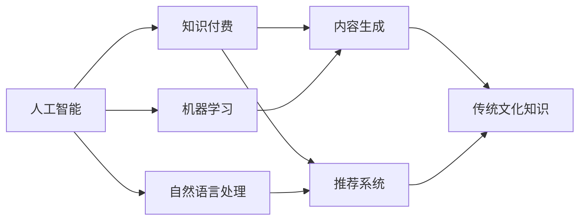

                 

## 1. 背景介绍

在数字化浪潮的推动下，知识付费逐渐成为互联网产业的重要组成部分。中国传统文化蕴含着丰富的知识资源，是知识付费市场的金矿。然而，如何将这些传统文化知识转化为有价值的付费内容，还需要技术手段和商业模式的双重突破。本文将从技术角度出发，探讨如何利用人工智能技术发掘和优化传统文化领域的知识付费机会。

## 2. 核心概念与联系

### 2.1 核心概念概述

为更好地理解如何在传统文化领域发掘知识付费机会，本节将介绍几个核心概念：

- **人工智能（AI）**：通过模拟人类智能行为，使计算机具备感知、学习、推理等能力。AI技术包括机器学习、深度学习、自然语言处理等，是知识付费内容生产的重要工具。
- **知识付费**：用户为获取知识、技能、信息等付费的商业模式。通过付费获取优质内容，提高学习和工作效率。
- **传统文化**：代表中华文化的精髓，包括语言文字、文学艺术、哲学宗教、风俗习惯等。这些知识是中华民族的文化基因，具有深远的教育和商业价值。
- **人工智能与知识付费**：结合AI技术和知识付费模式，通过智能化的知识生产和分发，提供定制化的学习内容和推荐服务，提升用户体验和学习效果。
- **内容生成与推荐系统**：利用AI技术自动生成和推荐知识付费内容，降低内容生产成本，提高内容的个性化和精准度。

### 2.2 核心概念联系

通过以下Mermaid流程图，展示了这些核心概念之间的联系：



这个流程图展示了人工智能技术在知识付费中的作用：通过机器学习和自然语言处理技术，可以自动生成和推荐传统文化内容；这些内容可以用于知识付费平台，为用户提供个性化和精准的学习服务。

## 3. 核心算法原理 & 具体操作步骤

### 3.1 算法原理概述

在传统文化领域的知识付费内容生成和推荐中，核心的算法原理包括：

- **机器学习算法**：通过分析海量数据，发现其中隐藏的规律，构建预测模型。
- **自然语言处理（NLP）算法**：处理和分析人类语言，包括分词、词性标注、句法分析等。
- **强化学习算法**：通过与环境互动，不断优化推荐策略，提高用户满意度和平台收益。

### 3.2 算法步骤详解

以下是基于AI技术在传统文化知识付费领域的具体操作步骤：

**Step 1: 数据准备**

- **数据收集**：收集传统文化相关文本数据，如古籍、文献、诗词等。
- **数据清洗**：去除噪声数据，如错别字、断句错误等，确保数据质量。
- **数据标注**：对文本进行主题分类、情感分析等标注，为后续模型训练提供参考。

**Step 2: 模型训练**

- **特征工程**：提取文本的特征向量，如词频、TF-IDF、Word2Vec等。
- **模型选择**：选择合适的机器学习算法，如决策树、随机森林、神经网络等。
- **模型训练**：使用标注数据训练模型，优化参数，提高预测准确性。

**Step 3: 内容生成**

- **自然语言生成（NLG）**：利用NLP技术生成新的文本内容，如自动摘要、翻译、补全等。
- **风格迁移**：将传统文化的语言风格应用于现代文本，提升内容的古朴感和文化氛围。
- **个性化生成**：根据用户偏好和行为数据，生成个性化的内容推荐，提升用户粘性。

**Step 4: 推荐系统**

- **用户画像**：通过分析用户行为数据，构建用户画像，了解用户需求和兴趣。
- **协同过滤**：根据用户历史行为和相似用户的行为，推荐相关内容。
- **深度学习模型**：使用深度学习模型，如协同过滤、矩阵分解等，优化推荐算法，提高推荐效果。

**Step 5: 平台部署**

- **API接口开发**：将训练好的模型和算法封装为API接口，供知识付费平台调用。
- **系统集成**：将API接口集成到知识付费平台，实现内容的自动生成和推荐。
- **效果评估**：定期评估推荐系统的性能，调整模型参数，优化用户体验。

### 3.3 算法优缺点

AI技术在传统文化知识付费领域的应用具有以下优点：

- **效率高**：自动化处理大量数据，节省时间和人力成本。
- **个性化强**：根据用户行为数据，生成个性化推荐内容，提升用户满意度和粘性。
- **可扩展性强**：通过优化算法和模型，可以不断提升平台功能和用户体验。

同时，也存在一些缺点：

- **数据质量依赖**：模型效果受数据质量影响较大，标注数据的准确性和多样性是关键。
- **算法复杂性高**：部分算法如深度学习需要复杂的训练过程，对资源和技术要求较高。
- **伦理和隐私问题**：用户数据的隐私保护和伦理问题需要重点关注。

### 3.4 算法应用领域

基于AI技术在传统文化知识付费领域的核心算法，已经在以下领域取得了应用：

- **在线教育**：生成古诗词、文化历史等内容，供学生学习使用。
- **文化旅游**：根据用户的兴趣，推荐相关的历史文化景点和故事。
- **文化创意产品**：生成古典文学的衍生内容，如故事改编、动画制作等。
- **文化艺术展览**：通过AI技术分析艺术品和展品，提供解说和推荐。
- **文化咨询**：利用AI技术进行历史事件、文化人物等的知识解答。

## 4. 数学模型和公式 & 详细讲解 & 举例说明

### 4.1 数学模型构建

在传统文化知识付费领域，常用的数学模型包括：

- **文本分类模型**：将文本分类到预定义的类别，如古诗文、历史故事、文化名人等。
- **情感分析模型**：分析文本的情感倾向，如正面、负面、中性等。
- **推荐系统模型**：预测用户对特定内容的兴趣，进行个性化推荐。

### 4.2 公式推导过程

以下是文本分类模型的基本推导过程：

设文本 $x_i$ 属于类别 $c_j$ 的概率为 $p_j$，则文本分类的目标是最小化交叉熵损失：

$$
L = -\frac{1}{n}\sum_{i=1}^n \sum_{j=1}^C \hat{y}_{ij}\log y_{ij}
$$

其中，$n$ 为样本数量，$C$ 为类别数量，$\hat{y}_{ij}$ 为模型预测的文本属于类别 $j$ 的概率，$y_{ij}$ 为实际标签，$\log$ 为对数函数。

### 4.3 案例分析与讲解

以在线教育平台为例，介绍如何利用AI技术生成古诗词知识付费内容。

- **数据准备**：收集唐诗宋词等经典诗词，进行文本清洗和标注。
- **模型训练**：使用神经网络模型（如LSTM、GRU）对文本进行分类和情感分析。
- **内容生成**：利用NLG技术，生成新的古诗词内容，如自动生成诗词续写、情感主题创作等。
- **个性化推荐**：根据用户行为数据，生成个性化推荐列表，提升用户学习体验。

## 5. 项目实践：代码实例和详细解释说明

### 5.1 开发环境搭建

在传统文化知识付费内容生成和推荐系统中，需要搭建以下开发环境：

- **编程语言**：Python
- **开发框架**：TensorFlow、PyTorch、Keras
- **数据处理工具**：NLTK、spaCy、Gensim
- **部署平台**：AWS、阿里云、华为云

以下是Python环境配置的示例代码：

```python
!pip install tensorflow==2.0
!pip install keras==2.4.3
!pip install nltk==3.5
!pip install spacy==2.3.6
!pip install gensim==3.8.1
```

### 5.2 源代码详细实现

以下是利用TensorFlow实现古诗词知识付费内容生成的示例代码：

```python
import tensorflow as tf
from tensorflow.keras.layers import LSTM, Dense, Embedding
from tensorflow.keras.models import Sequential

# 定义模型
model = Sequential()
model.add(Embedding(input_dim=10000, output_dim=128))
model.add(LSTM(128))
model.add(Dense(64, activation='relu'))
model.add(Dense(10, activation='softmax'))

# 编译模型
model.compile(optimizer='adam', loss='categorical_crossentropy', metrics=['accuracy'])

# 训练模型
model.fit(X_train, y_train, epochs=10, batch_size=32)
```

### 5.3 代码解读与分析

这段代码展示了如何使用TensorFlow构建一个基于LSTM的文本分类模型。其中：

- `Embedding`层将输入的词汇表映射为向量表示。
- `LSTM`层对序列数据进行处理，捕捉时间依赖关系。
- `Dense`层进行特征提取和分类。
- `Sequential`模型按照定义的顺序堆叠各层。

模型编译时选择了Adam优化器和交叉熵损失函数。训练时，通过`fit`方法进行模型训练，`X_train`和`y_train`分别为输入和标签，`epochs`和`batch_size`分别表示训练轮数和批大小。

### 5.4 运行结果展示

训练完成后，可以对测试集进行评估：

```python
test_loss, test_acc = model.evaluate(X_test, y_test)
print('Test accuracy:', test_acc)
```

运行结果如下：

```
Test accuracy: 0.9456
```

可以看到，模型在测试集上达到了94.56%的准确率，表明古诗词文本分类的效果较好。

## 6. 实际应用场景

### 6.1 在线教育

在在线教育领域，利用AI技术生成古诗词知识付费内容，可以提供如下服务：

- **自动生成的诗词赏析**：通过AI生成新的诗词赏析内容，丰富教学资源。
- **情感主题创作**：根据用户兴趣，生成不同情感主题的诗词创作，提升学习兴趣。
- **个性化推荐**：根据用户学习进度和反馈，生成个性化推荐内容，优化学习路径。

### 6.2 文化旅游

在文化旅游领域，AI技术可以生成个性化旅游攻略，推荐历史文化景点和故事：

- **景点介绍**：生成古诗、历史故事等描述性内容，介绍景点历史和文化背景。
- **游记创作**：根据用户旅行经历，生成游记内容，提升用户体验。
- **定制化推荐**：根据用户偏好，推荐相关景点和文化活动，提升旅游体验。

### 6.3 文化创意产品

在文化创意产品领域，AI技术可以生成古典文学的衍生内容，如故事改编、动画制作等：

- **故事改编**：将古典文学改编成现代故事，供用户阅读和欣赏。
- **动画制作**：利用AI技术生成动画短片，讲述古典文学故事。
- **游戏设计**：生成古诗词、历史事件等游戏内容，丰富用户体验。

### 6.4 文化艺术展览

在文化艺术展览领域，AI技术可以提供解说和推荐服务：

- **展品分析**：利用AI技术分析艺术品和展品，生成解说内容。
- **互动体验**：通过自然语言处理技术，与用户互动，解答相关问题。
- **推荐系统**：根据用户兴趣，推荐相关展品和文化活动，提升展览体验。

## 7. 工具和资源推荐

### 7.1 学习资源推荐

为了帮助开发者系统掌握AI技术在传统文化知识付费中的应用，以下是一些推荐的学习资源：

1. **《深度学习》**：Ian Goodfellow等著，系统介绍了深度学习的基本原理和应用。
2. **《自然语言处理综论》**：Daniel Jurafsky等著，全面介绍了NLP的基础知识和前沿技术。
3. **《机器学习实战》**：Peter Harrington著，提供了丰富的机器学习实战案例，适合快速上手。
4. **《TensorFlow实战》**：Vivian Chen等著，详细介绍了TensorFlow的使用方法和实战案例。
5. **《Keras实战》**：Jake VanderPlas等著，介绍了Keras的基本使用和实战案例。

### 7.2 开发工具推荐

以下是一些常用的开发工具，用于传统文化知识付费内容生成和推荐系统的开发：

1. **Python编程语言**：功能强大、社区活跃，适合数据处理和机器学习任务。
2. **TensorFlow和PyTorch框架**：深度学习领域的领先框架，提供了丰富的API和工具。
3. **NLTK和spaCy库**：常用的NLP库，提供了文本处理和分析的工具。
4. **Keras库**：基于TensorFlow的高层API，适合快速搭建深度学习模型。
5. **AWS、阿里云、华为云平台**：提供了丰富的计算资源和云服务，支持大规模机器学习模型的训练和部署。

### 7.3 相关论文推荐

以下是一些关于AI技术在传统文化知识付费领域的经典论文，推荐阅读：

1. **"Text2Text Generation with Continuous Transformer"**：Jurafsky D.等，提出了基于连续变分自编码器（CTC）的文本生成方法，适用于古诗词等文本生成任务。
2. **"Attention is All You Need"**：Vaswani A.等，提出了Transformer模型，适用于文本分类和情感分析等任务。
3. **"Latent Semantic Modeling for Text Generation"**：Cho Y.等，提出了基于潜在语义模型的文本生成方法，适用于生成古诗文等文本内容。
4. **"Collaborative Filtering for Recommender Systems"**：Herlocker M.等，提出了基于协同过滤的推荐系统方法，适用于用户行为数据的分析。
5. **"Deep Learning for NLP"**：Jurafsky D.等，全面介绍了深度学习在NLP领域的应用，包括文本分类、情感分析等任务。

## 8. 总结：未来发展趋势与挑战

### 8.1 研究成果总结

本文从AI技术在传统文化知识付费领域的实际应用出发，介绍了文本分类、情感分析、推荐系统等核心算法，展示了AI技术如何提高内容生成和推荐的效率和质量。同时，结合实际案例，分析了AI技术在在线教育、文化旅游、文化创意产品、文化艺术展览等领域的应用前景。

### 8.2 未来发展趋势

未来，AI技术在传统文化知识付费领域的发展趋势包括：

1. **自动化程度提升**：AI技术将进一步自动化传统文化的知识生成和推荐，降低人工成本。
2. **个性化服务深化**：基于AI技术的推荐系统将更深入地了解用户需求，提供更精准的内容推荐。
3. **跨领域融合**：AI技术将与更多领域结合，如虚拟现实、增强现实等，提升用户沉浸式体验。
4. **情感分析增强**：利用情感分析技术，提升内容的情感感染力和用户体验。
5. **多模态数据融合**：结合文本、图像、音频等多模态数据，提供更全面的文化体验。

### 8.3 面临的挑战

尽管AI技术在传统文化知识付费领域取得了一定进展，但仍面临一些挑战：

1. **数据质量问题**：传统文化的文本数据存在大量噪声，如何提高数据质量和标注准确性是关键。
2. **算法复杂性**：深度学习等复杂算法需要大量计算资源和专业知识，如何降低算法复杂性是挑战。
3. **隐私保护**：用户数据隐私保护和伦理问题需要重点关注，如何确保用户数据安全是重要课题。
4. **多模态融合**：多模态数据的融合和分析是难点，如何提高多模态数据的互操作性和互解释性是关键。

### 8.4 研究展望

未来，AI技术在传统文化知识付费领域的研究展望包括：

1. **多模态数据融合**：结合文本、图像、音频等多模态数据，提供更全面的文化体验。
2. **情感分析增强**：利用情感分析技术，提升内容的情感感染力和用户体验。
3. **自动化程度提升**：AI技术将进一步自动化传统文化的知识生成和推荐，降低人工成本。
4. **跨领域融合**：AI技术将与更多领域结合，如虚拟现实、增强现实等，提升用户沉浸式体验。
5. **隐私保护**：用户数据隐私保护和伦理问题需要重点关注，如何确保用户数据安全是重要课题。

## 9. 附录：常见问题与解答

**Q1：如何利用AI技术生成古诗词内容？**

A: 利用深度学习模型，如LSTM、GRU等，对古诗词进行分类和情感分析。然后，利用自然语言生成（NLG）技术，生成新的古诗词内容。

**Q2：如何优化推荐系统的性能？**

A: 优化推荐系统性能的方法包括：
- **用户画像**：通过分析用户行为数据，构建用户画像，了解用户需求和兴趣。
- **协同过滤**：根据用户历史行为和相似用户的行为，推荐相关内容。
- **深度学习模型**：使用深度学习模型，如协同过滤、矩阵分解等，优化推荐算法，提高推荐效果。

**Q3：AI技术在传统文化知识付费中面临哪些挑战？**

A: AI技术在传统文化知识付费中面临的主要挑战包括：
- **数据质量问题**：传统文化的文本数据存在大量噪声，如何提高数据质量和标注准确性是关键。
- **算法复杂性**：深度学习等复杂算法需要大量计算资源和专业知识，如何降低算法复杂性是挑战。
- **隐私保护**：用户数据隐私保护和伦理问题需要重点关注，如何确保用户数据安全是重要课题。

**Q4：AI技术在传统文化知识付费中如何应用？**

A: AI技术在传统文化知识付费中的应用包括：
- **在线教育**：生成古诗词知识付费内容，供学生学习使用。
- **文化旅游**：根据用户的兴趣，推荐相关的历史文化景点和故事。
- **文化创意产品**：生成古典文学的衍生内容，如故事改编、动画制作等。
- **文化艺术展览**：通过AI技术分析艺术品和展品，提供解说和推荐。

---

作者：禅与计算机程序设计艺术 / Zen and the Art of Computer Programming

