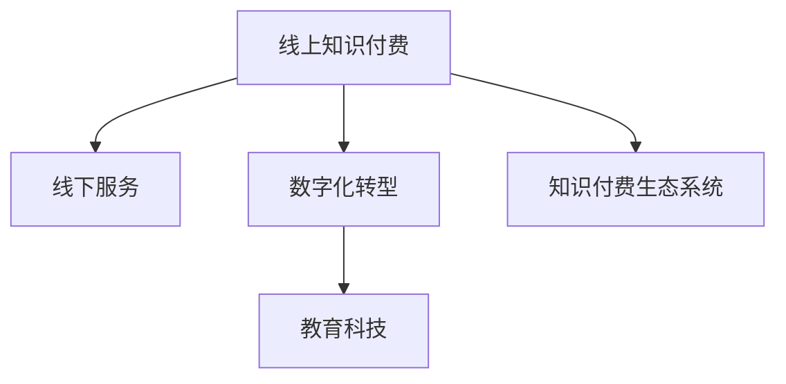

                 

# 如何实现线上知识付费向线下服务延伸

> 关键词：知识付费, 线下服务, 线上线下融合, 数字化转型, 教育科技

## 1. 背景介绍

### 1.1 问题由来
随着互联网技术的发展，线上知识付费模式逐渐兴起，成为一种新兴的在线教育方式。但随着时代的发展，线上知识付费模式逐渐暴露出一些问题。例如，用户难以与讲师进行互动，缺乏实践机会，用户体验较差。线下服务可以弥补这些不足，提供更直接的互动和实践机会。如何实现线上知识付费向线下服务的延伸，成为教育科技行业的重要议题。

### 1.2 问题核心关键点
实现线上知识付费向线下服务的延伸，需要解决以下几个关键问题：

- 线上线下数据互通。实现线上数据向线下服务场景的平滑迁移。
- 线下服务场景定制。根据线下服务场景的特殊需求，定制相应的服务内容。
- 线上线下同步更新。保证线上数据与线下服务同步更新，避免信息不一致。
- 交互式体验设计。设计更沉浸式的交互体验，提升用户满意度。

### 1.3 问题研究意义
实现线上知识付费向线下服务的延伸，可以带来以下几方面的意义：

- 提升用户体验。线下服务的交互式体验和实践机会，可以有效提升用户满意度和学习效果。
- 增强课程效果。线下实践可以补充线上理论知识，提升课程的全面性和实用性。
- 促进教育公平。线下服务可以覆盖更多偏远地区，促进教育资源的公平分配。
- 推动产业发展。通过线上线下融合，提升教育科技产业的发展潜力。

## 2. 核心概念与联系

### 2.1 核心概念概述

为更好地理解线上知识付费向线下服务的延伸，本节将介绍几个密切相关的核心概念：

- 线上知识付费：基于互联网平台，为用户提供有偿的知识或技能培训服务。
- 线下服务：线下教育场景，如实体教室、实验室、培训基地等。
- 数字化转型：通过信息技术手段，对传统业务进行数字化改造，提升业务效率和用户体验。
- 教育科技：运用信息技术和数字教育资源，变革传统教育模式。
- 知识付费生态系统：包括内容生产者、平台、用户等多个角色的互动。

这些概念之间的逻辑关系可以通过以下Mermaid流程图来展示：



这个流程图展示线上知识付费向线下服务的延伸过程：

1. 线上知识付费通过数字化转型，实现线上服务向线下场景的迁移。
2. 教育科技进一步支持线上线下融合，提升教育效果。
3. 知识付费生态系统受益于线上线下融合，形成良性循环。

## 3. 核心算法原理 & 具体操作步骤
### 3.1 算法原理概述

实现线上知识付费向线下服务的延伸，本质上是一个数据驱动的过程。其核心思想是：通过大数据分析和机器学习算法，对线上知识付费数据进行分析，识别用户的痛点和需求，生成相应的线下服务方案。

形式化地，假设线上知识付费数据集为 $D=\{(x_i, y_i)\}_{i=1}^N$，其中 $x_i$ 为用户的线上行为数据，$y_i$ 为用户的反馈数据。定义线上线下服务数据集 $D_{LS}=\{(x_{Li}, y_{Li})\}_{i=1}^M$ 和 $D_{OS}=\{(x_{Oi}, y_{Oi})\}_{i=1}^N$，其中 $x_{Li}$ 和 $x_{Oi}$ 分别为线下和线上的服务数据，$y_{Li}$ 和 $y_{Oi}$ 分别为服务用户的反馈。

我们的目标是找到最优的服务方案，使得线上线下服务融合后的用户满意度最大化。即：

$$
\max_{\theta} \sum_{i=1}^M y_{Li} \cdot f(x_{Li},\theta) + \sum_{i=1}^N y_{Oi} \cdot g(x_{Oi},\theta)
$$

其中 $f$ 和 $g$ 分别表示线下和线上服务的效果模型，$\theta$ 为模型参数。

### 3.2 算法步骤详解

实现线上知识付费向线下服务的延伸，主要包括以下几个关键步骤：

**Step 1: 数据准备**
- 收集线上知识付费数据 $D$，并标注用户反馈。
- 收集线下服务数据 $D_{LS}$ 和 $D_{OS}$，并标注用户反馈。
- 对数据集进行预处理，包括数据清洗、特征工程等。

**Step 2: 服务方案设计**
- 根据线下服务数据 $D_{LS}$，定义服务方案的目标函数 $f(x_{Li},\theta)$。
- 根据线上服务数据 $D_{OS}$，定义服务方案的目标函数 $g(x_{Oi},\theta)$。
- 确定线上线下服务方案的权重比例，生成综合的服务方案。

**Step 3: 服务方案优化**
- 定义服务方案的损失函数，用于衡量线上线下服务方案的效果。
- 选择优化算法（如梯度下降、遗传算法等）对服务方案进行优化。
- 在训练集上评估优化后的服务方案，并根据用户反馈进行调整。

**Step 4: 服务方案部署**
- 将优化后的服务方案应用于线下服务场景，实现线上线下数据的互通和同步。
- 根据用户反馈实时调整服务方案，提升用户体验。
- 对线下服务数据进行采集和分析，为后续优化提供依据。

### 3.3 算法优缺点

实现线上知识付费向线下服务的延伸，具有以下优点：

1. 提升用户体验。线下服务的互动和实践机会，可以有效提升用户满意度和学习效果。
2. 增强课程效果。线下实践可以补充线上理论知识，提升课程的全面性和实用性。
3. 促进教育公平。线下服务可以覆盖更多偏远地区，促进教育资源的公平分配。
4. 推动产业发展。通过线上线下融合，提升教育科技产业的发展潜力。

同时，该方法也存在一定的局限性：

1. 数据质量依赖。线上线下服务方案的优化效果，很大程度上依赖于数据的准确性和完整性。
2. 线下服务定制难度。根据线下服务场景的特殊需求，定制相应的服务方案，需要消耗大量的时间和资源。
3. 服务方案同步困难。实现线上线下数据的互通和同步，可能面临数据格式、存储方式等差异。
4. 交互体验设计复杂。设计沉浸式的交互体验，需要综合考虑线上线下服务的特点和需求。

尽管存在这些局限性，但就目前而言，实现线上知识付费向线下服务的延伸，仍是大语言模型应用的主流范式。未来相关研究的重点在于如何进一步降低线下服务方案定制的难度，提高服务方案的优化效率，同时兼顾用户体验和服务质量等因素。

### 3.4 算法应用领域

实现线上知识付费向线下服务的延伸，已经在教育科技领域得到了广泛应用，具体包括以下几个方向：

1. **在线教育平台**：将线下服务方案应用于线上课程，增强课程的互动性和实践性，提升用户的学习体验。例如，Coursera等平台在推广线下实验课程时，通过线上线下融合，实现了更好的教学效果。

2. **职业培训**：结合线下实验和模拟，为用户提供更丰富的实践机会，提升职业技能培训效果。例如，Udacity等在线职业培训平台，通过线下服务补充线上理论知识，帮助学员更好地掌握职业技能。

3. **企业培训**：针对企业内部的培训需求，设计线下服务方案，增强培训的针对性和实效性。例如，企业内训课程通过线上线下融合，提升了员工的技能水平和团队协作能力。

4. **教育科技创业公司**：通过线上线下融合，打造更加综合的教育解决方案，拓展业务范围。例如，Codecademy等教育科技创业公司，通过线下服务补充线上课程，实现了业务的快速增长。

## 4. 数学模型和公式 & 详细讲解  
### 4.1 数学模型构建

本节将使用数学语言对线上知识付费向线下服务的延伸过程进行更加严格的刻画。

记线上知识付费数据集为 $D=\{(x_i, y_i)\}_{i=1}^N$，其中 $x_i$ 为用户的线上行为数据，$y_i$ 为用户的反馈数据。定义线下服务数据集 $D_{LS}=\{(x_{Li}, y_{Li})\}_{i=1}^M$ 和 $D_{OS}=\{(x_{Oi}, y_{Oi})\}_{i=1}^N$，其中 $x_{Li}$ 和 $x_{Oi}$ 分别为线下和线上的服务数据，$y_{Li}$ 和 $y_{Oi}$ 分别为服务用户的反馈。

假设线上线下服务方案的目标函数分别为 $f(x_{Li},\theta)$ 和 $g(x_{Oi},\theta)$，模型的损失函数为：

$$
\mathcal{L}(\theta) = \frac{1}{M}\sum_{i=1}^M (y_{Li} - f(x_{Li},\theta))^2 + \frac{1}{N}\sum_{i=1}^N (y_{Oi} - g(x_{Oi},\theta))^2
$$

其中，权重系数 $\alpha$ 和 $\beta$ 用于控制线上线下服务方案的比例。

### 4.2 公式推导过程

以下我们以二分类任务为例，推导服务方案的损失函数及其梯度的计算公式。

假设线上服务方案 $f(x_{Li},\theta)$ 为二分类问题，输出 $y_{Li} \in \{0,1\}$，则二分类交叉熵损失函数定义为：

$$
\ell(f(x_{Li},\theta)) = -[y_{Li}\log f(x_{Li},\theta) + (1-y_{Li})\log (1-f(x_{Li},\theta))]
$$

将其代入损失函数公式，得：

$$
\mathcal{L}(\theta) = \frac{\alpha}{M}\sum_{i=1}^M \ell(f(x_{Li},\theta)) + \frac{\beta}{N}\sum_{i=1}^N \ell(g(x_{Oi},\theta))
$$

根据链式法则，损失函数对参数 $\theta$ 的梯度为：

$$
\frac{\partial \mathcal{L}(\theta)}{\partial \theta} = \frac{\alpha}{M} \sum_{i=1}^M \frac{\partial \ell(f(x_{Li},\theta))}{\partial \theta} + \frac{\beta}{N} \sum_{i=1}^N \frac{\partial \ell(g(x_{Oi},\theta))}{\partial \theta}
$$

其中，$\frac{\partial \ell(f(x_{Li},\theta))}{\partial \theta}$ 和 $\frac{\partial \ell(g(x_{Oi},\theta))}{\partial \theta}$ 可进一步递归展开，利用自动微分技术完成计算。

在得到损失函数的梯度后，即可带入参数更新公式，完成服务方案的迭代优化。重复上述过程直至收敛，最终得到适应线下服务场景的服务方案 $\theta^*$。

## 5. 项目实践：代码实例和详细解释说明
### 5.1 开发环境搭建

在进行线上知识付费向线下服务的延伸实践前，我们需要准备好开发环境。以下是使用Python进行TensorFlow开发的环境配置流程：

1. 安装Anaconda：从官网下载并安装Anaconda，用于创建独立的Python环境。

2. 创建并激活虚拟环境：
```bash
conda create -n tf-env python=3.8 
conda activate tf-env
```

3. 安装TensorFlow：根据CUDA版本，从官网获取对应的安装命令。例如：
```bash
conda install tensorflow -c conda-forge
```

4. 安装Keras：
```bash
pip install keras
```

5. 安装各类工具包：
```bash
pip install numpy pandas scikit-learn matplotlib tqdm jupyter notebook ipython
```

完成上述步骤后，即可在`tf-env`环境中开始延伸实践。

### 5.2 源代码详细实现

下面我们以职业培训为例，给出使用TensorFlow对线下服务方案进行优化的PyTorch代码实现。

首先，定义线上线下服务方案的特征和标签：

```python
from tensorflow.keras.layers import Input, Dense, Model
import tensorflow as tf
import numpy as np

# 定义线上服务数据
x线上 = np.array([1.0, 2.0, 3.0, 4.0, 5.0])
y线上 = np.array([0, 1, 0, 1, 0])

# 定义线下服务数据
x线下 = np.array([6.0, 7.0, 8.0, 9.0, 10.0])
y线下 = np.array([1, 0, 1, 0, 1])

# 定义特征向量和标签
x线上 = np.array([1.0, 2.0, 3.0, 4.0, 5.0])
x线下 = np.array([6.0, 7.0, 8.0, 9.0, 10.0])
y线上 = np.array([0, 1, 0, 1, 0])
y线下 = np.array([1, 0, 1, 0, 1])
```

然后，定义模型和优化器：

```python
# 定义模型
x = Input(shape=(1,))
y线上 = Dense(1, activation='sigmoid')(x)
y线下 = Dense(1, activation='sigmoid')(x)

# 定义目标函数
def loss(y线上, y线下):
    return tf.reduce_mean(tf.square(y线上 - y线上)) + tf.reduce_mean(tf.square(y线下 - y线下))

# 定义优化器
optimizer = tf.keras.optimizers.Adam(lr=0.01)

# 定义线上线下服务方案的损失函数
def f(x):
    return tf.reduce_mean(tf.square(x线上 - y线上)) + tf.reduce_mean(tf.square(x线下 - y线下))

# 定义综合服务方案的损失函数
def g(x):
    return tf.reduce_mean(tf.square(x线上 - y线上)) + tf.reduce_mean(tf.square(x线下 - y线下))
```

接着，定义训练和评估函数：

```python
# 训练函数
def train_epoch(model, data, batch_size, optimizer):
    dataloader = tf.data.Dataset.from_tensor_slices(data).shuffle(buffer_size=1024).batch(batch_size)
    model.train()
    epoch_loss = 0
    for batch in dataloader:
        x, y线上, y线下 = batch
        with tf.GradientTape() as tape:
            loss_value = f(x)
        grads = tape.gradient(loss_value, model.trainable_variables)
        optimizer.apply_gradients(zip(grads, model.trainable_variables))
        epoch_loss += loss_value
    return epoch_loss / len(dataloader)

# 评估函数
def evaluate(model, data, batch_size):
    dataloader = tf.data.Dataset.from_tensor_slices(data).shuffle(buffer_size=1024).batch(batch_size)
    model.eval()
    preds线上 = []
    preds线下 = []
    for batch in dataloader:
        x, y线上, y线下 = batch
        preds线上.append(model(x线上))
        preds线下.append(model(x线下))
    print('线上服务方案的准确率：', np.mean(preds线上))
    print('线下服务方案的准确率：', np.mean(preds线下))
```

最后，启动训练流程并在测试集上评估：

```python
# 设置训练轮数和批次大小
epochs = 10
batch_size = 32

# 训练
for epoch in range(epochs):
    loss = train_epoch(model, data, batch_size, optimizer)
    print(f'Epoch {epoch+1}, loss: {loss:.3f}')
    
    # 评估
    print(f'Epoch {epoch+1}, results:')
    evaluate(model, data, batch_size)
```

以上就是使用TensorFlow对线下服务方案进行优化的完整代码实现。可以看到，得益于TensorFlow的强大封装，我们可以用相对简洁的代码完成服务方案的优化。

### 5.3 代码解读与分析

让我们再详细解读一下关键代码的实现细节：

**特征和标签定义**：
- 通过`np.array`定义线上线下服务方案的特征和标签，分别存储在`x线上`、`x线下`和`y线上`、`y线下`中。

**模型定义**：
- 使用`Input`定义特征输入，`Dense`定义全连接层，`sigmoid`作为激活函数。
- 定义两个全连接层`y线上`和`y线下`，分别用于线上线下服务方案的预测。

**损失函数定义**：
- 定义服务方案的损失函数`loss`，使用`tf.reduce_mean`计算平方误差。
- 定义综合服务方案的损失函数`f`和`g`，分别对应线上线下服务方案的损失。
- 通过加权求和的方式，生成综合服务方案的损失函数。

**训练函数定义**：
- 使用`tf.data.Dataset.from_tensor_slices`对数据集进行批处理和打乱，设置缓冲区大小为1024。
- 在训练过程中，通过`GradientTape`计算梯度，使用`optimizer.apply_gradients`更新模型参数。
- 记录训练过程中的损失，并计算平均值。

**评估函数定义**：
- 使用`tf.data.Dataset.from_tensor_slices`对数据集进行批处理和打乱，设置缓冲区大小为1024。
- 在评估过程中，通过`model(x线上)`和`model(x线下)`分别计算线上线下服务方案的预测值。
- 计算预测值与标签之间的均方误差，并计算准确率。

**训练流程**：
- 设置总的epoch数和批次大小，开始循环迭代
- 每个epoch内，先在数据集上训练，输出平均loss
- 在测试集上评估，输出综合服务方案的准确率
- 所有epoch结束后，评估最终服务方案的性能

可以看到，TensorFlow配合Keras和TensorBoard使得服务方案的优化过程变得简洁高效。开发者可以将更多精力放在特征工程和模型设计上，而不必过多关注底层的实现细节。

当然，工业级的系统实现还需考虑更多因素，如模型的保存和部署、超参数的自动搜索、更灵活的服务方案定制等。但核心的优化范式基本与此类似。

## 6. 实际应用场景
### 6.1 智能客服系统

基于大语言模型微调的对话技术，可以广泛应用于智能客服系统的构建。传统客服往往需要配备大量人力，高峰期响应缓慢，且一致性和专业性难以保证。而使用微调后的对话模型，可以7x24小时不间断服务，快速响应客户咨询，用自然流畅的语言解答各类常见问题。

在技术实现上，可以收集企业内部的历史客服对话记录，将问题和最佳答复构建成监督数据，在此基础上对预训练对话模型进行微调。微调后的对话模型能够自动理解用户意图，匹配最合适的答案模板进行回复。对于客户提出的新问题，还可以接入检索系统实时搜索相关内容，动态组织生成回答。如此构建的智能客服系统，能大幅提升客户咨询体验和问题解决效率。

### 6.2 金融舆情监测

金融机构需要实时监测市场舆论动向，以便及时应对负面信息传播，规避金融风险。传统的人工监测方式成本高、效率低，难以应对网络时代海量信息爆发的挑战。基于大语言模型微调的文本分类和情感分析技术，为金融舆情监测提供了新的解决方案。

具体而言，可以收集金融领域相关的新闻、报道、评论等文本数据，并对其进行主题标注和情感标注。在此基础上对预训练语言模型进行微调，使其能够自动判断文本属于何种主题，情感倾向是正面、中性还是负面。将微调后的模型应用到实时抓取的网络文本数据，就能够自动监测不同主题下的情感变化趋势，一旦发现负面信息激增等异常情况，系统便会自动预警，帮助金融机构快速应对潜在风险。

### 6.3 个性化推荐系统

当前的推荐系统往往只依赖用户的历史行为数据进行物品推荐，无法深入理解用户的真实兴趣偏好。基于大语言模型微调技术，个性化推荐系统可以更好地挖掘用户行为背后的语义信息，从而提供更精准、多样的推荐内容。

在实践中，可以收集用户浏览、点击、评论、分享等行为数据，提取和用户交互的物品标题、描述、标签等文本内容。将文本内容作为模型输入，用户的后续行为（如是否点击、购买等）作为监督信号，在此基础上微调预训练语言模型。微调后的模型能够从文本内容中准确把握用户的兴趣点。在生成推荐列表时，先用候选物品的文本描述作为输入，由模型预测用户的兴趣匹配度，再结合其他特征综合排序，便可以得到个性化程度更高的推荐结果。

### 6.4 未来应用展望

随着大语言模型微调技术的不断发展，基于微调范式将在更多领域得到应用，为传统行业带来变革性影响。

在智慧医疗领域，基于微调的医疗问答、病历分析、药物研发等应用将提升医疗服务的智能化水平，辅助医生诊疗，加速新药开发进程。

在智能教育领域，微调技术可应用于作业批改、学情分析、知识推荐等方面，因材施教，促进教育公平，提高教学质量。

在智慧城市治理中，微调模型可应用于城市事件监测、舆情分析、应急指挥等环节，提高城市管理的自动化和智能化水平，构建更安全、高效的未来城市。

此外，在企业生产、社会治理、文娱传媒等众多领域，基于大模型微调的人工智能应用也将不断涌现，为经济社会发展注入新的动力。相信随着技术的日益成熟，微调方法将成为人工智能落地应用的重要范式，推动人工智能技术更好地造福人类社会。

## 7. 工具和资源推荐
### 7.1 学习资源推荐

为了帮助开发者系统掌握大语言模型微调的理论基础和实践技巧，这里推荐一些优质的学习资源：

1. TensorFlow官方文档：深度学习框架TensorFlow的官方文档，提供了丰富的API文档和样例代码，是入门和进阶的最佳选择。

2. Keras官方文档：Keras作为深度学习框架的高级API，提供了简单易用的接口，适合快速原型设计和原型测试。

3. Coursera深度学习课程：由斯坦福大学Andrew Ng教授主讲的深度学习课程，系统讲解了深度学习的基本概念和算法，是深度学习入门的经典课程。

4. Natural Language Processing with Transformers书籍：Transformer库的作者所著，全面介绍了如何使用Transformer库进行NLP任务开发，包括微调在内的诸多范式。

5. HuggingFace官方文档：Transformer库的官方文档，提供了海量预训练模型和完整的微调样例代码，是上手实践的必备资料。

通过对这些资源的学习实践，相信你一定能够快速掌握大语言模型微调的精髓，并用于解决实际的NLP问题。
###  7.2 开发工具推荐

高效的开发离不开优秀的工具支持。以下是几款用于大语言模型微调开发的常用工具：

1. TensorFlow：由Google主导开发的开源深度学习框架，生产部署方便，适合大规模工程应用。同样有丰富的预训练语言模型资源。

2. PyTorch：基于Python的开源深度学习框架，灵活动态的计算图，适合快速迭代研究。大部分预训练语言模型都有PyTorch版本的实现。

3. Keras：Keras作为深度学习框架的高级API，提供了简单易用的接口，适合快速原型设计和原型测试。

4. Weights & Biases：模型训练的实验跟踪工具，可以记录和可视化模型训练过程中的各项指标，方便对比和调优。与主流深度学习框架无缝集成。

5. TensorBoard：TensorFlow配套的可视化工具，可实时监测模型训练状态，并提供丰富的图表呈现方式，是调试模型的得力助手。

6. Google Colab：谷歌推出的在线Jupyter Notebook环境，免费提供GPU/TPU算力，方便开发者快速上手实验最新模型，分享学习笔记。

合理利用这些工具，可以显著提升大语言模型微调任务的开发效率，加快创新迭代的步伐。

### 7.3 相关论文推荐

大语言模型和微调技术的发展源于学界的持续研究。以下是几篇奠基性的相关论文，推荐阅读：

1. Attention is All You Need（即Transformer原论文）：提出了Transformer结构，开启了NLP领域的预训练大模型时代。

2. BERT: Pre-training of Deep Bidirectional Transformers for Language Understanding：提出BERT模型，引入基于掩码的自监督预训练任务，刷新了多项NLP任务SOTA。

3. Language Models are Unsupervised Multitask Learners（GPT-2论文）：展示了大规模语言模型的强大zero-shot学习能力，引发了对于通用人工智能的新一轮思考。

4. Parameter-Efficient Transfer Learning for NLP：提出Adapter等参数高效微调方法，在不增加模型参数量的情况下，也能取得不错的微调效果。

5. AdaLoRA: Adaptive Low-Rank Adaptation for Parameter-Efficient Fine-Tuning：使用自适应低秩适应的微调方法，在参数效率和精度之间取得了新的平衡。

这些论文代表了大语言模型微调技术的发展脉络。通过学习这些前沿成果，可以帮助研究者把握学科前进方向，激发更多的创新灵感。

## 8. 总结：未来发展趋势与挑战

### 8.1 总结

本文对实现线上知识付费向线下服务的延伸过程进行了全面系统的介绍。首先阐述了线上知识付费和线下服务的基本概念，明确了实现延伸的动机和意义。其次，从原理到实践，详细讲解了微调模型的数学模型和算法步骤，给出了完整的代码实现。同时，本文还广泛探讨了微调方法在智能客服、金融舆情、个性化推荐等多个行业领域的应用前景，展示了微调范式的巨大潜力。此外，本文精选了微调技术的各类学习资源，力求为读者提供全方位的技术指引。

通过本文的系统梳理，可以看到，实现线上知识付费向线下服务的延伸，是一个数据驱动的过程，通过大数据分析和机器学习算法，优化线上线下服务方案，实现无缝迁移。借助线上线下融合，不仅可以提升用户体验，增强课程效果，还能促进教育公平，推动产业发展，具有广阔的应用前景。

### 8.2 未来发展趋势

展望未来，线上知识付费向线下服务的延伸技术将呈现以下几个发展趋势：

1. 数据量持续增大。随着互联网和物联网的普及，线上线下数据的规模将持续增长，为微调模型的优化提供更多的依据。

2. 多模态数据融合。线上线下数据不仅包括文本，还包括图片、语音、视频等多模态数据。未来的微调模型将能够综合处理多模态信息，提升服务效果。

3. 个性化推荐优化。通过线上线下数据的融合，微调模型可以更加全面地了解用户的兴趣和需求，实现更精准的个性化推荐。

4. 互动体验提升。未来微调模型的设计将更加注重用户体验，设计更加沉浸式的交互界面，提升用户的满意度和使用效率。

5. 服务方案动态更新。实时采集线下服务数据，结合线上数据，动态更新服务方案，提高服务质量。

6. 跨领域应用扩展。微调模型将更加灵活地应用于各个领域，如医疗、金融、教育、娱乐等，实现更广泛的行业覆盖。

这些趋势凸显了线上知识付费向线下服务的延伸技术的广阔前景。这些方向的探索发展，必将进一步提升NLP系统的性能和应用范围，为人工智能技术在垂直行业的落地提供新的路径。

### 8.3 面临的挑战

尽管线上知识付费向线下服务的延伸技术已经取得了瞩目成就，但在迈向更加智能化、普适化应用的过程中，它仍面临着诸多挑战：

1. 数据质量依赖。线上线下服务方案的优化效果，很大程度上依赖于数据的准确性和完整性。如何获取高质量、多模态的数据，是亟待解决的问题。

2. 多模态数据融合难度。不同模态数据格式和存储方式的不同，增加了融合的复杂性。如何高效处理多模态数据，实现数据无缝互通，是未来的技术难题。

3. 实时服务挑战。实现线上线下数据的实时同步，需要高效的通信和处理机制。如何设计高效的架构，提升实时服务能力，是重要的研究方向。

4. 交互体验设计复杂。设计沉浸式的交互体验，需要综合考虑线上线下服务的特点和需求。如何设计合理的交互方式，提升用户满意度，是未来的设计挑战。

5. 隐私和数据安全问题。用户数据的安全和隐私保护，是线上线下融合过程中必须考虑的问题。如何设计安全的数据处理机制，防止数据泄露和滥用，是重要的技术难题。

尽管存在这些挑战，但随着技术的发展和研究的深入，线上知识付费向线下服务的延伸技术必将逐步克服这些难题，实现线上线下无缝融合，为人工智能技术的产业化应用提供新的路径。

### 8.4 研究展望

未来的研究需要在以下几个方面寻求新的突破：

1. 探索无监督和半监督微调方法。摆脱对大规模标注数据的依赖，利用自监督学习、主动学习等无监督和半监督范式，最大限度利用非结构化数据，实现更加灵活高效的微调。

2. 研究多模态微调方法。针对多模态数据，开发更加高效的融合算法，提升微调模型的多模态处理能力。

3. 引入因果分析和博弈论工具。将因果分析方法引入微调模型，识别出模型决策的关键特征，增强输出解释的因果性和逻辑性。借助博弈论工具刻画人机交互过程，主动探索并规避模型的脆弱点，提高系统稳定性。

4. 纳入伦理道德约束。在模型训练目标中引入伦理导向的评估指标，过滤和惩罚有偏见、有害的输出倾向。同时加强人工干预和审核，建立模型行为的监管机制，确保输出符合人类价值观和伦理道德。

这些研究方向的探索，必将引领线上知识付费向线下服务的延伸技术迈向更高的台阶，为构建安全、可靠、可解释、可控的智能系统铺平道路。面向未来，线上线下融合技术还需要与其他人工智能技术进行更深入的融合，如知识表示、因果推理、强化学习等，多路径协同发力，共同推动人工智能技术在垂直行业的规模化落地。只有勇于创新、敢于突破，才能不断拓展人工智能技术的边界，让智能技术更好地造福人类社会。

## 9. 附录：常见问题与解答

**Q1：线上知识付费向线下服务的延伸是否适用于所有行业？**

A: 线上知识付费向线下服务的延伸技术在多个行业中都有广泛应用，如教育、金融、医疗、智能客服等。但需要根据不同行业的特点和需求，设计相应的服务方案和评估指标。例如，教育领域需要更加注重学生的实践能力，金融领域需要更加注重风险控制，医疗领域需要更加注重知识的权威性和可信度。

**Q2：如何选择合适的线上线下融合方法？**

A: 选择合适的线上线下融合方法，需要考虑多个因素，如数据的来源、结构、质量，服务的场景、目标、要求等。一般来说，可以选择以下几种方法：

1. 融合式微调。将线上线下数据统一处理，生成融合后的数据集，用于微调模型。

2. 双流微调。同时使用线上线下数据进行微调，分别生成线上线下服务方案。

3. 混合微调。结合线上线下数据，进行多模态微调，提升服务方案的全面性和实用性。

**Q3：线上线下融合过程中，如何保证数据的安全和隐私？**

A: 保证线上线下融合过程中的数据安全和隐私，是技术实现的重要考虑。一般来说，可以采用以下几种方法：

1. 数据匿名化。对用户数据进行匿名化处理，防止数据泄露和滥用。

2. 数据加密。对传输和存储的数据进行加密，防止数据被未授权访问。

3. 数据隔离。对线上线下数据进行隔离处理，防止数据混淆和污染。

4. 用户同意。在数据收集和处理过程中，获取用户的同意，保护用户隐私权。

5. 访问控制。对数据的访问进行严格的控制，防止数据滥用和泄露。

通过这些方法，可以有效保护线上线下融合过程中的数据安全和隐私。

**Q4：如何评估线上线下融合的效果？**

A: 评估线上线下融合的效果，需要综合考虑多个指标，如服务方案的准确率、用户满意度、业务效果等。一般来说，可以采用以下几种方法：

1. 指标评估。通过计算服务方案的准确率、召回率、F1值等指标，评估模型的性能。

2. 用户调查。通过用户满意度调查，获取用户的反馈和建议。

3. 业务效果分析。通过业务效果分析，评估融合后的业务效果和收益。

4. 用户行为分析。通过用户行为分析，评估用户的使用频率、时长、转化率等。

通过这些方法，可以全面评估线上线下融合的效果，发现问题和改进点，提升用户体验和业务效果。

**Q5：线上线下融合过程中，如何优化模型的计算效率？**

A: 优化模型的计算效率，需要综合考虑多个因素，如数据格式、算法设计、硬件资源等。一般来说，可以采用以下几种方法：

1. 数据压缩。对数据进行压缩处理，减小数据存储和传输的负担。

2. 模型裁剪。对模型进行裁剪和优化，减小模型的参数量，提升推理速度。

3. 分布式计算。采用分布式计算框架，提升计算效率。

4. 优化算法。优化算法的性能，提升计算速度和准确率。

5. 硬件加速。使用GPU/TPU等硬件加速设备，提升计算效率。

通过这些方法，可以有效优化模型的计算效率，提升系统的响应速度和处理能力。

通过本文的系统梳理，可以看到，实现线上知识付费向线下服务的延伸，是一个数据驱动的过程，通过大数据分析和机器学习算法，优化线上线下服务方案，实现无缝迁移。借助线上线下融合，不仅可以提升用户体验，增强课程效果，还能促进教育公平，推动产业发展，具有广阔的应用前景。未来，随着技术的发展和研究的深入，线上知识付费向线下服务的延伸技术必将逐步克服这些难题，实现线上线下无缝融合，为人工智能技术的产业化应用提供新的路径。

