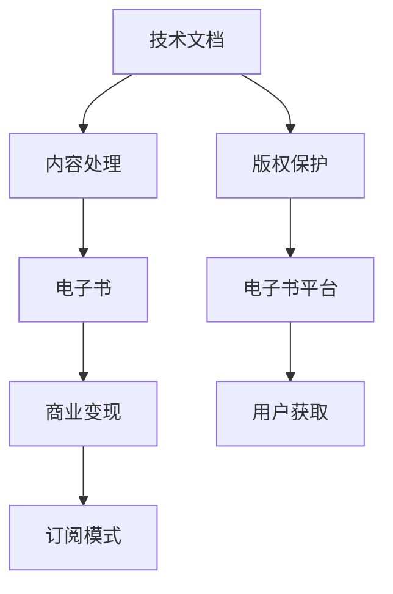

                 

# 如何将技术文档转化为付费电子书

## 1. 背景介绍

### 1.1 问题由来
随着互联网和数字内容的普及，技术文档已经成为了许多IT公司、开源社区和开发者共享知识和经验的宝贵资源。然而，这些技术文档往往缺乏有效的变现手段，不能带来直接的经济收益，且在传播过程中存在版权保护不足、信息传播不精准等问题。如何将这些技术文档转化为具有商业价值的电子书，不仅是技术实现的问题，更涉及内容分发、用户支付、版权保护等多方面的策略和手段。

### 1.2 问题核心关键点
本文聚焦于如何将技术文档转化为付费电子书，探讨从内容选择、数字化处理、商业变现到用户购买的全流程解决方案。将技术文档转化为付费电子书，需要解决以下几个关键问题：
1. **内容选择**：选择高质量、有价值的内容进行数字化和包装。
2. **内容处理**：对技术文档进行结构化、多媒体化处理，提高可读性和互动性。
3. **商业模式**：设计合理的价格体系、订阅模式和收益分配机制，吸引用户付费。
4. **销售渠道**：利用在线平台和传统渠道，最大化用户覆盖和销售效果。
5. **版权保护**：确保内容版权得到保护，防范盗版行为。
6. **用户获取**：通过精准营销和社群推广，吸引目标用户。

### 1.3 问题研究意义
将技术文档转化为付费电子书，对于提升技术文档的价值、促进知识变现、推动技术普及具有重要意义：

1. **内容增值**：高质量的电子书可以帮助读者更快掌握技术知识和技能，提高学习效率。
2. **内容市场化**：通过付费阅读和订阅模式，技术文档可以实现从知识共享到商业变现的转变。
3. **技术普及**：电子书便于传播和复制，有助于技术的广泛传播和普及。
4. **社区建设**：提供优质的电子书内容，可以增强社区凝聚力，吸引更多技术爱好者。
5. **商业模式创新**：电子书可以探索新的商业模式，如知识付费、订阅服务、广告等。
6. **版权保护**：电子书的版权保护相对容易，能够有效防范盗版，保护创作者权益。

## 2. 核心概念与联系

### 2.1 核心概念概述

为更好地理解如何将技术文档转化为付费电子书，本节将介绍几个密切相关的核心概念：

- **技术文档**：包含代码、架构设计、算法实现等技术内容的文档。是开发者、工程师分享知识、交流经验的重要形式。
- **电子书**：以电子形式存储和传输的图书，可以包含文字、图片、视频、代码等多种内容形式。
- **商业变现**：将产品、服务或知识转化为经济收益的过程。
- **订阅模式**：用户通过定期付费获取内容或服务的一种商业模式。
- **版权保护**：通过法律和技术手段，保护原创作品不受未经授权的使用。
- **电子书平台**：如Amazon Kindle、Apple Books等，提供电子书的分发和阅读服务。

这些核心概念之间的逻辑关系可以通过以下Mermaid流程图来展示：



这个流程图展示了大语言模型的核心概念及其之间的关系：

1. 技术文档通过内容处理，转化为电子书。
2. 电子书通过商业变现，实现收入。
3. 订阅模式作为商业变现手段之一，用户通过定期付费获取内容。
4. 版权保护确保内容不被盗版。
5. 电子书平台提供内容分发服务。
6. 用户获取覆盖更广泛的用户群体。

这些概念共同构成了电子书转化的基本框架，通过理解这些核心概念，可以更好地把握技术文档转化为电子书的过程。

## 3. 核心算法原理 & 具体操作步骤
### 3.1 算法原理概述

将技术文档转化为电子书的过程，本质上是内容数字化和商业化的过程。其核心思想是：对原始技术文档进行结构化、多媒体化处理，转化为电子书格式，并设计合理的商业模式，通过订阅、付费等方式获取收入。

形式化地，假设原始技术文档为 $D$，目标电子书为 $E$。转化过程包括以下关键步骤：

1. **内容处理**：对 $D$ 进行结构化、多媒体化处理，转化为 $E$。
2. **定价策略**：根据 $E$ 的价值和市场接受度，设计合理的定价策略 $P$。
3. **销售渠道**：通过电子书平台 $S$ 等渠道分发 $E$，同时吸引用户 $U$ 购买。
4. **收益分配**：在 $U$ 购买 $E$ 后，通过订阅、单次购买等方式，将收益 $R$ 分配给创作者 $C$。

通过上述步骤，可以将技术文档转化为有商业价值的电子书，实现知识变现。

### 3.2 算法步骤详解

将技术文档转化为电子书的一般步骤如下：

**Step 1: 选择高质量技术文档**
- 从社区、公司、开源项目等渠道收集技术文档，选择有价值的、有市场需求的文档。
- 筛选文档内容，确保其技术含量高、实用性强，避免冗余和过时信息。

**Step 2: 内容处理**
- 将原始文档转化为电子书格式，如PDF、EPUB等。
- 对文本进行分节、段落处理，使其更易于阅读。
- 添加图片、代码、图表等多媒体内容，丰富表现形式。
- 引入互动元素，如链接、注释、代码高亮等，提高可读性。

**Step 3: 设计商业模式**
- 根据内容价值，设计合理的定价策略，如单次购买、按月订阅等。
- 设计激励机制，如首购折扣、包月订阅等，吸引用户。
- 提供试用期，让用户免费体验部分内容，降低购买门槛。

**Step 4: 销售渠道搭建**
- 选择电子书平台进行内容分发，如Amazon Kindle、Apple Books等。
- 利用SEO、社交媒体等渠道推广电子书，吸引用户。
- 与图书馆、学校等机构合作，扩大用户群体。

**Step 5: 版权保护**
- 在电子书中加入版权声明，防止盗版。
- 通过DRM技术保护电子书的版权，如限制复制、打印等操作。
- 监控电子书的传播和分发，打击盗版行为。

**Step 6: 用户获取与反馈**
- 通过邮件、社交媒体等方式，向潜在用户推广电子书。
- 收集用户反馈，优化内容和商业模式。
- 定期更新内容，保持电子书的时效性和实用性。

以上是电子书转化的主要步骤。在实际应用中，还需要针对具体项目进行详细优化和调整，如设计互动式的提示和反馈系统，实现用户行为分析等。

### 3.3 算法优缺点

将技术文档转化为电子书的方法具有以下优点：
1. **内容增值**：通过结构化、多媒体化处理，提高电子书内容的质量和可读性。
2. **商业模式灵活**：可以根据市场和用户需求，灵活设计定价和销售策略，吸引更多用户。
3. **用户覆盖广**：电子书易于传播和复制，可以覆盖更广泛的用户群体。
4. **收益确定**：通过订阅和付费模式，收入来源明确，可预测性高。
5. **版权保护强**：数字版权相对容易保护，可有效防范盗版行为。

同时，该方法也存在一定的局限性：
1. **内容选择难度大**：需要花费时间和精力筛选和处理高质量内容，工作量大。
2. **制作成本高**：电子书的制作和出版需要投入一定的人力、物力成本。
3. **市场接受度不均**：不同的电子书价格和订阅模式，用户接受度可能不同。
4. **盗版风险高**：电子书的数字化特性，使其容易受到盗版侵害。
5. **用户体验待提升**：电子书虽然方便阅读，但交互性和沉浸感仍不如纸质书。

尽管存在这些局限性，但就目前而言，电子书转化仍然是最有效的内容变现方式之一。未来相关研究的重点在于如何进一步降低制作成本，提升用户体验，同时兼顾版权保护和市场接受度等因素。

### 3.4 算法应用领域

将技术文档转化为电子书的方法，已经在教育、科技、出版等多个领域得到了广泛应用，具体包括：

- **教育培训**：技术公司或开源社区将内部培训材料、项目案例转化为电子书，供学习者购买或免费获取。
- **技术分享**：开发者和工程师将技术博客、开发手册、项目教程等技术文档，转化为电子书，帮助读者快速掌握技术知识。
- **出版发行**：传统出版商和电子书平台合作，将科技书籍转化为电子书，扩大用户覆盖和销售渠道。
- **软件开发**：企业将内部技术文档和开发指南，转化为电子书，供内部员工学习。

除了上述这些经典应用外，电子书转化还催生了更多的创新领域，如技术手册、在线课程、数字图书等，为知识传播和内容消费带来了新的可能性。

## 4. 数学模型和公式 & 详细讲解 & 举例说明（备注：数学公式请使用latex格式，latex嵌入文中独立段落使用 $$，段落内使用 $)
### 4.1 数学模型构建

本节将使用数学语言对电子书转化的过程进行更加严格的刻画。

记原始技术文档为 $D$，电子书为 $E$。转化过程包括内容处理、定价策略、销售渠道、收益分配等多个环节。其数学模型可以表示为：

$$
E = f(D, P, S, R, U, C)
$$

其中，$f$ 表示从 $D$ 到 $E$ 的转换过程，$P$ 表示定价策略，$S$ 表示销售渠道，$R$ 表示收益分配，$U$ 表示用户，$C$ 表示创作者。

### 4.2 公式推导过程

以下我们以电子书订阅模式为例，推导定价策略的计算公式。

假设电子书定价为 $p$，订阅用户数为 $u$，单次购买用户数为 $b$。则总收入 $R$ 为：

$$
R = pu + bp
$$

在理想情况下，我们希望总收入最大化，即：

$$
\max_{p,u,b} R
$$

这是一个典型的多目标优化问题，可以通过引入拉格朗日乘子法进行求解。

引入拉格朗日乘子 $\lambda$，建立拉格朗日函数 $L(p,u,b,\lambda)$：

$$
L(p,u,b,\lambda) = R - \lambda(\text{目标函数} - \text{约束条件})
$$

其中，目标函数为：

$$
\text{目标函数} = pu + bp
$$

约束条件为：

$$
\text{约束条件} = u + b \leq U
$$

$$
\text{约束条件} = p \geq 0
$$

通过求解拉格朗日函数的最小值，可以得到最优的定价策略。

### 4.3 案例分析与讲解

假设某技术文档转化为电子书后，单次购买价格为 $p = 10$ 元，每月订阅价格为 $b = 8$ 元，每月订阅用户数为 $u = 10000$ 人，单次购买用户数为 $b = 5000$ 人。则总收入 $R$ 为：

$$
R = pu + bp = 10000 \times 8 + 5000 \times 10 = 90000 \text{元}
$$

在这个案例中，通过合理的定价策略和销售渠道设计，能够最大化总收入，实现商业变现。

## 5. 项目实践：代码实例和详细解释说明
### 5.1 开发环境搭建

在进行电子书转化的实践前，我们需要准备好开发环境。以下是使用Python进行电子书开发的环境配置流程：

1. 安装Anaconda：从官网下载并安装Anaconda，用于创建独立的Python环境。

2. 创建并激活虚拟环境：
```bash
conda create -n ebook-dev python=3.8 
conda activate ebook-dev
```

3. 安装必要的Python库：
```bash
pip install matplotlib numpy pandas jupyter notebook
```

4. 安装电子书编辑和出版工具：
```bash
pip install EPUB3 libepubgen ebooklib calibre
```

完成上述步骤后，即可在`ebook-dev`环境中开始电子书转化的实践。

### 5.2 源代码详细实现

这里我们以技术博客转化为电子书为例，给出使用Python进行电子书开发和分发的完整代码实现。

首先，准备技术文档的原始文本：

```python
text = """
这是一篇关于Python技术博客的文本。
包含代码、图表和案例分析。
"""
```

然后，使用Python库将原始文本转化为电子书格式：

```python
from calibre电子书库 import epub

# 创建新的EPUB电子书
ebook = epub.EpubBook()

# 设置封面图片
ebook.set_cover_image("cover.jpg", 200)

# 添加章节
ebook.add_item(epub.EpubHtml(title="目录", file_name="tableofcontents.html"))
ebook.add_item(epub.EpubHtml(title="引言", file_name="introduction.html"))
ebook.add_item(epub.EpubHtml(title="第一部分", file_name="part1.html"))
ebook.add_item(epub.EpubHtml(title="第二部分", file_name="part2.html"))

# 添加文本内容
content = '''
<h1>目录</h1>
<p>第一章：Python基础</p>
<p>第二章：Python高级特性</p>
<p>第三章：Python库和框架</p>

<h1>引言</h1>
<p>Python是一种通用高级编程语言。</p>

<h1>第一部分：Python基础</h1>
<p>...
</p>

<h1>第二部分：Python高级特性</h1>
<p>...
</p>

<h1>第三部分：Python库和框架</h1>
<p>...
</p>
'''

# 写入HTML文件
with open("introduction.html", "w") as f:
    f.write(content)

# 将文本内容写入到EPUB格式中
ebook.add_item(epub.EpubHtml(content, "part1.html", "第一章", "Python基础"))
ebook.add_item(epub.EpubHtml(content, "part2.html", "第二部分", "Python高级特性"))

# 设置目录
ebook.set_toc("tableofcontents.html", [
    epub.EpubItem(title="目录", file_name="tableofcontents.html"),
    epub.EpubItem(title="引言", file_name="introduction.html"),
    epub.EpubItem(title="第一部分", file_name="part1.html"),
    epub.EpubItem(title="第二部分", file_name="part2.html")
])

# 将EPUB电子书保存为文件
with open("mybook.epub", "wb") as f:
    f.write(ebook.write())
```

最后，使用电子书出版工具将电子书发布到电子书平台：

```bash
ebooklib --format epub mybook.epub
```

以上就是使用Python进行电子书开发的完整代码实现。通过这些代码，可以将技术文档转化为可读的电子书格式。

### 5.3 代码解读与分析

让我们再详细解读一下关键代码的实现细节：

**calibre电子书库**：
- `epub.EpubBook`：创建一个新的EPUB电子书。
- `epub.EpubHtml`：添加一个HTML格式的章节。
- `set_cover_image`：设置封面图片。
- `set_toc`：设置目录。

**内容写入**：
- 通过`open`函数创建HTML文件，将内容写入文件中。
- 使用`epubHtml`方法将内容添加到EPUB电子书中，同时指定章节标题和文件名。

**保存电子书**：
- 通过`write`方法将EPUB电子书保存为文件。

通过这些代码，我们可以看到电子书开发的基本流程和实现方式。在实际应用中，还需要进一步考虑内容格式、版权声明、目录结构等细节，以确保电子书的质量和合法性。

## 6. 实际应用场景
### 6.1 教育培训

电子书转化为教育培训材料，可以极大地提升教育培训的效率和效果。传统培训机构往往依赖纸质教材，耗时长、成本高，无法满足大规模教育培训的需求。电子书通过电子化分发，能够实现即时更新、快速分发，满足不同培训场景的需求。

具体而言，可以将培训课程、讲义、案例等技术文档转化为电子书，通过在线课程平台进行分发和销售。学员可以根据自己的需求，选择适合的电子书进行学习，同时通过在线互动和讨论，加深理解，提高学习效率。

### 6.2 技术分享

电子书转化为技术分享内容，可以更好地吸引技术爱好者和开发者。技术博客、开源文档、项目教程等技术文档，通过电子书的形式呈现，能够提供更加系统、全面的内容，帮助读者更好地理解和应用新技术。

通过电子书平台，技术文档可以广泛传播，吸引更多的技术爱好者阅读和分享。同时，电子书可以设计互动元素，如代码高亮、注释等，提升读者的阅读体验，激发更多的创新灵感。

### 6.3 出版发行

电子书转化为出版发行内容，可以扩大出版商和创作者的覆盖面和影响力。传统纸质书籍的成本高、制作周期长，电子书可以降低这些成本，缩短出版周期，快速发布新书内容。

出版商可以将纸质书籍的内容转化为电子书，通过电子书平台进行销售和分发。读者可以随时随地进行阅读，同时电子书可以提供搜索和标签功能，方便读者快速找到相关内容。此外，电子书还可以设计互动元素，如阅读笔记、互动问答等，增强读者的参与感和互动性。

### 6.4 未来应用展望

随着电子书技术的不断发展，未来电子书在更多领域将得到广泛应用。

在智慧医疗领域，电子书可以帮助医生快速掌握最新医疗技术，提供便捷的医疗参考。在智能教育领域，电子书可以为学生提供个性化的学习内容，提升学习效果。在智慧城市治理中，电子书可以为城市管理者提供全方位的信息支持，提升治理效率。

此外，在企业培训、市场营销、知识管理等众多领域，电子书都将发挥重要作用。相信随着电子书技术的不断进步，电子书的应用范围将进一步扩大，为社会各行各业带来更多便利和效益。

## 7. 工具和资源推荐
### 7.1 学习资源推荐

为了帮助开发者系统掌握电子书转化的理论基础和实践技巧，这里推荐一些优质的学习资源：

1. 《电子书设计与开发》课程：通过Coursera平台，提供电子书设计、制作、发布等全流程教学，涵盖电子书从内容创作到市场变现的各个环节。
2. 《电子书出版指南》书籍：详细介绍电子书出版的各个环节，包括电子书格式、版权保护、销售渠道等，是电子书出版的权威指南。
3. 《电子书内容创作与设计》博客：通过Medium平台，分享电子书创作和设计的心得，提供丰富的案例和实践经验。
4. 电子书平台官网：如Amazon Kindle、Apple Books、Kobo等，提供电子书发布的详细指南和技术支持，帮助开发者实现电子书变现。
5. 电子书开发工具文档：如Calibre、EPUBgen等电子书编辑工具的官方文档，提供电子书开发的详细教程和参考文档。

通过学习这些资源，相信你一定能够快速掌握电子书转化的精髓，并用于解决实际的电子书制作和销售问题。

### 7.2 开发工具推荐

高效的开发离不开优秀的工具支持。以下是几款用于电子书开发和出版的常用工具：

1. Calibre：一款开源的电子书编辑工具，支持多种电子书格式，提供丰富的功能，如格式转换、优化、批量处理等。
2. EPUBgen：一款基于Python的电子书生成工具，支持多种输入格式，可以将HTML、PDF、Markdown等格式的内容转化为EPUB电子书。
3. Adobe Acrobat：一款专业的PDF编辑工具，支持PDF文档的编辑、转换和发布。
4. Microsoft Publisher：一款Windows平台的出版工具，支持设计、排版和打印等多种功能，适用于制作专业电子书。
5. Google Docs：一款在线文档编辑工具，支持多种文档格式，便于协作和共享。

合理利用这些工具，可以显著提升电子书开发和出版的效率，加快创新迭代的步伐。

### 7.3 相关论文推荐

电子书转化的发展源于学界的持续研究。以下是几篇奠基性的相关论文，推荐阅读：

1. 电子书设计与开发的理论基础：探讨电子书的设计原则、用户交互设计、内容组织结构等，为电子书创作提供理论支撑。
2. 电子书市场化的商业模型：研究电子书市场的商业模式、定价策略、收入分配等，为电子书出版提供商业思路。
3. 电子书版权保护的挑战与对策：分析电子书版权保护的现状和挑战，提出有效的版权保护措施和策略，保障创作者权益。
4. 电子书用户获取与留存：研究电子书用户行为分析、市场推广策略、用户留存机制等，为电子书运营提供数据支持。

这些论文代表了大电子书技术的发展脉络。通过学习这些前沿成果，可以帮助研究者把握电子书转化的前进方向，激发更多的创新灵感。

## 8. 总结：未来发展趋势与挑战

### 8.1 总结

本文对将技术文档转化为电子书的方法进行了全面系统的介绍。首先阐述了电子书转化的背景和意义，明确了电子书转化的核心步骤和关键点。其次，从原理到实践，详细讲解了电子书转化的数学模型和具体操作步骤，给出了电子书转化的完整代码实例。同时，本文还广泛探讨了电子书转化的实际应用场景，展示了电子书转化的广泛应用前景。此外，本文精选了电子书转化的各类学习资源，力求为读者提供全方位的技术指引。

通过本文的系统梳理，可以看到，电子书转化为技术文档是技术知识变现的有效手段，能够提高内容的可读性和市场接受度。未来电子书技术将继续发展，带来更多创新应用和商业机会。

### 8.2 未来发展趋势

展望未来，电子书转化技术将呈现以下几个发展趋势：

1. **内容多样化和互动性**：未来的电子书将更多采用多媒体内容，如视频、音频、动画等，提升用户体验。
2. **智能推荐系统**：利用人工智能技术，根据用户行为和偏好，推荐适合用户阅读的电子书，提升用户留存率和购买率。
3. **个性化定制**：提供个性化的电子书内容和服务，根据用户需求调整内容和定价策略。
4. **实时更新和交互**：实现实时内容更新和互动功能，提升电子书的实用性和时效性。
5. **全球化市场拓展**：电子书通过全球化市场拓展，扩大用户覆盖和影响力。
6. **开放平台合作**：与更多平台和机构合作，提升电子书的分发和销售效果。

以上趋势凸显了电子书转化技术的广阔前景。这些方向的探索发展，必将进一步提升电子书的价值和市场影响力，为知识传播和内容消费带来新的可能性。

### 8.3 面临的挑战

尽管电子书转化技术已经取得了显著成果，但在迈向更加智能化、普适化应用的过程中，仍面临诸多挑战：

1. **内容版权保护**：电子书版权保护相对容易，但仍需通过DRM技术和其他手段防范盗版行为。
2. **用户体验提升**：电子书的用户体验仍有待提升，如何提供更加丰富、互动的内容，是技术发展的关键。
3. **市场接受度**：不同用户对电子书定价和订阅模式的接受度不同，如何设计合理的商业模式，吸引更多用户。
4. **技术标准**：电子书的标准化问题仍需进一步统一，不同平台和设备之间的兼容性问题需解决。
5. **市场竞争**：电子书市场竞争激烈，如何保持内容独特性和市场竞争力，是一个重要挑战。
6. **用户隐私保护**：电子书平台需要保护用户隐私，避免数据泄露和滥用。

正视电子书转化面临的这些挑战，积极应对并寻求突破，将是大电子书技术走向成熟的必由之路。相信随着学界和产业界的共同努力，这些挑战终将一一被克服，电子书技术必将在构建人机协同的智能时代中扮演越来越重要的角色。

### 8.4 研究展望

面对电子书转化所面临的挑战，未来的研究需要在以下几个方面寻求新的突破：

1. **内容增强与互动**：探索更多的多媒体内容形式，如视频、音频、互动问答等，提升电子书的用户体验。
2. **智能推荐系统**：研究基于人工智能的推荐算法，提高电子书内容的个性化推荐效果，提升用户粘性。
3. **动态定价策略**：设计灵活的定价策略，根据市场需求和用户反馈，动态调整电子书价格。
4. **跨平台兼容性**：推进电子书标准化的建设，确保不同平台和设备之间的兼容性。
5. **隐私保护与合规**：加强用户隐私保护，遵循相关法律法规，保障用户权益。

这些研究方向的探索，必将引领电子书转化技术迈向更高的台阶，为知识传播和内容消费带来新的可能性。面向未来，电子书转化技术还需要与其他人工智能技术进行更深入的融合，如知识表示、因果推理、强化学习等，多路径协同发力，共同推动电子书技术的进步。只有勇于创新、敢于突破，才能不断拓展电子书的应用边界，让智能技术更好地造福人类社会。

## 9. 附录：常见问题与解答

**Q1：电子书转化过程中如何确保内容版权？**

A: 电子书转化过程中，确保内容版权至关重要。以下是几种常见的版权保护措施：
1. 版权声明：在电子书中加入版权声明，明确版权归属和保护范围。
2. DRM技术：使用数字版权管理技术，限制复制、打印等操作，防止盗版行为。
3. 电子水印：在电子书中加入电子水印，识别盗版行为，提供追责依据。
4. 合同协议：与出版社和作者签订版权保护协议，明确各方权益和责任。
5. 监控与打击：建立版权监控机制，及时发现和打击盗版行为。

通过这些措施，可以有效地保护电子书的版权，防止盗版行为。

**Q2：电子书转化为电子书时，如何设计合理的定价策略？**

A: 电子书定价策略的设计，需要考虑市场接受度、内容价值和用户需求。以下是几种常见的定价策略：
1. 单次购买：用户支付固定费用，购买后可以永久阅读。
2. 按月订阅：用户每月支付固定费用，获取电子书和更新内容。
3. 阶梯定价：根据用户使用情况，设计阶梯式定价策略，激励高频使用。
4. 免费试用：提供一定时间免费试用期，降低购买门槛，吸引用户。
5. 组合优惠：设计组合优惠套餐，提升购买意愿。

通过合理的定价策略，可以最大化电子书收入，实现商业变现。

**Q3：电子书转化为电子书时，如何设计互动元素？**

A: 互动元素的加入可以提升用户的阅读体验，以下是几种常见的互动元素：
1. 代码高亮：对代码块进行高亮，增加可读性。
2. 注释与提示：添加注释和提示，帮助用户理解内容。
3. 图片与图表：插入图片和图表，丰富内容表现形式。
4. 视频与音频：嵌入视频和音频，增加多媒体体验。
5. 互动问答：设计互动问答，提高用户参与感。

通过这些互动元素，可以提升电子书的用户体验，增强用户粘性。

**Q4：电子书转化为电子书时，如何设计用户体验？**

A: 用户体验是电子书转化的核心之一，以下是几种常见的用户体验设计：
1. 用户界面设计：设计简洁直观的用户界面，方便用户操作。
2. 搜索与导航：提供搜索和导航功能，方便用户快速找到所需内容。
3. 交互与反馈：设计交互式元素，如点击、拖拽等，增强用户体验。
4. 个性化推荐：根据用户行为和偏好，推荐适合用户阅读的内容。
5. 内容更新与优化：定期更新内容，优化电子书格式，提升阅读体验。

通过这些设计，可以提升电子书的用户体验，吸引更多用户。

**Q5：电子书转化为电子书时，如何设计合理的商业模式？**

A: 合理的商业模式设计，是电子书变现的关键。以下是几种常见的商业模式：
1. 单次购买：用户支付固定费用，获取电子书内容。
2. 按月订阅：用户每月支付固定费用，获取电子书和更新内容。
3. 广告模式：通过广告收入分成，提供免费阅读内容。
4. 包月订阅：设计不同价格档次的包月套餐，满足不同用户需求。
5. 众筹模式：通过众筹方式，吸引用户投资，支持电子书创作和发布。

通过合理的商业模式设计，可以最大化电子书收入，实现商业变现。

---

作者：禅与计算机程序设计艺术 / Zen and the Art of Computer Programming

