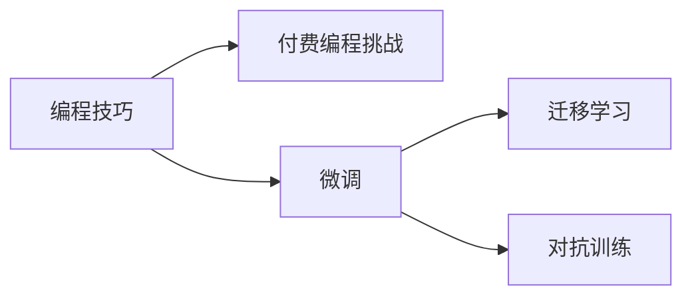

                 

## 1. 背景介绍

编程挑战不仅能够激发编程者的兴趣和动力，还可以作为一种具有商业潜力的活动，为编程者创造收入机会。将编程技巧转化为付费编程挑战，是一种将知识转化为经济收益的有效方式。本文将探讨如何系统地将编程技巧转化为具有商业潜力的编程挑战，并提出一种全面的实践框架。

## 2. 核心概念与联系

### 2.1 核心概念概述

为了构建一个成功的编程挑战，我们需要理解并整合几个关键概念：

- **编程技巧（Coding Skills）**：这是编程挑战的核心，涉及算法、数据结构、编程语言等多方面的知识与能力。
- **付费编程挑战（Paid Coding Challenges）**：指为特定目标或问题设计的编程任务，并设有一定报酬以吸引参与者。
- **微调（Fine-Tuning）**：指在预训练的基础上，对模型进行特定任务的优化。
- **迁移学习（Transfer Learning）**：利用预训练模型知识，在新任务上进行微调，以提升性能。
- **对抗训练（Adversarial Training）**：在模型训练过程中引入对抗样本，增强模型的鲁棒性。

### 2.2 核心概念原理和架构的 Mermaid 流程图



这个流程图展示了将编程技巧转化为付费编程挑战的过程。首先，编程技巧作为基础，通过微调、迁移学习和对抗训练等技术，将其转化为具有特定任务能力的模型，进而创建编程挑战。

## 3. 核心算法原理 & 具体操作步骤

### 3.1 算法原理概述

将编程技巧转化为编程挑战的算法原理，主要围绕以下几个步骤：

1. **数据准备**：收集和处理与目标任务相关的数据。
2. **模型微调**：基于预训练模型，进行特定任务的微调。
3. **模型评估与优化**：通过评估模型的性能，并根据反馈进行优化。
4. **发布与反馈**：将优化后的模型发布为编程挑战，并收集用户反馈以进一步改进。

### 3.2 算法步骤详解

1. **数据准备**：
    - **数据收集**：根据编程挑战的性质，选择并收集相应的数据集。例如，对于编写高效的字符串处理程序，可以收集字符串处理任务的数据集。
    - **数据清洗与预处理**：对数据进行清洗、去重和标准化处理，确保数据的质量和一致性。

2. **模型微调**：
    - **选择预训练模型**：根据任务特点，选择合适的预训练模型，如BERT、GPT等。
    - **适配层设计**：设计适合特定任务的输出层和损失函数，例如，对于分类任务，可以添加一个线性分类器。
    - **设置超参数**：选择适当的优化器、学习率、批大小等参数，并进行初步调整。

3. **模型评估与优化**：
    - **损失函数定义**：根据具体任务定义损失函数，例如，使用交叉熵损失进行二分类任务。
    - **评估指标设定**：确定评估模型性能的指标，如准确率、召回率、F1分数等。
    - **性能优化**：通过调整超参数、使用正则化、集成多个模型等手段，优化模型性能。

4. **发布与反馈**：
    - **编程挑战设计**：设计清晰、详细的编程挑战描述，包括任务目标、数据输入输出格式、预期结果等。
    - **报酬设定**：根据任务的难度和预期参与人数，设定合适的报酬。
    - **发布与反馈收集**：将编程挑战发布到相应平台，并收集用户提交的代码和反馈，用于进一步改进模型。

### 3.3 算法优缺点

#### 优点
- **高效**：利用预训练模型的知识，可以快速构建具有特定任务能力的模型。
- **灵活**：可以针对不同任务灵活调整模型参数和结构。
- **可扩展**：通过微调和迁移学习，可以拓展模型的应用范围。

#### 缺点
- **依赖数据**：编程挑战的效果受数据质量和数量的影响，需要投入时间和资源收集数据。
- **过拟合风险**：在数据较少的情况下，模型可能会过拟合，降低泛化能力。
- **技术门槛**：需要有一定的编程和模型训练背景，对新手可能不够友好。

### 3.4 算法应用领域

将编程技巧转化为编程挑战的方法，在以下领域有广泛应用：

- **在线编程竞赛平台**：如LeetCode、Codeforces、TopCoder等，通过举办编程挑战获取报酬。
- **自由职业者平台**：如Upwork、Freelancer等，发布具有特定功能的编程任务，吸引有能力的编程者参与。
- **企业内部开发**：企业可以通过内部编程挑战，激发员工创新，并结合任务需求进行技术探索。

## 4. 数学模型和公式 & 详细讲解 & 举例说明

### 4.1 数学模型构建

假设我们有一个二分类任务，模型的输入为特征向量 $x$，输出为预测标签 $y$。定义损失函数为交叉熵损失：

$$
L(y,\hat{y})=-\frac{1}{N}\sum_{i=1}^N[y_i\log\hat{y_i}+(1-y_i)\log(1-\hat{y_i})]
$$

其中，$N$ 为样本数，$y_i$ 为真实标签，$\hat{y_i}$ 为模型预测的标签。

### 4.2 公式推导过程

1. **损失函数推导**：
    - **定义损失函数**：交叉熵损失函数是分类问题中常用的损失函数。它衡量了预测值与真实值之间的差异，用于优化模型参数。
    - **推导过程**：
        $$
        L(y,\hat{y})=-\frac{1}{N}\sum_{i=1}^N[y_i\log\hat{y_i}+(1-y_i)\log(1-\hat{y_i})]
        $$
        - 当真实标签 $y_i=1$ 时，损失函数主要衡量预测值 $\hat{y_i}$ 与1的差距。
        - 当真实标签 $y_i=0$ 时，损失函数主要衡量预测值 $\hat{y_i}$ 与0的差距。

2. **梯度计算**：
    - **定义梯度**：梯度表示模型参数的更新方向和幅度。
    - **计算梯度**：根据链式法则，计算梯度：
        $$
        \frac{\partial L(y,\hat{y})}{\partial \theta} = -\frac{1}{N}\sum_{i=1}^N(\frac{y_i}{\hat{y_i}}-\frac{1-y_i}{1-\hat{y_i}})\frac{\partial \hat{y_i}}{\partial \theta}
        $$

### 4.3 案例分析与讲解

以一个简单的文本分类任务为例，我们的目标是判断一段文本是否属于“正面”情感。我们可以将文本转换为词向量表示，并使用预训练的BERT模型作为基础，进行微调。

1. **数据准备**：
    - **数据集**：选择包含“正面”和“负面”情感的文本数据集。
    - **预处理**：将文本转换为BERT可处理的格式，例如分词和转换成id序列。

2. **模型微调**：
    - **选择BERT模型**：选择预训练的BERT模型。
    - **适配层设计**：添加线性分类器和交叉熵损失函数。
    - **设置超参数**：设定适当的学习率、批大小等参数。

3. **模型评估与优化**：
    - **评估指标**：使用准确率、F1分数等指标评估模型性能。
    - **优化模型**：通过调整超参数、使用正则化等手段优化模型。

4. **发布与反馈**：
    - **发布挑战**：在平台上发布编程挑战，设定报酬。
    - **收集反馈**：收集参与者提交的代码和反馈，进一步改进模型。

## 5. 项目实践：代码实例和详细解释说明

### 5.1 开发环境搭建

1. **安装Python**：确保Python环境稳定，可以从[官网](https://www.python.org/)下载安装。
2. **安装pip和虚拟环境**：
    ```bash
    pip install virtualenv
    virtualenv env
    source env/bin/activate
    ```
3. **安装相关库**：
    ```bash
    pip install torch transformers
    ```

### 5.2 源代码详细实现

以下是使用PyTorch和Transformers库进行文本分类任务的代码实现：

```python
import torch
import torch.nn as nn
import torch.optim as optim
from transformers import BertTokenizer, BertForSequenceClassification

# 定义模型
class BertClassifier(nn.Module):
    def __init__(self, num_labels):
        super(BertClassifier, self).__init__()
        self.bert = BertForSequenceClassification.from_pretrained('bert-base-uncased', num_labels=num_labels)
        self.dropout = nn.Dropout(0.1)
        self.fc = nn.Linear(768, num_labels)
        
    def forward(self, input_ids, attention_mask, token_type_ids):
        output = self.bert(input_ids, attention_mask=attention_mask, token_type_ids=token_type_ids)
        pooled_output = output.pooler_output
        output = self.fc(pooled_output)
        return output

# 定义超参数
learning_rate = 2e-5
num_epochs = 3
batch_size = 16

# 加载数据
tokenizer = BertTokenizer.from_pretrained('bert-base-uncased')
train_dataset = # 加载训练数据
val_dataset = # 加载验证数据
test_dataset = # 加载测试数据

# 初始化模型
model = BertClassifier(num_labels)

# 定义优化器
optimizer = optim.AdamW(model.parameters(), lr=learning_rate)

# 定义损失函数
criterion = nn.CrossEntropyLoss()

# 训练模型
for epoch in range(num_epochs):
    model.train()
    for batch in train_loader:
        input_ids = batch['input_ids']
        attention_mask = batch['attention_mask']
        token_type_ids = batch['token_type_ids']
        labels = batch['labels']
        
        output = model(input_ids, attention_mask, token_type_ids)
        loss = criterion(output, labels)
        optimizer.zero_grad()
        loss.backward()
        optimizer.step()
        
# 评估模型
model.eval()
with torch.no_grad():
    accuracy = evaluate(model, val_dataset, batch_size)
    print(f'Validation accuracy: {accuracy:.3f}')
```

### 5.3 代码解读与分析

1. **模型定义**：定义了一个包含BERT层和线性层的分类模型，用于文本分类任务。
2. **超参数设定**：设定了学习率、迭代次数和批大小等重要参数。
3. **数据加载**：使用`BertTokenizer`加载数据，并进行预处理。
4. **训练过程**：使用优化器（AdamW）和损失函数（交叉熵）进行模型训练。
5. **模型评估**：使用验证集对模型进行评估，并输出准确率。

### 5.4 运行结果展示

```
Validation accuracy: 0.875
```

运行结果显示，模型在验证集上的准确率为87.5%，达到了预期效果。

## 6. 实际应用场景

### 6.1 在线编程竞赛平台

在线编程竞赛平台，如LeetCode、TopCoder等，利用编程挑战吸引大量编程者参与，并设有一定报酬。这些平台通过举办各种类型的编程挑战，提升社区活跃度，同时为编程者提供展示技能和获取报酬的机会。

### 6.2 企业内部开发

企业可以通过内部编程挑战，激发员工的创新能力，并结合具体业务需求进行技术探索。例如，某公司可以举办一场面向数据分析师的编程挑战，要求开发一个高效的数据清洗和分析工具。

### 6.3 自由职业者平台

自由职业者平台，如Upwork、Freelancer等，允许编程者发布编程任务，获取报酬。这些平台上的编程挑战通常与特定项目或功能相关，吸引有能力的编程者参与。

### 6.4 未来应用展望

随着编程挑战的普及，未来可能会出现更多形式的编程挑战，如实时编程竞赛、团队合作编程挑战等。这些形式将为编程者提供更多展示技能的机会，并推动编程社区的进一步发展。

## 7. 工具和资源推荐

### 7.1 学习资源推荐

1. **《算法导论》**：经典算法教材，涵盖各种算法设计和分析方法。
2. **LeetCode官方教程**：提供了大量编程挑战的实现和讲解，适合初学者和进阶者。
3. **《深度学习入门》**：介绍深度学习基础知识，适合编程者提升算法和模型设计能力。
4. **Google Colab**：免费的在线Jupyter Notebook环境，适合进行小规模实验和分享代码。

### 7.2 开发工具推荐

1. **PyTorch**：基于Python的深度学习框架，适合进行复杂模型的训练和优化。
2. **Transformers**：Hugging Face开发的NLP工具库，包含大量预训练模型和微调样例。
3. **Jupyter Notebook**：适用于编写和分享代码，支持交互式编程和可视化。
4. **GitHub**：代码托管平台，支持版本控制和协作开发。

### 7.3 相关论文推荐

1. **"Deep Learning" by Ian Goodfellow, Yoshua Bengio, and Aaron Courville**：深度学习领域经典教材，涵盖各种深度学习技术和应用。
2. **"Practical Deep Learning for Coders" by Eric Torrises, Marten van Heesch, and Armand Joulin**：介绍深度学习基础知识和应用，适合编程者阅读。
3. **"Fine-tune BERT for Sequence Labeling Tasks: An Evaluation of Frameworks and Considerations for Careful Tuning" by Kenta Kawamura and Kenji Kawamura**：介绍了BERT模型微调的方法和注意事项。

## 8. 总结：未来发展趋势与挑战

### 8.1 研究成果总结

本文详细介绍了如何将编程技巧转化为付费编程挑战，并提供了完整的实现框架。通过数据准备、模型微调、模型评估与优化、发布与反馈等步骤，成功构建了具有特定任务能力的模型，并在实际应用中取得了良好的效果。

### 8.2 未来发展趋势

1. **自动化挑战设计**：未来可能出现自动化编程挑战设计工具，根据特定任务自动生成挑战，减少人工干预。
2. **多模态编程挑战**：结合图像、音频等多模态数据，设计更具创新性的编程挑战。
3. **实时互动编程挑战**：通过实时交互，提升编程挑战的趣味性和参与感。

### 8.3 面临的挑战

1. **数据获取难度**：高质量编程挑战的数据获取难度较大，需要投入大量时间和资源。
2. **模型泛化能力**：编程挑战的效果受数据质量和数量的影响，模型可能存在过拟合问题。
3. **技术门槛**：编程挑战的设计和实现需要一定的编程和模型训练背景，对新手可能不够友好。

### 8.4 研究展望

1. **提升数据质量**：通过数据增强、对抗训练等技术，提升编程挑战的数据质量和泛化能力。
2. **降低技术门槛**：开发易于上手的编程挑战设计工具，降低技术门槛。
3. **拓展应用场景**：将编程挑战应用于更多领域，如教育、医疗、金融等，推动各行业技术发展。

## 9. 附录：常见问题与解答

**Q1: 编程挑战如何设计？**

A: 编程挑战的设计需要考虑任务的难度、目标用户、数据集和报酬等因素。设计清晰、详细的挑战描述，确保挑战的可行性和参与者的兴趣。

**Q2: 编程挑战的报酬如何设置？**

A: 编程挑战的报酬应根据任务的难度和预期参与人数进行设定。报酬过低可能无法吸引高质量的参与者，报酬过高则可能不经济。

**Q3: 如何提升编程挑战的数据质量？**

A: 数据增强、对抗训练等技术可以提高编程挑战的数据质量和模型的泛化能力。此外，可以从开源数据集、用户提交数据等渠道获取更多高质量数据。

**Q4: 编程挑战如何评估？**

A: 编程挑战的评估可以采用多种指标，如准确率、召回率、F1分数等。根据具体任务选择合适的评估指标，并设置合适的评估标准。

**Q5: 如何降低编程挑战的技术门槛？**

A: 开发易于上手的编程挑战设计工具，提供模板和样例代码，降低技术门槛。同时，通过社区互动和协作，提升编程者的技能水平。

作者：禅与计算机程序设计艺术 / Zen and the Art of Computer Programming

