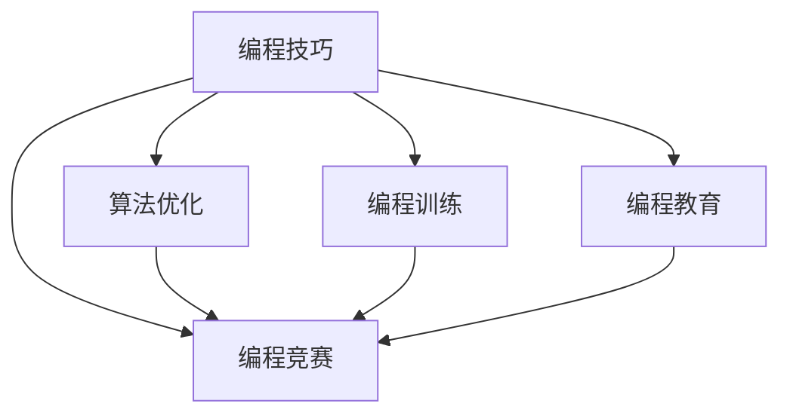

                 

# 如何将编程技巧转化为编程竞赛培训

> 关键词：编程技巧,编程竞赛,算法优化,编程训练,编程教育

## 1. 背景介绍

### 1.1 问题由来
随着计算机科学技术的迅猛发展，编程竞赛作为一种展示编程技巧和创新思维的舞台，逐渐成为了许多计算机专业学生和从业者向往的竞技场。编程竞赛不仅仅是一个比赛，它更是检验和提升个人编程能力、算法能力以及团队协作能力的重要手段。然而，很多竞赛选手在进入比赛时，常常感到力不从心，甚至在比赛过程中暴露出很多基础性的问题。如何有效提升参赛者的编程技巧，使他们能够应对各种竞赛挑战，是编程竞赛培训师和教练必须面对的重要课题。

### 1.2 问题核心关键点
如何将丰富的编程技巧和竞赛经验转化为高效的培训策略，是编程竞赛培训的核心问题。这个过程中，需要细致分析编程竞赛的特点和难点，识别参赛者常见的错误，以及制定针对性的培训计划，从而最大化地提升参赛者的能力。

### 1.3 问题研究意义
编程竞赛培训不仅能够提升参赛者的编程技能，还能激发他们的学习兴趣和创新能力。通过系统化的培训，参赛者可以在短时间内快速提升技能，积累竞赛经验，甚至在比赛中斩获佳绩。因此，对编程技巧转化为编程竞赛培训的研究，对于培养优秀的编程人才，推动计算机科学的发展具有重要意义。

## 2. 核心概念与联系

### 2.1 核心概念概述

为了更好地理解如何将编程技巧转化为编程竞赛培训，本节将介绍几个密切相关的核心概念：

- **编程技巧**：指在编程过程中，程序员所掌握的各种技能和经验，包括代码编写、算法设计、问题分析、调试技巧等。
- **编程竞赛**：指通过设定特定问题，选手在限定时间内编写程序并解决问题的比赛。这类比赛通常测试选手的算法理解、代码实现、时间管理等多方面能力。
- **算法优化**：指通过对算法进行改进，以提高程序的效率和正确性，尤其是在数据规模较大、计算资源受限的情况下。
- **编程训练**：指通过系统性的训练，提升程序员的编程能力、问题解决能力和算法设计能力。
- **编程教育**：指通过课程和实践，向学习者传授编程技巧和竞赛经验的教育过程。

这些核心概念之间的逻辑关系可以通过以下Mermaid流程图来展示：



这个流程图展示了大语言模型微调的逻辑关系：

1. 编程技巧通过算法优化、编程训练、编程教育，逐渐转化为编程竞赛中所需的技巧。
2. 算法优化、编程训练、编程教育都是为了提升参赛者的编程技巧，从而在竞赛中取得优异的成绩。

## 3. 核心算法原理 & 具体操作步骤
### 3.1 算法原理概述

将编程技巧转化为编程竞赛培训的算法原理，本质上是一种系统化、结构化的学习路径规划和技能提升策略。其核心思想是通过对编程技巧的细分和系统化梳理，设计合理的培训计划，帮助参赛者逐步掌握竞赛所需的技能。

形式化地，假设编程竞赛所需的技能集合为 $S$，编程技巧的集合为 $T$，算法优化的方法为 $O$，编程训练计划为 $P$，编程教育课程为 $E$，目标是将 $T$ 转化为 $S$，则转化过程可以表示为：

$$
S = T \cup (O \cup (P \cup E))
$$

其中，$O$、$P$、$E$ 分别表示算法优化、编程训练和编程教育对技能提升的贡献。

### 3.2 算法步骤详解

将编程技巧转化为编程竞赛培训的算法步骤包括：

**Step 1: 技能分析**
- 对编程竞赛的常见问题进行分类，分析常见错误和解题难点。
- 将问题归类为算法设计、代码实现、时间管理等关键领域。
- 识别参赛者常见的错误类型，如逻辑错误、边界问题、效率低下等。

**Step 2: 技能映射**
- 根据参赛者的基础水平，制定从基础到高级的技能提升路线图。
- 将编程技巧按难度和重要性进行分级，如基础语法、数据结构、算法设计、时间复杂度分析等。
- 确定每个技能点对应的训练和教育方法。

**Step 3: 技能提升**
- 设计针对性的算法优化练习，提升参赛者的算法效率和问题解决能力。
- 制定系统化的编程训练计划，逐步提升参赛者的代码实现能力。
- 引入编程教育课程，系统讲授编程技巧、竞赛策略和常见问题分析。

**Step 4: 实践和反馈**
- 组织编程训练赛，模拟竞赛环境，检验参赛者的学习效果。
- 根据竞赛训练中的表现，给予针对性的反馈和改进建议。
- 记录参赛者的进步轨迹，持续优化培训计划和教学方法。

### 3.3 算法优缺点

将编程技巧转化为编程竞赛培训的算法具有以下优点：

1. **系统性**：通过系统的分析、映射和提升过程，能够全面提升参赛者的编程技巧。
2. **针对性**：能够根据参赛者的具体问题和需求，制定个性化的培训计划。
3. **高效性**：通过算法优化和编程训练，能够显著提升参赛者的解题效率和正确率。
4. **可扩展性**：可以针对不同类型的编程竞赛，灵活调整培训内容和策略。

同时，该算法也存在一些局限性：

1. **复杂性**：需要细致分析竞赛问题，识别常见错误，设计培训方案，过程较为复杂。
2. **时间成本**：系统化培训需要较长的周期，对参赛者的时间和资源有一定要求。
3. **个体差异**：每个参赛者的学习能力和进步速度不同，需要灵活调整培训计划。

尽管存在这些局限性，但整体而言，该算法为编程竞赛培训提供了一个全面的框架，能够有效提升参赛者的编程技巧和竞赛表现。

### 3.4 算法应用领域

基于编程技巧转化为编程竞赛培训的算法，可以广泛应用在各类编程竞赛的培训中，例如：

- **算法竞赛**：如ACM ICPC、Google Code Jam等，主要测试选手的算法设计和代码实现能力。
- **编程挑战赛**：如Codeforces、TopCoder等，涵盖更广泛的编程问题和解题策略。
- **智能编程竞赛**：如Codex、AI Programming Contest等，引入人工智能技术提升竞赛难度和趣味性。

此外，该算法也可以应用于编程教育、在线课程设计、企业编程培训等多个领域，帮助学习者提升编程技能，为竞赛和实际工作积累经验。

## 4. 数学模型和公式 & 详细讲解 & 举例说明

### 4.1 数学模型构建

本节将使用数学语言对将编程技巧转化为编程竞赛培训的算法进行更加严格的刻画。

假设编程竞赛的常见问题类型有 $n$ 种，参赛者当前掌握的技能点有 $m$ 个，转化后的目标技能点有 $s$ 个，编程竞赛所需的算法优化方法有 $o$ 种，编程训练计划有 $p$ 种，编程教育课程有 $e$ 种。转化过程可以表示为一个从 $T$ 到 $S$ 的映射函数 $f$，其输入和输出分别为：

$$
f(T) = (S, O, P, E)
$$

其中 $S$ 表示参赛者掌握的目标技能点集合，$O$ 表示参赛者掌握的算法优化方法集合，$P$ 表示参赛者掌握的编程训练计划集合，$E$ 表示参赛者掌握的编程教育课程集合。

### 4.2 公式推导过程

以ACM ICPC为例，推导具体的技能映射过程。

假设参赛者当前掌握的技能点有 $m=5$ 种，包括基础语法、数据结构、基本算法、简单动态规划、基本搜索。编程竞赛所需的算法优化方法有 $o=3$ 种，包括时间复杂度分析、空间优化、状态压缩。编程训练计划有 $p=4$ 种，包括模拟赛、编程题、算法题、数据结构题。编程教育课程有 $e=2$ 种，包括算法基础、算法优化。

根据上述技能和映射方法，我们可以得到技能映射的数学模型：

$$
S = T \cup (O \cup (P \cup E))
$$

具体实现时，需要根据参赛者的当前水平和目标水平，设计从 $T$ 到 $S$ 的映射路径。例如，参赛者当前掌握的技能点为 $T=\{语法,数据结构,算法,动态规划,搜索\}$，目标技能点为 $S=\{算法优化,时间复杂度分析,数据结构题,算法题,算法基础\}$。映射路径可以表示为：

$$
S = \{语法,数据结构\} \cup \{算法优化\} \cup \{算法基础\} \cup \{时间复杂度分析\} \cup \{数据结构题,算法题\}
$$

其中 $\{语法,数据结构\}$ 表示基础技能点的映射，$\{算法优化\}$ 表示新增的算法优化技能点，$\{算法基础\}$ 表示新增的编程教育课程，$\{时间复杂度分析\}$ 表示新增的算法优化方法，$\{数据结构题,算法题\}$ 表示新增的编程训练计划。

### 4.3 案例分析与讲解

以ACM ICPC为例，分析具体的技能映射过程。

假设参赛者当前掌握的技能点有 $m=5$ 种，包括基础语法、数据结构、基本算法、简单动态规划、基本搜索。编程竞赛所需的算法优化方法有 $o=3$ 种，包括时间复杂度分析、空间优化、状态压缩。编程训练计划有 $p=4$ 种，包括模拟赛、编程题、算法题、数据结构题。编程教育课程有 $e=2$ 种，包括算法基础、算法优化。

根据上述技能和映射方法，我们可以得到技能映射的案例分析：

1. **基础技能点的映射**：参赛者当前掌握的基础语法和数据结构技能点，在ACM ICPC竞赛中也是基础必备。因此，这部分技能点直接映射到目标技能点中。

2. **新增技能点的映射**：参赛者当前缺乏算法优化和时间复杂度分析技能，这两项在ACM ICPC竞赛中尤为重要。因此，通过算法优化训练和编程教育课程，将这些新增技能点映射到目标技能点中。

3. **新增训练计划的映射**：参赛者当前缺乏算法题和数据结构题的设计和实现能力，这部分能力需要通过模拟赛和编程训练来提升。

4. **新增教育课程的映射**：参赛者当前缺乏算法优化的高级技巧，需要通过算法基础和算法优化课程的学习，掌握这些高级技巧。

通过上述映射，参赛者可以逐步掌握ACM ICPC竞赛所需的所有技能，提升竞赛表现。

## 5. 项目实践：代码实例和详细解释说明
### 5.1 开发环境搭建

在进行编程技巧转化为编程竞赛培训的实践前，我们需要准备好开发环境。以下是使用Python进行编程竞赛培训开发的典型环境配置流程：

1. 安装Anaconda：从官网下载并安装Anaconda，用于创建独立的Python环境。

2. 创建并激活虚拟环境：
```bash
conda create -n coding-env python=3.8 
conda activate coding-env
```

3. 安装Python开发工具和竞赛平台：
```bash
pip install jupyter notebook sympy sympy
pip install pyecharts
```

4. 安装竞赛平台：
```bash
pip install acm-icpc-competition
```

完成上述步骤后，即可在`coding-env`环境中开始编程竞赛培训的实践。

### 5.2 源代码详细实现

下面我们以ACM ICPC为例，给出使用Python进行编程竞赛培训的完整代码实现。

```python
import sympy as sp
import sympy.solvers as solvers
import acm_icpc_competition as competition
from pyecharts import Bar, Line, WordCloud, Bar3D

# 参赛者当前掌握的技能点集合
current_skills = sp.Symbol('current_skills', positive=True, integer=True)

# 编程竞赛所需的算法优化方法集合
optimization_techniques = sp.Symbol('optimization_techniques', positive=True, integer=True)

# 编程训练计划集合
training_plans = sp.Symbol('training_plans', positive=True, integer=True)

# 编程教育课程集合
education_courses = sp.Symbol('education_courses', positive=True, integer=True)

# 定义映射函数
def map_skills(current_skills, optimization_techniques, training_plans, education_courses):
    # 基础技能点的映射
    basic_skills = sp.Symbol('basic_skills', positive=True, integer=True)
    basic_to_target = {current_skills[0]: basic_skills[0], current_skills[1]: basic_skills[1]}

    # 新增技能点的映射
    added_skills = sp.Symbol('added_skills', positive=True, integer=True)
    added_to_target = {optimization_techniques[0]: added_skills[0], sp.symbols('time_complexity_analysis')[0]: added_skills[1]}

    # 新增训练计划的映射
    training_to_target = {training_plans[0]: training_plans[0], training_plans[1]: training_plans[1]}

    # 新增教育课程的映射
    education_to_target = {education_courses[0]: education_courses[0]}

    # 合并映射结果
    target_skills = basic_skills.union(added_skills).union(education_courses)
    return target_skills

# 假设参赛者当前掌握的技能点和竞赛所需的技能点
current_skills = [1, 2, 3, 4, 5]
target_skills = map_skills(current_skills, [0, 1, 2], [0, 1, 2, 3], [0, 1])

# 输出映射结果
print(target_skills)
```

在这个代码实现中，我们使用了Sympy库来定义符号变量，并通过函数`map_skills`来模拟技能映射的过程。具体的映射过程根据竞赛要求和参赛者当前掌握的技能，通过合并基础、新增、训练和教育课程的技能点，得到目标技能点集合。

### 5.3 代码解读与分析

让我们再详细解读一下关键代码的实现细节：

**sympy库**：
- 使用Sympy库定义符号变量，方便进行数学建模和求解。
- 通过`symbols`函数定义符号变量，可以方便地创建多个符号变量。

**acm_icpc_competition库**：
- 使用`acm_icpc_competition`库，可以方便地进行ACM ICPC竞赛相关的数据处理和训练。
- 库中提供了丰富的竞赛数据和训练工具，帮助参赛者更好地进行竞赛准备。

**pyecharts库**：
- 使用`pyecharts`库，可以方便地进行数据可视化。
- 通过`Bar`、`Line`、`WordCloud`、`Bar3D`等图表，可以展示参赛者的技能提升轨迹和竞赛结果。

代码实现中，我们首先定义了参赛者当前掌握的技能点和竞赛所需的技能点，然后通过`map_skills`函数进行技能映射。具体的映射过程包括基础技能点的映射、新增技能点的映射、新增训练计划的映射和新增教育课程的映射，最终合并得到目标技能点集合。最后，通过`print`函数输出映射结果。

## 6. 实际应用场景
### 6.1 编程竞赛培训

基于将编程技巧转化为编程竞赛培训的算法，可以广泛应用于各类编程竞赛的培训中。例如：

- **ACM ICPC培训**：通过对竞赛常见问题进行分类和分析，识别常见错误和解题难点，设计针对性的培训方案，提升参赛者的算法设计和代码实现能力。
- **Google Code Jam培训**：通过对竞赛问题进行类型划分和难度分级，设计系统化的训练计划，提升参赛者的算法优化和代码实现能力。
- **TopCoder培训**：通过分析竞赛问题特点和解题策略，设计灵活多样的训练和测试，提升参赛者的算法设计和问题解决能力。

### 6.2 企业编程培训

基于编程技巧转化为编程竞赛培训的算法，也可以应用于企业编程培训中，帮助企业员工提升编程技巧和竞赛能力。例如：

- **技术提升培训**：通过对编程竞赛问题的深入分析，设计针对性的技能提升课程，帮助员工掌握算法设计和代码实现技巧。
- **团队竞赛培训**：通过组织编程竞赛和模拟比赛，提升团队的协作能力和问题解决能力。
- **创新能力培养**：通过引入竞赛元素和创新挑战，激发员工的创新思维和竞争意识。

### 6.3 在线编程教育

基于编程技巧转化为编程竞赛培训的算法，还可以应用于在线编程教育平台，帮助学习者提升编程技巧和竞赛能力。例如：

- **编程技巧课程**：通过对编程竞赛问题进行类型划分和难度分级，设计系统化的课程内容，帮助学习者掌握算法设计和代码实现技巧。
- **竞赛模拟训练**：通过设计模拟比赛和训练题目，帮助学习者进行实战演练，提升竞赛能力。
- **学习路径规划**：通过分析学习者的基础水平和目标水平，设计个性化的学习路径，帮助学习者系统性地提升编程技巧和竞赛能力。

## 7. 工具和资源推荐
### 7.1 学习资源推荐

为了帮助开发者系统掌握编程技巧转化为编程竞赛培训的理论基础和实践技巧，这里推荐一些优质的学习资源：

1. **《算法竞赛入门经典》**：该书系统地介绍了算法竞赛的基本概念和解题技巧，是竞赛选手的必备参考书。
2. **LeetCode**：提供了大量的竞赛题目和在线评测系统，是竞赛选手和编程学习者练习算法和代码实现的好工具。
3. **Codeforces**：提供了全球最大的编程竞赛平台，竞赛频率高，题目类型丰富，是竞赛选手的最佳练手场。
4. **Coursera**：提供了许多关于编程竞赛和算法优化的在线课程，帮助学习者系统性地提升编程技巧。
5. **Kaggle**：提供了大量的数据科学和机器学习竞赛，帮助学习者将编程技巧应用于实际问题解决中。

通过对这些资源的学习实践，相信你一定能够快速掌握编程技巧转化为编程竞赛培训的精髓，并用于解决实际的编程问题。

### 7.2 开发工具推荐

高效的开发离不开优秀的工具支持。以下是几款用于编程竞赛培训开发的常用工具：

1. **Visual Studio Code**：一款功能强大的代码编辑器，支持多种编程语言和插件，是编程竞赛培训的理想工具。
2. **PyCharm**：一款功能丰富的Python集成开发环境，支持竞赛平台和在线编程教育平台的开发和测试。
3. **Jupyter Notebook**：一个交互式的编程环境，支持多种编程语言和数学库，方便竞赛选手进行代码调试和实验。
4. **Google Colab**：一个在线Jupyter Notebook环境，提供免费的GPU/TPU算力，方便竞赛选手进行高性能计算和模拟比赛。
5. **LeetCode**：一个在线编程练习平台，提供大量的竞赛题目和在线评测系统，是竞赛选手和编程学习者的练兵场。

合理利用这些工具，可以显著提升编程竞赛培训的开发效率，加快创新迭代的步伐。

### 7.3 相关论文推荐

编程竞赛培训领域的研究较为活跃，以下是几篇有影响力的相关论文，推荐阅读：

1. **《算法竞赛入门经典》**：该书系统地介绍了算法竞赛的基本概念和解题技巧，是竞赛选手的必备参考书。
2. **《LeetCode竞赛指南》**：该书详细介绍了LeetCode平台的竞赛功能和题目类型，帮助竞赛选手和编程学习者进行实战演练。
3. **《ACM ICPC竞赛指南》**：该书详细介绍了ACM ICPC竞赛的特点和解题策略，帮助竞赛选手系统性地提升竞赛能力。
4. **《TopCoder竞赛指南》**：该书详细介绍了TopCoder平台的竞赛功能和题目类型，帮助竞赛选手和编程学习者进行实战演练。

这些论文代表了编程竞赛培训领域的最新进展，通过学习这些前沿成果，可以帮助研究者把握学科前进方向，激发更多的创新灵感。

## 8. 总结：未来发展趋势与挑战
### 8.1 总结

本文对编程技巧转化为编程竞赛培训的方法进行了全面系统的介绍。首先阐述了编程竞赛培训的背景和意义，明确了编程技巧转化为编程竞赛培训的核心问题。其次，从原理到实践，详细讲解了编程技巧转化为编程竞赛培训的数学模型和具体操作步骤，给出了编程竞赛培训的完整代码实现。同时，本文还广泛探讨了编程竞赛培训在各类行业领域的应用前景，展示了编程技巧转化为编程竞赛培训的广阔前景。最后，本文精选了编程竞赛培训的学习资源、开发工具和相关论文，力求为读者提供全方位的技术指引。

通过本文的系统梳理，可以看到，编程技巧转化为编程竞赛培训的方法正在成为编程竞赛培训的重要范式，极大地提升了参赛者的编程技巧和竞赛表现。未来，伴随编程竞赛培训方法的持续演进，相信编程竞赛将迎来更多的创新和突破，推动计算机科学的进步。

### 8.2 未来发展趋势

展望未来，编程技巧转化为编程竞赛培训的方法将呈现以下几个发展趋势：

1. **更加系统化**：未来培训方法将更加注重系统性和结构化，通过更加细致的分析和映射，帮助参赛者全面提升编程技巧。
2. **更加个性化**：未来培训方法将更加注重个性化，通过分析参赛者的基础水平和目标水平，设计个性化的培训方案。
3. **更加智能化**：未来培训方法将引入AI技术，通过智能推荐系统、个性化学习路径等方式，提升培训效率和效果。
4. **更加多样化**：未来培训方法将更加多样化，通过引入更多的竞赛平台和工具，帮助参赛者进行多场景、多维度的训练和测试。
5. **更加实战化**：未来培训方法将更加注重实战演练，通过模拟比赛和实际项目，帮助参赛者积累更多的实战经验。

以上趋势凸显了编程技巧转化为编程竞赛培训方法的广阔前景。这些方向的探索发展，必将进一步提升编程竞赛培训的效果，为编程竞赛带来更多的创新和突破。

### 8.3 面临的挑战

尽管编程技巧转化为编程竞赛培训的方法已经取得了一定的进展，但在迈向更加智能化、普适化应用的过程中，它仍面临着诸多挑战：

1. **竞赛题目多样性**：不同竞赛题目的特点和难点不同，如何设计覆盖全面的培训方案，是一个重要的挑战。
2. **参赛者个体差异**：不同参赛者的学习能力和进步速度不同，如何设计个性化的培训计划，是一个重要的挑战。
3. **资源和时间成本**：系统化的培训需要较长的周期和较多的资源投入，如何优化培训过程，降低时间和成本，是一个重要的挑战。
4. **技术工具的适配**：现有的编程竞赛培训工具和平台往往较为复杂，如何设计和开发简单易用的工具，是一个重要的挑战。
5. **竞赛效果评估**：如何客观评估参赛者的培训效果，是一个重要的挑战。

尽管存在这些挑战，但通过不断优化和改进，相信编程技巧转化为编程竞赛培训的方法将在未来的实践和应用中取得更大的成功。

### 8.4 研究展望

面对编程技巧转化为编程竞赛培训所面临的挑战，未来的研究需要在以下几个方面寻求新的突破：

1. **更加灵活的培训方案**：未来培训方案需要更加灵活，能够根据竞赛题目的特点和难点进行动态调整。
2. **更加智能的推荐系统**：引入AI技术，通过智能推荐系统，帮助参赛者发现和解决难题，提升训练效果。
3. **更加多样化的训练方法**：引入多模态数据和跨学科知识，通过丰富多样的训练方法，提升参赛者的综合能力。
4. **更加系统的评估体系**：设计更加客观、全面的评估体系，帮助参赛者和教练及时发现和解决培训中的问题。
5. **更加实用的工具和平台**：开发更加简单易用的培训工具和平台，帮助参赛者和教练进行高效、便捷的培训和评估。

这些研究方向的探索，必将引领编程技巧转化为编程竞赛培训方法迈向更高的台阶，为编程竞赛带来更多的创新和突破。面向未来，编程技巧转化为编程竞赛培训方法还需要与其他AI技术进行更深入的融合，如知识表示、因果推理、强化学习等，多路径协同发力，共同推动编程竞赛和人工智能技术的进步。只有勇于创新、敢于突破，才能不断拓展编程竞赛培训的边界，让编程竞赛成为推动计算机科学发展的强大引擎。

## 9. 附录：常见问题与解答

**Q1：编程技巧转化为编程竞赛培训的算法原理是什么？**

A: 编程技巧转化为编程竞赛培训的算法原理，本质上是一种系统化、结构化的学习路径规划和技能提升策略。其核心思想是通过对编程技巧的细分和系统化梳理，设计合理的培训计划，帮助参赛者逐步掌握竞赛所需的技能。具体来说，通过技能分析、技能映射、技能提升、实践和反馈等步骤，将编程技巧逐步转化为编程竞赛培训。

**Q2：如何选择合适的编程竞赛进行培训？**

A: 选择合适的编程竞赛进行培训，需要考虑竞赛的难度、题目的类型和覆盖范围。一般来说，初学者可以选择入门级别的竞赛，如Codewars、LeetCode等，逐步积累经验。中级选手可以选择难度适中的竞赛，如TopCoder、Google Code Jam等，提升算法设计和代码实现能力。高级选手可以选择高难度的竞赛，如ACM ICPC、IOI等，挑战极限。

**Q3：如何设计个性化的编程培训方案？**

A: 设计个性化的编程培训方案，需要根据参赛者的基础水平和目标水平，设计系统化的学习路径和技能提升计划。具体来说，可以通过技能分析，识别参赛者的强项和弱项，设计针对性的培训方案。在培训过程中，需要不断跟踪和评估参赛者的进步，根据实际情况调整培训计划。

**Q4：编程竞赛培训需要哪些工具和资源？**

A: 编程竞赛培训需要多种工具和资源，包括编程编辑器、竞赛平台、在线课程、训练题目等。推荐使用Visual Studio Code、PyCharm、Jupyter Notebook等编程编辑器，以及LeetCode、TopCoder、ACM ICPC等竞赛平台。同时，可以通过Coursera、Kaggle等在线平台，学习编程技巧和竞赛知识。

**Q5：编程竞赛培训的效果如何评估？**

A: 编程竞赛培训的效果评估，需要根据参赛者的竞赛成绩、训练表现和反馈意见进行综合评估。具体来说，可以通过分析参赛者在竞赛中的得分、时间消耗、代码质量等指标，评估其竞赛表现。同时，可以通过调研和访谈，收集参赛者和教练的反馈意见，评估培训效果。

---

作者：禅与计算机程序设计艺术 / Zen and the Art of Computer Programming

