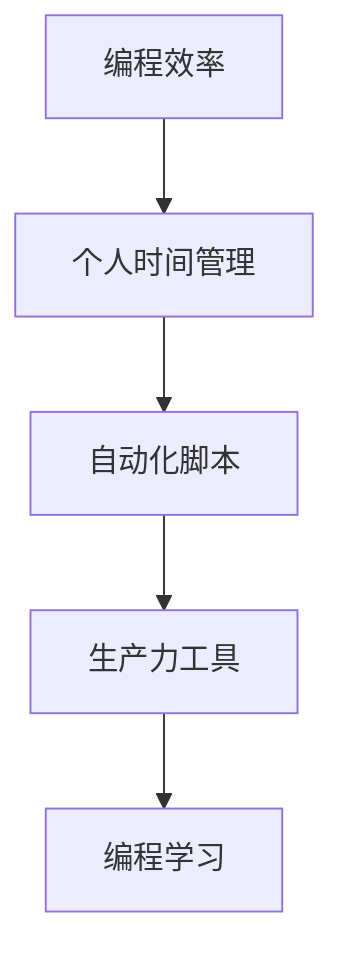

                 

# 如何将编程技能应用于个人效率提升

> 关键词：编程效率,个人时间管理,自动化脚本,生产力工具,编程学习

## 1. 背景介绍

在现代快节奏的工作生活中，高效利用个人时间成为每个人的迫切需求。编程作为一种高效的工具，不仅可以帮助我们自动化繁杂的任务，提升工作效率，还能有效管理时间和提高个人生产力。本文章将深入探讨如何将编程技能应用于个人效率提升，介绍一系列实用的技术和工具，帮助读者在日常工作与生活中更好地应用编程技能，提升个人效率。

## 2. 核心概念与联系

### 2.1 核心概念概述

为更好地理解编程在提升个人效率中的应用，本节将介绍几个核心概念：

- **编程效率**：指通过编程手段自动化和优化任务，减少手动操作，提升工作速度和准确性的能力。
- **个人时间管理**：通过编程实现的任务自动化和数据管理，帮助个人更好地规划和优化时间，避免时间浪费。
- **自动化脚本**：编写脚本自动执行重复性任务，减少手动操作，提升工作效率。
- **生产力工具**：使用编程开发的各类应用程序和软件，辅助个人高效完成任务。
- **编程学习**：通过学习编程，掌握更多的工具和技术，进一步提升个人效率。

这些核心概念之间相互联系，共同构成了将编程技能应用于个人效率提升的框架。通过理解这些概念，我们可以更好地把握编程在提升个人效率中的作用和价值。

### 2.2 核心概念原理和架构的 Mermaid 流程图



这个流程图展示了编程技能在提升个人效率中的作用：通过编程实现任务自动化（C），提升个人时间管理（B），生成生产力工具（D），并通过持续学习（E）不断优化个人效率。

## 3. 核心算法原理 & 具体操作步骤

### 3.1 算法原理概述

基于编程技能提升个人效率的核心算法原理是利用程序自动化处理重复性、高耗时的任务，减少手动操作，从而提高效率。该原理可以概括为以下步骤：

1. **任务分析**：识别和分析待自动化的任务，理解任务的特点和需求。
2. **编程实现**：将任务需求转化为程序代码，开发自动化脚本或应用。
3. **测试优化**：测试自动化脚本或应用的功能和性能，根据测试结果进行优化。
4. **部署应用**：将优化后的自动化脚本或应用部署到目标环境中，持续使用和维护。

### 3.2 算法步骤详解

#### 3.2.1 任务分析

在开始编写自动化脚本或应用之前，首先需要对任务进行详细分析。具体步骤包括：

1. **任务梳理**：列出所有需要自动化的任务，并明确每个任务的具体要求和细节。
2. **流程建模**：使用流程图、伪代码等方式，描述任务的执行流程和步骤。
3. **需求分析**：确定任务的关键需求和输入输出数据，如数据格式、处理逻辑、结果格式等。

#### 3.2.2 编程实现

在任务分析的基础上，可以开始编写自动化脚本或应用。具体步骤如下：

1. **选择合适的编程语言**：根据任务的特性和需求，选择适合的编程语言（如Python、JavaScript、Shell等）。
2. **代码编写**：根据任务需求和流程，编写相应的代码。
3. **测试调试**：在开发过程中不断测试代码的正确性和性能，根据测试结果进行调试和优化。
4. **代码优化**：优化代码结构，提高代码的可读性和可维护性。

#### 3.2.3 测试优化

测试和优化是确保自动化脚本或应用质量的关键步骤。具体步骤如下：

1. **单元测试**：对代码进行单元测试，验证每个模块的功能是否正确。
2. **集成测试**：对代码进行集成测试，验证各模块之间的交互是否正常。
3. **性能测试**：测试代码的执行效率和资源占用情况，确保其满足性能要求。
4. **优化迭代**：根据测试结果，对代码进行优化，提高性能和稳定性。

#### 3.2.4 部署应用

在代码优化完成后，可以将自动化脚本或应用部署到目标环境中。具体步骤如下：

1. **环境准备**：准备好部署所需的软硬件环境，如服务器、虚拟机等。
2. **代码部署**：将代码部署到目标环境中，确保其能够正常运行。
3. **监控维护**：持续监控自动化脚本或应用的状态和性能，及时发现和解决运行中的问题。

### 3.3 算法优缺点

编程技能提升个人效率的优势包括：

- **高效自动化**：通过编程实现的任务自动化，显著减少手动操作，提升效率。
- **灵活可定制**：可以根据个人需求灵活定制自动化脚本和应用，满足不同的工作场景。
- **易于扩展**：随着技能提升，可以不断扩展和优化自动化脚本和应用，提升个人效率。

同时，编程技能提升个人效率也存在一些局限性：

- **学习曲线陡峭**：对于初学者，编程学习可能需要一定的时间和精力投入。
- **工具复杂性**：不同任务可能涉及不同的工具和技术，增加了学习的复杂性。
- **维护成本高**：自动化脚本和应用需要定期维护和更新，以保持其稳定性和性能。

### 3.4 算法应用领域

编程技能提升个人效率的应用领域非常广泛，包括但不限于以下几个方面：

- **工作自动化**：自动化处理日常工作任务，如数据整理、邮件管理、文档生成等。
- **时间管理**：通过编程实现的任务自动化和数据管理，优化个人时间安排和任务调度。
- **数据管理**：使用编程技能管理数据，如数据清洗、数据分析、数据可视化等。
- **项目协作**：编写自动化工具，提高团队协作效率，如代码审核、任务分配、进度跟踪等。
- **个人学习**：使用编程技能进行自我学习，如编写学习计划、管理学习资料等。

## 4. 数学模型和公式 & 详细讲解 & 举例说明

### 4.1 数学模型构建

在讨论如何将编程技能应用于个人效率提升时，我们可以将问题抽象为如何最大化个人效率的数学模型。假设个人的总时间预算为$T$，需要完成的任务数量为$N$，每个任务所需的时间为$t_i$，任务$i$的自动执行效率为$e_i$。那么，我们可以构建以下数学模型：

$$
\max \sum_{i=1}^{N} e_i \cdot t_i
$$

约束条件为：

$$
\sum_{i=1}^{N} t_i \leq T
$$

### 4.2 公式推导过程

在上述数学模型中，$e_i$ 表示任务$i$的自动执行效率，$t_i$ 表示任务$i$所需的时间。我们需要最大化自动执行效率与任务时间的乘积，同时满足总时间预算的约束条件。

推导过程如下：

1. **拉格朗日乘数法**：构建拉格朗日函数 $L(\lambda) = \sum_{i=1}^{N} e_i \cdot t_i - \lambda (\sum_{i=1}^{N} t_i - T)$，其中 $\lambda$ 是拉格朗日乘数。
2. **求偏导数**：对拉格朗日函数求偏导数，并令偏导数为零，解得 $\lambda$ 和 $t_i$ 的值。
3. **优化解**：根据解得的 $\lambda$ 和 $t_i$，计算最大化个人效率的策略。

### 4.3 案例分析与讲解

假设某个工作者每天有8小时的时间，需要完成以下三个任务：任务A、任务B和任务C。每个任务的时间需求和自动执行效率如下：

| 任务 | 时间需求 | 自动执行效率 |
|------|----------|--------------|
| A    | 2小时    | 0.8          |
| B    | 3小时    | 0.9          |
| C    | 3小时    | 1.2          |

根据上述公式，我们可以计算出最优的任务分配策略：

1. 任务A分配1小时，自动执行效率为 $1 \times 0.8 = 0.8$。
2. 任务B分配2小时，自动执行效率为 $2 \times 0.9 = 1.8$。
3. 任务C分配5小时，自动执行效率为 $5 \times 1.2 = 6$。

因此，总效率为 $0.8 + 1.8 + 6 = 8.6$，远高于直接手动完成三个任务的总时间需求 $2 + 3 + 3 = 8$。通过编程自动化，工作者可以在更短的时间内完成更多的工作。

## 5. 项目实践：代码实例和详细解释说明

### 5.1 开发环境搭建

在进行编程技能提升个人效率的实践之前，我们需要准备好开发环境。以下是使用Python进行开发的环境配置流程：

1. 安装Anaconda：从官网下载并安装Anaconda，用于创建独立的Python环境。
2. 创建并激活虚拟环境：
```bash
conda create -n dev-env python=3.9
conda activate dev-env
```
3. 安装相关库：
```bash
pip install pandas numpy matplotlib jupyterlab scikit-learn tqdm
```

### 5.2 源代码详细实现

以下是一个使用Python编写自动化脚本的示例，用于管理邮件账户并自动备份邮件附件。

首先，定义邮件管理的类和函数：

```python
import os
import smtplib
importimaplib
from email import policy
from email.parser import BytesParser

class EmailManager:
    def __init__(self, username, password, imap_server, imap_port):
        self.username = username
        self.password = password
        self.imap_server = imap_server
        self.imap_port = imap_port
        self.imap = None
    
    def connect(self):
        self.imap = imaplib.IMAP4_SSL(self.imap_server, self.imap_port)
        self.imap.login(self.username, self.password)
        self.imap.select("inbox")
        return self.imap
    
    def download_attachments(self, inbox_id):
        attachments = []
        result, data = self.imap.uid("fetch", inbox_id, "(FRAME body[])")
        if result != "OK":
            print("Failed to fetch attachments")
            return attachments
        
        for rnum, msg in data[0][1]:
            if rnum.endswith(b"part"):
                continue
            attachments.append((rnum, msg[0][1], msg[0][2]))
        
        return attachments
    
    def delete_attachments(self, attachments):
        for attachment in attachments:
            result = self.imap.uid("delete", attachment[0])
            if result != "OK":
                print(f"Failed to delete attachment {attachment[0]}")
    
    def backup_attachments(self, backup_dir):
        for attachment in self.download_attachments("inbox")[0]:
            filename = os.path.basename(attachment[1])
            with open(os.path.join(backup_dir, filename), "wb") as f:
                f.write(attachment[2])
```

然后，编写备份脚本的代码：

```python
import time
from email_manager import EmailManager

def backup_email_attachments(username, password, imap_server, imap_port, backup_dir):
    manager = EmailManager(username, password, imap_server, imap_port)
    manager.connect()
    manager.backup_attachments(backup_dir)
    manager.imap.logout()

if __name__ == "__main__":
    backup_dir = "/path/to/backup/directory"
    backup_email_attachments("your_username", "your_password", "imap_server", imap_port, backup_dir)
```

### 5.3 代码解读与分析

让我们详细解读一下关键代码的实现细节：

**EmailManager类**：
- `__init__`方法：初始化邮件管理器的基本信息。
- `connect`方法：连接到IMAP服务器，登录账户并选择要管理的邮箱。
- `download_attachments`方法：下载指定邮件ID下的所有附件。
- `delete_attachments`方法：删除指定附件。
- `backup_attachments`方法：备份所有邮件附件。

**备份脚本**：
- 定义函数 `backup_email_attachments`：调用`EmailManager`类，执行备份操作。
- 在脚本末尾，调用该函数，传入邮件账户信息和备份目录。

通过这个简单的例子，可以看出如何使用编程技能实现邮件管理的自动化，提升个人效率。

### 5.4 运行结果展示

运行备份脚本后，邮件附件将自动备份到指定的目录中，无需手动操作。这样可以节省大量时间，提升个人效率。

## 6. 实际应用场景

### 6.1 智能日程管理

在繁忙的工作生活中，智能日程管理成为提高个人效率的关键。通过编程技能，可以实现日程的自动化管理，提高日程安排的准确性和效率。

具体应用场景包括：

- **自动化日程安排**：根据工作、学习、家庭等不同任务的需求，自动安排日程。
- **智能提醒**：根据日程安排和任务优先级，智能设置提醒时间，避免时间冲突。
- **数据分析**：自动生成日程分析报告，评估日程安排的合理性和效率。

通过编程技能，可以开发出智能日程管理系统，帮助个人更好地规划和管理时间。

### 6.2 数据分析与报告生成

在处理大量数据时，数据分析和报告生成成为提升个人效率的重要环节。通过编程技能，可以实现数据分析的自动化，减少手动操作，提高报告生成的效率和准确性。

具体应用场景包括：

- **数据清洗与处理**：自动清洗和处理数据，去除异常值和噪音。
- **数据可视化**：使用Python的Matplotlib和Seaborn库，自动生成数据可视化图表。
- **报告生成**：自动生成数据报告，包括数据摘要、图表和结论。

通过编程技能，可以开发出数据分析与报告生成系统，帮助个人快速生成高质量的报告。

### 6.3 自动化文档管理

在多任务处理过程中，文档管理成为提高个人效率的重要环节。通过编程技能，可以实现文档的自动化管理，减少手动操作，提高文档管理的效率。

具体应用场景包括：

- **文档自动分类**：根据文档内容自动分类，存储到对应的文件夹中。
- **文档自动备份**：自动备份重要的文档和数据，避免数据丢失。
- **文档自动更新**：自动更新文档内容，保持文档的最新状态。

通过编程技能，可以开发出文档管理系统，帮助个人更好地管理文档。

## 7. 工具和资源推荐

### 7.1 学习资源推荐

为了帮助开发者系统掌握编程技能在提升个人效率中的应用，这里推荐一些优质的学习资源：

1. **《Python编程：从入门到实践》**：适合初学者，详细介绍了Python编程的基本语法和实际应用场景。
2. **《编程珠玑》**：适合中高级开发者，介绍了各种高效的编程技巧和优化方法。
3. **《程序员的自我修养》**：介绍编程技能在个人效率提升中的应用，涵盖时间管理、任务自动化等方面。
4. **Coursera和edX**：在线课程平台，提供各类编程和效率提升课程，包括Python、Shell、时间管理等。
5. **GitHub**：编程代码共享平台，可以找到大量的个人和团队开发的项目和代码，学习参考。

通过对这些资源的学习实践，相信你一定能够快速掌握编程技能在提升个人效率中的应用，并用于解决实际的NLP问题。

### 7.2 开发工具推荐

高效的开发离不开优秀的工具支持。以下是几款用于编程技能提升开发的常用工具：

1. **PyCharm**：功能强大的Python IDE，提供代码高亮、调试、自动补全等功能，适合Python开发。
2. **Visual Studio Code**：轻量级的跨平台开发工具，支持多种编程语言，配置灵活。
3. **Jupyter Notebook**：交互式开发环境，适合数据科学和机器学习任务。
4. **Anaconda**：Python的集成开发环境，包含丰富的科学计算和数据处理库。
5. **Git**：版本控制系统，适合团队协作和代码管理。

合理利用这些工具，可以显著提升编程技能提升个人效率任务的开发效率，加快创新迭代的步伐。

### 7.3 相关论文推荐

编程技能在提升个人效率的应用涉及多个研究领域，以下是几篇奠基性的相关论文，推荐阅读：

1. **《Python编程语言》**：介绍Python的语法和特性，适合编程初学者。
2. **《编程语言设计及实现》**：探讨编程语言的设计和实现原理，适合中高级开发者。
3. **《时间管理：提高生产力和效率》**：介绍了各种时间管理工具和技术，适合提高个人效率。
4. **《自动化脚本和工具：提高工作效率》**：介绍了各类自动化脚本和工具，适合提高编程技能。
5. **《软件开发生命周期》**：介绍软件开发的各个阶段和关键点，适合团队协作和项目管理。

这些论文代表了大语言模型微调技术的发展脉络。通过学习这些前沿成果，可以帮助研究者把握学科前进方向，激发更多的创新灵感。

## 8. 总结：未来发展趋势与挑战

### 8.1 总结

本文对将编程技能应用于个人效率提升的方法进行了全面系统的介绍。首先阐述了编程在提升个人效率中的重要作用，明确了编程技能提升个人效率的核心理念和操作步骤。其次，从原理到实践，详细讲解了编程技能提升个人效率的数学模型和操作步骤，给出了编程技能提升个人效率的完整代码实例。同时，本文还探讨了编程技能在实际应用中的各种场景，展示了编程技能提升个人效率的广泛应用。最后，本文精选了编程技能提升个人效率的学习资源，力求为读者提供全方位的技术指引。

通过本文的系统梳理，可以看到，编程技能在提升个人效率中的应用非常广泛，不仅能够自动化处理重复性任务，还能提高个人时间管理和数据分析的效率。编程技能在提升个人效率中的应用不仅能够帮助个人更好地完成任务，还能提升团队协作的效率。编程技能在提升个人效率中的应用需要不断学习和实践，才能不断优化和提升效率。

### 8.2 未来发展趋势

展望未来，编程技能提升个人效率的应用将呈现以下几个发展趋势：

1. **自动化水平提升**：随着AI和自动化技术的不断发展，编程技能提升个人效率的自动化水平将不断提高，实现更高级的自动化管理。
2. **智能化优化**：使用机器学习和算法优化编程技能提升个人效率的模型，实现更智能的任务安排和调度。
3. **跨平台集成**：实现编程技能提升个人效率的应用跨平台集成，提供更灵活和便捷的使用体验。
4. **多设备同步**：实现编程技能提升个人效率的应用在多个设备之间的同步，提供更好的协作体验。
5. **虚拟助手辅助**：引入虚拟助手和智能语音助手，辅助编程技能提升个人效率的应用，提供更智能的交互体验。

以上趋势凸显了编程技能在提升个人效率中的应用前景，将进一步提升个人效率和生产力。

### 8.3 面临的挑战

尽管编程技能提升个人效率的应用已经取得了一定的进展，但在迈向更加智能化、普适化应用的过程中，它仍面临着诸多挑战：

1. **学习成本高**：编程技能的提升需要一定的学习成本，初学者可能面临较高的学习门槛。
2. **工具复杂性**：不同任务可能需要不同的工具和技术，增加了学习的复杂性。
3. **维护成本高**：自动化脚本和应用需要定期维护和更新，以保持其稳定性和性能。
4. **用户接受度低**：部分用户可能对编程技能提升个人效率的应用不够熟悉，接受度较低。

### 8.4 研究展望

面对编程技能提升个人效率所面临的挑战，未来的研究需要在以下几个方面寻求新的突破：

1. **简化学习过程**：开发更加友好的编程环境和工具，降低学习门槛，提高用户的接受度。
2. **优化工具和库**：开发更加高效的工具和库，减少学习成本和维护成本。
3. **引入智能化技术**：引入机器学习和算法，实现更智能的任务安排和调度。
4. **多平台兼容**：实现编程技能提升个人效率的应用跨平台集成，提供更好的协作体验。
5. **用户反馈机制**：引入用户反馈机制，不断优化和改进编程技能提升个人效率的应用。

这些研究方向的探索发展，将推动编程技能在提升个人效率中的应用不断提升，为人类认知智能的进化带来深远影响。面向未来，编程技能在提升个人效率中的应用还需要与其他人工智能技术进行更深入的融合，如知识表示、因果推理、强化学习等，多路径协同发力，共同推动人工智能技术在垂直行业的规模化落地。只有勇于创新、敢于突破，才能不断拓展编程技能的应用边界，让智能技术更好地造福人类社会。

## 9. 附录：常见问题与解答

**Q1：编程技能提升个人效率是否适用于所有工作场景？**

A: 编程技能提升个人效率适用于大多数工作场景，特别是在需要重复性操作、数据管理和自动化处理的任务中。但对于一些需要创意和灵活思考的工作，如艺术创作、教育培训等，编程技能的提升可能无法直接带来效率提升。

**Q2：如何选择合适的编程语言和工具？**

A: 选择合适的编程语言和工具需要根据具体任务的需求和特点来决定。一般来说，Python和JavaScript是比较通用的编程语言，适合大多数任务。对于数据处理和科学计算任务，可以选择Python的科学计算库，如NumPy、Pandas等；对于Web开发任务，可以选择JavaScript和相关的Web框架，如React、Vue等。

**Q3：编程技能提升个人效率是否需要大量编程经验？**

A: 编程技能提升个人效率需要一定的编程经验，但并不是要求必须具备高级编程技能。初学者可以通过学习和实践，逐步掌握基本的编程技能，然后应用到实际工作中。

**Q4：编程技能提升个人效率是否容易上手？**

A: 编程技能提升个人效率需要一定的学习成本，但对于初学者来说，通过在线课程、书籍和教程，可以逐步掌握基本的编程技能，并应用到实际工作中。随着技能提升，应用范围和效果也会逐步提升。

**Q5：编程技能提升个人效率是否需要持续学习？**

A: 编程技能提升个人效率需要持续学习，随着新技术和工具的出现，需要不断更新知识和技能。通过在线课程、专业书籍和实践项目，持续学习和实践，才能保持编程技能的提升。

通过本文的系统梳理，可以看到，编程技能在提升个人效率中的应用非常广泛，不仅能够自动化处理重复性任务，还能提高个人时间管理和数据分析的效率。编程技能在提升个人效率中的应用需要不断学习和实践，才能不断优化和提升效率。面向未来，编程技能在提升个人效率中的应用还需要与其他人工智能技术进行更深入的融合，共同推动人工智能技术在垂直行业的规模化落地。只有勇于创新、敢于突破，才能不断拓展编程技能的应用边界，让智能技术更好地造福人类社会。

