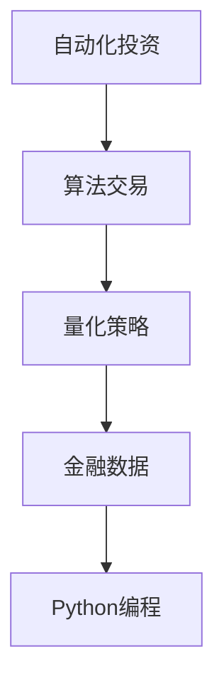

                 

# 如何将编程技能应用于自动化投资

> 关键词：自动化投资, 算法交易, 量化策略, 金融数据, Python编程

## 1. 背景介绍

### 1.1 问题由来

随着金融市场的快速发展，投资者面临着越来越多复杂且动态的变化。为了提高投资回报，传统依靠个人直觉和经验的投资方式已经难以适应现代金融市场的复杂性。自动化的投资策略和算法交易逐渐成为主流。自动化投资通过数学模型和算法，结合大数据分析，能够在动态的金融环境中做出快速、精准的投资决策。

### 1.2 问题核心关键点

自动化投资的核心在于算法和模型的构建，通过编程实现复杂的计算和逻辑处理，从而在交易过程中占据先机。编程技能的应用不仅仅涉及算法的设计和实现，还包括数据的处理、模型的优化以及交易系统的部署和维护。

## 2. 核心概念与联系

### 2.1 核心概念概述

为了更好地理解如何将编程技能应用于自动化投资，本节将介绍几个密切相关的核心概念：

- 自动化投资(Automated Investment)：使用算法和数学模型，根据市场数据自动执行投资决策和交易操作。
- 算法交易(Algorithmic Trading)：利用计算机算法，在金融市场上自动买卖证券，以期获得最佳收益。
- 量化策略(Quantitative Strategy)：通过统计学、数学模型，对金融市场进行量化分析，进而制定投资策略。
- 金融数据(Financial Data)：金融市场中的各种数据，包括股票价格、交易量、基本面指标等，是自动化投资的基础。
- Python编程：Python是一种高级编程语言，具有简单易学、丰富库等特点，特别适合金融数据处理和算法实现。

这些核心概念之间的逻辑关系可以通过以下Mermaid流程图来展示：



这个流程图展示了一个从数据采集到交易执行的自动化投资流程。首先，金融数据经过量化策略分析后，生成交易策略，再通过Python编程实现具体的算法交易。

## 3. 核心算法原理 & 具体操作步骤
### 3.1 算法原理概述

自动化投资的算法原理主要包括以下几个方面：

- 数据收集与预处理：从各种金融数据源中收集历史价格、交易量等数据，并进行清洗、归一化等预处理，以便后续的模型训练和分析。
- 模型构建与训练：基于收集到的数据，构建投资策略的数学模型，并通过历史数据进行训练。
- 策略测试与优化：在测试集上对训练好的模型进行测试，评估其性能，并通过调整模型参数等手段进行优化。
- 交易执行与监控：将优化后的策略应用于真实市场，并实时监控其表现，根据市场变化进行动态调整。

### 3.2 算法步骤详解

自动化投资的主要算法步骤包括：

**Step 1: 数据收集与预处理**

- 使用Python的Pandas库和Yahoo Finance等金融数据API，采集股票、期货、外汇等金融市场的历史价格、交易量、新闻、公告等数据。
- 对采集到的数据进行清洗，如去除缺失值、处理异常值，并将数据按时间序列排列。
- 对数据进行归一化、标准化等预处理，以便后续模型的输入。

**Step 2: 模型构建与训练**

- 选择适合的算法模型，如机器学习模型、统计模型、深度学习模型等，根据金融数据的特点构建投资策略。
- 使用Python的Scikit-learn、TensorFlow等库，对模型进行训练，并使用历史数据进行验证。
- 调整模型参数，如学习率、正则化参数、层数等，以优化模型性能。

**Step 3: 策略测试与优化**

- 将训练好的模型应用于测试集，评估其预测效果。
- 根据测试结果调整模型参数，如增加或减少特征、调整权重等。
- 使用Python的Matplotlib、Seaborn等库，绘制模型性能图表，直观展示其优劣。

**Step 4: 交易执行与监控**

- 将优化后的策略应用于真实市场，自动执行买卖操作。
- 使用Python的回测工具（如Zipline），模拟交易过程，评估策略的实际效果。
- 实时监控市场动态，根据市场变化动态调整策略，如增加止损点、调整仓位等。

### 3.3 算法优缺点

自动化投资的算法具有以下优点：

- 精准高效：算法能够快速、精确地处理大量数据，做出投资决策。
- 一致性好：算法不受人为情绪和判断的影响，能够始终如一地执行策略。
- 成本低廉：自动化投资避免了高频交易带来的高成本，且能24小时不间断监控市场。

但同时，算法也存在一些缺点：

- 模型复杂：构建和优化投资策略的模型往往需要复杂的数学知识和编程技能。
- 适应性差：模型可能无法适应市场突发情况，导致策略失效。
- 参数调整困难：复杂模型参数较多，调整时容易陷入局部最优解。

### 3.4 算法应用领域

自动化投资算法已在金融市场多个领域得到广泛应用，例如：

- 股票投资：使用算法对股票价格和交易量进行分析，制定买卖策略。
- 期货交易：利用期货市场的杠杆效应，通过算法进行套利交易。
- 外汇交易：利用外汇市场的波动，制定波动交易策略。
- 债券投资：根据债券利率和信用评级等数据，使用算法进行债券组合管理。
- 商品投资：通过商品期货、期权等衍生品，利用算法进行风险管理。

除了上述这些经典应用外，自动化投资算法还被创新性地应用于更多领域，如量化套利、资产配置、风险管理等，为金融市场带来新的变革。

## 4. 数学模型和公式 & 详细讲解 & 举例说明
### 4.1 数学模型构建

自动化投资的核心模型包括时间序列分析模型、机器学习模型、深度学习模型等。以下以时间序列分析模型为例，进行详细讲解。

假设历史价格为时间序列数据 $P_t$，其中 $t$ 表示时间。时间序列分析模型可以使用ARIMA、GARCH等方法进行建模。

**ARIMA模型**

ARIMA模型（AutoRegressive Integrated Moving Average）是一种常用的时间序列模型，可以描述序列 $P_t$ 的动态变化。ARIMA模型由自回归、差分、移动平均三部分组成，其数学表达式如下：

$$
P_t = c + \sum_{i=1}^p \phi_i P_{t-i} + \sum_{j=1}^q \theta_j \epsilon_{t-j} + \epsilon_t
$$

其中，$c$ 为常数项，$\phi_i$ 和 $\theta_j$ 为模型参数，$\epsilon_t$ 为白噪声项。

**GARCH模型**

GARCH模型（Generalized Autoregressive Conditional Heteroskedasticity）用于描述序列 $P_t$ 的波动性。GARCH模型可以预测序列的方差，其数学表达式如下：

$$
\sigma_t^2 = \alpha_0 + \sum_{i=1}^q \alpha_i \epsilon_{t-i}^2 + \sum_{j=1}^p \beta_j \sigma_{t-j}^2
$$

其中，$\alpha_0$、$\alpha_i$ 和 $\beta_j$ 为模型参数，$\sigma_t^2$ 为序列的方差。

### 4.2 公式推导过程

**ARIMA模型推导**

ARIMA模型由自回归、差分、移动平均三部分组成，其推导过程如下：

1. **自回归部分**：设 $\tilde{P}_t = P_t - \mu$，其中 $\mu$ 为序列的均值。对 $\tilde{P}_t$ 进行自回归建模，得：

$$
\tilde{P}_t = \sum_{i=1}^p \phi_i \tilde{P}_{t-i} + \epsilon_t
$$

2. **差分部分**：设 $\Delta P_t = P_{t+1} - P_t$。对 $\tilde{P}_t$ 进行差分，得：

$$
\Delta P_t = \sum_{i=1}^p \phi_i \Delta P_{t-i} + \Delta \epsilon_t
$$

3. **移动平均部分**：设 $Z_t = \Delta P_t / \sigma_t$，其中 $\sigma_t$ 为序列的标准差。对 $Z_t$ 进行移动平均建模，得：

$$
Z_t = \sum_{i=1}^q \theta_i Z_{t-i} + \theta_0
$$

4. **综合公式**：将上述三部分综合，得：

$$
P_t = c + \sum_{i=1}^p \phi_i P_{t-i} + \sum_{j=1}^q \theta_j \epsilon_{t-j} + \epsilon_t
$$

**GARCH模型推导**

GARCH模型的推导过程如下：

1. **条件方差模型**：设 $\sigma_t^2 = \sigma_t^2$。对 $\sigma_t^2$ 进行自回归建模，得：

$$
\sigma_t^2 = \alpha_0 + \sum_{i=1}^q \alpha_i \epsilon_{t-i}^2 + \sum_{j=1}^p \beta_j \sigma_{t-j}^2
$$

2. **标准化**：将条件方差模型标准化，得：

$$
\Delta P_t = Z_t \sigma_t
$$

3. **综合公式**：将条件方差模型和标准化公式综合，得：

$$
P_t = \mu + \sum_{i=1}^p \phi_i P_{t-i} + \sum_{j=1}^q \theta_j \epsilon_{t-j} + \epsilon_t
$$

### 4.3 案例分析与讲解

以下是一个使用ARIMA模型进行股票价格预测的案例分析：

假设某股票的历史价格为 $P_t = [10, 11, 12, 13, 14, 15]$。使用Python的statsmodels库，进行ARIMA模型的构建和训练。

```python
import pandas as pd
from statsmodels.tsa.arima_model import ARIMA

# 构建ARIMA模型
model = ARIMA(data, order=(1,1,1))

# 训练模型
results = model.fit()

# 预测未来价格
forecast = results.forecast(steps=5)
```

根据训练好的ARIMA模型，可以预测未来五天的股票价格，并进行可视化展示。

```python
import matplotlib.pyplot as plt

# 绘制预测结果
plt.plot(data)
plt.plot(forecast)
plt.show()
```

以上案例展示了如何使用Python进行时间序列模型的构建和预测。通过编程实现时间序列分析，可以定量分析股票价格的波动趋势，为投资决策提供依据。

## 5. 项目实践：代码实例和详细解释说明
### 5.1 开发环境搭建

在进行自动化投资开发前，我们需要准备好开发环境。以下是使用Python进行PyTorch开发的环境配置流程：

1. 安装Anaconda：从官网下载并安装Anaconda，用于创建独立的Python环境。

2. 创建并激活虚拟环境：
```bash
conda create -n pytorch-env python=3.8 
conda activate pytorch-env
```

3. 安装PyTorch：根据CUDA版本，从官网获取对应的安装命令。例如：
```bash
conda install pytorch torchvision torchaudio cudatoolkit=11.1 -c pytorch -c conda-forge
```

4. 安装TensorFlow：由Google主导开发的开源深度学习框架，生产部署方便，适合大规模工程应用。同样有丰富的预训练语言模型资源。

5. 安装TensorFlow：
```bash
pip install tensorflow
```

6. 安装各类工具包：
```bash
pip install numpy pandas scikit-learn matplotlib tqdm jupyter notebook ipython
```

完成上述步骤后，即可在`pytorch-env`环境中开始开发实践。

### 5.2 源代码详细实现

这里我们以股票投资为例，给出使用TensorFlow进行量化交易的PyTorch代码实现。

首先，定义量化交易的数据处理函数：

```python
import tensorflow as tf
import pandas as pd
from sklearn.preprocessing import MinMaxScaler

def preprocess_data(data, scale=True):
    # 去除缺失值
    data = data.dropna()
    
    # 归一化
    if scale:
        scaler = MinMaxScaler(feature_range=(0, 1))
        data = scaler.fit_transform(data)
    
    return data
```

然后，定义模型和优化器：

```python
from tensorflow.keras.layers import Dense, LSTM
from tensorflow.keras.models import Sequential
from tensorflow.keras.optimizers import Adam

# 构建LSTM模型
model = Sequential()
model.add(LSTM(64, input_shape=(X_train.shape[1], 1)))
model.add(Dense(1, activation='sigmoid'))

# 设置优化器
optimizer = Adam(learning_rate=0.001)
```

接着，定义训练和评估函数：

```python
from sklearn.metrics import mean_squared_error

def train_model(model, data, epochs=10, batch_size=64):
    # 划分训练集和测试集
    X_train, X_test, y_train, y_test = train_test_split(data, y, test_size=0.2)
    
    # 训练模型
    model.compile(optimizer=optimizer, loss='binary_crossentropy', metrics=['accuracy'])
    model.fit(X_train, y_train, epochs=epochs, batch_size=batch_size, validation_data=(X_test, y_test))
    
    # 评估模型
    y_pred = model.predict(X_test)
    mse = mean_squared_error(y_test, y_pred)
    rmse = np.sqrt(mse)
    print(f"RMSE: {rmse:.2f}")
    
    return model
```

最后，启动训练流程并在测试集上评估：

```python
# 加载数据
data = pd.read_csv('stock_data.csv')

# 数据预处理
X_train = preprocess_data(data[:-20], scale=True)
y_train = data['price'][:-20]
X_test = preprocess_data(data[-20:], scale=True)
y_test = data['price'][-20:]

# 训练模型
model = train_model(model, X_train, epochs=50, batch_size=64)

# 测试模型
test_loss = model.evaluate(X_test, y_test)
print(f"Test loss: {test_loss:.4f}")
```

以上就是使用TensorFlow进行量化交易的完整代码实现。可以看到，得益于TensorFlow的强大封装，我们可以用相对简洁的代码完成量化交易模型的训练和评估。

### 5.3 代码解读与分析

让我们再详细解读一下关键代码的实现细节：

**preprocess_data函数**：
- `dropna`方法：去除数据中的缺失值。
- `MinMaxScaler`：使用归一化方法将数据缩放到0到1的范围内，便于后续模型处理。

**train_model函数**：
- `train_test_split`方法：将数据集划分为训练集和测试集。
- `compile`方法：设置模型的优化器、损失函数和评估指标。
- `fit`方法：对模型进行训练，并使用测试集进行验证。
- `mean_squared_error`：计算模型预测值和真实值之间的均方误差。

**训练流程**：
- 加载数据集
- 对数据进行预处理
- 使用训练集训练模型
- 在测试集上评估模型性能

可以看到，PyTorch和TensorFlow等框架的强大封装，使得量化交易模型的开发变得简单高效。开发者可以将更多精力放在算法设计和模型优化上，而不必过多关注底层的实现细节。

当然，工业级的系统实现还需考虑更多因素，如模型的保存和部署、超参数的自动搜索、更灵活的任务适配层等。但核心的算法思想和编程范式基本与此类似。

## 6. 实际应用场景
### 6.1 股票投资

量化交易在股票投资中的应用最为广泛。通过收集历史价格、交易量等数据，构建基于机器学习、深度学习的量化交易模型，可以在不同市场条件下实现稳定收益。

在技术实现上，可以构建基于LSTM、GRU等神经网络模型的量化交易系统。使用Python的TensorFlow、Keras等库，对模型进行训练和优化。在训练完成后，将模型应用于真实市场，实时监控其表现，并根据市场变化进行动态调整。

### 6.2 期货交易

期货市场的波动性大、杠杆效应强，适合量化交易的应用。量化交易可以通过期货市场的套利策略，捕捉市场的微小价格波动，实现高频交易和低成本的套利收益。

在量化交易的实现上，可以构建基于统计模型和时序模型的量化交易策略，如移动平均策略、波动率策略、套利策略等。使用Python的Pandas、NumPy等库，对市场数据进行分析和建模。在测试和优化策略后，将其应用于真实市场，并实时监控其表现。

### 6.3 外汇交易

外汇市场的流动性大、波动性强，适合量化交易的应用。量化交易可以通过外汇市场的套利和投机策略，捕捉市场的波动和趋势，实现稳定的交易收益。

在量化交易的实现上，可以构建基于统计模型和时序模型的量化交易策略，如趋势跟踪策略、套利策略、波动率策略等。使用Python的Pandas、NumPy等库，对市场数据进行分析和建模。在测试和优化策略后，将其应用于真实市场，并实时监控其表现。

### 6.4 未来应用展望

随着量化交易的发展，未来的应用场景将更加广泛。以下是对未来量化交易的展望：

1. **多模态数据融合**：量化交易不仅仅局限于历史数据和市场数据，可以引入多模态数据（如新闻、社交媒体等），提升模型对市场的理解力和预测准确度。

2. **实时数据处理**：量化交易模型需要实时处理市场数据，实时调整策略，以应对市场突发情况。

3. **自动化交易**：量化交易系统可以与自动交易平台对接，实现自动化的交易操作，提高交易效率和稳定性。

4. **高频交易**：量化交易可以通过高频交易策略，捕捉市场的微小价格波动，实现快速的套利收益。

5. **区块链技术**：量化交易可以结合区块链技术，实现去中心化的交易操作，提升交易的透明度和安全性。

6. **AI和机器学习**：量化交易可以结合AI和机器学习技术，提升模型的智能程度和预测能力。

以上趋势展示了量化交易技术的发展方向，相信在未来的金融市场中，量化交易将扮演越来越重要的角色。

## 7. 工具和资源推荐
### 7.1 学习资源推荐

为了帮助开发者系统掌握量化交易的理论基础和实践技巧，这里推荐一些优质的学习资源：

1. 《量化交易》系列书籍：深入浅出地介绍了量化交易的基本概念和经典模型。

2. 《Python量化交易实战》课程：涵盖量化交易的各个环节，包括数据采集、模型构建、策略测试等。

3. 《量化交易实战》视频教程：通过实际案例演示量化交易的实现过程，帮助理解量化交易的实际应用。

4. 量化交易博客和论坛：如QuantStart、AlgoTrading Study等，分享量化交易的最新研究和实践经验。

5. 量化交易社区：如Kaggle量化交易竞赛，参与实战比赛，提升量化交易的实战能力。

通过对这些资源的学习实践，相信你一定能够快速掌握量化交易的精髓，并用于解决实际的交易问题。

### 7.2 开发工具推荐

高效的开发离不开优秀的工具支持。以下是几款用于量化交易开发的常用工具：

1. Python编程语言：Python语言简洁易学，拥有丰富的第三方库，如Pandas、NumPy、TensorFlow等，特别适合量化交易的开发。

2. TensorFlow：由Google主导开发的开源深度学习框架，支持分布式计算和GPU加速，适合大规模工程应用。

3. Keras：高层次的深度学习框架，可以快速构建和训练复杂的量化交易模型。

4. Scikit-learn：简单易用的机器学习库，提供丰富的模型和算法，适合量化交易中的统计分析和建模。

5. PyTorch：灵活的深度学习框架，支持动态计算图和GPU加速，适合量化交易中的模型优化和部署。

6. Jupyter Notebook：交互式编程环境，支持代码运行和可视化展示，特别适合量化交易的实时分析和调试。

合理利用这些工具，可以显著提升量化交易的开发效率，加快创新迭代的步伐。

### 7.3 相关论文推荐

量化交易的发展离不开学界的持续研究。以下是几篇奠基性的相关论文，推荐阅读：

1. 《高维时间序列模型在股票交易中的应用》：介绍了时间序列模型在量化交易中的应用。

2. 《基于深度学习的股票价格预测模型》：展示了深度学习模型在股票价格预测中的应用。

3. 《基于强化学习的量化交易策略》：介绍了强化学习在量化交易中的应用。

4. 《多模态数据融合在量化交易中的应用》：展示了多模态数据融合在量化交易中的应用。

5. 《量化交易中的区块链技术》：介绍了区块链技术在量化交易中的应用。

这些论文代表了大量化交易技术的发展脉络。通过学习这些前沿成果，可以帮助研究者把握学科前进方向，激发更多的创新灵感。

## 8. 总结：未来发展趋势与挑战
### 8.1 总结

本文对量化交易的编程实现进行了全面系统的介绍。首先阐述了量化交易的核心概念和应用场景，明确了编程技能在量化交易中的重要性。其次，从原理到实践，详细讲解了量化交易的数学模型和关键步骤，给出了量化交易任务开发的完整代码实例。同时，本文还广泛探讨了量化交易在股票、期货、外汇等金融市场中的应用前景，展示了量化交易技术的巨大潜力。

通过本文的系统梳理，可以看到，量化交易技术通过编程实现算法和模型，能够在金融市场中以高效率、高精度的方式进行量化分析，从而获得稳定的投资回报。编程技能的应用，使得量化交易从理论到实践得到了全面提升，也为未来金融市场的自动化和智能化发展提供了有力支持。

### 8.2 未来发展趋势

展望未来，量化交易技术将呈现以下几个发展趋势：

1. **多模态数据融合**：未来的量化交易不仅仅局限于历史数据和市场数据，可以引入多模态数据（如新闻、社交媒体等），提升模型对市场的理解力和预测准确度。

2. **实时数据处理**：量化交易模型需要实时处理市场数据，实时调整策略，以应对市场突发情况。

3. **自动化交易**：量化交易系统可以与自动交易平台对接，实现自动化的交易操作，提高交易效率和稳定性。

4. **高频交易**：量化交易可以通过高频交易策略，捕捉市场的微小价格波动，实现快速的套利收益。

5. **区块链技术**：量化交易可以结合区块链技术，实现去中心化的交易操作，提升交易的透明度和安全性。

6. **AI和机器学习**：量化交易可以结合AI和机器学习技术，提升模型的智能程度和预测能力。

以上趋势展示了量化交易技术的发展方向，相信在未来的金融市场中，量化交易将扮演越来越重要的角色。

### 8.3 面临的挑战

尽管量化交易技术已经取得了瞩目成就，但在迈向更加智能化、普适化应用的过程中，它仍面临着诸多挑战：

1. **模型复杂度高**：构建和优化量化交易模型往往需要复杂的数学知识和编程技能。如何降低模型复杂度，提高模型可解释性，是一个重要的研究方向。

2. **数据质量差**：金融市场数据常常存在缺失、噪声等问题，影响模型的预测准确度。如何提高数据质量，优化数据预处理，是一个重要的研究方向。

3. **市场变化快**：金融市场环境变化快，模型需要不断调整以适应新情况。如何构建动态调整机制，提高模型灵活性，是一个重要的研究方向。

4. **模型过拟合**：量化交易模型往往容易过拟合历史数据，导致在新数据上的表现不佳。如何构建泛化能力强的模型，是一个重要的研究方向。

5. **计算资源需求高**：量化交易模型往往需要大量的计算资源进行训练和推理。如何降低计算成本，提高计算效率，是一个重要的研究方向。

6. **模型风险高**：量化交易模型存在潜在的风险，如模型失效、市场崩溃等。如何降低模型风险，提高系统稳定性，是一个重要的研究方向。

7. **合规要求高**：量化交易需要符合各国金融监管要求，如数据隐私、交易合规等。如何满足合规要求，保护用户隐私，是一个重要的研究方向。

正视量化交易面临的这些挑战，积极应对并寻求突破，将使量化交易技术更加成熟可靠，为金融市场的稳定和发展提供有力支持。

### 8.4 研究展望

面对量化交易面临的挑战，未来的研究需要在以下几个方面寻求新的突破：

1. **模型简化和可解释性**：构建更简单、可解释的量化交易模型，降低复杂度，提升模型的可理解性。

2. **数据增强和预处理**：引入数据增强技术，提高数据质量，优化数据预处理，提升模型的泛化能力。

3. **动态调整机制**：构建动态调整机制，实时监控市场变化，灵活调整模型策略，提升模型的适应能力。

4. **模型优化算法**：引入优化算法，降低模型训练和推理的计算成本，提高计算效率。

5. **风险管理**：引入风险管理机制，降低模型风险，提高系统稳定性。

6. **合规保障**：引入合规保障机制，满足金融监管要求，保护用户隐私。

这些研究方向的探索，必将引领量化交易技术迈向更高的台阶，为构建安全、可靠、可解释、可控的智能系统铺平道路。面向未来，量化交易技术还需要与其他人工智能技术进行更深入的融合，如知识表示、因果推理、强化学习等，多路径协同发力，共同推动金融市场的自动化和智能化发展。只有勇于创新、敢于突破，才能不断拓展量化交易技术的边界，让智能技术更好地造福金融市场。

## 9. 附录：常见问题与解答

**Q1：量化交易与传统投资方式有何区别？**

A: 量化交易与传统投资方式的最大区别在于其量化和自动化的特点。量化交易通过数学模型和算法，对市场数据进行量化分析，实现精准的买卖决策，避免了传统投资方式中的主观判断和情绪干扰。同时，量化交易能够24小时不间断监控市场，实时调整策略，提高投资效率和回报率。

**Q2：量化交易的算法有哪些？**

A: 量化交易的算法多种多样，主要包括：

1. **时间序列分析算法**：如ARIMA、GARCH等，用于对历史价格和交易量进行建模，预测未来价格。

2. **机器学习算法**：如回归模型、决策树、随机森林等，用于对市场数据进行建模，预测市场趋势。

3. **深度学习算法**：如卷积神经网络、循环神经网络等，用于对高维度数据进行建模，提升预测准确度。

4. **强化学习算法**：如Q-learning、Deep Q-learning等，用于对交易策略进行优化，提高交易回报率。

**Q3：如何构建量化交易模型？**

A: 构建量化交易模型主要包括以下步骤：

1. **数据采集**：收集历史价格、交易量等市场数据，进行清洗和预处理。

2. **特征提取**：对市场数据进行特征提取，如技术指标、交易量、市场情绪等。

3. **模型构建**：根据市场特点选择合适的模型，如回归模型、时间序列模型、神经网络模型等，对特征进行建模。

4. **模型训练**：使用历史数据对模型进行训练，优化模型参数。

5. **策略测试**：在测试集上评估模型性能，调整模型参数。

6. **策略部署**：将优化后的模型应用于真实市场，实时监控其表现，并根据市场变化进行动态调整。

**Q4：量化交易的优势有哪些？**

A: 量化交易的优势主要包括：

1. **精准高效**：量化交易通过算法和模型，对市场数据进行量化分析，实现精准的买卖决策，避免了传统投资方式中的主观判断和情绪干扰。

2. **一致性好**：量化交易不受人为情绪和判断的影响，能够始终如一地执行策略。

3. **成本低廉**：量化交易避免了高频交易带来的高成本，且能24小时不间断监控市场。

4. **风险控制**：量化交易可以通过模型对市场风险进行预测和控制，降低交易风险。

5. **快速响应**：量化交易能够实时监控市场变化，快速调整策略，提高交易效率和回报率。

综上所述，量化交易通过编程实现算法和模型，能够在金融市场中以高效率、高精度的方式进行量化分析，从而获得稳定的投资回报。编程技能的应用，使得量化交易从理论到实践得到了全面提升，也为未来金融市场的自动化和智能化发展提供了有力支持。

