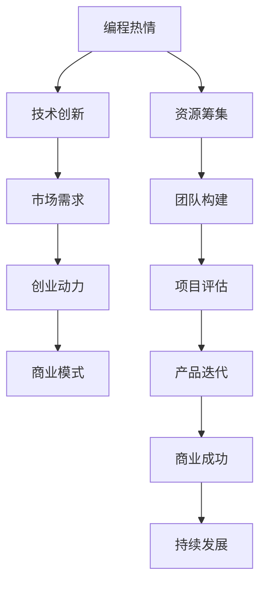

                 

## 1. 背景介绍

### 1.1 问题由来

在当今科技快速发展的时代，编程已经不再仅仅是一份技术性工作，而是一种充满激情和创造力的活动。越来越多的程序员梦想着能够将自己的编程热情转化为实际的创业项目，创造独特的技术产品。然而，如何将激情转化为动力，将梦想变为现实，这背后蕴含着深层次的思考和挑战。

### 1.2 问题核心关键点

- **编程激情与创业动力的转化**：如何将对编程的热爱转化为持续创业的动力，并保持长期的热情与专注。
- **创业项目的可行性评估**：如何选择有市场前景的项目，并进行初步的技术可行性分析。
- **资源与团队的构建**：如何筹集必要的资金，组建一支高效的团队，推动项目落地。
- **持续的创新与迭代**：如何在项目开发过程中保持创新，不断迭代产品以适应市场变化。
- **商业模式与商业成功**：如何设计合理的商业模式，将技术产品转化为可持续的商业成功。

### 1.3 问题研究意义

研究如何将编程热情转化为创业动力，不仅有助于程序员实现自我价值，还能推动科技创新和产业发展。具体来说：

- **个人成长**：激发编程者的潜能，提高技术应用与创新的能力。
- **产业进步**：通过创业项目，推动技术的商业化应用，加速技术转化为生产力。
- **社会价值**：解决实际问题，提升社会生活质量，为社会带来积极影响。

## 2. 核心概念与联系

### 2.1 核心概念概述

为了更好地理解如何将编程热情转化为创业动力，本节将介绍几个关键概念：

- **编程热情(Programming Enthusiasm)**：程序员对编程的强烈兴趣和热爱。
- **创业动力(Entrepreneurial Motivation)**：创业者在创业过程中不断推动项目发展的动力。
- **技术创新(Technological Innovation)**：在创业项目中引入新技术、新方法，实现产品差异化。
- **市场需求(Market Demand)**：项目所面向的市场环境及其需求特点。
- **商业模式(Business Model)**：如何将技术产品转化为可持续的商业价值。

这些概念之间的逻辑关系可以通过以下Mermaid流程图来展示：



这个流程图展示了如何将编程热情转化为创业动力的整体流程：

1. 通过编程热情和技术创新，形成初步产品原型。
2. 评估市场需求，确定产品的商业价值。
3. 筹集资源和组建团队，推进项目开发。
4. 不断迭代产品，提高用户体验和市场竞争力。
5. 最终实现商业成功，推动项目的持续发展。

## 3. 核心算法原理 & 具体操作步骤

### 3.1 算法原理概述

将编程热情转化为创业动力的过程，本质上是一个需求驱动的创新和商业化的过程。其核心思想是通过技术创新满足市场需求，通过商业化实现可持续发展。

形式化地，我们可以将这一过程表示为：

- **需求识别**：通过市场调研，识别目标用户的具体需求。
- **技术实现**：利用编程技能和热情，实现满足这些需求的技术产品。
- **商业化**：通过合理的商业模式，将产品推广至市场，实现盈利。

这一过程可以分为三个主要步骤：需求分析、技术开发和商业化推广。每个步骤都需要进行详细的规划和执行。

### 3.2 算法步骤详解

#### 3.2.1 需求分析

需求分析是创业项目的起点，需要详细了解目标用户的需求和痛点。具体的步骤包括：

1. **市场调研**：收集目标市场的用户数据，了解他们的需求和行为。
2. **用户访谈**：通过面对面或在线访谈，与目标用户交流，获取深入的需求信息。
3. **竞品分析**：研究市场上已有的类似产品，了解它们的优缺点，找出差异化的创新点。
4. **需求梳理**：根据调研和访谈结果，整理出用户的核心需求和潜在需求。

#### 3.2.2 技术开发

技术开发是实现需求的关键步骤，需要构建一个能满足用户需求的技术框架。具体的步骤包括：

1. **技术选型**：根据项目需求，选择合适的编程语言和技术栈。
2. **架构设计**：设计系统架构，确保系统的可扩展性和可维护性。
3. **代码实现**：根据设计文档，实现具体的编程任务。
4. **测试与优化**：进行单元测试、集成测试，优化性能和用户体验。
5. **版本迭代**：根据用户反馈，不断迭代产品，提高用户体验。

#### 3.2.3 商业化推广

商业化推广是将产品推向市场的关键步骤，需要设计一个可持续的商业模式。具体的步骤包括：

1. **市场定位**：明确产品的市场定位和用户群体。
2. **定价策略**：设计合理的价格策略，确保盈利。
3. **营销渠道**：选择适合的营销渠道，推广产品。
4. **用户反馈**：收集用户反馈，持续改进产品。
5. **盈利模式**：选择可持续的盈利模式，确保长期的商业成功。

### 3.3 算法优缺点

将编程热情转化为创业动力的过程，具有以下优点：

1. **创新能力强**：程序员具有较强的技术创新能力，可以快速实现市场需求。
2. **市场灵活性**：通过灵活的商业模式，适应不同市场环境。
3. **用户体验好**：程序员注重技术细节和用户体验，产品往往更具竞争力。

但同时，也存在一些缺点：

1. **资源依赖大**：需要投入大量资金和人力资源，特别是初期阶段。
2. **市场风险高**：市场环境复杂多变，产品需要持续迭代和调整。
3. **商业成功不确定**：技术产品的市场成功受多种因素影响，存在不确定性。

### 3.4 算法应用领域

基于编程热情的创业项目，已经在多个领域取得了显著成果，包括：

- **科技创业**：如人工智能、区块链、大数据等前沿科技领域。
- **电子商务**：如电商平台、社交网络、在线教育等电商应用。
- **健康医疗**：如健康监测、远程医疗、智能医疗设备等。
- **环境保护**：如环境监测、资源管理、智能能源系统等。
- **金融科技**：如金融数据分析、智能投顾、数字货币等。

这些领域中，程序员的编程热情和技术创新为社会带来了深刻的变革。未来，随着科技的进一步发展，基于编程热情的创业项目将更加多样化和普及。

## 4. 数学模型和公式 & 详细讲解 & 举例说明

### 4.1 数学模型构建

将编程热情转化为创业动力，本质上是一个复杂的系统工程。我们可以使用以下数学模型来描述这一过程：

- **需求量 $D$**：用户对产品需求的数量。
- **供给量 $S$**：项目提供的能力或资源。
- **需求满足率 $R$**：用户需求得到满足的比例。

模型可以表示为：

$$
R = \frac{D}{S}
$$

### 4.2 公式推导过程

根据需求量 $D$ 和供给量 $S$ 的关系，我们可以推导出需求满足率 $R$ 的计算公式。

假设需求量 $D$ 为 $N$，供给量 $S$ 为 $C$，则有：

$$
R = \frac{N}{C}
$$

在创业过程中，需求量 $N$ 代表了用户的实际需求，供给量 $C$ 代表了项目的实际能力。需求满足率 $R$ 反映了产品是否能够真正满足用户需求，是项目成功的关键指标。

### 4.3 案例分析与讲解

以一个智能家居产品为例，分析其需求满足率的计算过程。

假设智能家居产品的用户需求 $N=100$，项目提供的能力 $C=80$，则有：

$$
R = \frac{100}{80} = 1.25
$$

这意味着，该产品能够满足125%的用户需求，具有较高的市场竞争力。

## 5. 项目实践：代码实例和详细解释说明

### 5.1 开发环境搭建

在进行创业项目开发前，我们需要准备好开发环境。以下是使用Python进行Flask框架开发的环境配置流程：

1. 安装Anaconda：从官网下载并安装Anaconda，用于创建独立的Python环境。

2. 创建并激活虚拟环境：
```bash
conda create -n flask-env python=3.8 
conda activate flask-env
```

3. 安装Flask：
```bash
pip install Flask
```

4. 安装Flask RESTful：
```bash
pip install flask-restful
```

5. 安装requests：
```bash
pip install requests
```

6. 安装Flask-SQLAlchemy：
```bash
pip install flask-sqlalchemy
```

完成上述步骤后，即可在`flask-env`环境中开始创业项目开发。

### 5.2 源代码详细实现

我们以一个简单的在线编程练习平台为例，展示如何使用Flask框架实现Web应用。

首先，定义Flask应用和SQLAlchemy模型：

```python
from flask import Flask
from flask_sqlalchemy import SQLAlchemy

app = Flask(__name__)
app.config['SQLALCHEMY_DATABASE_URI'] = 'sqlite:///test.db'
db = SQLAlchemy(app)

class User(db.Model):
    id = db.Column(db.Integer, primary_key=True)
    name = db.Column(db.String(80))
    email = db.Column(db.String(120), unique=True, nullable=False)
```

然后，定义路由和视图：

```python
from flask import request

@app.route('/')
def index():
    return "Hello, World!"

@app.route('/user', methods=['POST'])
def add_user():
    data = request.json
    name = data['name']
    email = data['email']
    new_user = User(name=name, email=email)
    db.session.add(new_user)
    db.session.commit()
    return "User added successfully"

@app.route('/users')
def get_users():
    users = User.query.all()
    return users.to_json()

if __name__ == '__main__':
    app.run(debug=True)
```

最后，启动Flask应用：

```bash
python app.py
```

以上代码实现了一个简单的用户信息管理系统，包括添加用户和查询用户信息。用户可以通过POST请求向`/user`接口添加用户，GET请求`/users`接口获取所有用户信息。

### 5.3 代码解读与分析

让我们再详细解读一下关键代码的实现细节：

**User模型**：
- `__init__`方法：初始化用户的基本信息。
- `to_json`方法：将查询结果转换为JSON格式，方便前端调用。

**Flask路由**：
- `index`方法：定义根路由，返回一个简单的Hello World消息。
- `add_user`方法：处理POST请求，向数据库中添加新用户信息。
- `get_users`方法：处理GET请求，查询数据库中的所有用户信息。

通过Flask框架，可以快速搭建Web应用，将编程热情转化为可实际运行的产品。

### 5.4 运行结果展示

启动应用后，可以在浏览器中访问`http://localhost:5000`，看到默认的Hello World消息。向`http://localhost:5000/user`发送POST请求，添加新用户，再访问`http://localhost:5000/users`，即可看到新用户的信息。

## 6. 实际应用场景

### 6.1 在线教育平台

基于编程热情的在线教育平台，可以将程序员的技术热情转化为教育资源，帮助更多人学习编程。

通过微调和迭代，平台可以不断优化教学内容，提升用户体验。例如，可以通过用户反馈，调整课程内容和难度，实现个性化教学。平台还可以通过数据分析，发现用户的学习瓶颈和需求，提供针对性的辅导和推荐。

### 6.2 智能家居系统

智能家居系统是一个典型的基于编程热情的创业项目。通过编程实现家居设备的智能化管理，提高生活的便利性和舒适度。

在实际开发中，可以引入物联网技术，实现设备间的互联互通。同时，可以通过数据分析，优化家庭能源使用，提升环保效果。例如，可以通过学习用户的生活习惯，自动调整温度、照明等设置，实现智能化的家居生活。

### 6.3 健康监测应用

健康监测应用可以将编程热情转化为医疗技术创新，帮助人们更好地关注和管理健康。

在开发过程中，可以利用传感技术，实时监测用户的健康数据。通过数据分析，提供个性化的健康建议和预警。例如，可以通过监测心率、血压等指标，提前发现潜在健康问题，帮助用户及时就医。

### 6.4 未来应用展望

随着技术的不断进步，基于编程热情的创业项目将更加多样化和创新。未来，我们可以预见以下趋势：

1. **人工智能与编程结合**：利用AI技术优化编程开发流程，提升开发效率和产品质量。
2. **跨领域应用**：结合不同领域的知识和技术，开发跨学科的创新产品。
3. **开源社区**：通过开源项目，分享编程热情和创新成果，推动技术普及和应用。
4. **生态系统**：构建一个完整的生态系统，包括硬件、软件、应用和服务，形成一个创新的闭环。
5. **社会影响**：通过创业项目，解决实际问题，提升社会生活质量，实现更大的社会价值。

## 7. 工具和资源推荐

### 7.1 学习资源推荐

为了帮助程序员系统掌握如何将编程热情转化为创业动力，这里推荐一些优质的学习资源：

1. **《从编程到创业：程序员的商业之旅》书籍**：由知名程序员和创业家共同编写，详细介绍了如何将编程热情转化为商业成功的过程。
2. **Coursera《创业与创新》课程**：涵盖创业的基本概念、方法论和实战经验，帮助程序员构建创业思维。
3. **Udemy《Python Web开发实战》课程**：详细讲解Flask框架的开发技巧，帮助程序员快速搭建Web应用。
4. **GitHub**：全球最大的开源社区，汇集了丰富的创业项目和代码库，方便学习和参考。
5. **Stack Overflow**：程序员问答社区，涵盖编程和创业的各类问题，提供丰富的解决方案和建议。

通过这些学习资源，相信你一定能够掌握创业的必备知识和技能，将编程热情转化为实际的成功。

### 7.2 开发工具推荐

高效的开发离不开优秀的工具支持。以下是几款用于编程热情转化的开发工具：

1. **Visual Studio Code**：轻量级但功能强大的代码编辑器，支持多种编程语言和插件，方便编程开发和调试。
2. **Git**：版本控制系统，方便团队协作和代码管理，确保代码的清晰和可追溯。
3. **Jupyter Notebook**：交互式编程环境，方便数据处理和模型调试，支持多种编程语言和科学计算库。
4. **Postman**：API测试工具，方便开发和测试RESTful接口，确保服务的稳定性和可靠性。
5. **Google Colab**：免费的云端Jupyter Notebook环境，方便在线学习和实验。

合理利用这些工具，可以显著提升创业项目的开发效率，加快创新迭代的步伐。

### 7.3 相关论文推荐

编程热情转化为创业动力的研究源于学界的持续探索。以下是几篇奠基性的相关论文，推荐阅读：

1. **《程序员的自我实现：编程热情与创业动力》**：研究程序员的心理特征和创业动机，探讨如何将编程热情转化为创业动力。
2. **《开源社区对技术创新与创业的影响》**：分析开源社区对技术创新和创业的支持，探讨开源文化在创业中的作用。
3. **《创业项目的技术实现与市场推广》**：详细介绍创业项目的技术开发和市场推广流程，提供实战经验和方法。
4. **《基于编程热情的创业模式》**：探讨基于编程热情的创业模式，分析其优势和局限，提供创新思路和策略。
5. **《编程热情与社会价值》**：研究编程热情对社会的影响，探讨如何通过创业项目实现社会价值。

这些论文代表了大语言模型微调技术的发展脉络。通过学习这些前沿成果，可以帮助研究者把握学科前进方向，激发更多的创新灵感。

## 8. 总结：未来发展趋势与挑战

### 8.1 总结

本文对如何将编程热情转化为创业动力进行了全面系统的介绍。首先阐述了编程热情与创业动力的转化过程，明确了需求驱动和商业化推广的核心思想。其次，从原理到实践，详细讲解了创业项目的三个主要步骤：需求分析、技术开发和商业化推广，给出了创业项目开发的完整代码实例。同时，本文还广泛探讨了创业项目在多个行业领域的应用前景，展示了编程热情的广阔想象空间。

通过本文的系统梳理，可以看到，将编程热情转化为创业动力，不仅能够推动技术创新，还能解决实际问题，提升社会生活质量。这一过程不仅需要技术技能，还需要商业思维、市场分析和社会责任感，是一个综合性的挑战。

### 8.2 未来发展趋势

展望未来，编程热情转化为创业动力的过程将呈现以下几个发展趋势：

1. **技术融合加速**：不同技术领域的融合将带来更多创新应用。例如，AI与区块链结合，可以实现智能合约和去中心化的应用。
2. **开源生态繁荣**：开源社区将更加活跃，提供更多的创新工具和资源，推动技术普及和应用。
3. **跨学科协作**：跨领域的协作将带来更多创新的解决方案，解决复杂的社会问题。
4. **可持续发展**：可持续发展的理念将贯穿于创业项目的始终，推动环保和社会责任的实现。
5. **全球化市场**：全球化的市场将带来更多的机会和挑战，需要具备国际视野和竞争力。

这些趋势凸显了编程热情转化为创业动力的广阔前景。这些方向的探索发展，必将进一步推动技术的商业化应用，实现社会价值的最大化。

### 8.3 面临的挑战

尽管将编程热情转化为创业动力已经取得了显著成果，但在迈向更加智能化、普适化应用的过程中，仍面临诸多挑战：

1. **资源获取困难**：创业项目初期需要大量资金和资源，特别是技术开发和市场推广阶段。如何筹集足够的资源，是一个重要的难题。
2. **市场竞争激烈**：市场环境复杂多变，如何识别和抓住市场机会，是一个持续的挑战。
3. **技术创新难度大**：新技术和新方法的应用需要不断的学习和实践，如何保持技术领先，是一个长期的任务。
4. **商业模式不确定**：创业项目的商业模式需要不断调整和优化，如何设计合理的盈利模式，是一个重要的策略问题。
5. **用户需求多变**：用户需求不断变化，如何灵活应对并持续满足用户需求，是一个持续的挑战。

这些挑战需要开发者不断学习和实践，从多方面提升自己的能力，以实现创业项目的成功。

### 8.4 研究展望

面对将编程热情转化为创业动力所面临的种种挑战，未来的研究需要在以下几个方面寻求新的突破：

1. **资源优化与筹集**：探索如何通过众筹、风险投资等多种方式，筹集创业所需的资源，降低创业风险。
2. **市场调研与分析**：研究如何通过大数据和人工智能技术，进行精准的市场调研和用户需求分析，抓住市场机会。
3. **技术创新与推广**：探索如何利用新技术和新方法，提升产品创新性和市场竞争力，加快技术推广速度。
4. **商业模式设计与优化**：研究如何设计可持续的商业模式，确保项目的长期成功，提高商业成功概率。
5. **用户需求管理**：研究如何通过迭代和优化，持续满足用户需求，提升用户体验，实现用户粘性和市场占有率。

这些研究方向的探索，必将引领编程热情转化为创业动力的技术发展，为社会带来更多的创新和价值。

## 9. 附录：常见问题与解答

**Q1：如何将编程热情转化为创业动力？**

A: 将编程热情转化为创业动力，需要明确目标、规划路径、持续学习和实践。具体来说，可以遵循以下步骤：
1. **需求识别**：通过市场调研和用户访谈，明确目标用户的具体需求。
2. **技术实现**：利用编程技能和热情，实现满足这些需求的技术产品。
3. **商业模式设计**：根据市场需求，设计合理的商业模式，确保盈利。
4. **持续优化**：不断迭代产品，提升用户体验和市场竞争力。

**Q2：创业项目如何提高用户粘性？**

A: 提高用户粘性是创业项目成功的关键。具体来说，可以采取以下措施：
1. **个性化推荐**：根据用户行为和偏好，提供个性化的推荐和内容。
2. **社区互动**：建立用户社区，增强用户之间的互动和粘性。
3. **用户反馈**：收集用户反馈，持续优化产品和服务。
4. **忠诚计划**：设计用户忠诚计划，激励用户长期使用。
5. **社交媒体营销**：利用社交媒体平台，进行品牌宣传和用户互动。

**Q3：如何应对创业初期的资源瓶颈？**

A: 创业初期的资源瓶颈是一个普遍的问题。可以采取以下措施：
1. **资源众筹**：通过众筹平台，筹集创业所需的资金和资源。
2. **精益创业**：采用精益创业的方法，快速迭代和优化产品，降低资源消耗。
3. **合作伙伴**：寻找合适的合作伙伴，共享资源和经验，共同推动项目发展。
4. **开源社区**：利用开源社区提供的资源和工具，降低开发成本。
5. **政府支持**：申请政府创业基金和优惠政策，获取资金和政策支持。

通过这些措施，可以有效应对创业初期的资源瓶颈，确保项目的顺利进行。

**Q4：如何保持创业项目的持续创新？**

A: 保持创业项目的持续创新，需要不断学习和实践。具体来说，可以采取以下措施：
1. **技术跟踪**：跟踪前沿技术发展，及时引入新技术和方法。
2. **市场调研**：进行市场调研，了解市场变化和用户需求。
3. **团队建设**：组建一支高效的团队，不断提升技术能力和创新能力。
4. **用户反馈**：收集用户反馈，不断优化产品和服务。
5. **持续学习**：保持持续学习的习惯，提升自我能力和创新能力。

通过这些措施，可以有效保持创业项目的持续创新，提升产品竞争力。

**Q5：如何构建可行的商业模式？**

A: 构建可行的商业模式是创业项目成功的关键。具体来说，可以采取以下措施：
1. **市场定位**：明确产品的市场定位和用户群体。
2. **定价策略**：设计合理的价格策略，确保盈利。
3. **营销渠道**：选择适合的营销渠道，推广产品。
4. **用户体验**：提升用户体验，增加用户粘性和满意度。
5. **成本控制**：控制成本，确保盈利能力。

通过这些措施，可以构建可行的商业模式，确保项目的长期成功。

---

作者：禅与计算机程序设计艺术 / Zen and the Art of Computer Programming

