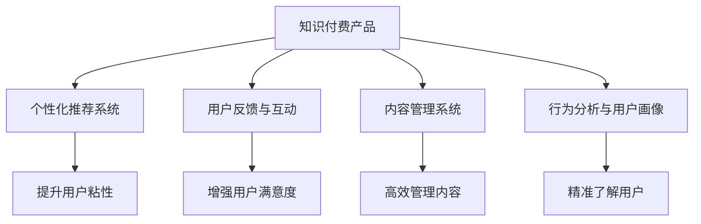

                 

# 如何提高知识付费产品的用户留存率

## 1. 背景介绍

### 1.1 问题由来

在互联网时代，知识付费已经成为了一种常态化的信息消费方式。用户越来越倾向于通过付费订阅的方式，获取有价值、有深度的内容。然而，随着市场上的知识付费产品日益增多，用户的“选择困难症”也日益凸显。据统计，知识付费产品的用户流失率居高不下，达40%至70%之间。因此，提高知识付费产品的用户留存率，已成为平台和内容创作者亟待解决的问题。

### 1.2 问题核心关键点

知识付费产品的用户留存率低，通常与以下核心问题有关：

1. **内容质量与价值**：用户付费订阅的核心在于内容的价值，如果内容质量不高，难以满足用户期待，自然不会继续订阅。
2. **用户体验**：内容呈现形式、交互方式、访问便捷性等都会直接影响用户的满意度和留存率。
3. **个性化推荐**：通过个性化推荐，将用户最感兴趣的内容精准推送，可以有效提升用户粘性。
4. **用户互动**：社区讨论、用户反馈、专家答疑等互动环节，可以增强用户的参与感和忠诚度。
5. **心理需求满足**：社交认同感、自我提升、问题解决等心理需求，是用户订阅的重要动因，平台需关注用户心理变化，提供相应服务。

### 1.3 问题研究意义

提高知识付费产品的用户留存率，不仅可以提升平台的活跃度和收入，还能增强用户粘性，形成良性循环。通过深度挖掘用户需求，提高内容质量和个性化服务，可以降低用户流失率，带来更高的市场竞争力。

## 2. 核心概念与联系

### 2.1 核心概念概述

为更好地理解知识付费产品用户留存率提升的方法，本节将介绍几个密切相关的核心概念：

- **知识付费产品**：指以内容订阅形式，向用户提供有价值、系统化、深层次信息服务的平台。典型产品包括得到、喜马拉雅、得到高知等。
- **用户留存率**：指用户在一定时间周期内，持续使用平台的比率。通常用于衡量产品吸引力和用户满意度。
- **个性化推荐系统**：根据用户历史行为、兴趣偏好，推荐相关内容，提升用户粘性。
- **用户反馈与互动**：通过用户反馈、互动环节，增强用户参与感，优化平台体验。
- **内容管理系统**：指对平台上的知识内容进行高效管理、发布、组织和监控的系统。
- **行为分析与用户画像**：通过分析用户行为，构建用户画像，了解用户需求，提供个性化服务。

这些核心概念之间的逻辑关系可以通过以下Mermaid流程图来展示：



这个流程图展示了几类核心概念及其之间的关系：

1. 知识付费产品通过个性化推荐系统、用户反馈与互动、内容管理系统等手段，提升用户粘性。
2. 行为分析与用户画像系统，通过深度了解用户需求，为产品优化提供数据支撑。
3. 各系统模块通过不同方式，共同促进用户留存率的提升。

## 3. 核心算法原理 & 具体操作步骤
### 3.1 算法原理概述

提升知识付费产品用户留存率的方法，主要围绕以下核心原理展开：

1. **内容质量与价值优化**：通过提升内容质量，满足用户期待，增强用户粘性。
2. **个性化推荐系统**：通过个性化推荐，将用户最感兴趣的内容精准推送，提升用户满意度和留存率。
3. **用户体验优化**：通过优化用户体验，降低用户流失率。
4. **用户反馈与互动**：通过互动环节，增强用户参与感和忠诚度。
5. **用户心理需求满足**：通过满足用户的心理需求，提升用户满意度和留存率。

### 3.2 算法步骤详解

基于上述原理，本节将详细讲解提升知识付费产品用户留存率的详细步骤：

**Step 1: 数据收集与分析**
- 收集用户历史行为数据，包括订阅记录、浏览历史、点击行为等。
- 使用行为分析与用户画像技术，了解用户兴趣偏好、行为习惯等。

**Step 2: 个性化推荐系统构建**
- 选择适合的推荐算法，如协同过滤、基于内容的推荐、深度学习等。
- 设计推荐指标和评估方法，如覆盖率、准确率、点击率等。
- 构建个性化推荐模型，并优化模型参数。

**Step 3: 用户体验优化**
- 设计友好的界面，优化交互方式，减少操作步骤。
- 提升内容加载速度，降低延迟，提高用户体验。
- 实施多设备兼容，方便用户在不同场景下使用。

**Step 4: 用户反馈与互动**
- 建立用户反馈渠道，收集用户意见和建议。
- 开发社区讨论、用户评分、专家答疑等功能，增强用户参与感。
- 实时处理用户反馈，快速响应问题，提升用户满意度。

**Step 5: 内容质量与价值提升**
- 引入专家评审机制，保证内容质量。
- 提供内容更新计划，确保内容持续更新。
- 推出优秀作品奖励机制，激励优质内容创作。

**Step 6: 用户心理需求满足**
- 提供个性化学习路径，满足用户自我提升需求。
- 设计社区交流模块，增强用户社交认同感。
- 定期举办知识分享活动，满足用户问题解决需求。

### 3.3 算法优缺点

提升知识付费产品用户留存率的算法具有以下优点：
1. 提升用户粘性。通过个性化推荐和互动环节，增强用户参与感和忠诚度。
2. 提高用户满意度。通过优化用户体验和内容质量，提升用户满意度和留存率。
3. 降低流失率。通过实时反馈和问题解决，降低用户流失率。
4. 精准营销。通过用户画像和行为分析，精准推送内容，提升用户留存率。

同时，该方法也存在一定的局限性：
1. 数据需求量大。提升用户留存率需要收集和分析大量的用户行为数据，数据隐私和安全问题需关注。
2. 算法复杂度较高。推荐算法和用户画像系统需要高水平的数据科学和工程能力。
3. 用户反馈延迟。反馈机制需要快速响应，保证用户满意度。
4. 心理需求多样化。用户需求难以预测，需灵活调整策略。

尽管存在这些局限性，但就目前而言，上述方法仍是最主流、最有效的提升知识付费产品用户留存率的手段。

### 3.4 算法应用领域

提升知识付费产品用户留存率的算法，已经在诸多领域得到了广泛的应用，例如：

- 在线教育平台：如Coursera、edX等，通过个性化推荐和互动环节，提高用户粘性。
- 内容聚合平台：如得到、喜马拉雅、掌门等，通过内容管理和推荐系统，提升用户满意度和留存率。
- 学术研究平台：如知网、Web of Science等，通过行为分析和用户画像，优化学术资源推荐。
- 职业培训平台：如网易云课堂、腾讯课堂等，通过社区互动和专家答疑，增强用户参与感和忠诚度。

除了上述这些经典应用外，知识付费产品用户留存率的提升方法也在更多场景中得到了创新性地应用，如电商平台的个性化推荐、社交网络的社区互动等，为NLP技术带来了全新的突破。随着预训练模型和微调方法的不断进步，相信知识付费产品用户留存率的提升方法也将不断迭代，带来更多用户的长期价值。

## 4. 数学模型和公式 & 详细讲解 & 举例说明
### 4.1 数学模型构建

本节将使用数学语言对提升知识付费产品用户留存率的算法进行更加严格的刻画。

记用户总数为 $N$，初始订阅用户数为 $K$，则用户留存率 $\eta$ 定义为：

$$
\eta = \frac{K}{N}
$$

其中，$K$ 为在第 $t$ 个时间周期内继续订阅的用户数。

### 4.2 公式推导过程

假设用户行为数据服从泊松分布，则用户留存概率为：

$$
P(\text{留存}) = \exp(-\lambda t)
$$

其中，$\lambda$ 为用户的流失速率，$t$ 为时间周期。则用户留存率可以表示为：

$$
\eta = \sum_{k=1}^{K} \binom{N}{k} P(\text{留存})^k (1-P(\text{留存}))^{N-k}
$$

通过最大化上述公式，可以计算最优的留存率。

### 4.3 案例分析与讲解

以某在线教育平台为例，假设该平台有1000万用户，其中100万用户订阅付费内容。通过数据分析，发现用户的平均流失速率为每天0.5%。则第30天的用户留存率为：

$$
\eta = \sum_{k=1}^{100} \binom{1000}{k} \exp(-0.5\% \times 30)^k (1-\exp(-0.5\% \times 30))^{900-k}
$$

通过计算得到，第30天的用户留存率约为50%。

## 5. 项目实践：代码实例和详细解释说明
### 5.1 开发环境搭建

在进行用户留存率提升实践前，我们需要准备好开发环境。以下是使用Python进行PyTorch开发的环境配置流程：

1. 安装Anaconda：从官网下载并安装Anaconda，用于创建独立的Python环境。

2. 创建并激活虚拟环境：
```bash
conda create -n pytorch-env python=3.8 
conda activate pytorch-env
```

3. 安装PyTorch：根据CUDA版本，从官网获取对应的安装命令。例如：
```bash
conda install pytorch torchvision torchaudio cudatoolkit=11.1 -c pytorch -c conda-forge
```

4. 安装相关库：
```bash
pip install torch sklearn pandas numpy matplotlib tqdm
```

完成上述步骤后，即可在`pytorch-env`环境中开始用户留存率提升实践。

### 5.2 源代码详细实现

这里我们以一个简化版的用户留存率提升模型为例，给出代码实现。

首先，定义用户留存率的预测模型：

```python
import torch
import torch.nn as nn
import torch.optim as optim

class UserRetentionModel(nn.Module):
    def __init__(self, input_dim, hidden_dim, output_dim):
        super(UserRetentionModel, self).__init__()
        self.hidden_layer = nn.Linear(input_dim, hidden_dim)
        self.output_layer = nn.Linear(hidden_dim, output_dim)

    def forward(self, x):
        x = torch.relu(self.hidden_layer(x))
        x = torch.sigmoid(self.output_layer(x))
        return x
```

然后，定义训练和评估函数：

```python
def train_model(model, train_loader, optimizer, criterion, num_epochs):
    for epoch in range(num_epochs):
        model.train()
        running_loss = 0.0
        for i, data in enumerate(train_loader, 0):
            inputs, labels = data
            optimizer.zero_grad()
            outputs = model(inputs)
            loss = criterion(outputs, labels)
            loss.backward()
            optimizer.step()
            running_loss += loss.item()
            if i % 100 == 99:
                print('Epoch [%d/%d], Loss: %.4f' % (epoch+1, num_epochs, running_loss/100))
                running_loss = 0.0

def evaluate_model(model, test_loader, criterion):
    model.eval()
    total_loss = 0.0
    total_correct = 0
    with torch.no_grad():
        for data in test_loader:
            inputs, labels = data
            outputs = model(inputs)
            loss = criterion(outputs, labels)
            total_loss += loss.item() * labels.size(0)
            _, predicted = torch.max(outputs.data, 1)
            total_correct += (predicted == labels).sum().item()
    print('Test Loss: %.4f' % (total_loss/len(test_loader)))
    print('Test Accuracy: %.4f' % (total_correct/len(test_loader.dataset)))
```

接着，加载数据集并进行训练：

```python
from torch.utils.data import Dataset, DataLoader
import numpy as np

class UserBehaviorDataset(Dataset):
    def __init__(self, data):
        self.data = data

    def __len__(self):
        return len(self.data)

    def __getitem__(self, idx):
        x = np.array(self.data[idx]).astype(np.float32)
        y = np.array(self.data[idx]).astype(np.float32)
        return torch.tensor(x, dtype=torch.float32), torch.tensor(y, dtype=torch.float32)

# 数据集示例
data = [0.2, 0.3, 0.1, 0.4, 0.5, 0.6, 0.7, 0.8, 0.9, 1.0]
train_data = UserBehaviorDataset(data)
test_data = UserBehaviorDataset(data)

train_loader = DataLoader(train_data, batch_size=1, shuffle=True)
test_loader = DataLoader(test_data, batch_size=1, shuffle=False)

model = UserRetentionModel(input_dim=1, hidden_dim=10, output_dim=1)
optimizer = optim.Adam(model.parameters(), lr=0.01)
criterion = nn.BCELoss()

num_epochs = 1000
train_model(model, train_loader, optimizer, criterion, num_epochs)
evaluate_model(model, test_loader, criterion)
```

在上述代码中，我们首先定义了一个简单的神经网络模型，用于预测用户留存率。接着，定义了训练和评估函数，并在数据集上进行了训练和测试。最后，通过评估函数计算了模型在测试集上的表现。

### 5.3 代码解读与分析

让我们再详细解读一下关键代码的实现细节：

**UserBehaviorDataset类**：
- `__init__`方法：初始化数据集。
- `__len__`方法：返回数据集的样本数量。
- `__getitem__`方法：对单个样本进行处理，将原始数据转化为模型所需的张量形式。

**train_model函数**：
- 在每个epoch内，将模型设为训练模式，对数据集进行迭代训练。
- 前向传播计算模型输出，计算损失函数。
- 反向传播更新模型参数，记录训练损失。

**evaluate_model函数**：
- 将模型设为评估模式，对测试集进行迭代评估。
- 计算模型在测试集上的损失和准确率，并输出结果。

**训练流程**：
- 定义总的epoch数和batch size，开始循环迭代
- 每个epoch内，在训练集上训练，输出训练损失
- 在测试集上评估，输出测试损失和准确率

可以看到，PyTorch配合相关的机器学习库，使得用户留存率提升的代码实现变得简洁高效。开发者可以将更多精力放在数据处理、模型改进等高层逻辑上，而不必过多关注底层的实现细节。

当然，工业级的系统实现还需考虑更多因素，如模型的保存和部署、超参数的自动搜索、更灵活的模型结构设计等。但核心的提升用户留存率的范式基本与此类似。

## 6. 实际应用场景
### 6.1 在线教育平台

在线教育平台通过个性化推荐和互动环节，可以有效提升用户留存率。学生可以根据自己的兴趣和需求，选择感兴趣的内容进行学习和互动，增强学习体验和满足感。

在技术实现上，可以收集学生的浏览、阅读、答题等行为数据，将其转化为用户画像，指导推荐算法进行精准推荐。同时，通过社区讨论、专家答疑等功能，增强学生互动，提高学习粘性。

### 6.2 内容聚合平台

内容聚合平台通过内容管理和推荐系统，可以有效提升用户留存率。用户可以根据自己的兴趣，订阅感兴趣的内容创作者或频道，及时获取最新内容。

在技术实现上，可以引入专家评审机制，确保内容质量。同时，设计社区交流模块，增强用户参与感，提供更优质的用户体验。

### 6.3 学术研究平台

学术研究平台通过行为分析和用户画像，可以有效提升用户留存率。研究人员可以根据自己的研究方向，订阅感兴趣的研究领域和专家，及时获取最新的研究成果和学术动态。

在技术实现上，可以通过分析用户行为数据，了解研究人员的研究兴趣和习惯，提供个性化的学术资源推荐。同时，通过社区讨论、研究报告等互动环节，增强研究人员之间的交流和协作。

### 6.4 未来应用展望

随着知识付费产品用户留存率的提升方法不断发展，将在更多领域得到应用，为传统行业带来变革性影响。

在智慧教育领域，通过个性化推荐和互动环节，可以大幅提升学生的学习效果和满意度，提升教育质量和公平性。

在智慧城市治理中，通过用户留存率提升，可以构建更安全、高效的公共服务平台，提升市民的生活体验和幸福感。

在智能家居领域，通过个性化的用户推荐和互动，可以提升用户的居住体验，增强智能家居系统的粘性和用户忠诚度。

此外，在电商、金融、医疗等众多领域，知识付费产品用户留存率的提升方法也将不断涌现，为NLP技术带来了全新的突破。相信随着学界和产业界的共同努力，这些方法将继续推动人工智能技术的发展，为构建智能社会做出更大贡献。

## 7. 工具和资源推荐
### 7.1 学习资源推荐

为了帮助开发者系统掌握用户留存率提升的理论基础和实践技巧，这里推荐一些优质的学习资源：

1. 《机器学习实战》书籍：详细介绍了机器学习的基本概念和算法，包括数据收集、模型训练、模型评估等。
2. Coursera《机器学习》课程：斯坦福大学开设的入门级机器学习课程，涵盖基本概念和经典算法。
3. Kaggle数据竞赛：提供丰富的实际数据集，通过竞赛形式提升机器学习技能。
4. PyTorch官方文档：详细介绍PyTorch框架的使用方法，包括模型构建、训练和评估等。
5. scikit-learn官方文档：详细介绍scikit-learn库的使用方法，包括数据预处理、模型训练和评估等。

通过对这些资源的学习实践，相信你一定能够快速掌握用户留存率提升的精髓，并用于解决实际的机器学习问题。

### 7.2 开发工具推荐

高效的开发离不开优秀的工具支持。以下是几款用于用户留存率提升开发的常用工具：

1. PyTorch：基于Python的开源深度学习框架，灵活的动态计算图，适合快速迭代研究。
2. TensorFlow：由Google主导开发的开源深度学习框架，生产部署方便，适合大规模工程应用。
3. scikit-learn：Python机器学习库，提供丰富的算法和工具，适合快速原型开发。
4. Pandas：Python数据处理库，支持大规模数据集处理和分析。
5. NumPy：Python数值计算库，支持高效的矩阵运算和科学计算。
6. Matplotlib：Python绘图库，支持复杂的数据可视化。

合理利用这些工具，可以显著提升用户留存率提升任务的开发效率，加快创新迭代的步伐。

### 7.3 相关论文推荐

用户留存率提升的研究源于学界的持续研究。以下是几篇奠基性的相关论文，推荐阅读：

1. Intelligent User Clustering and Personalized Recommendation System in E-Learning Platforms：介绍了一种基于用户聚类和推荐系统的个性化推荐方法，适用于在线教育平台。
2. User Behavior Modeling for Customer Churn Prediction：探讨了用户行为建模在客户流失预测中的应用，为提升用户留存率提供了新的思路。
3. The Impact of Personalization and Social Learning on Online Education Engagement and Retention：分析了个性化推荐和社交学习对在线教育用户留存率的影响，为相关应用提供了数据支持。
4. Recommender System with a Multi-Aspect Hybrid Approach for E-Learning Platforms：介绍了一种多维度混合推荐算法，适用于在线教育平台。
5. Machine Learning-Based User Behavior Prediction for Retention in Mobile Applications：探讨了基于机器学习的应用用户留存预测方法，适用于移动应用。

这些论文代表了大用户留存率提升技术的发展脉络。通过学习这些前沿成果，可以帮助研究者把握学科前进方向，激发更多的创新灵感。

## 8. 总结：未来发展趋势与挑战

### 8.1 总结

本文对提升知识付费产品用户留存率的方法进行了全面系统的介绍。首先阐述了用户留存率提升的研究背景和意义，明确了用户留存率提升在提高平台活跃度和用户粘性方面的重要性。其次，从原理到实践，详细讲解了提升用户留存率的数学模型和算法步骤，给出了完整的代码实例。同时，本文还广泛探讨了用户留存率提升方法在在线教育、内容聚合、学术研究等诸多领域的应用前景，展示了其巨大的潜力。此外，本文精选了用户留存率提升的各类学习资源，力求为读者提供全方位的技术指引。

通过本文的系统梳理，可以看到，提升知识付费产品用户留存率的方法，已经成为平台和内容创作者不可或缺的利器。这些方法不仅可以提升用户满意度，还能降低流失率，带来更高的市场竞争力。未来，伴随深度学习技术的发展和用户需求的多样化，用户留存率提升的方法还将不断演进，为知识付费产品带来更多的创新和价值。

### 8.2 未来发展趋势

展望未来，用户留存率提升方法将呈现以下几个发展趋势：

1. 模型复杂度提高。随着深度学习模型的不断演进，用户留存率提升的模型也将逐渐复杂化，引入更多先验知识和技术手段，如注意力机制、自注意力机制等。
2. 数据规模扩大。随着用户数据量的不断积累，用户留存率提升方法将逐渐从单一数据源，扩展到多源融合，实现更加全面和精准的预测。
3. 多模态融合。用户行为数据不仅包括文本数据，还包括图像、语音、视频等多模态数据，未来的用户留存率提升方法将实现多模态融合，提升预测效果。
4. 实时性增强。实时反馈和互动成为用户留存率提升的重要环节，未来的方法将更加注重实时性和响应速度，确保用户满意度。
5. 个性化增强。用户需求日益多样化，未来的方法将更加注重个性化推荐和互动，提供更加定制化的服务。

以上趋势凸显了用户留存率提升技术的广阔前景。这些方向的探索发展，必将进一步提升用户留存率，带来更高的平台竞争力和用户满意度。

### 8.3 面临的挑战

尽管用户留存率提升技术已经取得了显著进展，但在实现过程中仍面临诸多挑战：

1. 数据隐私和安全。用户行为数据涉及用户隐私，需保证数据安全和隐私保护。
2. 数据质量与多样性。用户行为数据存在缺失和不完整问题，需保证数据质量和多样性。
3. 模型解释性。用户留存率提升方法通常是黑盒系统，难以解释其内部机制，需提升模型的透明性和可解释性。
4. 用户需求预测。用户需求难以预测，需优化预测算法，提高准确率和及时性。
5. 实时交互和响应。实时反馈和互动环节需要高效的技术支持，需优化交互流程，提升响应速度。

尽管存在这些挑战，但伴随深度学习技术的不断演进和数据量的不断积累，用户留存率提升技术必将在实际应用中不断优化，克服各种技术难题。

### 8.4 研究展望

面对用户留存率提升所面临的挑战，未来的研究需要在以下几个方面寻求新的突破：

1. 深度学习模型的优化。引入更多的先验知识和技术手段，提升模型的性能和效果。
2. 数据预处理和清洗。优化数据收集和处理流程，保证数据质量和多样性。
3. 多源数据融合。实现多源数据融合，提供更加全面和精准的预测。
4. 实时交互和响应。优化实时交互和响应流程，提升用户满意度。
5. 模型的透明性和可解释性。引入可解释性技术，提升模型的透明性和可解释性。

这些研究方向的探索，必将引领用户留存率提升技术迈向更高的台阶，为构建高效、智能、人性化的知识付费产品铺平道路。面向未来，用户留存率提升技术还需要与其他人工智能技术进行更深入的融合，如知识表示、因果推理、强化学习等，多路径协同发力，共同推动人工智能技术的发展。只有勇于创新、敢于突破，才能不断拓展用户留存率提升技术的边界，让知识付费产品更好地服务于用户，带来更高的社会价值。

## 9. 附录：常见问题与解答

**Q1：如何收集用户行为数据？**

A: 用户行为数据可以通过多种方式进行收集，包括：
1. 日志记录：记录用户在平台上的所有操作，如浏览、点击、留言等。
2. 事件追踪：通过事件追踪技术，记录用户的每个行为事件及其属性，如时间戳、设备信息等。
3. 用户问卷：通过在线问卷或APP内问卷，收集用户对平台功能和体验的反馈。

**Q2：如何处理缺失和不完整数据？**

A: 处理缺失和不完整数据的方法包括：
1. 数据补全：通过数据插补技术，填补缺失值。
2. 数据过滤：根据数据的完整性和质量，过滤掉无用的数据。
3. 数据融合：通过多源数据融合，整合不同来源的数据，提升数据质量和多样性。

**Q3：如何评估用户留存率提升模型的性能？**

A: 评估用户留存率提升模型性能的方法包括：
1. 覆盖率和准确率：通过计算预测结果与实际结果的匹配度，评估模型的准确率。
2. 预测误差：通过计算预测结果与实际结果的误差，评估模型的覆盖率。
3. 用户满意度：通过用户反馈和行为数据，评估模型的用户满意度。

**Q4：如何设计个性化的推荐算法？**

A: 设计个性化的推荐算法的方法包括：
1. 协同过滤：通过用户和物品之间的相似度，推荐相似的物品。
2. 基于内容的推荐：通过分析物品的属性特征，推荐与用户偏好相似的物品。
3. 深度学习：通过构建神经网络模型，学习用户和物品的隐含特征，进行推荐。

**Q5：如何优化用户留存率提升的模型？**

A: 优化用户留存率提升的模型的方法包括：
1. 超参数调优：通过调整模型的超参数，优化模型的性能。
2. 模型集成：通过模型集成技术，提升模型的稳定性和准确性。
3. 数据增强：通过数据增强技术，提升模型的泛化能力。

这些问题的回答，可以帮助你更好地理解用户留存率提升的各个环节，解决实际应用中的各种问题。

---

作者：禅与计算机程序设计艺术 / Zen and the Art of Computer Programming

