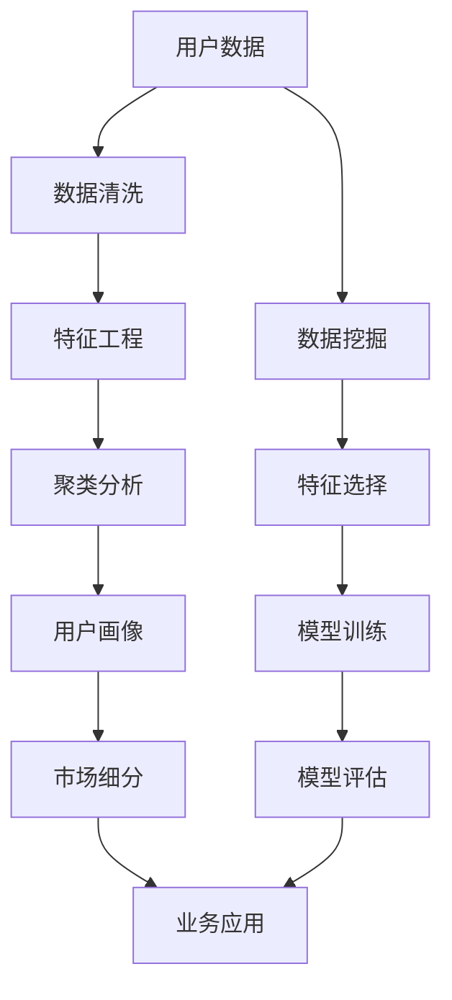

                 

# 如何进行有效的用户分群管理

> 关键词：用户分群,聚类分析,用户画像,市场细分,数据挖掘,机器学习

## 1. 背景介绍

### 1.1 问题由来
在数字化时代，用户行为数据的爆发式增长为企业的业务决策带来了前所未有的机遇。然而，如何从海量数据中挖掘出有价值的用户细分信息，一直是企业数据科学家和业务决策者面临的重大挑战。通过用户分群管理，企业可以更深入地了解用户特征和行为模式，实现精准营销、个性化服务和高效运营。

在商业实践中，传统的用户分群方法主要依赖人工经验或简单统计，难以覆盖用户特征的多样性，无法真正实现细粒度、高准确度的市场细分。为提升用户分群管理的智能化和自动化水平，近年来，数据科学家和机器学习工程师逐渐引入先进的数据挖掘和机器学习技术，通过自动化算法对用户行为数据进行深度分析和建模。

本文将系统介绍基于聚类分析的用户分群管理方法，详细讲解其原理、算法步骤和应用案例。帮助读者掌握如何利用机器学习技术，实现高效、准确的用户分群管理，以提升企业的市场响应速度和决策精准度。

## 2. 核心概念与联系

### 2.1 核心概念概述

为更好地理解用户分群管理的实现方法，本节将介绍几个关键概念：

- **聚类分析(Clustering)**：是一种无监督学习的方法，通过将数据点分成若干组，使得同组内的数据点相似度较高，而不同组之间的相似度较低。聚类分析常用于用户分群，根据用户行为特征将相似用户划分到同一组。

- **用户画像(User Persona)**：是对特定用户群体的全面描述，包括人口统计特征、心理特征、行为特征等，用于更精确地定义市场细分和目标用户群体。

- **市场细分(Market Segmentation)**：将市场划分为具有相似需求和特征的多个子市场，为不同的用户群体提供个性化的产品或服务。

- **数据挖掘(Data Mining)**：从海量数据中挖掘出有价值的模式、规则和知识，常用于用户行为分析、用户画像构建和市场细分。

- **机器学习(Machine Learning)**：通过让机器从数据中学习规律，自动化地完成分类、回归、聚类等任务，提高数据分析和决策的自动化水平。

这些概念之间存在着紧密的联系：聚类分析是用户分群管理的基础，用户画像和市场细分是聚类分析的目标，而数据挖掘和机器学习则提供了高效的技术手段。通过深入理解这些概念，可以更好地把握用户分群管理的实现方法。

### 2.2 核心概念原理和架构的 Mermaid 流程图



## 3. 核心算法原理 & 具体操作步骤

### 3.1 算法原理概述

基于聚类分析的用户分群管理，本质上是通过机器学习算法对用户行为数据进行建模，将相似用户划分到同一组。其核心思想是：从用户的行为特征中自动挖掘出隐含的群组结构，并根据群组特征对用户进行精确的划分。

聚类算法的选择和参数优化直接影响用户分群的效果。常见的聚类算法包括K-means、层次聚类、DBSCAN、GMM等。其中，K-means算法因其简单高效、可扩展性强，被广泛应用于用户分群管理。该算法通过迭代优化，将数据点划分为K个簇，每个簇内的数据点与中心点的距离最小。

### 3.2 算法步骤详解

基于聚类分析的用户分群管理，主要包括以下几个关键步骤：

**Step 1: 数据收集与预处理**

- 收集用户行为数据，包括用户的基本信息、购买记录、浏览行为、社交网络关系等。
- 对数据进行清洗，处理缺失值、异常值，去除噪声数据，保证数据的质量和完整性。

**Step 2: 特征工程**

- 选择有意义的特征，如用户的年龄、性别、消费金额、浏览时长、点击率等。
- 对特征进行标准化或归一化，确保各个特征在模型中的重要性一致。
- 使用主成分分析(PCA)、因子分析(FA)等降维技术，减少特征数量，提高模型效率。

**Step 3: 聚类算法选择与模型训练**

- 选择合适的聚类算法，如K-means。
- 确定簇的数量K，通常通过肘部法则、轮廓系数等方法进行选择。
- 在训练集上训练聚类模型，计算每个用户与各个簇中心的距离，将其划分到距离最近的簇中。

**Step 4: 用户分群与分析**

- 将训练好的聚类模型应用于测试集，根据用户行为特征自动划分到不同的用户群体中。
- 对每个用户群体进行详细分析，如用户画像、行为特征、购买力等，帮助企业了解不同群体的需求和特征。

**Step 5: 模型评估与优化**

- 在验证集上评估聚类模型的效果，如轮廓系数、轮廓宽度、熵等指标。
- 根据评估结果调整模型参数，优化聚类效果，如调整K值、改进距离度量等。
- 将优化后的聚类模型应用到实际业务中，进行用户分群和市场细分。

### 3.3 算法优缺点

基于聚类分析的用户分群管理方法，具有以下优点：

- 自动化程度高，无需人工干预，可以快速处理大规模用户数据。
- 聚类算法灵活多样，可以根据具体需求选择合适的算法。
- 聚类结果直观，便于理解和管理用户分群。

同时，该方法也存在一定的局限性：

- 对数据质量要求高，数据偏差或噪声可能会影响聚类效果。
- 聚类算法对初始簇心敏感，需合理选择聚类算法和初始化方式。
- 聚类结果可能受特征选择和降维方法的影响。
- 无法解释聚类结果的内部逻辑，难以进一步优化模型。

尽管存在这些局限性，但就目前而言，基于聚类分析的用户分群管理方法仍是最主流的手段。未来相关研究将进一步降低对初始数据的依赖，提高算法的自动化和鲁棒性，同时引入更多的解释性方法，提升用户分群的精确度和可解释性。

### 3.4 算法应用领域

基于聚类分析的用户分群管理，在各行各业都有广泛的应用，包括但不限于：

- 零售电商：根据用户购买记录和浏览行为，划分为不同用户群体，实现个性化推荐和精准营销。
- 金融服务：分析客户的交易行为和金融资产，将客户分为高价值用户、潜在客户等不同群体，提供差异化的金融服务。
- 旅游行业：根据用户的旅游偏好和预订行为，划分旅游用户群体，制定针对性的市场营销策略。
- 媒体娱乐：分析用户的观看记录和互动行为，对观众进行细分，实现内容推荐和广告投放。
- 健康医疗：根据患者的诊断记录和用药历史，对患者进行分群，提供个性化的医疗建议和治疗方案。

## 4. 数学模型和公式 & 详细讲解 & 举例说明

### 4.1 数学模型构建

我们以K-means算法为例，介绍基于聚类分析的用户分群管理方法的数学模型构建过程。

记用户数据集为 $\mathcal{D} = \{x_1, x_2, ..., x_N\}$，其中每个用户 $x_i$ 表示为一个 $d$ 维特征向量。聚类分析的目标是将用户数据划分为K个簇，使得每个簇内的数据点与中心点的距离最小。

数学模型定义为：

$$
\min_{C,\mu} \sum_{i=1}^N \sum_{k=1}^K \rho_i(x_i, \mu_k)^2
$$

其中 $C$ 表示簇的划分，$\mu_k$ 表示第 $k$ 个簇的中心点。$\rho_i(x_i, \mu_k)$ 表示用户 $x_i$ 到第 $k$ 个簇中心的距离，一般采用欧式距离或曼哈顿距离。

### 4.2 公式推导过程

K-means算法的核心步骤为迭代更新簇中心和用户分配。设 $c_i$ 表示用户 $x_i$ 的簇分配标签，$M_k = \frac{1}{|\mathcal{D}_k|} \sum_{x_j \in \mathcal{D}_k} x_j$，其中 $\mathcal{D}_k = \{x_j | c_j = k\}$ 表示第 $k$ 个簇的样本集合。则算法的具体步骤如下：

1. 初始化簇中心：随机选择 $K$ 个初始簇中心 $\mu_1, \mu_2, ..., \mu_K$。
2. 分配用户到簇：计算每个用户到各个簇中心的距离，将其分配到距离最近的簇中，即 $c_i = \arg\min_k \rho_i(x_i, \mu_k)$。
3. 更新簇中心：根据当前分配结果，重新计算每个簇的中心点 $\mu_k = \frac{1}{|\mathcal{D}_k|} \sum_{x_j \in \mathcal{D}_k} x_j$。
4. 重复迭代：重复步骤2和3，直到簇中心不再发生明显变化或达到预设迭代次数。

通过以上步骤，K-means算法可以自动将用户数据划分为K个簇，每个簇内的数据点与中心点的距离最小。

### 4.3 案例分析与讲解

考虑一个零售电商平台的用户数据集，包含用户的年龄、性别、消费金额、浏览时长等特征。使用K-means算法进行用户分群，步骤如下：

1. 数据收集与预处理：从电商平台收集用户行为数据，并进行清洗和标准化处理。
2. 特征工程：选择年龄、性别、消费金额、浏览时长等特征，并进行降维处理，以提高模型的效率。
3. 聚类算法选择与模型训练：选择K-means算法，确定簇的数量K，并在训练集上训练聚类模型。
4. 用户分群与分析：将训练好的聚类模型应用于测试集，自动划分用户到不同的用户群体中，并对每个用户群体进行详细分析。
5. 模型评估与优化：在验证集上评估聚类模型的效果，如轮廓系数、轮廓宽度等，根据评估结果优化模型参数。

## 5. 项目实践：代码实例和详细解释说明

### 5.1 开发环境搭建

在进行用户分群管理的项目实践中，首先需要准备好开发环境。以下是使用Python进行Scikit-Learn开发的典型环境配置流程：

1. 安装Anaconda：从官网下载并安装Anaconda，用于创建独立的Python环境。

2. 创建并激活虚拟环境：
```bash
conda create -n user-clustering python=3.8 
conda activate user-clustering
```

3. 安装Scikit-Learn、NumPy等必要的Python库：
```bash
conda install scikit-learn numpy pandas matplotlib seaborn
```

4. 安装Jupyter Notebook：
```bash
conda install jupyterlab
```

完成上述步骤后，即可在`user-clustering`环境中开始项目实践。

### 5.2 源代码详细实现

我们以K-means算法为例，给出使用Scikit-Learn进行用户分群管理的代码实现。

首先，导入必要的库和数据集：

```python
import numpy as np
import pandas as pd
from sklearn.cluster import KMeans
from sklearn.decomposition import PCA
from sklearn.preprocessing import StandardScaler
from sklearn.metrics import silhouette_score

# 导入数据集
df = pd.read_csv('user_data.csv')
```

然后，进行数据预处理和特征选择：

```python
# 数据预处理
df = df.dropna()  # 去除缺失值
X = df.drop(['id', 'date'], axis=1)  # 去除用户ID和日期

# 特征选择
features = ['age', 'gender', 'spending', 'browsing_time']  # 选择年龄、性别、消费金额、浏览时长
X = X[features]

# 数据标准化
scaler = StandardScaler()
X_scaled = scaler.fit_transform(X)
```

接着，进行K-means聚类分析：

```python
# 选择聚类算法和簇数量
kmeans = KMeans(n_clusters=3, init='random', random_state=42)

# 训练模型
kmeans.fit(X_scaled)

# 预测簇分配
clusters = kmeans.predict(X_scaled)

# 可视化聚类结果
import matplotlib.pyplot as plt
plt.scatter(X_scaled[:, 0], X_scaled[:, 1], c=clusters, cmap='viridis')
plt.title('K-means Clustering')
plt.show()
```

最后，进行聚类效果评估和用户分群分析：

```python
# 评估聚类效果
silhouette = silhouette_score(X_scaled, clusters)
print(f'Silhouette score: {silhouette:.3f}')

# 输出每个簇的特征
for i in range(kmeans.n_clusters):
    cluster = kmeans.cluster_centers_[i]
    print(f'Cluster {i+1}: {cluster}')
```

以上就是使用Scikit-Learn进行K-means聚类分析的用户分群管理的代码实现。可以看到，Scikit-Learn提供了丰富的机器学习工具和接口，方便用户快速实现聚类算法并进行效果评估。

### 5.3 代码解读与分析

让我们再详细解读一下关键代码的实现细节：

**数据预处理**：
- `df.dropna()`：去除数据中的缺失值，确保数据完整性。
- `X.drop(['id', 'date'], axis=1)`：从数据集中去除不必要的用户ID和日期信息，减少噪声数据。
- `StandardScaler()`：对特征进行标准化处理，使不同特征在模型中的重要性一致。

**特征选择**：
- `features`：根据业务需求选择有意义的特征。
- `X[features]`：选择指定特征进行建模。

**聚类分析**：
- `KMeans()`：选择K-means聚类算法，并指定簇的数量。
- `kmeans.fit(X_scaled)`：在标准化后的特征上训练聚类模型。
- `clusters = kmeans.predict(X_scaled)`：根据训练好的聚类模型，对测试集进行簇分配。

**聚类效果评估**：
- `silhouette_score()`：计算轮廓系数，评估聚类效果。
- `cluster_centers_`：获取每个簇的中心点，用于分析聚类结果。

## 6. 实际应用场景

### 6.1 智能推荐系统

在智能推荐系统中，用户分群管理是实现个性化推荐的基础。通过聚类分析，系统可以将相似用户划分到同一组，根据不同群体的偏好和历史行为，生成个性化的推荐列表，提升用户体验和满意度。

### 6.2 客户关系管理(CRM)

客户关系管理中，聚类分析用于对客户进行分群，识别出高价值客户和潜在客户，针对不同群体制定不同的营销策略，提升客户忠诚度和转化率。

### 6.3 广告投放

在广告投放中，聚类分析用于识别不同用户群体的特征和需求，制定精准的广告投放策略，提升广告的点击率和转化率，优化广告投放效果。

### 6.4 社交媒体分析

在社交媒体分析中，聚类分析用于对用户行为进行分群，识别出不同兴趣群体，进行针对性的内容推送和社区建设，提升用户粘性和互动性。

### 6.5 金融风险管理

在金融风险管理中，聚类分析用于对客户进行分群，识别出高风险客户和低风险客户，针对不同群体制定差异化的风险控制策略，降低风险损失。

### 6.6 医疗健康管理

在医疗健康管理中，聚类分析用于对患者进行分群，识别出不同疾病类型和病程阶段的患者，制定个性化治疗方案，提升治疗效果和患者满意度。

## 7. 工具和资源推荐

### 7.1 学习资源推荐

为了帮助开发者系统掌握用户分群管理的理论基础和实践技巧，这里推荐一些优质的学习资源：

1. 《Python数据科学手册》：介绍Python在数据科学中的应用，涵盖数据清洗、特征工程、聚类分析等基础内容。

2. 《机器学习实战》：通俗易懂的机器学习实践指南，包含K-means聚类算法等多种机器学习方法的案例分析。

3. 《深入理解聚类算法》：详细讲解聚类算法的原理和实现方法，适合深入学习聚类分析技术。

4. 《聚类分析与数据挖掘》：介绍聚类分析在数据挖掘中的应用，涵盖不同聚类算法、评估方法等。

5. 《Data Science from Scratch》：适合初学者，通过实际案例深入浅出地讲解数据科学基础，包括聚类分析、用户分群等。

通过对这些资源的学习实践，相信你一定能够快速掌握用户分群管理的精髓，并用于解决实际的业务问题。

### 7.2 开发工具推荐

高效的开发离不开优秀的工具支持。以下是几款用于用户分群管理开发的常用工具：

1. Python：数据科学的主流编程语言，支持丰富的机器学习库和数据处理工具。

2. Scikit-Learn：基于Python的机器学习库，提供多种聚类算法和评估方法，适合快速实现聚类模型。

3. TensorFlow：谷歌开源的深度学习框架，支持分布式训练和大规模数据处理，适合高效的数据挖掘任务。

4. Weights & Biases：模型训练的实验跟踪工具，可以记录和可视化模型训练过程中的各项指标，方便对比和调优。

5. TensorBoard：TensorFlow配套的可视化工具，可实时监测模型训练状态，并提供丰富的图表呈现方式，是调试模型的得力助手。

合理利用这些工具，可以显著提升用户分群管理的开发效率，加快创新迭代的步伐。

### 7.3 相关论文推荐

用户分群管理的研究源于学界的持续探索。以下是几篇奠基性的相关论文，推荐阅读：

1. "A Survey on Clustering Algorithms"：由Clustering社区专家撰写的综述性论文，介绍多种聚类算法及其特点和应用场景。

2. "K-means: Theory and Applications in Data Mining"：K-means算法的经典论文，详细讲解了K-means聚类算法的理论基础和应用方法。

3. "The Elbow Method for Choosing the Number of Clusters"：介绍肘部法则选择聚类算法中簇数量的经典方法。

4. "Hierarchical Clustering"：层次聚类算法的详细介绍，涵盖不同层次聚类方法的特点和应用。

5. "DBSCAN: Density-Based Spatial Clustering of Applications with Noise"：DBSCAN算法的介绍，适用于处理非球形簇的聚类问题。

这些论文代表了大规模聚类分析的发展脉络。通过学习这些前沿成果，可以帮助研究者把握学科前进方向，激发更多的创新灵感。

## 8. 总结：未来发展趋势与挑战

### 8.1 总结

本文对基于聚类分析的用户分群管理方法进行了全面系统的介绍。首先阐述了用户分群管理的重要性和当前面临的问题，明确了聚类分析在用户分群管理中的核心地位。其次，从原理到实践，详细讲解了聚类算法的步骤和实现方法，给出了用户分群管理的完整代码实例。同时，本文还广泛探讨了聚类分析在智能推荐、客户关系管理、广告投放等多个行业领域的应用前景，展示了聚类分析的广泛应用价值。此外，本文精选了聚类分析的各类学习资源，力求为读者提供全方位的技术指引。

通过本文的系统梳理，可以看到，基于聚类分析的用户分群管理方法正在成为数据挖掘和机器学习的重要范式，极大地拓展了用户行为数据的应用边界，催生了更多的落地场景。受益于聚类分析技术的进步，用户分群管理的智能化和自动化水平将不断提升，为企业的精准营销和业务优化提供有力支撑。未来，伴随聚类分析方法的不断演进，用户分群管理必将在更广泛的业务领域发挥更大作用。

### 8.2 未来发展趋势

展望未来，用户分群管理技术将呈现以下几个发展趋势：

1. 自动化和智能化水平提升。随着机器学习算法的不断优化，用户分群管理将更加智能化，能够自动选择合适的聚类算法和参数，提升分群效果。

2. 多模态数据的整合。当前用户分群管理主要依赖单模态数据，未来将引入多模态数据的融合，如文本、语音、图像等多种数据源，进一步提升分群效果。

3. 聚类算法的优化。新的聚类算法将不断涌现，如谱聚类、密度聚类等，通过引入更多数据分布特点，提升聚类效果。

4. 聚类结果的可解释性增强。聚类算法的解释性将逐步提升，帮助企业更好地理解聚类结果的内部逻辑，优化聚类模型。

5. 实时聚类和动态调整。未来用户分群管理将更加灵活，能够实时分析用户数据，动态调整聚类模型，提升分群精度。

6. 跨领域聚类和通用化方法。通过引入跨领域聚类方法和通用化模型，实现不同行业、不同数据源的统一分群，提升分群管理的普适性。

这些趋势凸显了用户分群管理技术的广阔前景。这些方向的探索发展，必将进一步提升用户分群管理的智能化和自动化水平，为企业的精准营销和业务优化提供更有力的技术支撑。

### 8.3 面临的挑战

尽管用户分群管理技术已经取得了瞩目成就，但在迈向更加智能化、普适化应用的过程中，它仍面临着诸多挑战：

1. 数据质量问题。聚类算法对数据质量要求高，数据偏差和噪声可能会影响聚类效果。如何处理数据偏差和噪声，提升数据质量，是未来研究的重要方向。

2. 算法选择和优化。聚类算法多样，如何根据数据特点和业务需求选择合适的算法，并在模型训练和优化过程中，提升聚类效果，是一个重要挑战。

3. 聚类结果的解释性不足。聚类算法本质上是一种"黑盒"模型，难以解释其内部逻辑和决策过程。如何提升聚类结果的解释性，增强模型的可解释性，将是未来的重要研究方向。

4. 实时聚类的计算成本。实时聚类需要高效计算和快速响应，如何降低计算成本，提升实时聚类的效率，是未来研究的重要课题。

5. 多模态数据的融合问题。多模态数据的融合将带来新的挑战，如何整合不同模态数据，提升聚类效果，是未来研究的重要方向。

6. 跨领域聚类的通用性。跨领域聚类需要考虑不同领域数据的特点和差异，如何实现跨领域聚类的通用化，提升聚类模型的普适性，是未来研究的重要方向。

正视用户分群管理面临的这些挑战，积极应对并寻求突破，将是大规模聚类分析技术走向成熟的必由之路。相信随着学界和产业界的共同努力，这些挑战终将一一被克服，用户分群管理必将在构建人机协同的智能时代中扮演越来越重要的角色。

### 8.4 研究展望

面对用户分群管理所面临的种种挑战，未来的研究需要在以下几个方面寻求新的突破：

1. 探索更高效的聚类算法。引入深度学习、强化学习等新技术，优化聚类算法，提升聚类效果和计算效率。

2. 开发实时聚类方法。引入流式聚类、增量聚类等方法，实现实时聚类和动态调整，提升聚类精度和响应速度。

3. 引入跨领域聚类方法。通过引入跨领域聚类方法和通用化模型，实现不同行业、不同数据源的统一分群，提升聚类管理的普适性。

4. 加强聚类结果的解释性。引入因果推断、逻辑回归等方法，提升聚类结果的可解释性，帮助企业更好地理解聚类结果的内部逻辑。

5. 引入多模态数据融合方法。通过引入文本、语音、图像等多种数据源，提升聚类效果和数据质量，进一步拓展用户分群管理的边界。

6. 建立聚类算法的伦理规范。引入伦理导向的评估指标，过滤和惩罚有偏见、有害的输出倾向，确保聚类算法的公平性和安全性。

这些研究方向的探索，必将引领用户分群管理技术迈向更高的台阶，为构建安全、可靠、可解释、可控的智能系统铺平道路。面向未来，用户分群管理技术还需要与其他人工智能技术进行更深入的融合，如知识表示、因果推理、强化学习等，多路径协同发力，共同推动用户分群管理技术的进步。只有勇于创新、敢于突破，才能不断拓展用户分群管理的边界，让智能技术更好地造福人类社会。

## 9. 附录：常见问题与解答

**Q1：用户分群管理对数据质量有什么要求？**

A: 用户分群管理对数据质量要求较高。数据偏差和噪声可能会影响聚类效果，导致分群结果不准确。为提高聚类效果，应尽量保证数据的完整性、准确性和一致性。具体措施包括：

- 数据清洗：去除缺失值、异常值和噪声数据，确保数据的完整性和准确性。
- 数据标准化：对数据进行标准化或归一化处理，使不同特征在模型中的重要性一致。
- 特征选择：选择有意义的特征，减少噪声数据对聚类结果的影响。

**Q2：如何选择聚类算法？**

A: 选择聚类算法时，应综合考虑数据的特点和业务需求。常用的聚类算法包括K-means、层次聚类、DBSCAN等，每种算法有其优缺点和适用场景。

- K-means算法：简单高效，适用于处理大样本数据，但对初始簇心敏感。
- 层次聚类算法：灵活多样，适用于处理复杂数据结构和不同规模的数据。
- DBSCAN算法：适用于处理非球形簇和噪声数据，但对簇的数量和参数敏感。

**Q3：如何提高聚类结果的解释性？**

A: 提高聚类结果的解释性是用户分群管理的重要目标。可以通过以下方法提升聚类结果的解释性：

- 引入因果推断：分析聚类结果的因果关系，解释不同特征对聚类结果的影响。
- 使用逻辑回归：将聚类结果映射到有意义的标签，增强聚类结果的可解释性。
- 引入可视化工具：使用散点图、树状图等可视化工具，帮助理解聚类结果的内在逻辑。

**Q4：如何实现跨领域聚类？**

A: 实现跨领域聚类需要考虑不同领域数据的特点和差异，具体措施包括：

- 数据标准化：对不同领域的数据进行标准化或归一化处理，使不同领域的数据具有可比性。
- 特征融合：将不同领域的数据进行融合，提取有用的特征，提升聚类效果。
- 引入通用化模型：引入通用的聚类模型和评估方法，实现不同领域的统一聚类。

**Q5：聚类算法的计算效率如何优化？**

A: 聚类算法的计算效率可以通过以下方法进行优化：

- 使用并行计算：引入多线程或多进程技术，加速聚类计算。
- 减少计算复杂度：通过降维、特征选择等方法，减少数据维度，提升聚类效率。
- 使用分布式计算：引入分布式计算框架，如Hadoop、Spark等，加速大规模数据的聚类计算。

这些方法可以显著提升聚类算法的计算效率，满足实时聚类的需求。

---

作者：禅与计算机程序设计艺术 / Zen and the Art of Computer Programming

