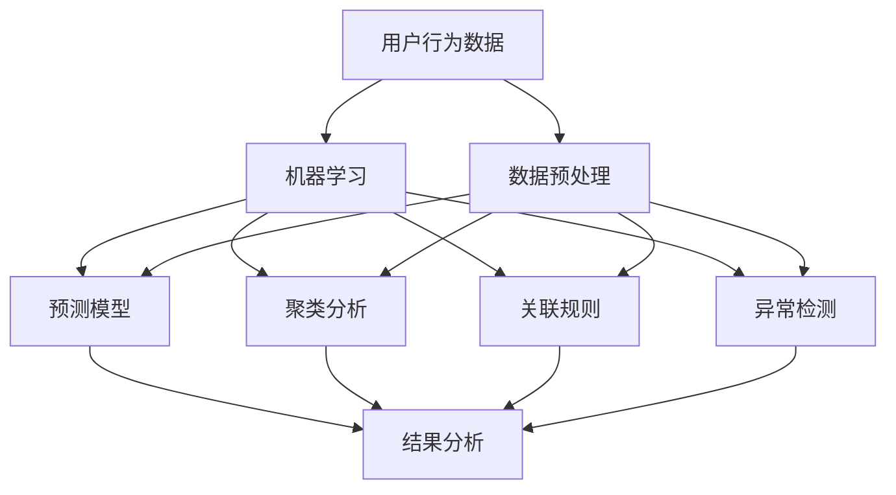

                 

# 如何进行有效的用户行为分析

> 关键词：用户行为分析, 数据收集, 数据预处理, 机器学习, 聚类分析, 关联规则, 预测模型, 异常检测, 安全防护, 隐私保护

## 1. 背景介绍

### 1.1 问题由来

在当今数字化时代，数据已经成为了企业竞争的核心资源之一。通过对用户行为数据的深入分析和挖掘，企业能够获得宝贵的商业洞察，提升产品和服务质量，优化用户体验。用户行为分析旨在从用户与产品或服务的互动中，提取有价值的信息，用于指导企业决策和业务创新。

然而，随着用户行为数据量的激增，如何高效、准确地进行行为分析成为了一个挑战。传统的数据分析方法往往依赖专家经验和手工编程，难以应对大规模数据和多维度分析的需求。为了提升行为分析的效率和精度，需要引入先进的数据科学和机器学习技术，进行系统的分析和建模。

### 1.2 问题核心关键点

进行有效的用户行为分析，关键在于以下几个方面：

- 数据收集：获取全面的用户行为数据，覆盖线上线下多渠道和多场景。
- 数据预处理：对原始数据进行清洗、转换和特征工程，提高数据质量和可用性。
- 模型选择：选择合适的机器学习算法和模型结构，适应不同的行为分析任务。
- 特征提取：从原始数据中提取有意义的特征，增强模型的预测能力。
- 结果分析：对模型输出进行可视化分析和解释，形成可操作的商业洞察。
- 隐私保护：在分析过程中注意用户隐私保护，确保数据使用的合规性和安全性。

## 2. 核心概念与联系

### 2.1 核心概念概述

为更好地理解用户行为分析的技术框架和流程，本节将介绍几个核心概念：

- 用户行为数据(User Behavior Data)：用户在使用产品或服务过程中，产生的各类行为数据，如点击、浏览、购买、搜索等。
- 数据预处理(Data Preprocessing)：对原始数据进行清洗、转换、去重、归一化等操作，提高数据质量和可用性。
- 机器学习(Machine Learning)：通过训练模型，从数据中学习规律和模式，实现对用户行为的预测和分类。
- 聚类分析(Cluster Analysis)：将数据集划分为若干群组，发现数据的内在结构和趋势。
- 关联规则(Association Rule)：从数据中挖掘出各项行为之间的关联关系，发现潜在的模式和规律。
- 预测模型(Prediction Model)：使用历史行为数据训练模型，预测用户未来的行为和偏好。
- 异常检测(Anomaly Detection)：识别异常行为数据，发现潜在的安全问题和用户需求。
- 隐私保护(Privacy Protection)：在数据收集和分析过程中，保护用户隐私，确保数据使用的合规性和安全性。

这些核心概念之间的逻辑关系可以通过以下Mermaid流程图来展示：



这个流程图展示了用户行为分析的主要流程和技术手段：

1. 收集用户行为数据。
2. 对原始数据进行预处理。
3. 运用机器学习技术，进行聚类分析、关联规则挖掘、预测模型训练和异常检测。
4. 对模型输出结果进行分析，形成可操作的商业洞察。

## 3. 核心算法原理 & 具体操作步骤
### 3.1 算法原理概述

用户行为分析的本质是数据驱动的决策支持过程。通过对用户行为数据的收集、预处理和建模，从数据中挖掘规律和模式，用于指导企业决策和业务创新。

用户行为分析的流程通常包括以下几个步骤：

1. 数据收集：获取全面的用户行为数据，覆盖线上线下多渠道和多场景。
2. 数据预处理：对原始数据进行清洗、转换和特征工程，提高数据质量和可用性。
3. 模型选择：选择合适的机器学习算法和模型结构，适应不同的行为分析任务。
4. 特征提取：从原始数据中提取有意义的特征，增强模型的预测能力。
5. 模型训练和评估：使用训练集对模型进行训练，并在验证集和测试集上评估模型性能。
6. 结果分析：对模型输出进行可视化分析和解释，形成可操作的商业洞察。
7. 持续优化：根据反馈和实时数据，不断调整模型和分析方法，提升分析效果。

### 3.2 算法步骤详解

用户行为分析的具体步骤如下：

**Step 1: 数据收集**
- 收集用户行为数据，覆盖线上线下多渠道和多场景。
- 数据类型包括点击流数据、搜索数据、交易数据、互动数据等。
- 数据格式包括日志文件、API接口调用记录、数据库记录等。
- 数据量庞大，通常需要分布式存储和处理。

**Step 2: 数据预处理**
- 对原始数据进行清洗，去除无效数据和噪声。
- 对缺失值进行填充或删除，确保数据完整性。
- 对数据进行归一化、去重、标准化等操作，提高数据质量和可用性。
- 进行特征工程，提取有意义的特征，如用户ID、行为类型、行为时间、行为频率等。

**Step 3: 模型选择**
- 选择合适的机器学习算法和模型结构，如分类、回归、聚类、关联规则等。
- 分类模型用于用户行为分类，如用户活跃度分类。
- 回归模型用于预测用户行为，如预测用户购买金额。
- 聚类模型用于用户分群，如发现不同用户群体的行为模式。
- 关联规则模型用于挖掘行为关联，如发现商品组合购买规律。

**Step 4: 特征提取**
- 从原始数据中提取有意义的特征，如行为时间、行为频率、行为时长、行为路径等。
- 使用特征选择和降维技术，提高特征质量。
- 使用正则化、降维、PCA等方法，减少特征维度。
- 对特征进行归一化和标准化，增强模型预测能力。

**Step 5: 模型训练和评估**
- 使用训练集对模型进行训练，并在验证集和测试集上评估模型性能。
- 分类模型使用准确率、召回率、F1分数等指标进行评估。
- 回归模型使用均方误差、均方根误差、R²等指标进行评估。
- 聚类模型使用轮廓系数、Calinski-Harabasz指数等指标进行评估。
- 关联规则模型使用支持度和置信度等指标进行评估。

**Step 6: 结果分析**
- 对模型输出进行可视化分析和解释，形成可操作的商业洞察。
- 使用可视化工具，如Tableau、Power BI等，展示分析结果。
- 使用文本分析和自然语言处理技术，对分析结果进行解释和说明。
- 结合业务需求，形成具体的商业洞察和决策建议。

**Step 7: 持续优化**
- 根据反馈和实时数据，不断调整模型和分析方法，提升分析效果。
- 使用在线学习技术，实时更新模型参数，适应数据分布变化。
- 使用A/B测试等方法，验证分析结果的准确性和效果。
- 结合行业趋势和市场变化，不断优化分析方法和模型结构。

### 3.3 算法优缺点

用户行为分析的优点在于：

- 数据驱动决策：基于数据建模和分析，减少主观偏见，提升决策的科学性和准确性。
- 多维度分析：覆盖线上线下多渠道和多场景，提供全面的用户行为洞察。
- 实时性：能够实时获取和分析用户行为数据，提升业务反应速度。
- 自动化：使用机器学习和自动化技术，减少人工干预，提高分析效率。
- 可扩展性：适应大规模数据和多维度分析需求，具有高度的可扩展性。

同时，该方法也存在一定的局限性：

- 数据质量依赖：分析结果的质量和准确性，高度依赖于数据质量和预处理效果。
- 模型选择复杂：不同的分析任务需要选择合适的模型，模型选择和调参复杂。
- 特征工程困难：高质量特征的提取和选择，需要丰富的经验和专业知识。
- 结果解释性不足：模型输出难以解释，难以形成可操作的商业洞察。
- 数据隐私问题：在数据收集和分析过程中，需要注意用户隐私保护，确保数据使用的合规性和安全性。

尽管存在这些局限性，但就目前而言，用户行为分析的机器学习方法仍然是大数据分析和商业洞察的主要范式。未来相关研究的重点在于如何进一步提升分析效率和精度，提高结果的可解释性，同时兼顾数据隐私和安全。

### 3.4 算法应用领域

用户行为分析的机器学习方法，已经在多个领域得到广泛应用，如电商、金融、医疗、教育等，以下是几个典型应用场景：

- **电商行业**：通过分析用户行为数据，优化商品推荐系统，提升用户体验和转化率。
- **金融行业**：通过行为分析识别潜在风险用户，防范欺诈和信用风险，提升风险管理能力。
- **医疗行业**：通过行为分析预测疾病风险，提供个性化诊疗建议，改善医疗服务。
- **教育行业**：通过分析学生行为数据，个性化推荐学习资源，提高学习效果。
- **媒体行业**：通过行为分析优化广告投放策略，提升广告效果和用户粘性。

除了上述这些领域外，用户行为分析技术还在广告、旅游、物流、娱乐等众多领域得到应用，推动了行业数字化转型的进程。

## 4. 数学模型和公式 & 详细讲解
### 4.1 数学模型构建

用户行为分析的核心在于数据建模和预测，以下是几个常见的数学模型及其构建过程：

**1. 分类模型（如逻辑回归、支持向量机）**
- 目标：将用户行为分类，如活跃用户和非活跃用户。
- 输入：用户行为数据。
- 输出：用户分类结果。
- 模型：
  $$
  \hat{y} = f(\theta, x) = \text{sigmoid}(\sum_{i=1}^n \theta_i x_i)
  $$
  其中 $\theta$ 为模型参数，$x$ 为输入特征向量，$y$ 为标签，$f$ 为激活函数。

**2. 回归模型（如线性回归、随机森林）**
- 目标：预测用户行为数值，如用户购买金额。
- 输入：用户行为数据。
- 输出：用户行为预测结果。
- 模型：
  $$
  \hat{y} = \theta^T x + \beta
  $$
  其中 $\theta$ 为回归系数，$x$ 为输入特征向量，$y$ 为标签。

**3. 聚类模型（如K-means、层次聚类）**
- 目标：将用户行为数据划分为若干群组，发现数据的内在结构和趋势。
- 输入：用户行为数据。
- 输出：用户分群结果。
- 模型：
  $$
  \min_{\mu_k, \sigma_k} \sum_{i=1}^n \sum_{k=1}^K \min_{1\leq j\leq K} (||x_i - \mu_j||^2_2)
  $$
  其中 $\mu_k$ 为聚类中心，$\sigma_k$ 为簇内方差，$x_i$ 为样本点，$K$ 为聚类数目。

**4. 关联规则模型（如Apriori、FP-Growth）**
- 目标：从数据中挖掘出各项行为之间的关联关系，发现潜在的模式和规律。
- 输入：用户行为数据。
- 输出：关联规则结果。
- 模型：
  $$
  L_i = \bigcup_{j\in I_i} L_j \setminus L_i
  $$
  其中 $L_i$ 为频繁项集，$I_i$ 为前驱频繁项集，$L_j$ 为候选频繁项集。

### 4.2 公式推导过程

以K-means聚类模型为例，推导其基本公式：

1. 初始化聚类中心 $\mu_k$：
   $$
   \mu_k = \frac{1}{|C_k|}\sum_{x_i \in C_k} x_i
   $$
   其中 $C_k$ 为第 $k$ 类别的样本集合。

2. 计算样本点与聚类中心的距离：
   $$
   d(x_i, \mu_k) = ||x_i - \mu_k||_2
   $$
   其中 $x_i$ 为样本点，$\mu_k$ 为聚类中心，$||\cdot||_2$ 为欧几里得距离。

3. 将样本点分配到最近的聚类中心：
   $$
   C_k = \{ x_i | d(x_i, \mu_k) < d(x_i, \mu_j), \forall j \neq k \}
   $$

4. 更新聚类中心：
   $$
   \mu_k = \frac{1}{|C_k|}\sum_{x_i \in C_k} x_i
   $$

5. 迭代更新直到收敛：
   $$
   \text{停止条件} = ||\mu_k^{t+1} - \mu_k^t||_2 < \epsilon
   $$
   其中 $\epsilon$ 为预设的收敛阈值。

### 4.3 案例分析与讲解

以电商行业的用户行为分析为例，展示机器学习模型的应用：

**1. 用户分类**
- 目标：将用户分为活跃用户和沉睡用户。
- 输入：用户点击行为、浏览行为、购买行为等。
- 输出：用户分类结果。
- 模型：逻辑回归。
- 案例分析：
  - 收集用户点击、浏览、购买等行为数据。
  - 对原始数据进行预处理，提取特征如点击次数、浏览时长、购买金额等。
  - 使用逻辑回归模型进行训练，预测用户是否为活跃用户。
  - 根据模型输出，对用户进行分类。

**2. 行为预测**
- 目标：预测用户未来的购买行为。
- 输入：用户历史购买行为、浏览行为、点击行为等。
- 输出：用户购买金额。
- 模型：线性回归。
- 案例分析：
  - 收集用户历史购买、浏览、点击等行为数据。
  - 对原始数据进行预处理，提取特征如购买次数、浏览时长、点击次数等。
  - 使用线性回归模型进行训练，预测用户未来的购买金额。
  - 根据模型输出，优化商品推荐策略，提升用户转化率。

**3. 用户分群**
- 目标：将用户分为不同群体，发现不同群体的行为特征。
- 输入：用户购买行为、浏览行为、互动行为等。
- 输出：用户分群结果。
- 模型：K-means聚类。
- 案例分析：
  - 收集用户购买、浏览、互动等行为数据。
  - 对原始数据进行预处理，提取特征如购买金额、浏览时长、互动频率等。
  - 使用K-means聚类模型进行训练，将用户分为不同群体。
  - 根据不同群体的特征，优化产品推荐和营销策略。

## 5. 项目实践：代码实例和详细解释说明
### 5.1 开发环境搭建

在进行用户行为分析项目实践前，我们需要准备好开发环境。以下是使用Python进行Scikit-learn开发的Python环境配置流程：

1. 安装Anaconda：从官网下载并安装Anaconda，用于创建独立的Python环境。

2. 创建并激活虚拟环境：
```bash
conda create -n user-behavior-env python=3.8 
conda activate user-behavior-env
```

3. 安装Scikit-learn：
```bash
pip install scikit-learn pandas numpy matplotlib jupyter notebook ipython
```

4. 安装各类工具包：
```bash
pip install tensorflow tensorflow-estimator tensorflow-hub
```

完成上述步骤后，即可在`user-behavior-env`环境中开始项目实践。

### 5.2 源代码详细实现

下面我们以电商行业中的用户分类任务为例，给出使用Scikit-learn对K-means聚类模型进行训练的Python代码实现。

```python
import pandas as pd
from sklearn.cluster import KMeans
from sklearn.preprocessing import StandardScaler
from sklearn.decomposition import PCA

# 读取数据
data = pd.read_csv('user_behavior_data.csv')

# 特征工程
X = data[['click_count', 'browsing_time', 'purchase_amount']]
X = StandardScaler().fit_transform(X)

# K-means聚类
kmeans = KMeans(n_clusters=3, random_state=42)
kmeans.fit(X)

# 输出聚类结果
labels = kmeans.labels_
print(labels)
```

以上代码展示了使用Scikit-learn对K-means聚类模型进行训练的完整过程。

### 5.3 代码解读与分析

让我们再详细解读一下关键代码的实现细节：

**数据读取与特征工程**
- `pd.read_csv`函数：读取用户行为数据。
- `StandardScaler`函数：对数据进行标准化处理，避免不同特征量纲不一致导致的偏差。
- `PCA`函数：对数据进行降维，降低维度并减少计算复杂度。

**K-means聚类模型**
- `KMeans`函数：实例化K-means聚类模型。
- `n_clusters`参数：设置聚类数目为3。
- `random_state`参数：设置随机种子，确保模型可复现。
- `fit`函数：使用训练集数据对模型进行训练。
- `labels_`属性：获取模型输出的聚类标签。

**代码执行与结果分析**
- `print`函数：输出聚类标签，用于后续分析。
- 通过可视化工具，如Matplotlib和Seaborn，可以对聚类结果进行展示，进行深入分析。

## 6. 实际应用场景
### 6.1 智能客服系统

智能客服系统可以通过用户行为分析，提升客户服务体验和运营效率。传统的客服系统主要依赖人工处理，响应速度慢，服务质量不稳定。通过收集用户与客服的互动数据，分析用户需求和行为特征，智能客服系统可以自动理解用户问题，提供个性化回复，提升服务效率和用户满意度。

在技术实现上，可以构建基于自然语言处理和机器学习的智能客服模型，通过分析用户的言语和行为特征，自动匹配答案模板或生成回复。结合用户历史行为数据，智能客服系统还可以进行个性化推荐和预判，及时解决问题。

### 6.2 金融风控系统

金融风控系统通过用户行为分析，识别潜在风险用户，防范欺诈和信用风险。传统的风控系统主要依赖规则引擎和人工审核，难以覆盖复杂的风险场景。通过收集用户交易数据、行为数据和社交数据，分析用户的交易行为、信用记录和社交关系，金融风控系统可以自动发现异常交易和风险用户，提升风险管理能力。

在技术实现上，可以构建基于深度学习和特征工程的金融风控模型，通过分析用户行为数据和交易数据，预测用户的违约概率和欺诈风险。结合异常检测和规则引擎，金融风控系统可以实时监控风险，及时采取措施，保障金融安全。

### 6.3 个性化推荐系统

个性化推荐系统通过用户行为分析，优化商品推荐策略，提升用户转化率和满意度。传统的推荐系统主要依赖固定规则和用户历史行为数据，难以应对多变的用户需求。通过收集用户浏览、点击、购买等行为数据，分析用户的兴趣偏好和行为模式，个性化推荐系统可以自动匹配用户需求，提供个性化推荐。

在技术实现上，可以构建基于协同过滤和深度学习的个性化推荐模型，通过分析用户行为数据和商品数据，预测用户对商品的兴趣程度。结合用户历史行为数据，个性化推荐系统可以实时更新推荐策略，提升推荐效果。

### 6.4 未来应用展望

未来，用户行为分析技术将在更多领域得到应用，推动产业数字化转型的进程：

- **智能制造**：通过分析员工和设备的行为数据，优化生产流程，提升生产效率。
- **智慧交通**：通过分析车辆和行人的行为数据，优化交通管理，提升出行效率。
- **智能家居**：通过分析家庭成员的行为数据，优化家居控制，提升生活品质。
- **智慧医疗**：通过分析患者和医生的行为数据，优化诊疗流程，提升医疗服务。
- **智慧农业**：通过分析农业设备和农民的行为数据，优化种植管理，提升农业产量。

## 7. 工具和资源推荐
### 7.1 学习资源推荐

为了帮助开发者系统掌握用户行为分析的理论基础和实践技巧，这里推荐一些优质的学习资源：

1. 《Python数据科学手册》系列博文：由大数据领域专家撰写，深入浅出地介绍了数据收集、预处理、建模和分析等基本概念和技术。

2. 《机器学习实战》课程：由Google机器学习团队开发的入门级课程，涵盖数据预处理、特征工程、模型选择和评估等关键内容。

3. 《TensorFlow实战》书籍：由TensorFlow官方文档团队编写的实战手册，介绍了TensorFlow的各项功能和应用案例。

4. Kaggle：数据科学竞赛平台，提供丰富的数据集和模型代码，适合学习机器学习技术和数据分析方法。

5. GitHub：开源社区，提供丰富的用户行为分析代码和模型，适合学习和分享实践经验。

通过对这些资源的学习实践，相信你一定能够快速掌握用户行为分析的精髓，并用于解决实际的商业问题。

### 7.2 开发工具推荐

高效的开发离不开优秀的工具支持。以下是几款用于用户行为分析开发的常用工具：

1. Python：开源编程语言，支持丰富的数据科学和机器学习库，如Pandas、Scikit-learn、TensorFlow等。

2. R语言：开源统计语言，支持数据预处理、特征工程、建模和可视化，适用于数据分析和统计学研究。

3. Jupyter Notebook：交互式编程环境，支持Python、R等多种语言，适合数据科学学习和研究。

4. Tableau：数据可视化工具，支持复杂的交互式可视化分析，适合商业洞察和决策支持。

5. Power BI：数据可视化工具，支持商业智能和数据分析，适合数据驱动的商业决策。

6. Apache Spark：大数据处理框架，支持分布式数据处理和机器学习，适合大规模数据分析和建模。

合理利用这些工具，可以显著提升用户行为分析的开发效率，加快创新迭代的步伐。

### 7.3 相关论文推荐

用户行为分析技术的发展得益于学界的持续研究。以下是几篇奠基性的相关论文，推荐阅读：

1. "Data Mining and Statistical Learning" by Jeff A. Bilmes：介绍了数据挖掘和统计学习的基本概念和算法，适合初学者入门。

2. "Machine Learning Yearning" by Andrew Ng：由深度学习大师Andrew Ng撰写的实战手册，介绍了机器学习项目的实践方法。

3. "Pattern Recognition and Machine Learning" by Christopher Bishop：深度学习领域的经典教材，介绍了各种机器学习算法和模型。

4. "Clustering Algorithms" by J.C. Bezdek等：介绍了聚类算法的理论基础和实现方法，适合深入研究聚类分析。

5. "Association Rules" by R. Agrawal和R.S. Srikant：介绍了关联规则挖掘的理论基础和算法实现，适合深入研究商品组合分析和推荐系统。

这些论文代表了大数据分析和机器学习技术的发展脉络。通过学习这些前沿成果，可以帮助研究者把握学科前进方向，激发更多的创新灵感。

## 8. 总结：未来发展趋势与挑战
### 8.1 总结

本文对用户行为分析的机器学习方法进行了全面系统的介绍。首先阐述了用户行为分析的背景和意义，明确了机器学习方法在数据驱动决策中的重要性。其次，从原理到实践，详细讲解了用户行为分析的数学模型和关键步骤，给出了机器学习模型的代码实例。同时，本文还探讨了用户行为分析在智能客服、金融风控、个性化推荐等多个行业领域的应用前景，展示了机器学习方法在现实世界的广泛应用。此外，本文精选了用户行为分析技术的各类学习资源，力求为读者提供全方位的技术指引。

通过本文的系统梳理，可以看到，用户行为分析的机器学习方法已经在多个领域得到了广泛应用，为商业决策和业务创新提供了有力支持。未来，伴随机器学习技术的不断进步，用户行为分析必将迎来新的突破和发展。

### 8.2 未来发展趋势

展望未来，用户行为分析技术将呈现以下几个发展趋势：

1. 模型自动化：使用自动机器学习技术，简化模型选择和调参过程，提高模型效率和可解释性。
2. 多模态分析：结合视觉、语音、文本等多模态数据，构建更加全面、复杂的行为分析模型。
3. 实时分析：引入流式数据处理技术，实现实时行为分析和预测，提升业务响应速度。
4. 联邦学习：通过分布式数据协同训练，保护用户隐私的同时，提升模型性能和泛化能力。
5. 可解释性增强：使用因果推断和可视化技术，提高模型的可解释性和透明度。
6. 跨领域应用：将用户行为分析技术推广到更多行业领域，推动产业数字化转型。

这些趋势展示了用户行为分析技术的广阔前景，为未来的发展提供了新的方向。

### 8.3 面临的挑战

尽管用户行为分析的机器学习方法已经取得了显著进展，但在迈向更加智能化、普适化应用的过程中，仍面临诸多挑战：

1. 数据质量瓶颈：行为分析结果的质量和准确性，高度依赖于数据质量和预处理效果。
2. 模型选择复杂：不同的分析任务需要选择合适的模型，模型选择和调参复杂。
3. 特征工程困难：高质量特征的提取和选择，需要丰富的经验和专业知识。
4. 结果解释性不足：模型输出难以解释，难以形成可操作的商业洞察。
5. 数据隐私问题：在数据收集和分析过程中，需要注意用户隐私保护，确保数据使用的合规性和安全性。

尽管存在这些挑战，但机器学习技术的不断进步，使得用户行为分析方法在现实世界中的应用变得更加广泛和深入。

### 8.4 研究展望

面对用户行为分析所面临的种种挑战，未来的研究需要在以下几个方面寻求新的突破：

1. 探索自动化和半自动化机器学习技术：简化模型选择和调参过程，提高模型效率和可解释性。
2. 融合多模态数据：结合视觉、语音、文本等多模态数据，构建更加全面、复杂的行为分析模型。
3. 引入在线学习技术：实时更新模型参数，适应数据分布变化，提升模型性能。
4. 增强模型可解释性：使用因果推断和可视化技术，提高模型的可解释性和透明度。
5. 探索联邦学习技术：保护用户隐私的同时，提升模型性能和泛化能力。

这些研究方向的探索，必将引领用户行为分析技术迈向更高的台阶，为构建智能化的商业决策系统和业务创新提供新的技术路径。

## 9. 附录：常见问题与解答

**Q1：用户行为分析是否适用于所有行业？**

A: 用户行为分析在绝大多数行业中都有广泛应用，如电商、金融、医疗、教育等。但对于一些特定领域，如农业、能源、交通等，由于数据量小或难以获取，行为分析的难度较大。需要针对具体情况，选择合适的分析方法和技术。

**Q2：如何选择合适的机器学习算法？**

A: 选择合适的机器学习算法需要考虑多个因素，如数据量、数据类型、任务类型等。一般来说，分类任务可以使用逻辑回归、支持向量机、决策树等算法，回归任务可以使用线性回归、随机森林、梯度提升机等算法，聚类任务可以使用K-means、层次聚类、DBSCAN等算法，关联规则任务可以使用Apriori、FP-Growth等算法。同时，也可以参考已有的成功案例和行业实践，选择合适的算法。

**Q3：如何保证用户数据隐私？**

A: 在数据收集和分析过程中，需要严格遵守数据隐私保护法规，如GDPR、CCPA等。具体措施包括：
1. 数据匿名化：对用户数据进行去标识化处理，保护用户隐私。
2. 数据加密：对敏感数据进行加密存储和传输，防止数据泄露。
3. 用户授权：在收集和分析用户数据前，明确告知用户并获取其同意。
4. 数据去重：对重复数据进行去重处理，避免数据冗余。
5. 数据最小化：只收集和使用必要的数据，避免过度收集和分析。

通过采取这些措施，可以确保用户数据隐私得到有效保护，符合相关法律法规的要求。

**Q4：如何进行数据预处理？**

A: 数据预处理是用户行为分析的关键步骤，通常包括以下几个步骤：
1. 数据清洗：去除无效数据和噪声，如缺失值、异常值等。
2. 数据转换：对数据进行标准化、归一化、离散化等操作，增强数据的可比性。
3. 数据降维：使用PCA、LDA等技术，降低数据维度，减少计算复杂度。
4. 特征选择：选择有意义的特征，提高特征质量和模型的预测能力。
5. 数据合并：将多个数据源合并，形成统一的数据集。

通过合理的预处理，可以提升数据的可用性和分析效果。

---

作者：禅与计算机程序设计艺术 / Zen and the Art of Computer Programming

