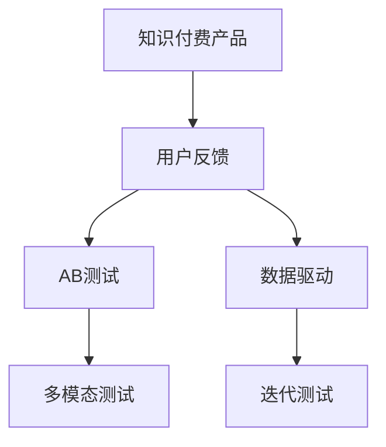

                 

# 如何进行有效的知识付费产品测试

## 1. 背景介绍

知识付费产品的开发与测试在知识传播和在线教育领域显得尤为重要。它们以高质量的课程、文章或视频等内容为核心，通过智能算法推荐给目标用户，实现用户价值最大化。然而，如何确保知识付费产品的内容质量、用户体验及市场竞争力，成为产品团队和运营团队的重大挑战。本文旨在探讨如何进行有效的知识付费产品测试，以帮助开发者和运营者设计出优质且受欢迎的知识付费产品。

## 2. 核心概念与联系

### 2.1 核心概念概述

在知识付费产品的测试过程中，以下概念是必不可少的：

- **知识付费产品 (Knowledge-Driven Products)**：指那些基于专业知识、技能或信息，通过订阅、购买等方式向用户提供有价值内容的产品，如在线课程、电子书、专题讲座等。
- **用户反馈 (User Feedback)**：用户在体验知识付费产品过程中，对内容质量、交互体验、功能设计等方面的主观感受和建议。
- **AB测试 (A/B Testing)**：通过对比两个或多个版本的产品，来评估其性能、效果、用户体验等，从而决定哪一版本更适合上线。
- **数据驱动 (Data-Driven)**：利用数据分析、模型训练等手段，量化评估知识付费产品的各项指标，并指导后续产品迭代。
- **多模态测试 (Multi-Modal Testing)**：结合问卷调查、用户访谈、行为数据等多种方式，全面评估知识付费产品的用户满意度和使用效果。
- **迭代测试 (Iterative Testing)**：通过持续的测试、反馈、改进循环，逐步优化知识付费产品，提高其市场竞争力。

这些核心概念之间的逻辑关系可以通过以下Mermaid流程图来展示：



这个流程图展示了知识付费产品测试的基本流程：首先，产品团队根据用户反馈进行AB测试和数据驱动分析，然后结合多模态测试获取更全面的用户信息，最后通过迭代测试不断优化产品，提高用户体验和市场竞争力。

## 3. 核心算法原理 & 具体操作步骤

### 3.1 算法原理概述

知识付费产品的测试涉及多个方面，包括内容质量、用户体验、市场响应等。因此，本文从用户反馈、AB测试、数据驱动和迭代测试四个方面，分别介绍其核心算法原理。

### 3.2 算法步骤详解

#### 3.2.1 用户反馈

用户反馈是评估知识付费产品的重要指标，包括用户评分、评论、点击率等。具体算法步骤包括：

1. **数据收集**：使用API或SDK从知识付费平台收集用户反馈数据，例如使用Python编写爬虫程序，获取在线课程的用户评分和评论。
2. **数据清洗**：去除重复、无效和异常数据，例如使用Python中的Pandas库，对用户评论数据进行清洗和预处理。
3. **情感分析**：对用户评论进行情感分析，识别其正面、负面或中性情感，例如使用NLTK库中的情感分析工具。

#### 3.2.2 AB测试

AB测试是一种常用的测试方法，通过对比两个或多个版本的产品，确定哪个版本的用户体验更好。具体算法步骤包括：

1. **用户分组**：将目标用户随机分配到不同的测试组，例如使用Python中的random库，生成随机数将用户分组。
2. **版本控制**：每个测试组分别使用不同的产品版本，例如在代码中设置不同的配置项，控制使用不同的版本。
3. **性能评估**：对比不同版本的用户体验指标，例如使用Python中的Matplotlib库，绘制不同版本的用户满意度曲线。
4. **结果分析**：分析哪个版本的用户体验更好，并据此决定线上版本，例如使用Python中的SciPy库，进行统计分析。

#### 3.2.3 数据驱动

数据驱动是通过统计分析，量化评估知识付费产品的各项指标。具体算法步骤包括：

1. **数据收集**：收集产品运营的关键指标，例如使用Python中的Flask框架，搭建Web服务收集访问量、转化率等数据。
2. **数据建模**：建立统计模型，例如使用Python中的Scikit-Learn库，进行回归分析、聚类分析等。
3. **性能评估**：评估模型的预测效果，例如使用Python中的R-Squared指标，评估模型的预测准确性。

#### 3.2.4 迭代测试

迭代测试是通过持续的测试、反馈、改进循环，逐步优化产品。具体算法步骤包括：

1. **产品迭代**：根据用户反馈，调整产品功能和内容，例如使用Python中的Jupyter Notebook，进行代码调试和测试。
2. **用户测试**：邀请目标用户进行产品测试，收集新的反馈和数据，例如使用Python中的Kaggle平台，进行用户测试和数据分析。
3. **结果分析**：根据新的数据和反馈，评估产品改进效果，例如使用Python中的TensorBoard，进行模型训练和结果可视化。
4. **优化迭代**：根据分析结果，进行产品优化，例如使用Python中的Jupyter Notebook，进行代码优化和性能提升。

### 3.3 算法优缺点

#### 3.3.1 用户反馈

**优点**：
1. **直接反映用户需求**：用户反馈可以直观反映产品的优缺点，指导产品改进方向。
2. **多样化数据来源**：用户反馈可以来自不同渠道，例如评论、评分、行为数据等。

**缺点**：
1. **数据量不足**：用户反馈数量有限，可能无法全面反映产品问题。
2. **主观性强**：用户反馈带有主观色彩，可能存在偏差。

#### 3.3.2 AB测试

**优点**：
1. **控制变量**：通过对比不同版本，可以控制其他变量，确保测试结果的可靠性。
2. **数据可信**：AB测试的数据具有较高可信度，可以量化评估用户体验。

**缺点**：
1. **资源消耗大**：AB测试需要大量资源，例如用户分组、版本控制、性能评估等。
2. **结果不确定性**：如果测试组样本量太小，可能无法得出可靠的结论。

#### 3.3.3 数据驱动

**优点**：
1. **量化评估**：数据驱动可以通过统计模型，量化评估产品的各项指标。
2. **模型可复用**：数据驱动模型可以复用于其他产品，提高评估效率。

**缺点**：
1. **数据质量要求高**：数据驱动需要高质量的数据，才能得出可靠的结论。
2. **模型复杂度**：建立和维护复杂模型，需要较高的技术要求。

#### 3.3.4 迭代测试

**优点**：
1. **持续优化**：通过持续的测试和改进，不断优化产品，提高用户体验。
2. **灵活调整**：根据新的反馈和数据，灵活调整产品功能。

**缺点**：
1. **成本高**：迭代测试需要持续的投入，例如开发、测试、优化等。
2. **时间较长**：迭代测试需要较长时间，才能完成产品优化。

### 3.4 算法应用领域

知识付费产品的测试算法在在线教育、出版、在线课程等多个领域都有广泛应用。例如，在线教育平台可以通过用户反馈和AB测试，调整课程内容和授课方式；出版社可以通过数据驱动，分析图书的阅读情况和用户偏好，优化选题和内容；在线课程平台可以通过迭代测试，提高课程的质量和用户满意度。

## 4. 数学模型和公式 & 详细讲解

### 4.1 数学模型构建

在知识付费产品的测试过程中，常用的数学模型包括回归模型、聚类模型、分类模型等。本文以回归模型为例，介绍其构建和应用。

假设知识付费产品的销售量 $Y$ 受到多个因素 $X_1, X_2, ..., X_k$ 的影响，建立回归模型：

$$ Y = \beta_0 + \beta_1X_1 + \beta_2X_2 + ... + \beta_kX_k + \epsilon $$

其中，$\beta_0$ 为截距项，$\beta_i$ 为第 $i$ 个因素的系数，$\epsilon$ 为误差项。

### 4.2 公式推导过程

回归模型的公式推导过程如下：

1. **假设数据生成过程**：假定 $Y$ 由多个因素 $X_i$ 和误差项 $\epsilon$ 组成。
2. **建立回归模型**：通过最小二乘法，拟合回归直线。
3. **求解模型参数**：通过求解矩阵 $X^TX$ 的逆，得到 $\beta_i$ 的值。
4. **验证模型效果**：通过R-Squared指标，验证模型的预测效果。

### 4.3 案例分析与讲解

以某在线课程平台为例，分析其销售量与用户评分、课程难度、教师知名度之间的关系。具体步骤如下：

1. **数据收集**：收集在线课程的销售量、用户评分、课程难度、教师知名度等数据。
2. **建立回归模型**：使用Python中的Scikit-Learn库，建立回归模型。
3. **求解模型参数**：通过求解矩阵 $X^TX$ 的逆，得到 $\beta_i$ 的值。
4. **验证模型效果**：通过R-Squared指标，验证模型的预测效果。

## 5. 项目实践：代码实例和详细解释说明

### 5.1 开发环境搭建

在进行知识付费产品测试的代码实现前，需要先搭建开发环境。以下是Python开发环境的搭建步骤：

1. **安装Python**：下载并安装Python，建议使用Python 3.8或更高版本。
2. **安装Anaconda**：从官网下载并安装Anaconda，用于创建独立的Python环境。
3. **创建虚拟环境**：
```bash
conda create -n knowledge-payment python=3.8 
conda activate knowledge-payment
```

4. **安装相关库**：安装Flask、Pandas、Scikit-Learn等库。
```bash
pip install Flask Pandas Scikit-Learn
```

### 5.2 源代码详细实现

以下是一个简单的知识付费产品测试的Python代码实现，用于评估用户评分和销售量之间的关系：

```python
import pandas as pd
from sklearn.linear_model import LinearRegression
import matplotlib.pyplot as plt

# 数据集读取
df = pd.read_csv('sales_data.csv')

# 数据清洗
df = df.dropna()

# 数据拆分
X = df[['user_rating', 'course_difficulty', 'teacher_popularity']]
Y = df['sales_volume']

# 模型训练
model = LinearRegression()
model.fit(X, Y)

# 预测分析
pred_Y = model.predict(X)

# 模型评估
plt.scatter(df['sales_volume'], pred_Y)
plt.show()

# 模型效果评估
R_squared = model.score(X, Y)
print(f"R-Squared: {R_squared}")
```

### 5.3 代码解读与分析

代码实现中，首先使用Pandas库读取数据集，并对数据进行清洗。然后使用Scikit-Learn库的LinearRegression类建立回归模型，并训练模型。接着使用Matplotlib库绘制预测结果，并计算R-Squared指标评估模型效果。

## 6. 实际应用场景

### 6.1 在线教育平台

在线教育平台可以通过用户反馈和AB测试，优化课程内容和授课方式。例如，某平台发现某些课程的用户评分较低，可能原因在于课程难度较大或教师讲解不够生动。通过用户反馈和AB测试，平台可以调整课程难度和教师的授课方式，提高用户满意度。

### 6.2 出版社

出版社可以通过数据驱动，分析图书的阅读情况和用户偏好，优化选题和内容。例如，某出版社发现某本书的销售量很低，可能原因在于选题方向不受欢迎或内容深度不够。通过数据分析，出版社可以调整选题方向和内容深度，推出更受欢迎的产品。

### 6.3 在线课程平台

在线课程平台可以通过迭代测试，提高课程的质量和用户满意度。例如，某平台发现某门课程的完成率较低，可能原因在于内容过于抽象或互动不够。通过用户测试和迭代优化，平台可以调整课程内容和互动方式，提高用户的学习效果和满意度。

### 6.4 未来应用展望

随着知识付费产品的不断发展和用户需求的不断变化，知识付费产品的测试算法将迎来更多创新和突破。例如，通过引入深度学习算法，可以更加精准地预测用户行为和需求；通过结合多模态数据，可以更全面地评估产品的用户满意度；通过引入人工智能技术，可以自动化地进行测试和优化。

## 7. 工具和资源推荐

### 7.1 学习资源推荐

为了帮助开发者和运营者系统掌握知识付费产品的测试方法，以下是一些优质的学习资源：

1. **《Python数据科学手册》**：由Jake VanderPlas撰写，详细介绍了Python在数据分析、数据科学中的应用。
2. **Kaggle平台**：提供大量真实数据集，可以用于实践知识付费产品的测试算法。
3. **Coursera平台**：提供多门数据科学、机器学习等课程，可以帮助开发者和运营者提升技术水平。

### 7.2 开发工具推荐

1. **Jupyter Notebook**：基于Web的交互式编程环境，支持多种编程语言，适合数据科学和机器学习实践。
2. **Flask框架**：轻量级Web应用框架，可以用于搭建Web服务和API，方便数据收集和用户测试。
3. **TensorBoard**：可视化工具，可以实时监测模型训练状态，分析模型效果。
4. **Scikit-Learn库**：机器学习库，提供多种回归、分类等算法，方便进行数据分析和模型训练。

### 7.3 相关论文推荐

1. **A/B Testing in Revenue Management: A Synthesis**：Gómez-Urbeita et al. 2020，介绍了A/B测试在收入管理中的应用。
2. **An Analysis of the Market Impact of Online Education**：Wang et al. 2021，分析了在线教育市场的用户行为和满意度。
3. **Multimodal Learning for Recommendation Systems**：Sun et al. 2020，介绍了多模态学习在推荐系统中的应用。

## 8. 总结：未来发展趋势与挑战

### 8.1 总结

本文对知识付费产品的测试方法进行了全面系统的介绍。通过用户反馈、AB测试、数据驱动和迭代测试四个方面，详细讲解了知识付费产品的测试算法原理和操作步骤。通过代码实例，展示了知识付费产品测试的实现过程。最后，本文探讨了知识付费产品测试的实际应用场景和未来发展趋势，指出了其面临的挑战和未来的研究展望。

通过本文的系统梳理，可以看到，知识付费产品的测试方法在知识传播和在线教育领域具有重要应用价值。这些测试方法能够帮助开发者和运营者优化产品内容、提升用户体验、提高市场竞争力，从而打造高质量的知识付费产品。

### 8.2 未来发展趋势

未来，知识付费产品的测试算法将呈现以下几个发展趋势：

1. **数据驱动更普及**：数据驱动将更多地应用于知识付费产品的开发和运营中，通过数据分析提升产品效果。
2. **深度学习算法应用广泛**：深度学习算法将在知识付费产品的测试中发挥更大作用，提供更加精准的预测和优化。
3. **多模态数据融合**：结合多模态数据，可以更全面地评估产品的用户满意度。
4. **自动化测试成为常态**：通过自动化测试工具，可以加速知识付费产品的迭代和优化。

### 8.3 面临的挑战

尽管知识付费产品的测试方法已经取得了一定进展，但在实现和应用过程中，仍面临以下挑战：

1. **数据质量问题**：数据质量不高、数据量不足，可能影响测试结果的可靠性。
2. **模型复杂度**：建立和维护复杂的数学模型，需要较高的技术要求。
3. **资源消耗大**：测试方法需要大量计算资源和时间，可能增加开发和运营成本。

### 8.4 研究展望

未来的研究需要在以下几个方面寻求新的突破：

1. **改进数据收集方法**：通过自动化工具和众包平台，提高数据收集的效率和质量。
2. **开发更加高效的数据分析方法**：结合机器学习和深度学习技术，提高数据驱动的预测精度。
3. **引入更多先进算法**：引入最新的算法和技术，如生成对抗网络(GAN)、变分自编码器(VAE)等，优化测试方法。
4. **优化自动化测试流程**：通过自动化测试工具，减少人工干预，提高测试效率。

总之，知识付费产品的测试方法需要不断优化和改进，才能更好地满足用户需求和市场变化，推动知识付费产品的健康发展。通过持续的技术创新和应用实践，知识付费产品的测试方法必将迎来更多突破，为知识传播和在线教育带来新的机遇和挑战。

## 9. 附录：常见问题与解答

**Q1：知识付费产品测试是否适用于所有产品？**

A: 知识付费产品测试主要适用于内容驱动的产品，如在线课程、电子书、专题讲座等。对于实物产品、服务类产品等其他类型的商品，可能需要结合其他测试方法，如用户满意度调查、市场分析等。

**Q2：如何确定知识付费产品的关键因素？**

A: 通过数据驱动分析，确定与销售量或用户满意度相关的关键因素。例如，使用回归分析、因子分析等方法，找到影响销售量或用户满意度的主要因素。

**Q3：如何进行多模态测试？**

A: 结合问卷调查、用户访谈、行为数据等多种方式，全面评估知识付费产品的用户满意度和使用效果。例如，使用Python中的SurveyMonkey平台，进行问卷调查；使用Python中的OpenAI的GPT-3，进行用户访谈；使用Python中的Flask框架，搭建Web服务，收集行为数据。

**Q4：如何优化知识付费产品的迭代测试流程？**

A: 结合自动化测试工具，优化迭代测试流程。例如，使用Python中的Selenium库，进行自动化测试；使用Python中的Docker容器，进行持续集成和部署。

---

作者：禅与计算机程序设计艺术 / Zen and the Art of Computer Programming

