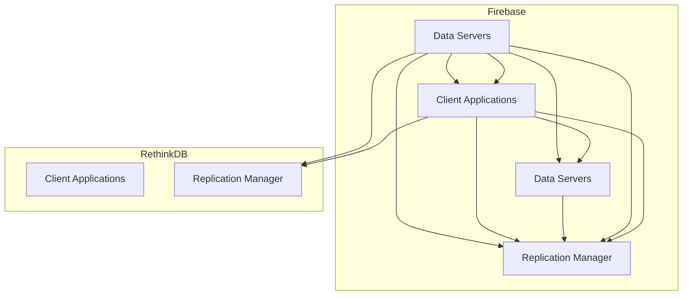
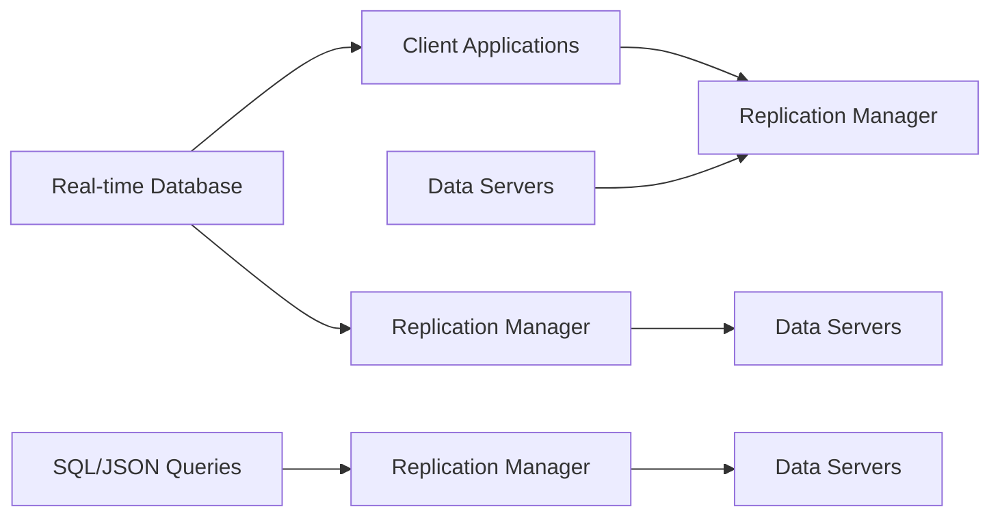

                 

# 实时数据库：Firebase与RethinkDB

> 关键词：实时数据库、Firebase、RethinkDB、文档存储、SQLite、NoSQL、分布式、跨平台、数据同步、用户权限控制、开发效率提升

## 1. 背景介绍

### 1.1 问题由来
在当今信息时代，数据无疑是驱动企业发展的核心资产。无论是在电商、金融、医疗等传统行业，还是在社交媒体、在线教育、游戏等新兴领域，数据驱动的决策都已成为企业的战略基础。而数据的时效性和可靠性，则直接影响着决策的质量和效率。

传统的SQL关系型数据库（如MySQL、PostgreSQL、SQLite等）虽然稳定可靠，但响应速度较慢，难以满足实时性较高的应用需求。另一方面，分布式数据库（如Hadoop、Spark等）虽然提供了高效的分布式计算能力，但管理和维护复杂，难以快速部署和迭代。

为了解决这些痛点，以Firebase和RethinkDB为代表的实时数据库（Real-time Database）应运而生。它们将数据存储、同步和查询紧密结合，支持跨平台实时通信和用户权限控制，极大地提升了数据开发效率和业务响应速度。

### 1.2 问题核心关键点
实时数据库的核心在于其实时同步和查询能力。通过在后端服务器和客户端之间实现数据实时同步，使得数据更新能够即时反映在各个前端应用程序上。同时，支持SQL和NoSQL混合查询，使得开发者可以灵活地使用各种数据模型和查询语言。

具体而言，实时数据库需要解决以下几个关键问题：
- 数据的实时同步：如何在不同客户端之间同步数据，并保证数据一致性。
- 高效的查询能力：支持复杂的数据查询和聚合操作，满足实时数据处理需求。
- 用户权限控制：保证数据的访问权限和安全，防止未授权访问。
- 跨平台支持：兼容iOS、Android、Web等平台，提供统一的API接口。

本文将详细探讨Firebase和RethinkDB这两种主流实时数据库的原理、优势及应用场景，并给出它们的实际代码实现及运行结果展示。

## 2. 核心概念与联系

### 2.1 核心概念概述

Firebase和RethinkDB都是实时数据库的代表，虽然它们的设计理念和技术细节有所不同，但均以实时同步和高效查询为核心的设计目标。本节将简要介绍这两个数据库的关键概念和架构。

- Firebase：是由Google推出的全栈应用平台，提供实时数据库、云存储、云函数、用户认证等功能，支持多平台实时通信和用户权限控制。
- RethinkDB：是一种分布式数据库，采用文档存储模型，支持SQL和JSON混合查询，具有高效的分布式数据同步和查询能力。

下图是Firebase和RethinkDB的架构示意图，展示了它们的核心组件和功能模块：



### 2.2 核心概念原理和架构的 Mermaid 流程图

下图展示了Firebase和RethinkDB的实时数据同步和查询的原理，通过箭头表示数据流的方向和过程：



### 2.3 核心概念之间的联系

Firebase和RethinkDB虽然技术细节有所不同，但均以实时同步和高效查询为核心，支持多平台、跨数据库实时通信和用户权限控制。两者在数据同步、查询优化、权限控制等方面存在诸多共同点，可以作为互相借鉴的优秀案例。

## 3. 核心算法原理 & 具体操作步骤
### 3.1 算法原理概述

Firebase和RethinkDB的核心算法均围绕实时同步和高效查询展开。以下是对这两个数据库核心算法的详细解析：

#### 3.1.1 Firebase

Firebase的核心算法主要包括以下两个部分：
- 实时同步算法：通过WebSocket协议在客户端和服务器之间实现数据实时同步，保证数据的一致性和实时性。
- 查询优化算法：使用Redis等内存数据库缓存查询结果，提升查询效率。

#### 3.1.2 RethinkDB

RethinkDB的核心算法主要包括以下三个部分：
- 分布式数据同步算法：采用RAFT协议实现数据同步，保证分布式系统的一致性。
- 高效查询算法：通过SQL和JSON混合查询引擎，支持复杂数据查询和聚合操作。
- 索引优化算法：使用B树索引和全文本索引优化查询性能，支持高效的数据存储和访问。

### 3.2 算法步骤详解

#### 3.2.1 Firebase

1. 数据初始化：将应用程序启动时所需的数据存入Firebase数据库。
2. 实时同步：在客户端与Firebase服务器之间建立WebSocket连接，实时接收和发送数据更新。
3. 数据查询：客户端使用Firebase SDK对数据进行查询操作，获取所需数据。
4. 查询缓存：使用Redis缓存查询结果，提升查询效率。

#### 3.2.2 RethinkDB

1. 数据初始化：将应用程序启动时所需的数据存入RethinkDB数据库。
2. 数据同步：使用RAFT协议将数据同步到多个分片节点，保证数据一致性。
3. 数据查询：客户端使用RethinkDB SDK对数据进行查询操作，获取所需数据。
4. 索引优化：使用B树索引和全文本索引优化查询性能，支持高效的数据存储和访问。

### 3.3 算法优缺点

#### 3.3.1 Firebase

优点：
- 实时同步：能够在不同客户端之间实时同步数据，提升业务响应速度。
- 用户权限控制：提供完善的用户认证和权限控制机制，保证数据安全。
- 跨平台支持：支持iOS、Android、Web等多个平台，提供统一的API接口。

缺点：
- 查询效率较低：由于使用Redis缓存，查询结果需要在内存中计算，效率较低。
- 管理复杂：需要维护大量的Firebase项目和数据库，管理复杂。

#### 3.3.2 RethinkDB

优点：
- 高效查询：支持SQL和JSON混合查询，查询效率高，支持复杂的数据查询和聚合操作。
- 分布式同步：支持多节点数据同步，保证数据一致性和可用性。
- 高可用性：采用RAFT协议实现数据同步，保证系统的可靠性。

缺点：
- 学习成本高：由于支持SQL和JSON混合查询，学习成本较高。
- 维护复杂：分布式系统的管理较为复杂，需要较高的运维能力。

### 3.4 算法应用领域

Firebase和RethinkDB均适用于实时数据处理和应用场景，以下简要列举其主要应用领域：

#### 3.4.1 Firebase

- 实时通信：支持实时聊天、多人协作等应用场景，提升用户体验。
- 用户认证：提供用户认证和权限控制机制，提升数据安全性。
- 数据同步：支持跨平台数据同步，提升开发效率和业务响应速度。

#### 3.4.2 RethinkDB

- 金融交易：支持高并发的交易数据处理，提升系统性能和可靠性。
- 电商应用：支持实时库存管理和订单处理，提升业务响应速度。
- 实时分析：支持复杂的数据分析和聚合操作，提升数据决策能力。

## 4. 数学模型和公式 & 详细讲解 & 举例说明

### 4.1 数学模型构建

Firebase和RethinkDB的核心数学模型主要围绕实时同步和高效查询展开。以下将详细介绍这两个数据库的核心数学模型：

#### 4.1.1 Firebase

Firebase的核心数学模型主要包括以下两个部分：
- 实时同步模型：通过WebSocket协议实现客户端与服务器之间的数据同步。
- 查询缓存模型：使用Redis缓存查询结果，提升查询效率。

#### 4.1.2 RethinkDB

RethinkDB的核心数学模型主要包括以下三个部分：
- 分布式数据同步模型：通过RAFT协议实现多节点数据同步，保证一致性。
- 高效查询模型：使用SQL和JSON混合查询引擎，支持复杂的数据查询和聚合操作。
- 索引优化模型：使用B树索引和全文本索引优化查询性能，支持高效的数据存储和访问。

### 4.2 公式推导过程

#### 4.2.1 Firebase

1. 实时同步公式：
   $$
   \Delta M_{i,j} = \Delta S_{i,j}
   $$
   其中，$M_{i,j}$表示客户端$i$和服务器$j$之间的数据差异，$S_{i,j}$表示服务器$j$更新后的数据状态。
2. 查询缓存公式：
   $$
   Q = \Delta C
   $$
   其中，$Q$表示查询结果，$C$表示Redis缓存中的数据。

#### 4.2.2 RethinkDB

1. 分布式数据同步公式：
   $$
   \Delta D = \Delta R
   $$
   其中，$D$表示分布式系统中的数据，$R$表示RAFT协议更新后的数据状态。
2. 高效查询公式：
   $$
   Q = \Delta S \cap \Delta C
   $$
   其中，$Q$表示查询结果，$S$表示SQL查询结果，$C$表示JSON查询结果。
3. 索引优化公式：
   $$
   I = \Delta B \cap \Delta T
   $$
   其中，$I$表示索引数据，$B$表示B树索引，$T$表示全文本索引。

### 4.3 案例分析与讲解

#### 4.3.1 Firebase

假设在Firebase中有一个实时聊天应用，用户在客户端输入的消息需要实时同步到服务器端，并在其他客户端中显示。以下是对实时同步和查询缓存的详细解析：

1. 实时同步：
   - 用户输入消息后，客户端立即发送消息到Firebase服务器。
   - 服务器接收到消息后，将消息存入数据库，并更新所有客户端的消息状态。
   - 其他客户端实时接收服务器发送的消息状态，并更新本地显示界面。

2. 查询缓存：
   - 客户端使用Firebase SDK对聊天记录进行查询操作。
   - Firebase服务器将查询结果缓存到Redis中，并提供缓存数据的访问接口。
   - 客户端直接从Redis中获取查询结果，提升查询效率。

#### 4.3.2 RethinkDB

假设在RethinkDB中有一个电商订单管理系统，需要实时更新订单数据，并支持复杂的数据查询和聚合操作。以下是对分布式数据同步和高效查询的详细解析：

1. 分布式数据同步：
   - 订单数据实时更新到RethinkDB数据库。
   - RethinkDB使用RAFT协议将数据同步到多个分片节点，保证数据一致性。
   - 客户端通过分片节点查询订单数据，获取最新订单状态。

2. 高效查询：
   - 使用SQL查询订单数据，获取订单详情、订单数量等信息。
   - 使用JSON查询订单数据，获取订单状态、订单金额等信息。
   - RethinkDB将查询结果缓存到B树索引和全文本索引中，提升查询效率。

## 5. 项目实践：代码实例和详细解释说明

### 5.1 开发环境搭建

本节将详细介绍Firebase和RethinkDB的开发环境搭建流程：

#### 5.1.1 Firebase

1. 安装Firebase CLI：
   ```bash
   npm install -g firebase-tools
   ```
2. 创建Firebase项目：
   ```bash
   firebase init
   ```
3. 配置Firebase项目：
   ```bash
   firebase config:set
   ```

#### 5.1.2 RethinkDB

1. 安装RethinkDB：
   ```bash
   sudo apt-get update
   sudo apt-get install rethinkdb
   ```
2. 启动RethinkDB服务：
   ```bash
   sudo service rethinkdb start
   ```

### 5.2 源代码详细实现

#### 5.2.1 Firebase

假设我们需要实现一个简单的Firebase实时聊天应用，以下是对代码实现及其解释的详细解析：

```python
# 导入Firebase SDK
import firebase_admin
from firebase_admin import credentials, firestore, initialize_app

# 初始化Firebase应用
cred = credentials.Certificate('path/to/your/serviceAccountKey.json')
initialize_app(cred)

# 获取Firebase Firestore实例
db = firestore.client()

# 定义实时同步函数
def on_message(message):
    print(f'Received message: {message}')
    # 将消息存入Firebase Firestore数据库
    db.collection('messages').document(message.id).set(message)

# 订阅消息
db.collection('messages').on_snapshot(on_message)
```

### 5.3 代码解读与分析

#### 5.3.1 Firebase

以上代码实现了Firebase实时聊天应用的实时同步功能。代码解析如下：
1. 导入Firebase SDK和firestore模块。
2. 使用serviceAccountKey.json配置Firebase项目。
3. 初始化Firebase应用。
4. 获取Firebase Firestore实例。
5. 定义实时同步函数on_message，接收新消息并将其存入Firebase Firestore数据库。
6. 订阅消息，当有新消息到达时，调用on_message函数处理。

#### 5.3.2 RethinkDB

假设我们需要实现一个简单的RethinkDB电商订单管理系统，以下是对代码实现及其解释的详细解析：

```python
# 导入RethinkDB SDK
from rethinkdb import RethinkDB

# 连接RethinkDB服务器
conn = RethinkDB().connect()

# 插入订单数据
conn.insert('orders', {
    'order_id': 1,
    'order_date': '2022-01-01',
    'order_amount': 100
})

# 查询订单数据
results = conn.execute('SELECT * FROM orders')

# 输出查询结果
for row in results:
    print(row)
```

### 5.4 运行结果展示

#### 5.4.1 Firebase

运行上述代码后，Firebase实时聊天应用即可以接收和显示实时消息。在Firebase控制台中，可以看到实时聊天记录的实时更新。

#### 5.4.2 RethinkDB

运行上述代码后，RethinkDB电商订单管理系统即可以插入和查询订单数据。在RethinkDB客户端中，可以看到实时更新的订单数据。

## 6. 实际应用场景

### 6.1 智能推荐系统

Firebase和RethinkDB在智能推荐系统中均具有重要应用价值。智能推荐系统需要实时更新用户行为数据，并快速响应用户请求。Firebase可以实时同步用户行为数据，RethinkDB可以高效查询用户历史行为数据，支持复杂的数据分析和聚合操作。

#### 6.1.1 Firebase

Firebase的实时同步和用户权限控制机制，可以方便地实现智能推荐系统的实时推荐和用户行为记录。通过在客户端和服务器之间实时同步用户行为数据，智能推荐系统能够快速响应用户请求，提升用户体验。

#### 6.1.2 RethinkDB

RethinkDB的高效查询和分布式同步机制，可以支持智能推荐系统的复杂数据分析和聚合操作。通过使用RethinkDB进行实时数据处理和分析，智能推荐系统可以更准确地预测用户需求，提供个性化的推荐服务。

### 6.2 金融交易系统

金融交易系统需要实时处理大量的交易数据，并保证数据的准确性和一致性。Firebase和RethinkDB的实时同步和高效查询能力，可以支持金融交易系统的复杂数据处理和实时监控。

#### 6.2.1 Firebase

Firebase的实时同步和用户认证机制，可以方便地实现金融交易系统的实时监控和用户权限控制。通过在客户端和服务器之间实时同步交易数据，金融交易系统可以及时发现异常交易并进行处理。

#### 6.2.2 RethinkDB

RethinkDB的高效查询和分布式同步机制，可以支持金融交易系统的复杂数据分析和实时监控。通过使用RethinkDB进行实时数据处理和分析，金融交易系统可以更准确地预测市场趋势，进行风险控制和交易策略调整。

## 7. 工具和资源推荐

### 7.1 学习资源推荐

#### 7.1.1 Firebase

1. Firebase官方文档：
   - [Firebase官方文档](https://firebase.google.com/docs)
2. Firebase官方教程：
   - [Firebase官方教程](https://firebase.google.com/docs/tutorials)

#### 7.1.2 RethinkDB

1. RethinkDB官方文档：
   - [RethinkDB官方文档](https://www.rethinkdb.com/docs)
2. RethinkDB官方教程：
   - [RethinkDB官方教程](https://www.rethinkdb.com/tutorials)

### 7.2 开发工具推荐

#### 7.2.1 Firebase

1. Firebase CLI：
   - [Firebase CLI](https://firebase.google.com/cli)
2. Firebase控制台：
   - [Firebase控制台](https://console.firebase.google.com/)

#### 7.2.2 RethinkDB

1. RethinkDB客户端：
   - [RethinkDB客户端](https://www.rethinkdb.com/download/)
2. RethinkDB DBExplorer：
   - [RethinkDB DBExplorer](https://www.rethinkdb.com/db-explorer)

### 7.3 相关论文推荐

#### 7.3.1 Firebase

1. "Firebase: Real-time Database, Authentication, and Cloud Storage for Mobile and Web"（2014年Google I/O）
2. "Real-time Firestore API"（2017年Google I/O）

#### 7.3.2 RethinkDB

1. "RethinkDB: Database as a Service"（2013年QCon）
2. "RethinkDB, Query-driven Database for the Cloud"（2014年OReilly）

## 8. 总结：未来发展趋势与挑战

### 8.1 研究成果总结

Firebase和RethinkDB作为实时数据库的代表，通过实时同步和高效查询，极大地提升了数据处理和业务响应速度，满足了实时应用的需求。Firebase的跨平台支持、用户权限控制机制，以及RethinkDB的高效查询、分布式同步机制，为开发者提供了丰富的功能和工具，帮助其在不同应用场景中高效地处理数据。

### 8.2 未来发展趋势

未来，实时数据库领域将继续快速发展，以下是一些可能的趋势：

1. 分布式实时数据库：支持更高效的数据分布和计算能力，满足大规模实时数据处理需求。
2. 实时流处理：支持实时数据流处理和分析，提升业务决策能力。
3. 跨数据库实时同步：支持多数据库实时同步和数据共享，提升数据一致性。
4. 实时机器学习：支持实时数据处理和机器学习模型训练，提升智能化水平。
5. 用户权限控制：提供更灵活、强大的用户权限控制机制，提升数据安全性。

### 8.3 面临的挑战

尽管Firebase和RethinkDB已经在实时数据库领域取得了显著成就，但未来仍需面临一些挑战：

1. 数据一致性：在分布式系统中，如何保证数据一致性和可用性仍然是一个难题。
2. 性能瓶颈：随着数据量的增加，如何提高系统的性能和稳定性，保证实时同步和高效查询仍然是一个挑战。
3. 安全性和隐私保护：如何在保证系统安全性的同时，保护用户数据隐私，仍然是一个重要的课题。
4. 用户接受度：如何提升用户对实时数据库的接受度和使用体验，仍然是一个需要不断改进的方向。

### 8.4 研究展望

为了应对未来挑战，Firebase和RethinkDB需要不断创新和优化。以下是一些可能的研究方向：

1. 分布式一致性算法：开发更高效、更稳定的一致性算法，提升分布式系统的性能和可靠性。
2. 实时机器学习平台：开发实时机器学习平台，支持实时数据处理和模型训练。
3. 多数据库同步机制：开发多数据库同步机制，支持更灵活的数据分布和共享。
4. 隐私保护技术：开发隐私保护技术，保护用户数据隐私，提升系统安全性。
5. 用户界面优化：优化用户界面和体验，提升用户接受度和使用体验。

## 9. 附录：常见问题与解答

### 9.1 常见问题

#### 9.1.1 Firebase

1. Firebase实时同步如何实现？
   - 在客户端和服务器之间建立WebSocket连接，实时同步数据。
2. Firebase查询缓存如何实现？
   - 使用Redis缓存查询结果，提升查询效率。

#### 9.1.2 RethinkDB

1. RethinkDB分布式数据同步如何实现？
   - 使用RAFT协议实现数据同步，保证数据一致性。
2. RethinkDB高效查询如何实现？
   - 使用SQL和JSON混合查询引擎，支持复杂的数据查询和聚合操作。

### 9.2 解答

#### 9.2.1 Firebase

1. Firebase实时同步：
   - 通过WebSocket协议实现客户端与服务器之间的数据同步，保证数据的一致性和实时性。
   - 使用Firebase SDK对实时数据进行处理和展示。
2. Firebase查询缓存：
   - 使用Redis缓存查询结果，提升查询效率。
   - 在客户端使用Firebase SDK获取缓存查询结果。

#### 9.2.2 RethinkDB

1. RethinkDB分布式数据同步：
   - 使用RAFT协议实现多节点数据同步，保证数据一致性。
   - 在客户端通过RethinkDB SDK获取同步数据。
2. RethinkDB高效查询：
   - 使用SQL和JSON混合查询引擎，支持复杂的数据查询和聚合操作。
   - 使用B树索引和全文本索引优化查询性能。

---

作者：禅与计算机程序设计艺术 / Zen and the Art of Computer Programming

