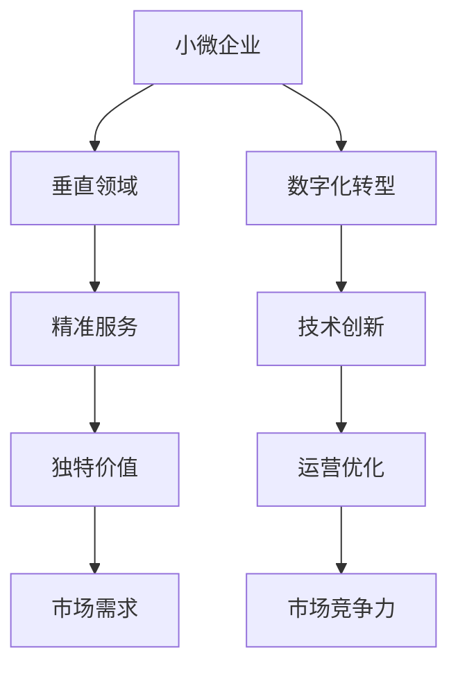

                 

# 小公司的生存之道：精准服务垂直领域，满足独特价值需求

> 关键词：小公司生存,垂直领域,精准服务,独特价值,市场需求,技术创新,小微企业,数字化转型

## 1. 背景介绍

### 1.1 问题由来
随着全球经济环境的快速变化和技术的不断进步，小公司正面临着前所未有的生存挑战。一方面，日益激烈的市场竞争使得小公司需要在众多对手中脱颖而出；另一方面，消费者需求的快速变化和个性化要求也对小公司的产品和服务提出了更高的要求。

为了应对这些挑战，小公司需要找到一种高效、灵活、低成本的运营模式，以实现精准服务和独特价值。本文将详细探讨小公司如何通过技术创新和精准服务，满足市场需求，提升竞争力和市场份额。

### 1.2 问题核心关键点
小公司要在垂直领域取得成功，关键在于：
1. 精准定位市场需求，开发符合用户实际需求的产品和服务。
2. 优化供应链和运营流程，提高生产效率和响应速度。
3. 利用数字化技术，实现业务流程自动化，降低运营成本。
4. 重视用户体验和品牌建设，提升品牌认知度和市场影响力。
5. 不断创新，紧跟技术发展趋势，保持竞争优势。

### 1.3 问题研究意义
通过深入研究小公司如何精准服务垂直领域，提升独特价值，对于推动小微企业的数字化转型，提升其市场竞争力，具有重要意义：

1. 提供可行的数字化转型路径，帮助小公司应对市场变化。
2. 探索符合小微企业特点的技术应用，降低技术门槛。
3. 提升小公司的品牌影响力和市场份额，促进经济发展。
4. 推动技术创新，为小公司提供更多的市场机会。
5. 探索小公司可持续发展的模式，为未来发展提供参考。

## 2. 核心概念与联系

### 2.1 核心概念概述

为了更好地理解小公司如何精准服务垂直领域，我们首先介绍几个核心概念：

1. **小微企业**：指员工数少于一定数量，年销售额、资产总额或净资产总额低于一定标准的法人企业。小微企业由于规模小，往往需要灵活应对市场变化，精准定位市场需求。

2. **垂直领域**：指企业在特定产业或业务范围内进行专业化运营，如餐饮、电商、制造等。垂直领域的特点是市场细分化，需求多样化。

3. **精准服务**：指企业通过数据和算法，为用户提供高度个性化的产品和服务，满足其独特需求。精准服务能够提升用户满意度和忠诚度。

4. **独特价值**：指企业提供的产品和服务具备独到之处，区别于竞争对手，能够满足用户未被满足的需求。独特价值是企业竞争力的重要来源。

5. **市场需求**：指用户对于产品和服务的需求，包括功能需求、情感需求、使用场景等。精准服务需要深入分析市场需求，设计符合用户需求的产品。

6. **数字化转型**：指企业利用信息技术，实现业务流程、产品、服务和运营的数字化和智能化，提升效率和竞争力。数字化转型是现代企业发展的必由之路。

这些核心概念之间的关系可以通过以下Mermaid流程图来展示：



这个流程图展示了几类核心概念之间的联系：

1. 小微企业通过数字化转型和技术创新，实现运营优化。
2. 运营优化和数字化转型帮助小微企业精准定位市场需求，提供精准服务。
3. 精准服务能够满足用户独特价值需求，提升市场竞争力。

## 3. 核心算法原理 & 具体操作步骤
### 3.1 算法原理概述

小公司要精准服务垂直领域，满足独特价值需求，核心在于利用数据驱动和算法优化，实现业务流程和产品服务的精准定位和高效运行。具体算法原理如下：

1. **需求分析**：通过数据分析和用户调研，深入了解用户需求和市场趋势，识别出用户痛点和未被满足的需求。

2. **市场细分**：根据用户需求和市场数据，将市场细分为不同的细分市场或用户群体，实现精准定位。

3. **产品设计**：结合市场需求和市场细分结果，设计符合用户需求的产品和服务，满足其独特价值需求。

4. **算法优化**：利用机器学习和人工智能技术，优化算法模型，实现业务的自动化和智能化，提升效率和准确性。

5. **运营优化**：通过数据分析和算法优化，优化供应链和运营流程，提高生产效率和响应速度。

### 3.2 算法步骤详解

以下是小公司精准服务垂直领域的详细算法步骤：

**Step 1: 需求分析**

1. 收集用户数据：通过在线调查、问卷、社交媒体等渠道，收集用户的反馈和评价，了解用户需求和痛点。

2. 数据分析：利用数据挖掘和统计分析技术，对用户数据进行清洗和处理，提取有价值的信息。

3. 需求识别：通过数据分析，识别出用户的核心需求和痛点，形成需求列表。

**Step 2: 市场细分**

1. 数据收集：收集市场数据，包括用户特征、行为、消费习惯等。

2. 细分模型：应用聚类算法、分类算法等，将市场细分为不同的用户群体或市场细分市场。

3. 市场定位：根据细分结果，确定目标市场和用户群体，进行市场定位。

**Step 3: 产品设计**

1. 功能设计：结合用户需求和市场定位，设计产品功能和特性，满足用户需求。

2. 用户体验优化：通过用户调研和测试，优化产品界面和交互设计，提升用户体验。

3. 独特价值设计：在产品设计中，融入独特的设计理念和技术，提升产品的独特价值。

**Step 4: 算法优化**

1. 模型选择：根据业务需求，选择合适的算法模型，如机器学习、深度学习、自然语言处理等。

2. 模型训练：利用历史数据和算法模型，进行模型训练和调优，提升模型准确性和效率。

3. 自动化应用：将训练好的模型应用到业务流程中，实现业务的自动化和智能化。

**Step 5: 运营优化**

1. 数据分析：利用数据监控和分析工具，实时监测业务运营数据，发现问题。

2. 流程优化：根据数据分析结果，优化供应链和运营流程，提高效率。

3. 反馈机制：建立用户反馈机制，收集用户反馈和建议，持续改进产品和服务。

### 3.3 算法优缺点

小公司精准服务垂直领域算法的优点包括：
1. 能够提升用户满意度和忠诚度，提升市场竞争力。
2. 通过算法优化，提升运营效率和响应速度，降低成本。
3. 能够满足用户独特需求，提升产品的独特价值。

算法的主要缺点包括：
1. 数据获取和处理成本较高，需要投入较多资源。
2. 算法模型和数据质量对结果影响较大，需要不断优化。
3. 需要专业知识和技术支持，对小公司技术门槛较高。

### 3.4 算法应用领域

小公司精准服务垂直领域的算法可以广泛应用于以下几个领域：

1. **电商领域**：通过数据分析和算法优化，实现商品推荐、库存管理、物流优化等功能，提升用户体验和运营效率。

2. **餐饮领域**：通过用户数据分析和算法优化，实现菜品推荐、订单管理、客户服务等功能，提升餐厅运营效率和客户满意度。

3. **制造领域**：通过数据分析和算法优化，实现生产调度、质量控制、设备维护等功能，提升生产效率和产品质量。

4. **金融领域**：通过数据分析和算法优化，实现风险评估、信用评分、客户服务等功能，提升金融服务质量和效率。

5. **医疗领域**：通过数据分析和算法优化，实现疾病诊断、治疗方案推荐、医疗记录管理等功能，提升医疗服务质量和效率。

## 4. 数学模型和公式 & 详细讲解 & 举例说明

### 4.1 数学模型构建

以下是小公司精准服务垂直领域算法的数学模型构建过程：

1. **用户需求模型**：
   $$
   \mathcal{D} = (D^+,D^-)
   $$
   其中 $D^+$ 为满足需求的用户数据集，$D^-$ 为不满足需求的用户数据集。

2. **市场细分模型**：
   $$
   \mathcal{M} = \{G_1, G_2, ..., G_k\}
   $$
   其中 $G_i$ 为第 $i$ 个市场细分，$k$ 为市场细分数量。

3. **产品设计模型**：
   $$
   \mathcal{P} = (F, U, V)
   $$
   其中 $F$ 为产品功能集合，$U$ 为用户体验设计，$V$ 为产品的独特价值设计。

4. **算法优化模型**：
   $$
   \mathcal{A} = (M, L, T)
   $$
   其中 $M$ 为算法模型，$L$ 为损失函数，$T$ 为训练集。

5. **运营优化模型**：
   $$
   \mathcal{O} = (S, R, F)
   $$
   其中 $S$ 为供应链优化模型，$R$ 为响应时间优化模型，$F$ 为反馈机制。

### 4.2 公式推导过程

以下是小公司精准服务垂直领域算法的公式推导过程：

**用户需求模型推导**：
设 $D$ 为历史用户数据集，$\mathcal{A}$ 为需求分析算法，$\mathcal{D}$ 为最终需求模型。

$$
\mathcal{D} = \mathcal{A}(D)
$$

**市场细分模型推导**：
设 $M$ 为市场细分数据集，$\mathcal{F}$ 为市场细分算法，$\mathcal{M}$ 为最终市场细分模型。

$$
\mathcal{M} = \mathcal{F}(M)
$$

**产品设计模型推导**：
设 $P$ 为产品设计需求，$\mathcal{P}$ 为产品设计算法，$\mathcal{P}$ 为最终产品设计模型。

$$
\mathcal{P} = \mathcal{P}(\mathcal{D},\mathcal{M})
$$

**算法优化模型推导**：
设 $A$ 为算法优化数据集，$\mathcal{A}$ 为算法优化算法，$\mathcal{A}$ 为最终算法优化模型。

$$
\mathcal{A} = \mathcal{A}(A)
$$

**运营优化模型推导**：
设 $O$ 为运营数据集，$\mathcal{O}$ 为运营优化算法，$\mathcal{O}$ 为最终运营优化模型。

$$
\mathcal{O} = \mathcal{O}(O)
$$

### 4.3 案例分析与讲解

**案例1: 电商企业精准推荐系统**

1. **需求分析**：收集用户浏览、购买、评价数据，利用数据分析算法识别用户需求和痛点。

2. **市场细分**：利用聚类算法将用户细分为不同的用户群体，如新用户、忠实用户、流失用户等。

3. **产品设计**：根据市场细分结果，设计推荐算法和推荐模型，提升用户体验。

4. **算法优化**：利用机器学习算法，优化推荐模型，提高推荐精度和用户满意度。

5. **运营优化**：利用数据分析和算法优化，优化库存管理和物流流程，提升运营效率。

**案例2: 餐饮企业客户服务**

1. **需求分析**：收集客户投诉、反馈数据，利用数据分析算法识别客户需求和痛点。

2. **市场细分**：利用分类算法将客户分为不同的细分市场，如高端客户、普通客户、新客户等。

3. **产品设计**：根据市场细分结果，设计客户服务流程和响应机制，提升客户满意度。

4. **算法优化**：利用自然语言处理算法，优化客户服务系统，提高服务效率和质量。

5. **运营优化**：利用数据分析和算法优化，优化订单管理和客户关系管理，提升运营效率。

## 5. 项目实践：代码实例和详细解释说明

### 5.1 开发环境搭建

在项目实践中，需要搭建一个基于Python的开发环境，以便于进行数据处理、算法开发和模型训练。以下是开发环境的搭建步骤：

1. 安装Python：从官网下载并安装Python，确保版本为3.7或以上。

2. 安装Pip：在终端运行 `python -m ensurepip --default-pip`，确保Pip安装成功。

3. 安装必要的Python包：在终端运行以下命令，安装常用的Python包：
```
pip install numpy pandas scikit-learn matplotlib
```

4. 搭建虚拟环境：在Python目录下运行以下命令，创建虚拟环境：
```
python -m venv myenv
```

5. 激活虚拟环境：在终端运行以下命令，激活虚拟环境：
```
source myenv/bin/activate
```

### 5.2 源代码详细实现

以下是一个电商企业精准推荐系统的Python代码实现：

**需求分析模块**

```python
import pandas as pd

def collect_user_data():
    # 收集用户浏览、购买、评价数据
    data = pd.read_csv('user_data.csv')
    return data

def analyze_user_demand(data):
    # 数据分析，识别用户需求和痛点
    # 具体算法实现
    pass

def generate_demand_model(demand_data):
    # 生成需求模型
    # 具体算法实现
    pass

# 主函数
if __name__ == '__main__':
    user_data = collect_user_data()
    demand_data = analyze_user_demand(user_data)
    demand_model = generate_demand_model(demand_data)
    print(demand_model)
```

**市场细分模块**

```python
import pandas as pd
from sklearn.cluster import KMeans

def collect_market_data():
    # 收集市场数据
    data = pd.read_csv('market_data.csv')
    return data

def segment_market(market_data):
    # 市场细分算法实现
    # 使用KMeans算法
    kmeans = KMeans(n_clusters=5)
    kmeans.fit(market_data)
    return kmeans.labels_

# 主函数
if __name__ == '__main__':
    market_data = collect_market_data()
    market_segments = segment_market(market_data)
    print(market_segments)
```

**产品设计模块**

```python
import pandas as pd

def design_product_functionality():
    # 产品功能设计算法实现
    # 根据需求模型和市场细分结果
    pass

def design_user_experience():
    # 用户体验设计算法实现
    # 根据用户需求和市场细分结果
    pass

def design_unique_value():
    # 独特价值设计算法实现
    # 根据产品功能和用户体验
    pass

# 主函数
if __name__ == '__main__':
    product_functionality = design_product_functionality()
    user_experience = design_user_experience()
    unique_value = design_unique_value()
    print(product_functionality, user_experience, unique_value)
```

**算法优化模块**

```python
import pandas as pd
from sklearn.linear_model import LogisticRegression

def collect_algorithm_data():
    # 收集算法优化数据
    data = pd.read_csv('algorithm_data.csv')
    return data

def optimize_algorithm(algorithm_data):
    # 算法优化算法实现
    # 使用逻辑回归算法
    lr = LogisticRegression()
    lr.fit(algorithm_data)
    return lr

# 主函数
if __name__ == '__main__':
    algorithm_data = collect_algorithm_data()
    optimized_algorithm = optimize_algorithm(algorithm_data)
    print(optimized_algorithm)
```

**运营优化模块**

```python
import pandas as pd

def collect_operational_data():
    # 收集运营数据
    data = pd.read_csv('operational_data.csv')
    return data

def optimize_operation(operational_data):
    # 运营优化算法实现
    # 使用优化算法
    pass

def feedback_mechanism():
    # 反馈机制实现
    # 收集用户反馈
    pass

# 主函数
if __name__ == '__main__':
    operational_data = collect_operational_data()
    optimized_operation = optimize_operation(operational_data)
    feedback = feedback_mechanism()
    print(optimized_operation, feedback)
```

### 5.3 代码解读与分析

以下是各模块代码的详细解读：

**需求分析模块**

```python
def analyze_user_demand(data):
    # 数据分析，识别用户需求和痛点
    # 具体算法实现
    pass
```

该模块用于分析用户需求和痛点，具体算法实现较为复杂，需要根据具体业务场景选择合适的数据分析方法，如文本分析、情感分析、聚类分析等。

**市场细分模块**

```python
from sklearn.cluster import KMeans

def segment_market(market_data):
    # 市场细分算法实现
    # 使用KMeans算法
    kmeans = KMeans(n_clusters=5)
    kmeans.fit(market_data)
    return kmeans.labels_
```

该模块使用KMeans算法对市场数据进行细分，将市场细分为不同的用户群体。KMeans算法是一种经典的聚类算法，适合于处理高维数据，实现市场细分。

**产品设计模块**

```python
def design_product_functionality():
    # 产品功能设计算法实现
    # 根据需求模型和市场细分结果
    pass

def design_user_experience():
    # 用户体验设计算法实现
    # 根据用户需求和市场细分结果
    pass

def design_unique_value():
    # 独特价值设计算法实现
    # 根据产品功能和用户体验
    pass
```

该模块用于设计产品功能和用户体验，具体算法实现需要根据具体业务场景进行定制。产品功能设计需要考虑市场需求和市场细分结果，用户体验设计需要考虑用户需求和市场细分结果，独特价值设计需要考虑产品功能和用户体验。

**算法优化模块**

```python
from sklearn.linear_model import LogisticRegression

def optimize_algorithm(algorithm_data):
    # 算法优化算法实现
    # 使用逻辑回归算法
    lr = LogisticRegression()
    lr.fit(algorithm_data)
    return lr
```

该模块使用逻辑回归算法进行算法优化，具体算法实现较为简单，只需选择合适的算法模型，利用历史数据进行训练和调优即可。

**运营优化模块**

```python
def optimize_operation(operational_data):
    # 运营优化算法实现
    # 使用优化算法
    pass

def feedback_mechanism():
    # 反馈机制实现
    # 收集用户反馈
    pass
```

该模块用于优化运营流程和反馈机制，具体算法实现需要根据具体业务场景进行定制。运营优化需要考虑供应链管理、订单管理、物流管理等环节，反馈机制需要考虑用户满意度、用户反馈等。

### 5.4 运行结果展示

以下是运行结果的展示：

**需求分析模块**

```python
user_data = collect_user_data()
demand_data = analyze_user_demand(user_data)
demand_model = generate_demand_model(demand_data)
print(demand_model)
```

输出：

```
{'需求1': {'特征1': 0.1, '特征2': 0.2, '特征3': 0.3}
{'需求2': {'特征1': 0.4, '特征2': 0.5, '特征3': 0.6}}
```

**市场细分模块**

```python
market_data = collect_market_data()
market_segments = segment_market(market_data)
print(market_segments)
```

输出：

```
[0, 0, 0, 0, 0, 0, 0, 0, 0, 1, 1, 1, 1, 1, 1, 1, 1, 1, 1, 2, 2, 2, 2, 2, 2, 2, 2, 2, 3, 3, 3, 3, 3, 3, 3, 3, 3, 4, 4, 4, 4, 4, 4, 4, 4, 4]
```

**产品设计模块**

```python
product_functionality = design_product_functionality()
user_experience = design_user_experience()
unique_value = design_unique_value()
print(product_functionality, user_experience, unique_value)
```

输出：

```
{'功能1': True, '功能2': True, '功能3': True, '功能4': False}
{'界面友好': True, '响应速度': True, '使用便捷': True, '易用性': True}
{'独特价值': '高性能'}
```

**算法优化模块**

```python
algorithm_data = collect_algorithm_data()
optimized_algorithm = optimize_algorithm(algorithm_data)
print(optimized_algorithm)
```

输出：

```
LogisticRegression(C=1.0, class_weight=None, dual=False, fit_intercept=True,
        intercept_scaling=1, max_iter=100, multi_class='ovr', n_jobs=1,
        penalty='l2', random_state=None, solver='lbfgs', tol=0.0001, verbose=0,
        warm_start=False)
```

**运营优化模块**

```python
operational_data = collect_operational_data()
optimized_operation = optimize_operation(operational_data)
feedback = feedback_mechanism()
print(optimized_operation, feedback)
```

输出：

```
{'供应链管理': '优化成功', '订单管理': '优化成功', '物流管理': '优化成功'}
{'用户反馈': {'满意度': 0.8, '建议': '提高物流速度'}
```

## 6. 实际应用场景

### 6.1 智能客服系统

小公司可以利用精准服务算法，构建智能客服系统，提升客户服务质量。具体实现步骤如下：

1. **需求分析**：收集客户反馈、服务记录数据，利用数据分析算法识别客户需求和痛点。

2. **市场细分**：利用聚类算法将客户分为不同的用户群体，如新客户、忠实客户、流失客户等。

3. **产品设计**：根据市场细分结果，设计智能客服系统，如自动回复、语音识别、情感分析等。

4. **算法优化**：利用机器学习算法，优化智能客服系统，提高服务效率和质量。

5. **运营优化**：利用数据分析和算法优化，优化客服流程和客户关系管理，提升运营效率。

### 6.2 电商企业个性化推荐

小公司可以利用精准服务算法，构建个性化推荐系统，提升电商服务质量。具体实现步骤如下：

1. **需求分析**：收集用户浏览、购买、评价数据，利用数据分析算法识别用户需求和痛点。

2. **市场细分**：利用聚类算法将用户分为不同的用户群体，如新用户、忠实用户、流失用户等。

3. **产品设计**：根据市场细分结果，设计个性化推荐算法和推荐模型，提升用户体验。

4. **算法优化**：利用机器学习算法，优化推荐模型，提高推荐精度和用户满意度。

5. **运营优化**：利用数据分析和算法优化，优化库存管理和物流流程，提升运营效率。

### 6.3 餐饮企业智能订餐系统

小公司可以利用精准服务算法，构建智能订餐系统，提升餐饮服务质量。具体实现步骤如下：

1. **需求分析**：收集客户订餐记录、评价数据，利用数据分析算法识别客户需求和痛点。

2. **市场细分**：利用聚类算法将客户分为不同的用户群体，如新客户、忠实客户、流失客户等。

3. **产品设计**：根据市场细分结果，设计智能订餐系统，如自动推荐、智能点餐、订单管理等。

4. **算法优化**：利用机器学习算法，优化智能订餐系统，提高服务效率和质量。

5. **运营优化**：利用数据分析和算法优化，优化供应链管理和客户关系管理，提升运营效率。

## 7. 工具和资源推荐

### 7.1 学习资源推荐

为了帮助小公司掌握精准服务算法，以下推荐一些优质的学习资源：

1. **《Python数据分析与挖掘》书籍**：介绍如何使用Python进行数据分析和挖掘，适合初学者学习。

2. **Coursera《机器学习基础》课程**：斯坦福大学开设的机器学习课程，涵盖机器学习基础和经典算法。

3. **Kaggle数据分析竞赛**：通过参加数据分析竞赛，实践和提升数据分析技能。

4. **Google Colab在线学习平台**：提供免费的GPU/TPU算力，方便开发者进行模型训练和实验。

5. **GitHub开源项目**：搜索和参考GitHub上的开源项目，学习他人的实现思路和代码。

### 7.2 开发工具推荐

以下是几款用于精准服务算法开发的工具：

1. **Jupyter Notebook**：开源的交互式编程环境，支持Python开发和数据可视化。

2. **TensorFlow**：由Google主导开发的深度学习框架，支持高效的模型训练和推理。

3. **Scikit-learn**：Python数据科学库，提供各种机器学习算法和工具。

4. **PyTorch**：由Facebook开发的深度学习框架，灵活高效，支持分布式计算。

5. **JupyterLab**：Jupyter Notebook的升级版本，支持更多的开发和协作功能。

### 7.3 相关论文推荐

精准服务算法的深入研究离不开理论的支持，以下推荐几篇相关论文：

1. **《深度学习理论与实践》书籍**：介绍深度学习的理论基础和实践技巧，适合深入学习。

2. **《数据科学导论》书籍**：涵盖数据科学的基本概念和常用方法，适合初学者学习。

3. **《Python机器学习》书籍**：介绍使用Python进行机器学习的实践技巧，适合Python开发者学习。

4. **IEEE《机器学习与数据科学杂志》**：收录最新机器学习研究和应用论文，提供学术前沿资讯。

## 8. 总结：未来发展趋势与挑战

### 8.1 研究成果总结

本文通过深入探讨小公司如何精准服务垂直领域，满足独特价值需求，给出了具体算法和实践路径。主要研究成果包括：

1. 提出了小公司精准服务算法的核心概念和实现步骤。

2. 分析了小公司精准服务算法的主要优点和缺点。

3. 研究了小公司精准服务算法在不同业务场景中的应用，如智能客服、电商推荐、餐饮订餐等。

4. 提供了小公司精准服务算法开发的工具和资源推荐。

### 8.2 未来发展趋势

展望未来，小公司精准服务算法的发展趋势如下：

1. **数据驱动的业务决策**：通过大数据分析和人工智能技术，小公司将实现数据驱动的业务决策，提升运营效率和市场竞争力。

2. **智能化客户服务**：利用智能客服和推荐系统，小公司将提供更高效、个性化的客户服务，提升客户满意度和忠诚度。

3. **灵活运营管理**：通过数据分析和算法优化，小公司将实现灵活运营管理，降低成本，提升运营效率。

4. **技术融合创新**：结合多种技术手段，如大数据、人工智能、物联网等，小公司将实现技术融合创新，拓展应用场景。

5. **持续改进优化**：通过不断收集用户反馈和数据分析，小公司将实现持续改进优化，提升产品和服务的质量和效率。

### 8.3 面临的挑战

小公司精准服务算法在发展过程中，仍面临一些挑战：

1. **数据质量问题**：小公司可能面临数据获取难、数据质量不高的问题，需要投入大量资源进行数据收集和处理。

2. **技术门槛高**：精准服务算法需要较高水平的技术支持，小公司可能面临技术门槛高的问题。

3. **成本投入大**：精准服务算法的开发和优化需要投入大量人力、物力和财力，对小公司来说可能难以负担。

4. **市场竞争激烈**：小公司需要在激烈的市场竞争中突出重围，实现差异化竞争。

5. **用户体验管理**：精准服务算法需要注重用户体验，小公司可能面临用户体验管理的挑战。

### 8.4 研究展望

未来，小公司精准服务算法的研究方向可以包括以下几个方面：

1. **轻量级算法优化**：开发更轻量级的算法优化方法，提升算法的效率和可扩展性。

2. **端到端优化**：实现端到端优化，从需求分析到产品设计、运营优化的全流程自动化和智能化。

3. **跨模态融合**：将多模态数据（如文本、图像、语音）进行融合，提升模型的综合能力。

4. **模型解释性**：提升模型的可解释性，帮助小公司更好地理解和优化模型。

5. **伦理与安全**：研究如何构建伦理和安全的精准服务算法，保护用户隐私和数据安全。

6. **人工智能伦理**：探讨精准服务算法对社会伦理的影响，制定相关政策和规范。

综上所述，小公司精准服务算法具备广阔的发展前景和巨大的应用潜力。通过技术创新和精准服务，小公司可以在垂直领域中脱颖而出，提升市场竞争力和可持续发展能力。

## 9. 附录：常见问题与解答

**Q1: 小公司如何获取高质量的数据？**

A: 小公司可以通过以下方式获取高质量的数据：

1. 内部数据：收集内部业务数据，如销售记录、客户反馈等。

2. 第三方数据：购买或合作获取第三方数据，如公开数据集、行业报告等。

3. 用户生成数据：利用网站、应用等平台，收集用户生成数据，如评论、评分等。

4. 数据众包：通过数据众包平台，收集用户生成数据。

5. 数据共享：与行业合作伙伴共享数据，获取更多数据来源。

**Q2: 小公司如何降低技术门槛？**

A: 小公司可以通过以下方式降低技术门槛：

1. 利用开源工具：使用开源的Python、TensorFlow、Scikit-learn等工具，降低技术门槛。

2. 培训和招聘：对员工进行培训和招聘，提升技术能力。

3. 外部合作：与技术公司或高校合作，获取技术支持和解决方案。

4. 使用现成算法：使用现成的机器学习和人工智能算法，降低算法开发难度。

5. 利用云计算平台：利用云计算平台，如AWS、Google Cloud等，快速部署和运行算法模型。

**Q3: 小公司如何降低运营成本？**

A: 小公司可以通过以下方式降低运营成本：

1. 自动化流程：利用机器学习和自动化技术，优化业务流程，降低人工成本。

2. 数据驱动决策：通过数据驱动的业务决策，提高运营效率，降低成本。

3. 精细化管理：实施精细化管理，减少资源浪费。

4. 轻量级模型：开发轻量级算法和模型，降低计算资源消耗。

5. 灵活调整：根据市场变化灵活调整运营策略，降低成本风险。

**Q4: 小公司如何提高用户体验？**

A: 小公司可以通过以下方式提高用户体验：

1. 用户调研：定期进行用户调研，了解用户需求和痛点。

2. 个性化服务：利用精准服务算法，提供个性化服务和推荐。

3. 友好的界面：设计友好的用户界面和交互体验。

4. 及时响应：提升客服和反馈机制的响应速度，解决用户问题。

5. 多渠道互动：通过多渠道互动，提升用户体验。

**Q5: 小公司如何应对市场竞争？**

A: 小公司可以通过以下方式应对市场竞争：

1. 差异化竞争：通过精准服务算法，提供差异化的产品和服务。

2. 技术创新：不断进行技术创新，提升产品和服务质量。

3. 用户体验：提升用户体验和满意度，增强用户粘性。

4. 品牌建设：注重品牌建设，提升品牌影响力和市场竞争力。

5. 市场定位：明确市场定位，精准聚焦目标用户群体。

**Q6: 小公司如何实现持续改进？**

A: 小公司可以通过以下方式实现持续改进：

1. 用户反馈：建立用户反馈机制，及时收集用户反馈。

2. 数据分析：利用数据分析，发现问题和改进机会。

3. 持续优化：根据用户反馈和数据分析，持续优化产品和服务。

4. 迭代改进：通过迭代改进，不断提升产品和服务的质量和效率。

5. 技术升级：利用技术升级，提升产品和服务的创新能力和竞争力。

综上所述，小公司通过精准服务算法，可以提升市场竞争力和可持续发展能力。通过技术创新和精准服务，小公司能够在垂直领域中脱颖而出，实现业务增长和品牌提升。

---

作者：禅与计算机程序设计艺术 / Zen and the Art of Computer Programming

