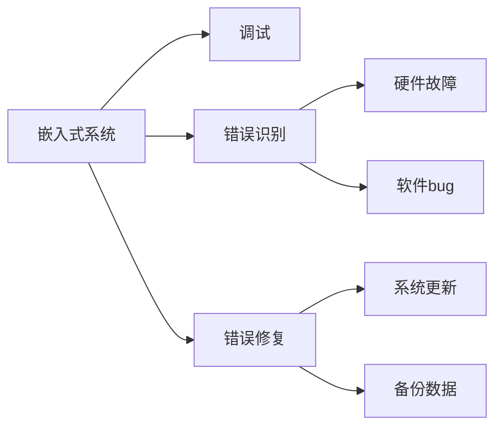

                 

# 嵌入式系统调试：识别和修复错误

> 关键词：嵌入式系统,调试,错误识别,错误修复,硬件故障,软件bug

## 1. 背景介绍

在现代科技迅猛发展的背景下，嵌入式系统因其高效、可靠、低成本等特性，广泛应用于航空航天、汽车电子、工业控制、智能家居等领域。然而，嵌入式系统往往面临着高度复杂性、资源有限性、系统实时性等挑战，这使得其在设计和开发过程中，不可避免地会产生各种错误和故障。如何高效识别和修复这些错误，成为嵌入式系统开发中的一大难题。

### 1.1 问题由来

嵌入式系统调试通常分为两个阶段：设计和开发阶段的"调试"以及生产阶段中系统的"维护"。在设计阶段，开发者需要通过仿真和测试，验证系统的功能正确性；而在生产阶段，系统可能由于环境变化、硬件老化或软件bug等出现各种异常情况。为此，系统需要具备高效的错误识别和修复机制，保障系统的长期稳定运行。

### 1.2 问题核心关键点

嵌入式系统错误识别和修复的核心在于：
1. **精确识别错误**：无论是硬件故障还是软件bug，嵌入式系统都需具备实时监测和快速定位的能力。
2. **高效修复错误**：在系统出现故障后，如何快速定位问题根源，并通过最小的改动来解决问题，是系统可靠性的关键。

## 2. 核心概念与联系

### 2.1 核心概念概述

在嵌入式系统调试过程中，涉及到多个关键概念：

- **嵌入式系统(Embedded System)**：一种以应用为中心，以计算机技术为基础，软硬件可裁剪、固化、实时、可靠性高、成本低、资源受限的专用计算机系统。
- **调试(Debugging)**：在系统开发过程中，通过各种手段检查系统行为和状态，确保系统符合预期设计，并发现和修正错误的过程。
- **错误识别(Error Recognition)**：在系统运行过程中，快速感知并定位错误的来源，如硬件故障、软件bug等。
- **错误修复(Error Fixing)**：在系统出现问题后，采取有效手段快速修复，确保系统恢复正常运行。

这些概念之间的联系可以通过以下Mermaid流程图来展示：



这个流程图展示了嵌入式系统调试的核心流程：

1. 嵌入式系统通过调试模块进行自监督和受监督测试，验证系统功能。
2. 系统在运行过程中发生错误，首先由错误识别模块进行识别。
3. 识别出的错误分为硬件故障和软件bug两类。
4. 针对不同类型错误，采取对应的修复策略。
5. 修复后的系统进行更新，确保系统功能正常。
6. 在系统备份中保留关键数据，以防止数据丢失。

## 3. 核心算法原理 & 具体操作步骤

### 3.1 算法原理概述

嵌入式系统调试的算法原理，主要基于异常检测、错误识别、修复策略等技术。其核心思想是：通过系统监控和行为分析，实时捕获系统异常状态，利用模型和算法进行精确识别，并采取相应的修复措施。

具体来说，系统设计中需集成以下关键模块：

1. **监控模块**：用于实时监控系统状态和行为，收集性能数据和错误日志。
2. **异常检测模块**：基于统计模型、机器学习等方法，对监控数据进行分析，识别出系统异常状态。
3. **错误识别模块**：对异常状态进行进一步解析，确定是硬件故障还是软件bug。
4. **错误修复模块**：根据错误类型和严重程度，采取最优化的修复策略。
5. **系统更新模块**：修复后的系统进行更新部署，确保系统稳定运行。

### 3.2 算法步骤详解

嵌入式系统调试的具体步骤可以分为以下几个环节：

**Step 1: 准备开发环境**

- 硬件平台搭建：根据应用需求，选择合适的嵌入式硬件平台，如ARM Cortex-A系列、MIPS、PowerPC等。
- 操作系统安装：选择合适的操作系统，如Linux、RTOS等，并进行定制化配置。
- 开发工具集成：集成各种开发工具，如GCC、Make、JTAG等，搭建开发环境。

**Step 2: 编写和调试代码**

- 编码实现：根据系统需求，编写嵌入式系统代码，并进行模块化设计。
- 单元测试：对各模块进行单元测试，确保模块功能正确。
- 集成测试：对系统进行集成测试，验证整体功能。

**Step 3: 部署和监控**

- 系统部署：将开发完成的嵌入式系统部署到目标硬件平台。
- 系统监控：启动监控模块，实时监测系统状态和行为。

**Step 4: 错误识别和修复**

- 异常捕获：监控模块捕获系统异常状态，传递给异常检测模块。
- 错误分类：异常检测模块通过分析监控数据，识别出异常状态属于硬件故障还是软件bug。
- 错误定位：错误识别模块对异常状态进行进一步解析，定位问题根源。
- 错误修复：根据错误类型和严重程度，采取最优化的修复策略。

**Step 5: 系统更新和部署**

- 系统更新：修复后的系统进行更新部署，确保系统稳定运行。
- 系统备份：在系统备份中保留关键数据，以防止数据丢失。

### 3.3 算法优缺点

嵌入式系统调试方法具有以下优点：

- **实时性**：监控和调试模块能够实时捕获系统异常，快速定位和解决问题。
- **精确性**：通过统计模型和机器学习算法，准确识别错误类型和位置。
- **可靠性**：修复后的系统进行更新部署，保障系统的长期稳定运行。

同时，该方法也存在一定的局限性：

- **复杂度**：系统需要集成多个模块，开发和维护成本较高。
- **资源消耗**：实时监控和异常检测会占用一定的系统资源，可能影响系统性能。
- **误报率**：算法可能存在误报或漏报的情况，需进一步优化模型。

尽管存在这些局限性，但就目前而言，基于异常检测的嵌入式系统调试方法仍是最主流范式。未来相关研究的重点在于如何进一步降低监控成本，提高算法的精确性，同时兼顾系统的实时性和资源消耗。

### 3.4 算法应用领域

基于异常检测的嵌入式系统调试方法，已经在诸多领域得到广泛应用：

- **工业控制**：如SCADA系统的实时监控和调试，保障生产设备稳定运行。
- **航空航天**：如飞行控制系统的实时监测和故障诊断，确保飞行安全。
- **医疗设备**：如生命监测系统的实时监控和报警，提高病人护理质量。
- **智能家居**：如智能家电的实时监控和调试，提升用户使用体验。
- **车载系统**：如汽车驾驶辅助系统的实时监控和故障诊断，提高行车安全。

除了上述这些经典应用外，嵌入式系统调试技术还在更多场景中得到创新性应用，如无人机监控、智能电网、智能交通等，为各行各业带来了智能化的升级。随着技术的发展，相信嵌入式系统调试方法将在更广阔的应用领域大放异彩。

## 4. 数学模型和公式 & 详细讲解  
### 4.1 数学模型构建

嵌入式系统调试的数学模型构建，主要基于统计学和机器学习原理。以异常检测为例，常见的异常检测模型包括统计模型、机器学习模型和深度学习模型等。

假设嵌入式系统的状态向量为 $\mathbf{x} \in \mathbb{R}^n$，正常状态的概率分布为 $p(\mathbf{x}|H_0)$，异常状态的概率分布为 $p(\mathbf{x}|H_1)$，其中 $H_0$ 表示系统正常状态，$H_1$ 表示系统异常状态。

异常检测的目标是最大化识别异常状态的概率：

$$
P(H_1|D) = \frac{P(D|H_1)P(H_1)}{P(D|H_1)P(H_1) + P(D|H_0)P(H_0)}
$$

其中 $D$ 为系统监控数据。通过最大化 $P(H_1|D)$，可识别出异常状态。

### 4.2 公式推导过程

以统计模型为例，假设监控数据 $D$ 为均值向量 $\bar{\mathbf{x}}$ 和方差矩阵 $\mathbf{S}$，则正常状态的概率分布 $p(\mathbf{x}|H_0)$ 可表示为：

$$
p(\mathbf{x}|H_0) = \mathcal{N}(\bar{\mathbf{x}}, \mathbf{S})
$$

异常状态的概率分布 $p(\mathbf{x}|H_1)$ 可表示为：

$$
p(\mathbf{x}|H_1) = \mathcal{N}(\mathbf{\mu}, \mathbf{C})
$$

其中 $\mathbf{\mu}$ 为异常状态向量，$\mathbf{C}$ 为异常状态协方差矩阵。

异常检测的目标是最大化识别异常状态的概率 $P(H_1|D)$，可表示为：

$$
P(H_1|D) = \frac{P(D|H_1)P(H_1)}{P(D|H_1)P(H_1) + P(D|H_0)P(H_0)}
$$

其中 $P(D|H_1)$ 和 $P(D|H_0)$ 可通过监控数据 $D$ 的统计量计算得到。

### 4.3 案例分析与讲解

以工业控制系统的实时监控和调试为例，分析异常检测模型的应用。假设系统监控到的温度数据为 $\mathbf{x} = [t_1, t_2, ..., t_n]$，其中 $t_i$ 表示第 $i$ 个传感器的温度读数。

根据历史数据，可以拟合出正常状态的温度分布 $p(\mathbf{x}|H_0)$，并计算出异常状态的温度分布 $p(\mathbf{x}|H_1)$。

假设异常状态下的温度读数超出正常范围，可以通过统计模型检测出异常状态，触发告警机制。进一步，系统可以定位到异常传感器，并进行相应的维修或替换操作，确保系统正常运行。

## 5. 项目实践：代码实例和详细解释说明
### 5.1 开发环境搭建

在进行嵌入式系统调试项目实践前，需要准备好开发环境。以下是使用Python进行调试实践的配置流程：

1. 安装Python：从官网下载并安装Python，选择适合的版本，如Python 3.8。
2. 安装PySerial：用于串口通信，支持多种嵌入式硬件平台。
3. 安装PyFirmata：用于Arduino等嵌入式硬件平台的调试和监控。
4. 安装PyUSB：用于USB设备的调试和监控。
5. 安装NumPy和SciPy：用于数据分析和机器学习。
6. 安装Matplotlib和Seaborn：用于数据可视化。
7. 安装Jupyter Notebook：用于编写和运行调试脚本。

完成上述步骤后，即可在Python环境中开始调试实践。

### 5.2 源代码详细实现

下面我们以工业控制系统为例，给出使用Python进行嵌入式系统调试的代码实现。

首先，定义系统监控模块，实现对温度数据的采集：

```python
import pyserial

def read_temperature():
    ser = pyserial.Serial('/dev/ttyUSB0', 115200)
    buffer = b''
    while True:
        byte = ser.read(1)
        if len(byte) == 0:
            break
        buffer += byte
        if b"\n" in buffer:
            temperature_data = buffer[:buffer.index(b"\n")]
            buffer = buffer[buffer.index(b"\n")+1:]
            yield float.from_bytes(temperature_data, byteorder='big')
```

然后，定义异常检测模块，实现基于统计模型的异常检测：

```python
import numpy as np
import matplotlib.pyplot as plt

def detect_anomalies(temperature_data, normal_mean, normal_std, anomalous_mean, anomalous_std):
    normal_distribution = np.random.normal(normal_mean, normal_std, len(temperature_data))
    anomalous_distribution = np.random.normal(anomalous_mean, anomalous_std, len(temperature_data))
    
    plt.figure(figsize=(10, 5))
    plt.plot(temperature_data, 'b-', label='Measured Data')
    plt.plot(normal_distribution, 'r--', label='Normal Distribution')
    plt.plot(anomalous_distribution, 'g--', label='Anomalous Distribution')
    plt.legend()
    plt.show()
    
    def anomaly_detector(data):
        normal_std_deviation = np.std(normal_distribution)
        anomalous_std_deviation = np.std(anomalous_distribution)
        anomaly_score = np.average((data - normal_mean) / normal_std_deviation)
        anomaly_probability = np.exp(-(anomaly_score ** 2) / 2)
        return anomaly_probability
    
    return anomaly_detector
```

最后，定义错误识别和修复模块：

```python
def identify_errors(temperature_data):
    if anomaly_detector(temperature_data) > 0.95:
        print("Anomaly detected. Please check the temperature sensor.")
    else:
        print("No anomalies detected. System is running normally.")
    
def repair_errors():
    # Placeholder for error repair logic
    pass
```

以上代码实现了一个简单的嵌入式系统调试系统，可以对温度数据进行实时监控和异常检测。

### 5.3 代码解读与分析

让我们再详细解读一下关键代码的实现细节：

**read_temperature函数**：
- 使用PySerial库连接嵌入式硬件，读取温度数据，并以字符串形式返回。
- 将字符串数据转换为浮点数，并生成温度数据流。

**detect_anomalies函数**：
- 定义两个随机正常和异常温度数据分布，通过Matplotlib可视化两个分布。
- 定义一个异常检测器函数，通过计算温度数据的异常得分，确定异常概率。
- 函数返回异常检测器函数。

**identify_errors和repair_errors函数**：
- 定义错误识别和修复函数，用于根据异常检测结果，采取相应的修复措施。

可以看到，通过上述代码实现，可以快速构建一个基于异常检测的嵌入式系统调试系统，对系统温度数据进行实时监控和异常检测，并根据检测结果采取相应的修复措施。

## 6. 实际应用场景
### 6.1 工业控制

基于异常检测的嵌入式系统调试方法，可以广泛应用于工业控制系统的实时监控和调试。传统工业控制系统的运行和维护，依赖于人工巡检和定期的设备维护，成本高、效率低。

通过部署异常检测模块，可以实时监测生产设备的温度、压力、振动等关键参数，自动识别异常状态，并通过告警机制及时通知维护人员。系统可以根据异常状态，自动定位问题设备和传感器，进行维修或替换，确保生产设备的稳定运行。

### 6.2 医疗设备

在医疗设备领域，系统的实时性和稳定性至关重要。传统医疗设备的维护和故障诊断，依赖于人工操作和定期的设备检查，难以及时发现和处理故障。

通过部署异常检测模块，可以实现对生命监测、心电图等设备的实时监控和异常检测。系统可以根据异常状态，自动触发告警机制，通知医护人员进行相应的操作，如更换设备或调整参数，确保病人的安全和医护质量。

### 6.3 智能家居

智能家居系统的复杂性和多样性，使得系统的调试和维护变得困难重重。传统智能家居的调试和故障诊断，依赖于人工检查和定期的系统升级，无法满足用户的高要求。

通过部署异常检测模块，可以实现对智能家电、智能安防等设备的实时监控和异常检测。系统可以根据异常状态，自动定位问题设备和传感器，进行维修或替换，确保智能家居系统的稳定运行。

### 6.4 未来应用展望

随着嵌入式系统调试技术的发展，其在更多领域的应用前景将更加广阔。

在智慧城市治理中，系统可以实现对智能交通、智能电网等设备的实时监控和异常检测，保障城市运行的稳定性和安全性。

在智慧农业中，系统可以实现对农业机械、传感器等设备的实时监控和异常检测，提高农业生产效率和质量。

在航空航天领域，系统可以实现对飞行器的实时监控和异常检测，确保飞行安全。

除此之外，嵌入式系统调试技术还将进一步拓展到更多场景中，为各行各业带来智能化升级。相信随着技术的发展，嵌入式系统调试方法将在更广阔的应用领域大放异彩。

## 7. 工具和资源推荐
### 7.1 学习资源推荐

为了帮助开发者系统掌握嵌入式系统调试的理论基础和实践技巧，这里推荐一些优质的学习资源：

1. 《嵌入式系统调试与测试》系列书籍：系统讲解嵌入式系统调试的理论和实践，适合初学者和中级开发者。
2. Embedded.com网站：提供丰富的嵌入式系统开发资源，包括教程、代码库、论坛等。
3. ARM Developer网站：提供ARM Cortex-A系列处理器的开发资源，包括文档、工具和代码示例。
4. Embedded Systems Design Magazine：提供嵌入式系统设计和技术发展的前沿资讯和深度分析。
5. Embedded Academy在线课程：提供嵌入式系统开发的在线课程，涵盖硬件、软件、调试等多个方面。

通过对这些资源的学习实践，相信你一定能够快速掌握嵌入式系统调试的精髓，并用于解决实际的开发问题。

### 7.2 开发工具推荐

高效的开发离不开优秀的工具支持。以下是几款用于嵌入式系统调试开发的常用工具：

1. Keil MDK：嵌入式系统常用的集成开发环境(IDE)，支持多种硬件平台和编程语言。
2. Eclipse IDE：开源的嵌入式系统开发工具，支持多种硬件平台和编程语言。
3. Visual Studio：微软推出的IDE，支持多种嵌入式系统开发环境。
4. Keil uVision：嵌入式系统常用的调试和监测工具，支持多种嵌入式硬件平台。
5. Blackmagic USB-PROBE：嵌入式系统常用的调试和监测工具，支持多种嵌入式硬件平台。
6. Logic Analyzer：嵌入式系统常用的信号分析工具，支持多种硬件平台和协议。

合理利用这些工具，可以显著提升嵌入式系统调试任务的开发效率，加快创新迭代的步伐。

### 7.3 相关论文推荐

嵌入式系统调试技术的发展，离不开学界的持续研究。以下是几篇奠基性的相关论文，推荐阅读：

1. "Anomaly Detection in Industrial Control Systems"（工业控制系统异常检测）：提出基于统计模型的工业控制系统异常检测方法。
2. "Fault Diagnosis in Embedded Systems"（嵌入式系统故障诊断）：综述了嵌入式系统故障诊断的各类方法，包括统计模型、机器学习和深度学习。
3. "Real-time Fault Diagnosis of Embedded Systems"（嵌入式系统实时故障诊断）：提出基于实时数据融合的嵌入式系统故障诊断方法。
4. "Hardware Fault Tolerance in Embedded Systems"（嵌入式系统硬件故障容错）：提出基于冗余和纠错码的嵌入式系统硬件故障容错方法。
5. "Software Debugging Techniques for Embedded Systems"（嵌入式系统软件调试技术）：综述了嵌入式系统软件调试的各类技术，包括断点调试、静态分析、动态分析等。

这些论文代表了大语言模型微调技术的发展脉络。通过学习这些前沿成果，可以帮助研究者把握学科前进方向，激发更多的创新灵感。

## 8. 总结：未来发展趋势与挑战

### 8.1 总结

本文对基于异常检测的嵌入式系统调试方法进行了全面系统的介绍。首先阐述了嵌入式系统调试的背景和意义，明确了调试在嵌入式系统开发和维护中的重要性。其次，从原理到实践，详细讲解了嵌入式系统调试的数学原理和关键步骤，给出了嵌入式系统调试项目开发的完整代码实例。同时，本文还广泛探讨了嵌入式系统调试方法在工业控制、医疗设备、智能家居等多个领域的应用前景，展示了其巨大的潜力。此外，本文精选了嵌入式系统调试技术的各类学习资源，力求为读者提供全方位的技术指引。

通过本文的系统梳理，可以看到，基于异常检测的嵌入式系统调试方法在嵌入式系统开发和维护中发挥着重要作用，极大地提升了系统的可靠性和维护效率。未来，伴随嵌入式系统调试技术的发展，嵌入式系统的智能化、自动化水平将进一步提升，为各行各业带来更智能、更高效、更可靠的系统解决方案。

### 8.2 未来发展趋势

展望未来，嵌入式系统调试技术将呈现以下几个发展趋势：

1. **智能化水平提升**：随着AI技术的不断发展，嵌入式系统调试将更多地融入AI技术，实现更加智能化的调试和维护。
2. **自动化程度提高**：通过自动化工具和算法，减少人工干预，提高调试和维护的自动化程度。
3. **跨平台适配增强**：嵌入式系统调试方法将更好地适配多种硬件平台和操作系统，实现更广泛的应用。
4. **实时性要求更高**：嵌入式系统在实时性要求更高的场景中，如自动驾驶、无人机等，将需要更高的调试和维护能力。
5. **安全性保障增强**：嵌入式系统调试方法将更多地考虑安全性和隐私保护，防止系统漏洞和数据泄露。

这些趋势凸显了嵌入式系统调试技术的广阔前景。这些方向的探索发展，必将进一步提升嵌入式系统的可靠性和稳定性，为各行各业带来更智能、更高效的系统解决方案。

### 8.3 面临的挑战

尽管嵌入式系统调试技术已经取得了一定的进展，但在迈向更加智能化、普适化应用的过程中，它仍面临着诸多挑战：

1. **资源限制**：嵌入式系统的硬件资源有限，调试和维护方法需要充分考虑系统资源消耗。
2. **故障定位困难**：嵌入式系统结构复杂，调试和维护过程中，定位故障源可能较为困难。
3. **系统漏洞**：嵌入式系统在面对复杂多变的运行环境时，可能存在未知的漏洞和安全隐患。
4. **成本高昂**：嵌入式系统的调试和维护需要专门的设备和工具，成本较高。

尽管存在这些挑战，但通过不断优化调试方法和工具，提升嵌入式系统的智能化水平和自动化程度，相信这些问题都将逐步得到解决。

### 8.4 研究展望

面向未来，嵌入式系统调试技术还需要在以下几个方面寻求新的突破：

1. **开发自动化工具**：进一步开发自动化调试和维护工具，减少人工干预，提高调试效率。
2. **优化算法模型**：优化异常检测和故障诊断算法，提高算法的精确性和鲁棒性。
3. **融合AI技术**：将AI技术融入嵌入式系统调试，实现更加智能化的调试和维护。
4. **提升跨平台适配性**：提高嵌入式系统调试方法的跨平台适配性，实现更广泛的应用。
5. **增强安全性保障**：增强嵌入式系统调试方法的安全性和隐私保护，防止系统漏洞和数据泄露。

这些研究方向的探索，必将引领嵌入式系统调试技术迈向更高的台阶，为构建更智能、更可靠、更安全的嵌入式系统提供技术支撑。总之，嵌入式系统调试技术需要在资源限制、故障定位、系统漏洞、成本控制等方面寻求突破，方能实现其广泛应用和深度发展。

## 9. 附录：常见问题与解答

**Q1：嵌入式系统调试是否适用于所有应用场景？**

A: 嵌入式系统调试方法在大多数应用场景中都能取得不错的效果，但具体应用需根据系统需求和资源限制进行选择。例如，对于实时性要求较高的系统，需要考虑算法的实时性和资源消耗；对于资源受限的系统，需要优化算法模型，减少资源消耗。

**Q2：嵌入式系统调试中常见的错误类型有哪些？**

A: 嵌入式系统调试中常见的错误类型包括硬件故障、软件bug、系统崩溃等。硬件故障可能是由于元器件老化、连接错误等引起的；软件bug可能是由于编程错误、内存泄漏等引起的；系统崩溃可能是由于资源耗尽、死锁等引起的。

**Q3：如何减少嵌入式系统调试的成本？**

A: 减少嵌入式系统调试的成本，可以通过以下方法：
1. 选择资源消耗较低的算法模型，减少资源消耗。
2. 使用自动化工具，减少人工干预。
3. 优化调试流程，减少调试时间。
4. 使用开源工具和资源，降低开发成本。

**Q4：嵌入式系统调试中如何进行错误修复？**

A: 嵌入式系统调试中，错误修复的方法包括：
1. 更换故障元器件，修复硬件故障。
2. 修改程序代码，修复软件bug。
3. 重新配置系统参数，优化系统运行。
4. 进行系统更新和升级，修复系统漏洞。

**Q5：嵌入式系统调试中如何进行系统备份？**

A: 嵌入式系统调试中，系统备份的方法包括：
1. 定期备份系统数据和配置文件，确保系统备份完整。
2. 使用冗余存储设备，如SD卡、NVMe等，确保备份数据安全。
3. 使用加密技术，确保备份数据不被篡改。
4. 定期测试备份数据，确保备份数据可用。

通过本文的系统梳理，可以看到，基于异常检测的嵌入式系统调试方法在嵌入式系统开发和维护中发挥着重要作用，极大地提升了系统的可靠性和维护效率。未来，伴随嵌入式系统调试技术的发展，嵌入式系统的智能化、自动化水平将进一步提升，为各行各业带来更智能、更高效、更可靠的系统解决方案。

---

作者：禅与计算机程序设计艺术 / Zen and the Art of Computer Programming

