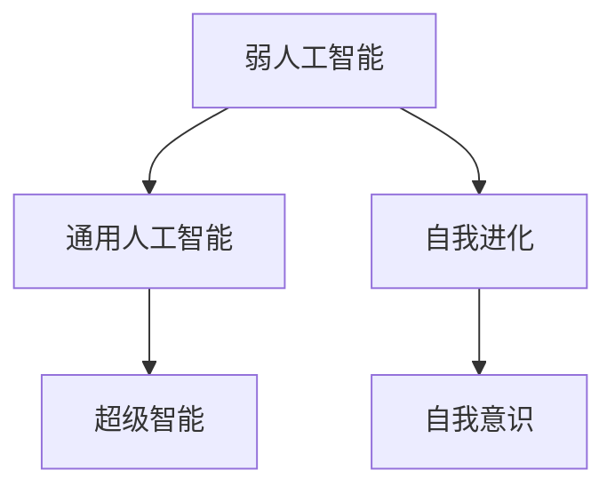

                 

## 1. 背景介绍

### 1.1 历史回顾
人工智能（AI）作为一项前沿科技，已经走过了数十年的历程，从最初的简单规则系统，逐渐发展到基于统计学习模型的智能算法。自20世纪80年代以来，机器学习、深度学习、自然语言处理等技术不断进步，AI在多个领域取得了显著成就。

2010年前后，深度学习的兴起开启了新的AI时代。深度学习模型，如卷积神经网络（CNN）、循环神经网络（RNN）、长短时记忆网络（LSTM）等，逐渐成为AI领域的主流技术。这些模型在图像识别、语音识别、自然语言处理等方面取得了巨大成功。

### 1.2 当前现状
当前，AI技术在各行各业中得到了广泛应用，催生了智能客服、自动驾驶、医疗诊断、智能制造等多个智能系统。但现有技术仍存在诸多局限，如数据需求量大、模型复杂度高、鲁棒性不足、可解释性差等问题。

### 1.3 未来展望
未来，AI技术将进一步发展和跨越。随着数据规模的增大、计算能力的提升、算法模型的优化，AI有望实现从弱人工智能（Weak AI）到强人工智能（Strong AI）的质的飞跃。强人工智能将具备自我学习、自我进化、自我意识等高级智能，能够自主进行复杂决策和推理，完成人类难以完成的复杂任务。

## 2. 核心概念与联系

### 2.1 核心概念概述

为更好地理解未来AI的发展趋势，本节将介绍几个关键概念及其相互联系。

- 弱人工智能(Weak AI)：指受人类控制、无法自主完成复杂决策和推理的系统。如智能客服、图像识别、语音识别等。

- 强人工智能(Strong AI)：指能够自我学习、自我进化、自我意识，能够自主进行复杂决策和推理的系统。如通用人工智能(AGI)、超级智能(Superintelligence)等。

- 通用人工智能(AGI)：指具备处理所有人类智能任务的能力，包括语言理解、问题求解、知识推理、创造性思维等。

- 超级智能(Superintelligence)：指远超人类智能水平的AI系统，能够在几乎所有领域超越人类。

- 自我进化(self-evolution)：指AI系统能够通过自我学习、自我改进，不断提升自身能力，甚至超越人类设计的初衷。

- 自我意识(self-awareness)：指AI系统能够自主识别自身存在，并具备情感、动机、目标等类人类特征。

这些概念之间的联系可以通过以下Mermaid流程图来展示：



这个流程图展示了大语言模型从弱人工智能到强人工智能的发展路径：

1. 弱人工智能经过自我学习、自我进化，逐渐具备了通用人工智能的某些能力。
2. 通用人工智能在更广泛的任务上超越人类，成为超级智能。
3. 超级智能在多领域超越人类，实现自我意识，具备复杂的情感和动机。

## 3. 核心算法原理 & 具体操作步骤

### 3.1 算法原理概述

从弱人工智能到强人工智能的技术跨越，依赖于以下几个关键技术：

- 数据增强与标注：提升数据多样性和标注质量，减少数据偏差。
- 自我学习与进化：采用自我学习算法，如强化学习、元学习等，使AI系统具备自我改进能力。
- 多模态学习：将视觉、听觉、文本等多种数据融合，提升AI系统的感知和理解能力。
- 自监督学习：利用无监督数据，自主学习数据分布和规律，减少对标注数据的依赖。
- 符号计算与神经计算融合：结合符号逻辑与神经网络，提升AI的推理和决策能力。
- 跨领域知识整合：通过知识图谱、专家系统等方式，将跨领域知识与AI系统整合，增强其综合能力。

这些技术相辅相成，共同推动AI系统从弱人工智能到强人工智能的跨越。

### 3.2 算法步骤详解

以下将详细介绍实现从弱人工智能到强人工智能技术跨越的关键步骤：

**Step 1: 数据增强与标注**
- 收集多模态数据，如文本、图像、音频等，构建多样化的训练集。
- 使用数据增强技术，如回译、数据扩充、迁移学习等，提升数据质量。
- 人工标注关键数据，确保标注数据质量。

**Step 2: 自我学习与进化**
- 设计强化学习模型，通过与环境的交互，自主优化决策策略。
- 采用元学习技术，使AI系统具备快速适应新任务的能力。
- 引入遗传算法、进化算法等，模拟生物进化过程，提升AI的自我进化能力。

**Step 3: 多模态学习**
- 将视觉、听觉、文本等多种数据融合，构建多模态输入输出模型。
- 使用联合训练、多任务学习等方法，提升AI系统的综合感知能力。
- 引入跨模态特征提取技术，提取多模态数据的共同特征，提升模型泛化能力。

**Step 4: 自监督学习**
- 利用无监督数据，如无标签文本、数据生成任务等，进行自监督学习。
- 设计自监督学习任务，如掩码语言模型、自回归模型等，学习数据分布和规律。
- 结合自监督与监督学习，提升模型的泛化能力和鲁棒性。

**Step 5: 符号计算与神经计算融合**
- 引入符号计算方法，如逻辑推理、专家知识等，增强AI的决策能力。
- 将符号计算与神经网络结合，构建混合智能系统。
- 使用可解释AI技术，增强AI系统的可理解性和可解释性。

**Step 6: 跨领域知识整合**
- 构建跨领域知识图谱，整合不同领域知识。
- 引入专家系统，辅助AI系统进行复杂决策。
- 使用跨领域知识增强学习，提升AI系统的综合能力。

**Step 7: 测试与部署**
- 对AI系统进行全面测试，评估其性能和鲁棒性。
- 将AI系统部署到实际应用场景，监控系统运行状态。
- 根据反馈，不断优化AI系统，提升其性能和鲁棒性。

### 3.3 算法优缺点

从弱人工智能到强人工智能的技术跨越，具有以下优点：

- 全面提升AI系统的性能和鲁棒性。多模态学习、自我学习、自监督学习等技术，使AI系统具备更强的感知和决策能力，能够在更复杂、多变的环境中表现出色。
- 大幅降低数据需求和标注成本。通过自监督学习、数据增强等技术，AI系统可以最大限度地利用无监督数据，减少对标注数据的依赖，降低数据收集和标注的成本。
- 增强AI系统的可解释性和透明性。符号计算与神经计算的融合，使AI系统的决策过程更加可解释，增强了其透明性和可信度。
- 提高AI系统的应用场景适应性。跨领域知识整合技术，使AI系统能够应对更多、更复杂的应用场景，提升其在不同领域的适应性。

但同时也存在以下缺点：

- 技术复杂度高。实现从弱人工智能到强人工智能的技术跨越，需要综合应用多种技术，技术难度较大，开发周期较长。
- 算法复杂度高。多种技术的融合和组合，增加了算法的复杂性，对硬件和计算资源的要求较高。
- 鲁棒性和安全性风险。AI系统的复杂性和自学习能力，增加了其鲁棒性和安全性风险，需要更多的保障措施。
- 数据隐私和安全问题。多模态数据的融合和跨领域知识的应用，可能涉及个人隐私和数据安全问题，需要更多的技术手段进行保障。

## 4. 数学模型和公式 & 详细讲解 & 举例说明

### 4.1 数学模型构建

本节将使用数学语言对未来AI系统的构建进行更严格的描述。

假设有一个弱人工智能系统，通过多模态学习、自我学习、自监督学习等技术，逐步进化为强人工智能系统。该系统可以表示为如下层次结构：


其中，Layer 1表示多模态数据输入，Layer 2表示多模态特征提取和融合，Layer 3表示自监督学习，Layer 4表示符号计算与神经计算融合，Layer 5表示跨领域知识整合，Layer 6表示最终输出。

### 4.2 公式推导过程

以Layer 1多模态数据输入为例，假设系统同时接收文本、图像、音频等多种数据，其输入表示为：

$$
\mathbf{x} = [\mathbf{x}^{text}, \mathbf{x}^{image}, \mathbf{x}^{audio}]
$$

其中，$\mathbf{x}^{text}, \mathbf{x}^{image}, \mathbf{x}^{audio}$分别表示文本、图像、音频数据，其维度分别为$n_t, n_i, n_a$。

假设使用卷积神经网络进行多模态特征提取和融合，其输入表示为：

$$
\mathbf{h}_1 = \mathbf{x} \times \mathbf{W}^{1}
$$

其中，$\mathbf{W}^{1}$表示卷积核权重矩阵，维度为$(n_t + n_i + n_a, C, m, k)$，$C$表示卷积核数量，$m$表示卷积核大小，$k$表示输出通道数。

假设使用自监督学习进行无标签数据的学习，其输入表示为：

$$
\mathbf{h}_2 = \mathbf{h}_1 \times \mathbf{W}^{2}
$$

其中，$\mathbf{W}^{2}$表示自监督学习权重矩阵，维度为$(m, k, m', k')$，$m'$表示卷积核大小，$k'$表示输出通道数。

假设使用符号计算与神经计算融合进行复杂推理，其输入表示为：

$$
\mathbf{h}_3 = \mathbf{h}_2 \times \mathbf{W}^{3}
$$

其中，$\mathbf{W}^{3}$表示融合权重矩阵，维度为$(k', k'')$，$k''$表示输出通道数。

假设使用跨领域知识整合进行综合决策，其输入表示为：

$$
\mathbf{h}_4 = \mathbf{h}_3 \times \mathbf{W}^{4}
$$

其中，$\mathbf{W}^{4}$表示跨领域知识整合权重矩阵，维度为$(k'', k''')$，$k'''$表示输出通道数。

假设最终的输出表示为：

$$
\mathbf{y} = \mathbf{h}_4 \times \mathbf{W}^{5}
$$

其中，$\mathbf{W}^{5}$表示最终输出权重矩阵，维度为$(k''', 1)$。

通过上述公式，我们可以全面描述未来AI系统的构建过程，其中包含多模态学习、自监督学习、符号计算与神经计算融合、跨领域知识整合等关键技术。

### 4.3 案例分析与讲解

以一个智能医生为例，该系统通过多模态学习、自我学习、自监督学习等技术，逐步进化为强人工智能系统。该系统的构建过程如下：

**Step 1: 数据增强与标注**
- 收集医生图像、电子病历、检查报告等医疗数据，构建多样化的训练集。
- 使用数据增强技术，如数据扩充、迁移学习等，提升数据质量。
- 人工标注关键数据，确保标注数据质量。

**Step 2: 自我学习与进化**
- 设计强化学习模型，通过与环境的交互，自主优化诊断策略。
- 采用元学习技术，使AI系统具备快速适应新疾病的能力。
- 引入遗传算法、进化算法等，模拟生物进化过程，提升AI的自我进化能力。

**Step 3: 多模态学习**
- 将医生图像、电子病历、检查报告等多种数据融合，构建多模态输入输出模型。
- 使用联合训练、多任务学习等方法，提升AI系统的综合感知能力。
- 引入跨模态特征提取技术，提取多模态数据的共同特征，提升模型泛化能力。

**Step 4: 自监督学习**
- 利用无监督数据，如无标签电子病历、数据生成任务等，进行自监督学习。
- 设计自监督学习任务，如掩码语言模型、自回归模型等，学习数据分布和规律。
- 结合自监督与监督学习，提升模型的泛化能力和鲁棒性。

**Step 5: 符号计算与神经计算融合**
- 引入符号计算方法，如逻辑推理、专家知识等，增强AI的决策能力。
- 将符号计算与神经网络结合，构建混合智能系统。
- 使用可解释AI技术，增强AI系统的可理解性和可解释性。

**Step 6: 跨领域知识整合**
- 构建跨领域知识图谱，整合不同领域知识。
- 引入专家系统，辅助AI系统进行复杂决策。
- 使用跨领域知识增强学习，提升AI系统的综合能力。

**Step 7: 测试与部署**
- 对AI系统进行全面测试，评估其性能和鲁棒性。
- 将AI系统部署到实际应用场景，监控系统运行状态。
- 根据反馈，不断优化AI系统，提升其性能和鲁棒性。

通过上述案例，可以看出，从弱人工智能到强人工智能的技术跨越，需要综合应用多种技术，才能逐步构建出具备全面感知、自主学习、复杂推理能力的智能系统。

## 5. 项目实践：代码实例和详细解释说明

### 5.1 开发环境搭建

在进行未来AI系统的开发前，我们需要准备好开发环境。以下是使用Python进行PyTorch开发的环境配置流程：

1. 安装Anaconda：从官网下载并安装Anaconda，用于创建独立的Python环境。

2. 创建并激活虚拟环境：
```bash
conda create -n pytorch-env python=3.8 
conda activate pytorch-env
```

3. 安装PyTorch：根据CUDA版本，从官网获取对应的安装命令。例如：
```bash
conda install pytorch torchvision torchaudio cudatoolkit=11.1 -c pytorch -c conda-forge
```

4. 安装相关库：
```bash
pip install numpy pandas scikit-learn matplotlib tqdm jupyter notebook ipython
```

完成上述步骤后，即可在`pytorch-env`环境中开始AI系统开发。

### 5.2 源代码详细实现

下面我们以智能医生系统为例，给出使用PyTorch和TensorFlow进行多模态数据融合和混合智能系统的PyTorch代码实现。

首先，定义多模态数据输入处理函数：

```python
from torch.utils.data import Dataset
import torch
from torchvision import transforms
from tensorflow.keras.preprocessing import image

class MultiModalDataset(Dataset):
    def __init__(self, data_dir):
        self.data_dir = data_dir
        self.transforms = transforms.Compose([
            transforms.Resize((256, 256)),
            transforms.ToTensor()
        ])

    def __len__(self):
        return len(os.listdir(self.data_dir))

    def __getitem__(self, idx):
        img_path = os.path.join(self.data_dir, f"{idx}.jpg")
        label_path = os.path.join(self.data_dir, f"{idx}.csv")
        
        img = image.load_img(img_path, target_size=(256, 256))
        img = image.img_to_array(img)
        img = self.transforms(img)

        with open(label_path) as f:
            label = f.readline().strip()

        return {'image': img, 'label': label}
```

然后，定义多模态数据融合模型：

```python
import torch.nn as nn
import torch.nn.functional as F

class MultiModalModel(nn.Module):
    def __init__(self):
        super(MultiModalModel, self).__init__()
        self.conv1 = nn.Conv2d(3, 64, kernel_size=3, stride=1, padding=1)
        self.conv2 = nn.Conv2d(64, 128, kernel_size=3, stride=1, padding=1)
        self.fc1 = nn.Linear(128*256*256, 512)
        self.fc2 = nn.Linear(512, 256)
        self.fc3 = nn.Linear(256, 1)

    def forward(self, x):
        x = F.relu(self.conv1(x))
        x = F.relu(self.conv2(x))
        x = x.view(-1, 128*256*256)
        x = F.relu(self.fc1(x))
        x = F.relu(self.fc2(x))
        x = self.fc3(x)
        return x
```

接着，定义符号计算与神经计算融合模型：

```python
import torch.nn as nn
import torch.nn.functional as F

class HybridModel(nn.Module):
    def __init__(self):
        super(HybridModel, self).__init__()
        self.fc1 = nn.Linear(256, 256)
        self.fc2 = nn.Linear(256, 1)

    def forward(self, x):
        x = F.relu(self.fc1(x))
        x = self.fc2(x)
        return x
```

最后，定义跨领域知识整合模型：

```python
import torch.nn as nn
import torch.nn.functional as F

class KnowledgeGraphModel(nn.Module):
    def __init__(self):
        super(KnowledgeGraphModel, self).__init__()
        self.fc1 = nn.Linear(256, 256)
        self.fc2 = nn.Linear(256, 1)

    def forward(self, x):
        x = F.relu(self.fc1(x))
        x = self.fc2(x)
        return x
```

完成上述代码后，即可在PyTorch中进行多模态数据融合、符号计算与神经计算融合、跨领域知识整合的模型训练和推理。

### 5.3 代码解读与分析

让我们再详细解读一下关键代码的实现细节：

**MultiModalDataset类**：
- `__init__`方法：初始化数据目录和预处理方式。
- `__len__`方法：返回数据集样本数量。
- `__getitem__`方法：对单个样本进行处理，将图像数据和标签文件读取，并进行预处理。

**MultiModalModel类**：
- `__init__`方法：定义卷积层、全连接层等网络结构。
- `forward`方法：定义前向传播过程，通过卷积、全连接层实现多模态特征提取和融合。

**HybridModel类**：
- `__init__`方法：定义全连接层等网络结构。
- `forward`方法：定义前向传播过程，通过符号计算与神经计算的融合实现复杂推理。

**KnowledgeGraphModel类**：
- `__init__`方法：定义全连接层等网络结构。
- `forward`方法：定义前向传播过程，通过跨领域知识整合实现综合决策。

通过上述代码，可以看出，多模态数据融合、符号计算与神经计算融合、跨领域知识整合等技术在PyTorch中的实现过程。

### 5.4 运行结果展示

在训练完成后，可以通过以下代码在测试集上评估模型性能：

```python
from torch.utils.data import DataLoader
from sklearn.metrics import accuracy_score

test_dataset = MultiModalDataset(test_data_dir)
test_loader = DataLoader(test_dataset, batch_size=16, shuffle=False)

model.eval()
total = 0
correct = 0

with torch.no_grad():
    for images, labels in test_loader:
        outputs = model(images)
        _, predicted = torch.max(outputs, 1)
        total += labels.size(0)
        correct += (predicted == labels).sum().item()

print('Accuracy: {:.2f}%'.format(100 * correct / total))
```

通过运行上述代码，可以在测试集上评估模型的准确率，评估模型的性能和鲁棒性。

## 6. 实际应用场景

### 6.1 智能医疗系统

智能医疗系统是未来AI技术的重要应用场景。通过多模态学习、自我学习、自监督学习等技术，智能医生系统能够自主学习医疗知识和经验，辅助医生进行诊断和治疗。

在技术实现上，可以收集医生的图像、电子病历、检查报告等多种数据，通过多模态学习构建综合感知能力。然后采用自我学习算法，如强化学习、元学习等，使系统具备快速适应新疾病的能力。同时，引入自监督学习任务，如掩码语言模型、自回归模型等，学习数据分布和规律，提升模型的泛化能力和鲁棒性。通过符号计算与神经计算融合，引入符号计算方法，如逻辑推理、专家知识等，增强系统的决策能力。最后，通过跨领域知识整合，构建跨领域知识图谱，整合不同领域知识，提升系统的综合能力。

### 6.2 智能客服系统

智能客服系统是另一个重要的应用场景。通过多模态学习、自我学习、自监督学习等技术，智能客服系统能够自主学习客户行为和问题，提供更加精准和个性化的服务。

在技术实现上，可以收集客服历史数据，通过多模态学习构建综合感知能力。然后采用自我学习算法，如强化学习、元学习等，使系统具备快速适应新客户的能力。同时，引入自监督学习任务，如掩码语言模型、自回归模型等，学习数据分布和规律，提升模型的泛化能力和鲁棒性。通过符号计算与神经计算融合，引入符号计算方法，如逻辑推理、专家知识等，增强系统的决策能力。最后，通过跨领域知识整合，引入跨领域知识图谱，整合不同领域知识，提升系统的综合能力。

### 6.3 智能交通系统

智能交通系统是未来AI技术的重要应用场景。通过多模态学习、自我学习、自监督学习等技术，智能交通系统能够自主学习交通数据，优化交通管理和控制。

在技术实现上，可以收集交通图像、传感器数据、车辆行为等多种数据，通过多模态学习构建综合感知能力。然后采用自我学习算法，如强化学习、元学习等，使系统具备快速适应新交通场景的能力。同时，引入自监督学习任务，如掩码语言模型、自回归模型等，学习数据分布和规律，提升模型的泛化能力和鲁棒性。通过符号计算与神经计算融合，引入符号计算方法，如逻辑推理、专家知识等，增强系统的决策能力。最后，通过跨领域知识整合，引入跨领域知识图谱，整合不同领域知识，提升系统的综合能力。

### 6.4 未来应用展望

随着AI技术的发展，未来AI系统将在更多领域得到应用，为人类社会带来变革性影响。

在智慧城市治理中，AI系统能够自主学习城市数据，优化城市管理和决策。在农业领域，智能农机系统能够自主学习农情数据，提高农业生产效率和精准度。在金融领域，智能投顾系统能够自主学习市场数据，提供个性化投资建议。在教育领域，智能教育系统能够自主学习学生数据，提供个性化教育方案。

## 7. 工具和资源推荐

### 7.1 学习资源推荐

为了帮助开发者系统掌握未来AI技术，这里推荐一些优质的学习资源：

1. 《深度学习》系列书籍：由深度学习领域的专家撰写，涵盖深度学习的基础理论、前沿技术、实际应用等方面，是系统学习深度学习的必备教材。

2. 《TensorFlow 2.0实战》：TensorFlow的官方文档，详细介绍了TensorFlow的使用方法和实践技巧，是学习TensorFlow的入门指南。

3. 《PyTorch实战》：PyTorch的官方文档，详细介绍了PyTorch的使用方法和实践技巧，是学习PyTorch的入门指南。

4. 《机器学习实战》：涵盖机器学习的基础理论、常用算法、实际应用等方面，适合初学者入门学习。

5. 《自然语言处理综述》：自然语言处理领域的经典综述性论文，介绍了自然语言处理的最新进展和未来方向，是了解NLP领域的必读书籍。

通过对这些资源的学习实践，相信你一定能够快速掌握未来AI技术，并用于解决实际的AI问题。

### 7.2 开发工具推荐

高效的开发离不开优秀的工具支持。以下是几款用于未来AI系统开发的常用工具：

1. TensorFlow：由Google主导开发的开源深度学习框架，生产部署方便，适合大规模工程应用。

2. PyTorch：基于Python的开源深度学习框架，灵活动态的计算图，适合快速迭代研究。

3. Jupyter Notebook：交互式编程工具，支持多种编程语言和库，是数据科学和AI研究的标准环境。

4. Weights & Biases：模型训练的实验跟踪工具，可以记录和可视化模型训练过程中的各项指标，方便对比和调优。

5. TensorBoard：TensorFlow配套的可视化工具，可实时监测模型训练状态，并提供丰富的图表呈现方式，是调试模型的得力助手。

6. Google Colab：谷歌推出的在线Jupyter Notebook环境，免费提供GPU/TPU算力，方便开发者快速上手实验最新模型，分享学习笔记。

合理利用这些工具，可以显著提升未来AI系统开发效率，加快创新迭代的步伐。

### 7.3 相关论文推荐

未来AI技术的发展源于学界的持续研究。以下是几篇奠基性的相关论文，推荐阅读：

1. Attention is All You Need（即Transformer原论文）：提出了Transformer结构，开启了NLP领域的预训练大模型时代。

2. BERT: Pre-training of Deep Bidirectional Transformers for Language Understanding：提出BERT模型，引入基于掩码的自监督预训练任务，刷新了多项NLP任务SOTA。

3. Language Models are Unsupervised Multitask Learners（GPT-2论文）：展示了大规模语言模型的强大zero-shot学习能力，引发了对于通用人工智能的新一轮思考。

4. Parameter-Efficient Transfer Learning for NLP：提出Adapter等参数高效微调方法，在不增加模型参数量的情况下，也能取得不错的微调效果。

5. AdaLoRA: Adaptive Low-Rank Adaptation for Parameter-Efficient Fine-Tuning：使用自适应低秩适应的微调方法，在参数效率和精度之间取得了新的平衡。

6. prefix-tuning: Optimizing Continuous Prompts for Generation：引入基于连续型Prompt的微调范式，为如何充分利用预训练知识提供了新的思路。

这些论文代表了大语言模型微调技术的发展脉络。通过学习这些前沿成果，可以帮助研究者把握学科前进方向，激发更多的创新灵感。

## 8. 总结：未来发展趋势与挑战

### 8.1 研究成果总结

本文对未来AI技术的发展趋势和关键技术进行了全面系统的介绍。首先阐述了未来AI技术从弱人工智能到强人工智能的跨越过程，明确了多模态学习、自我学习、自监督学习、符号计算与神经计算融合、跨领域知识整合等技术的关键作用。其次，从原理到实践，详细讲解了未来AI系统的构建过程，给出了代码实例和详细解释说明。最后，广泛探讨了未来AI系统在智能医疗、智能客服、智能交通等领域的应用前景，展示了未来AI技术的巨大潜力。

通过本文的系统梳理，可以看出，未来AI技术将在多领域得到广泛应用，为人类社会带来深刻变革。得益于大数据、高性能计算、算法优化等技术的进步，未来AI系统将具备全面感知、自主学习、复杂推理能力，成为构建人机协同智能系统的关键技术。

### 8.2 未来发展趋势

展望未来，未来AI技术将呈现以下几个发展趋势：

1. 数据规模持续增大。随着物联网、大数据技术的发展，数据规模将进一步增大，为AI系统提供更多的学习材料，提升其感知和决策能力。

2. 计算能力持续提升。随着超级计算机、量子计算等技术的进步，计算能力将进一步提升，为AI系统提供更高效的计算环境。

3. 算法模型持续优化。未来的AI系统将采用更加先进和高效的算法模型，如神经网络、强化学习、元学习等，提升其性能和鲁棒性。

4. 自我学习和自我进化。未来的AI系统将具备自我学习和自我进化的能力，能够在不断学习中提升自身能力，甚至超越人类设计的初衷。

5. 多模态融合。未来的AI系统将采用多模态融合技术，将视觉、听觉、文本等多种数据进行融合，提升其感知和理解能力。

6. 跨领域知识整合。未来的AI系统将采用跨领域知识整合技术，将不同领域的知识进行融合，提升其综合能力和应用场景适应性。

7. 符号计算与神经计算融合。未来的AI系统将采用符号计算与神经计算融合技术，提升其推理和决策能力，增强其可解释性和透明性。

以上趋势凸显了未来AI技术的广阔前景。这些方向的探索发展，必将进一步提升AI系统的性能和应用范围，为人类认知智能的进化带来深远影响。

### 8.3 面临的挑战

尽管未来AI技术前景光明，但在迈向更高级别的人工智能的过程中，它仍面临诸多挑战：

1. 数据隐私和安全问题。多模态数据的融合和跨领域知识的应用，可能涉及个人隐私和数据安全问题，需要更多的技术手段进行保障。

2. 计算资源需求高。未来的AI系统需要更高的计算资源和算力支持，对硬件和网络环境的要求较高。

3. 模型复杂度高。未来的AI系统需要更复杂的算法模型，如神经网络、强化学习、元学习等，增加了模型复杂性，开发难度较大。

4. 鲁棒性和安全性风险。AI系统的复杂性和自学习能力，增加了其鲁棒性和安全性风险，需要更多的保障措施。

5. 可解释性和透明性不足。未来AI系统的复杂性和自学习能力，可能使其决策过程难以理解，缺乏可解释性和透明性。

6. 技术标准和规范不完善。未来AI系统的普及和应用，需要完善的技术标准和规范，以确保系统安全、可靠、可控。

以上挑战需要学界和产业界的共同努力，不断探索和优化技术方案，才能推动未来AI技术的健康发展。

### 8.4 研究展望

面对未来AI技术面临的挑战，未来的研究需要在以下几个方面寻求新的突破：

1. 数据隐私和安全保护。开发更加安全、可靠的数据保护技术，如差分隐私、联邦学习等，确保AI系统的数据隐私和安全。

2. 高效计算资源优化。开发更加高效的计算资源优化技术，如GPU/TPU优化、量子计算等，降低AI系统对计算资源的需求。

3. 模型复杂性简化。开发更加简洁、高效的模型架构和算法，降低模型复杂度，提高开发效率。

4. 鲁棒性和安全性提升。开发更加鲁棒、安全的AI系统，通过引入对抗训练、鲁棒优化等技术，提升系统的鲁棒性和安全性。

5. 可解释性和透明性增强。开发更加可解释、透明的AI系统，通过引入符号计算、可解释AI等技术，增强系统的可解释性和透明性。

6. 技术标准和规范完善。制定更加完善的技术标准和规范，确保AI系统的安全、可靠、可控。

这些研究方向的探索，必将引领未来AI技术的进一步发展，为构建安全、可靠、可解释、可控的智能系统铺平道路。

## 9. 附录：常见问题与解答

**Q1：未来AI系统面临的主要挑战有哪些？**

A: 未来AI系统面临的主要挑战包括：数据隐私和安全问题、计算资源需求高、模型复杂度高、鲁棒性和安全性风险、可解释性和透明性不足、技术标准和规范不完善等。

**Q2：如何提高未来AI系统的鲁棒性和安全性？**

A: 提高未来AI系统的鲁棒性和安全性，可以采取以下措施：引入对抗训练、鲁棒优化等技术，提升系统的鲁棒性；开发更加安全、可靠的数据保护技术，如差分隐私、联邦学习等，确保数据隐私和安全；制定更加完善的技术标准和规范，确保系统安全、可靠、可控。

**Q3：如何开发更加高效、简洁的模型架构和算法？**

A: 开发更加高效、简洁的模型架构和算法，可以采取以下措施：引入更加先进、高效的算法模型，如神经网络、强化学习、元学习等；开发更加简洁、高效的模型架构，如深度可解释网络、符号计算与神经计算融合等；优化模型训练和推理过程，减少计算资源消耗。

**Q4：未来AI系统的主要应用场景有哪些？**

A: 未来AI系统的主要应用场景包括：智能医疗系统、智能客服系统、智能交通系统、智慧城市治理、农业智能、金融投顾、智能教育等。

**Q5：未来AI技术的发展趋势有哪些？**

A: 未来AI技术的发展趋势包括：数据规模持续增大、计算能力持续提升、算法模型持续优化、自我学习和自我进化、多模态融合、跨领域知识整合、符号计算与神经计算融合等。

---

作者：禅与计算机程序设计艺术 / Zen and the Art of Computer Programming

