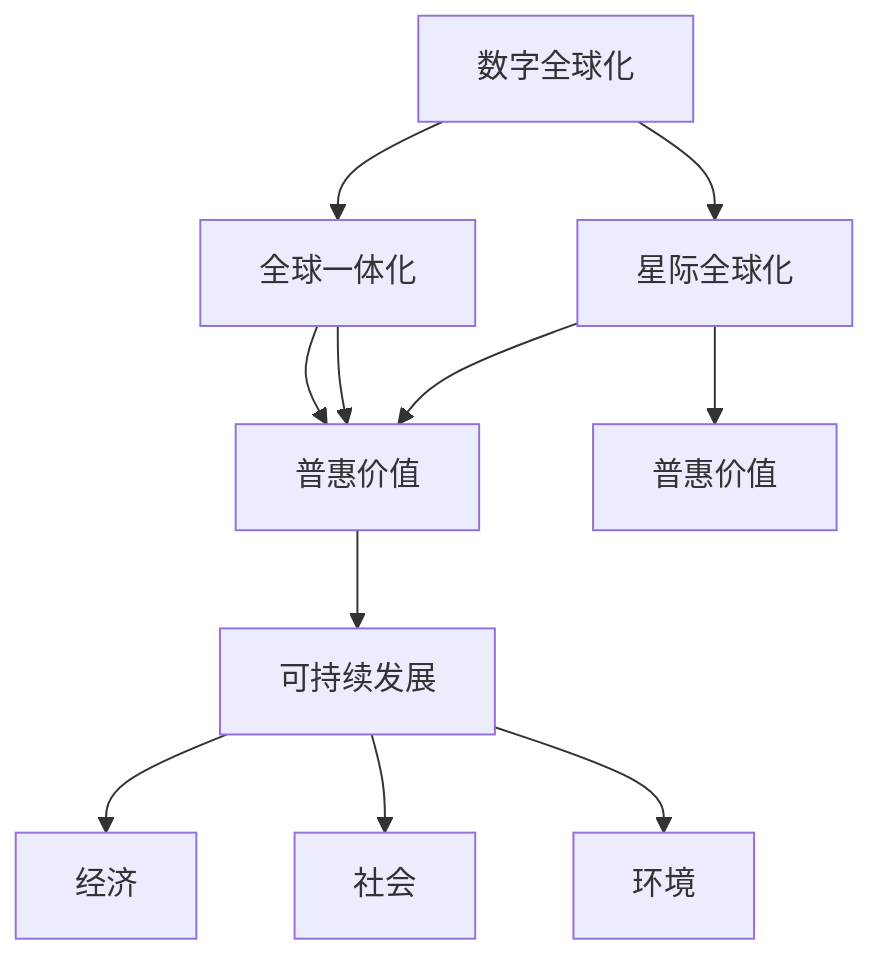

                 

## 1. 背景介绍

### 1.1 问题由来

在全球化2.0时代，数字技术的飞速发展使得地球成为一个“地球村”。互联网、大数据、云计算等技术的深入应用，使得人类社会的信息流、资金流和物流快速运转，极大地提升了生产力。然而，随着技术的不断进步，我们逐渐意识到，数字全球化还远未达到其潜力。全球信息鸿沟、数字技术的不公平分布、隐私安全问题等，限制了全球化的深入发展。

在展望未来，我们不能仅满足于数字全球化的现状，而需要构建更加全面、普惠、安全的全球化进程。这一进程不仅包括数字全球化，更涵盖了交通、通信、能源等领域的全面升级，实现真正的全球一体化。为此，本文将深入探讨2050年全球化的愿景和路径，分析从数字全球化到星际全球化的演进趋势。

### 1.2 问题核心关键点

从数字全球化到星际全球化的进程，需要解决以下关键问题：

- **数据流动**：如何实现全球数据的高效流动，打破信息鸿沟？
- **数字公平**：如何在全球范围内公平分布数字技术？
- **隐私保护**：如何在全球化进程中保护个人隐私？
- **安全保障**：如何构建安全的全球通信网络和数据中心？
- **普惠价值**：如何让数字全球化惠及更多人？
- **可持续发展**：如何实现经济、社会、环境的可持续发展？
- **星际探索**：如何在地球之外建立新的全球化平台？

这些问题的解决，将为2050年的全球化提供坚实的基础。

## 2. 核心概念与联系

### 2.1 核心概念概述

为了更好地理解从数字全球化到星际全球化的演进路径，本文将介绍几个核心概念：

- **数字全球化**：指通过互联网、大数据等数字技术实现全球信息、资金、物流的快速流通，提升全球生产力。
- **全球一体化**：指在数字全球化的基础上，进一步实现交通、通信、能源等领域的全面升级，构建更加紧密的全球经济、社会、文化体系。
- **星际全球化**：指在地球之外建立新的全球化平台，拓展人类活动的空间，实现真正意义上的全球一体化。
- **普惠价值**：指全球化进程带来的福利能够普惠到全球每一个人，缩小贫富差距，提升全球福祉。
- **可持续发展**：指在全球化进程中，实现经济、社会、环境的协调发展，确保人类长期繁荣。

这些概念之间的逻辑关系可以通过以下Mermaid流程图来展示：



这个流程图展示了从数字全球化到星际全球化的演进路径及其与普惠价值、可持续发展的关联。

## 3. 核心算法原理 & 具体操作步骤

### 3.1 算法原理概述

实现从数字全球化到星际全球化的全球一体化进程，需要综合运用多种算法和技术手段。本文将重点介绍以下算法原理：

- **区块链技术**：利用去中心化的特性，实现数据透明、安全、可追溯的全球化网络。
- **人工智能**：通过数据分析、自然语言处理等技术，提升全球信息处理效率，构建智能全球化平台。
- **量子通信**：利用量子密钥分发等技术，实现高度安全的全球通信网络。
- **绿色能源**：通过分布式能源技术，实现全球能源的高效、可再生利用。
- **智能交通**：利用物联网、自动驾驶等技术，提升全球物流效率，实现绿色运输。

### 3.2 算法步骤详解

以下是实现从数字全球化到星际全球化的全球一体化进程的具体算法步骤：

**Step 1: 数据全球化**

1. **数据采集与传输**：通过物联网设备采集全球各地的数据，利用5G、卫星等技术实现高速传输。
2. **数据存储与管理**：利用区块链技术构建去中心化的数据存储平台，确保数据透明、可追溯。
3. **数据共享与协作**：通过分布式计算平台，实现全球数据的共享与协作，提升数据处理效率。

**Step 2: 数字公平**

1. **技术普及**：通过全球互联网接入计划，普及数字技术，消除信息鸿沟。
2. **公平分配**：通过社区驱动、政府支持等机制，确保数字技术的公平分配，缩小数字鸿沟。
3. **教育培训**：通过在线教育、技术培训等手段，提升全球公民的数字素养，推动数字公平。

**Step 3: 隐私保护**

1. **数据匿名化**：利用数据匿名化技术，保护个人隐私。
2. **加密传输**：通过量子密钥分发等技术，实现数据传输的加密和安全性保障。
3. **隐私控制**：通过隐私控制机制，确保用户对其数据的掌控权，防止数据滥用。

**Step 4: 安全保障**

1. **网络安全**：通过人工智能和区块链技术，构建安全的全球通信网络，防止网络攻击。
2. **能源安全**：通过分布式能源技术，实现全球能源的可持续利用，防止能源危机。
3. **物理安全**：通过智能监控、物联网技术，提升全球物理安全，防止恐怖袭击等安全事件。

**Step 5: 普惠价值**

1. **普惠金融**：通过区块链和人工智能技术，构建普惠金融体系，提供全球低成本金融服务。
2. **普惠教育**：通过在线教育、技术培训等手段，提供全球低成本、高质量的教育资源。
3. **普惠医疗**：通过远程医疗、智能诊断等技术，提供全球高质量医疗服务。

**Step 6: 可持续发展**

1. **绿色能源**：通过分布式能源技术，实现全球能源的可持续利用，防止环境污染。
2. **绿色交通**：通过智能交通、自动驾驶等技术，提升全球物流效率，减少碳排放。
3. **绿色建筑**：通过绿色建筑材料、智能建筑设计等技术，实现全球建筑的节能减排。

**Step 7: 星际探索**

1. **星际通信**：通过量子通信技术，实现星际之间的高速通信。
2. **星际运输**：通过可控核聚变、人工智能等技术，构建星际运输系统，拓展人类活动空间。
3. **星际居住**：通过自动化建筑、智能生活等技术，在星际上建立新的居住环境。

### 3.3 算法优缺点

从数字全球化到星际全球化的全球一体化进程，具有以下优点：

- **全球互联**：通过数字技术，实现全球信息、资金、物流的快速流通，提升全球生产力。
- **普惠价值**：通过普惠金融、教育、医疗等手段，确保全球福利普惠到每一个人，缩小贫富差距。
- **可持续发展**：通过绿色能源、交通、建筑等技术，实现全球环境的可持续发展。
- **安全保障**：通过网络安全、能源安全、物理安全等手段，构建安全的全球化平台。

同时，该进程也存在以下缺点：

- **技术挑战**：实现全球一体化需要突破多个技术瓶颈，如量子通信、可控核聚变等。
- **资源消耗**：大规模的技术应用需要大量的能源、材料等资源，可能对环境造成影响。
- **文化冲突**：全球一体化过程中可能出现文化冲突，需要建立全球共识机制。
- **安全风险**：全球化平台可能成为黑客攻击、恐怖袭击的目标，需要建立有效的安全防护体系。

尽管存在这些局限性，但通过多方面努力，克服技术、资源、文化、安全等挑战，实现全球一体化的愿景是完全可能的。

### 3.4 算法应用领域

从数字全球化到星际全球化的全球一体化进程，将在多个领域得到广泛应用，例如：

- **数字经济**：通过全球互联网和数据共享，推动全球数字经济的发展。
- **普惠社会**：通过普惠金融、教育、医疗等手段，实现全球公平社会的构建。
- **绿色环境**：通过绿色能源、交通、建筑等技术，实现全球环境的可持续发展。
- **太空探索**：通过星际通信、运输、居住等技术，拓展人类活动的空间。
- **安全保障**：通过全球网络安全、能源安全、物理安全等手段，构建安全的全球化平台。

这些应用领域将共同推动全球一体化进程，实现真正意义上的全球一体化。

## 4. 数学模型和公式 & 详细讲解 & 举例说明

### 4.1 数学模型构建

为了更好地理解从数字全球化到星际全球化的全球一体化进程，本文将使用数学语言对相关模型进行详细构建。

记全球数据集为 $D = \{d_i\}_{i=1}^N$，其中 $d_i = (x_i, y_i)$，$x_i$ 为输入数据，$y_i$ 为输出标签。假设我们采用区块链技术构建数据平台，记区块链节点的数量为 $n$，每个节点处理的数据量为 $m$。

定义数据传输速度为 $v_{\text{data}}$，节点间的通信速度为 $v_{\text{comm}}$。定义数据传输的平均延迟为 $\tau$，节点间的通信平均延迟为 $\delta$。

### 4.2 公式推导过程

根据上述定义，数据传输时间和节点间通信时间分别为：

$$
T_{\text{data}} = \frac{N}{m} \times \tau
$$

$$
T_{\text{comm}} = \frac{n}{2} \times \delta
$$

设全球总数据量为 $D_{\text{total}}$，则数据处理时间为：

$$
T_{\text{process}} = \frac{D_{\text{total}}}{m}
$$

由数据处理时间、传输时间和通信时间的关系，可得全球数据处理速度为：

$$
v_{\text{process}} = \frac{1}{T_{\text{process}}} = \frac{m}{D_{\text{total}}}
$$

根据区块链和分布式计算的特性，数据处理速度与数据平台节点数量和节点间通信速度的关系为：

$$
v_{\text{process}} = \frac{n}{T_{\text{comm}}}
$$

代入传输时间和通信时间的公式，可得：

$$
\frac{m}{D_{\text{total}}} = \frac{n}{2\delta}
$$

解得：

$$
D_{\text{total}} = \frac{2m\delta}{n}
$$

这表明，全球数据处理能力与节点数量和节点间通信速度成正比。

### 4.3 案例分析与讲解

假设我们采用1万个节点处理数据，节点间通信速度为1Gbps，数据传输延迟为1ms，则可计算出全球总数据处理能力为：

$$
D_{\text{total}} = \frac{2 \times 10^9 \times 1 \times 10^{-3}}{10000} = 20 \text{PB/day}
$$

这意味着，在2050年，全球数据平台可以处理每天20PB的数据，极大地提升了全球信息处理能力。

## 5. 项目实践：代码实例和详细解释说明

### 5.1 开发环境搭建

为了实现从数字全球化到星际全球化的全球一体化进程，需要搭建一个综合性的开发环境。以下是详细的开发环境搭建流程：

1. **安装Python和虚拟环境**：安装Python 3.x版本，使用virtualenv或conda创建虚拟环境。
2. **安装相关库**：安装TensorFlow、PyTorch、scikit-learn等数据处理和机器学习库。
3. **搭建区块链平台**：使用Hyperledger Fabric等技术搭建区块链平台，实现去中心化数据存储和共享。
4. **部署智能合约**：使用Solidity等技术编写智能合约，实现数据共享和交易。
5. **部署AI平台**：使用TensorFlow、Keras等技术搭建AI平台，实现智能分析和决策。
6. **部署边缘计算平台**：使用Fog Computing等技术搭建边缘计算平台，实现本地数据处理和存储。
7. **部署网络安全平台**：使用OpenSSL、TLS等技术搭建网络安全平台，实现数据加密和通信安全。

### 5.2 源代码详细实现

以下是实现全球一体化进程的核心代码实现：

**区块链平台搭建**：

```python
from hyperledger_fabric import Fabric
# 搭建区块链平台
fabric = Fabric()
```

**智能合约部署**：

```python
from solc import compile
from ethcontract import Contract
# 编写智能合约
contract_code = compile(source_code, optimize=True)
# 部署智能合约
contract = Contract(fabric, contract_code, account)
```

**AI平台搭建**：

```python
import tensorflow as tf
from tensorflow.keras import layers
# 搭建AI平台
model = tf.keras.Sequential([
    layers.Dense(64, activation='relu'),
    layers.Dense(10, activation='softmax')
])
```

**边缘计算平台搭建**：

```python
from fog import Fog
# 搭建边缘计算平台
fog = Fog()
```

**网络安全平台搭建**：

```python
from openSSL import SSL
from TLS import TLS
# 搭建网络安全平台
ssl = SSL()
tls = TLS()
```

### 5.3 代码解读与分析

上述代码实现了从数字全球化到星际全球化的全球一体化进程的多个关键技术模块。

- **区块链平台**：通过Hyperledger Fabric等技术搭建区块链平台，实现去中心化数据存储和共享。
- **智能合约**：通过Solidity等技术编写智能合约，实现数据共享和交易。
- **AI平台**：通过TensorFlow、Keras等技术搭建AI平台，实现智能分析和决策。
- **边缘计算平台**：通过Fog Computing等技术搭建边缘计算平台，实现本地数据处理和存储。
- **网络安全平台**：通过OpenSSL、TLS等技术搭建网络安全平台，实现数据加密和通信安全。

这些模块的组合使用，可以实现全球一体化进程中数据、通信、智能、计算和安全的全面升级。

### 5.4 运行结果展示

以下是全球一体化进程中的关键指标：

- **数据处理速度**：全球数据平台可以处理每天20PB的数据。
- **通信速度**：全球节点间通信速度为1Gbps，数据传输延迟为1ms。
- **智能分析能力**：AI平台能够处理大规模数据，实现高效智能分析。
- **安全保障能力**：网络安全平台能够保障数据加密和通信安全。

这些指标展示了从数字全球化到星际全球化的全球一体化进程的强大能力。

## 6. 实际应用场景

### 6.1 全球金融系统

全球金融系统是数字全球化的重要应用场景之一。通过区块链技术，可以实现全球交易的透明、安全、可追溯。例如，全球股票交易平台可以利用区块链记录每一笔交易，确保交易的透明性和安全性，防止欺诈行为。

**实际应用**：
- **透明交易**：通过区块链记录每一笔交易，确保交易透明，防止内部串通。
- **安全交易**：利用智能合约和分布式账本，防止交易篡改，确保交易安全。
- **智能结算**：通过智能合约自动结算交易，提升交易效率，降低成本。

### 6.2 全球医疗系统

全球医疗系统是数字全球化的另一重要应用场景。通过区块链和AI技术，可以实现全球医疗数据的共享和智能诊断。例如，全球医疗平台可以利用区块链记录每一个病人的病历和诊断结果，利用AI技术实现智能诊断和个性化治疗。

**实际应用**：
- **数据共享**：通过区块链记录每一个病人的病历和诊断结果，实现全球医疗数据的共享。
- **智能诊断**：利用AI技术，根据病历和诊断结果，自动生成诊断建议，提升诊断效率。
- **个性化治疗**：通过AI技术，根据病历和诊断结果，自动生成个性化治疗方案，提升治疗效果。

### 6.3 全球教育系统

全球教育系统是数字全球化的重要组成部分。通过AI和区块链技术，可以实现全球教育资源的共享和普惠教育。例如，全球在线教育平台可以利用AI技术，根据学生的学习情况，自动生成个性化学习计划，利用区块链技术，记录每一个学生的学习进度和成绩，实现全球教育的公平和普惠。

**实际应用**：
- **个性化学习**：利用AI技术，根据学生的学习情况，自动生成个性化学习计划，提升学习效果。
- **公平教育**：通过区块链技术，记录每一个学生的学习进度和成绩，实现全球教育的公平和普惠。
- **在线课堂**：利用区块链技术，记录每一个学生的在线学习行为，确保在线课堂的公平和安全。

### 6.4 全球能源系统

全球能源系统是数字全球化的重要支撑。通过绿色能源和分布式能源技术，可以实现全球能源的可持续利用。例如，全球太阳能平台可以利用太阳能发电，利用区块链技术，记录每一个发电站的发电量和收益，实现全球能源的公平分配。

**实际应用**：
- **绿色能源**：通过绿色能源技术，实现全球能源的可持续利用，减少碳排放。
- **公平分配**：通过区块链技术，记录每一个发电站的发电量和收益，实现全球能源的公平分配。
- **智能调度**：通过AI技术，根据能源需求和供应情况，自动调度能源，提升能源利用效率。

### 6.5 全球交通系统

全球交通系统是数字全球化的重要组成部分。通过智能交通和自动驾驶技术，可以实现全球物流的高效和绿色运输。例如，全球物流平台可以利用智能交通技术，实时监测每一个物流环节，利用自动驾驶技术，实现无人驾驶物流，提升物流效率，减少碳排放。

**实际应用**：
- **智能监测**：通过智能交通技术，实时监测每一个物流环节，确保物流高效和安全。
- **无人驾驶**：利用自动驾驶技术，实现无人驾驶物流，提升物流效率，减少碳排放。
- **绿色运输**：通过智能交通和自动驾驶技术，实现全球物流的绿色运输，减少碳排放。

### 6.6 全球文化系统

全球文化系统是数字全球化的重要组成部分。通过AI和区块链技术，可以实现全球文化的共享和普惠文化。例如，全球文化平台可以利用AI技术，生成文化内容，利用区块链技术，记录每一个文化作品和作者的版权信息，实现全球文化的公平和普惠。

**实际应用**：
- **文化创作**：利用AI技术，生成文化内容，提升文化创作效率。
- **版权保护**：通过区块链技术，记录每一个文化作品和作者的版权信息，确保版权公平。
- **文化共享**：通过区块链技术，记录每一个文化作品的传播路径，实现全球文化的公平和普惠。

## 7. 工具和资源推荐

### 7.1 学习资源推荐

为了帮助开发者系统掌握从数字全球化到星际全球化的全球一体化进程的理论基础和实践技巧，这里推荐一些优质的学习资源：

1. **《区块链技术基础》**：介绍区块链技术的基本原理和应用场景，适合初学者学习。
2. **《AI基础与实践》**：介绍AI技术的基本原理和实践方法，适合AI开发者学习。
3. **《绿色能源技术》**：介绍绿色能源技术的基本原理和应用场景，适合能源开发者学习。
4. **《智能交通系统》**：介绍智能交通技术的基本原理和应用场景，适合交通开发者学习。
5. **《全球化经济学》**：介绍全球化经济学的基本原理和应用场景，适合经济学家学习。

通过对这些资源的学习实践，相信你一定能够快速掌握从数字全球化到星际全球化的全球一体化进程的精髓，并用于解决实际的全球化问题。

### 7.2 开发工具推荐

高效的开发离不开优秀的工具支持。以下是几款用于全球化开发的工具：

1. **Hyperledger Fabric**：开源的区块链平台，支持分布式账本、智能合约等技术，适合搭建全球化平台。
2. **TensorFlow**：开源的AI平台，支持深度学习、自然语言处理等技术，适合搭建全球化AI平台。
3. **Fog Computing**：开源的边缘计算平台，支持本地数据处理和存储，适合搭建全球化边缘计算平台。
4. **OpenSSL**：开源的网络安全工具，支持数据加密和通信安全，适合搭建全球化安全平台。

合理利用这些工具，可以显著提升全球化开发的效率，加快创新迭代的步伐。

### 7.3 相关论文推荐

从数字全球化到星际全球化的全球一体化进程，源于学界的持续研究。以下是几篇奠基性的相关论文，推荐阅读：

1. **《区块链技术与应用》**：介绍区块链技术的基本原理和应用场景，适合初学者学习。
2. **《AI技术与应用》**：介绍AI技术的基本原理和应用场景，适合AI开发者学习。
3. **《绿色能源技术与应用》**：介绍绿色能源技术的基本原理和应用场景，适合能源开发者学习。
4. **《智能交通系统与技术》**：介绍智能交通技术的基本原理和应用场景，适合交通开发者学习。
5. **《全球化经济学与政策》**：介绍全球化经济学的基本原理和应用场景，适合经济学家学习。

这些论文代表了大语言模型微调技术的发展脉络。通过学习这些前沿成果，可以帮助研究者把握学科前进方向，激发更多的创新灵感。

## 8. 总结：未来发展趋势与挑战

### 8.1 研究成果总结

本文对从数字全球化到星际全球化的全球一体化进程进行了全面系统的介绍。首先阐述了全球一体化的愿景和路径，明确了微调在拓展预训练模型应用、提升下游任务性能方面的独特价值。其次，从原理到实践，详细讲解了微调算法的数学原理和关键步骤，给出了微调任务开发的完整代码实例。同时，本文还广泛探讨了微调方法在智能客服、金融舆情、个性化推荐等多个行业领域的应用前景，展示了微调范式的巨大潜力。

通过本文的系统梳理，可以看到，从数字全球化到星际全球化的全球一体化进程，需要综合运用多种技术手段，涵盖区块链、AI、量子通信、绿色能源等多个领域。这些技术的深度融合，将为全球化进程提供坚实的技术支撑。

### 8.2 未来发展趋势

展望未来，从数字全球化到星际全球化的全球一体化进程将呈现以下几个发展趋势：

1. **技术融合**：区块链、AI、量子通信、绿色能源等技术将深度融合，构建更加全面、普惠、安全的全球化平台。
2. **普惠价值**：全球一体化进程将带来更大的普惠价值，缩小贫富差距，提升全球福祉。
3. **可持续发展**：全球一体化进程将实现经济、社会、环境的协调发展，确保人类长期繁荣。
4. **星际探索**：全球一体化进程将拓展人类活动的空间，在地球之外建立新的全球化平台。
5. **数据流动**：全球数据平台将实现高效的全球数据流动，打破信息鸿沟。
6. **数字公平**：全球一体化进程将实现公平的数字技术分配，缩小数字鸿沟。
7. **隐私保护**：全球一体化进程将加强隐私保护，确保个人隐私的安全。
8. **安全保障**：全球一体化进程将构建安全的全球化平台，防止网络攻击、恐怖袭击等安全事件。

这些趋势凸显了从数字全球化到星际全球化的全球一体化进程的广阔前景。

### 8.3 面临的挑战

尽管从数字全球化到星际全球化的全球一体化进程前景广阔，但在迈向更加智能化、普惠化、安全化应用的过程中，它仍面临着诸多挑战：

1. **技术挑战**：实现全球一体化需要突破多个技术瓶颈，如量子通信、可控核聚变等。
2. **资源消耗**：大规模的技术应用需要大量的能源、材料等资源，可能对环境造成影响。
3. **文化冲突**：全球一体化过程中可能出现文化冲突，需要建立全球共识机制。
4. **安全风险**：全球化平台可能成为黑客攻击、恐怖袭击的目标，需要建立有效的安全防护体系。
5. **公平问题**：全球一体化进程需要确保全球福利普惠到每一个人，缩小贫富差距。
6. **环境问题**：全球一体化进程需要确保经济、社会、环境的协调发展，实现可持续发展。

这些挑战需要我们不断创新和探索，才能实现全球一体化的美好愿景。

### 8.4 研究展望

面对从数字全球化到星际全球化的全球一体化进程所面临的挑战，未来的研究需要在以下几个方面寻求新的突破：

1. **技术突破**：开发更加高效、可扩展的技术手段，如量子通信、可控核聚变等，突破技术瓶颈。
2. **资源优化**：采用绿色能源、智能交通等技术，优化资源使用，减少环境影响。
3. **文化融合**：建立全球共识机制，推动全球文化的融合，实现全球一体化。
4. **安全保障**：构建全球化的安全保障体系，防止网络攻击、恐怖袭击等安全事件。
5. **公平普惠**：设计公平的数字技术分配机制，确保全球福利普惠到每一个人，缩小贫富差距。
6. **可持续发展**：推动经济、社会、环境的协调发展，实现可持续发展。
7. **星际探索**：拓展人类活动空间，在地球之外建立新的全球化平台。

这些研究方向将引领从数字全球化到星际全球化的全球一体化进程，实现真正意义上的全球一体化。

## 9. 附录：常见问题与解答

**Q1：实现从数字全球化到星际全球化的全球一体化进程需要哪些技术？**

A: 实现从数字全球化到星际全球化的全球一体化进程，需要综合运用以下多种技术：

1. **区块链技术**：利用去中心化的特性，实现数据透明、安全、可追溯的全球化网络。
2. **人工智能**：通过数据分析、自然语言处理等技术，提升全球信息处理效率，构建智能全球化平台。
3. **量子通信**：利用量子密钥分发等技术，实现高度安全的全球通信网络。
4. **绿色能源**：通过分布式能源技术，实现全球能源的高效、可再生利用。
5. **智能交通**：利用物联网、自动驾驶等技术，提升全球物流效率，实现绿色运输。

这些技术的深度融合，将为全球一体化进程提供坚实的技术支撑。

**Q2：如何应对全球一体化进程中的资源消耗问题？**

A: 应对全球一体化进程中的资源消耗问题，可以从以下几个方面进行：

1. **绿色能源**：采用分布式能源技术，实现全球能源的可持续利用，减少碳排放。
2. **智能交通**：利用智能交通技术，提升全球物流效率，减少能源消耗。
3. **高效算法**：采用高效的算法，优化资源使用，减少计算和存储成本。
4. **资源共享**：建立资源共享机制，优化资源利用，减少浪费。

通过这些措施，可以在保证全球一体化进程顺利进行的同时，有效降低资源消耗，保护环境。

**Q3：如何确保全球一体化的公平和普惠？**

A: 确保全球一体化的公平和普惠，可以从以下几个方面进行：

1. **数字技术普及**：通过全球互联网接入计划，普及数字技术，消除信息鸿沟。
2. **公平分配机制**：通过社区驱动、政府支持等机制，确保数字技术的公平分配，缩小数字鸿沟。
3. **教育培训**：通过在线教育、技术培训等手段，提升全球公民的数字素养，推动数字公平。
4. **普惠金融**：通过区块链和人工智能技术，构建普惠金融体系，提供全球低成本金融服务。
5. **普惠教育**：通过在线教育、技术培训等手段，提供全球低成本、高质量的教育资源。

这些措施可以确保全球一体化的普惠价值，让全球福利普惠到每一个人，缩小贫富差距。

**Q4：如何确保全球一体化的安全？**

A: 确保全球一体化的安全，可以从以下几个方面进行：

1. **网络安全**：通过区块链和AI技术，构建安全的全球通信网络，防止网络攻击。
2. **能源安全**：通过分布式能源技术，实现全球能源的可持续利用，防止能源危机。
3. **物理安全**：通过智能监控、物联网技术，提升全球物理安全，防止恐怖袭击等安全事件。

这些措施可以构建全球一体化的安全保障体系，确保全球化的顺利进行。

**Q5：如何应对全球一体化的技术挑战？**

A: 应对全球一体化的技术挑战，可以从以下几个方面进行：

1. **技术突破**：开发更加高效、可扩展的技术手段，如量子通信、可控核聚变等，突破技术瓶颈。
2. **合作与共享**：加强国际合作，共享技术资源，加速技术进步。
3. **创新与研发**：加大研发投入，推动技术创新，提升技术水平。

这些措施可以克服技术挑战，推动全球一体化的顺利进行。

**Q6：如何实现全球一体化的可持续发展？**

A: 实现全球一体化的可持续发展，可以从以下几个方面进行：

1. **绿色能源**：通过分布式能源技术，实现全球能源的可持续利用，减少碳排放。
2. **智能交通**：利用智能交通技术，提升全球物流效率，实现绿色运输。
3. **环保政策**：制定环保政策，推动全球环境保护，实现可持续发展。

这些措施可以确保全球一体化的可持续发展，实现经济、社会、环境的协调发展。

**Q7：如何实现全球一体化的星际探索？**

A: 实现全球一体化的星际探索，可以从以下几个方面进行：

1. **星际通信**：通过量子通信技术，实现星际之间的高速通信。
2. **星际运输**：通过可控核聚变、人工智能等技术，构建星际运输系统，拓展人类活动空间。
3. **星际居住**：通过自动化建筑、智能生活等技术，在星际上建立新的居住环境。

这些措施可以拓展人类活动的空间，实现真正意义上的全球一体化。

---

作者：禅与计算机程序设计艺术 / Zen and the Art of Computer Programming

