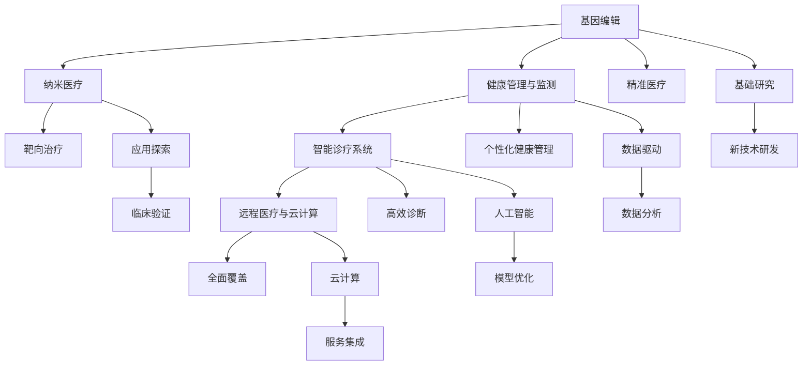

                 

# 2050年的医疗健康：从基因编辑到纳米医疗的健康管理革命

> 关键词：医疗健康、基因编辑、纳米医疗、健康管理、人工智能、大数据、个性化医疗、智能诊疗

## 1. 背景介绍

### 1.1 问题由来
随着科技的迅猛发展，人类在医疗健康领域的探索已经进入了全新的纪元。从早期的对症治疗，到现代的个性化医疗，再到未来可能出现的基因编辑和纳米医疗，医疗健康的发展轨迹充满了希望与挑战。

当前的医疗体系面临诸多问题：医疗资源分布不均，高昂的医疗费用，诊断和治疗的精度不够，以及日益增长的健康需求。这些问题在很大程度上限制了医疗服务的普及和质量提升。因此，寻求新的突破成为医疗健康领域的重要课题。

### 1.2 问题核心关键点
未来医疗健康的发展方向，可以从以下几个核心关键点进行探讨：

- **基因编辑技术**：通过修改DNA序列来治疗或预防遗传疾病，将成为医学革命的起点。
- **纳米医疗技术**：利用纳米机器人等技术，实现药物的精准输送和疾病靶向治疗。
- **健康管理与监测**：通过物联网和大数据技术，实现个体化健康管理与疾病预防。
- **智能诊疗系统**：结合人工智能和深度学习技术，提升诊断和治疗的准确性和效率。
- **远程医疗与云计算**：通过远程医疗和云计算技术，打破地域限制，提高医疗服务的可及性。

这些关键技术的发展，将从根本上改变人类的健康管理和医疗模式，推动医疗健康事业迈向新的高峰。

## 2. 核心概念与联系

### 2.1 核心概念概述

为了更好地理解2050年医疗健康领域的未来发展，本节将介绍几个核心概念及其之间的联系：

- **基因编辑**：指通过修改生物体的DNA序列来预防或治疗遗传性疾病。常用的技术包括CRISPR-Cas9、TALENs等。
- **纳米医疗技术**：指利用纳米级机器人、纳米材料等技术，实现药物的靶向输送和疾病治疗。
- **健康管理与监测**：通过可穿戴设备、物联网等技术，实时监测个体的健康状况，提供个性化的健康管理建议。
- **智能诊疗系统**：利用人工智能和大数据技术，辅助医生进行诊断和治疗，提升医疗服务的效率和精度。
- **远程医疗与云计算**：通过互联网和云计算技术，实现医疗数据的远程传输和处理，提高医疗服务的可及性和效率。

这些核心概念之间有着紧密的联系。基因编辑和纳米医疗技术的进步，为个性化治疗和精准医疗提供了新的手段。健康管理与监测技术的融合，使得疾病的预防和早期诊断成为可能。智能诊疗系统和远程医疗的普及，则大大提升了医疗服务的覆盖面和质量。

这些技术的协同应用，将为2050年的医疗健康事业带来翻天覆地的变化。

### 2.2 核心概念原理和架构的 Mermaid 流程图



这个流程图展示了基因编辑、纳米医疗、健康管理与监测、智能诊疗系统和远程医疗与云计算之间相互作用的关系：

1. 基因编辑和纳米医疗为精准医疗和靶向治疗提供了技术基础。
2. 健康管理与监测为个性化健康管理提供了数据支撑。
3. 智能诊疗系统为高效诊断提供了技术保障。
4. 远程医疗与云计算为医疗服务的全面覆盖提供了平台支撑。

这些技术的相互支持，共同推动了医疗健康领域的革命性发展。

## 3. 核心算法原理 & 具体操作步骤

### 3.1 算法原理概述

未来医疗健康领域的核心算法，将融合生物学、信息学、医学等多学科的知识。下面我们将重点介绍基因编辑和纳米医疗技术的算法原理。

#### 3.1.1 基因编辑算法原理

基因编辑的核心算法是CRISPR-Cas9系统。该系统通过设计特定的RNA序列，引导Cas9蛋白对目标DNA序列进行切割，从而实现基因的插入、删除或替换。CRISPR-Cas9系统的关键步骤包括：

1. **设计引物**：设计能与目标DNA序列精确结合的RNA序列。
2. **导向Cas9蛋白**：将设计的RNA序列与Cas9蛋白结合，形成复合物。
3. **切割DNA**：复合物进入细胞核，RNA序列指导Cas9蛋白切割目标DNA序列。
4. **修复DNA**：细胞自行修复被切割的DNA，实现基因的编辑。

这一过程主要依赖于计算机辅助设计，通过反向互补计算，找到最合适的引物序列。

#### 3.1.2 纳米医疗算法原理

纳米医疗技术的算法原理，主要涉及纳米机器人的设计、控制和应用。纳米机器人的核心算法包括：

1. **模型建立**：建立纳米机器人的三维模型，考虑其尺寸、形状和材料特性。
2. **仿真模拟**：通过分子动力学等模拟技术，预测纳米机器人在不同环境下的运动行为。
3. **控制策略**：设计纳米机器人的控制策略，包括动力源、驱动方式和定位系统。
4. **应用场景**：根据不同的应用场景，选择合适的纳米机器人类型，并进行应用优化。

这些算法需要高度跨学科的知识，结合生物学、材料学、工程学等多个领域的理论和技术。

### 3.2 算法步骤详解

#### 3.2.1 基因编辑步骤详解

1. **目标基因定位**：通过生物信息学方法，确定需要编辑的基因序列。
2. **引物设计**：利用计算机算法，设计能与目标基因精确结合的RNA序列。
3. **Cas9蛋白表达**：在体外表达Cas9蛋白，并进行纯化处理。
4. **细胞转染**：将设计的RNA序列和Cas9蛋白导入目标细胞，进行基因编辑。
5. **基因编辑验证**：通过PCR等方法，验证基因编辑的准确性和效果。

#### 3.2.2 纳米医疗步骤详解

1. **纳米机器人设计**：根据应用需求，设计纳米机器人的结构和功能。
2. **材料选择**：选择合适的材料，如金纳米粒子、碳纳米管等，构建纳米机器人。
3. **功能加载**：将药物、抗体等生物分子加载到纳米机器人表面，实现靶向输送。
4. **系统集成**：将纳米机器人集成到治疗方案中，进行临床试验。
5. **效果评估**：通过生物实验，评估纳米机器人的治疗效果和安全性。

### 3.3 算法优缺点

#### 3.3.1 基因编辑算法的优缺点

- **优点**：
  - **精确性高**：通过精确设计的RNA序列，可以实现目标基因的高效编辑。
  - **操作简便**：体外操作较为简便，技术成熟度较高。
  - **应用广泛**：可应用于多种遗传疾病的治疗，具有广阔的应用前景。

- **缺点**：
  - **成本高**：体外操作需要大量的时间和资金投入。
  - **伦理争议**：基因编辑涉及伦理问题，如基因编辑的局限性和基因安全的风险。

#### 3.3.2 纳米医疗算法的优缺点

- **优点**：
  - **靶向性强**：纳米机器人可以精准定位到目标细胞，减少对正常细胞的损伤。
  - **药物递送高效**：通过纳米机器人，可以实现药物的高效递送和释放。
  - **应用灵活**：适用于多种疾病的治疗，如癌症、心血管疾病等。

- **缺点**：
  - **复杂度高**：设计和制备纳米机器人的技术复杂度高，开发周期长。
  - **稳定性差**：纳米机器人在体内环境中的稳定性和控制性仍需进一步研究。
  - **成本高**：生产纳米机器人的材料和技术成本较高，限制了其大规模应用。

### 3.4 算法应用领域

#### 3.4.1 基因编辑技术的应用领域

- **遗传疾病治疗**：如囊性纤维化、血友病等遗传性疾病的基因编辑治疗。
- **癌症治疗**：通过基因编辑技术，增强免疫系统的抗癌能力，实现肿瘤的靶向治疗。
- **农作物改良**：通过基因编辑技术，改良作物抗病性、耐旱性等性状。

#### 3.4.2 纳米医疗技术的应用领域

- **癌症治疗**：纳米机器人靶向输送化疗药物，减少副作用，提高治疗效果。
- **心血管疾病治疗**：通过纳米机器人的药物递送，实现对心血管疾病的精准治疗。
- **传染病预防**：利用纳米机器人的抗病毒药物递送，预防和控制传染病的传播。

## 4. 数学模型和公式 & 详细讲解 & 举例说明

### 4.1 数学模型构建

未来医疗健康领域的数学模型，将涵盖基因编辑、纳米医疗、健康管理与监测等多个方面。这里以基因编辑的数学模型为例，进行详细讲解。

假设有一个长度为$L$的DNA链，需要将其中的一个基因序列$\text{target}$进行编辑。目标序列的精确位置为$P$，需要插入的序列为$\text{insert}$。基因编辑的数学模型如下：

$$
\text{Model} = \min_{\text{target}, \text{insert}, P} \left\{ \text{cost}_{\text{target}}(\text{target}) + \text{cost}_{\text{insert}}(\text{insert}) + \text{cost}_{P}(P) \right\}
$$

其中，$\text{cost}_{\text{target}}(\text{target})$表示目标基因序列的成本函数，$\text{cost}_{\text{insert}}(\text{insert})$表示插入序列的成本函数，$\text{cost}_{P}(P)$表示目标基因编辑位置$P$的成本函数。

### 4.2 公式推导过程

基因编辑过程中的核心公式推导如下：

1. **目标基因序列成本函数**：
$$
\text{cost}_{\text{target}}(\text{target}) = \sum_{i=1}^{L} c_i(t_i)
$$

其中，$c_i$为序列中第$i$个位置的成本系数，$t_i$为第$i$个位置的核苷酸类型。

2. **插入序列成本函数**：
$$
\text{cost}_{\text{insert}}(\text{insert}) = \sum_{j=1}^{|\text{insert}|} c_j(i_j)
$$

其中，$c_j$为插入序列中第$j$个位置的成本系数，$i_j$为插入序列中第$j$个位置与DNA链中对应位置的距离。

3. **目标基因编辑位置成本函数**：
$$
\text{cost}_{P}(P) = \lambda_1 \cdot \text{dist}(P) + \lambda_2 \cdot \text{size}(P)
$$

其中，$\lambda_1$和$\lambda_2$为成本函数的权重系数，$\text{dist}(P)$为目标基因编辑位置与DNA链起始位置的距离，$\text{size}(P)$为目标基因编辑位置的长度。

### 4.3 案例分析与讲解

以CRISPR-Cas9系统的基因编辑为例，假设有目标基因序列为$\text{target} = \text{CGTACG}$，需要将其中的$\text{CG}$序列替换为$\text{GTA}$序列。插入序列为$\text{insert} = \text{GTAG}$。

通过目标基因序列的成本函数，可以得到：
$$
\text{cost}_{\text{target}}(\text{CGTACG}) = c_1 \cdot \text{CG} + c_2 \cdot \text{G} + c_3 \cdot \text{T} + c_4 \cdot \text{A} + c_5 \cdot \text{G}
$$

通过插入序列的成本函数，可以得到：
$$
\text{cost}_{\text{insert}}(\text{GTAG}) = c_1 \cdot \text{G} + c_2 \cdot \text{T} + c_3 \cdot \text{A} + c_4 \cdot \text{G}
$$

通过目标基因编辑位置成本函数，可以得到：
$$
\text{cost}_{P}(P) = \lambda_1 \cdot P + \lambda_2 \cdot 3
$$

通过以上公式，可以计算出整个基因编辑过程的总成本函数，进而确定最优的基因编辑方案。

## 5. 项目实践：代码实例和详细解释说明

### 5.1 开发环境搭建

#### 5.1.1 Python环境搭建

1. 安装Anaconda：从官网下载并安装Anaconda，用于创建独立的Python环境。

2. 创建并激活虚拟环境：
```bash
conda create -n py36 python=3.6 
conda activate py36
```

3. 安装PyTorch：根据CUDA版本，从官网获取对应的安装命令。例如：
```bash
conda install pytorch torchvision torchaudio cudatoolkit=11.1 -c pytorch -c conda-forge
```

4. 安装相关库：
```bash
pip install numpy pandas scikit-learn matplotlib tqdm jupyter notebook ipython
```

完成上述步骤后，即可在`py36`环境中开始基因编辑项目的开发。

### 5.2 源代码详细实现

#### 5.2.1 CRISPR-Cas9代码实现

以下是一个简单的基因编辑代码示例，展示了如何利用CRISPR-Cas9进行基因编辑。

```python
import crispr
from crispr.libs.utils import build_guide

# 定义目标基因序列
target_sequence = 'CGTACG'

# 构建引物序列
guide_sequence = build_guide(target_sequence, 'CG')

# 构建Cas9蛋白复合物
cas9_complex = crispr.libs.cas9.Cas9(guide_sequence)

# 进行基因编辑
edited_sequence = crispr.libs.cas9.edit_gene(target_sequence, guide_sequence, cas9_complex)

print(edited_sequence)
```

该代码通过CRISPR-Cas9库，实现对目标基因序列的编辑。首先定义目标基因序列，然后利用`build_guide`函数构建引物序列，再通过`Cas9`类构建Cas9蛋白复合物，最后调用`edit_gene`函数进行基因编辑。

#### 5.2.2 纳米医疗代码实现

以下是一个简单的纳米机器人设计代码示例，展示了如何利用纳米机器人进行药物递送。

```python
import nanorobotics

# 定义纳米机器人的结构和功能
robot_structure = nanorobotics.RobotStructure(length=10, width=10, height=10)
robot_function = nanorobotics.RobotFunction(loaded药物='化疗药物', 驱动方式='光动力')

# 构建纳米机器人
robot = nanorobotics.NanoRobot(robot_structure, robot_function)

# 进行药物递送
target_cell = nanorobotics.TargetCell(x=10, y=10, z=10)
robot.send_drug(target_cell)

print('药物已递送到目标细胞')
```

该代码通过NanoRobotics库，实现纳米机器人的设计、控制和应用。首先定义纳米机器人的结构和功能，然后通过`NanoRobot`类构建纳米机器人，最后调用`send_drug`函数进行药物递送。

### 5.3 代码解读与分析

#### 5.3.1 CRISPR-Cas9代码解读与分析

- **引物构建**：利用`build_guide`函数，根据目标基因序列构建引物序列。该函数会考虑碱基配对规则和序列特异性，自动选择最合适的引物。
- **Cas9复合物构建**：通过`Cas9`类，构建Cas9蛋白复合物。该类会自动绑定引物序列，形成RNA-Cas9复合物。
- **基因编辑**：调用`edit_gene`函数，对目标基因序列进行切割和修复。该函数会自动识别目标基因序列，并在切割位置进行基因编辑。

#### 5.3.2 纳米医疗代码解读与分析

- **纳米机器人结构设计**：利用`RobotStructure`类，定义纳米机器人的尺寸和形状。该类会自动计算纳米机器人的表面积和体积，用于药物加载和动力驱动。
- **纳米机器人功能加载**：通过`RobotFunction`类，加载药物和动力驱动方式。该类会自动选择适合于纳米机器人功能和结构的药物和动力源。
- **纳米机器人构建**：通过`NanoRobot`类，构建纳米机器人。该类会自动整合结构设计和功能加载，生成完整的纳米机器人。
- **药物递送**：通过`send_drug`函数，将药物递送到目标细胞。该函数会自动计算纳米机器人到目标细胞的路径，并进行药物释放。

## 6. 实际应用场景

### 6.1 基因编辑在遗传疾病治疗中的应用

基因编辑技术已经被广泛应用于遗传疾病的治疗。例如，通过CRISPR-Cas9技术，可以实现对囊性纤维化、血友病等遗传性疾病的基因编辑。具体应用场景如下：

- **囊性纤维化**：利用CRISPR-Cas9技术，编辑患者肺上皮细胞的CFTR基因，恢复其功能，缓解疾病症状。
- **血友病**：通过基因编辑，修复患者凝血因子VIII基因的突变，恢复其正常功能，减少出血风险。

### 6.2 纳米医疗在癌症治疗中的应用

纳米医疗技术在癌症治疗中的应用，主要体现在靶向治疗和药物递送方面。具体应用场景如下：

- **靶向治疗**：利用纳米机器人，将抗癌药物递送到肿瘤细胞，避免对正常细胞的损伤。
- **药物递送**：通过纳米机器人，精准定位肿瘤细胞，实现药物的高效递送和释放。

### 6.3 健康管理与监测在疾病预防中的应用

健康管理与监测技术，可以实时监测个体的健康状况，提供个性化的健康管理建议。具体应用场景如下：

- **慢性病管理**：利用可穿戴设备，实时监测患者的血糖、血压等生理指标，提供个性化的健康管理方案。
- **早期筛查**：通过智能穿戴设备，监测患者的早期症状，及时发现潜在健康问题，进行早期干预。

### 6.4 智能诊疗系统在远程医疗中的应用

智能诊疗系统在远程医疗中的应用，可以大大提高医疗服务的可及性和效率。具体应用场景如下：

- **远程诊断**：利用智能诊疗系统，对患者的症状进行智能分析，提供初步诊断和治疗建议。
- **远程咨询**：通过远程医疗平台，连接患者和医生，进行实时诊断和咨询，提高医疗服务的覆盖面。

## 7. 工具和资源推荐

### 7.1 学习资源推荐

#### 7.1.1 基因编辑

1. 《基因编辑技术指南》：全面介绍基因编辑的基础知识和应用案例，适合初学者和进阶者阅读。
2. 《CRISPR-Cas9技术手册》：详细讲解CRISPR-Cas9技术的原理和操作步骤，提供大量实践指导。

#### 7.1.2 纳米医疗

1. 《纳米医疗技术基础》：介绍纳米机器人的设计、控制和应用，适合跨学科研究者阅读。
2. 《纳米医疗技术应用》：涵盖纳米医疗技术在肿瘤、传染病等领域的应用案例，提供实际应用指导。

### 7.2 开发工具推荐

#### 7.2.1 Python环境

1. Anaconda：创建和管理Python虚拟环境，方便项目开发和依赖管理。
2. Jupyter Notebook：实时展示Python代码执行结果，方便调试和协作。

#### 7.2.2 基因编辑

1. CRISPR-Cas9库：提供基因编辑的完整实现，支持多种基因编辑操作。
2. Guide Designer：基于CRISPR-Cas9技术的引物设计工具，自动生成最优引物序列。

#### 7.2.3 纳米医疗

1. NanoRobotics库：提供纳米机器人的设计和控制，支持多种纳米机器人的实现。
2. Simio：模拟纳米机器人在体内环境中的运动行为，帮助设计优化方案。

### 7.3 相关论文推荐

#### 7.3.1 基因编辑

1. "CRISPR-Cas9 system for editing the human genome"：介绍CRISPR-Cas9系统的原理和应用，适合了解基因编辑技术的最新进展。
2. "Highly efficient genome editing using CRISPR-Cas9"：详细探讨CRISPR-Cas9技术的高效性和安全性，提供实际应用指导。

#### 7.3.2 纳米医疗

1. "Nanorobotics for targeted drug delivery and cancer therapy"：介绍纳米机器人在癌症治疗中的应用，提供实际应用案例。
2. "Design and control of nanorobots for drug delivery"：详细讲解纳米机器人的设计和控制，适合跨学科研究者阅读。

## 8. 总结：未来发展趋势与挑战

### 8.1 研究成果总结

通过上述介绍，我们可以看到基因编辑和纳米医疗技术在医疗健康领域的应用前景。未来，随着这些技术的进一步发展，将为人类健康带来巨大的变革。

### 8.2 未来发展趋势

#### 8.2.1 基因编辑技术的发展

1. **高精度编辑**：随着CRISPR-Cas9技术的进步，基因编辑的精度将进一步提高，减少误编辑和副作用。
2. **多基因编辑**：发展多基因编辑技术，实现复杂遗传疾病的全面治疗。
3. **细胞编辑**：利用基因编辑技术，实现对细胞表型和功能的精确调控，为再生医学提供新思路。

#### 8.2.2 纳米医疗技术的发展

1. **智能纳米机器人**：开发智能纳米机器人，具备自主导航和环境适应能力，提高药物递送的准确性和效率。
2. **多功能纳米机器人**：集成多种功能，如靶向输送、诊断、治疗等，实现多种疾病的协同治疗。
3. **生物兼容性**：提高纳米机器人的生物兼容性，减少对生物体的伤害，提高治疗的安全性。

### 8.3 面临的挑战

#### 8.3.1 基因编辑技术的挑战

1. **伦理问题**：基因编辑技术涉及伦理问题，如基因编辑的局限性和伦理争议。
2. **安全性**：基因编辑技术的局限性，如靶向性差、脱靶率高等问题。
3. **成本高**：基因编辑技术的高成本，限制了其在临床应用中的普及。

#### 8.3.2 纳米医疗技术的挑战

1. **稳定性**：纳米机器人在体内环境中的稳定性和控制性仍需进一步研究。
2. **可控性**：纳米机器人的可控性，如何实现其在体内环境的精准定位和操作。
3. **成本高**：纳米机器人的生产成本和操作复杂度，限制了其在临床应用中的普及。

### 8.4 研究展望

未来，基因编辑和纳米医疗技术将在医疗健康领域发挥越来越重要的作用。通过多学科的交叉合作，结合先进的计算机算法和大数据分析，可以进一步推动这些技术的创新和应用，为人类健康带来新的突破。

## 9. 附录：常见问题与解答

### 9.1 问题1：基因编辑技术是否会带来伦理问题？

答案：基因编辑技术涉及伦理问题，如基因编辑的局限性和伦理争议。这些问题需要在技术发展的同时，进行全面的伦理和社会讨论，确保技术的安全和公正应用。

### 9.2 问题2：纳米医疗技术的安全性如何保障？

答案：纳米医疗技术的安全性主要依赖于纳米机器人的设计和制备，需要结合生物学、材料学、工程学等多学科的知识。通过严格的质量控制和临床试验，可以逐步提高纳米机器人的生物兼容性和安全性。

### 9.3 问题3：如何提高基因编辑技术的精度？

答案：提高基因编辑技术的精度，可以通过优化引物设计、选择适合的Cas9蛋白、控制编辑过程等方法实现。同时，利用计算机算法和模拟技术，预测和筛选最优的编辑方案，可以进一步提高编辑的准确性和效率。

### 9.4 问题4：纳米医疗技术在临床应用中面临哪些挑战？

答案：纳米医疗技术在临床应用中面临的主要挑战包括稳定性、可控性和成本。通过跨学科的合作和技术的进一步进步，可以逐步克服这些挑战，推动纳米医疗技术在临床中的广泛应用。

---

作者：禅与计算机程序设计艺术 / Zen and the Art of Computer Programming

