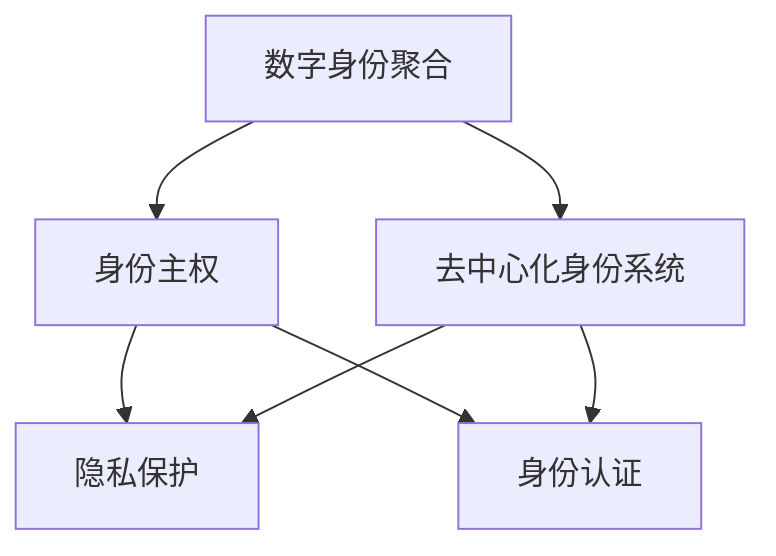

                 

# 2050年的数字身份：从数字身份聚合到数字身份自主的身份主权实现

在2050年，人类将进入一个数字化程度更高的时代。数字身份将成为我们生活中的核心要素，无论是在社交、经济、教育还是治理层面。本文将探讨数字身份的未来发展趋势，从数字身份聚合到数字身份自主，并分析身份主权在其中的作用和实现方式。

## 1. 背景介绍

### 1.1 问题由来
随着数字技术的普及，我们的行为、消费习惯、社交关系等都越来越多地以数字形式记录和存储。然而，这些数字身份往往分散在不同的平台和服务中，难以统一管理和控制。例如，在线购物、社交媒体、电子邮件、金融服务、健康记录等，都拥有各自独立的用户身份系统。这不仅给用户带来不便，还带来了隐私泄露、身份盗用等风险。

数字身份聚合旨在解决这一问题，通过技术手段将分散在各个平台的用户数据聚合到统一的、用户可控的数字身份中。这不仅可以提高用户的使用体验，还能增强数字身份的安全性和隐私保护。

### 1.2 问题核心关键点
数字身份聚合的核心目标是将用户的不同身份信息汇聚到一个统一的、去中心化的平台，并确保用户在其中的身份控制权。主要包括以下几个方面：

- **身份信息的聚合**：将用户在各个平台上的身份信息（如姓名、头像、联系方式、历史记录等）整合到一个统一的身份库中。
- **用户权限的分配**：用户能够根据自己的需求，选择哪些身份信息可以被其他应用访问，哪些信息需要保密。
- **跨平台互通性**：确保聚合后的身份信息可以在不同平台间互通，支持用户在不同平台间无缝切换。
- **去中心化设计**：采用分布式存储和共识机制，避免单点故障和中心化机构控制，保障用户数据的安全和隐私。

## 2. 核心概念与联系

### 2.1 核心概念概述

为更好地理解数字身份聚合的过程，本节将介绍几个密切相关的核心概念：

- **数字身份聚合(Digital Identity Aggregation)**：将用户在不同平台上的身份信息整合到一个统一的、去中心化的平台，并提供用户控制权限的过程。
- **去中心化身份系统(Decentralized Identity System)**：基于区块链等技术，分布式存储和管理用户身份信息，实现身份信息的自主控制和互通性。
- **身份主权(Identity Ownership)**：用户对自己数字身份的控制权，包括身份信息的创建、修改、删除、分享等操作。
- **隐私保护(Privacy Protection)**：通过技术手段保护用户的个人信息不被非法获取、滥用或泄露，确保用户数据的隐私安全。
- **身份认证(Identity Authentication)**：验证用户在特定平台或应用中的身份真实性，确保其行为是合法的。

这些核心概念之间的逻辑关系可以通过以下Mermaid流程图来展示：



这个流程图展示出数字身份聚合与其他相关概念之间的联系：

1. 数字身份聚合基于去中心化身份系统，为用户提供统一的身份管理平台。
2. 身份主权是用户对自己身份的控制权，贯穿数字身份聚合的始终。
3. 隐私保护和身份认证是保障身份主权的两个重要环节。
4. 去中心化身份系统通过分布式存储和管理用户身份信息，实现身份信息的自主控制和互通性。

## 3. 核心算法原理 & 具体操作步骤
### 3.1 算法原理概述

数字身份聚合的核心原理是将用户在不同平台上的身份信息汇聚到一个统一的、去中心化的平台，并通过身份主权技术，确保用户对自己身份的控制权。具体来说，算法原理包括：

- **身份信息聚合**：通过身份验证和数据同步技术，将用户在各个平台上的身份信息聚合到一个统一的、去中心化的平台。
- **身份主权控制**：用户能够根据自己的需求，选择哪些身份信息可以被其他应用访问，哪些信息需要保密。
- **跨平台互通性**：确保聚合后的身份信息可以在不同平台间互通，支持用户在不同平台间无缝切换。

### 3.2 算法步骤详解

数字身份聚合的过程一般包括以下几个关键步骤：

**Step 1: 设计身份验证机制**

- 选择合适的身份验证方法，如密码、生物识别、数字证书等。
- 设计身份验证流程，确保用户在聚合平台上的身份验证过程与在各个平台上的身份验证一致。

**Step 2: 实现身份信息同步**

- 开发身份信息同步模块，定期从各个平台抓取用户数据，并更新到聚合平台。
- 设计数据同步规则，确保不同平台间的数据一致性，如使用时间戳或版本控制。

**Step 3: 构建去中心化身份系统**

- 设计去中心化的存储架构，使用区块链、分布式数据库等技术，实现身份信息的分布式存储。
- 引入共识机制，确保身份信息的不可篡改性和透明性，如使用工作量证明(PoW)、权益证明(PoS)等。

**Step 4: 实现身份主权控制**

- 设计身份权限管理系统，允许用户自定义身份信息的访问权限。
- 提供用户界面，让用户能够方便地管理自己的身份信息，如添加、删除、修改、分享等。

**Step 5: 测试和部署**

- 在测试环境中测试身份验证、同步、去中心化存储和身份主权控制的完整性。
- 部署到生产环境中，监控系统性能和用户反馈，进行持续优化。

### 3.3 算法优缺点

数字身份聚合方法具有以下优点：

1. **统一管理**：通过聚合平台，用户可以统一管理自己的身份信息，避免数据分散带来的管理困难。
2. **增强隐私保护**：通过用户自定义的访问权限控制，用户可以更好地保护自己的隐私，避免信息泄露。
3. **提高安全性**：去中心化的设计，避免了单点故障和中心化机构控制，提高了系统的安全性和稳定性。

同时，该方法也存在一些局限性：

1. **技术复杂性**：去中心化的设计和技术实现较为复杂，需要较高的技术门槛。
2. **用户体验**：身份信息聚合和同步可能需要用户授权和操作，可能会影响用户体验。
3. **跨平台兼容性**：不同平台间的身份信息同步和互通性仍需进一步优化，可能存在兼容性问题。

### 3.4 算法应用领域

数字身份聚合技术已经在金融、医疗、政府等领域得到了广泛应用。例如：

- **金融行业**：银行和金融机构使用去中心化的身份系统，进行客户身份验证和交易授权，提高了系统的安全性和效率。
- **医疗行业**：医院和医疗机构使用数字身份聚合系统，管理患者病历和身份信息，提高了医疗服务的精准性和安全性。
- **政府服务**：政府部门使用身份聚合平台，整合居民身份信息和公共服务数据，提供了统一、便捷的公共服务体验。

## 4. 数学模型和公式 & 详细讲解 & 举例说明

### 4.1 数学模型构建

数字身份聚合的数学模型可以简单表示为：

$$
\text{聚合后身份} = \text{聚合平台}(\text{各平台身份信息}, \text{身份主权控制})
$$

其中，$\text{聚合平台}$ 是数字身份聚合的核心，负责整合和管理用户的身份信息，并提供身份主权控制。$\text{各平台身份信息}$ 包括用户在各个平台上的所有身份数据，如姓名、地址、历史记录等。$\text{身份主权控制}$ 是用户对自己身份信息的自定义控制，确保用户对自己的身份信息有完全的控制权。

### 4.2 公式推导过程

以数字身份聚合平台为例，推导用户身份信息聚合和同步的公式：

假设用户在平台A上的身份信息为 $I_A$，在平台B上的身份信息为 $I_B$，聚合后的身份信息为 $I_{\text{agg}}$。则聚合过程可以表示为：

$$
I_{\text{agg}} = \text{聚合算法}(I_A, I_B)
$$

其中，$\text{聚合算法}$ 可以是简单的数据合并，也可以是复杂的去重、合并规则，取决于具体的业务需求。

### 4.3 案例分析与讲解

以下以医疗行业为例，分析数字身份聚合的具体实现过程：

1. **身份验证**：医院使用生物识别技术，如指纹识别、面部识别等，对患者进行身份验证。
2. **身份信息同步**：医院定期从患者在社会保险、银行等平台上的身份信息中同步数据，并更新到医院的系统。
3. **去中心化存储**：医院使用区块链技术，分布式存储患者的身份信息和病历数据，确保数据的安全性和不可篡改性。
4. **身份主权控制**：患者可以通过医院的应用界面，管理自己的身份信息和病历数据，选择哪些数据可以被医生访问，哪些数据需要保密。

## 5. 项目实践：代码实例和详细解释说明

### 5.1 开发环境搭建

在进行数字身份聚合实践前，我们需要准备好开发环境。以下是使用Python进行Django开发的环境配置流程：

1. 安装Anaconda：从官网下载并安装Anaconda，用于创建独立的Python环境。

2. 创建并激活虚拟环境：
```bash
conda create -n digital-id-env python=3.8 
conda activate digital-id-env
```

3. 安装Django和其他必要的工具包：
```bash
pip install django numpy pandas scikit-learn matplotlib tqdm jupyter notebook ipython
```

4. 安装相关身份验证和同步模块：
```bash
pip install django-allauth django-pyjwt rest_framework-jwt
```

完成上述步骤后，即可在`digital-id-env`环境中开始开发。

### 5.2 源代码详细实现

下面是使用Django框架进行数字身份聚合的示例代码：

1. **用户注册和登录**：

```python
from django.contrib.auth.models import User
from django.contrib.auth import authenticate, login, logout

def register(request):
    if request.method == 'POST':
        form = UserCreationForm(request.POST)
        if form.is_valid():
            form.save()
            username = form.cleaned_data.get('username')
            raw_password = form.cleaned_data.get('password1')
            user = authenticate(username=username, password=raw_password)
            login(request, user)
            return redirect('home')
    else:
        form = UserCreationForm()
    return render(request, 'register.html', {'form': form})

def login_view(request):
    if request.method == 'POST':
        username = request.POST['username']
        password = request.POST['password']
        user = authenticate(request, username=username, password=password)
        if user is not None:
            login(request, user)
            return redirect('home')
    return render(request, 'login.html')
```

2. **身份信息同步**：

```python
from allauth.account import utils

def sync_identity(request):
    user = request.user
    social_links = user.socialaccount_set.all()
    for link in social_links:
        if link.provider == 'google':
            data = request.data.get('google_data')
            link.extra_data['first_name'] = data.get('given_name')
            link.extra_data['last_name'] = data.get('family_name')
            link.extra_data['email'] = data.get('email')
            link.save()
    return HttpResponse('Identity synced successfully')
```

3. **身份主权控制**：

```python
def manage_identity(request):
    user = request.user
    if request.method == 'POST':
        if request.POST['is_public']:
            user.is_anonymous = False
            user.save()
        else:
            user.is_anonymous = True
            user.save()
    return HttpResponse('Identity managed successfully')
```

### 5.3 代码解读与分析

让我们再详细解读一下关键代码的实现细节：

**用户注册和登录**：
- 使用Django的内置认证系统，实现用户的注册、登录和登出。注册视图接收POST请求，验证表单数据，创建用户并自动登录。登录视图接收POST请求，验证用户名和密码，创建用户并自动登录。

**身份信息同步**：
- 使用Django的全局认证系统，获取当前登录用户。从请求数据中获取Google用户信息，更新社交链接的额外数据。保存更新后的社交链接，并返回成功响应。

**身份主权控制**：
- 获取当前登录用户。接收POST请求，根据请求参数决定用户是否匿名，并更新用户的匿名状态。保存更新后的用户对象，并返回成功响应。

以上代码展示了Django在数字身份聚合实践中的应用，利用内置认证系统和全局认证系统，实现了用户身份验证和主权控制。

## 6. 实际应用场景

### 6.1 金融行业

在金融行业，数字身份聚合可以用于客户身份验证、交易授权、风险控制等方面。例如，银行可以使用聚合平台管理客户的身份信息和交易记录，确保客户身份的真实性和交易的安全性。

### 6.2 医疗行业

在医疗行业，数字身份聚合可以用于患者身份验证、病历管理、医疗记录共享等方面。例如，医院可以使用聚合平台管理患者的身份信息和病历数据，确保患者身份的真实性和病历数据的完整性。

### 6.3 政府服务

在政府服务领域，数字身份聚合可以用于公民身份验证、公共服务申请、社会福利管理等方面。例如，政府部门可以使用聚合平台管理公民的身份信息和公共服务数据，确保公民身份的真实性和公共服务的便捷性。

## 7. 工具和资源推荐

### 7.1 学习资源推荐

为了帮助开发者系统掌握数字身份聚合的理论基础和实践技巧，这里推荐一些优质的学习资源：

1. **Django官方文档**：Django是Python最流行的Web框架之一，提供了丰富的身份验证和认证模块，是数字身份聚合开发的基础。
2. **区块链技术入门书籍**：了解区块链技术的基础知识，包括分布式存储、共识机制、智能合约等，为去中心化身份系统提供理论支撑。
3. **数字身份管理标准**：了解国际上数字身份管理的标准和规范，如W3C的WebID和JSON-LD等，确保数字身份聚合的互操作性和标准化。
4. **身份认证与访问控制技术**：了解身份认证和访问控制的常见技术，如OAuth2、OpenID Connect等，为数字身份聚合提供安全的身份管理方案。
5. **身份验证和同步工具**：了解常用的身份验证和同步工具，如Google Authenticator、Facebook Login等，为数字身份聚合提供便捷的身份管理方案。

通过对这些资源的学习实践，相信你一定能够快速掌握数字身份聚合的精髓，并用于解决实际的NLP问题。

### 7.2 开发工具推荐

高效的开发离不开优秀的工具支持。以下是几款用于数字身份聚合开发的常用工具：

1. **Django**：Python最流行的Web框架之一，提供了丰富的身份验证和认证模块，是数字身份聚合开发的基础。
2. **RESTful API框架**：如Django Rest Framework、Flask RestPlus等，用于构建API接口，实现不同平台间的身份信息同步。
3. **身份验证和同步模块**：如Django Allauth、django-pyjwt等，用于实现用户的身份验证和同步。
4. **区块链平台**：如Ethereum、Hyperledger Fabric等，用于实现去中心化的身份存储和管理。
5. **身份验证和同步工具**：如Google Authenticator、Facebook Login等，用于实现用户的身份验证和同步。

合理利用这些工具，可以显著提升数字身份聚合任务的开发效率，加快创新迭代的步伐。

### 7.3 相关论文推荐

数字身份聚合技术的发展源于学界的持续研究。以下是几篇奠基性的相关论文，推荐阅读：

1. **Blockchain-based Identity Management System**：介绍基于区块链的数字身份管理系统，实现去中心化的身份存储和管理。
2. **Identity Management in the Digital Economy**：探讨数字经济中的身份管理问题，提出一种基于WebID的身份管理方案。
3. **Decentralized Identity Systems: Principles, Architectures, and Patterns**：总结了分布式身份系统的设计原则、架构和模式，为数字身份聚合提供理论支撑。
4. **OAuth2.0 Authorization Framework**：介绍OAuth2.0授权框架，实现不同平台间的身份验证和授权。
5. **Identity-Based Cryptography**：介绍基于身份的密码学，为数字身份聚合提供加密和认证手段。

这些论文代表了大语言模型微调技术的发展脉络。通过学习这些前沿成果，可以帮助研究者把握学科前进方向，激发更多的创新灵感。

## 8. 总结：未来发展趋势与挑战

### 8.1 总结

本文对数字身份聚合方法进行了全面系统的介绍。首先阐述了数字身份聚合的背景和意义，明确了聚合在数字身份管理中的重要作用。其次，从原理到实践，详细讲解了数字身份聚合的数学模型和操作步骤，给出了数字身份聚合任务开发的完整代码实例。同时，本文还探讨了数字身份聚合在多个行业领域的应用前景，展示了其广阔的发展空间。此外，本文精选了数字身份聚合的学习资源和开发工具，力求为读者提供全方位的技术指引。

通过本文的系统梳理，可以看到，数字身份聚合技术将为未来的数字身份管理提供强大的技术支撑，推动数字身份管理的智能化和自动化。未来，伴随技术的不断进步，数字身份聚合必将在数字身份管理中扮演越来越重要的角色，构建安全、便捷、自主的数字身份生态。

### 8.2 未来发展趋势

展望未来，数字身份聚合技术将呈现以下几个发展趋势：

1. **跨平台互通性**：未来的数字身份聚合系统将更加注重跨平台互通性，实现不同平台间的数据无缝切换。
2. **隐私保护**：隐私保护将成为数字身份聚合的核心关注点，未来系统将采用更加先进的隐私保护技术，如差分隐私、同态加密等。
3. **身份主权**：身份主权将成为数字身份聚合的重要方向，未来的系统将更加注重用户的身份控制权，提供更加灵活的身份管理方案。
4. **去中心化**：去中心化设计将继续得到推广，分布式存储和共识机制将更加成熟和普及。
5. **智能合约**：智能合约将与数字身份聚合系统结合，实现更高级的身份验证和授权方案。

以上趋势凸显了数字身份聚合技术的广阔前景。这些方向的探索发展，必将进一步提升数字身份聚合系统的性能和用户体验，推动数字身份管理迈向更加智能化和自主化的方向。

### 8.3 面临的挑战

尽管数字身份聚合技术已经取得了显著进展，但在迈向更加智能化、普适化应用的过程中，仍面临诸多挑战：

1. **技术复杂性**：数字身份聚合涉及多个技术领域，如身份验证、同步、去中心化等，技术实现较为复杂，需要较高的技术门槛。
2. **隐私保护**：用户数据的隐私保护始终是数字身份聚合的难点，如何在保障隐私的前提下实现高效的身份管理，需要更多理论和实践的积累。
3. **用户接受度**：用户对数字身份聚合的接受度和使用习惯仍需提升，尤其是在跨平台互通性和身份主权方面，可能存在使用障碍。
4. **互操作性**：不同平台和应用之间的互操作性仍需进一步优化，确保数字身份聚合系统的兼容性和稳定性。
5. **法律和政策**：数字身份聚合涉及隐私保护和数据管理等法律和政策问题，需要政府和法律界的支持与规范。

正视数字身份聚合面临的这些挑战，积极应对并寻求突破，将是大语言模型微调走向成熟的必由之路。相信随着学界和产业界的共同努力，这些挑战终将一一被克服，数字身份聚合必将在构建人机协同的智能时代中扮演越来越重要的角色。

### 8.4 研究展望

面对数字身份聚合所面临的种种挑战，未来的研究需要在以下几个方面寻求新的突破：

1. **探索去中心化身份管理方案**：进一步探索基于区块链、分布式数据库等去中心化技术的身份管理方案，提高系统的安全性和可靠性。
2. **研究隐私保护技术**：开发更加先进的隐私保护技术，如差分隐私、同态加密等，在保障隐私的前提下实现高效的身份管理。
3. **优化跨平台互通性**：研究跨平台互通性的关键技术，如联邦学习、边缘计算等，实现不同平台间的数据无缝切换。
4. **提升用户接受度**：通过用户教育、产品设计等方式，提升用户对数字身份聚合的接受度和使用习惯，增强系统的用户体验。
5. **推动法律法规的完善**：推动数字身份管理的法律法规的完善，规范数字身份聚合系统的发展，保障用户权益。

这些研究方向将引领数字身份聚合技术迈向更高的台阶，为构建安全、可靠、可解释、可控的智能系统铺平道路。面向未来，数字身份聚合技术还需要与其他人工智能技术进行更深入的融合，如知识表示、因果推理、强化学习等，多路径协同发力，共同推动数字身份管理技术的进步。只有勇于创新、敢于突破，才能不断拓展数字身份管理的边界，让智能技术更好地造福人类社会。

## 9. 附录：常见问题与解答

**Q1：数字身份聚合是否适用于所有平台和应用？**

A: 数字身份聚合适用于大多数平台和应用，尤其是那些需要频繁进行身份验证和数据共享的场景。但对于某些特殊平台，如仅支持特定认证方式或数据隐私保护要求极高的应用，可能需要进行定制化开发。

**Q2：数字身份聚合如何确保数据隐私？**

A: 数字身份聚合通过分布式存储和身份主权控制，确保数据隐私。具体措施包括：
1. 使用去中心化的存储技术，如区块链，分布式数据库等。
2. 引入共识机制，确保数据不可篡改性和透明性。
3. 提供用户自定义的身份访问权限，确保用户对自己的数据有完全的控制权。

**Q3：数字身份聚合的开发难度如何？**

A: 数字身份聚合的开发难度较高，涉及身份验证、同步、去中心化等多项技术。需要具备较强的技术背景和实践经验，以及跨学科的知识储备。可以使用现成的框架和工具，如Django、RESTful API等，简化开发过程。

**Q4：数字身份聚合的应用场景有哪些？**

A: 数字身份聚合适用于各类需要频繁进行身份验证和数据共享的领域，如金融、医疗、政府、社交网络等。这些应用场景中，数字身份聚合可以提供统一、便捷的身份管理方案，提升系统的安全性和用户体验。

**Q5：数字身份聚合的未来趋势是什么？**

A: 数字身份聚合的未来趋势包括跨平台互通性、隐私保护、身份主权、去中心化和智能合约等方向。未来系统将更加注重用户体验和安全保障，实现更加智能化和自主化的数字身份管理。

---

作者：禅与计算机程序设计艺术 / Zen and the Art of Computer Programming

