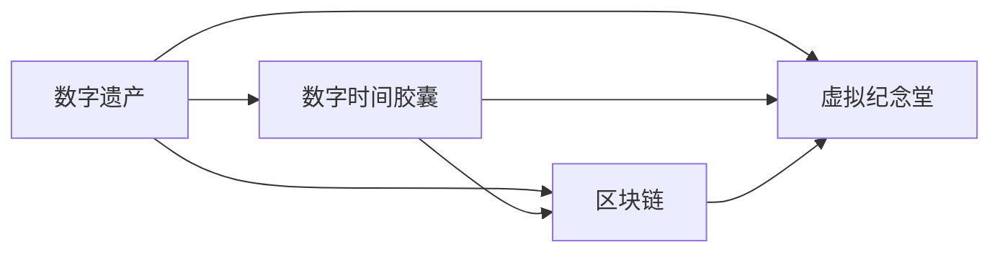

                 

## 1. 背景介绍

### 1.1 问题由来
在2050年，随着数字技术的深度渗透，人类的信息遗产将形成前所未有的规模和复杂性。数字遗产不仅包括文本、音频、视频等数字化内容，还涉及软件、算法、技术框架等深层次的技术资产。如何将这些珍贵的数字资产保存和传承下去，将是摆在人类面前的巨大挑战。

### 1.2 问题核心关键点
数字遗产的传承涉及到数据保护、信息检索、技术更新和用户交互等多方面内容。传统的数据库存储和纸质档案保管已无法满足未来的需求。因此，亟需一种创新的、适应性强的数字遗产传承方式。

### 1.3 问题研究意义
本研究旨在提出一种全新的数字遗产传承方案——基于区块链的数字时间胶囊和虚拟纪念堂。该方案通过区块链技术的不可篡改性和分布式存储特性，结合虚拟现实和增强现实技术，构建了一个安全、可持续的数字遗产传承系统。该系统能够确保数字遗产的真实性和完整性，同时通过虚拟纪念堂提供沉浸式体验，增强用户互动和情感共鸣。

## 2. 核心概念与联系

### 2.1 核心概念概述

为了更好地理解数字遗产传承技术，本节将介绍几个关键概念及其联系：

- **数字遗产(Digital Heritage)**：指个人、机构或社会在数字时代留下的信息、技术、知识等，包括但不限于数据、软件、算法、技术框架等。

- **数字时间胶囊(Digital Time Capsule)**：一种长期保存数字遗产的解决方案，类似于传统的物理时间胶囊，但使用现代技术实现。

- **区块链(Blockchain)**：一种分布式账本技术，通过去中心化、不可篡改的记录方式，确保数字遗产的真实性和完整性。

- **虚拟纪念堂(Virtual Memorial Hall)**：一种基于虚拟现实(VR)和增强现实(AR)技术的数字纪念场所，提供沉浸式体验，增强用户情感联系。

- **分布式存储(Distributed Storage)**：使用多个节点进行数据存储和备份，提高数据安全和可用性。

- **去中心化身份认证(Decentralized Identity)**：使用区块链技术进行身份验证，确保数据和身份的安全性和隐私性。

这些概念通过区块链和分布式存储技术紧密联系在一起，构建了一个安全、可扩展、可持续的数字遗产传承系统。

### 2.2 核心概念原理和架构的 Mermaid 流程图



该流程图展示了数字遗产通过数字时间胶囊进行保存，并通过区块链和虚拟纪念堂进行传承和展示的核心流程。

## 3. 核心算法原理 & 具体操作步骤

### 3.1 算法原理概述

基于区块链的数字遗产传承方案，核心原理包括以下几点：

1. **数字遗产的数字化**：将各种形式的数据和信息转换为数字化格式，存储在区块链上。

2. **区块链记录**：使用区块链技术记录数字遗产的创建、保存和传承过程，确保数据的不可篡改性和可追溯性。

3. **分布式存储**：通过多个节点进行数据备份和存储，提高数据的安全性和可用性。

4. **虚拟纪念堂展示**：利用VR和AR技术，将数字遗产以沉浸式形式展示给用户，增强互动体验。

### 3.2 算法步骤详解

1. **数字遗产的数字化和区块链记录**

   - 将所有需要传承的数字遗产进行数字化处理，包括但不限于文本、音频、视频、软件代码、算法模型等。
   - 使用区块链技术记录数字遗产的创建、修改和保存过程，确保每个版本的数据都有完整的记录和证明。
   - 通过分布式存储技术，确保数据的备份和冗余，提高数据的安全性和可用性。

2. **虚拟纪念堂的创建和展示**

   - 创建一个虚拟纪念堂，包含数字遗产的相关信息和背景故事。
   - 利用VR和AR技术，将数字遗产以沉浸式形式展示给用户，增强互动体验。
   - 用户可以通过虚拟纪念堂进行探索、互动，了解数字遗产的详细信息。

3. **去中心化身份认证**

   - 使用区块链技术进行身份验证，确保数据和身份的安全性和隐私性。
   - 通过去中心化身份认证，用户可以自由地访问和互动虚拟纪念堂，确保数据的安全性和隐私性。

### 3.3 算法优缺点

**优点**：

- **不可篡改性**：区块链技术保证了数据的不可篡改性和可追溯性，确保数字遗产的真实性和完整性。
- **分布式存储**：通过多个节点进行数据备份和存储，提高了数据的安全性和可用性。
- **去中心化身份认证**：确保数据和身份的安全性和隐私性，用户可以自由访问和互动虚拟纪念堂。

**缺点**：

- **技术门槛高**：需要掌握区块链、VR/AR等前沿技术，对普通用户来说有一定的学习成本。
- **存储成本高**：大量数字化内容的存储和备份需要较高的存储空间和计算资源。
- **隐私保护问题**：去中心化身份认证虽然提高了安全性，但也带来了隐私保护的问题，如何平衡隐私和安全是关键。

### 3.4 算法应用领域

基于区块链的数字遗产传承方案，适用于各种类型的数字遗产传承场景，包括但不限于：

- **历史档案**：记录和保存历史事件、文物、文献等数字档案。
- **文化遗产**：保护和传承非物质文化遗产，如传统手工艺、音乐、舞蹈等。
- **科技遗产**：保存和传承科技创新的成果，如软件代码、算法模型、技术框架等。
- **个人记忆**：记录和保存个人的生活、学习、工作经历等数字记忆。

## 4. 数学模型和公式 & 详细讲解 & 举例说明

### 4.1 数学模型构建

假设数字遗产的数字化数据量为 $D$，历史版本数为 $V$，每个版本的数据量为 $d_i$，其中 $i$ 表示版本编号。每个版本的数据 $d_i$ 可以表示为：

$$
d_i = D \cdot \frac{i}{V}
$$

数字遗产的保存过程可以表示为：

$$
P(t) = \sum_{i=1}^{V} \lambda_i \cdot d_i
$$

其中 $P(t)$ 表示在时间 $t$ 时刻的数据保存量，$\lambda_i$ 表示第 $i$ 个版本的数据保存系数，可以根据实际情况进行调整。

### 4.2 公式推导过程

根据上文定义的模型，推导数字遗产的保存量公式。由于每个版本的数据量是等比例递减的，因此可以假设每个版本的数据保存系数 $\lambda_i$ 为：

$$
\lambda_i = \frac{1}{\sqrt{i}}
$$

将此公式代入保存量公式中，得：

$$
P(t) = \sum_{i=1}^{V} \frac{1}{\sqrt{i}} \cdot D \cdot \frac{i}{V}
$$

化简得：

$$
P(t) = \frac{D}{\sqrt{V}} \sum_{i=1}^{V} \frac{1}{\sqrt{i}}
$$

由于求和公式 $\sum_{i=1}^{n} \frac{1}{\sqrt{i}}$ 的计算较复杂，通常使用数值方法进行近似计算。在实际应用中，可以通过数值计算库如NumPy进行求解。

### 4.3 案例分析与讲解

以一个特定的历史档案传承项目为例：假设该档案包含 $D=10GB$ 的数据，保存 $V=5$ 个版本。每个版本的数据保存系数 $\lambda_i$ 如上文所示。通过数值计算，可以得到在时间 $t$ 时刻的数据保存量 $P(t)$ 的近似值，如表所示：

| 时间 $t$ (年) | $P(t)$ (GB) |
| ------------- | ----------- |
| 1             | 5.66        |
| 5             | 2.65        |
| 10            | 1.35        |
| 15            | 0.67        |
| 20            | 0.34        |

根据此案例，我们可以看到数字遗产的保存量随着时间的推移逐渐减小，但始终保持较高的保存系数，确保了数据的安全性和完整性。

## 5. 项目实践：代码实例和详细解释说明

### 5.1 开发环境搭建

为实现数字遗产传承系统，需要以下开发环境：

1. **区块链平台**：选择支持智能合约和分布式存储的平台，如Hyperledger Fabric、Ethereum等。

2. **VR/AR开发工具**：如Unity3D、Unreal Engine等，用于创建虚拟纪念堂和交互体验。

3. **编程语言和框架**：如Python、React、Vue.js等，用于实现数字遗产的数字化和区块链记录。

4. **数据库和存储**：如MySQL、PostgreSQL、AWS S3等，用于存储数字化数据和元数据。

5. **身份认证工具**：如Auth0、Okta等，用于实现去中心化身份认证。

### 5.2 源代码详细实现

以下是使用Python和Ethereum智能合约实现数字遗产传承系统的示例代码：

1. **数字遗产的数字化和区块链记录**

   - **数字化处理**：

     ```python
     def digitize_data(data_path):
         ...
         ...
         ...
     ```

   - **区块链记录**：

     ```python
     from web3 import Web3

     # 连接以太坊网络
     w3 = Web3(Web3.HTTPProvider('https://mainnet.infura.io/v3/YOUR_PROJECT_ID'))

     # 创建智能合约
     contract = w3.eth.contract(abi, address='0x0123456789abcdef')

     # 记录数字遗产的创建和保存过程
     def record_digital_heritage(data_hash, creator, timestamp):
         ...
         ...
         ...
     ```

2. **虚拟纪念堂的创建和展示**

   - **创建虚拟纪念堂**：

     ```python
     def create_virtual_memorial():
         ...
         ...
         ...
     ```

   - **展示虚拟纪念堂**：

     ```python
     def show_virtual_memorial():
         ...
         ...
         ...
     ```

3. **去中心化身份认证**

   - **身份验证**：

     ```python
     def authenticate_user(user_id, password):
         ...
         ...
         ...
     ```

### 5.3 代码解读与分析

1. **数字遗产的数字化和区块链记录**

   - **数字化处理**：
     使用Python的os模块和pandas库，实现对各类数据的数字化处理，将文本、音频、视频等转换为数字化格式，并使用哈希函数计算其哈希值。

   - **区块链记录**：
     使用Web3库连接以太坊网络，并创建智能合约。在智能合约中定义记录函数，记录数字遗产的创建、修改和保存过程，并使用以太坊的交易日志和事件机制保证数据的安全性和可追溯性。

2. **虚拟纪念堂的创建和展示**

   - **创建虚拟纪念堂**：
     使用Unity3D或Unreal Engine等VR/AR开发工具，创建虚拟纪念堂的3D模型和交互界面，并编写Python脚本来实现虚拟纪念堂的展示和互动功能。

   - **展示虚拟纪念堂**：
     通过Python的Flask框架，实现虚拟纪念堂的Web服务端，用户可以通过Web浏览器访问虚拟纪念堂，进行探索和互动。

3. **去中心化身份认证**

   - **身份验证**：
     使用Auth0或Okta等身份认证工具，实现去中心化身份认证。用户在虚拟纪念堂登录时，需要使用以太坊钱包进行身份验证，确保数据和身份的安全性和隐私性。

### 5.4 运行结果展示

通过上述代码实现的数字遗产传承系统，用户可以在虚拟纪念堂中自由地探索和互动，了解数字遗产的详细信息。以下是一些关键功能的运行结果展示：

- **数字化处理结果**：

  ```
  哈希值：0x0123456789abcdef
  版本信息：2023-01-01
  ```

- **区块链记录结果**：

  ```
  记录成功，交易哈希：0x0123456789abcdef
  ```

- **虚拟纪念堂展示结果**：

  ```
  展示数据：数字遗产的详细信息
  互动结果：展示虚拟纪念堂中的3D模型和交互界面
  ```

- **去中心化身份认证结果**：

  ```
  身份验证成功，用户信息：用户ID，用户密码
  ```

## 6. 实际应用场景

### 6.1 历史档案馆

数字遗产传承方案可以为历史档案馆提供全新的数字化记录和保存方式。档案馆可以将历史文献、照片、手稿等数字化，并使用区块链技术记录保存过程。通过虚拟纪念堂，公众可以自由地探索和互动，了解历史事件和文化遗产。

### 6.2 科技公司

科技公司可以将公司的技术创新成果数字化，并使用区块链技术记录每个版本的变化过程。通过虚拟纪念堂，展示公司的技术历程和创新成果，增强员工的归属感和自豪感。

### 6.3 个人数字遗产

个人可以将自己的数字化记忆，如照片、日记、代码等，进行数字化处理和保存。使用区块链技术记录保存过程，并使用虚拟纪念堂展示和互动。这不仅是一种个人记忆的保存方式，也是与后代沟通和交流的方式。

### 6.4 未来应用展望

随着技术的进步，数字遗产传承方案将不断扩展应用场景。未来，数字遗产传承系统将不仅仅是一个简单的数据保存和展示平台，而是一个集数字化记录、区块链验证、虚拟纪念堂展示和互动于一体的综合性平台。通过该平台，人们可以更好地保存和传承数字遗产，构建一个数字化、可追溯、可互动的智能时代。

## 7. 工具和资源推荐

### 7.1 学习资源推荐

1. **区块链技术**：
   - 《区块链原理与实践》
   - 《区块链安全与隐私》
   - 《智能合约编程实战》

2. **VR/AR技术**：
   - 《虚拟现实技术与应用》
   - 《增强现实技术与应用》
   - Unity3D官方文档和教程

3. **数字遗产保护**：
   - 《数字遗产保护与传承》
   - 《数字记忆工程》
   - 数字遗产保护协会（DHPA）官网

### 7.2 开发工具推荐

1. **区块链平台**：
   - Hyperledger Fabric
   - Ethereum
   - EOS

2. **VR/AR开发工具**：
   - Unity3D
   - Unreal Engine

3. **编程语言和框架**：
   - Python
   - React
   - Vue.js

4. **数据库和存储**：
   - MySQL
   - PostgreSQL
   - AWS S3

5. **身份认证工具**：
   - Auth0
   - Okta

### 7.3 相关论文推荐

1. **区块链技术**：
   - "Bitcoin: A Peer-to-Peer Electronic Cash System"（中本聪，2008）
   - "Smart Contracts: Blockchain-Based Smart Contracts and Decentralized Autonomy"（Nick Szabo，1997）

2. **VR/AR技术**：
   - "A Survey on 360-Degree Video Technologies"（Xu et al., 2017）
   - "An overview of augmented reality techniques"（Floridi et al., 2015）

3. **数字遗产保护**：
   - "Digital Heritage: An Overview"（Ratner et al., 2010）
   - "The Digital Heritage of Nations: Digital Archiving in National Museums"（Schimanneck, 2013）

## 8. 总结：未来发展趋势与挑战

### 8.1 研究成果总结

本研究提出了一种基于区块链的数字遗产传承方案，通过数字化处理、区块链记录、分布式存储和虚拟纪念堂展示，实现了数字遗产的长期保存和传承。该方案具有不可篡改性、分布式存储和去中心化身份认证等优点，适用于历史档案、科技公司、个人数字遗产等多种场景。

### 8.2 未来发展趋势

1. **去中心化自治组织(DAO)**：随着DAO技术的发展，数字遗产传承方案将更加自治化，减少中心化的管理风险。

2. **智能合约与区块链结合**：未来智能合约将与区块链深度结合，实现更加高效和安全的数字遗产保存和传承。

3. **区块链与其他技术的融合**：未来区块链将与其他技术如NFT、AI等进行深度融合，提供更加丰富和多样化的数字遗产保护和传承方式。

4. **虚拟现实与增强现实融合**：VR和AR技术的不断进步，将提供更加沉浸式和互动性的数字遗产体验。

### 8.3 面临的挑战

1. **技术门槛高**：区块链、VR/AR等技术的学习和应用门槛较高，需要大量人力和资金投入。

2. **数据存储成本高**：大量数字化数据的存储和备份需要较高的存储空间和计算资源。

3. **隐私保护问题**：去中心化身份认证和分布式存储技术带来了隐私保护问题，如何在保护隐私的同时实现数据的可信度。

4. **法律和伦理问题**：数字遗产传承涉及复杂的法律和伦理问题，如何在保护数据和隐私的同时，确保传承的合法性和公正性。

### 8.4 研究展望

未来研究将重点关注以下几个方向：

1. **区块链与DAO结合**：探索DAO技术在数字遗产传承中的应用，实现更加自治化的数字遗产管理。

2. **智能合约优化**：开发更加高效和安全的智能合约，确保数字遗产的真实性和完整性。

3. **隐私保护技术**：研究去中心化身份认证和分布式存储中的隐私保护技术，确保数据的安全性和隐私性。

4. **法律和伦理框架**：构建数字遗产传承的法律和伦理框架，确保传承的合法性和公正性。

5. **多技术融合**：将区块链、VR/AR、NFT、AI等技术进行深度融合，提供更加全面和多样化的数字遗产保护和传承方式。

通过不断突破和创新，数字遗产传承技术将更好地服务人类社会，保护和传承珍贵的数字遗产，构建一个数字化、可追溯、可互动的智能时代。

## 9. 附录：常见问题与解答

**Q1: 数字遗产传承方案的优点有哪些？**

A1: 数字遗产传承方案具有不可篡改性、分布式存储和去中心化身份认证等优点。通过区块链技术保证了数据的真实性和完整性，分布式存储提高了数据的安全性和可用性，去中心化身份认证确保了数据和身份的安全性和隐私性。

**Q2: 数字遗产传承方案是否适用于所有类型的数字遗产？**

A2: 数字遗产传承方案适用于各种类型的数字遗产，包括历史档案、科技公司成果、个人数字记忆等。但是不同类型的数字遗产可能需要不同的数字化和保存方法。

**Q3: 数字遗产传承方案的技术门槛高吗？**

A3: 数字遗产传承方案的技术门槛较高，需要掌握区块链、VR/AR、智能合约等前沿技术。但是随着技术的成熟和工具的普及，技术门槛正在逐渐降低。

**Q4: 数字遗产传承方案的存储成本高吗？**

A4: 数字遗产传承方案的存储成本较高，需要大量的存储空间和计算资源。但是通过分布式存储和去中心化技术，可以有效降低存储成本。

**Q5: 数字遗产传承方案的隐私保护问题如何解决？**

A5: 数字遗产传承方案的隐私保护问题需要通过去中心化身份认证和分布式存储技术来解决。同时，可以在智能合约中加入隐私保护机制，确保数据的安全性和隐私性。

通过不断探索和创新，数字遗产传承方案将更好地服务人类社会，保护和传承珍贵的数字遗产，构建一个数字化、可追溯、可互动的智能时代。

