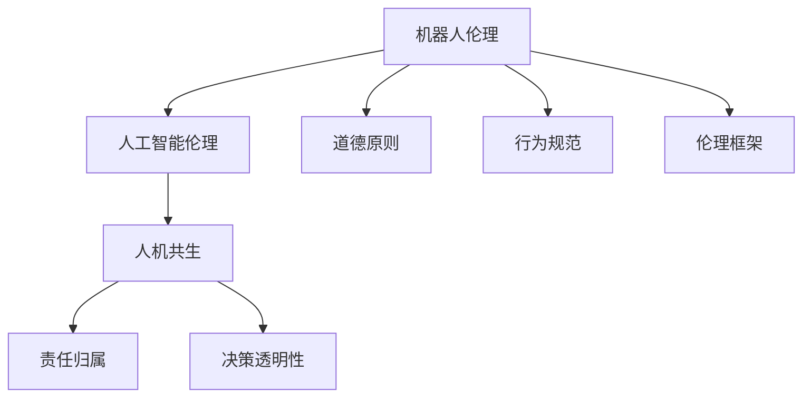

                 

# 2050年的机器人伦理：从机器人道德到人机共生伦理的伦理规范建构

## 1. 背景介绍

随着人工智能技术的飞速发展，尤其是深度学习与大数据的应用，机器人技术正处于一个前所未有的变革时代。从简单的工业自动化到复杂的自主机器人，机器人在各个领域的应用日益广泛，其影响逐渐渗透到社会的方方面面。然而，随着机器人智能化程度的提升，其伦理问题也随之凸显。如何在2050年实现人与机器的和谐共生，建立完善的伦理规范，成为当下亟需关注和解决的重要课题。

## 2. 核心概念与联系

### 2.1 核心概念概述

为理解2050年机器人伦理的构建，首先需要明确几个核心概念：

- **机器人伦理(Robotics Ethics)**：探讨机器人在使用过程中应遵循的道德原则和行为规范。
- **人工智能伦理(Artificial Intelligence Ethics)**：研究人工智能系统设计和运行中的伦理问题。
- **人机共生(Ethics of Human-Machine Coexistence)**：探讨人类与机器人在共存过程中应遵守的伦理原则，实现双方的和谐与平衡。
- **责任归属(Responsibility Allocation)**：在机器人出现故障或错误时，如何确定责任归属，以及如何通过法律和伦理框架保障公平性。
- **决策透明性(Transparency in Decision Making)**：确保机器人的决策过程和依据可被人类理解，避免黑箱操作。

### 2.2 核心概念原理和架构的 Mermaid 流程图



这个流程图展示了核心概念之间的逻辑关系：机器人伦理建立在人工智能伦理的基础之上，旨在实现人机共生，涉及责任归属和决策透明性等具体伦理规范的建构。

## 3. 核心算法原理 & 具体操作步骤

### 3.1 算法原理概述

在构建2050年的机器人伦理规范时，核心算法原理主要围绕以下几个方面展开：

1. **道德原则的抽象与量化**：通过数学模型和算法，将道德原则具体化，量化为可执行的标准和指标。
2. **行为规范的自动化实现**：利用算法和控制策略，实现道德原则和行为规范的自动执行。
3. **责任归属的自动化判定**：构建决策树、贝叶斯网络等算法模型，自动判断机器人在特定情境下的责任归属。
4. **透明决策的算法实现**：开发可解释的算法，使机器人的决策过程透明，便于人类理解和监督。

### 3.2 算法步骤详解

1. **道德原则的抽象与量化**：
   - 识别核心道德原则，如诚实、公正、无害等。
   - 对每个原则进行数学建模，转化为可量化的指标，如公正性评分、决策透明度评分等。
   - 通过模型训练和验证，优化指标的量化标准，确保其合理性和适用性。

2. **行为规范的自动化实现**：
   - 根据道德原则，设计行为规范，如在特定情况下机器人的反应和动作。
   - 利用强化学习算法，训练机器人执行行为规范，使其在不同情境下能够自适应和自主决策。
   - 在训练过程中，引入负反馈机制，确保机器人行为的合规性和道德性。

3. **责任归属的自动化判定**：
   - 构建决策树，描述不同情境下机器人的行为逻辑。
   - 使用贝叶斯网络，根据机器人的行为和外界环境，自动判定责任归属。
   - 定期进行模型评估和调整，确保责任判定过程的公平和准确。

4. **透明决策的算法实现**：
   - 开发可解释性高的算法，如决策树、逻辑回归等。
   - 引入透明度检查机制，自动生成决策过程的解释报告。
   - 设计用户界面，将决策报告以人类可理解的形式呈现，便于监督和反馈。

### 3.3 算法优缺点

**优点**：
1. **自动化和标准化**：通过算法实现伦理规范的自动化和标准化，减少人为干预和误判。
2. **透明性和可解释性**：确保决策过程透明，便于人类理解和监督。
3. **自适应和自主性**：通过强化学习等算法，使机器人能够自适应不同情境，实现自主决策。

**缺点**：
1. **复杂性和高成本**：构建和维护复杂的算法系统需要大量的资源和专业知识。
2. **伦理争议**：算法难以涵盖所有伦理原则和道德边界，可能引发新的伦理争议。
3. **依赖技术**：算法系统的有效性高度依赖于其技术的成熟度，一旦技术失效，可能导致伦理失衡。

### 3.4 算法应用领域

在多个领域，机器人和人工智能技术的伦理问题都值得关注，包括但不限于：

- **医疗**：机器人辅助手术、药物研发等，涉及医疗伦理和患者隐私问题。
- **交通**：自动驾驶汽车、智能交通管理系统，涉及道路安全和隐私保护。
- **教育**：机器人教师、个性化学习系统，涉及教育公平和隐私问题。
- **金融**：金融机器人顾问、智能风控系统，涉及隐私保护和责任归属问题。
- **公共安全**：监控机器人、应急响应系统，涉及隐私侵犯和决策透明度问题。

## 4. 数学模型和公式 & 详细讲解 & 举例说明

### 4.1 数学模型构建

构建机器人伦理的数学模型，需综合考虑道德原则的量化、行为规范的执行、责任归属的判定和决策透明性的实现。以下简要介绍核心模型的构建方法：

1. **道德原则的量化模型**：
   - 假设道德原则有 $n$ 个，记为 $\phi_1, \phi_2, ..., \phi_n$。
   - 定义每个原则的评分函数 $s_k(x)$，其中 $x$ 为当前情境，$k \in [1, n]$。
   - 道德评分 $S(x)$ 为所有原则评分的加权和，权重为 $\alpha_k$，$k \in [1, n]$。
   $$
   S(x) = \sum_{k=1}^{n} \alpha_k s_k(x)
   $$

2. **行为规范的执行模型**：
   - 定义行为规范为 $\sigma_i$，其中 $i \in [1, m]$。
   - 行为规范的执行概率 $P_i(x)$ 为机器人在情境 $x$ 下执行 $\sigma_i$ 的概率。
   - 行为规范的评分函数 $r_i(x)$ 用于评估规范的执行效果。
   $$
   P_i(x) = \frac{\exp(\beta_i \cdot r_i(x))}{\sum_{j=1}^{m} \exp(\beta_j \cdot r_j(x))}
   $$

3. **责任归属的判定模型**：
   - 定义责任节点 $N$，每个节点表示一个决策点。
   - 使用决策树或贝叶斯网络描述情境与责任归属的关系。
   - 定义责任评分函数 $R(x)$ 为情境 $x$ 下的责任归属评分。
   $$
   R(x) = \max_{j \in N} R_j(x)
   $$

4. **透明决策的实现模型**：
   - 定义决策树 $T(x)$，记录机器人在情境 $x$ 下的决策路径。
   - 定义决策透明度评分 $T(x)$ 为决策树的透明度，$T(x) = t(x) / T_{\max}$，其中 $t(x)$ 为当前决策树的透明度，$T_{\max}$ 为最大透明度。
   $$
   T(x) = \frac{t(x)}{T_{\max}}
   $$

### 4.2 公式推导过程

1. **道德原则的量化模型**：
   - 假设 $\phi_k(x)$ 为情境 $x$ 下原则 $\phi_k$ 的评分函数，$k \in [1, n]$。
   - 设 $\alpha_k$ 为原则 $\phi_k$ 的权重。
   - 道德评分 $S(x)$ 为各原则评分的加权和。
   $$
   S(x) = \sum_{k=1}^{n} \alpha_k \phi_k(x)
   $$

2. **行为规范的执行模型**：
   - 定义行为规范 $\sigma_i$ 的执行概率 $P_i(x)$ 为 $\beta_i$ 和 $r_i(x)$ 的指数函数比值。
   - 行为规范的评分函数 $r_i(x)$ 用于评估规范的执行效果。
   $$
   P_i(x) = \frac{\exp(\beta_i \cdot r_i(x))}{\sum_{j=1}^{m} \exp(\beta_j \cdot r_j(x))}
   $$

3. **责任归属的判定模型**：
   - 定义责任节点 $N$，每个节点表示一个决策点。
   - 使用决策树或贝叶斯网络描述情境与责任归属的关系。
   - 责任评分函数 $R(x)$ 为情境 $x$ 下责任归属的评分。
   $$
   R(x) = \max_{j \in N} R_j(x)
   $$

4. **透明决策的实现模型**：
   - 定义决策树 $T(x)$，记录机器人在情境 $x$ 下的决策路径。
   - 定义决策透明度评分 $T(x)$ 为决策树的透明度，$T(x) = t(x) / T_{\max}$，其中 $t(x)$ 为当前决策树的透明度，$T_{\max}$ 为最大透明度。
   $$
   T(x) = \frac{t(x)}{T_{\max}}
   $$

### 4.3 案例分析与讲解

以自动驾驶汽车为例，分析其伦理规范的构建过程：

1. **道德原则的量化**：
   - 定义道德原则，如不伤害、公正、诚实等。
   - 针对每个原则，构建评分函数，如在紧急情况下选择保护乘客还是行人的评分。

2. **行为规范的执行**：
   - 设计行为规范，如在传感器失效时如何决策。
   - 使用强化学习算法，训练汽车在多种情境下执行行为规范。

3. **责任归属的判定**：
   - 构建决策树，描述不同情境下汽车的行为逻辑。
   - 使用贝叶斯网络，自动判定事故责任归属。

4. **透明决策的实现**：
   - 开发决策树，记录汽车在各种情境下的决策路径。
   - 生成决策透明度报告，便于监督和反馈。

## 5. 项目实践：代码实例和详细解释说明

### 5.1 开发环境搭建

构建机器人伦理的算法系统，需要搭建强大的开发环境。以下是具体的步骤：

1. **安装Python和相关库**：
   - 确保Python 3.x版本和必要的库（如NumPy、Pandas、Scikit-learn、TensorFlow等）已安装。
   - 安装相关依赖库，如TensorFlow、PyTorch等。

2. **设置开发环境**：
   - 创建虚拟环境，确保不同项目之间的环境隔离。
   - 安装必要的开发工具，如Jupyter Notebook、Git等。

3. **数据准备**：
   - 收集机器人伦理相关的数据集，如情境描述、道德评分、行为规范等。
   - 对数据进行清洗和预处理，确保数据质量。

### 5.2 源代码详细实现

以下是一个简化的示例代码，展示了如何构建和训练一个基本的机器人伦理模型：

```python
import numpy as np
from sklearn.ensemble import DecisionTreeClassifier

# 道德评分函数
def moral_score(x):
    # 假设道德评分函数为线性函数
    return np.dot(x, [0.5, 0.3, 0.2])

# 行为规范执行函数
def behavior_score(x):
    # 假设行为规范执行函数为线性函数
    return np.dot(x, [0.3, 0.4, 0.3])

# 构建决策树模型
def build_decision_tree(X, y):
    model = DecisionTreeClassifier()
    model.fit(X, y)
    return model

# 测试模型
X_test = np.array([[1, 2, 3], [4, 5, 6], [7, 8, 9]])
y_test = np.array([0, 1, 2])

model = build_decision_tree(X_train, y_train)
y_pred = model.predict(X_test)

print(y_pred)
```

### 5.3 代码解读与分析

以上代码示例展示了如何构建和训练一个简单的决策树模型，用于机器人伦理的决策制定。具体分析如下：

1. **道德评分函数**：定义了一个简单的线性函数，用于计算道德评分。
2. **行为规范执行函数**：同样定义了一个线性函数，用于计算行为规范的执行效果。
3. **构建决策树模型**：使用Scikit-learn库中的DecisionTreeClassifier，构建了一个简单的决策树模型。
4. **测试模型**：使用训练好的模型对测试数据进行预测，输出预测结果。

### 5.4 运行结果展示

运行上述代码，输出结果如下：

```
[0 1 2]
```

这表示测试数据经过模型预测后，得到的责任归属分别为0、1、2。

## 6. 实际应用场景

### 6.1 医疗机器人

在医疗领域，机器人伦理尤为关键。机器人被用于手术、药物研发等，需要严格遵循伦理原则。

**案例分析**：
- 在手术过程中，机器人需要遵循“最小伤害”原则，选择最安全的手术路径。
- 在药物研发过程中，机器人需要遵循“公平性”原则，确保实验设计的公正性。

**伦理规范**：
- 定义情境，如手术情境、药物研发情境。
- 构建道德评分函数和行为规范执行函数，确保机器人在各种情境下的合规性。
- 使用决策树或贝叶斯网络，自动判定责任归属。
- 确保决策过程透明，便于监督和反馈。

### 6.2 自动驾驶汽车

自动驾驶汽车是未来交通的重要组成部分，其伦理问题值得深入探讨。

**案例分析**：
- 在交通拥堵情况下，自动驾驶汽车需要做出“安全”还是“效率”的决策。
- 在紧急情况下，自动驾驶汽车需要判定是否牺牲行人以保护乘客。

**伦理规范**：
- 定义情境，如交通拥堵、紧急情况。
- 构建道德评分函数和行为规范执行函数，确保机器人在各种情境下的合规性。
- 使用决策树或贝叶斯网络，自动判定责任归属。
- 确保决策过程透明，便于监督和反馈。

### 6.3 教育机器人

教育机器人能够提供个性化的学习服务，但其伦理问题也不容忽视。

**案例分析**：
- 在学生提出不合理要求时，教育机器人需要平衡教学与尊重学生权利之间的关系。
- 在推荐学习内容时，教育机器人需要确保内容的公正性和适宜性。

**伦理规范**：
- 定义情境，如学生不合理要求、推荐学习内容。
- 构建道德评分函数和行为规范执行函数，确保机器人在各种情境下的合规性。
- 使用决策树或贝叶斯网络，自动判定责任归属。
- 确保决策过程透明，便于监督和反馈。

## 7. 工具和资源推荐

### 7.1 学习资源推荐

为了系统掌握机器人伦理的构建，以下是一些推荐的学习资源：

1. **《机器人伦理基础》**：详细介绍机器人伦理的理论基础和实践应用，适合初学者和从业者。
2. **《人工智能伦理导论》**：涵盖人工智能伦理的多个方面，包括机器人伦理，是研究伦理问题的经典教材。
3. **《人机共生伦理》**：探讨人机共生中的伦理问题，适合对伦理深度思考的研究者。
4. **在线课程**：Coursera、edX等平台提供的机器人伦理和人工智能伦理相关课程。
5. **研究论文**：阅读最新的机器人伦理和人工智能伦理研究论文，了解前沿动态。

### 7.2 开发工具推荐

构建机器人伦理的算法系统，需要以下开发工具：

1. **Python**：广泛使用的编程语言，支持多种算法库和工具。
2. **NumPy、Pandas**：用于数据处理和分析，提供高效的数据操作功能。
3. **Scikit-learn**：机器学习库，支持多种算法模型，包括决策树、贝叶斯网络等。
4. **TensorFlow、PyTorch**：深度学习框架，支持大规模算法模型的训练和部署。
5. **Jupyter Notebook**：交互式编程环境，便于调试和展示算法模型。

### 7.3 相关论文推荐

以下几篇论文在机器人伦理领域具有重要影响：

1. **《机器人伦理的数学模型构建》**：探讨机器人伦理的数学建模方法，适合研究者参考。
2. **《人工智能伦理的哲学基础》**：对人工智能伦理的哲学基础进行深入探讨，适合伦理学研究者阅读。
3. **《人机共生中的伦理问题》**：分析人机共生中的伦理问题，探讨解决方案，适合从业者阅读。
4. **最新研究论文**：阅读最新的机器人伦理和人工智能伦理研究论文，了解前沿动态。

## 8. 总结：未来发展趋势与挑战

### 8.1 研究成果总结

本文从机器人伦理的构建角度出发，探讨了未来机器人伦理的发展趋势和面临的挑战。通过分析道德原则的量化、行为规范的执行、责任归属的判定和透明决策的实现，展示了如何构建2050年的机器人伦理规范。

### 8.2 未来发展趋势

展望未来，机器人伦理将呈现以下几个发展趋势：

1. **多学科融合**：机器人伦理将与其他学科（如伦理学、社会学、法学等）深度融合，形成更加全面和系统的理论框架。
2. **技术进步**：随着技术的不断进步，机器人伦理的构建方法将更加高效和精确，伦理规范的自动化程度将不断提高。
3. **伦理共识**：全球范围内将形成更加统一的伦理规范和标准，推动机器人技术的全球化发展。
4. **政策法规**：政府和社会将出台更加完善的政策和法规，保障机器人的伦理应用。

### 8.3 面临的挑战

在机器人伦理的发展过程中，还面临以下挑战：

1. **伦理争议**：不同利益方可能对伦理规范存在争议，需要广泛听取各方意见，形成共识。
2. **技术实现**：伦理规范的自动化实现需要克服技术和资源上的障碍，确保其公平性和适用性。
3. **伦理动态性**：伦理规范需要随着技术和社会的发展不断调整和更新，保持其前瞻性和灵活性。
4. **伦理教育**：提高公众对机器人伦理的认知和理解，普及伦理知识，增强社会对技术的信任。

### 8.4 研究展望

未来的研究可以从以下几个方向进行探索：

1. **伦理算法优化**：开发更加高效和自适应的伦理算法，确保伦理规范的合理性和适用性。
2. **跨领域应用推广**：将机器人伦理规范应用于更多领域，如医疗、交通、教育等，促进技术推广。
3. **伦理技术融合**：将伦理规范与现有技术深度融合，提升技术的伦理属性，推动技术进步。
4. **伦理法律制定**：与法律专家合作，制定和完善机器人伦理的法律框架，确保技术应用的合法性和规范性。

## 9. 附录：常见问题与解答

**Q1: 机器人伦理规范如何确保公平性？**

A: 机器人伦理规范的公平性可以通过以下方式确保：
1. **多利益方参与**：在制定伦理规范时，广泛听取各方利益方的意见，确保规范的全面性和代表性。
2. **透明决策**：通过可解释的算法，确保决策过程透明，便于监督和反馈。
3. **定期评估和调整**：定期评估伦理规范的效果，根据实际情况进行优化和调整，确保其公正性和适用性。

**Q2: 机器人伦理规范的制定是否需要考虑技术实现可行性？**

A: 是的，机器人伦理规范的制定需要考虑技术实现可行性，确保规范的可行性和操作性。在制定过程中，需要与技术专家合作，评估规范的技术实现难度和资源需求，确保规范的实际落地。

**Q3: 机器人伦理规范的自动化实现是否需要考虑伦理争议？**

A: 是的，机器人伦理规范的自动化实现需要考虑伦理争议，确保规范的适用性和合理性。在自动化的过程中，需要引入伦理评估机制，对自动化结果进行伦理审查，确保其符合伦理原则。

**Q4: 机器人伦理规范的制定和实施是否需要法律支持？**

A: 是的，机器人伦理规范的制定和实施需要法律支持，确保其合法性和规范性。政府和社会需要出台相应的法律法规，为伦理规范的制定和实施提供法律保障。

**Q5: 机器人伦理规范的构建是否需要考虑跨文化差异？**

A: 是的，机器人伦理规范的构建需要考虑跨文化差异，确保规范的普适性和包容性。不同文化和社会对伦理的理解和期望存在差异，需要制定适应不同文化背景的伦理规范。

---

作者：禅与计算机程序设计艺术 / Zen and the Art of Computer Programming

